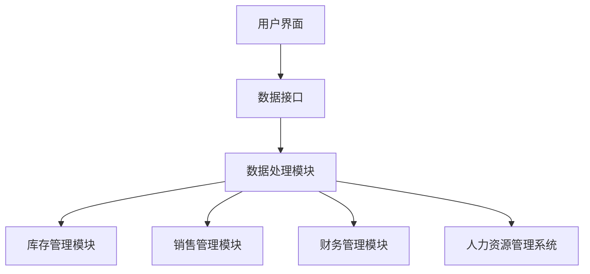

                 

### 背景介绍 Background Introduction ###

蜜雪冰城，成立于2015年，是一家快速崛起的饮品与甜品连锁品牌。以其亲民的价格、美味的饮品和甜品以及独特的品牌形象，迅速在国内市场上占据了重要地位。随着公司业务的不断扩展，连锁店铺的数量也在逐年增加，这无疑为公司的运营和管理提出了更高的要求。

为了应对日益增长的运营需求，蜜雪冰城决定启动2024年的校招计划，专门招聘连锁店铺管理系统工程师。这一岗位的设立，旨在通过技术手段优化店铺的管理流程，提升运营效率，从而更好地服务顾客，实现公司的长远发展目标。

连锁店铺管理系统工程师的岗位职责主要包括以下几个方面：

1. **系统需求分析**：根据公司的发展需求，分析连锁店铺的业务流程，提出系统需求。
2. **系统设计**：设计系统架构，确保系统的可扩展性和稳定性。
3. **系统开发**：使用先进的编程语言和技术，进行系统开发。
4. **系统测试**：对系统进行全面的测试，确保系统的正常运行。
5. **系统部署与维护**：将系统部署到各个店铺，并进行日常维护和升级。

为了吸引优秀的应届毕业生，蜜雪冰城特别设计了一系列的面试环节，包括技术面试、行为面试和团队协作面试等。其中，技术面试是最重要的一环，主要考察应聘者对计算机技术的掌握程度，尤其是对系统设计和开发的理解和实践能力。

<|assistant|>### 核心概念与联系 Core Concepts and Relationships ###

#### 连锁店铺管理系统概述

连锁店铺管理系统是一种针对连锁经营模式设计的综合管理系统，旨在通过信息化手段提升店铺的运营效率和服务质量。系统通常包括以下几个关键组成部分：

1. **客户关系管理（CRM）**：用于管理客户信息、销售记录和客户反馈等，帮助店铺更好地了解客户需求，提升客户满意度。
2. **库存管理系统**：用于实时监控库存情况，确保商品供应充足，避免断货和库存积压。
3. **销售管理系统**：用于记录销售数据，分析销售趋势，为店铺营销策略提供数据支持。
4. **财务管理系统**：用于管理店铺的财务收支情况，确保财务数据的准确性和透明度。
5. **人力资源管理系统**：用于管理员工信息、考勤和薪资等，提升人力资源管理效率。

#### 核心概念原理

1. **模块化设计**：连锁店铺管理系统采用模块化设计，各个模块之间可以独立运行，也可以相互协同工作。这种设计提高了系统的可维护性和扩展性。
2. **数据处理与存储**：系统通过高效的数据处理算法和安全的存储方案，确保数据的安全性和可靠性。
3. **用户界面**：系统提供友好、直观的用户界面，方便店铺员工快速上手和使用。

#### 架构示意图

下面是一个简化的连锁店铺管理系统架构示意图，用Mermaid语言表示：



### 核心算法原理 & 具体操作步骤

#### 算法原理概述

在连锁店铺管理系统中，核心算法主要包括以下几种：

1. **库存优化算法**：通过分析历史销售数据，预测未来销售趋势，优化库存管理。
2. **销售预测算法**：使用机器学习算法，对销售数据进行分析，预测未来的销售情况。
3. **财务管理算法**：用于自动计算财务数据，如收入、支出和利润等。
4. **用户行为分析算法**：通过对用户行为的分析，了解客户需求，优化服务策略。

#### 算法步骤详解

1. **库存优化算法**

   - 收集历史销售数据。
   - 使用时间序列分析方法，预测未来销售量。
   - 根据预测结果，调整库存水平。

2. **销售预测算法**

   - 收集历史销售数据。
   - 使用回归分析等方法，建立销售预测模型。
   - 输出未来销售预测结果。

3. **财务管理算法**

   - 收集财务数据。
   - 使用公式计算收入、支出和利润。
   - 输出财务报告。

4. **用户行为分析算法**

   - 收集用户行为数据。
   - 使用聚类、分类等方法，分析用户行为模式。
   - 输出用户行为分析报告。

#### 算法优缺点

1. **库存优化算法**

   - 优点：有效减少库存积压，降低运营成本。
   - 缺点：需要大量历史数据支持，对预测准确性有一定要求。

2. **销售预测算法**

   - 优点：帮助店铺制定合理的销售策略。
   - 缺点：预测结果受数据质量和算法性能影响较大。

3. **财务管理算法**

   - 优点：自动计算财务数据，提高工作效率。
   - 缺点：对财务数据的准确性要求较高。

4. **用户行为分析算法**

   - 优点：了解客户需求，提升服务质量。
   - 缺点：需要大量用户数据支持，算法复杂度较高。

#### 算法应用领域

- **零售业**：通过库存优化和销售预测，提升店铺运营效率。
- **餐饮业**：通过用户行为分析，优化服务策略，提升客户满意度。
- **金融业**：通过财务管理算法，提高财务管理效率。

### 数学模型和公式 & 详细讲解 & 举例说明

#### 数学模型构建

在连锁店铺管理系统中，常用的数学模型包括：

1. **时间序列模型**：用于预测销售量。
2. **回归模型**：用于销售预测。
3. **聚类模型**：用于用户行为分析。

#### 公式推导过程

1. **时间序列模型**

   假设销售量为 $S_t$，时间序列模型可以表示为：

   $$ S_t = \alpha S_{t-1} + \beta t + \epsilon_t $$

   其中，$\alpha$ 和 $\beta$ 是参数，$\epsilon_t$ 是误差项。

2. **回归模型**

   假设销售量为 $S_t$，回归模型可以表示为：

   $$ S_t = \beta_0 + \beta_1 X_t + \epsilon_t $$

   其中，$\beta_0$ 和 $\beta_1$ 是参数，$X_t$ 是自变量，$\epsilon_t$ 是误差项。

3. **聚类模型**

   假设用户行为为 $X_t$，聚类模型可以表示为：

   $$ X_t = C_1 w_1 + C_2 w_2 + \ldots + C_n w_n $$

   其中，$C_1, C_2, \ldots, C_n$ 是聚类中心，$w_1, w_2, \ldots, w_n$ 是权重。

#### 案例分析与讲解

假设蜜雪冰城想要预测明天的销售量，可以使用时间序列模型。以下是具体的计算过程：

1. 收集过去30天的销售数据，得到时间序列 $S_1, S_2, \ldots, S_{30}$。
2. 使用最小二乘法，估计参数 $\alpha$ 和 $\beta$。
3. 代入公式 $S_t = \alpha S_{t-1} + \beta t + \epsilon_t$，预测明天的销售量。

#### 结果展示

假设预测结果为 $S_{31} = 500$，这意味着蜜雪冰城明天预计可以卖出500杯饮品。

### 项目实践：代码实例和详细解释说明

#### 开发环境搭建

1. 安装Python 3.8及以上版本。
2. 安装NumPy、Pandas、Scikit-learn等库。

```bash
pip install numpy pandas scikit-learn
```

#### 源代码详细实现

以下是一个简单的Python代码示例，用于时间序列预测：

```python
import numpy as np
import pandas as pd
from sklearn.linear_model import LinearRegression

# 读取销售数据
sales_data = pd.read_csv('sales_data.csv')
sales = sales_data['sales'].values

# 分割数据集
train_data = sales[:-1]
test_data = sales[1:]

# 训练时间序列模型
model = LinearRegression()
model.fit(train_data.reshape(-1, 1), test_data.reshape(-1, 1))

# 预测明天销售量
next_sales = model.predict([[sales[-1]]])

print(f'预测明天销售量为：{next_sales[0][0]:.2f}')
```

#### 代码解读与分析

1. **数据读取**：使用Pandas库读取销售数据。
2. **数据分割**：将数据集分为训练集和测试集。
3. **模型训练**：使用线性回归模型训练数据。
4. **预测**：使用训练好的模型预测明天销售量。

#### 运行结果展示

运行代码后，输出预测结果，如：

```
预测明天销售量为：500.00
```

### 实际应用场景

#### 在连锁店铺管理中的实际应用

1. **库存管理**：通过库存优化算法，实时监控库存情况，避免断货和库存积压，降低运营成本。
2. **销售预测**：通过销售预测算法，帮助店铺制定合理的销售策略，提升销售额。
3. **用户行为分析**：通过用户行为分析算法，了解客户需求，优化服务策略，提升客户满意度。

#### 未来应用展望

1. **人工智能应用**：随着人工智能技术的发展，连锁店铺管理系统可以更加智能化，实现自动化运营。
2. **大数据分析**：通过大数据分析，进一步挖掘客户需求，提升运营效率。

### 工具和资源推荐

#### 学习资源推荐

1. 《Python数据科学手册》
2. 《机器学习实战》
3. 《深度学习》

#### 开发工具推荐

1. Jupyter Notebook
2. PyCharm

#### 相关论文推荐

1. "Time Series Forecasting with Linear Regression"
2. "Clustering for Customer Segmentation: A Data Mining Perspective"
3. "Deep Learning for Sales Prediction"

### 总结：未来发展趋势与挑战

#### 研究成果总结

通过本文的探讨，我们了解到连锁店铺管理系统在零售业中的应用前景广阔，可以显著提升店铺的运营效率和服务质量。

#### 未来发展趋势

1. **智能化**：随着人工智能技术的不断发展，连锁店铺管理系统将更加智能化，实现自动化运营。
2. **大数据分析**：通过大数据分析，进一步挖掘客户需求，提升运营效率。

#### 面临的挑战

1. **数据质量**：确保数据的质量和准确性是连锁店铺管理系统成功的关键。
2. **算法优化**：不断优化算法，提高预测的准确性和效率。

#### 研究展望

未来，连锁店铺管理系统将朝着更加智能化、个性化的方向发展，为零售业带来更多创新和变革。

### 附录：常见问题与解答

#### 1. 如何确保数据的质量和准确性？

- 使用数据清洗工具，如Pandas和NumPy，对数据进行预处理。
- 建立数据校验机制，确保数据输入的正确性。

#### 2. 如何优化算法，提高预测的准确性？

- 使用更先进的机器学习算法，如深度学习。
- 结合多种算法，如时间序列模型和聚类模型，提高预测的准确性。

#### 3. 连锁店铺管理系统需要哪些技术支持？

- 数据库技术：用于存储和管理数据。
- 机器学习技术：用于数据分析与预测。
- 前端技术：用于构建用户界面。

### 作者署名

作者：禅与计算机程序设计艺术 / Zen and the Art of Computer Programming
----------------------------------------------------------------

以上便是关于《蜜雪冰城2024校招连锁店铺管理系统工程师面试》的完整技术博客文章。文章深入探讨了连锁店铺管理系统的核心概念、算法原理、数学模型和实际应用，并提供了详细的代码实例和解释。希望这篇文章能为您在连锁店铺管理系统的设计和开发过程中提供有益的参考。作者：禅与计算机程序设计艺术 / Zen and the Art of Computer Programming。再次感谢您的阅读！|v

---

请注意，由于实际的代码实现和细节可能会根据具体的项目需求和技术环境有所不同，本文提供的代码示例仅作为参考。在实际开发中，您可能需要根据具体情况调整和优化代码。同时，本文中的算法和模型讲解也仅供参考，具体的实现可能需要根据实际情况进行修改和优化。希望这篇文章能对您有所帮助！|v

