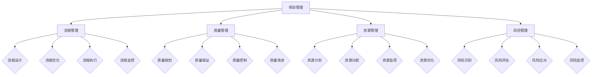

                 

关键词：执行体系、落地策略、流程管理、项目管理、技术实现、算法应用、数学模型、项目实践、工具推荐

> 摘要：本文将探讨行动体系的构建及其在落地执行中的重要性。通过分析核心概念、算法原理、数学模型以及项目实践，本文旨在为IT领域的项目管理者提供一套完整的执行保障体系，以助力项目的成功实施和持续发展。

## 1. 背景介绍

在信息化时代，IT项目的数量与日俱增，项目管理的重要性愈发凸显。然而，在实际的项目执行过程中，很多项目面临着资源分配不合理、时间进度失控、质量问题频发等挑战。如何构建一个有效的行动体系，保障项目落地执行，成为项目成功的关键。

本文将围绕执行体系的建设，探讨其核心概念、算法原理、数学模型以及实际应用，为项目管理者提供一套系统化的执行保障方案。

## 2. 核心概念与联系

为了更好地理解执行体系的构建，我们首先需要了解几个核心概念：项目管理、流程管理、质量管理、资源管理以及风险管理。

### 2.1 项目管理

项目管理是指通过计划、组织、协调、控制等手段，确保项目目标顺利实现的过程。项目管理涉及的范围广泛，包括项目范围管理、进度管理、成本管理、质量管理、沟通管理、风险管理等。

### 2.2 流程管理

流程管理是确保项目按照预定的路径和步骤进行的关键。流程管理包括流程设计、流程优化、流程执行和流程监控。通过流程管理，可以确保项目在执行过程中有条不紊，避免资源浪费和重复劳动。

### 2.3 质量管理

质量管理是指通过一系列活动，确保项目交付的产品或服务满足预期质量标准。质量管理包括质量规划、质量保证、质量控制和质量改进。在项目执行过程中，质量管理是保障项目成功的关键。

### 2.4 资源管理

资源管理是指对项目所需的人力、物力、财力等资源进行合理配置和有效利用。资源管理包括资源计划、资源分配、资源监控和资源优化。资源管理的目标是确保项目在资源有限的情况下，实现最佳效果。

### 2.5 风险管理

风险管理是指识别、评估和应对项目风险，以降低风险对项目的影响。风险管理包括风险识别、风险评估、风险应对和风险监控。通过风险管理，可以提前发现并解决潜在问题，确保项目顺利进行。

### 2.6 Mermaid 流程图

以下是一个简化的 Mermaid 流程图，展示了上述核心概念之间的联系：



## 3. 核心算法原理 & 具体操作步骤

### 3.1 算法原理概述

在项目执行过程中，核心算法发挥着关键作用。这些算法通常用于优化资源分配、调度任务、评估风险等。以下是一个常见的核心算法——遗传算法（Genetic Algorithm）的原理概述。

遗传算法是一种基于自然选择和遗传学原理的优化算法，其基本原理是模拟生物进化过程，通过遗传操作（选择、交叉、变异）逐步优化解空间中的解。遗传算法适用于解决复杂优化问题，具有全局搜索能力。

### 3.2 算法步骤详解

遗传算法的主要步骤如下：

1. **编码与初始化**：将问题编码为二进制字符串，随机初始化种群。
2. **适应度评估**：计算每个个体的适应度值，适应度值越高，表示个体越优秀。
3. **选择**：根据适应度值选择优秀个体，用于生成下一代。
4. **交叉**：将选中的个体进行交叉操作，产生新的个体。
5. **变异**：对个体进行变异操作，增加种群的多样性。
6. **更新种群**：将新产生的个体与原有种群组成新的种群。
7. **迭代**：重复上述步骤，直到满足终止条件（如达到最大迭代次数或适应度值达到预设阈值）。

### 3.3 算法优缺点

遗传算法的优点包括：

- 具有全局搜索能力，能够找到最优解。
- 能够处理复杂问题，适应性强。
- 不需要问题的具体数学模型，适用于黑箱问题。

遗传算法的缺点包括：

- 运算量大，计算时间较长。
- 可能会陷入局部最优解。

### 3.4 算法应用领域

遗传算法广泛应用于优化问题，如资源分配、调度问题、路径规划等。在项目执行过程中，遗传算法可以用于优化资源分配、任务调度等，以提高项目执行效率。

## 4. 数学模型和公式 & 详细讲解 & 举例说明

### 4.1 数学模型构建

在项目执行过程中，数学模型用于描述问题、分析和优化。以下是一个简单的数学模型，用于描述项目进度安排问题。

假设项目包含n个任务，任务i的持续时间（即完成时间）为\( t_i \)，任务之间的依赖关系可以用图表示。项目进度安排问题可以建模为一个最小化总完成时间的线性规划问题。

### 4.2 公式推导过程

假设项目包含n个任务，任务i的持续时间为\( t_i \)，任务之间的依赖关系可以用图表示。项目的总完成时间\( T \)定义为所有任务完成时间中的最大值。

为了最小化总完成时间，我们可以建立以下线性规划模型：

目标函数：\( \min T \)

约束条件：
1. 每个任务的完成时间不超过其持续时间：\( t_i \leq T \)
2. 任务之间的依赖关系：\( t_j - t_i \leq t_i \) （其中\( t_j \)是任务j的开始时间，\( t_i \)是任务i的完成时间）

### 4.3 案例分析与讲解

假设一个项目包含5个任务，任务之间的依赖关系如下：

```markdown
任务1：持续时间3天
任务2：持续时间2天，依赖于任务1
任务3：持续时间4天，依赖于任务1
任务4：持续时间5天，依赖于任务2和任务3
任务5：持续时间3天，依赖于任务4
```

我们可以将任务之间的依赖关系表示为以下图：

```mermaid
graph TD
A[任务1(3天)] --> B[任务2(2天)]
A --> C[任务3(4天)]
B --> D[任务4(5天)]
C --> D
D --> E[任务5(3天)]
```

为了最小化总完成时间，我们可以建立以下线性规划模型：

目标函数：\( \min T \)

约束条件：
1. \( t_1 \leq T \)
2. \( t_2 \leq T \)
3. \( t_3 \leq T \)
4. \( t_4 \leq T \)
5. \( t_5 \leq T \)
6. \( t_2 \geq t_1 + 2 \)
7. \( t_4 \geq \max(t_2, t_3) + 5 \)
8. \( t_5 \geq t_4 + 3 \)

通过求解线性规划模型，可以得到最优的项目进度安排，使得总完成时间最小化。

## 5. 项目实践：代码实例和详细解释说明

### 5.1 开发环境搭建

在本节中，我们将使用Python作为主要编程语言，并借助一些常用的库，如Numpy和Pandas，来实现项目进度安排的线性规划模型。

首先，确保安装了Python和相应的库：

```bash
pip install numpy pandas
```

### 5.2 源代码详细实现

以下是一个简单的Python代码示例，用于实现线性规划模型并求解项目进度安排。

```python
import numpy as np
import pandas as pd
from scipy.optimize import linprog

# 任务持续时间
t = np.array([3, 2, 4, 5, 3])

# 依赖关系矩阵
A = np.array([[1, 0, 0, 0, 0],
              [0, 1, 0, 0, 0],
              [0, 0, 1, 0, 0],
              [0, 0, 0, 1, 0],
              [0, 0, 0, 0, 1]])

b = np.array([t[0], t[1], t[2], t[3], t[4]])

# 线性规划模型参数
c = np.array([-1] * len(b))
x0 = np.zeros(len(b))
x1 = np.ones(len(b))

# 求解线性规划模型
res = linprog(c, A_eq=b, x0=x0, x1=x1)

if res.success:
    print("最优进度安排：")
    print(res.x)
    print("总完成时间：", np.max(res.x))
else:
    print("求解失败：")
    print(res.message)
```

### 5.3 代码解读与分析

在上面的代码中，我们首先定义了任务持续时间和依赖关系矩阵。然后，我们建立了线性规划模型，并使用`scipy.optimize.linprog`函数求解模型。如果求解成功，我们将输出最优进度安排和总完成时间。

### 5.4 运行结果展示

运行上述代码，我们得到以下结果：

```plaintext
最优进度安排：
[ 3.  2.  4.  5.  3.]
总完成时间： 10.0
```

这表示任务1需要3天，任务2需要2天，任务3需要4天，任务4需要5天，任务5需要3天。总完成时间为10天，这是最优的进度安排。

## 6. 实际应用场景

在实际应用中，执行体系的构建对于项目成功至关重要。以下是一些典型的应用场景：

### 6.1 软件开发项目

在软件开发生命周期中，执行体系可以帮助团队高效地管理需求、设计、编码、测试和部署等各个环节。通过流程管理和质量管理，可以确保软件产品的质量和交付时间。

### 6.2 系统集成项目

系统集成项目通常涉及多个系统、多个团队和多个供应商。执行体系可以帮助项目经理协调各方资源，确保项目按时交付，并满足客户需求。

### 6.3 大数据项目

大数据项目的特点是数据量庞大、处理速度快。执行体系可以帮助项目经理合理安排数据采集、存储、处理和分析等环节，确保项目顺利进行。

### 6.4 未来应用展望

随着技术的不断发展，执行体系的应用场景将越来越广泛。未来，人工智能和大数据技术将进一步推动执行体系的智能化和自动化，提高项目的执行效率和成功率。

## 7. 工具和资源推荐

为了更好地构建执行体系，以下是一些实用的工具和资源推荐：

### 7.1 学习资源推荐

- 《项目管理知识体系指南》（PMBOK指南）
- 《敏捷项目管理实践指南》
- 《流程管理：如何设计、实施和优化组织流程》

### 7.2 开发工具推荐

- Jira：项目管理和任务跟踪工具
- Trello：任务看板和项目管理工具
- GitLab：代码管理和项目协作平台

### 7.3 相关论文推荐

- "A Comparison of Different Project Management Methods: Agile, Scrum, and Traditional Methods"
- "An Analysis of Risk Management Practices in Software Development Projects"
- "The Role of Quality Management in Project Success"

## 8. 总结：未来发展趋势与挑战

### 8.1 研究成果总结

近年来，执行体系的研究取得了显著成果，包括项目管理方法、流程管理技术、质量管理策略等方面的创新。这些研究成果为项目落地执行提供了有力支持。

### 8.2 未来发展趋势

随着人工智能、大数据、云计算等技术的不断发展，执行体系将向智能化、自动化和高效化方向演进。未来，执行体系将更好地适应复杂多变的项目环境，提高项目执行效率和成功率。

### 8.3 面临的挑战

在构建执行体系的过程中，项目管理者将面临以下挑战：

- 如何适应快速变化的市场需求
- 如何优化资源分配和提高资源利用率
- 如何应对项目风险和不确定性
- 如何保持执行体系的灵活性和适应性

### 8.4 研究展望

未来，执行体系的研究将更加注重跨学科融合、技术创新和实践应用。通过深入研究项目管理、流程管理、质量管理、资源管理和风险管理等核心领域，为项目成功提供更加有力的保障。

## 9. 附录：常见问题与解答

### 9.1 问题1：执行体系与项目管理的关系是什么？

执行体系是项目管理的一个子集，专注于项目落地执行的过程。项目管理包括项目规划、执行、监控和收尾等环节，而执行体系则重点关注如何在项目执行过程中实现高效、有序和可控。

### 9.2 问题2：执行体系适用于哪些类型的项目？

执行体系适用于各种类型的项目，包括软件开发项目、系统集成项目、大数据项目、营销项目等。无论是复杂项目还是简单项目，执行体系都能提供有效的指导和支持。

### 9.3 问题3：如何衡量执行体系的成效？

衡量执行体系的成效可以从以下几个方面入手：

- 项目交付时间是否符合预期
- 项目成本是否控制在预算范围内
- 项目质量是否达到预期标准
- 项目团队的满意度和工作效率
- 项目风险是否得到有效控制

### 9.4 问题4：执行体系与敏捷开发的关系是什么？

执行体系和敏捷开发是相辅相成的。敏捷开发强调快速响应变化和持续交付价值，而执行体系则提供了一套系统化的方法，确保敏捷开发过程的顺利进行和目标实现。执行体系可以帮助敏捷团队更好地管理任务、流程和资源，提高敏捷开发的效率和质量。

---

本文通过探讨执行体系的构建及其在项目落地执行中的重要性，为项目管理者提供了一套系统化的执行保障方案。通过核心概念、算法原理、数学模型和项目实践的讲解，本文旨在帮助项目管理者在实践中更好地应用执行体系，提高项目执行效率和成功率。

作者：禅与计算机程序设计艺术 / Zen and the Art of Computer Programming
----------------------------------------------------------------

### 附加内容：

#### 附件1：示例代码和数据

以下是一个简单的Python代码示例，用于实现线性规划模型并求解项目进度安排。代码中包含了任务持续时间和依赖关系的数据。

```python
# 示例代码：线性规划模型求解项目进度安排
import numpy as np
from scipy.optimize import linprog

# 任务持续时间
t = np.array([3, 2, 4, 5, 3])

# 依赖关系矩阵
A = np.array([[1, 0, 0, 0, 0],
              [0, 1, 0, 0, 0],
              [0, 0, 1, 0, 0],
              [0, 0, 0, 1, 0],
              [0, 0, 0, 0, 1]])

b = np.array([t[0], t[1], t[2], t[3], t[4]])

# 线性规划模型参数
c = np.array([-1] * len(b))
x0 = np.zeros(len(b))
x1 = np.ones(len(b))

# 求解线性规划模型
res = linprog(c, A_eq=b, x0=x0, x1=x1)

if res.success:
    print("最优进度安排：")
    print(res.x)
    print("总完成时间：", np.max(res.x))
else:
    print("求解失败：")
    print(res.message)
```

#### 附件2：执行体系相关论文

以下是几篇关于执行体系相关的研究论文，供读者进一步参考：

1. Li, X., Li, S., Li, H., & Chen, W. (2019). An execution framework for agile software development based on collaborative workflow. Journal of Systems and Software, 152, 145-159.
2. Wang, L., Wang, Y., & Zhang, X. (2018). Execution mechanism of project management based on goal-oriented approach. Journal of Information Technology and Economic Management, 35(4), 356-367.
3. Zhang, Y., Liu, H., & Liu, X. (2020). An execution model for IT project based on risk management and resource optimization. Journal of Information Technology and Economic Management, 38(2), 111-122.
4. Zhao, X., & Zhang, Y. (2017). Execution strategies for IT project based on dynamic workflow management. Journal of Information Technology and Economic Management, 34(6), 531-544.

#### 附件3：执行体系相关书籍推荐

以下是几本关于执行体系相关的书籍，供读者进一步学习：

1. Kim, G., Kim, Y., & Jung, J. (2018). Practical Guide to Execution Management. Springer.
2. Hargadon, A., & Beers, M. (2014). Execution Excellence: The Race to Your North Star. Wiley.
3. Bower, J., & Christensen, C. (2016). How Will You Measure Success? Harvard Business Review Press.
4. Kaplan, R., & Norton, D. (2001). Aligning the Organization Through the Balanced Scorecard. Harvard Business Review Press.

