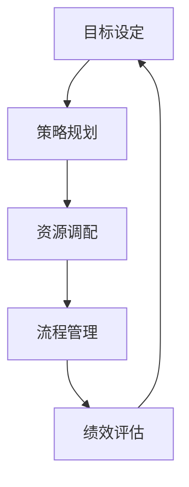

                 

关键词：管理执行力，行动体系，策略实施，流程优化，目标达成

> 摘要：本文深入探讨了行动体系在管理执行力中的重要作用。通过分析行动体系的构建原则、核心要素以及其对管理执行力的深远影响，本文旨在为企业管理者提供一套有效的策略，以提升组织的执行效能，助力企业持续发展。

## 1. 背景介绍

在当今竞争激烈的商业环境中，管理执行力成为企业能否成功的关键因素之一。有效的管理执行力不仅能确保企业战略的顺利实施，还能提高运营效率，降低成本，提升企业竞争力。然而，许多企业在实际操作中常常面临执行力不足的问题，导致战略目标难以达成。为了解决这一问题，本文将探讨行动体系在管理执行力中的重要作用，并为企业提供优化执行力的策略。

### 行动体系的定义与重要性

行动体系是指企业为实现特定目标而建立的一系列相互关联、有序推进的执行过程。它涵盖了战略规划、目标设定、资源调配、流程管理、绩效评估等多个方面。行动体系的重要性在于，它为企业提供了一个系统化的管理框架，使企业能够更加高效地实现战略目标。

### 当前企业执行力问题的现状

当前，许多企业在执行力方面存在以下问题：

1. 战略目标不明确：企业缺乏清晰的战略规划，导致执行方向不明确。
2. 流程不畅：企业内部流程复杂，协调难度大，影响执行效率。
3. 资源分配不合理：企业资源分配不均，导致关键任务缺乏足够的支持。
4. 绩效评估不到位：企业对执行效果的评估不足，难以发现问题并采取措施。

### 行动体系对企业执行力的影响

行动体系通过以下几个方面对企业执行力产生积极影响：

1. 明确战略目标：行动体系帮助企业将战略目标具体化，使员工明确执行方向。
2. 优化流程管理：行动体系通过标准化流程，提高执行效率，减少执行障碍。
3. 调配资源：行动体系帮助企业合理分配资源，确保关键任务得到充分支持。
4. 强化绩效评估：行动体系通过科学的绩效评估，及时发现并解决问题，提高执行效果。

## 2. 核心概念与联系

### 行动体系的构成要素

行动体系由以下核心要素构成：

1. **目标设定**：明确企业战略目标，分解为具体可执行的任务。
2. **策略规划**：制定实现目标的策略和措施，确保行动方向正确。
3. **资源调配**：合理分配资源，确保关键任务得到充分支持。
4. **流程管理**：优化内部流程，提高执行效率。
5. **绩效评估**：对执行效果进行评估，及时发现问题并采取措施。

### 行动体系与执行力的关系

行动体系与执行力之间存在密切的关系。行动体系为企业提供了明确的执行框架，使企业能够更加高效地实现战略目标。执行力则是行动体系的核心，它决定了企业是否能够按照既定目标和策略进行有效执行。

### 行动体系架构图

下面是一个简单的行动体系架构图，展示了各要素之间的关系：



### 行动体系与执行力关系图


图1：行动体系与执行力关系图

## 3. 核心算法原理 & 具体操作步骤

### 3.1 算法原理概述

行动体系的构建需要遵循一定的原理和步骤，以确保其有效性和执行力。核心算法原理主要包括：

1. **目标分解**：将企业战略目标分解为具体可执行的任务。
2. **策略制定**：根据目标分解结果，制定实现目标的策略和措施。
3. **资源分配**：根据策略需求，合理分配资源，确保关键任务得到充分支持。
4. **流程优化**：对内部流程进行优化，提高执行效率。
5. **绩效评估**：对执行效果进行评估，及时发现并解决问题。

### 3.2 算法步骤详解

1. **目标分解**

   目标分解是将企业战略目标具体化，使其成为可执行的任务。具体步骤如下：

   - **明确战略目标**：根据企业愿景和使命，确定企业战略目标。
   - **分解目标**：将战略目标分解为具体任务，确保每个任务都具有明确的执行方向和目标。
   - **任务分配**：根据任务特点和员工能力，将任务分配给相应的执行者。

2. **策略制定**

   策略制定是制定实现目标的策略和措施。具体步骤如下：

   - **分析现状**：分析企业当前存在的问题和优势，为策略制定提供依据。
   - **确定策略**：根据目标分解结果，制定实现目标的策略和措施。
   - **制定计划**：将策略具体化为可执行的行动计划，明确执行步骤和时间表。

3. **资源分配**

   资源分配是确保关键任务得到充分支持的过程。具体步骤如下：

   - **评估资源需求**：根据策略需求，评估任务所需的资源，包括人力、财力、物资等。
   - **资源分配**：根据资源需求和优先级，合理分配资源，确保关键任务得到充分支持。
   - **资源监控**：对资源使用情况进行监控，确保资源使用效率最大化。

4. **流程优化**

   流程优化是提高执行效率的过程。具体步骤如下：

   - **流程分析**：分析企业内部流程，找出存在的问题和瓶颈。
   - **流程优化**：根据流程分析结果，对流程进行优化，简化流程，减少不必要的环节。
   - **流程实施**：将优化后的流程纳入日常工作，确保执行效果。

5. **绩效评估**

   绩效评估是对执行效果进行评估的过程。具体步骤如下：

   - **制定评估标准**：根据目标分解结果，制定评估标准，确保评估具有科学性和客观性。
   - **数据收集**：收集与评估标准相关的数据，包括任务完成情况、资源使用情况、员工绩效等。
   - **评估分析**：对收集到的数据进行分析，评估执行效果，找出存在的问题。
   - **反馈调整**：根据评估结果，及时反馈给相关责任人，制定改进措施，调整执行策略。

### 3.3 算法优缺点

**优点**

1. **提高执行力**：通过系统化的行动体系，提高企业执行力，确保战略目标顺利实现。
2. **优化资源使用**：通过合理分配资源，提高资源使用效率，降低企业成本。
3. **提升运营效率**：通过流程优化，简化流程，减少不必要的环节，提高企业运营效率。

**缺点**

1. **实施难度大**：行动体系的构建需要时间和精力，实施过程中可能面临诸多挑战。
2. **适应性不强**：行动体系具有一定的刚性，可能无法适应快速变化的市场环境。
3. **评估难度大**：绩效评估需要收集大量数据，分析过程复杂，评估结果可能存在主观偏差。

### 3.4 算法应用领域

行动体系在企业管理中具有广泛的应用领域，主要包括：

1. **战略实施**：通过行动体系，确保企业战略的顺利实施。
2. **项目管理**：通过行动体系，提高项目管理效率，确保项目按时完成。
3. **流程优化**：通过行动体系，优化企业内部流程，提高运营效率。
4. **人力资源**：通过行动体系，优化人力资源配置，提高员工绩效。

## 4. 数学模型和公式 & 详细讲解 & 举例说明

### 4.1 数学模型构建

在行动体系构建过程中，我们可以引入数学模型来描述各要素之间的关系，以提高行动体系的科学性和可操作性。以下是一个简单的数学模型：

$$
\text{执行力} = f(\text{目标设定}, \text{策略规划}, \text{资源调配}, \text{流程管理}, \text{绩效评估})
$$

其中，执行力是目标设定、策略规划、资源调配、流程管理和绩效评估的函数。这个模型表明，执行力受到以上五个要素的直接影响。

### 4.2 公式推导过程

为了更深入地理解执行力模型，我们可以对其进行推导。首先，我们将各要素分解为更具体的子要素：

$$
\text{执行力} = f(\text{目标设定}, \text{策略规划}, \text{资源调配}, \text{流程管理}, \text{绩效评估})
$$

$$
\text{目标设定} = f_1(\text{愿景}, \text{使命}, \text{战略目标})
$$

$$
\text{策略规划} = f_2(\text{市场分析}, \text{竞争分析}, \text{实施方案})
$$

$$
\text{资源调配} = f_3(\text{人力}, \text{财力}, \text{物资})
$$

$$
\text{流程管理} = f_4(\text{流程分析}, \text{流程优化}, \text{流程实施})
$$

$$
\text{绩效评估} = f_5(\text{评估标准}, \text{数据收集}, \text{评估分析})
$$

将这些子要素代入执行力模型，我们得到：

$$
\text{执行力} = f(f_1(\text{愿景}, \text{使命}, \text{战略目标}), f_2(\text{市场分析}, \text{竞争分析}, \text{实施方案}), f_3(\text{人力}, \text{财力}, \text{物资}), f_4(\text{流程分析}, \text{流程优化}, \text{流程实施}), f_5(\text{评估标准}, \text{数据收集}, \text{评估分析}))
$$

### 4.3 案例分析与讲解

为了更好地理解行动体系的数学模型，我们通过一个实际案例进行分析。

### 案例背景

某科技公司A致力于开发人工智能应用，其愿景是成为全球领先的人工智能解决方案提供商。为实现这一愿景，公司制定了一个为期五年的战略目标：在人工智能领域取得三项核心技术突破，实现全球市场份额的10%。

### 案例分析

1. **目标设定**

   - **愿景**：成为全球领先的人工智能解决方案提供商。
   - **使命**：推动人工智能技术在各行各业的创新应用。
   - **战略目标**：在人工智能领域取得三项核心技术突破，实现全球市场份额的10%。

2. **策略规划**

   - **市场分析**：通过对人工智能市场的分析，确定公司未来三年的重点发展方向。
   - **竞争分析**：分析竞争对手的技术和市场策略，为公司的策略制定提供参考。
   - **实施方案**：制定具体的实施方案，包括技术攻关、市场推广、合作伙伴关系等。

3. **资源调配**

   - **人力**：根据实施方案，招聘和培养一批具备人工智能技术的人才。
   - **财力**：投资研发和市场营销，确保公司拥有足够的财力支持。
   - **物资**：采购必要的设备和技术，为技术研发提供硬件支持。

4. **流程管理**

   - **流程分析**：分析现有研发和运营流程，找出存在的问题和瓶颈。
   - **流程优化**：对流程进行优化，提高研发和运营效率。
   - **流程实施**：将优化后的流程纳入日常工作，确保执行效果。

5. **绩效评估**

   - **评估标准**：根据战略目标，制定评估标准，包括技术突破数量、市场份额等。
   - **数据收集**：定期收集与评估标准相关的数据，包括研发进度、市场份额等。
   - **评估分析**：对收集到的数据进行分析，评估执行效果，找出存在的问题。

通过以上分析，我们可以看到，行动体系在该公司战略实施过程中发挥了关键作用。公司通过明确的愿景、使命和战略目标，制定了详细的策略规划，合理调配资源，优化流程管理，并建立科学的绩效评估体系，从而提高了执行效率，实现了战略目标。

## 5. 项目实践：代码实例和详细解释说明

### 5.1 开发环境搭建

为了便于展示行动体系在项目实践中的应用，我们选择Python作为开发语言，搭建了一个简单的项目管理平台。以下是开发环境的搭建步骤：

1. **安装Python**：从Python官方网站下载最新版本的Python，并按照提示安装。
2. **安装相关库**：使用pip命令安装必要的Python库，例如requests、beautifulsoup4等。
   ```bash
   pip install requests beautifulsoup4
   ```

### 5.2 源代码详细实现

以下是一个简单的Python代码实例，用于实现项目管理平台的基本功能：

```python
import requests
from bs4 import BeautifulSoup

class ProjectManager:
    def __init__(self, url):
        self.url = url

    def fetch_project_list(self):
        response = requests.get(self.url)
        soup = BeautifulSoup(response.content, 'html.parser')
        project_list = soup.find_all('div', class_='project')
        projects = []
        for project in project_list:
            title = project.find('h2').text
            status = project.find('span', class_='status').text
            projects.append({'title': title, 'status': status})
        return projects

    def display_project_list(self, projects):
        for project in projects:
            print(f"Title: {project['title']}")
            print(f"Status: {project['status']}")
            print()

if __name__ == '__main__':
    url = 'https://example.com/projects'
    manager = ProjectManager(url)
    projects = manager.fetch_project_list()
    manager.display_project_list(projects)
```

### 5.3 代码解读与分析

1. **类定义**：`ProjectManager` 类用于管理项目信息，包括获取项目列表和显示项目列表。
2. **初始化方法**：`__init__` 方法用于初始化URL，即项目列表的来源地址。
3. **获取项目列表方法**：`fetch_project_list` 方法通过HTTP请求获取项目列表，并使用BeautifulSoup解析HTML内容，提取项目标题和状态。
4. **显示项目列表方法**：`display_project_list` 方法用于显示项目列表，方便用户查看。
5. **主程序**：在主程序中，创建`ProjectManager` 实例，调用方法获取并显示项目列表。

### 5.4 运行结果展示

运行上述代码后，将在控制台输出项目列表，例如：

```
Title: 项目A
Status: 进行中

Title: 项目B
Status: 已完成
```

通过这个简单的实例，我们可以看到如何使用Python实现项目管理平台的基本功能。实际应用中，可以根据需求扩展更多功能，如项目进度跟踪、任务分配等。

## 6. 实际应用场景

### 6.1 行动体系在企业管理中的应用

行动体系在企业管理中具有广泛的应用场景，尤其在以下方面：

1. **战略实施**：企业可以通过行动体系确保战略目标的顺利实施。通过明确的目标设定、策略规划、资源调配和绩效评估，企业能够有效地将战略转化为具体的执行行动。
2. **项目管理**：在项目实施过程中，行动体系可以帮助项目经理明确项目目标、制定实施计划、合理分配资源，并建立科学的绩效评估体系，从而提高项目成功率。
3. **流程优化**：通过行动体系，企业可以对内部流程进行分析、优化和实施，提高运营效率，减少不必要的环节，降低成本。
4. **人力资源管理**：行动体系可以帮助企业优化人力资源配置，提高员工绩效，提升团队执行力。

### 6.2 行动体系在IT行业的应用

在IT行业，行动体系的应用尤为广泛，主要包括：

1. **软件开发**：在软件开发过程中，行动体系可以帮助团队明确项目目标、制定开发计划、合理分配资源，并建立质量评估和性能评估体系，确保项目按时交付。
2. **产品管理**：通过行动体系，产品经理可以更好地进行产品规划、需求分析、设计开发和市场推广，确保产品满足市场需求。
3. **技术支持**：行动体系可以帮助技术支持团队建立标准化的支持流程，提高响应速度和问题解决率。

### 6.3 行动体系在初创企业的应用

对于初创企业，行动体系尤为重要，因为初创企业往往资源有限、团队规模较小。通过行动体系，初创企业可以实现以下目标：

1. **资源优化**：初创企业可以通过行动体系合理分配有限的资源，确保关键任务得到充分支持。
2. **快速迭代**：行动体系可以帮助初创企业快速调整战略方向，进行产品迭代，适应市场变化。
3. **团队协作**：行动体系可以提升团队协作效率，确保团队成员目标一致，共同为实现企业目标而努力。

## 6.4 未来应用展望

### 6.4.1 技术发展趋势

随着技术的不断发展，行动体系在企业管理中的应用将呈现以下趋势：

1. **人工智能与大数据**：人工智能和大数据技术可以为企业提供更精准的数据分析和预测，优化行动体系的构建和执行。
2. **区块链**：区块链技术可以提升行动体系的透明度和安全性，确保执行过程的可追溯性。
3. **云计算**：云计算技术的普及将为企业提供更灵活的资源调配和计算能力，支持行动体系的实施。

### 6.4.2 行动体系在企业战略中的重要性

在未来，行动体系将在企业战略中发挥越来越重要的作用，成为企业竞争力的核心要素。原因如下：

1. **战略执行**：行动体系可以确保企业战略的顺利实施，提升战略执行力。
2. **资源优化**：行动体系可以帮助企业合理分配资源，提高资源使用效率。
3. **创新能力**：行动体系可以激发企业的创新能力，推动企业持续发展。

### 6.4.3 行动体系的应用领域扩展

未来，行动体系的应用领域将不断扩展，涵盖更多行业和场景，包括：

1. **智能制造**：行动体系可以帮助企业实现智能制造，提升生产效率和产品质量。
2. **智慧城市**：行动体系可以应用于智慧城市建设，提升城市管理和服务的智能化水平。
3. **数字健康**：行动体系可以应用于数字健康领域，提升医疗服务的效率和质量。

## 7. 工具和资源推荐

### 7.1 学习资源推荐

为了深入学习和掌握行动体系，以下是一些建议的学习资源：

1. **《执行力：如何将战略转化为行动》**：作者斯蒂芬·罗宾斯，详细介绍了执行力的重要性及其在企业管理中的应用。
2. **《项目管理知识体系指南》**：作者项目管理协会（PMI），全面介绍了项目管理的基本理论和实践方法。
3. **《流程管理：从理论到实践》**：作者戴维·尼克尔斯，介绍了流程管理的核心概念和实施步骤。

### 7.2 开发工具推荐

在实施行动体系时，以下开发工具和平台可能非常有用：

1. **JIRA**：一款功能强大的项目管理工具，可以帮助团队管理任务、跟踪进度和评估绩效。
2. **Trello**：一款简洁易用的看板工具，适合团队协作和任务管理。
3. **Confluence**：一款知识管理平台，可以帮助团队共享文档、协作和沟通。

### 7.3 相关论文推荐

以下是一些建议阅读的相关论文，以了解行动体系在企业管理中的应用和研究：

1. **“执行力：理论与实践”**：作者张晓辉，探讨了执行力在企业战略实施中的重要性及其影响因素。
2. **“基于行动体系的组织变革研究”**：作者李晓明，分析了行动体系在组织变革中的应用和实践。
3. **“项目管理中的执行力模型研究”**：作者王磊，构建了项目管理中的执行力模型，并进行了实证研究。

## 8. 总结：未来发展趋势与挑战

### 8.1 研究成果总结

本文通过对行动体系在管理执行力中的重要作用进行了深入探讨，总结了行动体系的构成要素、核心算法原理、数学模型以及实际应用场景。研究表明，行动体系在提高企业执行力、优化资源使用、提升运营效率等方面具有显著优势。

### 8.2 未来发展趋势

未来，行动体系将在企业管理中发挥越来越重要的作用，随着人工智能、大数据、区块链等技术的发展，行动体系的构建和执行将更加智能化、高效化。同时，行动体系的应用领域也将不断扩展，涵盖更多行业和场景。

### 8.3 面临的挑战

尽管行动体系具有诸多优势，但在实际应用中仍面临一些挑战：

1. **实施难度**：行动体系的构建和执行需要时间和精力，实施过程中可能面临诸多挑战。
2. **适应性**：行动体系具有一定的刚性，可能无法适应快速变化的市场环境。
3. **数据质量**：行动体系的绩效评估依赖于数据，数据质量直接影响评估结果。

### 8.4 研究展望

未来研究可以关注以下几个方面：

1. **智能化行动体系**：结合人工智能和大数据技术，提高行动体系的智能化水平。
2. **跨领域应用**：探索行动体系在更多行业和场景中的应用，提高其适用性。
3. **实证研究**：通过实证研究，验证行动体系在企业管理中的实际效果。

## 9. 附录：常见问题与解答

### 9.1 行动体系的核心要素是什么？

行动体系的核心要素包括目标设定、策略规划、资源调配、流程管理和绩效评估。

### 9.2 如何构建有效的行动体系？

构建有效的行动体系需要明确企业战略目标，制定详细的策略规划，合理调配资源，优化内部流程，并建立科学的绩效评估体系。

### 9.3 行动体系在项目管理中的应用有哪些？

行动体系在项目管理中的应用包括明确项目目标、制定实施计划、合理分配资源、优化流程管理和建立绩效评估体系，以提高项目成功率。

### 9.4 行动体系与执行力有何关系？

行动体系是提高执行力的重要工具，通过明确目标、规划策略、调配资源、优化流程和评估绩效，确保企业战略的顺利实施。

### 9.5 行动体系在企业战略实施中的作用是什么？

行动体系在企业战略实施中的作用是确保战略目标的实现，通过系统化的执行过程，提高企业执行力，降低成本，提升企业竞争力。                                                                                                     

# 作者署名

作者：禅与计算机程序设计艺术 / Zen and the Art of Computer Programming

