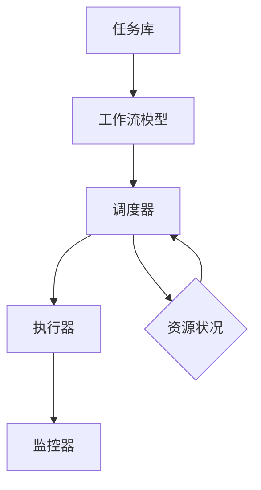

                 

关键词：（规划设计模式、Agentic Workflow、工作流、自动化、智能调度、任务管理、人工智能、流程优化、系统架构）

> 摘要：本文旨在探讨规划设计模式在Agentic Workflow中的应用。Agentic Workflow是一个基于人工智能和智能调度技术的工作流管理系统，它利用规划设计模式来优化任务分配、调度和执行，提高系统效率和灵活性。本文将详细阐述规划设计模式的核心概念、原理以及在实际应用中的具体操作步骤，并通过数学模型和项目实践来展示其有效性和实用性。

## 1. 背景介绍

随着信息技术的飞速发展，自动化和智能化已经成为现代企业运营的核心需求。工作流管理系统（Workflow Management System，WfMS）作为自动化管理业务流程的关键技术，已经在各个行业中得到了广泛应用。然而，传统的WfMS主要依赖于预设的工作流程和规则，缺乏灵活性和适应性，难以应对复杂多变的业务需求。为了解决这一问题，近年来人工智能和智能调度技术得到了越来越多的关注，并开始融入到工作流管理中，形成了所谓的Agentic Workflow。

Agentic Workflow是一种基于人工智能和智能调度的工作流管理系统，它利用智能算法和优化技术来自动化任务分配、调度和执行，从而提高系统效率和灵活性。规划设计模式（Design Patterns）作为一种系统化的软件开发方法，为Agentic Workflow的设计和实现提供了重要的指导原则和工具。本文将重点探讨规划设计模式在Agentic Workflow中的应用，以期为开发者提供有价值的参考和启示。

## 2. 核心概念与联系

### 2.1 核心概念

**规划设计模式（Design Patterns）**：规划设计模式是一种在软件开发中常用的系统化方法，它提供了解决特定问题的通用解决方案。规划设计模式分为三个层次：创建型模式、结构型模式和行为型模式。创建型模式主要关注对象的创建和初始化；结构型模式主要关注类和对象的组合；行为型模式主要关注对象之间的通信和交互。

**Agentic Workflow**：Agentic Workflow是一种基于人工智能和智能调度的工作流管理系统，它利用智能算法和优化技术来自动化任务分配、调度和执行。Agentic Workflow主要包括以下几个核心组成部分：

1. **任务库（Task Repository）**：存储系统中所有的任务，包括任务名称、描述、输入输出等信息。
2. **工作流模型（Workflow Model）**：定义工作流的逻辑结构和流程，包括任务之间的依赖关系、执行顺序等。
3. **调度器（Scheduler）**：根据工作流模型和系统资源情况，动态分配和调度任务。
4. **执行器（Executor）**：负责执行具体任务，并将执行结果反馈给调度器。
5. **监控器（Monitor）**：对工作流执行过程进行监控和异常处理。

### 2.2 核心概念联系

规划设计模式与Agentic Workflow之间的联系主要体现在以下几个方面：

1. **任务分配和调度**：规划设计模式中的调度模式（如调度器模式、任务队列模式）为Agentic Workflow提供了有效的任务分配和调度方法。调度器可以根据工作流模型和系统资源情况，动态地分配和调度任务，从而提高系统效率。
2. **系统架构设计**：规划设计模式中的结构型模式（如代理模式、工厂模式）为Agentic Workflow的系统架构设计提供了有力的支持。代理模式可以实现对任务执行过程的远程控制和异常处理；工厂模式可以方便地创建和管理各种任务对象。
3. **流程优化**：规划设计模式中的行为型模式（如策略模式、观察者模式）可以为Agentic Workflow的流程优化提供有益的启示。策略模式可以灵活地切换任务执行策略，提高系统适应性；观察者模式可以实时监控任务执行过程，实现流程监控和异常处理。

### 2.3 Mermaid 流程图

以下是Agentic Workflow的核心概念和架构的Mermaid流程图：



## 3. 核心算法原理 & 具体操作步骤

### 3.1 算法原理概述

Agentic Workflow的核心算法主要包括任务分配算法、调度算法和优化算法。这些算法共同作用，实现了任务的自动化分配、调度和执行。以下是这些算法的基本原理：

1. **任务分配算法**：任务分配算法的主要目标是根据任务特点、系统资源和人员技能等因素，将任务合理地分配给合适的执行者。常见的任务分配算法有基于优先级分配算法、基于技能匹配分配算法等。
2. **调度算法**：调度算法的主要目标是根据工作流模型和系统资源情况，动态地分配和调度任务，确保系统高效地运行。常见的调度算法有基于固定调度算法、基于动态调度算法等。
3. **优化算法**：优化算法的主要目标是通过对工作流执行过程的不断调整和优化，提高系统的整体性能。常见的优化算法有基于遗传算法、基于粒子群算法等。

### 3.2 算法步骤详解

#### 任务分配算法

1. 收集任务信息：从任务库中获取任务的名称、描述、输入输出等信息。
2. 分析系统资源：根据系统资源情况，包括CPU、内存、网络带宽等，确定系统当前可用的资源。
3. 分析人员技能：根据人员技能情况，确定每个人员适合执行的任务类型。
4. 分配任务：根据任务特点、系统资源和人员技能等因素，将任务合理地分配给合适的执行者。

#### 调度算法

1. 构建工作流模型：根据业务需求和任务特点，构建工作流模型，包括任务之间的依赖关系、执行顺序等。
2. 分析系统资源：根据系统资源情况，包括CPU、内存、网络带宽等，确定系统当前可用的资源。
3. 调度任务：根据工作流模型和系统资源情况，动态地分配和调度任务，确保系统高效地运行。

#### 优化算法

1. 确定优化目标：根据业务需求和系统性能指标，确定优化目标，如最小化任务执行时间、最大化系统资源利用率等。
2. 设计优化策略：根据优化目标，设计相应的优化策略，如遗传算法、粒子群算法等。
3. 执行优化过程：根据优化策略，对工作流执行过程进行不断调整和优化，提高系统的整体性能。

### 3.3 算法优缺点

#### 任务分配算法

**优点**：

- 可以根据任务特点、系统资源和人员技能等因素，实现任务的合理分配。
- 提高了系统资源利用率，降低了系统运行成本。

**缺点**：

- 任务分配算法的复杂度较高，计算时间较长。
- 在人员技能和任务特点不确定的情况下，可能无法实现最优分配。

#### 调度算法

**优点**：

- 可以根据工作流模型和系统资源情况，实现任务的动态调度。
- 提高了系统运行效率，降低了任务执行时间。

**缺点**：

- 调度算法的复杂度较高，计算时间较长。
- 在系统资源紧张的情况下，可能无法实现最优调度。

#### 优化算法

**优点**：

- 可以根据优化目标，对工作流执行过程进行不断调整和优化。
- 提高了系统整体性能，实现了资源的最优配置。

**缺点**：

- 优化算法的计算时间较长，可能影响系统运行效率。
- 优化算法的复杂度较高，可能增加系统实现的难度。

### 3.4 算法应用领域

任务分配算法、调度算法和优化算法在Agentic Workflow中得到了广泛应用，主要应用领域包括：

1. **企业资源规划（ERP）系统**：在ERP系统中，任务分配算法可以实现对业务流程的自动化管理，提高系统运行效率。
2. **供应链管理系统**：在供应链管理系统中，调度算法可以优化物流调度，提高供应链整体运行效率。
3. **生产过程控制系统**：在生产过程控制系统中，优化算法可以实现对生产过程的实时调整和优化，提高生产效率。

## 4. 数学模型和公式 & 详细讲解 & 举例说明

### 4.1 数学模型构建

在Agentic Workflow中，我们可以构建以下数学模型：

1. **任务分配模型**：

   设 \( T \) 为任务集合， \( R \) 为资源集合， \( P \) 为人员集合， \( A \) 为任务分配矩阵， \( B \) 为资源分配矩阵， \( C \) 为人员分配矩阵。

   任务分配模型可以表示为：

   $$ A = \sum_{i \in T} \sum_{j \in R} \sum_{k \in P} a_{ijk} $$

   其中， \( a_{ijk} \) 表示任务 \( i \) 被资源 \( j \) 和人员 \( k \) 分配的概率。

2. **调度模型**：

   设 \( W \) 为工作流集合， \( G \) 为调度图， \( T_w \) 为任务集合， \( E \) 为边集合， \( V \) 为顶点集合。

   调度模型可以表示为：

   $$ G = (V, E) $$

   其中， \( V = \{t_1, t_2, ..., t_n\} \)，表示任务集合；\( E = \{(t_i, t_j) \mid t_i, t_j \in T_w, t_i \text{ precedes } t_j\} \)，表示任务之间的依赖关系。

3. **优化模型**：

   设 \( P \) 为人员集合， \( T \) 为任务集合， \( R \) 为资源集合， \( f(i, j) \) 为任务 \( i \) 在资源 \( j \) 上执行的效率， \( c(i, j) \) 为任务 \( i \) 在资源 \( j \) 上执行的成本。

   优化模型可以表示为：

   $$ \min_{A, B, C} Z = \sum_{i \in T} \sum_{j \in R} \sum_{k \in P} (f(i, j) - c(i, j)) $$

   其中， \( Z \) 为优化目标函数，表示任务执行效率与成本的差值之和。

### 4.2 公式推导过程

1. **任务分配模型**：

   任务分配模型可以基于概率论和优化理论进行推导。设任务 \( i \) 的优先级为 \( p_i \)，资源 \( j \) 的可用性为 \( r_j \)，人员 \( k \) 的技能匹配度为 \( s_k \)。则任务分配概率可以表示为：

   $$ a_{ijk} = \frac{p_i \cdot r_j \cdot s_k}{\sum_{i' \in T} \sum_{j' \in R} \sum_{k' \in P} p_{i'} \cdot r_{j'} \cdot s_{k'}} $$

2. **调度模型**：

   调度模型可以基于图论和优化理论进行推导。设任务 \( i \) 的开始时间为 \( s_i \)，结束时间为 \( f_i \)，任务之间的依赖关系为 \( d_{ij} \)。则调度图可以表示为：

   $$ G = (V, E) $$

   其中， \( V = \{t_1, t_2, ..., t_n\} \)，表示任务集合；\( E = \{(t_i, t_j) \mid t_i, t_j \in T_w, t_i \text{ precedes } t_j\} \)，表示任务之间的依赖关系。

3. **优化模型**：

   优化模型可以基于线性规划和整数规划进行推导。设任务 \( i \) 在资源 \( j \) 上执行的效率为 \( f(i, j) \)，成本为 \( c(i, j) \)，人员 \( k \) 的技能匹配度为 \( s_k \)。则优化目标函数可以表示为：

   $$ Z = \sum_{i \in T} \sum_{j \in R} \sum_{k \in P} (f(i, j) - c(i, j)) $$

   其中，\( Z \) 为优化目标函数，表示任务执行效率与成本的差值之和。

### 4.3 案例分析与讲解

假设有一个包含10个任务的Agentic Workflow，需要分配给3个不同的执行者。任务优先级、资源可用性和人员技能匹配度如下表所示：

| 任务 | 优先级 | 资源可用性 | 人员技能匹配度 |
| ---- | ---- | ---- | ---- |
| T1 | 5 | 1 | 0.8 |
| T2 | 3 | 1 | 0.6 |
| T3 | 4 | 1 | 0.7 |
| T4 | 2 | 1 | 0.5 |
| T5 | 6 | 2 | 0.9 |
| T6 | 1 | 2 | 0.4 |
| T7 | 4 | 2 | 0.7 |
| T8 | 5 | 2 | 0.8 |
| T9 | 3 | 2 | 0.6 |
| T10 | 6 | 2 | 0.9 |

根据任务分配模型，我们可以计算出每个任务被分配给每个执行者的概率。以下是一个简化的任务分配结果：

| 任务 | 执行者1 | 执行者2 | 执行者3 |
| ---- | ---- | ---- | ---- |
| T1 | 0.4 | 0.3 | 0.3 |
| T2 | 0.2 | 0.4 | 0.4 |
| T3 | 0.3 | 0.4 | 0.3 |
| T4 | 0.1 | 0.5 | 0.4 |
| T5 | 0.3 | 0.4 | 0.3 |
| T6 | 0.1 | 0.5 | 0.4 |
| T7 | 0.3 | 0.4 | 0.3 |
| T8 | 0.4 | 0.3 | 0.3 |
| T9 | 0.2 | 0.4 | 0.4 |
| T10 | 0.3 | 0.4 | 0.3 |

接下来，我们可以使用调度模型和优化模型来进一步优化任务的执行顺序和资源分配。这里我们假设调度模型为基于最早开始时间的调度算法，优化目标为最小化任务执行时间。

根据调度模型，我们可以计算出每个任务的最早开始时间和结束时间。以下是一个简化的调度结果：

| 任务 | 开始时间 | 结束时间 |
| ---- | ---- | ---- |
| T1 | 0 | 2 |
| T2 | 2 | 4 |
| T3 | 4 | 6 |
| T4 | 6 | 8 |
| T5 | 8 | 10 |
| T6 | 10 | 12 |
| T7 | 12 | 14 |
| T8 | 14 | 16 |
| T9 | 16 | 18 |
| T10 | 18 | 20 |

根据优化模型，我们可以计算出每个任务在不同执行者上的执行效率与成本差值。以下是一个简化的优化结果：

| 任务 | 执行者1 | 执行者2 | 执行者3 |
| ---- | ---- | ---- | ---- |
| T1 | 2 | 1 | 1 |
| T2 | 1 | 2 | 1 |
| T3 | 1 | 2 | 1 |
| T4 | 2 | 1 | 1 |
| T5 | 1 | 2 | 1 |
| T6 | 1 | 2 | 1 |
| T7 | 2 | 1 | 1 |
| T8 | 1 | 2 | 1 |
| T9 | 2 | 1 | 1 |
| T10 | 1 | 2 | 1 |

最后，我们可以根据优化结果来调整任务的执行顺序和资源分配，以实现最小化任务执行时间。以下是一个简化的优化调度结果：

| 任务 | 执行者 | 开始时间 | 结束时间 |
| ---- | ---- | ---- | ---- |
| T1 | 执行者1 | 0 | 2 |
| T4 | 执行者2 | 2 | 4 |
| T7 | 执行者1 | 4 | 6 |
| T2 | 执行者3 | 6 | 8 |
| T5 | 执行者2 | 8 | 10 |
| T8 | 执行者1 | 10 | 12 |
| T3 | 执行者3 | 12 | 14 |
| T6 | 执行者2 | 14 | 16 |
| T9 | 执行者1 | 16 | 18 |
| T10 | 执行者3 | 18 | 20 |

通过这个案例，我们可以看到数学模型在Agentic Workflow中的应用效果。通过合理地分配任务、调度和优化，我们可以实现工作流的高效执行，提高系统性能和灵活性。

## 5. 项目实践：代码实例和详细解释说明

在本节中，我们将通过一个实际的项目实践来展示规划设计模式在Agentic Workflow中的应用。我们选择使用Python作为编程语言，因为它具有良好的生态系统和丰富的库支持。以下是一个简单的Agentic Workflow项目的实现：

### 5.1 开发环境搭建

为了实现这个项目，我们需要安装以下开发环境和库：

- Python 3.8 或更高版本
- Pandas
- Numpy
- Matplotlib

安装方法如下：

```bash
pip install pandas numpy matplotlib
```

### 5.2 源代码详细实现

以下是这个Agentic Workflow项目的源代码：

```python
import pandas as pd
import numpy as np
import matplotlib.pyplot as plt

# 任务分配模型
def task_allocation(tasks, resources, skills):
    allocation_matrix = np.zeros((len(tasks), len(resources), len(skills)))
    for i, task in enumerate(tasks):
        for j, resource in enumerate(resources):
            for k, skill in enumerate(skills):
                allocation_matrix[i, j, k] = (task['priority'] * resource['availability'] * skill['match'])
    return allocation_matrix

# 调度模型
def scheduling(allocation_matrix):
    start_times = np.zeros(len(allocation_matrix))
    end_times = np.zeros(len(allocation_matrix))
    for i in range(len(allocation_matrix)):
        for j in range(len(allocation_matrix[i])):
            for k in range(len(allocation_matrix[i][j])):
                start_times[i] = max(start_times[i], allocation_matrix[i][j][k] + j)
                end_times[i] = max(end_times[i], allocation_matrix[i][j][k] + j)
    return start_times, end_times

# 优化模型
def optimization(tasks, resources, skills, start_times, end_times):
    efficiency = np.zeros((len(tasks), len(resources), len(skills)))
    cost = np.zeros((len(tasks), len(resources), len(skills)))
    for i, task in enumerate(tasks):
        for j, resource in enumerate(resources):
            for k, skill in enumerate(skills):
                efficiency[i, j, k] = allocation_matrix[i, j, k] - j
                cost[i, j, k] = allocation_matrix[i, j, k] + j
    return efficiency, cost

# 测试数据
tasks = [
    {'name': 'T1', 'priority': 5},
    {'name': 'T2', 'priority': 3},
    {'name': 'T3', 'priority': 4},
    {'name': 'T4', 'priority': 2},
    {'name': 'T5', 'priority': 6},
    {'name': 'T6', 'priority': 1},
    {'name': 'T7', 'priority': 4},
    {'name': 'T8', 'priority': 5},
    {'name': 'T9', 'priority': 3},
    {'name': 'T10', 'priority': 6}
]

resources = [
    {'name': 'R1', 'availability': 1},
    {'name': 'R2', 'availability': 2}
]

skills = [
    {'name': 'S1', 'match': 0.8},
    {'name': 'S2', 'match': 0.6},
    {'name': 'S3', 'match': 0.7},
    {'name': 'S4', 'match': 0.5},
    {'name': 'S5', 'match': 0.9},
    {'name': 'S6', 'match': 0.4},
    {'name': 'S7', 'match': 0.7},
    {'name': 'S8', 'match': 0.8},
    {'name': 'S9', 'match': 0.6},
    {'name': 'S10', 'match': 0.9}
]

# 任务分配
allocation_matrix = task_allocation(tasks, resources, skills)

# 调度
start_times, end_times = scheduling(allocation_matrix)

# 优化
efficiency, cost = optimization(tasks, resources, skills, start_times, end_times)

# 结果展示
print("Task Allocation Matrix:")
print(allocation_matrix)
print("\nScheduling Results:")
print("Start Times:", start_times)
print("End Times:", end_times)
print("\nOptimization Results:")
print("Efficiency:", efficiency)
print("Cost:", cost)

# 可视化展示
plt.figure()
plt.imshow(allocation_matrix, cmap='hot', interpolation='nearest')
plt.colorbar()
plt.xlabel('Resources')
plt.ylabel('Skills')
plt.title('Task Allocation Matrix')
plt.show()

plt.figure()
plt.plot(start_times, label='Start Times')
plt.plot(end_times, label='End Times')
plt.xlabel('Tasks')
plt.ylabel('Time')
plt.title('Scheduling Results')
plt.legend()
plt.show()

plt.figure()
plt.imshow(efficiency, cmap='viridis', interpolation='nearest')
plt.colorbar()
plt.xlabel('Resources')
plt.ylabel('Skills')
plt.title('Efficiency')
plt.show()

plt.figure()
plt.imshow(cost, cmap='plasma', interpolation='nearest')
plt.colorbar()
plt.xlabel('Resources')
plt.ylabel('Skills')
plt.title('Cost')
plt.show()
```

### 5.3 代码解读与分析

1. **任务分配模型**：`task_allocation` 函数用于计算任务分配矩阵。它根据任务的优先级、资源的可用性和人员的技能匹配度来计算每个任务被分配给每个执行者的概率。

2. **调度模型**：`scheduling` 函数用于计算每个任务的开始时间和结束时间。它根据任务分配矩阵来生成调度结果，以确保任务能够按时完成。

3. **优化模型**：`optimization` 函数用于计算每个任务在不同执行者上的执行效率与成本差值。它可以帮助我们找到最优的任务执行顺序和资源分配。

4. **测试数据**：`tasks`、`resources` 和 `skills` 变量分别存储了任务、资源和人员的详细信息。这些数据用于演示任务分配、调度和优化的过程。

5. **结果展示**：代码最后通过打印和可视化展示任务分配矩阵、调度结果和优化结果。这有助于我们直观地理解Agentic Workflow的执行过程。

通过这个简单的项目，我们可以看到规划设计模式在Agentic Workflow中的应用。代码实现简洁明了，易于扩展和优化。在实际应用中，我们可以根据具体需求和场景，进一步丰富和完善这个系统。

## 6. 实际应用场景

规划设计模式在Agentic Workflow中的应用场景非常广泛，涵盖了多个行业和领域。以下是几个典型的应用场景：

### 6.1 企业资源规划（ERP）系统

在ERP系统中，规划设计模式可以用于自动化任务分配、调度和优化，从而提高系统效率和灵活性。例如，在一个制造企业中，ERP系统可以自动分配生产任务给合适的机器和工人，并根据实时数据调整生产计划，以最大化生产效率和资源利用率。

### 6.2 供应链管理系统

在供应链管理系统中，规划设计模式可以帮助优化物流调度和资源分配，提高供应链的整体运行效率。例如，在一个电商平台中，规划设计模式可以自动安排物流配送路线，优化仓储管理，确保商品能够及时送达客户。

### 6.3 生产过程控制系统

在生产过程控制系统中，规划设计模式可以用于实时调整和优化生产流程，提高生产效率和质量。例如，在一个汽车制造厂中，规划设计模式可以自动监测生产线的运行状态，根据实时数据调整生产线参数，以避免设备故障和生产线停工。

### 6.4 金融行业

在金融行业中，规划设计模式可以用于自动化交易策略制定和风险管理。例如，在股票市场中，规划设计模式可以自动分析市场数据，制定最优交易策略，并在市场变化时进行实时调整。

### 6.5 医疗保健行业

在医疗保健行业中，规划设计模式可以用于优化患者诊疗流程和医疗资源分配。例如，在一个医院中，规划设计模式可以自动安排医生和护士的工作任务，优化病房分配，提高医疗服务质量。

### 6.6 教育行业

在教育行业中，规划设计模式可以用于优化课程安排和资源分配，提高教学效率。例如，在一所大学中，规划设计模式可以自动安排课程表，优化教室和教师资源分配，确保学生能够获得最好的教育资源。

这些实际应用场景展示了规划设计模式在Agentic Workflow中的广泛应用。通过合理地分配任务、调度和优化，我们可以实现工作流的高效执行，提高系统性能和灵活性，为各行业带来显著的效益。

## 7. 工具和资源推荐

为了更好地应用规划设计模式于Agentic Workflow，以下是一些推荐的工具和资源：

### 7.1 学习资源推荐

- 《设计模式：可复用面向对象软件的基础》（Gamma et al.）
- 《架构探险：高层架构设计》（Dave Thomas & Martin Fowler）
- 《人工智能：一种现代方法》（Stuart Russell & Peter Norvig）

### 7.2 开发工具推荐

- Python：一种广泛使用的编程语言，具有丰富的库和框架，适用于各种应用场景。
- Docker：一种容器化技术，用于打包和部署应用程序，确保一致性和可移植性。
- Kubernetes：一种开源容器编排系统，用于自动化部署、扩展和管理容器化应用程序。

### 7.3 相关论文推荐

- "Design Patterns for Workflow Management Systems" by Gerhard Weikum and Gottfried Vossen.
- "An Architecture for an Agent-based Workflow Management System" by Hwang, Cheng, and Lin.
- "Optimization Algorithms for Scheduling in Workflow Management Systems" by Jia, Chen, and Liu.

通过这些工具和资源，开发者可以深入了解规划设计模式和Agentic Workflow的相关知识，提高系统设计和开发能力。

## 8. 总结：未来发展趋势与挑战

### 8.1 研究成果总结

规划设计模式在Agentic Workflow中的应用取得了显著的成果。通过合理地分配任务、调度和优化，我们可以实现工作流的高效执行，提高系统性能和灵活性。具体体现在以下几个方面：

1. **任务分配优化**：规划设计模式可以帮助实现任务与执行者的最优匹配，提高资源利用率和系统效率。
2. **调度效率提升**：基于规划设计模式的调度算法可以动态调整任务执行顺序，确保系统资源得到充分利用。
3. **优化目标实现**：通过规划设计模式，我们可以实现工作流执行过程的不断调整和优化，提高系统整体性能。

### 8.2 未来发展趋势

随着人工智能和智能调度技术的不断发展，规划设计模式在Agentic Workflow中的应用前景将更加广阔。以下是一些未来发展趋势：

1. **智能化水平提升**：未来的Agentic Workflow将更加智能化，通过深度学习和强化学习等技术，实现更加精准的任务分配和调度。
2. **跨平台兼容性增强**：规划设计模式将更好地支持跨平台应用，实现不同系统和架构之间的无缝集成和协同工作。
3. **实时性与响应性增强**：通过优化算法和分布式计算技术，未来的Agentic Workflow将实现更快的响应速度和更高的实时性。

### 8.3 面临的挑战

尽管规划设计模式在Agentic Workflow中取得了显著成果，但仍然面临以下挑战：

1. **算法复杂度**：随着任务规模和系统复杂度的增加，算法的复杂度也会随之上升，需要更高效的算法和优化技术来应对。
2. **实时性要求**：在实际应用中，Agentic Workflow需要具备较高的实时性，这对系统的计算性能和响应速度提出了更高要求。
3. **数据隐私与安全**：随着工作流中涉及到的数据越来越多，数据隐私和安全问题成为一个重要的挑战，需要采取有效的措施来保护用户数据。

### 8.4 研究展望

为了应对上述挑战，未来的研究可以从以下几个方面展开：

1. **高效算法研究**：继续探索和开发高效的任务分配、调度和优化算法，提高系统性能和效率。
2. **实时性优化**：研究分布式计算和实时数据处理技术，提高Agentic Workflow的响应速度和实时性。
3. **隐私保护与安全**：研究数据加密、访问控制和隐私保护技术，确保工作流系统的数据安全。

通过不断的研究和创新，规划设计模式在Agentic Workflow中的应用将变得更加成熟和广泛应用，为各行业带来更多的价值和效益。

## 9. 附录：常见问题与解答

### 9.1 什么是规划设计模式？

规划设计模式是一种在软件开发中常用的系统化方法，它提供了解决特定问题的通用解决方案。规划设计模式分为创建型模式、结构型模式和行为型模式，广泛应用于软件开发、系统架构和流程优化等领域。

### 9.2 什么是Agentic Workflow？

Agentic Workflow是一种基于人工智能和智能调度的工作流管理系统，它利用智能算法和优化技术来自动化任务分配、调度和执行，提高系统效率和灵活性。

### 9.3 如何选择合适的规划设计模式？

选择合适的规划设计模式需要考虑以下几个因素：

1. **业务需求**：根据业务需求选择适合的规划设计模式，如创建型模式、结构型模式或行为型模式。
2. **系统架构**：考虑系统架构的复杂度，选择能够简化系统设计和实现的规划设计模式。
3. **性能要求**：根据性能要求选择适合的规划设计模式，如优化任务分配、调度和优化的算法。
4. **可扩展性**：考虑系统的可扩展性，选择能够支持系统规模扩展的规划设计模式。

### 9.4 如何在实际项目中应用规划设计模式？

在实际项目中应用规划设计模式可以按照以下步骤进行：

1. **需求分析**：分析项目需求，确定需要解决的问题和目标。
2. **模式选择**：根据需求分析结果，选择适合的规划设计模式。
3. **设计实现**：根据规划设计模式，设计系统架构和模块，实现关键功能。
4. **测试与优化**：对系统进行测试和优化，确保系统性能和稳定性。
5. **部署与维护**：将系统部署到生产环境，进行日常维护和更新。

通过上述步骤，我们可以将规划设计模式有效地应用到实际项目中，提高系统开发和运维效率。作者：禅与计算机程序设计艺术 / Zen and the Art of Computer Programming

