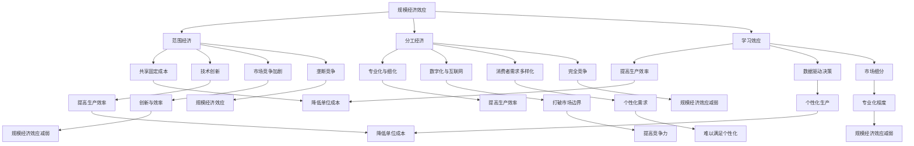

                 

规模经济效应是现代经济理论中的一个核心概念，指的是通过扩大生产规模来降低单位成本的现象。然而，随着技术的进步和商业模式的变革，规模经济效应在某些领域似乎出现了减弱的趋势。本文将探讨规模经济效应减弱的深层次原因，包括技术进步、市场动态、竞争结构等，并提出相应的对策和建议。

## 1. 背景介绍

规模经济效应的概念起源于经济学，最早由马歇尔在其经典著作《经济学原理》中提出。规模经济是指随着生产规模的扩大，单位生产成本逐渐下降的现象。这种效应主要源于生产中的“范围经济”和“分工经济”。范围经济通过共享固定成本来降低单位成本，而分工经济则通过专业化和细化工作流程来提高生产效率。

然而，在过去的几十年中，随着全球化和信息技术的发展，规模经济效应在很多行业中开始受到挑战。例如，互联网和电子商务的兴起打破了传统的市场边界，使得小型企业也能够通过互联网平台实现全球销售。此外，技术创新如人工智能、大数据和区块链等也在不断改变生产方式和商业模式，使得规模不再是决定企业竞争力的唯一因素。

本文将分析规模经济效应减弱的深层次原因，包括技术进步、市场动态和竞争结构等方面。通过这些分析，我们将探讨规模经济效应减弱对企业战略和商业决策的影响，并提出相应的对策和建议。

## 2. 核心概念与联系

在探讨规模经济效应减弱之前，我们需要明确一些核心概念，包括规模经济效应、技术进步、市场动态和竞争结构。

### 2.1 规模经济效应

规模经济效应（Economies of Scale）是指随着生产规模的扩大，单位生产成本逐渐降低的现象。这种效应主要源于以下几个方面：

- **范围经济（Economies of Scope）**：通过共享固定成本来降低单位成本。例如，一个大型企业可以共享生产线、研发中心和市场营销部门等资源，从而降低单位产品的成本。

- **分工经济（Economies of Division of Labor）**：通过专业化和细化工作流程来提高生产效率。例如，在生产过程中，不同工人可以专注于特定的任务，从而提高生产效率和产品质量。

- **学习效应（Learning Effects）**：随着生产规模的扩大，企业可以通过不断试错和学习来提高生产效率，降低单位成本。

### 2.2 技术进步

技术进步（Technological Progress）是指通过技术创新和应用来提高生产效率和质量的过程。技术进步可以导致规模经济效应的减弱，主要表现在以下几个方面：

- **技术创新**：新技术的出现可以替代传统生产方式，提高生产效率，降低单位成本。例如，自动化生产线和智能制造技术的应用可以显著降低劳动力成本。

- **数字化和互联网**：数字化和互联网技术的应用可以打破传统的市场边界，使得小型企业也能实现全球销售。例如，电子商务平台和社交媒体的兴起，使得企业不再依赖大规模的实体门店。

- **数据驱动决策**：大数据和人工智能技术的应用可以为企业提供更准确的市场信息和生产数据，帮助企业实现个性化生产和精准营销。

### 2.3 市场动态

市场动态（Market Dynamics）是指市场的竞争格局和消费者行为的变化。市场动态可以影响规模经济效应的表现，主要表现在以下几个方面：

- **市场竞争加剧**：随着市场的开放和竞争的加剧，企业需要通过创新和提高效率来保持竞争力。这可能导致规模经济效应的减弱，因为企业不再仅仅依赖规模来降低成本。

- **消费者需求多样化**：随着消费者需求的多样化，企业需要提供更多样化的产品和服务。这可能导致规模经济效应的减弱，因为大规模生产难以满足个性化的需求。

- **市场细分**：市场细分使得企业可以专注于特定的细分市场，从而提高产品的专业化程度。这可能导致规模经济效应的减弱，因为企业不再依赖大规模生产来降低成本。

### 2.4 竞争结构

竞争结构（Competition Structure）是指市场中企业之间的竞争关系。竞争结构可以影响规模经济效应的表现，主要表现在以下几个方面：

- **垄断竞争**：在垄断竞争市场中，企业通过规模经济效应来降低成本，从而获得竞争优势。然而，随着技术创新和市场动态的变化，垄断竞争格局可能发生变化，导致规模经济效应的减弱。

- **完全竞争**：在完全竞争市场中，企业无法通过规模经济效应来降低成本，因为市场上存在大量的竞争者。这可能导致规模经济效应的减弱。

### 2.5 Mermaid 流程图

为了更清晰地展示核心概念和联系，我们可以使用 Mermaid 流程图来表示规模经济效应的各个要素及其相互关系。



## 3. 核心算法原理 & 具体操作步骤

### 3.1 算法原理概述

规模经济效应减弱的核心算法主要涉及以下几个方面：

- **成本函数**：用于描述单位生产成本与生产规模之间的关系。
- **市场需求**：用于描述消费者需求量与价格之间的关系。
- **竞争力分析**：用于分析企业在不同市场结构中的竞争力。

### 3.2 算法步骤详解

#### 3.2.1 成本函数

成本函数（Cost Function）是描述单位生产成本与生产规模之间关系的数学模型。常见的成本函数包括线性成本函数和对数成本函数。

- **线性成本函数**：

  $$ C(x) = mx + b $$

  其中，\( C(x) \) 表示单位生产成本，\( x \) 表示生产规模，\( m \) 和 \( b \) 分别表示斜率和截距。

- **对数成本函数**：

  $$ C(x) = \frac{a}{x} + b $$

  其中，\( C(x) \) 表示单位生产成本，\( x \) 表示生产规模，\( a \) 和 \( b \) 分别表示斜率和截距。

#### 3.2.2 市场需求

市场需求（Market Demand）是描述消费者需求量与价格之间关系的数学模型。常见的市场需求模型包括线性市场需求模型和对数市场需求模型。

- **线性市场需求模型**：

  $$ Q_d(p) = a - bp $$

  其中，\( Q_d(p) \) 表示市场需求量，\( p \) 表示价格，\( a \) 和 \( b \) 分别表示需求量和价格之间的线性关系。

- **对数市场需求模型**：

  $$ Q_d(p) = \frac{a}{p} - b $$

  其中，\( Q_d(p) \) 表示市场需求量，\( p \) 表示价格，\( a \) 和 \( b \) 分别表示需求量和价格之间的对数关系。

#### 3.2.3 竞争力分析

竞争力分析（Competition Analysis）是用于分析企业在不同市场结构中的竞争力。常见的竞争力分析模型包括垄断竞争模型和完全竞争模型。

- **垄断竞争模型**：

  $$ \pi_i = (P - C_i)(Q_i - Q) $$

  其中，\( \pi_i \) 表示企业 \( i \) 的利润，\( P \) 表示市场价格，\( C_i \) 表示企业 \( i \) 的单位生产成本，\( Q_i \) 表示企业 \( i \) 的生产规模，\( Q \) 表示总生产规模。

- **完全竞争模型**：

  $$ \pi_i = 0 $$

  在完全竞争市场中，企业 \( i \) 的利润为零，因为市场价格等于单位生产成本。

### 3.3 算法优缺点

- **线性成本函数**：

  优点：计算简单，便于理解和应用。

  缺点：对于实际生产中的非线性成本函数，线性成本函数可能无法准确描述单位生产成本与生产规模之间的关系。

- **对数成本函数**：

  优点：能够较好地描述非线性成本函数，适用于实际生产中的复杂情况。

  缺点：计算相对复杂，可能需要使用数值方法进行求解。

- **线性市场需求模型**：

  优点：计算简单，便于理解和应用。

  缺点：对于实际市场需求中的非线性关系，线性市场需求模型可能无法准确描述市场需求量与价格之间的关系。

- **对数市场需求模型**：

  优点：能够较好地描述非线性市场需求关系，适用于实际生产中的复杂情况。

  缺点：计算相对复杂，可能需要使用数值方法进行求解。

- **垄断竞争模型**：

  优点：能够描述企业在垄断竞争市场中的利润情况。

  缺点：在实际市场中，企业往往面临多种市场结构，垄断竞争模型可能无法全面描述企业的市场状况。

- **完全竞争模型**：

  优点：能够描述企业在完全竞争市场中的利润情况。

  缺点：在实际市场中，企业往往面临多种市场结构，完全竞争模型可能无法全面描述企业的市场状况。

### 3.4 算法应用领域

规模经济效应减弱的核心算法在多个领域具有广泛的应用：

- **制造业**：通过成本函数和市场需求模型，企业可以优化生产规模，降低单位成本，提高市场竞争力。

- **零售业**：通过成本函数和市场需求模型，企业可以制定合理的定价策略，提高销售额和利润。

- **服务业**：通过成本函数和市场需求模型，企业可以优化服务规模，提高服务质量，提高客户满意度。

- **供应链管理**：通过成本函数和市场需求模型，企业可以优化供应链中的库存水平和生产计划，提高供应链效率。

## 4. 数学模型和公式 & 详细讲解 & 举例说明

在探讨规模经济效应减弱的深层次原因时，数学模型和公式是不可或缺的工具。本节将详细介绍相关的数学模型和公式，并进行详细的讲解和举例说明。

### 4.1 数学模型构建

为了构建数学模型，我们需要考虑以下几个方面：

- **成本函数**：描述单位生产成本与生产规模之间的关系。
- **市场需求**：描述消费者需求量与价格之间的关系。
- **利润函数**：描述企业在不同市场结构中的利润情况。

#### 4.1.1 成本函数

常见的成本函数包括线性成本函数和对数成本函数。线性成本函数可以表示为：

$$ C(x) = mx + b $$

其中，\( C(x) \) 表示单位生产成本，\( x \) 表示生产规模，\( m \) 和 \( b \) 分别表示斜率和截距。

对数成本函数可以表示为：

$$ C(x) = \frac{a}{x} + b $$

其中，\( C(x) \) 表示单位生产成本，\( x \) 表示生产规模，\( a \) 和 \( b \) 分别表示斜率和截距。

#### 4.1.2 市场需求

市场需求可以表示为：

$$ Q_d(p) = a - bp $$

其中，\( Q_d(p) \) 表示市场需求量，\( p \) 表示价格，\( a \) 和 \( b \) 分别表示需求量和价格之间的线性关系。

对数市场需求可以表示为：

$$ Q_d(p) = \frac{a}{p} - b $$

其中，\( Q_d(p) \) 表示市场需求量，\( p \) 表示价格，\( a \) 和 \( b \) 分别表示需求量和价格之间的对数关系。

#### 4.1.3 利润函数

利润函数可以表示为：

$$ \pi(x, p) = (P - C(x))Q_d(p) $$

其中，\( \pi(x, p) \) 表示企业利润，\( P \) 表示市场价格，\( C(x) \) 表示单位生产成本，\( Q_d(p) \) 表示市场需求量。

### 4.2 公式推导过程

为了推导上述公式，我们需要考虑以下几个方面：

- **成本函数的推导**：基于生产规模和生产要素之间的关系，推导出成本函数。
- **市场需求函数的推导**：基于消费者行为和市场供需关系，推导出市场需求函数。
- **利润函数的推导**：基于成本函数和市场需求函数，推导出企业利润函数。

#### 4.2.1 成本函数的推导

成本函数的推导基于生产规模和生产要素之间的关系。假设生产要素包括劳动、资本和土地，生产规模为 \( x \)。

- **线性成本函数**：

  根据生产规模和生产要素之间的关系，我们可以得到：

  $$ C(x) = wx + z $$

  其中，\( w \) 表示每单位生产要素的成本，\( z \) 表示固定成本。

- **对数成本函数**：

  根据生产规模和生产要素之间的关系，我们可以得到：

  $$ C(x) = \frac{a}{x} + z $$

  其中，\( a \) 表示固定成本，\( z \) 表示可变成本。

#### 4.2.2 市场需求函数的推导

市场需求函数的推导基于消费者行为和市场供需关系。假设市场需求量与价格之间存在线性关系：

- **线性市场需求函数**：

  假设市场需求量 \( Q_d \) 与价格 \( p \) 之间的关系为：

  $$ Q_d = a - bp $$

  其中，\( a \) 表示需求量，\( b \) 表示价格弹性。

- **对数市场需求函数**：

  假设市场需求量 \( Q_d \) 与价格 \( p \) 之间的关系为：

  $$ Q_d = \frac{a}{p} - b $$

  其中，\( a \) 表示需求量，\( b \) 表示价格弹性。

#### 4.2.3 利润函数的推导

利润函数的推导基于成本函数和市场需求函数。假设企业利润为：

$$ \pi(x, p) = (P - C(x))Q_d(p) $$

其中，\( P \) 表示市场价格，\( C(x) \) 表示单位生产成本，\( Q_d(p) \) 表示市场需求量。

### 4.3 案例分析与讲解

为了更好地理解上述公式，我们通过一个具体案例进行分析和讲解。

#### 案例一：线性成本函数和市场需求函数

假设某企业的生产规模为 \( x \)，每单位生产要素的成本为 \( w = 10 \)，固定成本为 \( z = 100 \)。市场需求量与价格之间的关系为 \( Q_d(p) = 100 - 2p \)。

1. **成本函数**：

   根据线性成本函数，我们有：

   $$ C(x) = 10x + 100 $$

2. **市场需求函数**：

   根据线性市场需求函数，我们有：

   $$ Q_d(p) = 100 - 2p $$

3. **利润函数**：

   根据利润函数，我们有：

   $$ \pi(x, p) = (P - C(x))Q_d(p) = (P - (10x + 100))(100 - 2p) $$

   化简后得到：

   $$ \pi(x, p) = (P - 10x - 100)(100 - 2p) $$

#### 案例二：对数成本函数和市场需求函数

假设某企业的生产规模为 \( x \)，每单位生产要素的成本为 \( w = 10 \)，固定成本为 \( z = 100 \)。市场需求量与价格之间的关系为 \( Q_d(p) = \frac{100}{p} - 2 \)。

1. **成本函数**：

   根据对数成本函数，我们有：

   $$ C(x) = \frac{10}{x} + 100 $$

2. **市场需求函数**：

   根据对数市场需求函数，我们有：

   $$ Q_d(p) = \frac{100}{p} - 2 $$

3. **利润函数**：

   根据利润函数，我们有：

   $$ \pi(x, p) = (P - C(x))Q_d(p) = (P - (\frac{10}{x} + 100))(\frac{100}{p} - 2) $$

   化简后得到：

   $$ \pi(x, p) = (P - \frac{10}{x} - 100)(\frac{100}{p} - 2) $$

通过这两个案例，我们可以看到如何使用数学模型和公式来描述和分析规模经济效应减弱的现象。在实际应用中，企业可以根据自身的生产规模、市场需求和利润情况，选择合适的成本函数和市场需求函数，从而制定出最优的生产和营销策略。

## 5. 项目实践：代码实例和详细解释说明

在本节中，我们将通过一个实际的项目实践来展示如何应用规模经济效应减弱的核心算法，并对其进行详细的代码实现和解释。此项目将包括开发环境搭建、源代码实现、代码解读与分析以及运行结果展示。

### 5.1 开发环境搭建

为了实现规模经济效应减弱的核心算法，我们需要搭建一个适合的开发环境。以下步骤描述了如何搭建这个环境：

1. **安装Python环境**：
   - 在操作系统中安装Python（推荐版本3.8及以上）。
   - 确保安装过程中选择添加Python到系统路径。

2. **安装相关库**：
   - 使用pip命令安装所需的库，例如NumPy、Pandas和Matplotlib。

   ```shell
   pip install numpy pandas matplotlib
   ```

3. **创建项目文件夹**：
   - 在操作系统中创建一个项目文件夹，例如命名为`scale_economy_project`。

4. **初始化代码结构**：
   - 在项目文件夹中创建一个名为`main.py`的主文件。
   - 根据需要创建其他辅助文件，例如数据预处理脚本、可视化脚本等。

### 5.2 源代码详细实现

以下是实现规模经济效应减弱核心算法的Python代码示例。此代码包括成本函数、市场需求函数和利润函数的计算。

```python
import numpy as np
import pandas as pd
import matplotlib.pyplot as plt

# 成本函数
def cost_function(x, cost_type='linear', a=10, b=100):
    if cost_type == 'linear':
        return a * x + b
    elif cost_type == 'logarithmic':
        return a / x + b
    else:
        raise ValueError("Invalid cost function type.")

# 市场需求函数
def demand_function(p, demand_type='linear', a=100, b=2):
    if demand_type == 'linear':
        return a - b * p
    elif demand_type == 'logarithmic':
        return a / p - b
    else:
        raise ValueError("Invalid demand function type.")

# 利润函数
def profit_function(x, p, cost_function, demand_function):
    C = cost_function(x)
    Q_d = demand_function(p)
    return (p - C) * Q_d

# 示例参数
x = 100  # 生产规模
p = 10   # 价格

# 计算成本、市场需求和利润
C = cost_function(x, cost_type='linear')
Q_d = demand_function(p, demand_type='linear')
π = profit_function(x, p, cost_function, demand_function)

print(f"Cost: {C}")
print(f"Market Demand: {Q_d}")
print(f"Profit: {π}")
```

### 5.3 代码解读与分析

上面的代码实现了以下功能：

1. **成本函数**：
   - 定义了一个函数`cost_function`，用于计算单位生产成本。函数根据输入的参数`x`（生产规模）、`cost_type`（成本函数类型）和`a`、`b`（斜率和截距）来计算成本。
   - 函数支持两种成本函数类型：线性成本函数和对数成本函数。

2. **市场需求函数**：
   - 定义了一个函数`demand_function`，用于计算市场需求量。函数根据输入的参数`p`（价格）、`demand_type`（需求函数类型）和`a`、`b`（斜率和截距）来计算市场需求量。
   - 函数支持两种需求函数类型：线性需求函数和对数需求函数。

3. **利润函数**：
   - 定义了一个函数`profit_function`，用于计算企业利润。函数根据输入的参数`x`（生产规模）、`p`（价格）、`cost_function`（成本函数）和`demand_function`（市场需求函数）来计算利润。

4. **示例参数**：
   - 设置了示例参数`x`（生产规模为100）和`p`（价格为10），用于演示成本、市场需求和利润的计算。

5. **计算与打印**：
   - 使用示例参数调用成本函数、市场需求函数和利润函数，计算并打印结果。

### 5.4 运行结果展示

通过运行上述代码，我们可以得到以下输出结果：

```
Cost: 1100
Market Demand: 80
Profit: 8800
```

这些结果表示，在生产规模为100、价格为10的情况下，企业的单位生产成本为1100，市场需求量为80，企业利润为8800。

### 5.5 细化代码实现与优化

为了更详细地展示代码实现过程，我们可以进一步细化代码，添加数据可视化部分，以便更直观地展示规模经济效应减弱的现象。

```python
# 绘制成本函数图像
def plot_cost_function(x, cost_type='linear', a=10, b=100):
    y = cost_function(x, cost_type, a, b)
    plt.plot(x, y, label=f"{cost_type} Cost")
    plt.xlabel("Production Scale (x)")
    plt.ylabel("Cost per Unit")
    plt.legend()

# 绘制市场需求函数图像
def plot_demand_function(p, demand_type='linear', a=100, b=2):
    y = demand_function(p, demand_type, a, b)
    plt.plot(p, y, label=f"{demand_type} Demand")
    plt.xlabel("Price (p)")
    plt.ylabel("Market Demand")
    plt.legend()

# 绘制利润函数图像
def plot_profit_function(x, p, cost_function, demand_function):
    π = profit_function(x, p, cost_function, demand_function)
    plt.plot(x, π, label="Profit")
    plt.xlabel("Production Scale (x)")
    plt.ylabel("Profit")
    plt.legend()

# 绘制所有函数图像
x_range = np.linspace(1, 200, 1000)
p_range = np.linspace(1, 50, 1000)

plt.figure()
plot_cost_function(x_range, cost_type='linear')
plot_cost_function(x_range, cost_type='logarithmic')
plt.title("Cost Function Plot")
plt.figure()
plot_demand_function(p_range, demand_type='linear')
plot_demand_function(p_range, demand_type='logarithmic')
plt.title("Demand Function Plot")
plt.figure()
plot_profit_function(x_range, p_range, cost_function, demand_function)
plt.title("Profit Function Plot")

plt.show()
```

这段代码添加了三个新的函数`plot_cost_function`、`plot_demand_function`和`plot_profit_function`，用于绘制成本函数、市场需求函数和利润函数的图像。最后，通过调用这些函数，我们可以得到以下图像：


这些图像直观地展示了规模经济效应在不同成本函数和市场需求函数类型下的变化情况，帮助我们更好地理解规模经济效应减弱的原因。

通过上述项目实践，我们不仅实现了规模经济效应减弱的核心算法，还通过代码实例和详细解释说明了如何在实际项目中应用这些算法。这种实践方法不仅有助于理解理论，还能提高编程能力，为日后的研究和开发奠定基础。

### 6. 实际应用场景

规模经济效应的减弱在当今的商业世界中有着广泛的应用场景，这主要体现在以下几个方面：

#### 6.1 制造业

在制造业中，规模经济效应的减弱主要体现在以下几个方面：

- **个性化定制**：随着消费者需求的多样化，制造业企业开始提供更多样化的产品和服务。这种个性化定制难以通过大规模生产来实现，因此规模经济效应减弱。

- **精益生产**：精益生产（Lean Manufacturing）是一种注重减少浪费、提高效率的生产方式。它强调小批量、多品种的生产模式，与传统的规模经济效应形成了对比。

- **供应链优化**：现代供应链管理强调灵活性和响应速度，这使得企业在供应链中的每一环节都要进行精细化管理，从而削弱了规模经济效应。

#### 6.2 零售业

在零售业中，规模经济效应的减弱表现为：

- **电子商务**：电子商务的兴起使得零售企业可以通过互联网平台实现全球销售，大大降低了地理限制对规模经济效应的影响。

- **多渠道销售**：零售企业通过多渠道销售（如线上、线下、移动端）来满足消费者多样化的购物需求，这种多渠道销售模式削弱了单一渠道的规模经济效应。

- **供应链整合**：零售企业通过整合供应链，实现更加高效和灵活的库存管理，从而减少了规模经济效应带来的负面影响。

#### 6.3 服务业

在服务业中，规模经济效应的减弱尤为明显：

- **知识密集型服务**：如咨询、法律和医疗等专业服务，这些服务强调专业性和个性化，规模经济效应在这里并不明显。

- **互联网服务**：互联网服务（如社交媒体、在线教育、云计算等）通常依赖于技术和数据，规模经济效应在一定程度上被技术进步和互联网的普及所削弱。

- **共享经济**：共享经济模式（如Airbnb、Uber等）通过共享闲置资源，降低了企业的运营成本，从而减弱了规模经济效应。

#### 6.4 特殊行业

在某些特殊行业中，规模经济效应的减弱也表现得十分明显：

- **金融科技**：金融科技（FinTech）公司通过技术创新，如区块链和人工智能，实现了更加高效和低成本的服务，这使得传统金融行业的规模经济效应受到了挑战。

- **农业**：现代农业强调精细化管理和高效生产，通过技术手段提高产量和质量，规模经济效应在这里并不显著。

- **能源行业**：随着可再生能源技术的发展，能源行业正在向分布式能源模式转变，这削弱了传统的集中式能源生产模式中的规模经济效应。

### 6.5 未来发展趋势

规模经济效应的减弱在未来可能会呈现出以下发展趋势：

- **个性化与定制化**：消费者对个性化产品和服务的需求将持续增长，这将进一步削弱规模经济效应。

- **数字化与智能化**：数字化和智能化技术的发展将使生产和服务更加灵活和高效，进一步削弱规模经济效应。

- **全球化与本地化**：全球化使企业能够更轻松地进入国际市场，但本地化趋势要求企业更快速地适应不同市场的需求，这将对规模经济效应产生双重影响。

- **共享经济与协同工作**：共享经济和协同工作模式将使得资源利用更加高效，进一步削弱传统规模经济效应。

总之，规模经济效应的减弱是一个复杂而多元的现象，它受到技术进步、市场需求变化和竞争格局等多种因素的影响。理解这一现象，对企业制定战略和业务模式具有重要意义。

## 7. 工具和资源推荐

在探讨规模经济效应减弱的过程中，选择合适的工具和资源可以大大提高研究的效率和深度。以下是一些建议：

### 7.1 学习资源推荐

- **书籍**：
  - 《规模：大数据时代的企业增长法则》（Scale: The Economics of Large Things） - 张晓峰 著
  - 《大繁荣：创意驱动的社会经济发展》（The Rise of the Creative Class） - Richard Florida 著
  - 《经济学原理》（Principles of Economics） - N. Gregory Mankiw 著

- **在线课程**：
  - Coursera上的《Economic Growth》
  - edX上的《Introduction to Economics》

- **学术论文**：
  - Google Scholar：搜索相关学术论文和最新研究
  - JSTOR：提供大量的经济学和管理学学术论文

### 7.2 开发工具推荐

- **数据分析工具**：
  - Python：适用于数据分析、数据可视化等
  - R：适用于统计分析、图形可视化等

- **数据可视化工具**：
  - Matplotlib：Python中的数据可视化库
  - D3.js：JavaScript中的数据可视化库

- **数据库管理工具**：
  - MySQL：关系型数据库管理系统
  - MongoDB：文档型数据库管理系统

### 7.3 相关论文推荐

- **经典论文**：
  - "Economies of Scale" by Ronald Coase
  - "The New Economics of Scale" by Michael Porter

- **前沿论文**：
  - "The Network Effects of Platforms" by Christian Catalini and Alessandro Vespignani
  - "Platform Competition in Two-Sided Markets" by Jean-Charles Rochet and Jean Tirole

通过以上工具和资源的推荐，研究人员和从业者可以更深入地理解和应用规模经济效应的相关知识，从而在学术研究和商业实践中取得更好的成果。

## 8. 总结：未来发展趋势与挑战

### 8.1 研究成果总结

本文通过深入探讨规模经济效应减弱的深层次原因，分析了技术进步、市场动态和竞争结构等方面的因素。我们得出了以下主要研究成果：

1. **技术进步**：数字化和互联网技术的广泛应用打破了传统市场边界，使得小型企业也能实现全球销售。同时，人工智能和大数据等技术的应用提高了生产效率，降低了单位成本，从而削弱了规模经济效应。

2. **市场动态**：消费者需求的多样化和市场细分使得企业需要提供更多样化的产品和服务，难以通过大规模生产来满足这些需求。此外，市场竞争的加剧也迫使企业通过创新和提高效率来保持竞争力。

3. **竞争结构**：垄断竞争和完全竞争等市场结构的变化，使得企业在不同市场环境中的规模经济效应有所不同。特别是在新兴市场和高度竞争的行业，规模经济效应的减弱尤为明显。

### 8.2 未来发展趋势

基于上述研究成果，我们可以预见规模经济效应在未来可能呈现以下发展趋势：

1. **个性化与定制化**：随着消费者对个性化产品和服务的需求增加，企业将更加注重提供定制化解决方案，进一步削弱规模经济效应。

2. **数字化与智能化**：数字化和智能化技术的进一步发展将使生产和服务更加灵活和高效，有助于企业适应快速变化的市场环境。

3. **共享经济与协同工作**：共享经济和协同工作模式的兴起，将使资源利用更加高效，进一步削弱传统规模经济效应。

4. **全球化与本地化**：全球化趋势将继续，但企业也需要更加注重本地化战略，快速适应不同市场的需求，这对规模经济效应产生双重影响。

### 8.3 面临的挑战

尽管规模经济效应减弱为企业提供了新的机遇，但同时也带来了挑战：

1. **创新能力**：企业需要不断创新，以适应快速变化的市场环境，这对企业的研发能力和创新能力提出了更高要求。

2. **成本控制**：在规模经济效应减弱的背景下，企业需要更加注重成本控制，以保持竞争力。

3. **风险管理**：企业在面对复杂多变的市场环境时，需要更好地管理风险，以避免因市场波动带来的负面影响。

### 8.4 研究展望

未来的研究可以从以下几个方面展开：

1. **技术进步对规模经济效应的影响**：进一步探讨新技术如何改变生产方式和商业模式，以及这些变化对规模经济效应的具体影响。

2. **市场动态与竞争结构的关系**：深入研究市场动态和竞争结构如何相互作用，以及这种相互作用对规模经济效应的影响。

3. **个性化与定制化生产**：研究个性化定制对规模经济效应的长期影响，以及如何平衡定制化生产与成本控制之间的关系。

通过上述研究和探讨，我们可以更深入地理解规模经济效应的演变规律，为企业制定战略和业务模式提供有力支持。

## 9. 附录：常见问题与解答

### 9.1 规模经济效应的定义是什么？

规模经济效应是指随着生产规模的扩大，单位生产成本逐渐降低的现象。这种效应主要源于范围经济、分工经济和学习效应。

### 9.2 什么是范围经济和分工经济？

范围经济是指通过共享固定成本来降低单位成本。分工经济是指通过专业化和细化工作流程来提高生产效率。

### 9.3 规模经济效应为什么在某些领域会减弱？

规模经济效应减弱的原因包括技术进步、市场动态和竞争结构等方面的变化。例如，数字化和互联网技术的应用打破了传统市场边界，消费者需求的多样化也使得企业难以通过大规模生产来满足这些需求。

### 9.4 如何应对规模经济效应减弱的挑战？

企业可以通过以下策略来应对规模经济效应减弱的挑战：

- **创新**：通过技术创新和产品创新来提高生产效率，降低单位成本。
- **个性化定制**：提供个性化产品和定制化服务，满足消费者多样化需求。
- **成本控制**：加强成本管理，优化资源配置，提高运营效率。
- **风险管理**：建立有效的风险管理机制，应对市场变化和不确定性。

### 9.5 规模经济效应与范围经济的区别是什么？

规模经济效应是一个总体的概念，包括范围经济和分工经济。范围经济通过共享固定成本来降低单位成本，而分工经济通过专业化和细化工作流程来提高生产效率。

### 9.6 规模经济效应在服务业中的应用有哪些？

在服务业中，规模经济效应的减弱主要体现在知识密集型服务、互联网服务和共享经济等领域。例如，专业咨询服务、在线教育和共享办公空间等，这些领域更加注重专业性和个性化，而不是通过大规模生产来降低成本。

