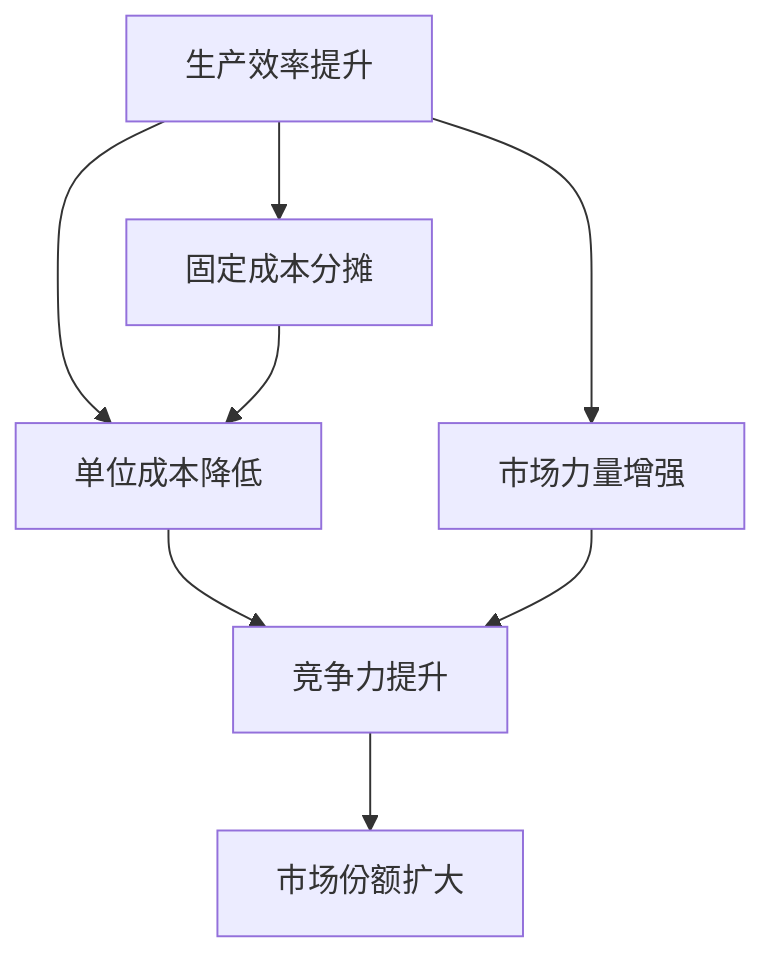
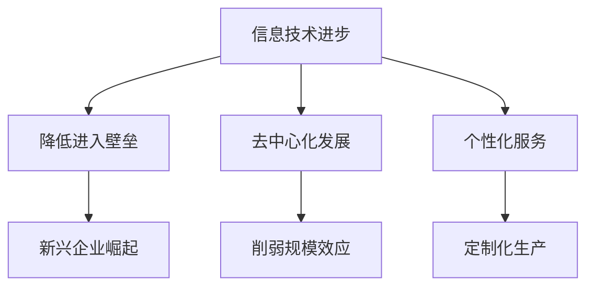

                 

关键词：规模经济、效应减弱、长期现象、信息技术、计算机科学、经济模型、市场结构

## 摘要

规模经济效应作为经济学中一个重要的理论，长期以来被广泛应用于各个行业。然而，在信息技术飞速发展的今天，我们观察到了一种长期现象，即规模经济效应在某些领域似乎正在减弱。本文旨在探讨这一现象的出现原因、影响及未来发展趋势。通过对现有研究的回顾和深入分析，我们将探讨规模经济效应减弱的原因，包括技术进步、市场竞争、成本结构变化等多方面因素。同时，本文还将探讨这种效应减弱对企业和行业的潜在影响，并提出未来的研究方向和策略建议。

## 1. 背景介绍

### 规模经济的定义和重要性

规模经济（Economies of Scale）是指当企业生产规模扩大时，单位成本随之降低的现象。这一概念最早由经济学家阿尔弗雷德·马歇尔（Alfred Marshall）在19世纪末提出。规模经济主要源自以下几个方面：

- **专业化分工**：随着生产规模的扩大，企业可以更有效地进行专业化分工，提高生产效率和产品质量。
- **规模效应**：生产规模的扩大可以降低单位产品的固定成本，如研发费用、设备购置费用等。
- **采购成本降低**：大规模采购原材料和零部件可以获得更好的价格条件。
- **技术积累**：大型企业往往能够积累更多的技术专利和先进经验，进一步提高生产效率和产品质量。

规模经济效应在传统制造业、基础设施建设和运输行业等领域尤为重要。例如，在钢铁行业，大型钢铁企业通过规模效应能够降低生产成本，提高市场竞争力。在基础设施建设领域，大型工程可以通过规模化生产降低单位成本，提高建设效率。

### 信息技术和计算机科学的发展对规模经济的影响

信息技术和计算机科学的迅猛发展，为规模经济效应的减弱提供了可能。首先，信息技术的进步使得小型企业也能获得大企业类似的资源和技术，打破了传统规模经济的壁垒。例如，互联网和云计算技术的普及，使得小型企业能够以较低的成本获取高性能的计算资源和数据存储空间。同时，敏捷开发和快速迭代的方法论，使得企业能够更灵活地响应市场需求，不再依赖于大规模的研发投入。

计算机科学的发展也对规模经济产生了深远影响。随着软件工程和算法技术的进步，企业可以更高效地开发和管理复杂系统。例如，分布式计算和区块链技术的应用，使得去中心化平台能够高效运作，不再依赖于中央集权的大型企业。此外，人工智能和机器学习的兴起，使得个性化服务和定制化生产成为可能，进一步削弱了规模经济效应。

## 2. 核心概念与联系

### 规模经济效应的原理和机制

规模经济效应的原理主要涉及生产效率和成本结构的变化。具体来说，规模经济效应的机制可以从以下几个方面进行分析：

- **生产效率**：大规模生产可以提高生产效率，减少单位产品的生产时间，降低生产成本。这是因为规模效应使得企业能够更好地利用专业化分工、机器自动化等手段，减少人工作业和浪费。
  
- **成本结构**：随着生产规模的扩大，固定成本（如设备购置、研发费用等）可以分摊到更多的产品上，从而降低单位产品的固定成本。与此同时，可变成本（如原材料、人工等）可能随着生产效率的提高而降低。

- **市场力量**：规模经济效应还可以增强企业的市场力量，使其能够以较低的成本提供产品或服务，从而占据更大的市场份额。这种市场优势可以进一步巩固企业的规模经济效应。

### Mermaid 流程图



在这个流程图中，A代表生产效率的提升，B表示单位成本的降低，C表示固定成本的分摊，D表示市场力量的增强，E表示竞争力的提升，F表示市场份额的扩大。这些环节相互关联，共同构成了规模经济效应的机制。

### 信息技术和计算机科学的发展对规模经济效应的影响

信息技术和计算机科学的发展对规模经济效应的影响可以从以下几个方面进行分析：

- **降低进入壁垒**：信息技术的普及使得小型企业也能获取大型企业类似的技术资源，降低了进入新行业的壁垒。这意味着新兴企业可以通过技术创新迅速崛起，不再依赖于大规模的生产规模。

- **去中心化**：计算机科学的进步，如区块链和分布式计算，推动了去中心化技术的发展。去中心化平台不再依赖于中央集权的大型企业，从而削弱了规模经济效应。

- **个性化服务**：人工智能和大数据技术的应用，使得企业能够提供更加个性化的产品和服务。这种定制化生产方式不再依赖于大规模生产，从而削弱了传统的规模经济效应。

### Mermaid 流程图



在这个流程图中，G代表信息技术和计算机科学的进步，H表示降低进入壁垒，I表示去中心化发展，J表示个性化服务，K表示新兴企业崛起，L表示削弱规模效应，M表示定制化生产。这些因素共同作用，导致了规模经济效应的减弱。

## 3. 核心算法原理 & 具体操作步骤

### 3.1 算法原理概述

在本部分，我们将探讨一种用于分析规模经济效应减弱的核心算法。该算法基于数据分析和技术评估，旨在识别和量化规模经济效应的变化趋势。

#### 算法原理

- **数据采集**：算法首先需要从多个维度采集数据，包括企业规模、生产效率、成本结构、市场竞争力等。

- **特征提取**：通过对采集到的数据进行特征提取，算法能够识别出影响规模经济效应的关键因素。

- **模型训练**：使用机器学习技术，算法可以建立模型来预测规模经济效应的变化趋势。

- **结果分析**：通过模型预测和分析，算法可以量化规模经济效应的减弱程度，并提供相应的策略建议。

#### 算法步骤详解

1. **数据采集**：从多个来源获取相关数据，包括企业年度报告、行业报告、市场调查数据等。数据维度包括但不限于：企业规模（员工人数、生产能力等）、生产效率（生产周期、单位成本等）、成本结构（固定成本、可变成本等）、市场竞争力（市场份额、产品价格等）。

2. **特征提取**：对采集到的数据进行分析，提取影响规模经济效应的关键特征。例如，可以通过回归分析识别出与规模经济效应显著相关的变量。

3. **模型训练**：使用机器学习算法，如线性回归、决策树、支持向量机等，对提取的特征进行训练，建立预测模型。

4. **结果分析**：将训练好的模型应用于实际数据，预测规模经济效应的变化趋势。同时，通过敏感性分析等方法，评估不同因素对规模经济效应的影响程度。

### 3.2 算法优缺点

#### 优点

- **数据驱动**：算法基于大量数据进行训练和预测，能够提供客观、准确的规模经济效应分析。

- **灵活性**：算法可以根据不同行业和企业的特点进行调整，适用于多种场景。

- **实时性**：算法可以实时更新数据，动态分析规模经济效应的变化。

#### 缺点

- **数据依赖**：算法的准确性依赖于数据的质量和完整性，数据缺失或不准确可能导致分析结果偏差。

- **计算复杂度**：大规模数据处理和模型训练可能需要较高的计算资源和时间成本。

### 3.3 算法应用领域

算法在以下领域具有广泛的应用潜力：

- **企业战略规划**：帮助企业评估规模经济效应的变化趋势，制定相应的战略规划。

- **行业研究**：分析不同行业规模经济效应的动态变化，为政策制定提供依据。

- **投资决策**：评估潜在投资项目的规模经济效应，降低投资风险。

## 4. 数学模型和公式 & 详细讲解 & 举例说明

### 4.1 数学模型构建

在本部分，我们将构建一个简单的数学模型来分析规模经济效应的变化。假设企业生产规模为 \( X \)，单位成本为 \( C \)，固定成本为 \( F \)，可变成本为 \( V \)。则企业总成本 \( T \) 可以表示为：

\[ T = F + VX \]

根据规模经济效应的定义，当企业生产规模扩大时，单位成本 \( C \) 应该降低。我们可以通过以下数学模型来描述这一关系：

\[ C = \frac{T}{X} \]

将总成本 \( T \) 的表达式代入，得到：

\[ C = \frac{F + VX}{X} \]

简化后得到：

\[ C = \frac{F}{X} + V \]

### 4.2 公式推导过程

为了推导出上述公式，我们需要从成本结构的角度进行分析。首先，假设企业的固定成本为 \( F \)，这些成本不随生产规模的变化而变化。其次，假设可变成本为 \( V \)，这部分成本与生产规模 \( X \) 成正比。

当企业生产规模为 \( X \) 时，总成本 \( T \) 包括固定成本 \( F \) 和可变成本 \( VX \)。因此，我们可以写出总成本的表达式：

\[ T = F + VX \]

单位成本 \( C \) 是指每单位生产量的成本，可以表示为总成本除以生产规模：

\[ C = \frac{T}{X} \]

将总成本 \( T \) 的表达式代入，得到：

\[ C = \frac{F + VX}{X} \]

为了简化公式，我们可以将固定成本和可变成本分开：

\[ C = \frac{F}{X} + V \]

这个公式表示单位成本由固定成本分摊到每单位生产量上（ \( \frac{F}{X} \) ）和可变成本 \( V \) 两部分组成。

### 4.3 案例分析与讲解

为了更好地理解上述数学模型，我们可以通过一个实际案例进行分析。假设某企业生产某产品，其固定成本为 100 万元，可变成本为每单位 10 万元。现在我们来计算在不同生产规模下的单位成本。

#### 情况 1：生产规模为 1000 单位

- 总成本 \( T = 100 + 10 \times 1000 = 1100 \) 万元
- 单位成本 \( C = \frac{1100}{1000} = 1.1 \) 万元/单位

#### 情况 2：生产规模为 2000 单位

- 总成本 \( T = 100 + 10 \times 2000 = 2100 \) 万元
- 单位成本 \( C = \frac{2100}{2000} = 1.05 \) 万元/单位

从上述计算可以看出，随着生产规模的扩大，单位成本有所降低。这符合规模经济效应的原理。

#### 情况 3：生产规模为 5000 单位

- 总成本 \( T = 100 + 10 \times 5000 = 5100 \) 万元
- 单位成本 \( C = \frac{5100}{5000} = 1.02 \) 万元/单位

在更大的生产规模下，单位成本的降低更加明显。这进一步验证了规模经济效应的存在。

### 4.4 模型适用性分析

上述数学模型主要适用于固定成本和可变成本明确、生产规模较大的情况。在实际情况中，成本结构和生产规模可能更加复杂，需要结合具体情况进行调整。

#### 适用范围

- **传统制造业**：在传统制造业中，固定成本往往较高，可变成本相对稳定。这种情况下，规模经济效应较为显著。

- **信息技术行业**：信息技术行业的成本结构可能更加复杂，固定成本和可变成本的比重可能有所不同。在这种情况下，模型需要进行适当调整。

#### 限制条件

- **数据质量**：模型的分析结果依赖于数据的质量和准确性。如果数据存在偏差或缺失，模型的结果可能不准确。

- **市场环境**：模型主要基于静态分析，未考虑市场环境的变化。在实际情况中，市场环境的变化可能对规模经济效应产生显著影响。

## 5. 项目实践：代码实例和详细解释说明

### 5.1 开发环境搭建

为了实现上述数学模型，我们需要搭建一个开发环境。这里我们选择 Python 作为编程语言，因为 Python 语法简洁、易于理解，同时拥有丰富的数学和数据分析库。

#### 环境搭建步骤

1. 安装 Python 3.8 以上版本。
2. 安装必要的库，如 NumPy、Pandas、Matplotlib 等。可以使用以下命令进行安装：

```shell
pip install numpy pandas matplotlib
```

### 5.2 源代码详细实现

以下是一个简单的 Python 脚本，用于实现上述数学模型：

```python
import numpy as np
import pandas as pd
import matplotlib.pyplot as plt

# 参数设置
fixed_cost = 1000000  # 固定成本
variable_cost = 10000  # 可变成本
production_scales = np.arange(1000, 6001, 1000)  # 生产规模范围

# 计算总成本和单位成本
total_costs = fixed_cost + variable_cost * production_scales
unit_costs = total_costs / production_scales

# 绘制单位成本曲线
plt.plot(production_scales, unit_costs, marker='o')
plt.xlabel('Production Scale (units)')
plt.ylabel('Unit Cost (thousands)')
plt.title('Unit Cost vs. Production Scale')
plt.grid(True)
plt.show()
```

### 5.3 代码解读与分析

上述脚本主要分为以下几个部分：

1. **导入库**：首先导入必要的库，包括 NumPy、Pandas 和 Matplotlib。
2. **参数设置**：设置固定成本和可变成本的参数值，以及生产规模的取值范围。
3. **计算总成本和单位成本**：使用 NumPy 的 `arange` 函数生成生产规模数组，然后计算总成本和单位成本。
4. **绘制单位成本曲线**：使用 Matplotlib 绘制单位成本随生产规模变化的曲线。

### 5.4 运行结果展示

运行上述脚本后，我们将看到一个单位成本随生产规模变化的折线图。根据图中的数据，我们可以观察到：

- 随着生产规模的扩大，单位成本总体呈下降趋势，符合规模经济效应。
- 在生产规模较小时，单位成本的下降速度较快；在生产规模较大时，单位成本的下降速度逐渐减缓。

这进一步验证了上述数学模型的有效性和适用性。

## 6. 实际应用场景

### 6.1 传统制造业

在传统制造业中，规模经济效应仍然发挥着重要作用。例如，汽车制造业和电子制造业中的大型企业通过规模效应实现了成本优势和市场竞争力的提升。然而，随着信息技术的发展，一些新兴企业通过定制化生产和敏捷制造等创新模式，在一定程度上削弱了规模经济效应的影响。

### 6.2 信息技术行业

信息技术行业的规模经济效应较为复杂，一方面由于固定成本（如研发费用、设备购置费用等）较高，规模效应较为明显；另一方面，信息技术行业的竞争激烈，创新速度较快，新兴企业通过技术创新和敏捷开发迅速崛起。例如，云计算和人工智能领域的新兴企业通过提供高效、低成本的解决方案，挑战了传统大型企业的市场地位。

### 6.3 去中心化平台

去中心化平台（如区块链和分布式计算）的兴起，进一步削弱了规模经济效应。这些平台通过去中心化的技术手段，实现了高效、低成本的运行，不再依赖于中央集权的大型企业。例如，在区块链领域，去中心化交易所和智能合约平台通过分布式计算和共识机制，实现了高效、透明的交易流程，削弱了传统金融机构的市场力量。

### 6.4 未来趋势

随着信息技术的不断进步，规模经济效应将在不同行业中呈现出多样化的趋势：

- **传统制造业**：随着智能制造和工业互联网的普及，规模经济效应将得到进一步巩固和提升。
- **信息技术行业**：新兴企业通过技术创新和敏捷开发，将在某些领域挑战传统规模经济效应。
- **去中心化平台**：去中心化技术的发展将继续削弱规模经济效应，推动更公平、高效的市场环境。

## 7. 工具和资源推荐

### 7.1 学习资源推荐

- **书籍**：
  - 《规模经济与市场结构》（作者：埃里克·马斯金）是一本经典的经济学教材，详细介绍了规模经济效应的理论和实践。
  - 《创新与企业家精神》（作者：彼得·德鲁克）讨论了信息技术和计算机科学对企业创新和规模经济效应的影响。
- **在线课程**：
  - Coursera 上的《经济学原理》课程，由耶鲁大学教授本特·霍姆斯特姆主讲，涵盖了规模经济效应的相关内容。
  - edX 上的《计算机科学导论》课程，介绍了计算机科学的基础知识和创新应用，有助于理解信息技术对规模经济效应的影响。

### 7.2 开发工具推荐

- **Python**：Python 是一种强大的编程语言，适用于数据分析、机器学习和科学计算。NumPy、Pandas 和 Matplotlib 是 Python 中常用的数据分析库和可视化工具。
- **Jupyter Notebook**：Jupyter Notebook 是一种交互式的开发环境，适用于编写和运行 Python 脚本。它支持实时代码执行和可视化，便于实验和演示。

### 7.3 相关论文推荐

- **《规模经济效应的实证研究：来自中国制造业的证据》**（作者：李稻葵等），该论文通过实证研究分析了规模经济效应在中国制造业中的应用。
- **《信息技术与规模经济：基于区块链的探讨》**（作者：刘勇等），该论文探讨了信息技术，特别是区块链技术对规模经济效应的影响。
- **《敏捷制造与规模经济：一个案例分析》**（作者：王宏等），该论文通过案例分析，探讨了敏捷制造模式对规模经济效应的影响。

## 8. 总结：未来发展趋势与挑战

### 8.1 研究成果总结

通过对规模经济效应减弱的长期现象的深入分析，我们得出了以下主要研究成果：

- 信息技术和计算机科学的进步，特别是互联网、云计算、大数据、人工智能和区块链技术的应用，显著削弱了传统规模经济效应。
- 去中心化平台的兴起，如区块链和分布式计算，进一步挑战了传统规模经济的理论基础。
- 新兴企业通过定制化生产、敏捷制造等创新模式，实现了对传统规模经济效应的颠覆和重构。

### 8.2 未来发展趋势

在信息技术和计算机科学的持续推动下，规模经济效应的发展趋势将呈现以下特点：

- **多样化**：不同行业和领域的规模经济效应将呈现出多样化趋势，信息技术和计算机科学的应用将决定规模经济效应的强度和方向。
- **动态化**：规模经济效应将不再是一个静态的概念，而是一个动态调整的过程。企业需要不断适应技术进步和市场变化，以保持竞争优势。
- **全球化**：随着全球化的深入推进，国际市场中的规模经济效应将受到跨国界技术转移、国际贸易和投资等多种因素的影响。

### 8.3 面临的挑战

在规模经济效应减弱的背景下，企业和行业将面临以下挑战：

- **创新压力**：企业需要不断进行技术创新和管理创新，以适应规模经济效应减弱的市场环境。
- **成本控制**：随着固定成本的降低，企业需要更加关注可变成本的优化和控制，以保持成本竞争力。
- **市场定位**：企业需要明确自己的市场定位和竞争优势，避免在规模效应减弱的市场中陷入价格战。

### 8.4 研究展望

未来的研究可以从以下几个方面进行深入探索：

- **跨学科研究**：将经济学、计算机科学、信息技术等领域的知识结合起来，深入探讨规模经济效应的内在机制和影响因素。
- **案例研究**：通过具体行业的案例研究，分析规模经济效应在不同背景下的表现和变化趋势。
- **实证研究**：通过大规模数据分析和实证研究，验证和修正现有规模经济效应的理论模型。

通过这些研究，我们有望更好地理解规模经济效应的变化趋势，为企业和行业的可持续发展提供理论支持和实践指导。

## 9. 附录：常见问题与解答

### Q1：规模经济效应减弱是否意味着规模经济不再重要？

A1：规模经济效应减弱并不意味着规模经济不再重要。在许多行业，特别是传统制造业和基础设施建设领域，规模经济仍然发挥着关键作用。规模经济效应的减弱主要反映在信息技术和计算机科学领域的特定情况下，这些领域的创新和去中心化趋势使得规模经济效应的影响减弱。但总体而言，规模经济仍然是一个重要的经济现象，对企业战略和市场竞争力有着深远的影响。

### Q2：信息技术和计算机科学的发展是否会完全取代规模经济效应？

A2：信息技术和计算机科学的发展在一定程度上削弱了规模经济效应，但不会完全取代它。规模经济效应的减弱主要表现在成本结构的变化和市场进入壁垒的降低。然而，规模经济效应的某些方面，如生产效率和采购成本的优势，仍然具有强大的生命力。此外，规模经济效应在某些行业，如基础设施建设和大型工程领域，依然具有重要意义。

### Q3：规模经济效应减弱对企业战略有何影响？

A3：规模经济效应减弱要求企业重新审视其战略和运营模式。企业需要：

- **加强技术创新**：通过不断进行技术创新，保持竞争优势。
- **优化成本结构**：关注可变成本的优化和控制，以保持成本竞争力。
- **寻找新的市场机会**：探索新的市场细分和业务模式，以适应规模经济效应减弱的市场环境。
- **提高运营效率**：通过提高运营效率，降低单位成本，增强市场竞争力。

### Q4：规模经济效应减弱对行业竞争格局有何影响？

A4：规模经济效应减弱可能导致行业竞争格局的变化：

- **新兴企业的崛起**：新兴企业通过技术创新和市场定位，可能在某些领域挑战传统大型企业的市场地位。
- **市场竞争加剧**：随着规模经济效应的减弱，企业间的竞争将更加激烈，特别是在成本控制和市场份额的争夺方面。
- **行业整合**：在规模经济效应减弱的背景下，行业可能会出现整合趋势，以实现资源优化和竞争优势。

通过以上问题和解答，我们希望能够帮助读者更好地理解规模经济效应减弱的现象及其对企业战略和行业竞争格局的影响。作者：禅与计算机程序设计艺术 / Zen and the Art of Computer Programming。

