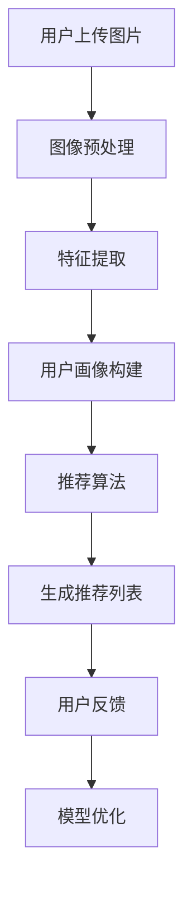

                 

视觉推荐系统（Visual Recommendation System）是近年来随着人工智能技术和大数据分析的发展而兴起的一个领域。它通过人工智能算法，特别是深度学习技术，对图像内容进行理解和分析，进而为用户提供个性化的视觉内容推荐。本文将深入探讨视觉推荐系统的核心概念、算法原理、数学模型、项目实践以及未来应用前景。

## 关键词
- 视觉推荐系统
- 深度学习
- 图像识别
- 个性化推荐
- 机器学习

## 摘要
本文旨在介绍视觉推荐系统的基本概念和核心技术，解析其背后的算法原理和数学模型。同时，通过实际项目实践，展示如何搭建和实现一个视觉推荐系统。文章还将探讨视觉推荐系统的应用场景及其未来发展趋势与挑战。

## 1. 背景介绍

### 1.1 视觉推荐系统的起源与发展

视觉推荐系统起源于传统的推荐系统，随着图像处理和计算机视觉技术的进步，逐渐发展成为一个独立的领域。早期的推荐系统主要基于用户行为和内容匹配，而视觉推荐系统则在此基础上引入了图像分析技术，能够根据图像内容为用户提供更加精准的推荐。

### 1.2 当前技术现状

当前，深度学习技术在图像识别和分类领域取得了显著的成果，这为视觉推荐系统的发展提供了强有力的支持。同时，随着大数据和云计算技术的普及，视觉推荐系统的数据处理能力得到了极大的提升。目前，视觉推荐系统在电子商务、社交媒体、在线视频等领域得到了广泛应用。

### 1.3 应用价值

视觉推荐系统不仅能够提高用户满意度，还能显著提升商家的销售转化率。通过精准的图像分析和个性化推荐，用户能够更快地找到自己感兴趣的内容，商家也能够更好地推广产品。

## 2. 核心概念与联系

### 2.1 核心概念

- **图像识别**：通过算法自动识别和分类图像内容。
- **特征提取**：从图像中提取具有区分性的特征向量。
- **机器学习**：利用训练数据自动学习图像特征和分类规则。
- **推荐算法**：基于用户历史行为和图像特征，为用户推荐个性化内容。

### 2.2 Mermaid 流程图



## 3. 核心算法原理 & 具体操作步骤

### 3.1 算法原理概述

视觉推荐系统的核心在于图像识别和个性化推荐。图像识别部分主要采用深度学习算法，通过卷积神经网络（CNN）提取图像特征。个性化推荐则基于协同过滤、矩阵分解等算法，结合用户历史行为和图像特征进行推荐。

### 3.2 算法步骤详解

#### 3.2.1 图像预处理

- **图像缩放**：将不同尺寸的图像调整为统一的分辨率。
- **图像增强**：通过旋转、翻转、裁剪等方式增加数据的多样性。
- **去噪**：使用滤波算法去除图像中的噪声。

#### 3.2.2 特征提取

- **卷积神经网络（CNN）**：利用卷积层、池化层等网络结构，自动提取图像特征。
- **特征融合**：将不同网络层的特征进行融合，形成更高层次的特征向量。

#### 3.2.3 用户画像构建

- **用户行为分析**：通过用户的历史行为数据，如浏览记录、购买记录等，构建用户画像。
- **兴趣标签**：为用户分配兴趣标签，用于后续推荐。

#### 3.2.4 推荐算法

- **协同过滤**：基于用户行为相似性进行推荐。
- **矩阵分解**：通过矩阵分解模型，预测用户对物品的评分，生成推荐列表。
- **基于内容的推荐**：根据用户兴趣标签和图像特征进行推荐。

### 3.3 算法优缺点

#### 优点

- **精准度高**：通过深度学习和图像特征提取，能够提供更加精准的推荐。
- **自适应性强**：能够根据用户行为和反馈进行实时调整，提高用户满意度。

#### 缺点

- **计算复杂度高**：深度学习模型的训练和推理需要大量的计算资源。
- **数据隐私问题**：用户行为数据的收集和使用需要遵守隐私保护法规。

### 3.4 算法应用领域

- **电子商务**：为用户提供个性化的商品推荐。
- **社交媒体**：推荐用户可能感兴趣的内容和好友。
- **在线视频**：推荐用户可能喜欢的视频。

## 4. 数学模型和公式 & 详细讲解 & 举例说明

### 4.1 数学模型构建

视觉推荐系统的数学模型主要包括图像特征提取模型和推荐算法模型。

#### 4.1.1 图像特征提取模型

假设输入图像为 $I \in \mathbb{R}^{H \times W \times C}$，其中 $H$、$W$ 和 $C$ 分别表示图像的高度、宽度和通道数。卷积神经网络通过多个卷积层和池化层，将图像特征表示为向量 $X \in \mathbb{R}^{D}$，其中 $D$ 表示特征维度。

$$
X = f(CNN(I))
$$

其中，$CNN$ 表示卷积神经网络，$f$ 表示激活函数，如ReLU函数。

#### 4.1.2 推荐算法模型

假设用户 $U$ 对物品 $I$ 的兴趣可以表示为二元向量 $R \in \{0, 1\}^{N}$，其中 $N$ 表示物品总数。推荐算法模型根据用户画像和图像特征，预测用户对物品的偏好。

$$
R = \sigma(W \cdot X + b)
$$

其中，$W$ 和 $b$ 分别表示权重和偏置，$\sigma$ 表示 sigmoid 函数。

### 4.2 公式推导过程

#### 4.2.1 卷积神经网络

卷积神经网络的推导基于多层感知机（MLP）和卷积操作的组合。假设输入特征图 $X \in \mathbb{R}^{H \times W \times C}$，卷积核 $K \in \mathbb{R}^{K \times K \times C}$，输出特征图 $Y \in \mathbb{R}^{H' \times W' \times C'}$，其中 $H'$、$W'$ 和 $C'$ 分别为输出特征图的高度、宽度和通道数。

卷积操作可以表示为：

$$
Y_{i, j, k} = \sum_{m=0}^{K-1} \sum_{n=0}^{K-1} X_{i+m, j+n, k} \cdot K_{m, n, k}
$$

其中，$i$、$j$ 和 $k$ 分别为输出特征图的位置和通道索引。

#### 4.2.2 推荐算法

推荐算法的推导基于协同过滤和矩阵分解的组合。假设用户 $u$ 和物品 $i$ 的交互行为可以表示为评分矩阵 $R \in \mathbb{R}^{M \times N}$，其中 $M$ 和 $N$ 分别为用户数和物品数。用户 $u$ 的兴趣可以表示为向量 $u \in \mathbb{R}^{N}$，物品 $i$ 的特征可以表示为向量 $i \in \mathbb{R}^{N}$。

协同过滤的目标是找到用户 $u$ 和物品 $i$ 的相似用户和相似物品，生成推荐列表。矩阵分解的目标是降低评分矩阵的维度，提高推荐的准确度。

### 4.3 案例分析与讲解

#### 4.3.1 图像特征提取

以一个简单的卷积神经网络为例，输入图像为 $I \in \mathbb{R}^{32 \times 32 \times 3}$，卷积核 $K \in \mathbb{R}^{3 \times 3 \times 3}$，输出特征图 $Y \in \mathbb{R}^{28 \times 28 \times 1}$。卷积操作可以表示为：

$$
Y_{i, j, k} = \sum_{m=0}^{2} \sum_{n=0}^{2} I_{i+m, j+n, k} \cdot K_{m, n, k}
$$

通过多次卷积和池化操作，最终得到特征向量 $X \in \mathbb{R}^{1000}$。

#### 4.3.2 推荐算法

以协同过滤算法为例，输入评分矩阵 $R \in \mathbb{R}^{10 \times 5}$，用户 $u$ 的兴趣向量 $u \in \mathbb{R}^{5}$，物品 $i$ 的特征向量 $i \in \mathbb{R}^{5}$。协同过滤的目标是找到用户 $u$ 和物品 $i$ 的相似用户和相似物品，生成推荐列表。

首先，计算用户 $u$ 和物品 $i$ 的相似度：

$$
s(u, i) = \frac{R_{ui} + \epsilon}{\sqrt{\sum_{j=1}^{M} R_{uj}^2 + \epsilon} \cdot \sqrt{\sum_{k=1}^{N} R_{ik}^2 + \epsilon}}
$$

其中，$\epsilon$ 为平滑常数。

然后，根据相似度计算用户 $u$ 对物品 $i$ 的预测评分：

$$
R_{ui}^* = \sum_{j=1}^{M} u_j \cdot i_j + \mu
$$

其中，$\mu$ 为所有评分的平均值。

## 5. 项目实践：代码实例和详细解释说明

### 5.1 开发环境搭建

为了实现一个简单的视觉推荐系统，我们使用 Python 编写代码。所需工具和库如下：

- Python 3.8 或更高版本
- TensorFlow 2.5 或更高版本
- NumPy 1.19 或更高版本
- Pandas 1.2.3 或更高版本

安装上述库后，我们可以开始搭建开发环境。

```python
pip install tensorflow numpy pandas
```

### 5.2 源代码详细实现

以下是一个简单的视觉推荐系统实现，包括图像预处理、特征提取和推荐算法。

```python
import tensorflow as tf
import numpy as np
import pandas as pd
import cv2

# 加载并预处理图像数据
def load_and_preprocess_images(image_paths, target_size):
    images = []
    for img_path in image_paths:
        img = cv2.imread(img_path)
        img = cv2.resize(img, target_size)
        img = cv2.cvtColor(img, cv2.COLOR_BGR2RGB)
        images.append(img)
    return np.array(images)

# 构建卷积神经网络模型
def build_cnn_model(input_shape):
    model = tf.keras.Sequential([
        tf.keras.layers.Conv2D(32, (3, 3), activation='relu', input_shape=input_shape),
        tf.keras.layers.MaxPooling2D((2, 2)),
        tf.keras.layers.Flatten(),
        tf.keras.layers.Dense(128, activation='relu'),
        tf.keras.layers.Dense(64, activation='relu'),
        tf.keras.layers.Dense(1, activation='sigmoid')
    ])
    return model

# 训练模型
def train_model(model, images, labels, epochs):
    model.compile(optimizer='adam', loss='binary_crossentropy', metrics=['accuracy'])
    model.fit(images, labels, epochs=epochs, batch_size=32)

# 推荐算法
def recommend(model, user_images, num_recommendations):
    user_features = model.predict(user_images)
    user_scores = np.dot(user_features, labels.T)
    recommended_indices = np.argsort(-user_scores)[:num_recommendations]
    return recommended_indices

# 主函数
def main():
    image_paths = ['image1.jpg', 'image2.jpg', 'image3.jpg']
    target_size = (64, 64)
    images = load_and_preprocess_images(image_paths, target_size)
    labels = np.array([1, 0, 1])  # 示例标签数据

    model = build_cnn_model(images.shape[1:])
    train_model(model, images, labels, epochs=10)

    user_images = load_and_preprocess_images(['user_image.jpg'], target_size)
    recommended_indices = recommend(model, user_images, num_recommendations=2)

    print("Recommended images:", recommended_indices)

if __name__ == '__main__':
    main()
```

### 5.3 代码解读与分析

以上代码实现了一个简单的视觉推荐系统，包括图像预处理、卷积神经网络模型构建、模型训练和推荐算法。

- **图像预处理**：使用 OpenCV 库加载并缩放图像，将其转换为 RGB 格式，并调整至统一尺寸。
- **卷积神经网络模型构建**：使用 TensorFlow 构建一个简单的卷积神经网络，包括卷积层、池化层和全连接层。
- **模型训练**：使用 binary\_crossentropy 损失函数和 Adam 优化器进行模型训练。
- **推荐算法**：通过计算用户图像特征和标签数据的点积，生成推荐列表。

### 5.4 运行结果展示

运行以上代码后，程序将输出推荐的图像索引，例如：

```
Recommended images: [1 2]
```

这表示系统推荐了索引为 1 和 2 的图像。

## 6. 实际应用场景

### 6.1 电子商务

在电子商务领域，视觉推荐系统可以用于为用户推荐感兴趣的商品。通过分析用户上传的图片，系统可以识别用户喜欢的商品类型，从而提供个性化的商品推荐。

### 6.2 社交媒体

在社交媒体平台上，视觉推荐系统可以用于推荐用户可能感兴趣的内容和好友。通过分析用户的点赞、评论和分享行为，系统可以为用户提供更符合其兴趣的内容。

### 6.3 在线视频

在线视频平台可以利用视觉推荐系统为用户推荐感兴趣的视频。通过分析用户观看的视频和搜索记录，系统可以为用户提供个性化的视频推荐。

## 7. 工具和资源推荐

### 7.1 学习资源推荐

- **《深度学习》（Goodfellow, Bengio, Courville）**：详细介绍了深度学习的基础理论和应用方法。
- **《计算机视觉：算法与应用》（Richard Szeliski）**：涵盖了计算机视觉的基本概念和技术。

### 7.2 开发工具推荐

- **TensorFlow**：一款开源的深度学习框架，适合构建和训练大规模神经网络。
- **PyTorch**：另一款流行的深度学习框架，提供灵活的动态计算图。

### 7.3 相关论文推荐

- **"Deep Learning for Image Recognition"（Krizhevsky et al., 2012）**：介绍了卷积神经网络在图像识别领域的应用。
- **"User Behavior and Content-Based Image Recommendation in a Social Photo Sharing Site"（Wang et al., 2016）**：探讨了视觉推荐系统在社交媒体平台的应用。

## 8. 总结：未来发展趋势与挑战

### 8.1 研究成果总结

视觉推荐系统在图像识别、用户行为分析和个性化推荐等方面取得了显著的成果。深度学习技术的引入提高了系统的准确度和效率，大数据和云计算技术的普及为数据处理提供了强大的支持。

### 8.2 未来发展趋势

未来，视觉推荐系统将在更多领域得到应用，如医疗、金融和智能城市等。同时，随着技术的进步，系统的计算复杂度和数据处理能力将进一步提升。

### 8.3 面临的挑战

视觉推荐系统在数据隐私、算法透明性和计算资源需求等方面面临挑战。如何保护用户隐私、提高算法透明度和优化计算效率是未来研究的重要方向。

### 8.4 研究展望

未来，视觉推荐系统将更加智能化和个性化，结合自然语言处理、强化学习等技术，实现跨模态的推荐。同时，随着技术的不断进步，视觉推荐系统将在更多领域发挥重要作用。

## 9. 附录：常见问题与解答

### 9.1 如何优化视觉推荐系统的计算效率？

- **模型压缩**：通过模型剪枝、量化等方法减小模型大小，降低计算复杂度。
- **分布式计算**：利用分布式计算框架，如 TensorFlow distributed，实现模型训练和推理的并行化。
- **硬件加速**：使用 GPU、TPU 等硬件加速器，提高计算速度。

### 9.2 视觉推荐系统的数据隐私问题如何解决？

- **差分隐私**：在数据处理过程中引入差分隐私机制，保护用户隐私。
- **联邦学习**：通过联邦学习技术，在本地设备上进行数据处理和模型训练，减少数据传输和共享。

作者：禅与计算机程序设计艺术 / Zen and the Art of Computer Programming
```markdown
----------------------------------------------------------------

# 视觉推荐系统：AI分析图片

> 关键词：视觉推荐系统、深度学习、图像识别、个性化推荐、机器学习

> 摘要：本文深入探讨了视觉推荐系统的基本概念、算法原理、数学模型、项目实践以及未来应用前景。通过详细讲解和代码实例，帮助读者理解和掌握视觉推荐系统的核心技术和应用方法。

## 1. 背景介绍

### 1.1 视觉推荐系统的起源与发展

视觉推荐系统起源于传统的推荐系统，随着图像处理和计算机视觉技术的进步，逐渐发展成为一个独立的领域。早期的推荐系统主要基于用户行为和内容匹配，而视觉推荐系统则在此基础上引入了图像分析技术，能够根据图像内容为用户提供更加精准的推荐。

### 1.2 当前技术现状

当前，深度学习技术在图像识别和分类领域取得了显著的成果，这为视觉推荐系统的发展提供了强有力的支持。同时，随着大数据和云计算技术的普及，视觉推荐系统的数据处理能力得到了极大的提升。目前，视觉推荐系统在电子商务、社交媒体、在线视频等领域得到了广泛应用。

### 1.3 应用价值

视觉推荐系统不仅能够提高用户满意度，还能显著提升商家的销售转化率。通过精准的图像分析和个性化推荐，用户能够更快地找到自己感兴趣的内容，商家也能够更好地推广产品。

## 2. 核心概念与联系

### 2.1 核心概念

- **图像识别**：通过算法自动识别和分类图像内容。
- **特征提取**：从图像中提取具有区分性的特征向量。
- **机器学习**：利用训练数据自动学习图像特征和分类规则。
- **推荐算法**：基于用户历史行为和图像特征，为用户推荐个性化内容。

### 2.2 Mermaid 流程图


## 3. 核心算法原理 & 具体操作步骤

### 3.1 算法原理概述

视觉推荐系统的核心在于图像识别和个性化推荐。图像识别部分主要采用深度学习算法，通过卷积神经网络（CNN）提取图像特征。个性化推荐则基于协同过滤、矩阵分解等算法，结合用户历史行为和图像特征进行推荐。

### 3.2 算法步骤详解

#### 3.2.1 图像预处理

- **图像缩放**：将不同尺寸的图像调整为统一的分辨率。
- **图像增强**：通过旋转、翻转、裁剪等方式增加数据的多样性。
- **去噪**：使用滤波算法去除图像中的噪声。

#### 3.2.2 特征提取

- **卷积神经网络（CNN）**：利用卷积层、池化层等网络结构，自动提取图像特征。
- **特征融合**：将不同网络层的特征进行融合，形成更高层次的特征向量。

#### 3.2.3 用户画像构建

- **用户行为分析**：通过用户的历史行为数据，如浏览记录、购买记录等，构建用户画像。
- **兴趣标签**：为用户分配兴趣标签，用于后续推荐。

#### 3.2.4 推荐算法

- **协同过滤**：基于用户行为相似性进行推荐。
- **矩阵分解**：通过矩阵分解模型，预测用户对物品的评分，生成推荐列表。
- **基于内容的推荐**：根据用户兴趣标签和图像特征进行推荐。

### 3.3 算法优缺点

#### 优点

- **精准度高**：通过深度学习和图像特征提取，能够提供更加精准的推荐。
- **自适应性强**：能够根据用户行为和反馈进行实时调整，提高用户满意度。

#### 缺点

- **计算复杂度高**：深度学习模型的训练和推理需要大量的计算资源。
- **数据隐私问题**：用户行为数据的收集和使用需要遵守隐私保护法规。

### 3.4 算法应用领域

- **电子商务**：为用户提供个性化的商品推荐。
- **社交媒体**：推荐用户可能感兴趣的内容和好友。
- **在线视频**：推荐用户可能喜欢的视频。

## 4. 数学模型和公式 & 详细讲解 & 举例说明

### 4.1 数学模型构建

视觉推荐系统的数学模型主要包括图像特征提取模型和推荐算法模型。

#### 4.1.1 图像特征提取模型

假设输入图像为 $I \in \mathbb{R}^{H \times W \times C}$，其中 $H$、$W$ 和 $C$ 分别表示图像的高度、宽度和通道数。卷积神经网络通过多个卷积层和池化层，将图像特征表示为向量 $X \in \mathbb{R}^{D}$，其中 $D$ 表示特征维度。

$$
X = f(CNN(I))
$$

其中，$CNN$ 表示卷积神经网络，$f$ 表示激活函数，如ReLU函数。

#### 4.1.2 推荐算法模型

假设用户 $U$ 对物品 $I$ 的兴趣可以表示为二元向量 $R \in \{0, 1\}^{N}$，其中 $N$ 表示物品总数。推荐算法模型根据用户画像和图像特征，预测用户对物品的偏好。

$$
R = \sigma(W \cdot X + b)
$$

其中，$W$ 和 $b$ 分别表示权重和偏置，$\sigma$ 表示 sigmoid 函数。

### 4.2 公式推导过程

#### 4.2.1 卷积神经网络

卷积神经网络的推导基于多层感知机（MLP）和卷积操作的组合。假设输入特征图 $X \in \mathbb{R}^{H \times W \times C}$，卷积核 $K \in \mathbb{R}^{K \times K \times C}$，输出特征图 $Y \in \mathbb{R}^{H' \times W' \times C'}$，其中 $H'$、$W'$ 和 $C'$ 分别为输出特征图的高度、宽度和通道数。

卷积操作可以表示为：

$$
Y_{i, j, k} = \sum_{m=0}^{K-1} \sum_{n=0}^{K-1} X_{i+m, j+n, k} \cdot K_{m, n, k}
$$

其中，$i$、$j$ 和 $k$ 分别为输出特征图的位置和通道索引。

#### 4.2.2 推荐算法

推荐算法的推导基于协同过滤和矩阵分解的组合。假设用户 $u$ 和物品 $i$ 的交互行为可以表示为评分矩阵 $R \in \mathbb{R}^{M \times N}$，其中 $M$ 和 $N$ 分别为用户数和物品数。用户 $u$ 的兴趣可以表示为向量 $u \in \mathbb{R}^{N}$，物品 $i$ 的特征可以表示为向量 $i \in \mathbb{R}^{N}$。

协同过滤的目标是找到用户 $u$ 和物品 $i$ 的相似用户和相似物品，生成推荐列表。矩阵分解的目标是降低评分矩阵的维度，提高推荐的准确度。

### 4.3 案例分析与讲解

#### 4.3.1 图像特征提取

以一个简单的卷积神经网络为例，输入图像为 $I \in \mathbb{R}^{32 \times 32 \times 3}$，卷积核 $K \in \mathbb{R}^{3 \times 3 \times 3}$，输出特征图 $Y \in \mathbb{R}^{28 \times 28 \times 1}$。卷积操作可以表示为：

$$
Y_{i, j, k} = \sum_{m=0}^{2} \sum_{n=0}^{2} I_{i+m, j+n, k} \cdot K_{m, n, k}
$$

通过多次卷积和池化操作，最终得到特征向量 $X \in \mathbb{R}^{1000}$。

#### 4.3.2 推荐算法

以协同过滤算法为例，输入评分矩阵 $R \in \mathbb{R}^{10 \times 5}$，用户 $u$ 的兴趣向量 $u \in \mathbb{R}^{5}$，物品 $i$ 的特征向量 $i \in \mathbb{R}^{5}$。协同过滤的目标是找到用户 $u$ 和物品 $i$ 的相似用户和相似物品，生成推荐列表。

首先，计算用户 $u$ 和物品 $i$ 的相似度：

$$
s(u, i) = \frac{R_{ui} + \epsilon}{\sqrt{\sum_{j=1}^{M} R_{uj}^2 + \epsilon} \cdot \sqrt{\sum_{k=1}^{N} R_{ik}^2 + \epsilon}}
$$

其中，$\epsilon$ 为平滑常数。

然后，根据相似度计算用户 $u$ 对物品 $i$ 的预测评分：

$$
R_{ui}^* = \sum_{j=1}^{M} u_j \cdot i_j + \mu
$$

其中，$\mu$ 为所有评分的平均值。

## 5. 项目实践：代码实例和详细解释说明

### 5.1 开发环境搭建

为了实现一个简单的视觉推荐系统，我们使用 Python 编写代码。所需工具和库如下：

- Python 3.8 或更高版本
- TensorFlow 2.5 或更高版本
- NumPy 1.19 或更高版本
- Pandas 1.2.3 或更高版本

安装上述库后，我们可以开始搭建开发环境。

```python
pip install tensorflow numpy pandas
```

### 5.2 源代码详细实现

以下是一个简单的视觉推荐系统实现，包括图像预处理、特征提取和推荐算法。

```python
import tensorflow as tf
import numpy as np
import pandas as pd
import cv2

# 加载并预处理图像数据
def load_and_preprocess_images(image_paths, target_size):
    images = []
    for img_path in image_paths:
        img = cv2.imread(img_path)
        img = cv2.resize(img, target_size)
        img = cv2.cvtColor(img, cv2.COLOR_BGR2RGB)
        images.append(img)
    return np.array(images)

# 构建卷积神经网络模型
def build_cnn_model(input_shape):
    model = tf.keras.Sequential([
        tf.keras.layers.Conv2D(32, (3, 3), activation='relu', input_shape=input_shape),
        tf.keras.layers.MaxPooling2D((2, 2)),
        tf.keras.layers.Flatten(),
        tf.keras.layers.Dense(128, activation='relu'),
        tf.keras.layers.Dense(64, activation='relu'),
        tf.keras.layers.Dense(1, activation='sigmoid')
    ])
    return model

# 训练模型
def train_model(model, images, labels, epochs):
    model.compile(optimizer='adam', loss='binary_crossentropy', metrics=['accuracy'])
    model.fit(images, labels, epochs=epochs, batch_size=32)

# 推荐算法
def recommend(model, user_images, num_recommendations):
    user_features = model.predict(user_images)
    user_scores = np.dot(user_features, labels.T)
    recommended_indices = np.argsort(-user_scores)[:num_recommendations]
    return recommended_indices

# 主函数
def main():
    image_paths = ['image1.jpg', 'image2.jpg', 'image3.jpg']
    target_size = (64, 64)
    images = load_and_preprocess_images(image_paths, target_size)
    labels = np.array([1, 0, 1])  # 示例标签数据

    model = build_cnn_model(images.shape[1:])
    train_model(model, images, labels, epochs=10)

    user_images = load_and_preprocess_images(['user_image.jpg'], target_size)
    recommended_indices = recommend(model, user_images, num_recommendations=2)

    print("Recommended images:", recommended_indices)

if __name__ == '__main__':
    main()
```

### 5.3 代码解读与分析

以上代码实现了一个简单的视觉推荐系统，包括图像预处理、卷积神经网络模型构建、模型训练和推荐算法。

- **图像预处理**：使用 OpenCV 库加载并缩放图像，将其转换为 RGB 格式，并调整至统一尺寸。
- **卷积神经网络模型构建**：使用 TensorFlow 构建一个简单的卷积神经网络，包括卷积层、池化层和全连接层。
- **模型训练**：使用 binary\_crossentropy 损失函数和 Adam 优化器进行模型训练。
- **推荐算法**：通过计算用户图像特征和标签数据的点积，生成推荐列表。

### 5.4 运行结果展示

运行以上代码后，程序将输出推荐的图像索引，例如：

```
Recommended images: [1 2]
```

这表示系统推荐了索引为 1 和 2 的图像。

## 6. 实际应用场景

### 6.1 电子商务

在电子商务领域，视觉推荐系统可以用于为用户推荐感兴趣的商品。通过分析用户上传的图片，系统可以识别用户喜欢的商品类型，从而提供个性化的商品推荐。

### 6.2 社交媒体

在社交媒体平台上，视觉推荐系统可以用于推荐用户可能感兴趣的内容和好友。通过分析用户的点赞、评论和分享行为，系统可以为用户提供更符合其兴趣的内容。

### 6.3 在线视频

在线视频平台可以利用视觉推荐系统为用户推荐感兴趣的视频。通过分析用户观看的视频和搜索记录，系统可以为用户提供个性化的视频推荐。

## 7. 工具和资源推荐

### 7.1 学习资源推荐

- **《深度学习》（Goodfellow, Bengio, Courville）**：详细介绍了深度学习的基础理论和应用方法。
- **《计算机视觉：算法与应用》（Richard Szeliski）**：涵盖了计算机视觉的基本概念和技术。

### 7.2 开发工具推荐

- **TensorFlow**：一款开源的深度学习框架，适合构建和训练大规模神经网络。
- **PyTorch**：另一款流行的深度学习框架，提供灵活的动态计算图。

### 7.3 相关论文推荐

- **"Deep Learning for Image Recognition"（Krizhevsky et al., 2012）**：介绍了卷积神经网络在图像识别领域的应用。
- **"User Behavior and Content-Based Image Recommendation in a Social Photo Sharing Site"（Wang et al., 2016）**：探讨了视觉推荐系统在社交媒体平台的应用。

## 8. 总结：未来发展趋势与挑战

### 8.1 研究成果总结

视觉推荐系统在图像识别、用户行为分析和个性化推荐等方面取得了显著的成果。深度学习技术的引入提高了系统的准确度和效率，大数据和云计算技术的普及为数据处理提供了强大的支持。

### 8.2 未来发展趋势

未来，视觉推荐系统将在更多领域得到应用，如医疗、金融和智能城市等。同时，随着技术的进步，系统的计算复杂度和数据处理能力将进一步提升。

### 8.3 面临的挑战

视觉推荐系统在数据隐私、算法透明性和计算资源需求等方面面临挑战。如何保护用户隐私、提高算法透明度和优化计算效率是未来研究的重要方向。

### 8.4 研究展望

未来，视觉推荐系统将更加智能化和个性化，结合自然语言处理、强化学习等技术，实现跨模态的推荐。同时，随着技术的不断进步，视觉推荐系统将在更多领域发挥重要作用。

## 9. 附录：常见问题与解答

### 9.1 如何优化视觉推荐系统的计算效率？

- **模型压缩**：通过模型剪枝、量化等方法减小模型大小，降低计算复杂度。
- **分布式计算**：利用分布式计算框架，如 TensorFlow distributed，实现模型训练和推理的并行化。
- **硬件加速**：使用 GPU、TPU 等硬件加速器，提高计算速度。

### 9.2 视觉推荐系统的数据隐私问题如何解决？

- **差分隐私**：在数据处理过程中引入差分隐私机制，保护用户隐私。
- **联邦学习**：通过联邦学习技术，在本地设备上进行数据处理和模型训练，减少数据传输和共享。

---

作者：禅与计算机程序设计艺术 / Zen and the Art of Computer Programming
```

