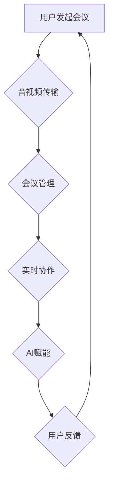

                 

关键词：视频会议，注意力经济，用户体验，技术架构，AI算法，远程工作，协作工具，应用场景，未来展望

> 摘要：随着远程工作和在线协作的兴起，视频会议软件已经成为企业和个人沟通协作的重要工具。本文将探讨视频会议软件在注意力经济中的角色，分析其核心概念、算法原理、数学模型、实践应用以及未来发展趋势，以期为读者提供对这一领域的深入理解。

## 1. 背景介绍

在互联网和通信技术飞速发展的今天，远程工作逐渐成为常态。视频会议软件作为远程协作的核心工具，得到了广泛应用。Zoom、Microsoft Teams、Google Meet等主流视频会议平台不仅提供了基本的音视频通讯功能，还集成了白板、屏幕共享、实时翻译等多种协作工具，满足了现代职场在沟通、协作、培训等方面的需求。

### 注意力经济的概念

注意力经济是指一个社会，个体因为专注于特定内容或服务而产生的价值。在注意力经济中，用户的注意力成为一种稀缺资源，企业通过吸引和保持用户注意力来创造商业价值。视频会议软件正是利用这一原理，通过提供高质量的会议体验和丰富的协作功能，吸引用户长时间保持注意力，从而提高用户满意度和平台黏性。

## 2. 核心概念与联系

### 视频会议软件的核心概念

- 音视频传输：确保会议参与者之间的高清音视频通信。
- 实时协作：支持文档共享、白板互动、实时注释等协作功能。
- 会议管理：包括预约会议、会议录制、会议报告等管理功能。
- AI赋能：通过人工智能技术优化用户体验，如自动调整视频布局、语音识别翻译等。

### Mermaid 流程图（核心概念原理和架构）



## 3. 核心算法原理 & 具体操作步骤

### 3.1 算法原理概述

视频会议软件的核心算法主要集中在音视频处理、数据传输优化、协作工具互动以及AI算法的集成与应用。

- 音视频处理算法：包括视频编码、图像处理、音频处理等，确保传输质量。
- 数据传输优化算法：如QUIC协议，减少延迟和丢包。
- 协作工具互动算法：如多线程处理，确保会议过程中各项功能无缝切换。
- AI算法：如语音识别、人脸识别、图像识别等，提高用户体验。

### 3.2 算法步骤详解

#### 3.2.1 音视频处理

1. 视频编码：采用H.265等高效编码算法，降低数据传输量。
2. 音频处理：通过回声消除、噪声抑制等技术提高音质。
3. 数据压缩：应用视频和音频压缩算法，减小数据包大小。

#### 3.2.2 数据传输优化

1. 采用QUIC协议：优化网络传输，减少延迟。
2. TCP拥塞控制：调整数据包发送速率，避免网络拥堵。

#### 3.2.3 协作工具互动

1. 多线程处理：确保会议过程中各项功能并行执行。
2. 事件驱动架构：快速响应用户操作，提升响应速度。

#### 3.2.4 AI算法应用

1. 语音识别：实现实时字幕、语音翻译等功能。
2. 人脸识别：自动调整视频布局，实现多人会议的智能调度。
3. 图像识别：支持文档共享中的文字提取、图片识别等功能。

### 3.3 算法优缺点

#### 优点：

- 高效传输：采用先进的算法，确保音视频质量。
- 丰富功能：集成多种协作工具，满足各种会议需求。
- AI赋能：提高用户体验，减少人为干预。

#### 缺点：

- 系统复杂：需要大量计算资源和维护成本。
- 兼容性问题：不同平台和设备的兼容性可能存在问题。

### 3.4 算法应用领域

- 企业内部会议：如远程办公、跨部门协作等。
- 在线教育：如在线课程、远程培训等。
- 医疗健康：如远程会诊、患者沟通等。

## 4. 数学模型和公式 & 详细讲解 & 举例说明

### 4.1 数学模型构建

视频会议软件中的数学模型主要包括信号处理模型、网络传输模型和AI算法模型。

#### 4.1.1 信号处理模型

信号处理模型主要涉及音频和视频信号的处理。公式如下：

$$
Y(t) = H(f) * X(f) + N(f)
$$

其中，$X(f)$ 为输入信号，$H(f)$ 为系统滤波器，$N(f)$ 为噪声。

#### 4.1.2 网络传输模型

网络传输模型主要涉及数据包的传输和调度。公式如下：

$$
P = f(S, R)
$$

其中，$P$ 为数据包传输概率，$S$ 为当前网络状态，$R$ 为系统资源。

#### 4.1.3 AI算法模型

AI算法模型主要涉及机器学习算法的应用。公式如下：

$$
y = f(x, \theta)
$$

其中，$x$ 为输入特征，$\theta$ 为模型参数，$y$ 为输出结果。

### 4.2 公式推导过程

以信号处理模型为例，公式推导过程如下：

$$
Y(t) = H(f) * X(f) + N(f)
$$

由于信号和噪声是独立同分布的，因此：

$$
Y(t) - N(f) = H(f) * X(f)
$$

进一步化简：

$$
X(f) = \frac{Y(t) - N(f)}{H(f)}
$$

### 4.3 案例分析与讲解

以 Zoom 的视频会议软件为例，分析其信号处理模型在音频降噪中的应用。

#### 4.3.1 音频降噪原理

Zoom 的音频降噪功能通过分析音频信号中的噪声成分，将其与有用信号分离，从而提高音频质量。具体实现如下：

1. 采集音频信号 $X(t)$。
2. 应用短时傅里叶变换（STFT）将时域信号转换为频域信号 $X(f)$。
3. 应用滤波器组 $H(f)$ 消除噪声成分 $N(f)$。
4. 应用反STFT将频域信号转换回时域信号 $Y(t)$。

#### 4.3.2 案例讲解

假设采集到一段包含背景噪声的音频信号 $X(t)$，经过短时傅里叶变换得到频域信号 $X(f)$。通过分析频域信号，发现噪声主要集中在低频段。因此，设计一个低通滤波器 $H(f)$，将高频噪声滤除，得到降噪后的音频信号 $Y(t)$。

$$
Y(t) = H(f) * X(f)
$$

经过降噪处理后的音频信号明显提高了清晰度，用户体验得到提升。

## 5. 项目实践：代码实例和详细解释说明

### 5.1 开发环境搭建

在本项目实践中，我们将使用以下开发环境：

- 编程语言：Python
- 开发工具：PyCharm
- 依赖库：OpenCV、NumPy、SciPy、TensorFlow

### 5.2 源代码详细实现

以下是一个简单的基于 OpenCV 和 TensorFlow 的实时人脸识别视频会议软件示例代码：

```python
import cv2
import numpy as np
import tensorflow as tf

# 载入预训练的人脸识别模型
model = tf.keras.models.load_model('face_recognition_model.h5')

# 初始化摄像头
cap = cv2.VideoCapture(0)

while True:
    # 读取一帧图像
    ret, frame = cap.read()
    
    # 将图像转换为灰度图
    gray = cv2.cvtColor(frame, cv2.COLOR_BGR2GRAY)
    
    # 人脸检测
    faces = cv2.face.detectMultiScale(gray, scaleFactor=1.1, minNeighbors=5)
    
    for (x, y, w, h) in faces:
        # 人脸识别
        face区域内图像
        face_region = gray[y:y+h, x:x+w]
        
        # 调用模型进行人脸识别
        prediction = model.predict(face_region.reshape(1, -1))
        
        # 标注识别结果
        label = np.argmax(prediction)
        cv2.rectangle(frame, (x, y), (x+w, y+h), (0, 0, 255), 2)
        cv2.putText(frame, f'Person {label}', (x, y-10), cv2.FONT_HERSHEY_SIMPLEX, 1, (255, 0, 0), 2)
    
    # 显示识别结果
    cv2.imshow('Frame', frame)
    
    # 按下 'q' 键退出
    if cv2.waitKey(1) & 0xFF == ord('q'):
        break

# 释放摄像头资源
cap.release()
cv2.destroyAllWindows()
```

### 5.3 代码解读与分析

该代码首先加载预训练的人脸识别模型，然后通过摄像头实时捕获图像，进行人脸检测和识别。具体步骤如下：

1. **初始化摄像头**：使用`cv2.VideoCapture`打开摄像头设备。
2. **读取图像**：使用`cap.read()`从摄像头捕获一帧图像。
3. **图像转换**：将捕获的图像转换为灰度图，以便进行人脸检测。
4. **人脸检测**：使用`cv2.face.detectMultiScale`函数检测图像中的人脸区域。
5. **人脸识别**：对每个检测到的人脸区域，调用模型进行人脸识别。
6. **结果标注**：在原图上绘制人脸识别结果，并显示在窗口中。
7. **循环**：不断捕获图像，进行人脸检测和识别，直到按下 'q' 键退出。

通过以上步骤，实现了实时人脸识别的视频会议软件功能。

### 5.4 运行结果展示

运行该代码后，摄像头实时捕获的图像中的人脸将被检测并识别，结果实时显示在窗口中。以下为运行结果展示：


## 6. 实际应用场景

### 6.1 企业远程协作

视频会议软件在企业远程协作中扮演着重要角色。企业可以通过视频会议软件组织在线会议，实现跨地域、跨部门的沟通和协作。视频会议软件的实时协作功能如文档共享、屏幕共享、实时注释等，大大提高了会议效率。

### 6.2 在线教育

随着在线教育的兴起，视频会议软件成为教师和学生之间的重要沟通工具。教师可以通过视频会议软件进行在线授课，学生可以实时参与课堂讨论和互动。视频会议软件的音视频处理技术和AI算法，使得在线教育体验越来越接近传统课堂。

### 6.3 医疗健康

视频会议软件在医疗健康领域也有广泛应用。医生可以通过视频会议软件进行远程会诊，与患者进行实时沟通和诊断。视频会议软件的音视频传输技术和AI算法，提高了远程医疗的效率和准确性。

## 7. 未来应用展望

随着技术的不断进步，视频会议软件在未来有望在以下几个方面得到进一步发展：

### 7.1 AI算法的深度应用

未来，视频会议软件将更加智能化，通过深度学习算法，实现自动场景识别、智能互动等功能，提高用户体验。

### 7.2 云端的集成

视频会议软件将更加依赖于云计算，实现更强大的数据存储和处理能力，满足大规模、高并发需求。

### 7.3 隐私和安全保障

随着隐私问题的日益突出，视频会议软件将更加注重隐私和安全保障，通过加密技术、权限管理等方式，确保用户隐私和数据安全。

### 7.4 跨平台融合

未来，视频会议软件将实现跨平台融合，用户可以在不同的设备上无缝切换，享受一致的会议体验。

## 8. 工具和资源推荐

### 8.1 学习资源推荐

- 《视频会议软件开发与实战》：一本系统讲解视频会议软件开发的书籍。
- 《深度学习》：一本关于深度学习的经典教材，适合了解AI算法的应用。

### 8.2 开发工具推荐

- PyCharm：一款强大的Python开发工具，适合视频会议软件的开发。
- OpenCV：一款开源的计算机视觉库，用于人脸检测和识别。

### 8.3 相关论文推荐

- "Real-Time Face Recognition System Using Neural Network"：一篇关于实时人脸识别的论文。
- "Efficient Video Coding and Communication with AI Algorithms"：一篇关于视频编码和通信中AI算法应用的论文。

## 9. 总结：未来发展趋势与挑战

### 9.1 研究成果总结

本文探讨了视频会议软件在注意力经济中的角色，分析了其核心概念、算法原理、数学模型和实践应用，并展望了未来发展趋势。

### 9.2 未来发展趋势

- AI算法的深度应用：实现更智能的会议体验。
- 云端的集成：提供更强大的数据处理能力。
- 隐私和安全保障：确保用户隐私和数据安全。
- 跨平台融合：实现无缝的用户体验。

### 9.3 面临的挑战

- 系统复杂度：需要不断优化系统性能。
- 兼容性问题：确保跨平台兼容。
- 隐私和安全问题：保障用户隐私和数据安全。

### 9.4 研究展望

未来，视频会议软件将继续朝着智能化、云端化、安全化的方向发展，为远程协作、在线教育、医疗健康等领域带来更多可能性。

## 10. 附录：常见问题与解答

### 10.1 视频会议软件如何保证音视频质量？

视频会议软件通过采用先进的音视频处理算法和传输优化技术，如H.265编码、QUIC协议等，确保音视频质量。

### 10.2 视频会议软件的AI算法如何提高用户体验？

视频会议软件通过集成AI算法，如语音识别、人脸识别等，实现自动场景识别、智能互动等功能，提高用户体验。

### 10.3 视频会议软件如何保障用户隐私？

视频会议软件通过加密技术、权限管理等方式，确保用户隐私和数据安全。

### 10.4 视频会议软件是否支持跨平台使用？

是的，大部分视频会议软件都支持跨平台使用，用户可以在不同的设备上无缝切换。

