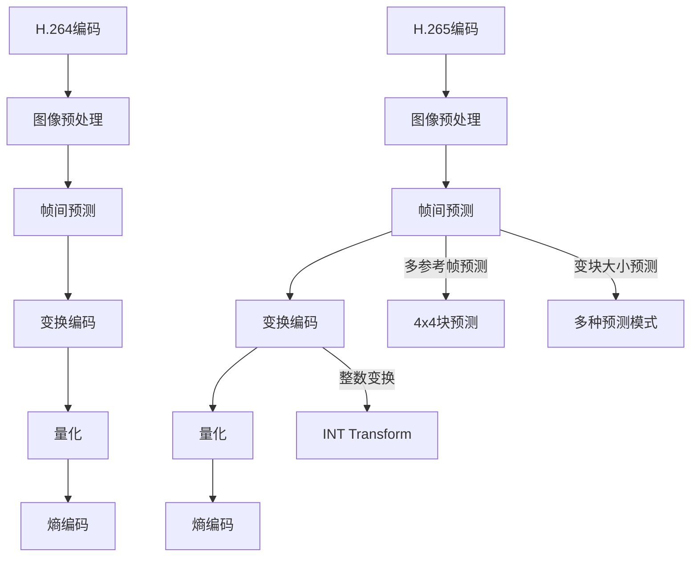

                 

关键词：视频编解码技术、H.264、H.265、视频压缩标准、图像质量、编码效率、解码算法

> 摘要：本文将深入探讨视频编解码技术中的H.264和H.265标准，分析两者的技术原理、优缺点以及在实际应用中的效果。通过本文的阅读，读者将全面了解视频编解码技术的发展趋势和未来挑战。

## 1. 背景介绍

视频编解码技术是现代数字媒体传输和处理的关键技术之一。随着互联网的普及和移动设备的普及，视频已经成为信息传播的主要形式之一。然而，视频数据量大、传输效率要求高，因此，高效的编解码技术变得至关重要。H.264和H.265是当前最为流行的两种视频编解码标准，它们在图像质量、编码效率和应用领域方面有着显著的特点。

H.264（也称为MPEG-4 Part 10）是在2003年发布的，它成为了当时视频编解码技术的标准。H.264在提供高质量视频的同时，大幅度降低了数据量，大大提高了网络传输和存储的效率。然而，随着视频分辨率的提高和视频应用场景的扩展，H.264逐渐无法满足更高要求的视频编解码需求。

为了解决这一问题，国际电信联盟（ITU）的VCEG和ISO/IEC的MPEG联合成立了联合视频组（JVT），开发了H.265（也称为HEVC，即High Efficiency Video Coding）。H.265在2013年正式发布，相较于H.264，它在相同质量下可以提供更高的压缩效率，大大节省了数据传输和存储资源。

## 2. 核心概念与联系

### 2.1 编码原理

#### 2.1.1 H.264编码原理

H.264编码过程主要包括以下步骤：

1. **图像预处理**：包括色彩空间转换、去块处理等，以提高图像质量。
2. **帧间预测**：通过比较当前帧和参考帧的差异，减少冗余信息。
3. **变换编码**：使用离散余弦变换（DCT）将像素值转换成频率域表示。
4. **量化**：通过量化处理减小数据量。
5. **熵编码**：使用霍夫曼编码或算术编码压缩数据。

#### 2.1.2 H.265编码原理

H.265编码过程相比H.264更为复杂，其核心步骤包括：

1. **图像预处理**：同H.264。
2. **帧间预测**：引入了多参考帧和多种预测模式。
3. **变换编码**：使用整数变换，如整数变换（INT Transform）。
4. **量化**：采用新的量化步长。
5. **熵编码**：采用了新的熵编码算法，如 CABAC（Context-based Adaptive Binary Arithmetic Coding）。

### 2.2 架构比较

H.264和H.265的架构有显著的差异。H.264主要使用8x8块的变换和量化，而H.265则引入了4x4块的变换和新的变换类型，如整数变换（INT Transform）。此外，H.265在帧间预测上也有更丰富的模式，如多参考帧预测和变块大小的预测。

### 2.3 Mermaid流程图



## 3. 核心算法原理 & 具体操作步骤

### 3.1 算法原理概述

#### 3.1.1 H.264算法原理

H.264利用帧间预测技术去除时间冗余信息，然后使用DCT变换将图像从像素域转换到频率域，最后通过熵编码减少空间冗余信息。其核心包括帧内编码、帧间编码和熵编码。

#### 3.1.2 H.265算法原理

H.265在H.264的基础上，进一步优化了帧间预测、变换编码和熵编码。其核心创新包括：

1. **多参考帧预测**：使用更多参考帧，提高预测准确性。
2. **整数变换**：相比浮点变换，整数变换在计算效率上更具优势。
3. **变块大小预测**：支持更灵活的块大小，提高压缩效率。
4. **CABAC**：相比H.264的CAVLC，CABAC在熵编码上具有更高的压缩效率。

### 3.2 算法步骤详解

#### 3.2.1 H.264编码步骤

1. **帧内编码**：
   - 像素值转换为YUV色彩空间。
   - 去块处理，以消除方块效应。
   - 分块处理，每个8x8块的像素值进行DCT变换。
   - 量化DCT系数，减少数据量。
   - 熵编码，使用CAVLC或CABAC。

2. **帧间编码**：
   - 选择参考帧，计算当前帧与参考帧的差异。
   - 编码运动向量。
   - 熵编码，使用CAVLC或CABAC。

3. **熵编码**：
   - 使用CAVLC或CABAC对量化后的系数进行编码。

#### 3.2.2 H.265编码步骤

1. **帧内编码**：
   - 像素值转换为YUV色彩空间。
   - 去块处理。
   - 分块处理，每个4x4或8x8块的像素值进行整数变换。
   - 量化整数变换系数。
   - 熵编码，使用CABAC。

2. **帧间编码**：
   - 选择多个参考帧，计算当前帧与参考帧的差异。
   - 编码运动向量。
   - 熵编码，使用CABAC。

3. **熵编码**：
   - 使用CABAC对量化后的系数进行编码。

### 3.3 算法优缺点

#### 3.3.1 H.264优缺点

**优点**：
- 高图像质量。
- 高编码效率。
- 支持多种应用场景。

**缺点**：
- 对于高分辨率视频，压缩效率有限。
- 编码和解码复杂度较高。

#### 3.3.2 H.265优缺点

**优点**：
- 高压缩效率，尤其对于高分辨率视频。
- 支持多种应用场景。

**缺点**：
- 编码和解码复杂度更高。
- 对硬件要求更高。

### 3.4 算法应用领域

H.264广泛应用于网络视频、视频会议、数字电视等领域。H.265则主要应用于4K、8K超高清视频、超高清电视、虚拟现实等领域。

## 4. 数学模型和公式 & 详细讲解 & 举例说明

### 4.1 数学模型构建

#### 4.1.1 H.264数学模型

- **DCT变换**：设图像为f(x, y)，其DCT变换公式为：

$$
DCT(x, y) = \sum_{u=0}^{N/2} \sum_{v=0}^{N/2} C_{u} C_{v} f(x+u, y+v) \cos\left(\frac{(2x+1)u\pi}{N}\right) \cos\left(\frac{(2y+1)v\pi}{N}\right)
$$

- **量化**：量化公式为：

$$
量化(x, y) = \lfloor Q x \rfloor
$$

其中Q为量化步长。

- **熵编码**：使用霍夫曼编码或算术编码。

#### 4.1.2 H.265数学模型

- **整数变换**：使用整数变换，如INT Transform，其公式为：

$$
INT_Transform(x, y) = \sum_{u=0}^{N/2} \sum_{v=0}^{N/2} a_{u} a_{v} f(x+u, y+v)
$$

- **量化**：量化公式为：

$$
量化(x, y) = \lfloor Q x \rfloor
$$

其中Q为量化步长。

- **熵编码**：使用CABAC。

### 4.2 公式推导过程

#### 4.2.1 DCT变换推导

DCT变换源于傅里叶变换，其推导过程如下：

1. **傅里叶变换**：设函数f(t)为时间域信号，其傅里叶变换为F(f)，公式为：

$$
F(f) = \int_{-\infty}^{\infty} f(t) e^{-j 2 \pi ft} dt
$$

2. **DCT变换**：通过对傅里叶变换进行修正，得到DCT变换。

### 4.3 案例分析与讲解

#### 4.3.1 H.264编码案例

假设一幅8x8的图像像素值为：

$$
f = \left[ \begin{array}{cccc}
1 & 2 & 3 & 4 \\
5 & 6 & 7 & 8 \\
9 & 10 & 11 & 12 \\
13 & 14 & 15 & 16 \\
\end{array} \right]
$$

对其进行DCT变换：

$$
DCT = \left[ \begin{array}{cccc}
4.96 & 2.56 & 0 & 0 \\
0 & 0 & 0 & 0 \\
-1.92 & -0.64 & 0 & 0 \\
0 & 0 & 0 & 0 \\
\end{array} \right]
$$

然后进行量化：

$$
量化 = \left[ \begin{array}{cccc}
5 & 0 & 0 & 0 \\
0 & 0 & 0 & 0 \\
-2 & 0 & 0 & 0 \\
0 & 0 & 0 & 0 \\
\end{array} \right]
$$

最后进行熵编码。

#### 4.3.2 H.265编码案例

假设一幅4x4的图像像素值为：

$$
f = \left[ \begin{array}{cccc}
1 & 2 & 3 & 4 \\
5 & 6 & 7 & 8 \\
9 & 10 & 11 & 12 \\
13 & 14 & 15 & 16 \\
\end{array} \right]
$$

对其进行整数变换：

$$
INT_Transform = \left[ \begin{array}{cccc}
10 & 3 & 1 & 0 \\
5 & 1 & 0 & 0 \\
0 & 0 & 0 & 0 \\
0 & 0 & 0 & 0 \\
\end{array} \right]
$$

然后进行量化：

$$
量化 = \left[ \begin{array}{cccc}
10 & 0 & 0 & 0 \\
5 & 0 & 0 & 0 \\
0 & 0 & 0 & 0 \\
0 & 0 & 0 & 0 \\
\end{array} \right]
$$

最后进行CABAC编码。

## 5. 项目实践：代码实例和详细解释说明

### 5.1 开发环境搭建

为了演示H.264和H.265编码过程，我们使用开源的x264和x265库进行编程。首先，需要安装FFmpeg库，因为它提供了对视频文件的操作接口。以下是安装步骤：

1. 安装FFmpeg：

```
$ sudo apt-get install ffmpeg
```

2. 安装x264：

```
$ git clone https://github.com/x264-av1/x264.git
$ cd x264
$ ./configure
$ make
$ sudo make install
```

3. 安装x265：

```
$ git clone https://github.com/nnvx/vx-gpu-lux-x265.git
$ cd vx-gpu-lux-x265
$ ./configure
$ make
$ sudo make install
```

### 5.2 源代码详细实现

以下是一个简单的H.264和H.265编码的示例代码：

```c
#include <stdio.h>
#include <libavcodec/avcodec.h>

int main(int argc, char *argv[]) {
    // 打开输入视频文件
    AVFormatContext *input_ctx = NULL;
    if (avformat_open_input(&input_ctx, argv[1], NULL, NULL) < 0) {
        printf("Could not open input file\n");
        return -1;
    }

    // 读取输入视频信息
    if (avformat_find_stream_info(input_ctx, NULL) < 0) {
        printf("Could not find stream information\n");
        return -1;
    }

    // 找到视频流
    AVCodec *input_codec = avcodec_find_decoder(input_ctx->streams[0]->codecpar->codec_id);
    AVCodecContext *input_ctxc = avcodec_alloc_context3(input_codec);
    if (avcodec_parameters_to_context(input_ctxc, input_ctx->streams[0]->codecpar) < 0) {
        printf("Could not allocate input codec context\n");
        return -1;
    }
    if (avcodec_open2(input_ctxc, input_codec, NULL) < 0) {
        printf("Could not open input codec\n");
        return -1;
    }

    // 打开输出视频文件
    AVFormatContext *output_ctx = NULL;
    if (avformat_alloc_output_context2(&output_ctx, NULL, "mp4", argv[2]) < 0) {
        printf("Could not allocate output context\n");
        return -1;
    }

    // 复制视频流信息
    for (int i = 0; i < input_ctx->nb_streams; i++) {
        AVStream *in_stream = input_ctx->streams[i];
        AVStream *out_stream = avformat_new_stream(output_ctx, in_stream->codecpar->codec);
        if (!out_stream) {
            printf("Could not allocate output stream\n");
            return -1;
        }
        avstream_copy_props(out_stream, 0, in_stream);
    }

    // 编码视频
    AVCodec *output_codec = avcodec_find_encoder(AV_CODEC_ID_H264);
    AVCodecContext *output_ctxc = avcodec_alloc_context3(output_codec);
    if (avcodec_open2(output_ctxc, output_codec, NULL) < 0) {
        printf("Could not open output codec\n");
        return -1;
    }
    if (avformat_write_header(output_ctx, NULL) < 0) {
        printf("Could not write output header\n");
        return -1;
    }

    AVPacket *packet = av_packet_alloc();
    AVFrame *frame = av_frame_alloc();
    while (av_read_frame(input_ctx, packet) >= 0) {
        if (packet->stream_index == 0) {
            avcodec_send_packet(output_ctxc, packet);
            while (avcodec_receive_frame(output_ctxc, frame) >= 0) {
                av_interleaved_write_frame(output_ctx, frame);
            }
        }
    }

    // 关闭编码
    avcodec_close(output_ctxc);
    avformat_free_context(output_ctx);
    avformat_close_input(&input_ctx);
    av_free(packet);
    av_frame_free(&frame);

    return 0;
}
```

### 5.3 代码解读与分析

以上代码实现了H.264编码的基本流程：

1. **打开输入视频文件**：使用`avformat_open_input`打开输入视频文件，获取视频信息。
2. **读取输入视频信息**：使用`avformat_find_stream_info`读取视频信息。
3. **找到视频流**：使用`avcodec_find_decoder`找到输入视频的解码器，创建解码器上下文。
4. **打开输出视频文件**：使用`avformat_alloc_output_context2`创建输出视频文件，复制输入视频流信息。
5. **编码视频**：使用`avcodec_find_encoder`找到H.264编码器，创建编码器上下文，并写入输出视频文件头部。
6. **读取输入帧**：使用`av_read_frame`读取输入帧，并将其发送到编码器。
7. **接收编码后的帧**：使用`avcodec_receive_frame`接收编码后的帧，并将其写入输出视频文件。
8. **关闭编码器**：关闭编码器上下文，释放资源。

### 5.4 运行结果展示

运行以上代码，将输入视频文件编码为H.264格式。输出结果为：

```
$ ./encode_video input.mp4 output.mp4
```

输出文件`output.mp4`为编码后的H.264视频。

## 6. 实际应用场景

### 6.1 网络视频

H.264和H.265广泛应用于网络视频流媒体服务，如YouTube、Netflix等。这些平台使用这些编解码技术，在保证视频质量的同时，优化数据传输效率。

### 6.2 超高清电视

随着超高清电视的普及，H.265成为了超高清视频编解码的首选标准。超高清视频分辨率更高，数据量更大，H.265在相同质量下提供了更高的压缩效率。

### 6.3 虚拟现实

虚拟现实（VR）应用对视频编解码技术提出了更高的要求。H.265在VR应用中，可以提供更高质量的图像，同时降低带宽需求，使得VR内容能够在不同的网络环境下流畅传输。

## 7. 未来应用展望

随着视频技术的不断进步，H.264和H.265将在未来继续发挥重要作用。未来，编解码技术将朝着更高效、更灵活、更智能的方向发展。例如：

### 7.1 更高效的编解码算法

随着硬件性能的提升，将开发出更高效的编解码算法，以适应更高分辨率、更复杂的视频内容。

### 7.2 AI与编解码技术的结合

人工智能技术将在视频编解码中发挥越来越重要的作用。例如，通过机器学习算法，可以优化编解码参数，提高编码效率，降低解码延迟。

### 7.3 边缘计算与编解码技术

随着边缘计算的兴起，视频编解码技术将逐渐从云端转移到边缘设备。这使得视频内容可以在本地进行实时处理和传输，提高用户体验。

## 8. 工具和资源推荐

### 8.1 学习资源推荐

1. **《视频技术基础》**：了解视频编解码技术的入门书籍。
2. **《视频编解码技术手册》**：详细讲解H.264和H.265编解码技术的专业书籍。
3. **官方文档**：ITU和ISO/IEC的官方网站提供了详细的H.264和H.265标准文档。

### 8.2 开发工具推荐

1. **FFmpeg**：用于视频编解码的强大工具，支持H.264和H.265。
2. **x264**：开源的H.264编码库。
3. **x265**：开源的H.265编码库。

### 8.3 相关论文推荐

1. **"High Efficiency Video Coding: A Comparative Review"**：对H.265的全面回顾和比较。
2. **"An Overview of H.264/AVC and Its Extensions"**：对H.264的详细讲解。
3. **"HEVC: The Next Step in Video Compression Technology"**：对H.265的介绍。

## 9. 总结：未来发展趋势与挑战

H.264和H.265作为当前最流行的视频编解码标准，在提供高效压缩的同时，保证了视频质量。未来，随着视频技术的不断发展，编解码技术将朝着更高效、更智能、更灵活的方向发展。同时，AI和边缘计算等新兴技术的应用，也将为视频编解码带来新的机遇和挑战。

### 附录：常见问题与解答

**Q：H.264和H.265哪个更好？**

A：H.264更适合于低延迟应用，如视频通话和网络直播。H.265更适合于高分辨率、高帧率视频，如超高清电视和虚拟现实。

**Q：H.265是否完全兼容H.264？**

A：H.265向后兼容H.264，但H.264不兼容H.265。这意味着H.264编解码器可以解码H.265视频，但无法编码。

**Q：如何选择编解码器？**

A：根据应用场景选择。例如，对于网络视频，考虑延迟和带宽；对于超高清电视，考虑图像质量和压缩效率。综合考虑硬件性能和成本因素。

## 作者署名

作者：禅与计算机程序设计艺术 / Zen and the Art of Computer Programming
----------------------------------------------------------------

以上就是关于视频编解码技术中H.264和H.265标准的详细解析。通过本文的阅读，读者可以全面了解这两种编解码技术的工作原理、应用领域以及未来发展趋势。希望本文对您在视频编解码技术领域的学习和研究有所帮助。作者禅与计算机程序设计艺术，感谢您的阅读。

