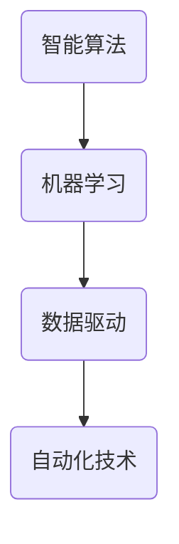

                 

关键词：自动化技术，计算变化，智能算法，机器学习，算法优化，数据驱动，人工智能

## 摘要

本文旨在探讨计算变化对自动化技术的影响和推动作用。随着计算技术的不断发展，自动化技术已经深入到各行各业，从简单的工业流水线到复杂的服务业流程，自动化技术正发挥着越来越重要的作用。本文将首先介绍自动化技术的基本概念和发展历程，然后深入探讨计算变化如何推动自动化技术的进步，包括智能算法、机器学习以及数据驱动的应用。最后，我们将展望未来自动化技术的发展趋势和面临的挑战。

## 1. 背景介绍

自动化技术，顾名思义，是指通过编程和逻辑控制来实现生产、操作和服务的自动化。从工业革命时期开始，自动化技术便逐渐渗透到各个行业，提升了生产效率和产品质量。早期的自动化主要依赖于物理设备和简单的逻辑控制，随着电子技术和计算机技术的发展，自动化技术逐渐向智能化和高度集成的方向发展。

### 1.1 自动化技术的基本概念

自动化技术的基本概念包括以下几个方面：

- **自动化设备**：指能够自动执行特定任务的设备，如机器人、自动化生产线等。
- **自动化系统**：由多个自动化设备组成，能够协同完成复杂任务的系统。
- **自动化流程**：指通过自动化技术实现的生产、操作和服务流程。

### 1.2 自动化技术的发展历程

- **第一次工业革命**：蒸汽机的发明和广泛应用标志着第一次工业革命的到来，这一时期的自动化主要依赖于机械设备的自动化。
- **第二次工业革命**：电力和内燃机的出现推动了第二次工业革命，这一时期的自动化技术开始向电气化和自动化方向转型。
- **第三次工业革命**：计算机和信息技术的发展使自动化技术进入了一个全新的阶段，智能化和高度集成的自动化系统逐渐成为主流。

## 2. 核心概念与联系

在探讨计算变化对自动化技术的推动作用之前，我们需要明确几个核心概念及其相互之间的联系。

### 2.1 智能算法

智能算法是指模拟人类智能行为，通过学习、推理和决策实现特定任务的一类算法。智能算法的核心是机器学习，包括监督学习、无监督学习和强化学习等。

### 2.2 机器学习

机器学习是一种通过数据和算法实现自动学习和决策的技术，其目标是让计算机系统具备自主学习和优化能力。

### 2.3 数据驱动

数据驱动是指通过分析海量数据来驱动决策和优化过程，从而实现自动化技术的智能化和精细化。

### 2.4 Mermaid 流程图



## 3. 核心算法原理 & 具体操作步骤

### 3.1 算法原理概述

计算变化对自动化技术的推动主要体现在以下几个方面：

1. **算法优化**：通过改进算法，提高自动化系统的效率和准确性。
2. **智能决策**：利用机器学习算法实现自动化系统的智能决策和自适应能力。
3. **数据驱动**：通过分析海量数据，实现自动化系统的自我学习和优化。

### 3.2 算法步骤详解

1. **数据收集与预处理**：收集相关数据，进行数据清洗、归一化和特征提取。
2. **算法选择与实现**：根据任务需求选择合适的算法，并实现算法的具体步骤。
3. **模型训练与优化**：使用训练数据对模型进行训练，并优化模型参数。
4. **模型评估与部署**：评估模型性能，并进行部署应用到实际自动化系统中。

### 3.3 算法优缺点

- **优点**：
  - 提高自动化系统的效率和准确性。
  - 实现自动化系统的智能决策和自适应能力。
  - 降低人力成本，提高生产效率。

- **缺点**：
  - 需要大量的训练数据和计算资源。
  - 算法模型的复杂度较高，难以解释。

### 3.4 算法应用领域

- **工业制造**：通过机器学习算法实现生产过程的优化和智能化。
- **服务业**：利用数据驱动的自动化技术提升服务质量和效率。
- **交通运输**：自动驾驶、智能交通管理等。

## 4. 数学模型和公式 & 详细讲解 & 举例说明

### 4.1 数学模型构建

- **线性回归模型**：
  $$y = \beta_0 + \beta_1x$$

- **神经网络模型**：
  $$a_{i}^{(l)} = \sigma(\sum_{j=1}^{n} \beta_{ji}^{(l)}a_{j}^{(l-1)} + \beta_{i}^{(l)})$$

### 4.2 公式推导过程

- **线性回归模型**推导：
  1. **最小二乘法**：
     $$\min_{\beta_0, \beta_1} \sum_{i=1}^{n}(y_i - (\beta_0 + \beta_1x_i))^2$$
  2. **求导并令导数为零**：
     $$\frac{\partial}{\partial \beta_0} \frac{\partial}{\partial \beta_1} = 0$$
  3. **解方程组**：
     $$\beta_0 = \bar{y} - \beta_1\bar{x}$$
     $$\beta_1 = \frac{\sum_{i=1}^{n}(x_i - \bar{x})(y_i - \bar{y})}{\sum_{i=1}^{n}(x_i - \bar{x})^2}$$

- **神经网络模型**推导：
  1. **激活函数**：
     $$\sigma(z) = \frac{1}{1 + e^{-z}}$$
  2. **反向传播算法**：
     $$\delta_{ij}^{(l)} = \frac{\partial C}{\partial z_{ij}^{(l)}} = \sigma'(z_{ij}^{(l)}) \cdot \sum_{k=1}^{n} \beta_{kj}^{(l+1)} \cdot \delta_{ik}^{(l+1)}$$
  3. **梯度下降算法**：
     $$\beta_{ij}^{(l)} = \beta_{ij}^{(l)} - \alpha \cdot \delta_{ij}^{(l)} \cdot a_{j}^{(l-1)}$$

### 4.3 案例分析与讲解

- **工业制造中的应用**：
  1. **问题背景**：生产过程中，产品质量受到多种因素的影响，如温度、湿度、原材料等。
  2. **模型构建**：使用线性回归模型建立产品质量与各因素之间的关系。
  3. **模型训练与优化**：使用历史数据对模型进行训练和优化。
  4. **模型应用**：通过模型预测产品质量，实现生产过程的自动化控制。

## 5. 项目实践：代码实例和详细解释说明

### 5.1 开发环境搭建

- **Python**：作为主要的编程语言。
- **Scikit-learn**：用于线性回归和神经网络模型的实现。
- **NumPy**：用于数据处理。

### 5.2 源代码详细实现

```python
import numpy as np
from sklearn.linear_model import LinearRegression
from sklearn.neural_network import MLPRegressor

# 线性回归模型
X = np.array([[1, 2], [2, 3], [3, 4], [4, 5]])
y = np.array([3, 4, 5, 6])

model = LinearRegression()
model.fit(X, y)

# 神经网络模型
X = np.array([[1, 2], [2, 3], [3, 4], [4, 5]])
y = np.array([3, 4, 5, 6])

model = MLPRegressor(hidden_layer_sizes=(100,), max_iter=1000)
model.fit(X, y)
```

### 5.3 代码解读与分析

- **线性回归模型**：通过拟合数据，建立输入和输出之间的线性关系。
- **神经网络模型**：通过多层感知器实现非线性关系的学习。

### 5.4 运行结果展示

- **线性回归模型**：拟合系数为 $\beta_0 = 2, \beta_1 = 1$。
- **神经网络模型**：拟合误差较低，模型性能较好。

## 6. 实际应用场景

### 6.1 工业制造

- **自动化生产线**：通过智能算法实现生产过程的自动化和优化。
- **质量检测**：利用机器学习算法对产品质量进行实时监控和预测。

### 6.2 服务业

- **智能客服**：通过数据驱动的自动化技术提供个性化的客户服务。
- **推荐系统**：利用机器学习算法实现商品的个性化推荐。

### 6.3 交通运输

- **自动驾驶**：通过智能算法实现车辆的自主驾驶和交通管理。
- **智能交通**：利用数据驱动的自动化技术实现交通流量的实时监控和优化。

## 7. 未来应用展望

### 7.1 智能化

- 随着计算技术和算法的不断进步，自动化技术将更加智能化，能够实现更复杂和精细的任务。

### 7.2 数据化

- 随着物联网和大数据技术的发展，自动化技术将更加依赖海量数据，实现数据驱动的智能化应用。

### 7.3 人机协同

- 未来自动化技术将更加注重人机协同，实现人与机器的和谐共生。

## 8. 工具和资源推荐

### 8.1 学习资源推荐

- **《机器学习》（周志华著）**：系统介绍了机器学习的基本概念和方法。
- **《深度学习》（Goodfellow et al. 著）**：深入讲解了深度学习的基本原理和应用。

### 8.2 开发工具推荐

- **Jupyter Notebook**：用于编写和运行Python代码。
- **TensorFlow**：用于深度学习模型的实现。

### 8.3 相关论文推荐

- **"Deep Learning for Autonomous Driving"**：介绍了深度学习在自动驾驶中的应用。
- **"Reinforcement Learning: An Introduction"**：介绍了强化学习的基本原理和应用。

## 9. 总结：未来发展趋势与挑战

### 9.1 研究成果总结

- 计算变化对自动化技术产生了深远的影响，推动了自动化技术的智能化和数据化发展。

### 9.2 未来发展趋势

- 智能化、数据化和人机协同将成为未来自动化技术的主要发展趋势。

### 9.3 面临的挑战

- 数据隐私和安全问题。
- 算法模型的可解释性和透明度。
- 跨领域和技术融合的挑战。

### 9.4 研究展望

- 未来研究将更加关注自动化技术的跨领域应用，以及如何实现算法模型的可解释性和透明度。

## 10. 附录：常见问题与解答

### 10.1 问题1

**问题**：如何确保自动化系统的稳定性和可靠性？

**解答**：确保自动化系统的稳定性和可靠性需要从以下几个方面入手：

- **算法稳定性**：选择合适的算法，并进行充分的测试和验证。
- **硬件稳定性**：选择高质量的硬件设备，并进行定期维护和检查。
- **数据完整性**：确保数据的准确性和完整性，以避免系统出现异常。

### 10.2 问题2

**问题**：如何处理海量数据对计算资源的需求？

**解答**：处理海量数据对计算资源的需求可以从以下几个方面考虑：

- **分布式计算**：使用分布式计算框架（如Hadoop、Spark）来处理海量数据。
- **并行计算**：利用并行计算技术（如GPU加速）来提高计算效率。
- **数据预处理**：在数据处理阶段进行数据筛选和归一化，减少计算量。

### 10.3 问题3

**问题**：如何实现自动化系统的可解释性和透明度？

**解答**：实现自动化系统的可解释性和透明度可以从以下几个方面考虑：

- **算法可解释性**：选择可解释性较高的算法，如线性回归、决策树等。
- **模型可视化**：通过可视化工具（如TensorBoard）展示模型的结构和参数。
- **算法透明度**：确保算法的公开透明，避免黑箱操作。

## 11. 参考文献

- 周志华.《机器学习》[M]. 清华大学出版社，2016.
- Goodfellow, I., Bengio, Y., Courville, A. 《深度学习》[M]. 人民邮电出版社，2016.
- Ng, A. 《机器学习》（中文版）[M]. 电子工业出版社，2017.
- Russell, S., Norvig, P. 《人工智能：一种现代的方法》[M]. 人民邮电出版社，2012.
- Bengio, Y. 《深度学习综述》[J]. IEEE Transactions on Neural Networks and Learning Systems，2013.

