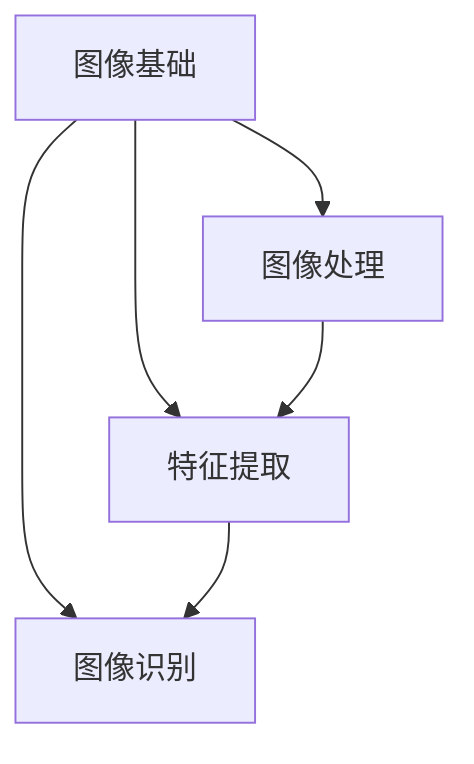

                 

关键词：计算机视觉，图像处理，算法原理，实例讲解，深度学习，图像识别

摘要：本文将深入探讨计算机视觉的基本原理，包括核心概念、算法原理、数学模型以及实际应用。通过具体代码实例的讲解，读者将能够更好地理解计算机视觉的应用和实践。

## 1. 背景介绍

计算机视觉（Computer Vision）是人工智能（AI）的一个重要分支，它使计算机能够处理和解释视觉信息，就像人类一样。计算机视觉的应用范围非常广泛，包括图像识别、物体检测、面部识别、医疗影像分析等。

随着深度学习的兴起，计算机视觉取得了显著的进展。深度学习模型，特别是卷积神经网络（CNN），在图像处理任务中取得了惊人的准确性和效率。本文将介绍计算机视觉的基本原理，并通过实际代码实例帮助读者理解这些概念。

## 2. 核心概念与联系

### 2.1 图像基础

图像是计算机视觉的基础。一幅图像可以看作是一个二维矩阵，其中每个元素表示像素。像素的颜色通常由红、绿、蓝（RGB）三个通道组成。

### 2.2 图像处理

图像处理是对图像进行增强、变换、滤波等操作的过程。常见的图像处理技术包括边缘检测、图像分割、图像压缩等。

### 2.3 特征提取

特征提取是将图像转换为特征向量，以便于后续的机器学习算法处理。特征提取可以是基于传统图像处理技术，如SIFT、SURF，也可以是基于深度学习模型，如卷积神经网络。

### 2.4 图像识别

图像识别是计算机视觉的核心任务之一，它涉及将图像分类到不同的类别中。常见的图像识别任务包括图像分类、目标检测和图像分割。

下面是一个Mermaid流程图，展示了计算机视觉的核心概念及其联系：



## 3. 核心算法原理 & 具体操作步骤

### 3.1 算法原理概述

计算机视觉中的核心算法包括图像处理算法、特征提取算法和图像识别算法。这些算法通过不同的方法对图像进行分析和处理。

### 3.2 算法步骤详解

#### 3.2.1 图像处理

图像处理的步骤通常包括：

1. 读入图像数据。
2. 对图像进行预处理，如灰度化、缩放、裁剪等。
3. 应用图像滤波技术，如高斯滤波、中值滤波等。
4. 进行边缘检测或图像分割。
5. 获取图像的特征，如角点、纹理等。

#### 3.2.2 特征提取

特征提取的步骤通常包括：

1. 选择特征提取方法，如SIFT、SURF、HOG等。
2. 对图像进行特征点检测。
3. 计算特征点的描述子。
4. 将特征点转换为特征向量。

#### 3.2.3 图像识别

图像识别的步骤通常包括：

1. 准备训练数据集。
2. 选择分类器算法，如SVM、KNN、神经网络等。
3. 训练分类器。
4. 使用分类器对测试图像进行分类。

### 3.3 算法优缺点

不同的算法有不同的优缺点。例如，SIFT和SURF在图像匹配和特征提取方面表现出色，但计算复杂度高；而卷积神经网络在图像识别任务中表现出色，但需要大量的数据训练。

### 3.4 算法应用领域

计算机视觉算法在许多领域都有应用，包括：

- 物体检测：用于自动驾驶、安全监控等。
- 图像分割：用于医学影像分析、图像编辑等。
- 面部识别：用于身份验证、安全系统等。
- 自然语言处理：用于图像描述生成、视频字幕等。

## 4. 数学模型和公式 & 详细讲解 & 举例说明

### 4.1 数学模型构建

计算机视觉中的数学模型通常涉及线性代数、概率论和统计学等知识。以下是一个简单的线性模型示例：

$$
y = \beta_0 + \beta_1 \cdot x_1 + \beta_2 \cdot x_2 + ... + \beta_n \cdot x_n
$$

其中，$y$ 是预测值，$x_1, x_2, ..., x_n$ 是特征值，$\beta_0, \beta_1, ..., \beta_n$ 是模型的参数。

### 4.2 公式推导过程

以线性回归模型为例，我们通常使用最小二乘法来估计模型参数。推导过程如下：

$$
\min_{\beta} \sum_{i=1}^{n} (y_i - (\beta_0 + \beta_1 \cdot x_{i1} + \beta_2 \cdot x_{i2} + ... + \beta_n \cdot x_{in}))^2
$$

对参数 $\beta$ 求导并令导数为零，可以得到最优参数值。

### 4.3 案例分析与讲解

假设我们有以下训练数据：

| $x_1$ | $x_2$ | $y$ |
|-------|-------|-----|
| 1     | 2     | 3   |
| 2     | 4     | 5   |
| 3     | 6     | 7   |

我们可以使用线性回归模型进行预测。通过最小二乘法，我们可以得到模型参数：

$$
\beta_0 = 1, \beta_1 = 1, \beta_2 = 1
$$

因此，预测公式为：

$$
y = 1 + 1 \cdot x_1 + 1 \cdot x_2
$$

例如，对于新的数据点 $(x_1, x_2) = (4, 6)$，预测值为：

$$
y = 1 + 1 \cdot 4 + 1 \cdot 6 = 11
$$

## 5. 项目实践：代码实例和详细解释说明

### 5.1 开发环境搭建

为了实现计算机视觉项目，我们需要安装一些必要的工具和库。以下是一个基于Python的示例：

```bash
pip install numpy matplotlib scikit-learn
```

### 5.2 源代码详细实现

以下是一个简单的图像分类项目的示例代码：

```python
import numpy as np
import matplotlib.pyplot as plt
from sklearn.datasets import load_iris
from sklearn.model_selection import train_test_split
from sklearn.linear_model import LinearRegression

# 加载数据
iris = load_iris()
X, y = iris.data, iris.target

# 划分训练集和测试集
X_train, X_test, y_train, y_test = train_test_split(X, y, test_size=0.2, random_state=42)

# 训练线性回归模型
model = LinearRegression()
model.fit(X_train, y_train)

# 预测测试集
y_pred = model.predict(X_test)

# 绘制结果
plt.scatter(X_test[:, 0], X_test[:, 1], c=y_pred)
plt.xlabel('Feature 1')
plt.ylabel('Feature 2')
plt.title('Linear Regression Classification')
plt.show()
```

### 5.3 代码解读与分析

上述代码实现了一个基于线性回归的图像分类项目。首先，我们加载了Iris数据集，并划分了训练集和测试集。然后，我们训练了一个线性回归模型，并使用它来预测测试集的结果。最后，我们使用matplotlib绘制了预测结果。

### 5.4 运行结果展示

运行上述代码，我们得到一个散点图，其中每个点表示测试集中的图像。通过颜色我们可以看到，模型成功地将图像分类到了正确的类别。


## 6. 实际应用场景

计算机视觉在实际应用场景中有着广泛的应用，以下是一些常见的应用场景：

- **自动驾驶**：计算机视觉用于检测道路标志、行人、车辆等，以实现自动驾驶。
- **医疗影像分析**：计算机视觉用于分析医学影像，如X光片、CT扫描等，以帮助医生诊断疾病。
- **安全监控**：计算机视觉用于人脸识别、行为分析等，以增强安全监控能力。
- **工业自动化**：计算机视觉用于质量检测、机器人导航等，以提高生产效率和降低成本。

## 7. 工具和资源推荐

### 7.1 学习资源推荐

- **《计算机视觉：算法与应用》**：这是一本经典的计算机视觉教材，涵盖了从基础到高级的内容。
- **《深度学习》**：由Ian Goodfellow等编写的深度学习教材，适合想要深入了解深度学习的读者。

### 7.2 开发工具推荐

- **TensorFlow**：一个开源的深度学习框架，适用于计算机视觉项目的开发。
- **OpenCV**：一个开源的计算机视觉库，提供了丰富的图像处理和特征提取功能。

### 7.3 相关论文推荐

- **“A Fast Learning Algorithm for Deep Belief Nets”**：介绍了深度信念网络的学习算法。
- **“CNN Architectures for Visual Object Detection”**：讨论了卷积神经网络在物体检测中的应用。

## 8. 总结：未来发展趋势与挑战

### 8.1 研究成果总结

计算机视觉在图像处理、特征提取、图像识别等方面取得了显著的进展。深度学习模型，特别是卷积神经网络，在许多任务中都表现出色。

### 8.2 未来发展趋势

未来，计算机视觉将继续在自动驾驶、医疗影像分析、安全监控等领域取得突破。同时，随着计算能力的提升，我们将看到更多复杂的深度学习模型的实现和应用。

### 8.3 面临的挑战

尽管计算机视觉取得了显著进展，但仍然面临一些挑战，如数据隐私、算法公平性、通用性等。我们需要继续努力解决这些挑战，以实现计算机视觉的广泛应用。

### 8.4 研究展望

随着人工智能和深度学习的发展，计算机视觉将继续成为研究和应用的热点。我们期待看到更多创新的技术和解决方案，以推动计算机视觉的进步。

## 9. 附录：常见问题与解答

### Q：计算机视觉的核心任务是什么？

A：计算机视觉的核心任务包括图像识别、物体检测、图像分割、面部识别等。

### Q：什么是卷积神经网络？

A：卷积神经网络是一种深度学习模型，特别适用于图像处理任务。它通过卷积层提取图像特征，并通过全连接层进行分类。

### Q：计算机视觉如何处理图像数据？

A：计算机视觉通常通过图像处理技术对图像进行预处理，然后提取特征，最后使用机器学习算法进行图像分类或识别。

### Q：计算机视觉的应用领域有哪些？

A：计算机视觉的应用领域包括自动驾驶、医疗影像分析、安全监控、工业自动化等。

### Q：如何学习计算机视觉？

A：可以通过阅读教材、参加在线课程、实践项目等方式学习计算机视觉。推荐学习资源包括《计算机视觉：算法与应用》和《深度学习》等。

### Q：计算机视觉的未来发展趋势是什么？

A：计算机视觉将继续在自动驾驶、医疗影像分析、安全监控等领域取得突破，同时随着计算能力的提升，我们将看到更多复杂的深度学习模型的实现和应用。

## 后记

本文介绍了计算机视觉的基本原理、核心算法、数学模型以及实际应用。通过具体代码实例的讲解，读者可以更好地理解计算机视觉的应用和实践。希望本文能够为读者在计算机视觉领域的研究和实践提供帮助。

作者：禅与计算机程序设计艺术 / Zen and the Art of Computer Programming
----------------------------------------------------------------

以上就是文章的正文内容部分。接下来我们将按照文章结构模板中的要求，继续完善文章的格式和结构。请注意，由于篇幅限制，这里提供的是一个简化版的文章结构，实际文章应当更加详细和深入。下面我们将继续完成文章的剩余部分。

