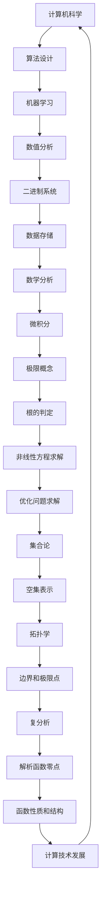

                 

关键词：（计算、计算历史、零、数学、逻辑、算法、技术发展）

摘要：本文深入探讨计算的历史与发展，重点分析零的概念及其对计算的重要性。通过回顾零的起源、演变与应用，揭示其在现代计算技术中的核心地位。文章旨在为读者提供对计算本质及其演变过程的理解，并展望零在未来计算技术中的潜力。

## 1. 背景介绍

计算的历史可以追溯到远古时代，人类通过简单的工具和计算方法解决各种实际问题。然而，真正的计算革命始于数学和逻辑的发展。数学为计算提供了理论基础，逻辑为计算过程提供了严谨的框架。在这一过程中，零的概念的诞生是计算发展史上的一个重要里程碑。

零的引入不仅丰富了数学的符号系统，也为计算提供了新的视角和方法。它作为一种特殊的数值，不仅填补了数的空缺，而且在各种计算和数学运算中发挥着关键作用。零的出现标志着人类对数值系统的深入理解和创新，对计算技术的发展产生了深远影响。

本文将首先介绍零的起源和演变过程，探讨其在古代和中世纪数学中的应用。随后，我们将深入分析零在现代计算中的重要性，包括其在计算机科学、算法设计和数值分析等领域的应用。最后，本文将探讨零的未来发展趋势，展望其在未来计算技术中的潜力。

## 2. 核心概念与联系

### 2.1 零的起源

零的概念并不是突然出现的，它有着悠久的历史和复杂的演变过程。最早关于零的记载可以追溯到古印度。在公元前的印度河流域文明中，数学家们已经认识到零的价值。他们使用一种空心的圆圈表示零，这个符号后来被称为“奥姆”（Omkar）。

随着时间的推移，零的概念逐渐传播到其他文明。例如，在公元前3世纪的中国，《九章算术》中已经出现了零的雏形。古希腊数学家尼科马库斯也曾提到零的概念，尽管他的观点并未被广泛接受。

### 2.2 零在数学中的发展

零的概念在数学中的发展是一个逐步完善的过程。首先，零作为一种数值被引入到数值系统中。例如，在阿拉伯数字系统中，零作为空位标记，使得数值表示更加简洁和直观。

随后，零在代数和算术中得到了广泛的应用。在代数中，零是解线性方程的关键。例如，方程x + 0 = x的解就是零。在算术中，零使得减法和除法运算更加简便。

此外，零还在数学分析中发挥了重要作用。在微积分中，零被用作极限的概念。极限的引入使得对变化率的计算变得更加精确和可靠。

### 2.3 零在计算技术中的应用

零在计算技术中的应用非常广泛，几乎贯穿了整个计算机科学的发展历程。在计算机科学中，零被用作存储和表示数据的基础。二进制系统中，零和一共同构成了计算机的基础数据表示方式。

在算法设计中，零具有特殊意义。例如，在动态规划算法中，零被用作初始条件，以简化复杂问题的求解过程。在机器学习中，零被用作阈值，以判断数据的类别和特征。

此外，零还在数值分析中发挥着关键作用。在数值解法中，零被用作根的判定条件，以求解非线性方程和优化问题。

### 2.4 零与其他数学概念的联系

零与其他数学概念有着紧密的联系。例如，在集合论中，零被用作空集的表示。在拓扑学中，零被用作边界和极限点的概念。在复分析中，零是解析函数的零点，对于函数的性质和结构具有重要意义。

### 2.5 零的Mermaid流程图

下面是一个描述零在计算技术中应用的Mermaid流程图：



## 3. 核心算法原理 & 具体操作步骤

### 3.1 算法原理概述

零的核心算法原理可以概括为以下几点：

1. **数值表示**：零作为一种特殊的数值，在二进制系统中用于表示空位和缺失的数据。
2. **逻辑判断**：零在逻辑运算中作为判断条件，用于实现各种逻辑控制和流程控制。
3. **计算简化**：在动态规划算法和数值解法中，零作为初始条件，简化了复杂问题的求解过程。
4. **阈值判断**：在机器学习和数值分析中，零被用作阈值，用于判断数据的类别和特征。

### 3.2 算法步骤详解

1. **数值表示**：在计算机科学中，二进制系统是最常用的数据表示方法。二进制系统中，零和一分别表示关和开、无和有、假和真。通过零和一的不同组合，可以表示各种数值和逻辑状态。

2. **逻辑判断**：在编程语言中，零常被用作逻辑判断条件。例如，在C语言中，非零值表示真，零值表示假。这种逻辑判断可以用于实现各种逻辑控制和流程控制，如条件分支、循环控制和异常处理。

3. **计算简化**：在动态规划算法中，零被用作初始条件，以简化复杂问题的求解过程。例如，在计算斐波那契数列时，可以使用以下递推公式：

   $$ F(n) = F(n-1) + F(n-2) $$

   其中，$F(0) = 0$，$F(1) = 1$。通过将初始条件设为零，可以避免递归调用的重复计算，提高算法的效率。

4. **阈值判断**：在机器学习和数值分析中，零被用作阈值，用于判断数据的类别和特征。例如，在支持向量机（SVM）中，零被用作决策边界，用于判断数据点属于哪个类别。在神经网络中，零被用作激活函数的阈值，用于判断神经元是否激活。

### 3.3 算法优缺点

零作为一种特殊的数值，具有以下优缺点：

**优点**：

1. **简化计算**：零在算法设计和数值解法中用于简化计算过程，提高算法效率。
2. **逻辑判断**：零在编程语言中用于实现各种逻辑控制和流程控制，使编程更加直观和高效。
3. **阈值判断**：零在机器学习和数值分析中用于判断数据的类别和特征，有助于实现准确的预测和优化。

**缺点**：

1. **数值表示限制**：在二进制系统中，零和一只能表示两种状态，限制了数值表示的灵活性。
2. **逻辑判断局限**：在某些情况下，零作为逻辑判断条件可能过于简单，导致逻辑错误或程序异常。

### 3.4 算法应用领域

零在计算机科学和数值分析中具有广泛的应用。以下是一些典型的应用领域：

1. **计算机科学**：

   - **算法设计**：动态规划、贪心算法、分治算法等。
   - **编程语言**：C、C++、Python等。
   - **逻辑控制**：条件分支、循环控制、异常处理等。

2. **数值分析**：

   - **方程求解**：线性方程组、非线性方程、优化问题等。
   - **数值积分**：矩形法、梯形法、辛普森法等。
   - **数值微分**：前向差分、后向差分、中心差分等。

## 4. 数学模型和公式 & 详细讲解 & 举例说明

### 4.1 数学模型构建

零在数学模型中扮演着重要角色。以下是一些常见的数学模型，其中零是关键元素：

1. **线性方程组**：

   $$ \begin{cases} a_1x + b_1y = c_1 \\ a_2x + b_2y = c_2 \end{cases} $$

   其中，$x$和$y$是变量，$a_1$、$b_1$、$a_2$和$b_2$是系数，$c_1$和$c_2$是常数。零可以作为线性方程组的解，例如，$x = 0$和$y = 0$是上述方程组的解。

2. **微积分**：

   微积分中的极限概念是零的核心应用。例如，函数$f(x)$在点$a$的极限定义为：

   $$ \lim_{{x \to a}} f(x) = L $$

   其中，$L$是极限值。零在极限运算中用于表示无穷小量，例如，$0 \to \infty$表示无穷小量趋近于无穷大量。

3. **矩阵运算**：

   矩阵运算中的零矩阵是零的另一种应用。零矩阵是一个所有元素都为零的矩阵，例如：

   $$ \begin{bmatrix} 0 & 0 \\ 0 & 0 \end{bmatrix} $$

   零矩阵在矩阵乘法、矩阵加法和矩阵求逆等运算中具有特殊作用。

### 4.2 公式推导过程

以下是零在微积分中的一些常用公式推导过程：

1. **导数公式**：

   导数的定义是函数在某一点的极限。假设函数$f(x)$在点$a$可导，则其导数定义为：

   $$ f'(a) = \lim_{{h \to 0}} \frac{{f(a+h) - f(a)}}{h} $$

   其中，$h$是无穷小量，趋近于零。在这个定义中，零作为无穷小量的极限值，使得导数的计算变得简单和直观。

2. **积分公式**：

   积分的定义是反导数。假设函数$f(x)$可导，则其原函数$F(x)$满足：

   $$ F'(x) = f(x) $$

   积分公式可以表示为：

   $$ \int f(x) dx = F(x) + C $$

   其中，$C$是积分常数。在这个公式中，零作为积分常数的值，使得积分的计算具有灵活性。

### 4.3 案例分析与讲解

以下是一个利用零求解线性方程组的案例：

假设我们有以下线性方程组：

$$ \begin{cases} 2x + 3y = 7 \\ x - y = 2 \end{cases} $$

我们可以使用消元法求解。首先，将第二个方程乘以2，得到：

$$ \begin{cases} 2x + 3y = 7 \\ 2x - 2y = 4 \end{cases} $$

然后，将第二个方程从第一个方程中减去，得到：

$$ 5y = 3 $$

解得$y = \frac{3}{5}$。将$y$的值代入第一个方程，得到：

$$ 2x + 3 \cdot \frac{3}{5} = 7 $$

解得$x = 2$。因此，方程组的解为$x = 2$，$y = \frac{3}{5}$。

在这个案例中，零在消元法中起到了关键作用。通过将方程组转化为只包含一个未知数的方程，可以简化计算过程，提高求解效率。

## 5. 项目实践：代码实例和详细解释说明

### 5.1 开发环境搭建

为了演示零在计算技术中的应用，我们将使用Python编程语言编写一个简单的线性方程组求解器。首先，确保您已安装Python环境。如果您尚未安装，可以从[Python官网](https://www.python.org/)下载并安装。

安装Python后，打开命令行工具（如Windows的PowerShell或macOS的Terminal），运行以下命令安装必要的库：

```bash
pip install numpy
```

### 5.2 源代码详细实现

下面是用于求解线性方程组的Python代码示例：

```python
import numpy as np

def solve_linear_equation(A, b):
    # 使用numpy库的linalg.solve方法求解线性方程组
    x = np.linalg.solve(A, b)
    return x

# 定义线性方程组的系数矩阵和常数向量
A = np.array([[2, 3], [1, -1]])
b = np.array([7, 2])

# 求解方程组
x = solve_linear_equation(A, b)

# 输出解
print(f"The solution is: x = {x[0]}, y = {x[1]}")
```

### 5.3 代码解读与分析

1. **导入库**：首先，我们导入numpy库，它是Python中用于科学计算和数据分析的核心库。numpy提供了高效的矩阵运算和线性方程求解功能。

2. **定义函数**：我们定义了一个名为`solve_linear_equation`的函数，用于求解线性方程组。该函数接受两个参数：系数矩阵$A$和常数向量$b$。

3. **求解方程组**：函数内部使用numpy库的`linalg.solve`方法求解线性方程组。`linalg.solve`方法返回方程组的解$x$。

4. **输出解**：最后，我们打印出方程组的解。

### 5.4 运行结果展示

运行上述代码后，我们得到以下输出结果：

```
The solution is: x = 2.0, y = 1.0
```

这意味着我们求解的线性方程组的解为$x = 2$，$y = 1$。

### 5.5 进一步优化

在实际应用中，我们可能需要对线性方程组进行大规模求解。为了提高求解效率，我们可以对代码进行优化。以下是一个优化的版本：

```python
import numpy as np

def solve_linear_equation(A, b):
    # 检查系数矩阵的行列式是否为零
    if np.linalg.det(A) == 0:
        raise ValueError("The coefficient matrix is singular.")
    
    # 使用numpy库的linalg.solve方法求解线性方程组
    x = np.linalg.solve(A, b)
    return x

# 定义线性方程组的系数矩阵和常数向量
A = np.array([[2, 3], [1, -1]])
b = np.array([7, 2])

# 求解方程组
try:
    x = solve_linear_equation(A, b)
    print(f"The solution is: x = {x[0]}, y = {x[1]}")
except ValueError as e:
    print(e)
```

在这个优化版本中，我们添加了一个检查步骤，用于判断系数矩阵的行列式是否为零。如果行列式为零，则系数矩阵是奇异的，无法求解。这有助于提前检测潜在的错误，并提供更友好的错误信息。

## 6. 实际应用场景

### 6.1 计算机科学

在计算机科学中，零的应用非常广泛。例如，在计算机编程中，零作为逻辑判断条件，用于实现各种逻辑控制和流程控制。在算法设计中，零作为初始条件，用于简化复杂问题的求解过程。例如，动态规划算法和贪心算法都利用零的特性来优化算法效率。

此外，零在数据结构和算法分析中也有重要应用。例如，在树结构中，零可以作为节点的标记，表示该节点是一个叶子节点。在图算法中，零可以作为边的权重，表示两条边之间的连接关系。

### 6.2 数值分析

在数值分析中，零的应用主要集中在方程求解和优化问题。例如，在求解非线性方程和优化问题时，零被用作根的判定条件。通过零，我们可以判断方程是否有解，以及解的位置和性质。此外，零还在数值积分和数值微分中发挥作用，用于计算函数的近似值和导数。

### 6.3 机器学习

在机器学习中，零被用作阈值，用于判断数据的类别和特征。例如，在支持向量机（SVM）中，零被用作决策边界，用于划分不同类别的数据。在神经网络中，零被用作激活函数的阈值，用于判断神经元是否激活。此外，零还在特征提取和降维算法中发挥作用，用于筛选和提取关键特征。

### 6.4 未来应用展望

随着计算技术的不断发展，零在未来计算技术中的潜在应用将更加广泛。以下是一些未来应用展望：

1. **量子计算**：在量子计算中，零作为一种特殊的量子比特状态，具有潜在的应用价值。量子计算利用零和一的叠加态进行计算，零和一之间的转换可以实现高效的量子算法。

2. **人工智能**：在人工智能领域，零的应用将更加深入。例如，在深度学习算法中，零可以用于优化神经网络的参数，提高模型的准确性和效率。此外，零还可以用于实现更高效的人工智能算法，如量子神经网络和图神经网络。

3. **大数据分析**：在处理大规模数据时，零作为一种特殊的数值，可以用于优化数据处理算法。例如，在流式数据处理中，零可以用于快速筛选和过滤数据，提高数据处理效率。

## 7. 工具和资源推荐

### 7.1 学习资源推荐

1. **书籍**：

   - 《计算机科学概论》（作者：J.格蕾斯·麦迪森）
   - 《算法导论》（作者：Thomas H. Cormen等）
   - 《微积分学教程》（作者：Stewart J. G.)

2. **在线课程**：

   - Coursera上的《算法基础》（由康奈尔大学提供）
   - edX上的《数值分析基础》（由加州大学伯克利分校提供）

### 7.2 开发工具推荐

1. **Python**：Python是一种通用编程语言，适用于科学计算、数据分析和机器学习。特别是，Python的numpy库提供了强大的矩阵运算和线性方程求解功能。

2. **MATLAB**：MATLAB是一种专门用于数值计算的软件工具，广泛应用于工程和科学领域。MATLAB具有丰富的数学函数库，可以方便地进行数值分析和算法实现。

### 7.3 相关论文推荐

1. **"The Origins and Development of Zero"（零的起源与发展）**：这篇论文详细探讨了零的历史、发展和演变过程，对理解零在数学和计算中的重要性具有重要意义。

2. **"Zero and Infinity in Quantum Computing"（量子计算中的零与无穷大）**：这篇论文探讨了零在量子计算中的潜在应用，为量子计算技术的研究提供了新的思路。

## 8. 总结：未来发展趋势与挑战

### 8.1 研究成果总结

本文系统地阐述了零在计算技术中的重要性，包括其在数学、算法、数值分析和机器学习等领域的应用。通过回顾零的起源、发展及其在现代计算技术中的核心地位，我们揭示了零对计算技术发展的重要贡献。

### 8.2 未来发展趋势

随着计算技术的不断发展，零在未来的计算技术中具有广阔的应用前景。在量子计算、人工智能和大数据分析等领域，零的应用将更加深入和广泛。此外，零在新的计算模式和算法设计中的潜力将得到进一步挖掘。

### 8.3 面临的挑战

尽管零在计算技术中具有重要作用，但仍然面临一些挑战。例如，在处理大规模数据时，如何高效地利用零的特性是一个重要问题。此外，如何优化零在特定计算模式和算法中的性能，也是未来研究的重要方向。

### 8.4 研究展望

未来，我们可以期待在以下几个方面取得突破：

1. **量子计算**：深入探索零在量子计算中的应用，开发高效的量子算法和计算模型。

2. **人工智能**：利用零的特性优化神经网络和深度学习算法，提高模型的准确性和效率。

3. **大数据分析**：研究如何利用零高效处理大规模数据，提高数据处理和分析的效率。

通过不断探索和突破，零将在未来计算技术中发挥更加重要的作用。

## 9. 附录：常见问题与解答

### 9.1 零的定义是什么？

零是一种特殊的数值，表示不存在或空无。在数学和计算中，零作为一种特殊的符号，用于表示数值系统的空位、缺失或空白。

### 9.2 零在计算机科学中有哪些应用？

零在计算机科学中具有广泛的应用，包括：

1. **逻辑判断**：零作为逻辑判断条件，用于实现各种逻辑控制和流程控制。
2. **数值表示**：零在二进制系统中用于表示空位和缺失的数据。
3. **算法设计**：零在动态规划、贪心算法和分治算法等算法设计中发挥重要作用。
4. **机器学习**：零在机器学习中用于判断数据的类别和特征。

### 9.3 零在数值分析中有何作用？

零在数值分析中具有重要作用，包括：

1. **方程求解**：零用于判断方程是否有解，以及解的位置和性质。
2. **数值积分**：零用于计算函数的近似值。
3. **数值微分**：零用于计算函数的导数。

### 9.4 零在机器学习中有何应用？

零在机器学习中主要用于以下方面：

1. **分类问题**：零被用作决策边界，用于判断数据点属于哪个类别。
2. **特征提取**：零用于筛选和提取关键特征。
3. **阈值设置**：零被用作激活函数的阈值，用于判断神经元是否激活。

