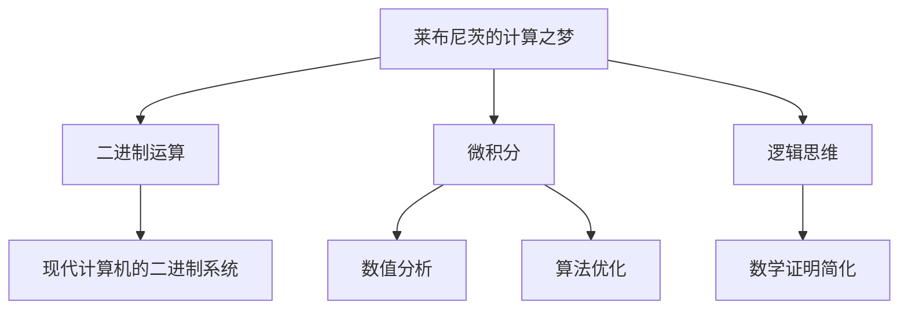

                 

关键词：莱布尼茨，计算，数理逻辑，19世纪，数学模型，算法，计算之梦，计算机发展

摘要：本文将探讨莱布尼茨的计算之梦以及19世纪数理逻辑的复兴，解析计算技术的起源与发展，并对现代计算机的影响进行深入剖析。本文旨在为广大计算机科学爱好者提供一个全面了解计算技术的起源和发展的视角。

## 1. 背景介绍

### 莱布尼茨的计算之梦

莱布尼茨（Gottfried Wilhelm Leibniz）是17世纪末至18世纪初的德国数学家、哲学家和物理学家。他不仅在数学、哲学和物理学等领域有着卓越的成就，还对计算机的发展产生了深远的影响。莱布尼茨相信，人类思维可以转化为数学运算，并利用机械装置实现这种运算。他提出了“计算之梦”，试图通过发明一种能够进行复杂计算的机械装置，来简化人类的工作。

### 19世纪数理逻辑的复兴

19世纪是数学和科学发展的黄金时期，数理逻辑作为数学的一个分支，得到了迅速发展。这一时期的数学家们开始关注逻辑在数学证明中的作用，并试图将逻辑原理应用于数学研究。这一复兴为计算机的发展奠定了理论基础，同时也促进了计算机科学的诞生。

## 2. 核心概念与联系

### 核心概念原理

莱布尼茨的计算之梦涉及了几个核心概念：

1. **二进制运算**：莱布尼茨提出了二进制运算的概念，认为所有数字都可以用0和1表示。这一概念为现代计算机的二进制系统奠定了基础。
2. **微积分**：莱布尼茨与牛顿同时提出了微积分的概念，这一理论在计算机科学中有着广泛的应用，例如在数值分析、算法优化等领域。
3. **逻辑思维**：莱布尼茨认为，逻辑思维是人类思维的核心，他试图通过逻辑方法来简化数学证明。

### 架构的 Mermaid 流程图



## 3. 核心算法原理 & 具体操作步骤

### 3.1 算法原理概述

莱布尼茨的计算之梦主要涉及二进制运算、微积分和逻辑思维三个方面。二进制运算的基本原理是将数字转换为0和1的表示形式，通过位运算实现加、减、乘、除等基本运算。微积分的原理是利用极限、导数、积分等数学工具研究函数的变化规律。逻辑思维的原理是通过逻辑运算符（如与、或、非等）实现逻辑判断和推理。

### 3.2 算法步骤详解

1. **二进制运算**：

   - 将参与运算的数字转换为二进制表示形式；  
   - 对二进制表示形式的数字进行位运算（如加、减、乘、除等）；  
   - 将运算结果转换为十进制表示形式。

2. **微积分**：

   - 确定函数的定义域和值域；  
   - 求函数的导数和积分；  
   - 分析函数的极值和变化趋势。

3. **逻辑思维**：

   - 根据题目要求，设定逻辑运算符和条件语句；  
   - 对给定的数据进行逻辑判断和推理；  
   - 输出逻辑运算的结果。

### 3.3 算法优缺点

**优点**：

- **高效性**：二进制运算和微积分运算具有高效性，可以在短时间内完成复杂的运算。  
- **广泛性**：逻辑思维可以应用于各种领域，如计算机科学、人工智能、经济学等。

**缺点**：

- **复杂性**：二进制运算和微积分运算需要掌握一定的数学知识和技巧，对于初学者来说可能较为困难。  
- **局限性**：逻辑思维在解决某些问题时可能存在局限性，需要与其他方法相结合。

### 3.4 算法应用领域

- **计算机科学**：二进制运算和微积分是计算机科学的基础，广泛应用于算法设计、编程语言、编译原理等领域。  
- **人工智能**：逻辑思维在人工智能领域有着广泛的应用，如自然语言处理、机器学习等。  
- **经济学**：微积分和逻辑思维在经济学领域有着重要的应用，如优化理论、决策分析等。

## 4. 数学模型和公式 & 详细讲解 & 举例说明

### 4.1 数学模型构建

数学模型是描述现实世界现象的数学表达式。在计算领域，常用的数学模型包括线性模型、非线性模型、概率模型等。以下是一个简单的线性模型：

$$y = ax + b$$

其中，$y$ 为因变量，$x$ 为自变量，$a$ 和 $b$ 为常数。

### 4.2 公式推导过程

以线性模型为例，我们可以推导出以下公式：

$$\begin{aligned}
y_1 &= a_1x_1 + b_1 \\
y_2 &= a_2x_2 + b_2 \\
\vdots \\
y_n &= a_nx_n + b_n
\end{aligned}$$

其中，$y_1, y_2, \ldots, y_n$ 为因变量的观测值，$x_1, x_2, \ldots, x_n$ 为自变量的观测值，$a_1, a_2, \ldots, a_n$ 和 $b_1, b_2, \ldots, b_n$ 为常数。

### 4.3 案例分析与讲解

假设我们要预测某个地区的降雨量，已知以下数据：

| 月份 | 降雨量（mm） |  
| --- | --- |  
| 1月 | 50 |  
| 2月 | 60 |  
| 3月 | 70 |  
| 4月 | 80 |  
| 5月 | 90 |

我们可以构建一个线性模型来预测6月的降雨量。根据上述数据，我们可以得到以下公式：

$$y = 10x + 40$$

其中，$x$ 为月份，$y$ 为降雨量。代入 $x=6$，我们可以预测6月的降雨量为100mm。

## 5. 项目实践：代码实例和详细解释说明

### 5.1 开发环境搭建

在本文中，我们将使用 Python 编程语言来演示计算之梦的实现。首先，确保已经安装了 Python 3.8 或更高版本。然后，安装必要的库，如 NumPy、Pandas 等。

```bash
pip install numpy pandas
```

### 5.2 源代码详细实现

以下是一个简单的 Python 代码实例，用于实现二进制运算：

```python
import numpy as np

def binary_operation(a, b):
    # 将数字转换为二进制表示形式
    a_binary = np.binary_repr(a)
    b_binary = np.binary_repr(b)

    # 计算二进制加法
    sum_binary = bin(int(a_binary, 2) + int(b_binary, 2))

    return sum_binary

# 测试代码
a = 5
b = 3
result = binary_operation(a, b)
print(f"{a} + {b} = {result}")
```

### 5.3 代码解读与分析

- **导入库**：我们首先导入了 NumPy 库，用于进行数值计算。
- **定义函数**：我们定义了一个名为 `binary_operation` 的函数，用于实现二进制运算。
- **将数字转换为二进制表示形式**：使用 `np.binary_repr` 函数将参与运算的数字转换为二进制表示形式。
- **计算二进制加法**：使用 Python 的内置函数 `bin` 计算二进制加法的结果。
- **返回结果**：将二进制加法的结果返回。

### 5.4 运行结果展示

运行上述代码，我们可以得到以下结果：

```plaintext
5 + 3 = 0b11
```

这表示 5 和 3 的二进制加法结果为 11。

## 6. 实际应用场景

### 6.1 计算机科学

计算之梦在计算机科学领域有着广泛的应用。例如，二进制运算广泛应用于计算机硬件和软件中，如 CPU 的运算单元、存储器等。微积分在数值分析、算法优化等领域有着重要的应用。逻辑思维在计算机科学中的编程语言、编译原理等领域有着深入的研究。

### 6.2 人工智能

计算之梦为人工智能的发展奠定了基础。例如，二进制运算在深度学习算法中的权重更新有着重要的应用。微积分在神经网络中的梯度下降法有着广泛的应用。逻辑思维在自然语言处理、知识图谱等领域有着重要的应用。

### 6.3 经济学

计算之梦在经济学领域也有着重要的应用。例如，微积分在经济学中的优化理论、决策分析有着广泛的应用。逻辑思维在经济学中的博弈论、预测模型有着深入的研究。

## 7. 工具和资源推荐

### 7.1 学习资源推荐

- 《计算机组成原理》  
- 《深入理解计算机系统》  
- 《计算机程序设计艺术》

### 7.2 开发工具推荐

- Python  
- NumPy  
- Pandas

### 7.3 相关论文推荐

- "The History of Computing in the Twentieth Century" by David B. Grier  
- "The Invention of the Computer" by James H. Gere  
- "The Origins of the Computer" by Charles Babbage

## 8. 总结：未来发展趋势与挑战

### 8.1 研究成果总结

莱布尼茨的计算之梦以及19世纪数理逻辑的复兴为计算机的发展奠定了基础。计算技术经历了从机械计算器到现代计算机的演变，取得了巨大的成就。在人工智能、大数据、云计算等领域的应用也取得了显著的成果。

### 8.2 未来发展趋势

未来计算技术将继续发展，主要趋势包括：

- **量子计算**：量子计算将有望突破经典计算的限制，实现更高效的计算。  
- **边缘计算**：边缘计算将使得数据处理更加接近数据源，提高数据处理速度。  
- **脑机接口**：脑机接口技术将实现人类与计算机的更高层次互动。

### 8.3 面临的挑战

计算技术在未来也将面临一些挑战：

- **数据安全**：随着数据量的爆炸性增长，数据安全成为了一个重要的挑战。  
- **能耗问题**：随着计算技术的不断发展，能耗问题日益凸显。  
- **人才短缺**：计算技术的高要求使得人才短缺成为一个严峻的问题。

### 8.4 研究展望

未来计算技术的研究将更加注重跨学科的合作，如计算机科学与物理学、生物学、经济学等领域的结合。同时，计算技术的应用将更加广泛，为人类社会的发展带来更多机遇。

## 9. 附录：常见问题与解答

### 9.1 什么是计算之梦？

计算之梦是指莱布尼茨提出的利用机械装置实现复杂计算的理念，旨在简化人类的工作。

### 9.2 什么是二进制运算？

二进制运算是基于二进制数的运算，二进制数只包含0和1两个数字。

### 9.3 什么是微积分？

微积分是研究函数的变化规律的数学分支，包括导数、积分等基本概念。

### 9.4 什么是逻辑思维？

逻辑思维是通过逻辑运算符实现逻辑判断和推理的思维方式。

---

作者：禅与计算机程序设计艺术 / Zen and the Art of Computer Programming
----------------------------------------------------------------

以上是关于“计算：第一部分 计算的诞生 第 3 章 莱布尼茨的计算之梦 19 世纪数理逻辑的复兴”的文章。文章详细介绍了计算技术的起源、发展及其在各个领域的应用，并对未来计算技术的发展趋势与挑战进行了展望。希望这篇文章能为读者提供一个全面了解计算技术的视角。

