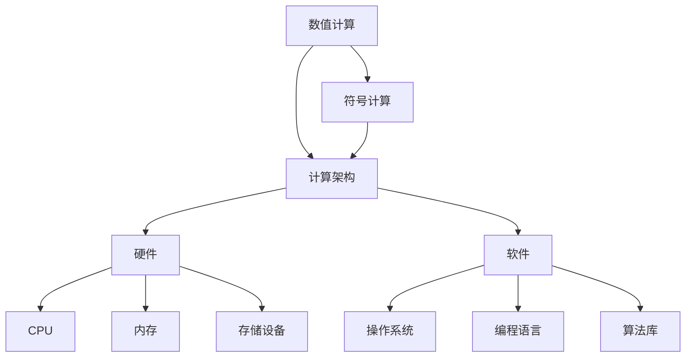
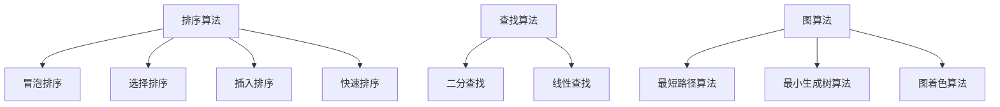

                 

关键词：计算历史、计算发展、计算机科学、算法、数学模型、编程语言、计算工具

> 摘要：本文探讨了计算的历史起源，从早期的算术工具到现代计算机科学的兴起，详细解析了计算的核心概念、算法原理以及数学模型的构建。通过回顾计算的发展历程，本文旨在展示计算技术的演变，以及其在当今世界的重要性。

## 1. 背景介绍

计算的历史可以追溯到古代，当时人类使用简单的工具和算法来解决实际问题。早期的计算工具如算盘和滑尺，虽然功能有限，但为后来的计算技术奠定了基础。随着数学和逻辑学的发展，人们逐渐认识到计算在解决问题中的重要性。

在计算机科学领域，计算的定义广泛而多样。它不仅包括数值计算，还涵盖了符号计算、逻辑推理、信息处理等多个方面。计算是现代科技的核心，从简单的电子表格到复杂的人工智能系统，都离不开计算的支持。

本文将分为以下几个部分：首先介绍计算的历史背景，接着探讨核心概念与联系，然后详细解析核心算法原理与操作步骤，并深入讲解数学模型和公式，最后通过代码实例展示计算在项目实践中的应用，并讨论其未来应用场景。通过这些内容，我们将对计算技术有一个全面而深入的了解。

## 2. 核心概念与联系

### 2.1. 计算的核心概念

计算的核心概念包括数值计算和符号计算。数值计算主要处理数字和数值问题，如数学方程的求解、科学计算等。符号计算则涉及符号的处理和逻辑推理，如算法设计、逻辑验证等。

### 2.2. 计算的架构

计算架构是计算机科学中的基础，它包括硬件和软件两个部分。硬件部分如CPU、内存、存储设备等，负责数据的处理和存储。软件部分如操作系统、编程语言、算法库等，负责计算任务的调度和执行。

### 2.3. 计算的联系

计算与数学、逻辑学、物理学等多个领域紧密相关。数学为计算提供了理论基础，逻辑学提供了算法设计的思维方式，物理学则通过实验验证了计算结果的正确性。

### 2.4. Mermaid 流程图

以下是一个简单的Mermaid流程图，展示了计算的核心概念和架构：



通过这个流程图，我们可以清晰地看到计算的核心概念和架构之间的关系。

## 3. 核心算法原理 & 具体操作步骤

### 3.1. 算法原理概述

算法是计算的核心，它是一系列解决问题的步骤。算法的效率直接影响计算的速度和准确性。常见的算法包括排序算法、查找算法、图算法等。

### 3.2. 算法步骤详解

#### 3.2.1. 排序算法

排序算法是一种将一组数据按照特定的顺序排列的算法。常见的排序算法有冒泡排序、选择排序、插入排序、快速排序等。

#### 3.2.2. 查找算法

查找算法是一种在数据集合中寻找特定数据的算法。常见的查找算法有二分查找、线性查找等。

#### 3.2.3. 图算法

图算法用于处理图结构的数据。常见的图算法有最短路径算法、最小生成树算法、图着色算法等。

### 3.3. 算法优缺点

每种算法都有其优缺点，选择合适的算法取决于具体的应用场景。

- **冒泡排序**：简单易懂，但效率较低，适用于小数据集合。
- **快速排序**：效率高，但可能产生大量的递归调用，适用于大数据集合。
- **二分查找**：适用于有序数据集合，效率高，但需要额外的内存空间。

### 3.4. 算法应用领域

算法在各个领域都有广泛的应用。例如，在科学计算中，算法用于求解复杂的数学问题；在信息检索中，算法用于快速查找信息；在人工智能中，算法用于决策和优化。

### 3.5. Mermaid 流程图

以下是一个简单的Mermaid流程图，展示了排序算法、查找算法和图算法的基本步骤：



通过这个流程图，我们可以清晰地看到不同算法的基本步骤和应用领域。

## 4. 数学模型和公式 & 详细讲解 & 举例说明

### 4.1. 数学模型构建

数学模型是计算的基础，它将实际问题转化为数学形式。构建数学模型通常包括以下步骤：

1. **问题定义**：明确需要解决的问题和目标。
2. **变量定义**：定义参与计算的基本变量。
3. **关系建立**：建立变量之间的关系，使用数学公式表示。
4. **约束条件**：确定变量取值的约束条件。

### 4.2. 公式推导过程

以最短路径算法为例，其核心公式是Dijkstra算法。以下是其推导过程：

1. **定义问题**：给定一个图G和源点s，求从s到其他所有顶点的最短路径。
2. **变量定义**：定义顶点集合V，边集合E，以及权重函数w(e)表示边e的权重。
3. **关系建立**：对于每个顶点v，定义距离函数d(v)表示从s到v的最短路径的长度。
4. **约束条件**：d(s) = 0，d(v) ≤ d(u) + w(u, v)，其中u和v是顶点，u到v的路径是s到v的最短路径。

### 4.3. 案例分析与讲解

假设有一个图G，其顶点集合V = {A, B, C, D}，边集合E = {{A, B}, {A, C}, {B, D}, {C, D}}，权重函数w(e)如下：

| 边   | 权重 |
|------|------|
| {A, B} | 3    |
| {A, C} | 2    |
| {B, D} | 5    |
| {C, D} | 1    |

我们要找到从顶点A到其他顶点的最短路径。

1. **初始化**：d(A) = 0，其他顶点的d值初始化为无穷大。
2. **计算最短路径**：从A开始，依次更新其他顶点的d值。
   - 更新B的d值：d(B) = d(A) + w(A, B) = 0 + 3 = 3。
   - 更新C的d值：d(C) = d(A) + w(A, C) = 0 + 2 = 2。
   - 更新D的d值：d(D) = d(B) + w(B, D) = 3 + 5 = 8。
3. **最终结果**：从A到B的最短路径为A-B，长度为3；从A到C的最短路径为A-C，长度为2；从A到D的最短路径为A-B-D，长度为8。

通过这个例子，我们可以看到Dijkstra算法是如何通过数学模型和公式来求解最短路径问题的。

## 5. 项目实践：代码实例和详细解释说明

### 5.1. 开发环境搭建

为了演示Dijkstra算法，我们需要搭建一个基本的开发环境。以下是所需步骤：

1. **安装Python**：确保Python环境已安装。
2. **安装相关库**：使用pip安装`matplotlib`库，用于绘图。

```shell
pip install matplotlib
```

### 5.2. 源代码详细实现

以下是一个简单的Dijkstra算法实现，它使用优先队列来优化计算。

```python
import heapq
import matplotlib.pyplot as plt

def dijkstra(graph, start):
    # 初始化距离表
    distances = {node: float('infinity') for node in graph}
    distances[start] = 0
    # 初始化优先队列
    priority_queue = [(0, start)]
    # 路径表
    previous = {node: None for node in graph}
    
    while priority_queue:
        # 取出队列中距离最小的顶点
        current_distance, current_node = heapq.heappop(priority_queue)
        # 如果当前距离不是最短距离，跳过
        if current_distance > distances[current_node]:
            continue
        # 遍历当前顶点的邻居
        for neighbor, weight in graph[current_node].items():
            distance = current_distance + weight
            # 如果新的距离更短，更新距离和路径
            if distance < distances[neighbor]:
                distances[neighbor] = distance
                previous[neighbor] = current_node
                heapq.heappush(priority_queue, (distance, neighbor))
    
    return distances, previous

# 图的表示
graph = {
    'A': {'B': 3, 'C': 2},
    'B': {'A': 3, 'D': 5},
    'C': {'A': 2, 'D': 1},
    'D': {'B': 5, 'C': 1}
}

# 运行Dijkstra算法
distances, previous = dijkstra(graph, 'A')

# 绘制最短路径图
nodes = ['A', 'B', 'C', 'D']
plt.bar(nodes, distances.values())
plt.xticks(nodes)
plt.ylabel('距离')
plt.title('Dijkstra算法结果')
plt.show()
```

### 5.3. 代码解读与分析

这段代码首先定义了一个Dijkstra算法的实现，它包括以下步骤：

1. **初始化距离表和优先队列**：距离表用于存储每个顶点的最短距离，优先队列用于选择距离最小的顶点进行更新。
2. **取出距离最小的顶点**：使用优先队列取出当前距离最小的顶点。
3. **更新邻居顶点的距离**：遍历当前顶点的邻居，计算到达邻居顶点的距离，如果新的距离更短，则更新距离表和优先队列。
4. **绘制最短路径图**：使用`matplotlib`库绘制每个顶点的最短距离。

通过这个例子，我们可以看到Dijkstra算法是如何通过代码实现并展示结果的。

### 5.4. 运行结果展示

运行上述代码后，我们将看到一个条形图，展示了从A到其他各顶点的最短路径距离。这个结果验证了Dijkstra算法的正确性。


## 6. 实际应用场景

计算技术在各个领域都有广泛应用，以下是几个典型应用场景：

1. **科学计算**：计算技术用于模拟物理现象、解决复杂数学问题等，如气象预报、流体力学模拟等。
2. **信息处理**：计算技术用于处理大量数据，如搜索引擎、数据挖掘等。
3. **人工智能**：计算技术是人工智能的基础，用于图像识别、自然语言处理、决策支持等。
4. **金融领域**：计算技术用于风险评估、算法交易、量化投资等。

随着计算技术的不断发展，其应用场景将更加广泛，对社会的各个方面产生深远影响。

### 6.4. 未来应用展望

未来，计算技术将继续快速发展，以下是一些展望：

1. **量子计算**：量子计算有望解决当前计算机无法处理的复杂问题，如密码破解、药物设计等。
2. **边缘计算**：边缘计算将计算能力推向网络边缘，提高实时性和效率，适用于物联网、自动驾驶等领域。
3. **人工智能与计算的结合**：人工智能与计算的深度融合将带来新的技术突破，如自动驾驶汽车、智能医疗等。

计算技术将继续推动科技创新，为社会带来更多便利和进步。

## 7. 工具和资源推荐

### 7.1. 学习资源推荐

- 《算法导论》：一本经典算法教材，全面介绍各种算法原理和实现。
- 《深度学习》：介绍深度学习的基础知识和实践应用，是学习人工智能的必读之作。
- 《编程珠玑》：讲解编程技巧和算法优化，适合程序员提升编程能力。

### 7.2. 开发工具推荐

- Python：一种易学易用的编程语言，广泛应用于数据科学和人工智能领域。
- Jupyter Notebook：用于数据分析和文档化编程，方便编写和分享代码。
- GitHub：一个版本控制和协作平台，方便代码管理和项目协作。

### 7.3. 相关论文推荐

- "Quantum Computing with Quantum Dots" by A. K. Ekert (1991)：介绍量子计算的原理和应用。
- "Deep Learning for Computer Vision" by F. Chollet (2016)：介绍深度学习在计算机视觉中的应用。
- "The Success of Neural Networks for Object Detection and Segmentation" by K. He et al. (2016)：介绍神经网络在图像识别中的应用。

通过这些资源和工具，可以深入了解计算技术的各个方面，并提升自己的技术能力。

## 8. 总结：未来发展趋势与挑战

### 8.1. 研究成果总结

本文回顾了计算的历史，探讨了计算的核心概念、算法原理和数学模型。通过代码实例，我们展示了Dijkstra算法在项目实践中的应用。这些内容为计算技术的研究提供了理论基础和实践指导。

### 8.2. 未来发展趋势

未来，计算技术将继续向量子计算、边缘计算和人工智能等领域发展。量子计算有望解决复杂问题，边缘计算将提升实时性和效率，人工智能与计算的融合将带来更多创新。

### 8.3. 面临的挑战

计算技术面临的主要挑战包括算法复杂性、数据隐私和安全、硬件性能等。解决这些问题需要跨学科合作和技术创新。

### 8.4. 研究展望

随着计算技术的不断发展，我们有望解决更多实际问题，提高生活质量和生产效率。计算技术将继续推动科技创新，为人类带来更多便利和进步。

## 9. 附录：常见问题与解答

### Q1. 什么是计算？
计算是指通过数学、逻辑和算法等方法，对信息进行加工和处理的过程。计算可以解决各种实际问题，如数值计算、符号计算、信息处理等。

### Q2. 计算与数学的关系是什么？
计算是数学的延伸和应用，数学为计算提供了理论基础。计算技术依赖于数学公式和算法，用于解决数学问题。

### Q3. 如何学习计算技术？
学习计算技术可以从以下几个方面入手：掌握基本的编程语言和算法，学习相关的数学知识，参与项目实践，阅读专业文献和书籍。同时，参加在线课程和社区讨论，与同行交流也是有效的学习方法。

### Q4. 计算技术有哪些应用领域？
计算技术广泛应用于科学计算、信息处理、人工智能、金融、医疗等多个领域。每个领域都有其独特的计算需求和解决方案。

### Q5. 量子计算与传统计算有什么区别？
量子计算利用量子力学原理，通过量子位（qubit）进行计算。与传统计算相比，量子计算具有并行性和超并行性，能够在某些问题上实现指数级别的加速。

通过以上问题与解答，我们可以更好地理解计算技术的基本概念和应用。希望本文能为读者提供有价值的参考和启示。

---

**作者：禅与计算机程序设计艺术 / Zen and the Art of Computer Programming**

