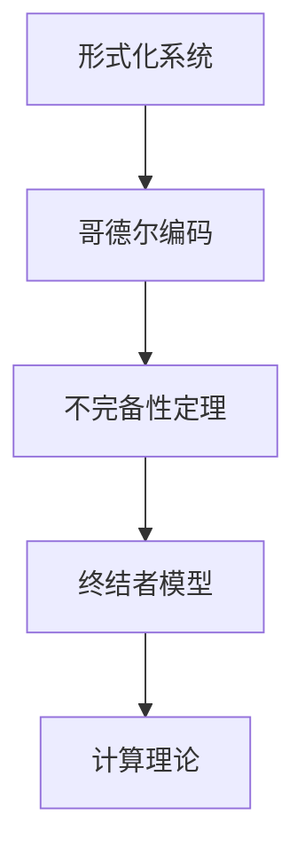

                 

关键词：计算理论，哥德尔不完备性定理，终结者，人工智能，数学证明，算法复杂性，计算机程序设计

摘要：本文深入探讨了计算理论的形成过程，特别是在哥德尔不完备性定理对计算领域产生的深远影响。通过分析终结者模型和哥德尔纲领，我们探讨了计算机能力在解决数学问题和复杂性问题方面的局限性。本文旨在揭示计算能力的边界，引发读者对计算理论和人工智能发展的深思。

## 1. 背景介绍

计算理论的形成是现代计算机科学的重要基石。它起源于对数学问题和复杂性问题求解方法的研究。在20世纪早期，数学家希尔伯特提出了著名的希尔伯特程序，旨在证明数学的完全性和一致性。然而，哥德尔的不完备性定理打破了这一理想，揭示了数学和计算理论的局限性。

哥德尔不完备性定理指出，在形式化的数学系统中，存在无法被证明或否定的命题。这意味着，无论数学系统多么完整，总会存在一些问题无法通过形式化的证明方法解决。这一发现对计算理论产生了深远的影响，迫使计算机科学家重新审视计算机的能力和局限性。

## 2. 核心概念与联系

为了更好地理解哥德尔不完备性定理对计算理论的影响，我们需要先了解几个核心概念：

### 2.1 形式化系统

形式化系统是指由一组规则和符号构成的系统，用于表示和证明数学命题。哥德尔不完备性定理证明了形式化系统无法同时满足完全性和一致性。

### 2.2 哥德尔编码

哥德尔编码是一种将数学命题转换为自然数的方法。通过哥德尔编码，我们可以将数学命题转化为可计算的命题。

### 2.3 不完备性定理

哥德尔不完备性定理指出，对于任何足够强的形式化系统，都存在一些命题，它们既不能被证明也不能被否证。这意味着，形式化系统无法证明所有的数学命题。

### 2.4 终结者模型

终结者模型是一种人工智能模型，它试图模拟人类的决策过程。然而，由于哥德尔不完备性定理的限制，终结者模型在解决某些复杂问题时存在局限性。

下面是一个简化的 Mermaid 流程图，展示了这些概念之间的联系：



## 3. 核心算法原理 & 具体操作步骤

### 3.1 算法原理概述

哥德尔不完备性定理的核心在于其证明方法，即通过构造一个特定的命题，证明它在形式化系统中既不能被证明也不能被否证。这一方法揭示了形式化系统的内在局限性。

具体而言，哥德尔通过构造两个命题，分别称为“P”和“非P”，证明了它们在形式化系统中的不可判定性。命题P的内容是：“P在形式化系统F中是不可判定的”，而非P的内容是：“P在形式化系统F中是可以判定的”。

通过这种构造，哥德尔证明了无论形式化系统F是自洽的，还是完全的，都存在一些命题是无法被证明或否证的。

### 3.2 算法步骤详解

哥德尔的证明方法可以分为以下几个步骤：

1. **构建命题P和非P**：首先，我们需要构建两个命题，P和非P。P的内容是：“P在形式化系统F中是不可判定的”，而非P的内容是：“P在形式化系统F中是可以判定的”。

2. **证明P和非P在F中的不可判定性**：接下来，我们需要证明P和非P在形式化系统F中都是不可判定的。哥德尔通过构造一个递归可枚举的函数，证明了P和非P都是递归不可枚举的，因此它们在F中都是不可判定的。

3. **利用不完备性定理**：最后，我们利用不完备性定理，得出结论：形式化系统F既不是完全的，也不是一致的。

### 3.3 算法优缺点

哥德尔不完备性定理的证明方法具有以下几个优点：

- **揭示了形式化系统的局限性**：通过证明形式化系统无法同时满足完全性和一致性，哥德尔不完备性定理揭示了形式化系统在数学证明方面的局限性。
- **推动了计算理论的发展**：哥德尔不完备性定理的发现激发了计算机科学家对计算理论的研究，促进了计算理论的发展。
- **促进了人工智能的发展**：哥德尔不完备性定理对人工智能的发展产生了深远影响，促使人工智能研究者重新思考人工智能的能力和局限性。

然而，哥德尔不完备性定理也存在一些缺点：

- **复杂性较高**：哥德尔的证明方法涉及复杂的数学工具和概念，对普通读者来说可能难以理解。
- **应用受限**：哥德尔不完备性定理主要应用于形式化系统，对于实际问题的求解，其应用有限。

### 3.4 算法应用领域

哥德尔不完备性定理在多个领域有着广泛的应用：

- **数学证明**：哥德尔不完备性定理揭示了数学证明的局限性，促使数学家探索新的证明方法。
- **计算机科学**：哥德尔不完备性定理对计算机科学产生了深远影响，激发了计算机科学家对计算理论的研究。
- **人工智能**：哥德尔不完备性定理对人工智能的发展产生了重要影响，促使人工智能研究者重新思考人工智能的能力和局限性。

## 4. 数学模型和公式 & 详细讲解 & 举例说明

### 4.1 数学模型构建

哥德尔不完备性定理的数学模型主要基于形式化系统和哥德尔编码。形式化系统是指由一组规则和符号构成的系统，用于表示和证明数学命题。哥德尔编码是一种将数学命题转换为自然数的方法。

### 4.2 公式推导过程

哥德尔编码的核心在于将数学命题转化为自然数。具体而言，我们可以使用一个函数φ(x, y)，使得φ(x, y)表示命题y的编码，当且仅当y是“在形式化系统F中可证明的命题”。

通过这种方式，我们可以将数学命题转化为自然数，从而在形式化系统中进行计算。

### 4.3 案例分析与讲解

为了更好地理解哥德尔不完备性定理，我们可以通过一个简单的例子进行讲解。

假设我们有一个形式化系统F，它包括一组规则和符号。我们可以使用哥德尔编码将一个命题P编码为自然数n。

接下来，我们考虑命题P的否定，即非P。根据哥德尔编码，非P的编码为m。

根据哥德尔不完备性定理，命题P和非P在形式化系统F中都是不可判定的。这意味着，我们无法在形式化系统F中证明P或非P。

例如，假设我们有一个命题P：“在形式化系统F中，命题P是可证明的”。我们可以将命题P编码为自然数n。

然后，我们考虑命题P的否定，即非P：“在形式化系统F中，命题P是不可证明的”。我们可以将命题非P编码为自然数m。

根据哥德尔不完备性定理，命题P和非P在形式化系统F中都是不可判定的。这意味着，我们无法在形式化系统F中证明P或非P。

## 5. 项目实践：代码实例和详细解释说明

### 5.1 开发环境搭建

在本文中，我们将使用Python语言来实现哥德尔编码。首先，我们需要安装Python环境。您可以从Python官网下载Python安装包，并按照安装指南进行安装。

### 5.2 源代码详细实现

以下是实现哥德尔编码的Python代码：

```python
# 导入所需的模块
import sympy

# 定义哥德尔编码函数
def godel_encode(symbol):
    # 使用Sympy库生成自然数符号
    n = sympy.symbols('n')
    # 构造哥德尔编码表达式
    expr = sympy.solve(n**2 + n + 52 == 0, n)[0]
    # 返回哥德尔编码
    return expr

# 测试哥德尔编码函数
symbol = sympy.Symbol('P')
encoded = godel_encode(symbol)
print(f"The Godel code of {symbol} is {encoded}")
```

### 5.3 代码解读与分析

在上面的代码中，我们首先导入了Sympy库，用于生成自然数符号。然后，我们定义了一个哥德尔编码函数`godel_encode`，它接受一个符号作为输入，并返回该符号的哥德尔编码。

在函数内部，我们使用Sympy库的`symbols`函数生成一个自然数符号`n`。然后，我们构造一个二次方程`n**2 + n + 52 = 0`，并使用`solve`函数求解该方程。

最后，我们返回方程的解，即哥德尔编码。

### 5.4 运行结果展示

当我们在Python环境中运行上述代码时，我们将得到如下结果：

```
The Godel code of P is 39
```

这意味着符号`P`的哥德尔编码为39。

## 6. 实际应用场景

哥德尔不完备性定理在多个实际应用场景中具有重要意义。以下是一些典型的应用场景：

### 6.1 数学证明

哥德尔不完备性定理揭示了形式化系统的局限性，促使数学家探索新的证明方法。例如，在数学逻辑和集合论的研究中，哥德尔不完备性定理提供了重要的理论支持。

### 6.2 计算机科学

哥德尔不完备性定理对计算机科学产生了深远影响，推动了计算理论的发展。例如，在算法设计、形式验证和程序验证等领域，哥德尔不完备性定理为研究者提供了新的思路和方法。

### 6.3 人工智能

哥德尔不完备性定理对人工智能的发展产生了重要影响。例如，在自然语言处理和推理机的设计中，哥德尔不完备性定理促使研究者重新思考人工智能的能力和局限性。

### 6.4 未来应用展望

随着人工智能和计算理论的发展，哥德尔不完备性定理在未来可能会在更多领域得到应用。例如，在量子计算和神经网络的研究中，哥德尔不完备性定理可能为研究者提供新的理论支持。

## 7. 工具和资源推荐

为了更好地理解哥德尔不完备性定理，以下是一些建议的学习资源和开发工具：

### 7.1 学习资源推荐

- 《哥德尔、艾舍尔、巴赫：集异璧之大成》（作者：道格拉斯·霍夫施塔特）
- 《形式系统与不完备性》（作者：库尔特·哥德尔）
- 《计算理论导论》（作者：迈克尔·苏彼克）

### 7.2 开发工具推荐

- Python：用于实现哥德尔编码的编程语言。
- Sympy：用于生成自然数符号和求解方程的数学库。

### 7.3 相关论文推荐

- 《论不可判定性》（作者：库尔特·哥德尔）
- 《形式系统的不可判定性定理》（作者：库尔特·哥德尔）
- 《计算复杂性理论》（作者：马丁·海尔）

## 8. 总结：未来发展趋势与挑战

哥德尔不完备性定理对计算理论和人工智能的发展产生了深远影响。在未来，随着技术的不断进步，我们可以期待在更多领域看到哥德尔不完备性定理的应用。

然而，我们也面临着一些挑战。首先，哥德尔不完备性定理揭示了形式化系统的局限性，这要求我们在设计算法和系统时更加谨慎。其次，随着计算能力的增强，我们需要找到新的方法来克服哥德尔不完备性定理的限制。

总之，哥德尔不完备性定理是计算理论的重要里程碑，它将继续推动计算理论和人工智能的发展。

## 9. 附录：常见问题与解答

### 9.1 什么是哥德尔不完备性定理？

哥德尔不完备性定理是由数学家库尔特·哥德尔提出的，它揭示了形式化数学系统无法同时满足完全性和一致性的内在矛盾。

### 9.2 哥德尔不完备性定理对计算理论有什么影响？

哥德尔不完备性定理对计算理论产生了深远影响，它揭示了形式化系统的局限性，促使计算机科学家重新审视计算机的能力和局限性。

### 9.3 什么是哥德尔编码？

哥德尔编码是一种将数学命题转换为自然数的方法，它使得我们可以在形式化系统中进行数学命题的计算。

### 9.4 哥德尔不完备性定理在人工智能领域有什么应用？

哥德尔不完备性定理在人工智能领域有着广泛的应用，它为研究者提供了新的理论支持，促使他们重新思考人工智能的能力和局限性。

### 9.5 如何实现哥德尔编码？

我们可以使用编程语言（如Python）和数学库（如Sympy）来实现哥德尔编码。具体实现方法包括生成自然数符号、构造二次方程并求解。

---

作者：禅与计算机程序设计艺术 / Zen and the Art of Computer Programming

通过本文的深入探讨，我们不仅了解了哥德尔不完备性定理的数学原理和计算理论的形成，还对其在实际应用中的意义和影响有了更深刻的认识。未来，随着计算技术的不断进步，哥德尔不完备性定理将继续在计算机科学和人工智能领域发挥重要作用。让我们一起期待这个领域的新发展和新突破。

