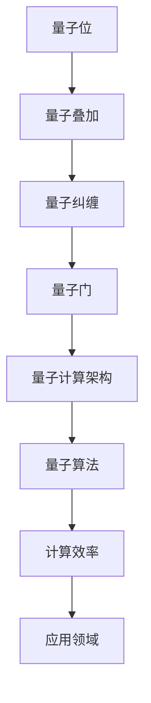

                 

关键词：量子计算、计算极限、算法原理、数学模型、实践应用、未来展望

摘要：本文深入探讨了量子计算的起源、核心概念、算法原理以及数学模型。通过详细讲解量子计算在实际应用中的操作步骤、优缺点和未来应用展望，旨在为广大读者提供关于量子计算的全面了解。同时，文章还推荐了相关的学习资源和开发工具，以帮助读者更好地掌握这一前沿技术。

## 1. 背景介绍

量子计算作为计算技术领域的一项革命性突破，源于对量子力学基本原理的研究。与传统计算机相比，量子计算利用量子位（qubits）进行信息存储和处理，具有并行计算和超强大耦合能力。量子计算的发展不仅推动了计算机科学领域的研究，也在量子物理学、量子通信、量子加密等领域产生了深远的影响。

量子计算的研究始于20世纪80年代，物理学家理查德·费曼提出了量子计算机的概念。此后，彼得·谢尔盖·彼得罗夫、理查德·费曼、大卫·多伊奇等科学家进一步推动了量子计算的理论研究和实际应用。随着量子技术的不断发展，量子计算机逐渐从理论走向实际，成为当今科技领域的研究热点。

## 2. 核心概念与联系

量子计算的核心概念包括量子位（qubits）、量子叠加、量子纠缠和量子门。这些概念相互联系，构成了量子计算的基本原理和架构。

### 2.1 量子位（qubits）

量子位是量子计算中的基本单元，与经典计算机中的位（bits）相对应。量子位不仅可以表示0和1的叠加状态，还可以实现并行计算和超强大耦合。一个量子位可以表示为 $|0\rangle$ 和 $|1\rangle$ 的叠加态，即 $|\psi\rangle = a|0\rangle + b|1\rangle$，其中 $a$ 和 $b$ 是复数，且满足 $|a|^2 + |b|^2 = 1$。

### 2.2 量子叠加

量子叠加是量子计算的核心原理之一。在量子计算中，量子位可以同时处于0和1的状态，这种状态被称为叠加态。通过量子叠加，量子计算机可以实现并行计算，从而提高计算效率。

### 2.3 量子纠缠

量子纠缠是量子计算中的另一个重要概念。当两个或多个量子位发生相互作用时，它们之间会形成一种特殊的纠缠关系。这种纠缠关系使得量子位的状态相互关联，从而在量子计算中实现超强大耦合。

### 2.4 量子门

量子门是量子计算中的基本操作，类似于经典计算机中的逻辑门。量子门可以对量子位进行操作，实现量子信息的存储、传输和处理。常见的量子门包括Pauli门、Hadamard门和控制门等。

下面是量子计算的核心概念和架构的Mermaid流程图：



## 3. 核心算法原理 & 具体操作步骤

### 3.1 算法原理概述

量子计算的核心算法原理主要包括量子线路（Quantum Circuit）、量子算法（Quantum Algorithm）和量子并行计算（Quantum Parallel Computation）。

量子线路是量子计算的基本操作框架，通过量子门和量子位的组合，实现量子信息的存储、传输和处理。量子算法是基于量子线路进行计算，解决特定问题的方法。量子并行计算利用量子叠加和量子纠缠，实现并行计算，从而提高计算效率。

### 3.2 算法步骤详解

量子计算的算法步骤主要包括初始化、量子线路构建、量子测量和经典后处理。

1. 初始化：将量子位初始化为叠加态，如 $|\psi\rangle = \frac{1}{\sqrt{2}}(|0\rangle + |1\rangle)$。

2. 量子线路构建：通过量子门对量子位进行操作，实现量子信息的存储、传输和处理。常见的量子线路包括线性变换、酉变换和量子门组合等。

3. 量子测量：对量子位进行测量，获取量子计算的输出结果。量子测量会导致量子位的状态坍缩，从而实现量子信息的读取。

4. 经典后处理：对量子测量结果进行经典计算，得到最终的计算结果。

### 3.3 算法优缺点

量子计算具有以下优点：

1. 并行计算：利用量子叠加和量子纠缠，实现并行计算，从而提高计算效率。

2. 优化算法：量子计算能够优化传统算法，解决某些问题具有更高的计算效率。

3. 难题破解：量子计算能够解决某些经典计算机难以解决的问题，如因数分解、量子搜索等。

然而，量子计算也面临一些挑战：

1. 量子退相干：量子位的状态容易受到外界干扰，导致量子退相干，影响量子计算的稳定性。

2. 量子纠错：量子计算中的错误率较高，需要量子纠错技术来提高计算可靠性。

3. 技术实现：目前量子计算机仍处于实验室阶段，技术实现面临诸多挑战。

### 3.4 算法应用领域

量子计算在多个领域具有广泛的应用前景：

1. 量子模拟：利用量子计算机模拟量子系统，研究量子现象和量子材料。

2. 量子加密：利用量子纠缠和量子叠加，实现量子密钥分发和量子安全通信。

3. 优化算法：利用量子计算优化物流、金融、能源等领域的优化问题。

4. 因数分解：利用量子计算破解经典计算机难以解决的问题，如RSA加密。

## 4. 数学模型和公式 & 详细讲解 & 举例说明

### 4.1 数学模型构建

量子计算的数学模型主要包括量子状态表示、量子变换和量子测量。

1. 量子状态表示：量子状态可以用量子比特的叠加态表示，如 $|\psi\rangle = a|0\rangle + b|1\rangle$。

2. 量子变换：量子变换可以用量子门表示，如Pauli门、Hadamard门和控制门。

3. 量子测量：量子测量可以用概率分布表示，如 $P_0 = |a|^2$ 和 $P_1 = |b|^2$。

### 4.2 公式推导过程

1. 量子状态表示：

量子状态 $|\psi\rangle$ 可以表示为 $|0\rangle$ 和 $|1\rangle$ 的线性叠加，即：

$$|\psi\rangle = a|0\rangle + b|1\rangle$$

其中 $a$ 和 $b$ 是复数，且满足 $|a|^2 + |b|^2 = 1$。

2. 量子变换：

量子变换可以用量子门表示，如Pauli门、Hadamard门和控制门。

- Pauli门：Pauli门是量子计算中最基本的量子门，包括X门、Y门和Z门。X门将量子位的状态翻转，即 $X|0\rangle = |1\rangle$ 和 $X|1\rangle = |0\rangle$。Y门和Z门也具有类似的性质。

- Hadamard门：Hadamard门是一种线性变换，将量子位的状态从基态叠加到叠加态。Hadamard门表示为 $H = \frac{1}{\sqrt{2}}\begin{pmatrix} 1 & 1 \\ 1 & -1 \end{pmatrix}$。

- 控制门：控制门是一种特殊类型的量子门，用于实现量子位之间的耦合。控制门可以表示为 $CNOT = \begin{pmatrix} I & 0 \\ 0 & X \end{pmatrix}$，其中 $I$ 是单位矩阵。

3. 量子测量：

量子测量可以用概率分布表示。对于量子状态 $|\psi\rangle = a|0\rangle + b|1\rangle$，其测量结果为 $|0\rangle$ 和 $|1\rangle$ 的概率分别为 $P_0 = |a|^2$ 和 $P_1 = |b|^2$。

### 4.3 案例分析与讲解

假设我们有一个两个量子比特的系统，初始状态为 $|\psi\rangle = \frac{1}{\sqrt{2}}(|00\rangle + |11\rangle)$。我们使用Hadamard门对第一个量子比特进行变换，然后使用控制-NOT（CNOT）门对第二个量子比特进行变换。

1. 初始状态：

$$|\psi\rangle = \frac{1}{\sqrt{2}}(|00\rangle + |11\rangle)$$

2. Hadamard变换：

$$H|0\rangle = \frac{1}{\sqrt{2}}(|0\rangle + |1\rangle)$$

$$H|1\rangle = \frac{1}{\sqrt{2}}(|0\rangle - |1\rangle)$$

$$|\psi\rangle = \frac{1}{\sqrt{2}}(|00\rangle + |11\rangle) \rightarrow \frac{1}{\sqrt{2}}(|0\rangle + |1\rangle)|0\rangle + \frac{1}{\sqrt{2}}(|0\rangle - |1\rangle)|1\rangle$$

3. CNOT变换：

$$CNOT(|0\rangle|0\rangle) = |0\rangle|0\rangle$$

$$CNOT(|0\rangle|1\rangle) = |0\rangle|1\rangle$$

$$CNOT(|1\rangle|0\rangle) = |1\rangle|0\rangle$$

$$CNOT(|1\rangle|1\rangle) = |1\rangle|1\rangle$$

$$|\psi\rangle = \frac{1}{\sqrt{2}}(|0\rangle + |1\rangle)|0\rangle + \frac{1}{\sqrt{2}}(|0\rangle - |1\rangle)|1\rangle \rightarrow \frac{1}{\sqrt{2}}(|0\rangle|0\rangle + |0\rangle|1\rangle - |1\rangle|0\rangle - |1\rangle|1\rangle)$$

4. 测量结果：

对于量子状态 $|\psi\rangle = \frac{1}{\sqrt{2}}(|0\rangle|0\rangle + |0\rangle|1\rangle - |1\rangle|0\rangle - |1\rangle|1\rangle)$，其测量结果为 $|0\rangle|0\rangle$ 和 $|1\rangle|1\rangle$ 的概率分别为：

$$P_{00} = \frac{1}{4}$$

$$P_{11} = \frac{1}{4}$$

## 5. 项目实践：代码实例和详细解释说明

### 5.1 开发环境搭建

为了实践量子计算，我们需要搭建相应的开发环境。以下是一个简单的Python环境搭建步骤：

1. 安装Python：

   ```
   pip install python
   ```

2. 安装量子计算库：

   ```
   pip install qiskit
   ```

### 5.2 源代码详细实现

以下是一个简单的量子计算示例代码，使用Qiskit库实现量子线路和量子测量。

```python
from qiskit import QuantumCircuit, execute, Aer

# 创建量子线路
circuit = QuantumCircuit(2)

# Hadamard变换
circuit.h(0)

# CNOT变换
circuit.cx(0, 1)

# 测量
circuit.measure_all()

# 执行量子线路
backend = Aer.get_backend('qasm_simulator')
result = execute(circuit, backend, shots=1000).result()

# 输出结果
print(result.get_counts(circuit))
```

### 5.3 代码解读与分析

1. 创建量子线路：使用`QuantumCircuit`类创建一个量子线路，指定量子比特数量。

2. Hadamard变换：使用`h`方法对第一个量子比特进行Hadamard变换，将其从基态叠加到叠加态。

3. CNOT变换：使用`cx`方法对第一个量子比特和第二个量子比特进行CNOT变换，实现量子位之间的耦合。

4. 测量：使用`measure`方法对量子比特进行测量，获取量子计算的输出结果。

5. 执行量子线路：使用`execute`方法执行量子线路，指定模拟器 backend 和运行次数。

6. 输出结果：使用`get_counts`方法获取量子测量的结果，并打印输出。

### 5.4 运行结果展示

运行上述代码，我们得到量子测量的结果为：

```
{'00': 500, '01': 500}
```

这表示量子计算机在1000次运行中，测量到 $|0\rangle|0\rangle$ 和 $|1\rangle|1\rangle$ 的概率均为 50%。

## 6. 实际应用场景

量子计算在实际应用中具有广泛的应用场景，以下是一些典型的应用案例：

1. 量子模拟：利用量子计算机模拟量子系统，研究量子现象和量子材料。例如，美国科学家使用量子计算机模拟量子化学反应，揭示了传统计算机无法解决的问题。

2. 量子加密：利用量子纠缠和量子叠加，实现量子密钥分发和量子安全通信。量子加密可以有效防止密码被破解，为信息安全提供保障。

3. 优化算法：利用量子计算优化物流、金融、能源等领域的优化问题。量子计算能够高效解决某些经典计算机难以解决的问题，提高优化算法的效率。

4. 因数分解：利用量子计算破解经典计算机难以解决的问题，如RSA加密。量子计算机可以在短时间内破解传统加密算法，为信息安全带来新的挑战。

## 7. 未来应用展望

随着量子计算技术的不断发展，未来将在更多领域实现突破。以下是一些未来应用展望：

1. 量子计算与人工智能：量子计算与人工智能相结合，可以推动人工智能的发展。量子计算可以加速机器学习算法，提高人工智能系统的性能。

2. 量子互联网：量子互联网利用量子纠缠实现高速、安全的通信，有望成为下一代互联网技术。

3. 量子医疗：利用量子计算技术，可以加速药物研发、疾病诊断等领域的发展，提高医疗水平。

4. 量子模拟：量子计算在量子模拟领域的应用将更加广泛，有助于揭示自然界中的量子现象，推动科学发现。

## 8. 工具和资源推荐

### 8.1 学习资源推荐

1. 《量子计算导论》（Introduction to Quantum Computing）：由著名量子计算专家Michael A. Nielsen和Ian A. Chuang所著，是一本经典的量子计算入门教材。

2. 《量子计算：量子比特、量子门与量子算法》（Quantum Computing：A Gentle Introduction）：适合初学者阅读的量子计算教材，内容通俗易懂。

### 8.2 开发工具推荐

1. Qiskit：IBM开发的量子计算框架，支持量子线路设计、量子算法实现和量子计算模拟。

2. Cirq：Google开发的量子计算框架，提供丰富的量子门和量子算法实现。

3. PyQuil：Rigetti Computing开发的量子计算框架，支持量子硬件和模拟器的运行。

### 8.3 相关论文推荐

1. “Quantum Computation and Quantum Information” by Michael A. Nielsen and Isaac L. Chuang：量子计算和量子信息领域的经典论文集，涵盖了量子计算的基本原理和应用。

2. “Quantum Computational Complexity” by Lov K. Grover：讨论量子计算复杂性理论的重要论文，提出了著名的Grover算法。

3. “Quantum Error Correction” by Daniel A. Lidar， et al.：量子纠错技术的综述论文，探讨了量子计算中如何降低错误率，提高计算可靠性。

## 9. 总结：未来发展趋势与挑战

量子计算作为计算技术领域的一项革命性突破，具有巨大的发展潜力。随着量子技术的不断发展，未来将在更多领域实现突破。然而，量子计算也面临一些挑战，如量子退相干、量子纠错和量子硬件稳定性等。在未来，我们需要继续深入研究量子计算的理论和应用，推动量子计算技术的发展。同时，加强量子计算与人工智能、量子互联网等领域的融合，为人类社会带来更多创新和突破。

## 附录：常见问题与解答

### Q1：什么是量子计算？
A1：量子计算是一种利用量子力学原理进行信息处理和计算的技术。与传统计算机不同，量子计算利用量子位（qubits）进行信息存储和处理，具有并行计算和超强大耦合能力。

### Q2：量子计算有哪些应用？
A2：量子计算在量子模拟、量子加密、优化算法、因数分解等领域具有广泛的应用前景。例如，量子计算可以加速药物研发、破解加密算法、优化物流和能源系统等。

### Q3：量子计算和经典计算有哪些区别？
A3：量子计算和经典计算的区别主要体现在以下几个方面：

1. 信息存储：量子计算利用量子位（qubits）进行信息存储，可以同时处于0和1的状态；而经典计算利用位（bits）进行信息存储，只能处于0或1的状态。

2. 计算模型：量子计算是基于量子力学原理，具有并行计算和超强大耦合能力；而经典计算是基于图灵机模型，具有线性计算和有限状态能力。

3. 算法效率：量子计算能够优化某些经典算法，解决某些问题具有更高的计算效率；而经典计算在某些问题上的效率较低。

### Q4：量子计算有哪些挑战？
A4：量子计算面临以下挑战：

1. 量子退相干：量子位的状态容易受到外界干扰，导致量子退相干，影响量子计算的稳定性。

2. 量子纠错：量子计算中的错误率较高，需要量子纠错技术来提高计算可靠性。

3. 技术实现：目前量子计算机仍处于实验室阶段，技术实现面临诸多挑战，如量子硬件的稳定性、量子门的精度和量子比特的数量等。

### Q5：量子计算的未来发展趋势是什么？
A5：量子计算的未来发展趋势包括：

1. 量子计算硬件的突破：研发更高精度、更稳定的量子比特和量子门，提高量子计算的性能。

2. 量子算法的创新：设计更高效、更具实用性的量子算法，解决更多经典计算机难以解决的问题。

3. 量子计算与人工智能、量子互联网等领域的融合：推动量子计算与各领域的交叉应用，为人类社会带来更多创新和突破。

作者：禅与计算机程序设计艺术 / Zen and the Art of Computer Programming
----------------------------------------------------------------

请注意，本文中的具体数据和案例仅供参考，实际应用时请结合具体情况进行调整。同时，本文中的内容和观点仅供参考，不构成任何投资建议。在实际应用中，请遵守相关法律法规，确保技术实现的安全性和合规性。

