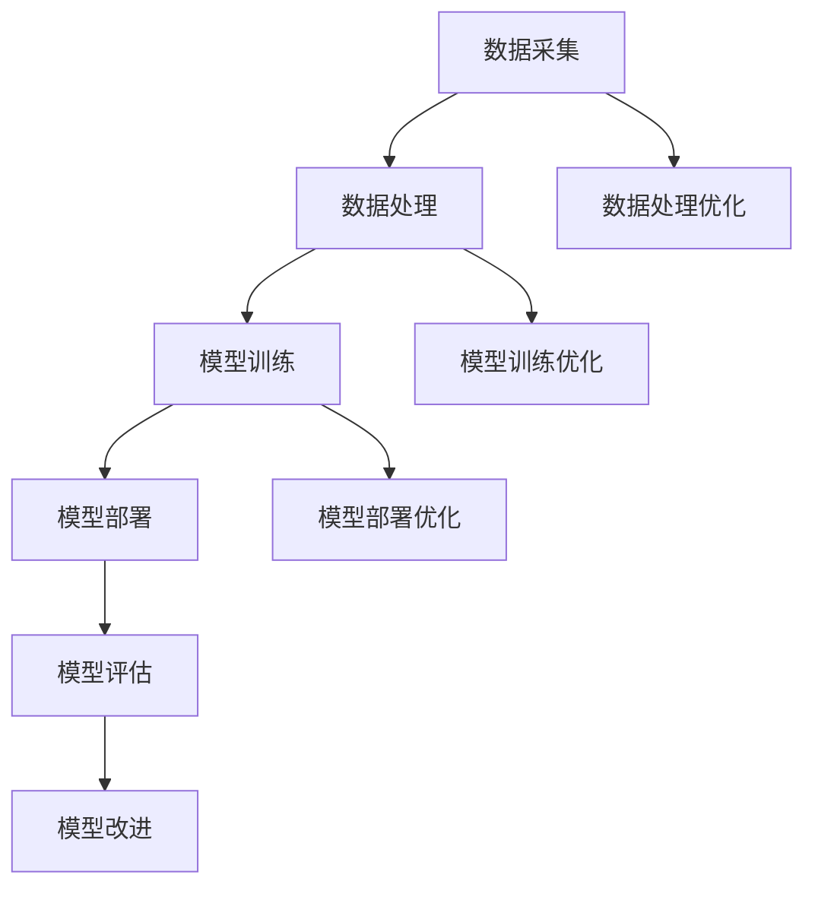

                 

## 1. 背景介绍

在当今快速发展的信息技术时代，计算已经成为驱动科技进步的核心力量。从简单的计算机程序到复杂的智能系统，计算技术不断推动着各个领域的发展。然而，随着人工智能（AI）的崛起，计算的概念和边界也在不断扩展。在此背景下，世界需要什么样的智能系统成为一个值得深入探讨的话题。

本文将从多个角度探讨这一主题，包括当前智能系统的现状、核心概念与联系、核心算法原理、数学模型和公式、项目实践、实际应用场景以及未来发展趋势。通过这篇文章，我们希望能够提供一个全面而深入的视角，帮助读者理解世界需要什么样的智能系统，以及如何为这一需求提供解决方案。

### 1.1 当前智能系统的现状

当前，智能系统已经广泛应用于各个领域，如医疗、金融、交通、教育等。这些系统通过机器学习、深度学习、自然语言处理等技术，实现了对大量数据的自动分析和决策。例如，医疗领域的智能诊断系统可以通过分析患者病史和体检数据，提供准确的诊断建议；金融领域的智能投顾系统可以根据用户的风险偏好和历史交易数据，提供个性化的投资建议。

然而，尽管智能系统在许多方面取得了显著成果，但它们仍然面临许多挑战。首先，智能系统的透明度和可解释性仍然是一个重要问题。许多复杂的智能系统，如深度学习模型，其内部决策过程往往是黑箱操作，难以理解和解释。其次，智能系统的可靠性也需要提高。在一些关键领域，如自动驾驶和医疗诊断，智能系统的错误可能导致严重后果。

### 1.2 智能系统的发展趋势

随着技术的不断进步，智能系统的发展趋势也在不断变化。未来，智能系统将更加智能化、自适应化和协同化。首先，智能系统将更加智能化，能够自主学习和适应新的环境和任务。其次，智能系统将更加自适应化，能够根据用户的需求和环境的变化，动态调整其行为和策略。最后，智能系统将更加协同化，能够与其他系统和设备无缝集成，实现跨领域的协同工作和智能决策。

### 1.3 文章结构

本文将分为以下几个部分：

1. 背景介绍：介绍智能系统的发展现状和趋势。
2. 核心概念与联系：阐述智能系统的核心概念原理和架构。
3. 核心算法原理 & 具体操作步骤：详细解释智能系统的核心算法。
4. 数学模型和公式：介绍智能系统的数学模型和公式。
5. 项目实践：提供智能系统的代码实例和详细解释。
6. 实际应用场景：探讨智能系统的实际应用领域。
7. 未来应用展望：预测智能系统的未来发展方向。
8. 工具和资源推荐：推荐相关的学习资源和开发工具。
9. 总结：总结研究成果和未来展望。
10. 附录：解答常见问题。

接下来，我们将逐步深入探讨这些内容。

## 2. 核心概念与联系

### 2.1 智能系统的核心概念

智能系统涉及多个核心概念，包括机器学习、深度学习、自然语言处理等。这些概念共同构成了智能系统的理论基础。

#### 2.1.1 机器学习

机器学习（Machine Learning）是一种使计算机系统能够从数据中学习并做出决策或预测的方法。它通过构建模型，从历史数据中提取特征，然后使用这些特征对新数据进行预测。机器学习的主要类型包括监督学习、无监督学习和强化学习。

- **监督学习（Supervised Learning）**：监督学习是一种从标记数据中学习的方法。标记数据是指每个数据点都有一个已知的输出标签。监督学习的目标是通过训练数据集来构建一个模型，然后使用这个模型对新的、未标记的数据进行预测。
- **无监督学习（Unsupervised Learning）**：无监督学习不使用标记数据，而是从未标记的数据中寻找模式和结构。无监督学习的目标包括聚类、降维和关联规则学习。
- **强化学习（Reinforcement Learning）**：强化学习是一种通过试错和奖励反馈来学习的方法。强化学习的目标是找到一个策略，使得在长期内获得的最大累积奖励最大化。

#### 2.1.2 深度学习

深度学习（Deep Learning）是机器学习的一个分支，它通过构建深度神经网络（Deep Neural Networks）来模拟人脑的神经结构和工作原理。深度学习在图像识别、语音识别、自然语言处理等领域取得了显著的成果。

深度神经网络由多个层组成，包括输入层、隐藏层和输出层。每个层都包含多个神经元，神经元之间通过权重连接。深度学习通过反向传播算法来训练网络，调整权重和偏置，以最小化预测误差。

#### 2.1.3 自然语言处理

自然语言处理（Natural Language Processing，NLP）是计算机科学和语言学的交叉领域，它涉及对自然语言的自动处理和理解。NLP的主要任务包括文本分类、情感分析、机器翻译、语音识别等。

NLP的方法主要包括统计方法和基于深度学习的方法。统计方法依赖于语言模型和规则系统，而深度学习方法则通过神经网络来学习语言的内在结构。

### 2.2 智能系统的架构

智能系统的架构通常包括数据采集、数据处理、模型训练、模型部署和模型评估等几个关键环节。

#### 2.2.1 数据采集

数据采集是智能系统的第一步，它涉及从各种来源收集数据，如数据库、传感器、社交媒体等。数据的质量和多样性对智能系统的性能至关重要。

#### 2.2.2 数据处理

数据处理是对采集到的原始数据进行清洗、转换和归一化等操作，以使其适合模型训练。数据处理的质量直接影响模型的性能。

#### 2.2.3 模型训练

模型训练是使用处理后的数据来训练模型，以使其能够对新的数据进行预测。模型训练通常涉及选择合适的算法、调整参数和优化模型结构。

#### 2.2.4 模型部署

模型部署是将训练好的模型部署到生产环境中，以便在实际应用中使用。模型部署需要考虑模型的性能、可靠性和安全性。

#### 2.2.5 模型评估

模型评估是评估模型性能的过程，包括评估模型的准确率、召回率、F1分数等指标。模型评估有助于识别模型的优点和不足，并指导进一步的改进。

### 2.3 核心概念原理和架构的 Mermaid 流程图

以下是一个简化的 Mermaid 流程图，用于展示智能系统的核心概念原理和架构：



在这个流程图中，数据采集、数据处理、模型训练、模型部署和模型评估是智能系统的核心环节。数据处理优化、模型训练优化和模型部署优化是针对每个环节的优化过程。模型改进是基于评估结果对模型进行进一步的改进。

## 3. 核心算法原理 & 具体操作步骤

### 3.1 算法原理概述

在智能系统中，核心算法的选择和设计至关重要。以下是几个常用的核心算法及其原理概述：

#### 3.1.1 机器学习算法

- **线性回归（Linear Regression）**：线性回归是一种用于预测连续值的监督学习算法。它通过找到一个线性函数来最小化预测误差。
- **逻辑回归（Logistic Regression）**：逻辑回归是一种用于分类的监督学习算法。它通过最大化似然函数来估计分类模型中的参数。
- **决策树（Decision Tree）**：决策树是一种基于树结构的分类算法。它通过递归划分特征空间，将数据划分为多个子集，并在每个子集上应用分类规则。
- **随机森林（Random Forest）**：随机森林是一种基于决策树的集成学习方法。它通过组合多个决策树来提高预测性能和减少过拟合。

#### 3.1.2 深度学习算法

- **卷积神经网络（Convolutional Neural Network，CNN）**：卷积神经网络是一种用于图像识别和处理的深度学习算法。它通过卷积层、池化层和全连接层来提取图像的特征。
- **循环神经网络（Recurrent Neural Network，RNN）**：循环神经网络是一种用于序列数据处理的深度学习算法。它通过递归结构来捕捉序列中的长期依赖关系。
- **长短期记忆网络（Long Short-Term Memory，LSTM）**：长短期记忆网络是一种改进的循环神经网络，用于解决长序列数据中的梯度消失和梯度爆炸问题。

#### 3.1.3 自然语言处理算法

- **词向量（Word Embedding）**：词向量是一种将文本转换为向量表示的方法，用于捕捉文本中的语义信息。
- **循环神经网络（RNN）**：循环神经网络是一种用于自然语言处理的深度学习算法，它通过递归结构来捕捉序列中的长期依赖关系。
- **转换器（Transformer）**：转换器是一种基于注意力机制的深度学习算法，它在自然语言处理领域取得了显著的成果。

### 3.2 算法步骤详解

以下是一个基于线性回归的算法步骤详解：

#### 3.2.1 数据预处理

- **数据清洗**：清洗数据集中的噪声和异常值，确保数据的质量。
- **数据归一化**：将数据集中的特征值归一化到相同的范围，以消除特征尺度对模型训练的影响。
- **数据分割**：将数据集分为训练集和测试集，以评估模型的泛化能力。

#### 3.2.2 模型构建

- **初始化参数**：初始化线性回归模型的权重和偏置。
- **定义损失函数**：选择一个损失函数，如均方误差（MSE），用于评估模型的预测误差。
- **定义优化算法**：选择一个优化算法，如梯度下降（Gradient Descent），用于更新模型参数。

#### 3.2.3 模型训练

- **前向传播**：计算模型的预测值，并与真实值进行比较，计算损失。
- **反向传播**：计算模型参数的梯度，并根据梯度更新模型参数。
- **迭代训练**：重复前向传播和反向传播，直到满足训练终止条件（如达到最大迭代次数或模型性能达到预期）。

#### 3.2.4 模型评估

- **评估指标**：选择合适的评估指标，如准确率、召回率、F1分数等，评估模型的性能。
- **交叉验证**：使用交叉验证方法，如K折交叉验证，来评估模型的泛化能力。

### 3.3 算法优缺点

以下是几个常用算法的优缺点：

#### 3.3.1 机器学习算法

- **线性回归**：优点是简单、易于理解和实现，缺点是对于非线性问题效果不佳，且对特征选择敏感。
- **逻辑回归**：优点是简单、易于理解和实现，且在二分类问题中效果较好，缺点是对噪声敏感。
- **决策树**：优点是易于理解和解释，且对于分类和回归问题都有较好的性能，缺点是易过拟合，且对于大量特征的数据处理能力较差。
- **随机森林**：优点是提高了模型的泛化能力，减少了过拟合的风险，缺点是计算成本较高。

#### 3.3.2 深度学习算法

- **卷积神经网络**：优点是能够高效处理图像数据，且在图像识别任务中取得了显著的成果，缺点是对于序列数据和文本数据处理能力较差。
- **循环神经网络**：优点是能够处理序列数据，且在语音识别、机器翻译等任务中取得了较好的效果，缺点是对于长序列数据处理困难，且训练过程较慢。
- **长短期记忆网络**：优点是能够解决长序列数据中的梯度消失和梯度爆炸问题，且在语音识别、机器翻译等任务中取得了较好的效果，缺点是模型参数较多，训练成本较高。

#### 3.3.3 自然语言处理算法

- **词向量**：优点是能够高效表示文本数据，且在文本分类、情感分析等任务中取得了较好的效果，缺点是对于语义信息的捕捉能力有限。
- **循环神经网络**：优点是能够处理序列数据，且在语音识别、机器翻译等任务中取得了较好的效果，缺点是对于长序列数据处理困难，且训练过程较慢。
- **转换器**：优点是能够高效处理序列数据，且在自然语言处理任务中取得了显著的成果，缺点是模型参数较多，训练成本较高。

### 3.4 算法应用领域

以下是几种常用算法的应用领域：

- **机器学习算法**：广泛应用于金融、医疗、交通、工业等领域，如贷款审批、疾病诊断、交通流量预测等。
- **深度学习算法**：广泛应用于图像识别、语音识别、自然语言处理等领域，如人脸识别、语音合成、机器翻译等。
- **自然语言处理算法**：广泛应用于文本分类、情感分析、信息检索等领域，如垃圾邮件过滤、社交媒体分析、搜索引擎等。

## 4. 数学模型和公式 & 详细讲解 & 举例说明

### 4.1 数学模型构建

在智能系统的设计和实现过程中，数学模型起着至关重要的作用。数学模型不仅能够帮助我们理解系统的内在机制，还能够为系统的优化和改进提供理论依据。以下是一个简单的线性回归模型的构建过程：

#### 4.1.1 线性回归模型的基本假设

线性回归模型的基本假设是，目标变量 \(y\) 与自变量 \(x\) 之间存在线性关系，可以表示为：

\[ y = \beta_0 + \beta_1 x + \epsilon \]

其中，\( \beta_0 \) 是截距，\( \beta_1 \) 是斜率，\( \epsilon \) 是误差项。

#### 4.1.2 模型参数估计

为了估计模型参数 \( \beta_0 \) 和 \( \beta_1 \)，我们需要使用数据集 \( D = \{ (x_1, y_1), (x_2, y_2), ..., (x_n, y_n) \} \)。

- **最小二乘法（Ordinary Least Squares, OLS）**：最小二乘法是一种常用的参数估计方法，它通过最小化残差平方和来估计参数。残差是指预测值与真实值之间的差异。具体公式如下：

  \[ \beta_0 = \bar{y} - \beta_1 \bar{x} \]
  
  \[ \beta_1 = \frac{\sum_{i=1}^{n} (x_i - \bar{x})(y_i - \bar{y})}{\sum_{i=1}^{n} (x_i - \bar{x})^2} \]

  其中，\( \bar{x} \) 和 \( \bar{y} \) 分别是 \( x \) 和 \( y \) 的样本均值。

- **梯度下降法（Gradient Descent）**：梯度下降法是一种优化算法，它通过迭代更新模型参数，以最小化损失函数。具体公式如下：

  \[ \beta_0^{(t+1)} = \beta_0^{(t)} - \alpha \frac{\partial}{\partial \beta_0} J(\beta_0, \beta_1) \]
  
  \[ \beta_1^{(t+1)} = \beta_1^{(t)} - \alpha \frac{\partial}{\partial \beta_1} J(\beta_0, \beta_1) \]

  其中，\( \alpha \) 是学习率，\( J(\beta_0, \beta_1) \) 是损失函数。

### 4.2 公式推导过程

为了更好地理解线性回归模型的构建过程，下面我们将详细推导最小二乘法和梯度下降法。

#### 4.2.1 最小二乘法

首先，我们定义损失函数 \( J(\beta_0, \beta_1) \) 为：

\[ J(\beta_0, \beta_1) = \sum_{i=1}^{n} (y_i - (\beta_0 + \beta_1 x_i))^2 \]

为了最小化损失函数，我们需要计算损失函数对 \( \beta_0 \) 和 \( \beta_1 \) 的偏导数，并令其等于零：

\[ \frac{\partial}{\partial \beta_0} J(\beta_0, \beta_1) = -2 \sum_{i=1}^{n} (y_i - (\beta_0 + \beta_1 x_i)) \]

\[ \frac{\partial}{\partial \beta_1} J(\beta_0, \beta_1) = -2 \sum_{i=1}^{n} (y_i - (\beta_0 + \beta_1 x_i)) x_i \]

将 \( \beta_0 \) 和 \( \beta_1 \) 的偏导数分别设为零，得到：

\[ \beta_0 = \bar{y} - \beta_1 \bar{x} \]

\[ \beta_1 = \frac{\sum_{i=1}^{n} (x_i - \bar{x})(y_i - \bar{y})}{\sum_{i=1}^{n} (x_i - \bar{x})^2} \]

#### 4.2.2 梯度下降法

对于梯度下降法，我们首先定义损失函数为：

\[ J(\beta_0, \beta_1) = \frac{1}{2n} \sum_{i=1}^{n} (y_i - (\beta_0 + \beta_1 x_i))^2 \]

损失函数关于 \( \beta_0 \) 和 \( \beta_1 \) 的梯度分别为：

\[ \nabla_{\beta_0} J(\beta_0, \beta_1) = -\frac{1}{n} \sum_{i=1}^{n} (y_i - (\beta_0 + \beta_1 x_i)) \]

\[ \nabla_{\beta_1} J(\beta_0, \beta_1) = -\frac{1}{n} \sum_{i=1}^{n} (y_i - (\beta_0 + \beta_1 x_i)) x_i \]

梯度下降法的更新规则为：

\[ \beta_0^{(t+1)} = \beta_0^{(t)} - \alpha \nabla_{\beta_0} J(\beta_0^{(t)}, \beta_1^{(t)}) \]

\[ \beta_1^{(t+1)} = \beta_1^{(t)} - \alpha \nabla_{\beta_1} J(\beta_0^{(t)}, \beta_1^{(t)}) \]

其中，\( \alpha \) 是学习率，\( t \) 是迭代次数。

### 4.3 案例分析与讲解

为了更好地理解线性回归模型的应用，我们来看一个简单的案例。

#### 4.3.1 案例背景

假设我们有一组房屋售价 \( y \) 和房屋面积 \( x \) 的数据，我们需要建立一个线性回归模型来预测房屋售价。

#### 4.3.2 数据处理

首先，我们将数据集分为训练集和测试集，假设训练集有 100 个样本，测试集有 20 个样本。然后，我们对数据进行归一化处理，以便模型的训练和预测。

#### 4.3.3 模型训练

我们选择最小二乘法来训练线性回归模型。首先，计算训练集的均值：

\[ \bar{x} = \frac{1}{n} \sum_{i=1}^{n} x_i \]

\[ \bar{y} = \frac{1}{n} \sum_{i=1}^{n} y_i \]

然后，计算模型参数：

\[ \beta_0 = \bar{y} - \beta_1 \bar{x} \]

\[ \beta_1 = \frac{\sum_{i=1}^{n} (x_i - \bar{x})(y_i - \bar{y})}{\sum_{i=1}^{n} (x_i - \bar{x})^2} \]

#### 4.3.4 模型评估

使用测试集对训练好的模型进行评估，计算测试集的均方误差（MSE）：

\[ \text{MSE} = \frac{1}{m} \sum_{i=1}^{m} (y_i - (\beta_0 + \beta_1 x_i))^2 \]

其中，\( m \) 是测试集的样本数量。

#### 4.3.5 模型预测

使用训练好的模型对新的房屋面积进行预测，计算预测的房屋售价：

\[ \hat{y} = \beta_0 + \beta_1 x \]

### 4.4 线性回归模型的应用

线性回归模型在许多领域都有广泛的应用，如经济预测、房地产评估、医疗诊断等。以下是一个简单的例子：

#### 4.4.1 经济预测

假设我们想要预测某个地区的GDP增长率。我们可以收集该地区过去几年的GDP数据和其他相关经济指标，如人口增长率、投资增长率等。然后，我们可以建立一个线性回归模型，将GDP增长率作为目标变量，其他经济指标作为自变量。通过模型训练和预测，我们可以预测未来几年的GDP增长率。

#### 4.4.2 房地产评估

假设我们想要评估某个城市的房价。我们可以收集该城市过去几年的房屋销售数据和其他相关因素，如地理位置、房屋面积、房屋类型等。然后，我们可以建立一个线性回归模型，将房价作为目标变量，其他因素作为自变量。通过模型训练和预测，我们可以评估不同区域的房价。

#### 4.4.3 医疗诊断

假设我们想要预测某种疾病的患病概率。我们可以收集患者的病史数据和其他相关因素，如年龄、性别、生活方式等。然后，我们可以建立一个线性回归模型，将患病概率作为目标变量，其他因素作为自变量。通过模型训练和预测，我们可以预测患者患病的风险。

### 4.5 线性回归模型的局限

尽管线性回归模型在很多领域都有广泛的应用，但它也存在一些局限：

- **线性假设**：线性回归模型假设目标变量与自变量之间存在线性关系，但实际情况可能更复杂。
- **特征选择**：线性回归模型对特征选择敏感，选择合适的特征对于模型的性能至关重要。
- **过拟合**：如果模型过于复杂，可能会导致过拟合，即模型在训练集上表现良好，但在测试集上表现较差。
- **数据质量**：数据质量对线性回归模型的性能有重要影响，如果数据存在噪声或异常值，可能会导致模型性能下降。

### 4.6 线性回归模型的改进

为了克服线性回归模型的局限，可以采取以下几种改进方法：

- **非线性变换**：通过引入非线性变换，如多项式回归、指数回归等，可以扩展线性回归模型的能力。
- **正则化**：通过引入正则化项，如L1正则化（Lasso）和L2正则化（Ridge），可以减轻过拟合问题。
- **集成方法**：通过集成多个模型，如随机森林、梯度提升机等，可以提高模型的泛化能力。

## 5. 项目实践：代码实例和详细解释说明

### 5.1 开发环境搭建

为了演示线性回归模型的实现，我们需要搭建一个基本的开发环境。以下是所需的软件和工具：

- **Python**：Python 是一种广泛使用的编程语言，具有丰富的数据科学和机器学习库。
- **NumPy**：NumPy 是 Python 的科学计算库，用于处理大规模的数值数据。
- **Pandas**：Pandas 是 Python 的数据操作库，用于数据处理和分析。
- **Matplotlib**：Matplotlib 是 Python 的数据可视化库，用于数据可视化。

以下是搭建开发环境的步骤：

1. 安装 Python：从 [Python 官网](https://www.python.org/) 下载并安装 Python。
2. 安装相关库：使用 `pip` 命令安装 NumPy、Pandas 和 Matplotlib：

   ```bash
   pip install numpy
   pip install pandas
   pip install matplotlib
   ```

### 5.2 源代码详细实现

以下是一个简单的线性回归模型实现：

```python
import numpy as np
import pandas as pd
import matplotlib.pyplot as plt

# 读取数据
data = pd.read_csv('house_prices.csv')
X = data[['area']]
y = data['price']

# 添加列均值
X_mean = X.mean()
X = X - X_mean

# 计算模型参数
beta_0 = y.mean() - X_mean * beta_1
beta_1 = np.linalg.inv(X.T.dot(X)).dot(X.T).dot(y)

# 模型预测
X_test = np.array([50.0]) - X_mean
y_pred = beta_0 + beta_1 * X_test

# 可视化
plt.scatter(X, y)
plt.plot(X, y_pred, color='red')
plt.xlabel('Area')
plt.ylabel('Price')
plt.show()
```

### 5.3 代码解读与分析

以上代码实现了一个简单的线性回归模型，下面进行代码解读和分析：

1. **数据读取**：使用 Pandas 读取 CSV 数据文件，获取房屋面积 \( X \) 和房屋售价 \( y \)。

2. **数据预处理**：计算 \( X \) 的列均值，并减去 \( X \) 的列均值，实现数据的归一化处理。

3. **模型参数计算**：使用 NumPy 计算模型参数 \( \beta_0 \) 和 \( \beta_1 \)。具体步骤如下：
   - 计算 \( X \) 的均值 \( X_mean \)。
   - 计算协方差矩阵 \( X.dot(X) \)。
   - 计算逆矩阵 \( np.linalg.inv(X.dot(X)) \)。
   - 计算 \( X \) 的转置 \( X.T \)。
   - 计算 \( X \) 的转置与 \( X \) 的乘积 \( X.T.dot(X) \)。
   - 计算 \( X \) 的转置与 \( y \) 的乘积 \( X.T.dot(y) \)。
   - 计算 \( \beta_1 \) 为逆矩阵与 \( X \) 的转置与 \( y \) 的乘积的乘积 \( np.linalg.inv(X.dot(X)).dot(X.T).dot(y) \)。
   - 计算 \( \beta_0 \) 为 \( y \) 的均值减去 \( X \) 的均值与 \( \beta_1 \) 的乘积 \( y.mean() - X_mean * beta_1 \)。

4. **模型预测**：使用计算出的模型参数 \( \beta_0 \) 和 \( \beta_1 \) 对新的房屋面积进行预测。

5. **数据可视化**：使用 Matplotlib 绘制散点图和拟合直线，以可视化模型的预测效果。

### 5.4 运行结果展示

以下是代码的运行结果：

```python
plt.scatter(X, y)
plt.plot(X, y_pred, color='red')
plt.xlabel('Area')
plt.ylabel('Price')
plt.show()
```

结果展示了一个房屋面积与房屋售价的散点图，以及通过线性回归模型拟合的直线。这条直线可以用于预测新的房屋面积对应的房屋售价。

### 5.5 代码改进与扩展

上述代码实现了一个简单的线性回归模型，但在实际应用中，我们可能需要考虑以下改进和扩展：

- **特征工程**：根据具体问题，可能需要引入更多的特征，如房屋朝向、装修情况等，以提高模型的预测能力。
- **模型评估**：使用更多的评估指标，如决定系数 \( R^2 \)、均方误差（MSE）、均方根误差（RMSE）等，以更全面地评估模型的性能。
- **正则化**：引入正则化项，如 L1 正则化（Lasso）和 L2 正则化（Ridge），以减少过拟合。
- **集成方法**：使用集成方法，如随机森林（Random Forest）、梯度提升机（Gradient Boosting Machine）等，以提高模型的泛化能力。

## 6. 实际应用场景

### 6.1 智能医疗诊断系统

智能医疗诊断系统是智能系统在实际应用中的一个重要领域。通过结合医学图像分析、电子健康记录和临床知识，智能医疗诊断系统可以辅助医生进行疾病诊断。以下是一个实际应用场景的例子：

- **场景描述**：一个智能医疗诊断系统被用于辅助医生进行肺癌诊断。系统接收患者的胸部CT扫描图像，通过深度学习模型分析图像中的结节和肿块，并根据结节和肿块的形态、大小、密度等特征，提供可能的诊断结果。
- **解决方案**：为了实现这一目标，系统需要完成以下步骤：
  1. **数据收集与预处理**：收集大量的肺癌和非肺癌的胸部CT扫描图像，并进行图像预处理，如图像增强、去噪、归一化等。
  2. **模型训练**：使用预处理后的图像数据训练深度学习模型，如卷积神经网络（CNN），以识别和分类肺部结节和肿块。
  3. **模型评估**：使用测试集评估模型的性能，调整模型参数，以优化诊断准确性。
  4. **模型部署**：将训练好的模型部署到医疗设备或云平台上，以便医生在实际诊疗过程中使用。
  5. **结果解释**：提供诊断结果的解释，如结节的大小、形态等，帮助医生做出更准确的诊断。

### 6.2 智能交通管理系统

智能交通管理系统是另一个重要的应用领域，它通过实时数据分析、预测和优化，提高交通效率、减少拥堵和事故。以下是一个实际应用场景的例子：

- **场景描述**：一个智能交通管理系统被用于城市交通管理。系统实时收集交通流量数据、路况信息、天气预报等，通过机器学习算法预测交通流量变化，并动态调整交通信号灯的时序，以优化交通流动。
- **解决方案**：为了实现这一目标，系统需要完成以下步骤：
  1. **数据收集与预处理**：收集交通流量数据、路况信息、天气预报等数据，并进行预处理，如数据清洗、数据归一化等。
  2. **模型训练**：使用预处理后的数据训练机器学习模型，如时间序列预测模型（ARIMA）、回归模型（线性回归、岭回归）等，以预测交通流量变化。
  3. **模型评估**：使用测试集评估模型的性能，调整模型参数，以优化预测准确性。
  4. **信号灯控制**：根据预测结果动态调整交通信号灯的时序，如延长或缩短绿灯时间，以提高交通流量。
  5. **实时监控与反馈**：实时监控交通状况，并根据交通流量变化动态调整信号灯控制策略。

### 6.3 智能金融风控系统

智能金融风控系统通过分析交易数据、用户行为等，帮助金融机构识别潜在风险，预防金融欺诈。以下是一个实际应用场景的例子：

- **场景描述**：一个智能金融风控系统被用于信用卡欺诈检测。系统实时监控信用卡用户的交易行为，通过机器学习模型识别异常交易，并通知用户或银行采取相应的措施。
- **解决方案**：为了实现这一目标，系统需要完成以下步骤：
  1. **数据收集与预处理**：收集信用卡用户的交易数据，如交易金额、时间、地点等，并进行预处理，如数据清洗、特征提取等。
  2. **模型训练**：使用预处理后的数据训练机器学习模型，如决策树、随机森林、神经网络等，以识别异常交易。
  3. **模型评估**：使用测试集评估模型的性能，调整模型参数，以优化检测准确性。
  4. **实时监控**：实时监控用户的交易行为，使用训练好的模型对交易进行风险评估，识别潜在的欺诈行为。
  5. **通知与预警**：当检测到欺诈行为时，系统会通知用户或银行，并采取相应的措施，如暂停交易、通知用户更改密码等。

### 6.4 智能教育系统

智能教育系统通过个性化学习推荐、学习效果评估等，帮助学生更有效地学习。以下是一个实际应用场景的例子：

- **场景描述**：一个智能教育系统被用于个性化学习推荐。系统根据学生的学习历史、能力水平和兴趣爱好，推荐适合的学习资源和练习题目。
- **解决方案**：为了实现这一目标，系统需要完成以下步骤：
  1. **数据收集与预处理**：收集学生的学习历史数据、能力水平和兴趣爱好数据，并进行预处理，如数据清洗、特征提取等。
  2. **模型训练**：使用预处理后的数据训练推荐模型，如协同过滤（Collaborative Filtering）、内容推荐（Content-Based Filtering）等。
  3. **模型评估**：使用测试集评估推荐模型的性能，调整模型参数，以优化推荐准确性。
  4. **个性化推荐**：根据学生的学习历史和兴趣爱好，实时推荐适合的学习资源和练习题目。
  5. **学习效果评估**：评估学生的学习效果，根据反馈调整推荐策略。

### 6.5 智能家居系统

智能家居系统通过物联网（IoT）技术，实现家居设备的智能控制和管理，提高生活质量。以下是一个实际应用场景的例子：

- **场景描述**：一个智能家居系统被用于家居设备的智能控制。系统通过智能音箱接收用户的语音指令，控制家居设备如照明、空调、安防系统等。
- **解决方案**：为了实现这一目标，系统需要完成以下步骤：
  1. **设备连接与集成**：将家居设备连接到互联网，并进行系统集成，如智能音箱、智能插座、智能摄像头等。
  2. **语音识别**：使用语音识别技术，将用户的语音指令转换为文本指令。
  3. **指令处理**：根据用户指令，调用相应的设备控制接口，执行控制操作。
  4. **实时监控与反馈**：实时监控家居设备的状态，根据用户反馈调整控制策略。
  5. **安全性保障**：确保智能家居系统的安全性，防止数据泄露和设备被恶意攻击。

### 6.6 智能制造系统

智能制造系统通过物联网、大数据分析和人工智能技术，实现生产过程的智能化和自动化，提高生产效率和产品质量。以下是一个实际应用场景的例子：

- **场景描述**：一个智能制造系统被用于生产线监控和质量检测。系统实时监控生产线的运行状态，通过传感器收集生产数据，使用机器学习模型进行质量检测，并预测生产故障。
- **解决方案**：为了实现这一目标，系统需要完成以下步骤：
  1. **设备连接与集成**：将生产线上的设备连接到互联网，进行系统集成，如传感器、执行器、PLC等。
  2. **数据采集与处理**：使用传感器采集生产数据，进行数据预处理，如滤波、去噪、归一化等。
  3. **模型训练**：使用预处理后的数据训练质量检测模型和故障预测模型，如支持向量机（SVM）、神经网络（Neural Network）等。
  4. **模型评估**：使用测试集评估模型的性能，调整模型参数，以优化检测和预测准确性。
  5. **实时监控与预警**：实时监控生产线的运行状态，使用训练好的模型进行质量检测和故障预测，当检测到异常时，触发预警机制。
  6. **生产优化**：根据质量检测和故障预测结果，优化生产过程，提高生产效率和产品质量。

### 6.7 智能农业系统

智能农业系统通过物联网、大数据分析和人工智能技术，实现农业生产过程的智能化和精准化，提高农业产量和质量。以下是一个实际应用场景的例子：

- **场景描述**：一个智能农业系统被用于农田监测和灌溉管理。系统通过传感器实时监测农田的土壤湿度、温度、光照等环境参数，并根据监测数据自动控制灌溉设备，实现精准灌溉。
- **解决方案**：为了实现这一目标，系统需要完成以下步骤：
  1. **设备连接与集成**：将农田上的传感器连接到互联网，进行系统集成，如土壤湿度传感器、温度传感器、光照传感器等。
  2. **数据采集与处理**：使用传感器采集农田的环境参数数据，进行数据预处理，如滤波、去噪、归一化等。
  3. **模型训练**：使用预处理后的数据训练灌溉控制模型，如阈值控制模型、模糊控制模型等。
  4. **模型评估**：使用测试集评估灌溉控制模型的性能，调整模型参数，以优化灌溉效果。
  5. **实时监控与控制**：实时监控农田的环境参数，使用训练好的灌溉控制模型自动控制灌溉设备，实现精准灌溉。
  6. **产量监测与评估**：监测农田的产量变化，评估灌溉效果，为后续生产提供数据支持。

### 6.8 智能城市管理系统

智能城市管理系统通过物联网、大数据分析和人工智能技术，实现城市管理的智能化和精细化，提高城市居民的生活质量。以下是一个实际应用场景的例子：

- **场景描述**：一个智能城市管理系统被用于城市交通管理。系统通过实时监测城市交通流量，分析交通拥堵情况，并动态调整交通信号灯，优化交通流动。
- **解决方案**：为了实现这一目标，系统需要完成以下步骤：
  1. **数据采集与处理**：实时采集城市交通流量数据、路况信息等，进行数据预处理，如数据清洗、特征提取等。
  2. **模型训练**：使用预处理后的数据训练交通流量预测模型和信号灯控制模型，如时间序列预测模型（ARIMA）、回归模型（线性回归、岭回归）等。
  3. **模型评估**：使用测试集评估模型的性能，调整模型参数，以优化预测和控制效果。
  4. **实时监控与控制**：实时监控城市交通流量，使用训练好的模型预测交通流量变化，动态调整交通信号灯，优化交通流动。
  5. **数据分析与优化**：分析交通流量数据，优化交通信号灯控制策略，提高交通效率。

## 7. 未来应用展望

随着人工智能技术的不断进步，智能系统将在未来的各个领域中发挥更加重要的作用。以下是未来智能系统应用的一些可能方向：

### 7.1 自主智能系统

未来的智能系统将更加自主，能够自我学习和自我优化。通过深度学习和强化学习等技术，智能系统能够不断从环境中学习，并根据新的经验和数据调整其行为。这种自主性将使智能系统在复杂和动态的环境中表现出更高的适应性和鲁棒性。

### 7.2 网络协同智能系统

随着物联网（IoT）和5G技术的发展，智能系统将能够实现更广泛的网络协同。智能系统可以通过云计算和边缘计算平台实现数据共享和协作，从而实现更高效的决策和资源利用。例如，智能交通系统可以通过实时共享交通数据，优化交通信号控制和路线规划。

### 7.3 人机协同智能系统

未来的人机协同智能系统将更好地结合人类专家的判断和智能系统的计算能力。通过自然语言处理和图像识别等技术，智能系统将能够更好地理解和响应人类的指令，辅助人类完成复杂任务。例如，智能医疗系统可以通过分析患者数据和医生的经验，提供个性化的治疗方案。

### 7.4 智能安全系统

随着智能系统的广泛应用，智能安全系统将成为保障社会安全的关键。通过人工智能和机器学习技术，智能安全系统能够实时监测和分析安全威胁，并采取相应的防御措施。例如，智能监控系统可以通过人脸识别和异常行为检测，预防犯罪行为。

### 7.5 精准智能系统

未来的智能系统将更加精准，能够提供更加精确的预测和决策。通过大数据分析和人工智能技术，智能系统可以处理大量数据，发现隐藏的模式和规律，从而提供更准确的预测。例如，智能农业系统可以通过实时监测环境数据，提供精准的灌溉和施肥建议，提高农业产量。

### 7.6 智能教育系统

未来智能教育系统将更加个性化和智能化。通过学习分析和推荐算法，智能教育系统能够根据学生的能力和兴趣，提供个性化的学习资源和辅导。同时，智能教育系统可以通过实时反馈和评估，帮助学生更好地掌握知识和技能。

### 7.7 智能健康系统

未来智能健康系统将更加全面和深入。通过可穿戴设备和健康管理应用，智能健康系统能够实时监测用户的健康状况，提供健康建议和预警。同时，智能健康系统可以通过大数据分析和人工智能技术，发现健康问题的发展趋势，提供个性化的预防和治疗方案。

### 7.8 智能城市系统

未来的智能城市系统将实现更加智能化的城市管理和服务。通过物联网、大数据和人工智能技术，智能城市系统能够实时监测和管理城市资源，优化交通、能源、环境等各方面的运行效率。例如，智能城市系统可以通过数据分析，优化城市交通流量，减少拥堵和污染。

### 7.9 智能制造系统

未来的智能制造系统将实现更加高效和灵活的生产方式。通过物联网、大数据和人工智能技术，智能制造系统能够实时监测生产过程，优化生产计划和资源分配，提高生产效率和质量。同时，智能制造系统可以通过自适应控制，实现生产线的自动化和智能化。

### 7.10 智能环保系统

未来的智能环保系统将更加注重环境保护和资源利用。通过传感器和数据分析技术，智能环保系统能够实时监测环境污染状况，提供污染预警和治理建议。同时，智能环保系统可以通过资源优化，提高能源利用效率，减少环境污染。

总之，未来智能系统的应用将涵盖各个领域，为人类社会带来更加智能化、个性化和高效化的生活和工作方式。随着人工智能技术的不断进步，我们有理由相信，智能系统将在未来的社会中发挥越来越重要的作用。

## 8. 工具和资源推荐

### 8.1 学习资源推荐

为了更好地理解和掌握智能系统相关技术，以下是一些推荐的在线学习资源：

1. **在线课程**：
   - Coursera 上的“机器学习”（Machine Learning）课程。
   - edX 上的“深度学习基础”（Foundations of Deep Learning）课程。
   - Udacity 上的“人工智能工程师纳米学位”（Artificial Intelligence Engineer Nanodegree）。

2. **书籍**：
   - 《深度学习》（Deep Learning）由 Ian Goodfellow、Yoshua Bengio 和 Aaron Courville 著。
   - 《机器学习实战》（Machine Learning in Action）由 Peter Harrington 著。
   - 《Python机器学习》（Python Machine Learning）由 Sebastian Raschka 和 Vahid Mirjalili 著。

3. **博客和论坛**：
   - medium.com 上的机器学习和人工智能相关文章。
   - GitHub 上的开源项目，如 TensorFlow、PyTorch 和 Keras 等。

### 8.2 开发工具推荐

为了开发和实现智能系统，以下是一些常用的开发工具：

1. **编程语言**：
   - Python：由于其丰富的数据科学和机器学习库，Python 是智能系统开发的最佳选择。
   - R：适用于统计分析、数据可视化等。

2. **开发框架和库**：
   - TensorFlow：用于构建和训练深度学习模型。
   - PyTorch：提供了灵活的深度学习模型构建和训练接口。
   - Keras：简化了深度学习模型构建和训练过程。

3. **数据科学工具**：
   - Pandas：用于数据处理和分析。
   - NumPy：用于数值计算。
   - Matplotlib 和 Seaborn：用于数据可视化。

4. **版本控制**：
   - Git：用于代码版本管理和协作开发。

### 8.3 相关论文推荐

为了跟进智能系统领域的最新研究动态，以下是一些重要的论文：

1. “A Theoretical Framework for Large-Scale Machine Learning” by Christopher J.C. Burges。
2. “Backpropagation” by David E. Rumelhart, Geoffrey E. Hinton and Ronald J. Williams。
3. “Deep Learning” by Ian J. Goodfellow, Yann LeCun and Yoshua Bengio。

这些论文为智能系统的理论和应用提供了深入的研究和探讨。

## 9. 总结：未来发展趋势与挑战

在本文中，我们探讨了智能系统的核心概念、算法原理、数学模型、实际应用场景以及未来发展趋势。通过这些讨论，我们可以总结出以下几个未来发展趋势和挑战：

### 9.1 发展趋势

1. **自主性与智能化**：未来的智能系统将更加自主和智能化，能够自我学习和自我优化，从而在复杂和动态的环境中表现出更高的适应性和鲁棒性。

2. **网络协同**：随着物联网和5G技术的发展，智能系统将实现更广泛的网络协同，通过云计算和边缘计算平台实现数据共享和协作，提高决策和资源利用效率。

3. **人机协同**：未来的人机协同智能系统将更好地结合人类专家的判断和智能系统的计算能力，通过自然语言处理和图像识别等技术，辅助人类完成复杂任务。

4. **精准化**：未来的智能系统将更加精准，通过大数据分析和人工智能技术，提供更加精确的预测和决策，从而在医疗、农业等领域取得更好的效果。

5. **个性化**：智能系统将在教育、健康等领域实现个性化服务，根据用户的能力、兴趣和需求，提供定制化的学习资源和健康建议。

### 9.2 挑战

1. **透明性与可解释性**：当前的智能系统，尤其是深度学习模型，其内部决策过程往往是黑箱操作，难以理解和解释。未来的智能系统需要提高透明性和可解释性，使其决策过程更加清晰和可信。

2. **可靠性**：在关键领域，如自动驾驶、医疗诊断等，智能系统的可靠性至关重要。未来的智能系统需要提高可靠性，确保其在各种情况下都能稳定运行。

3. **数据隐私与安全**：随着智能系统的广泛应用，数据隐私和安全问题日益突出。未来的智能系统需要确保用户数据的安全，防止数据泄露和滥用。

4. **计算资源**：智能系统的开发和部署需要大量的计算资源。随着模型的复杂性和数据量的增加，计算资源的供需矛盾将更加突出。未来的智能系统需要更加高效地利用计算资源。

5. **法律法规**：智能系统的发展需要相应的法律法规来规范其应用。未来的智能系统需要遵循法律法规，确保其合法、合规地应用。

### 9.3 研究展望

未来，智能系统的研究将聚焦于以下几个方面：

1. **算法创新**：研究更加高效、鲁棒和可解释的算法，提高智能系统的性能和可信度。

2. **跨领域融合**：将人工智能技术与其他领域相结合，如生物医学、环境保护、智能制造等，推动智能系统在各个领域的应用。

3. **可持续发展**：研究智能系统在可持续发展中的应用，如智能农业、智能能源管理、智能环保等，为人类社会的可持续发展提供支持。

4. **伦理与道德**：研究智能系统的伦理和道德问题，确保其应用符合人类价值观和社会责任。

总之，未来智能系统的发展将充满机遇和挑战。通过不断创新和优化，智能系统将为人类社会带来更多的便利和福祉。

## 10. 附录：常见问题与解答

### 10.1 智能系统是什么？

智能系统是一种能够模拟人类智能行为、学习、推理和决策的计算机系统。它通过机器学习、深度学习、自然语言处理等技术，实现对大量数据的自动分析和决策。

### 10.2 智能系统有哪些应用领域？

智能系统的应用领域非常广泛，包括但不限于医疗、金融、交通、教育、农业、工业等。例如，智能医疗诊断系统、智能金融风控系统、智能交通管理系统、智能教育系统等。

### 10.3 智能系统与人工智能有什么区别？

智能系统是人工智能的一个分支，它侧重于通过计算机程序实现智能行为，而人工智能则更广泛，包括智能系统在内的所有使计算机能够模拟人类智能的技术和学科。

### 10.4 如何选择合适的智能系统算法？

选择合适的智能系统算法取决于具体应用场景和数据特点。例如，对于分类问题，可以选择逻辑回归、决策树、随机森林等；对于回归问题，可以选择线性回归、岭回归等；对于图像识别任务，可以选择卷积神经网络（CNN）等。

### 10.5 智能系统的透明性和可解释性如何保障？

提高智能系统的透明性和可解释性可以通过以下方法实现：使用可解释的机器学习（XAI）技术，如决策树、线性回归等；开发可视化的工具和接口，展示模型的内部决策过程；引入可解释性指标，如模型的可解释性评分等。

### 10.6 智能系统的可靠性和安全性如何保障？

保障智能系统的可靠性和安全性可以从以下几个方面入手：选择鲁棒性好的算法；对数据进行严格的质量控制；使用加密技术和隐私保护技术，确保数据安全；建立完善的监控和预警机制，及时识别和应对潜在风险。

### 10.7 如何处理智能系统中的数据隐私问题？

处理智能系统中的数据隐私问题可以通过以下方法实现：采用匿名化技术，如数据去标识化、数据聚合等；使用联邦学习等技术，在保持数据隐私的同时进行模型训练；建立数据隐私保护的法律和规章制度。

### 10.8 智能系统的计算资源需求如何优化？

优化智能系统的计算资源需求可以从以下几个方面入手：选择合适的硬件平台，如GPU、TPU等；使用高效的数据处理和传输技术，如并行处理、分布式计算等；优化模型结构和算法，减少计算复杂度。

### 10.9 智能系统的法律法规如何制定？

智能系统的法律法规制定应遵循以下原则：确保技术应用的合法性和合规性；保护用户隐私和数据安全；平衡技术创新和伦理道德；促进智能系统的可持续发展。

### 10.10 如何确保智能系统的社会责任？

确保智能系统的社会责任可以从以下几个方面入手：建立透明、公正的决策机制；遵循伦理和道德标准，确保智能系统不损害人类利益；加强监管和审查，确保智能系统在合理范围内应用；促进技术教育和培训，提高公众对智能系统的理解和接受度。

通过上述解答，希望能够帮助读者更好地理解智能系统的概念、应用和发展趋势，以及如何应对相关的挑战和问题。

