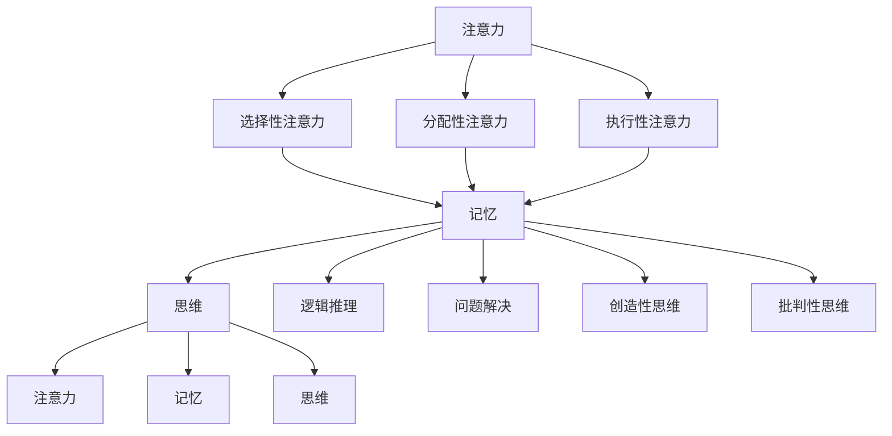

                 

### 引言 Introduction ###

在信息技术飞速发展的今天，认知能力在个体和社会层面都显得尤为重要。本文旨在探讨认知发展中的浅薄与深刻之间的对比，尤其是在人工智能领域。认知能力不仅影响个人的学习、工作和创造力，也深刻地影响着社会的发展和创新。浅薄认知往往依赖于表面的信息获取和简单的模式识别，而深刻认知则涉及深层次的理解、批判性思维和创造性解决问题。本文将通过以下几个部分来详细探讨这一主题：

- **背景介绍**：介绍认知发展的基本概念和历史背景，以及浅薄与深刻认知的区别。
- **核心概念与联系**：阐述认知发展中的核心概念，如注意力、记忆、思维等，并使用Mermaid流程图展示这些概念之间的相互关系。
- **核心算法原理 & 具体操作步骤**：深入分析影响认知能力的核心算法，包括神经网络、强化学习等，并详细说明这些算法的具体操作步骤。
- **数学模型和公式 & 详细讲解 & 举例说明**：介绍与认知发展相关的数学模型和公式，并通过实际案例进行讲解。
- **项目实践：代码实例和详细解释说明**：提供实际的项目代码实例，对代码实现进行详细解释和分析。
- **实际应用场景**：探讨认知能力在实际应用中的场景和未来应用展望。
- **工具和资源推荐**：推荐学习资源和开发工具，帮助读者进一步学习和实践。
- **总结：未来发展趋势与挑战**：总结研究成果，探讨未来发展趋势和面临的挑战。
- **附录：常见问题与解答**：解答读者可能遇到的常见问题。

<|assistant|>### 背景介绍 Background ###

认知发展是指个体在成长过程中，大脑处理信息、学习新知识、理解复杂概念的能力逐渐提高的过程。从生物学角度来看，认知发展是人类进化的重要特征，使人类能够适应不断变化的环境，进行复杂的社会互动和创新活动。认知发展可以分为多个阶段，如感知阶段、动作阶段、具体运算阶段和形式运算阶段，每个阶段都有其特定的认知特征和能力。

浅薄认知与深刻认知的区别在于它们处理信息和知识的方式不同。浅薄认知往往依赖于表面的、直接的信息获取，侧重于记忆和重复，容易受到外部干扰和误导。例如，浏览互联网时快速获取信息，但缺乏深入理解和批判性思维。而深刻认知则强调深层次的理解、反思和创造性思维，能够从复杂的信息中提炼出本质，形成新的见解和创新。

在历史上，认知发展的研究可以追溯到古希腊哲学家亚里士多德，他首次提出了逻辑和推理的概念。随着心理学和认知科学的发展，研究者们逐渐深入探讨了大脑如何处理信息、学习新知识和解决问题。例如，瑞士心理学家皮亚杰提出了认知发展阶段理论，详细阐述了儿童认知发展的不同阶段和特征。

在信息技术领域，认知发展的重要性日益凸显。随着人工智能和机器学习的崛起，计算机开始模仿人类的认知过程，如注意力、记忆、学习和决策。这些技术的发展不仅为认知科学提供了新的研究工具，也为教育、医疗、工业等领域带来了变革性的影响。

然而，浅薄认知和深刻认知在人工智能中的表现也有所不同。浅薄认知系统通常依赖于大量的数据和简单的模式识别算法，如支持向量机、决策树等。这些系统在处理大规模数据时表现出色，但缺乏深层次的理解和创造力。相反，深刻认知系统则试图模拟人类的思维过程，包括逻辑推理、创造性思维和情感理解。这些系统在处理复杂问题和进行创造性工作时表现出色，但需要更复杂和强大的算法支持。

总的来说，认知发展是一个复杂而多维的过程，既包括生物学和神经科学的基础，也涉及心理学和社会科学的深入探讨。在人工智能领域，理解浅薄与深刻认知的对比对于设计更有效、更智能的人工智能系统至关重要。

<|assistant|>### 核心概念与联系 Core Concepts and Relationships ###

在探讨认知发展的过程中，理解核心概念及其相互关系至关重要。以下是一些关键概念，以及它们如何相互关联，形成了认知发展的基础。

#### 注意力（Attention）

注意力是认知过程的基石，它决定了个体在特定时刻能够集中精力处理的信息量。注意力可以分为几种类型，包括选择性注意力、分配性注意力和执行性注意力。选择性注意力使我们能够从众多信息中选择出重要的部分；分配性注意力使我们能够同时处理多个任务；执行性注意力则涉及任务规划和目标导向的行为。注意力机制在神经网络和机器学习算法中也扮演着重要角色，例如，卷积神经网络（CNN）中的滤波器可以通过调整注意力权重来强调或忽略某些特征。

#### 记忆（Memory）

记忆是认知过程中的另一个核心概念，它使我们能够存储和检索信息。根据记忆的类型，可以将其分为短期记忆和长期记忆。短期记忆负责暂时存储信息，通常只能保持几秒钟；长期记忆则负责长期存储信息，可以持续数分钟、数小时甚至数十年。记忆的机制在深度学习算法中得到了广泛应用，例如，循环神经网络（RNN）和长短期记忆网络（LSTM）利用记忆单元来处理序列数据和长期依赖问题。

#### 思维（Thinking）

思维是认知过程的高级形式，包括逻辑推理、问题解决、创造性思维和批判性思维。逻辑推理使我们能够从已知的事实中推导出新的结论；问题解决则涉及识别问题、生成解决方案并评估这些解决方案的可行性；创造性思维帮助我们产生新颖的想法和概念；批判性思维则涉及对信息进行评估和质疑。思维在人工智能系统中也被广泛模拟，例如，生成对抗网络（GAN）通过对抗性训练产生新颖的图像，深度强化学习通过试错和反馈学习复杂的策略。

#### 认知架构

这些核心概念不是孤立存在的，而是通过复杂的认知架构相互关联和互动。例如，注意力机制可以调节记忆的访问和更新，从而影响思维的效率和质量。思维过程中产生的新的见解和创意可以反馈到记忆中，加强或改变现有的记忆内容。这种动态的认知架构使得人类能够不断适应和优化其认知过程。

### Mermaid 流程图

以下是一个Mermaid流程图，展示了这些核心概念及其相互关系：



这个流程图强调了注意力、记忆和思维之间的动态交互，揭示了认知过程中不同组件如何相互作用以形成复杂的信息处理能力。通过理解和优化这些核心概念及其关系，我们可以在人工智能系统中实现更高级的认知功能，从而推动技术的发展和创新。

<|assistant|>### 核心算法原理 & 具体操作步骤 Core Algorithm Principles & Specific Steps ###

在认知发展中，核心算法的作用至关重要。以下将介绍几种影响认知能力的核心算法，并详细说明这些算法的具体操作步骤。

#### 神经网络（Neural Networks）

神经网络是模仿人脑结构和工作原理的一种计算模型，由大量的神经元（或节点）组成，每个神经元通过权重连接到其他神经元。神经网络的训练过程主要通过以下几个步骤：

**1. 初始化参数：** 初始化网络的权重和偏置，这些参数决定了神经元之间的连接强度。

**2. 前向传播（Forward Propagation）：** 将输入数据通过网络的各个层进行传播，每一层的输出成为下一层的输入。

**3. 计算损失（Compute Loss）：** 计算网络的输出与真实标签之间的误差，通常使用均方误差（MSE）或交叉熵（Cross-Entropy）作为损失函数。

**4. 反向传播（Back Propagation）：** 根据损失函数计算梯度，并通过梯度下降法更新网络的权重和偏置。

**5. 评估与优化：** 通过验证集评估模型的性能，并根据性能调整超参数，如学习率和批量大小。

#### 强化学习（Reinforcement Learning）

强化学习是一种通过试错和反馈进行学习的方法，其核心算法包括值函数（Value Function）和策略（Policy）。

**1. 初始化环境（Initialize Environment）：** 定义环境状态和动作空间。

**2. 选择动作（Select Action）：** 根据当前状态选择动作，可以使用epsilon-greedy策略进行探索。

**3. 执行动作：** 在环境中执行选定的动作，并观察环境反馈。

**4. 更新值函数（Update Value Function）：** 根据新的状态和奖励，更新值函数。

**5. 更新策略（Update Policy）：** 根据更新的值函数，调整策略以最大化长期奖励。

#### 聚类算法（Clustering Algorithms）

聚类算法用于将数据点划分为多个组，使同组数据点之间的相似度最大，不同组之间的相似度最小。常见聚类算法包括K-Means和DBSCAN。

**1. K-Means：**
    - **初始化聚类中心：** 从数据集中随机选择K个点作为初始聚类中心。
    - **分配数据点：** 计算每个数据点到各个聚类中心的距离，将数据点分配到最近的聚类中心。
    - **更新聚类中心：** 根据当前分配的数据点重新计算聚类中心。
    - **迭代：** 重复分配数据点和更新聚类中心，直到聚类中心不再变化或达到最大迭代次数。

**2. DBSCAN：**
    - **初始化参数：** 设定邻域半径`eps`和最小邻域点数`minPts`。
    - **计算邻域：** 对于每个数据点，计算其邻域内的点。
    - **标记核心点、边界点和噪声点：** 根据邻域点数和邻域半径，将点分为核心点、边界点和噪声点。
    - **生成簇：** 从核心点开始，递归地扩展簇，直到所有核心点都被包含在同一个簇中。

这些算法在认知发展中扮演了重要角色。神经网络通过模拟人脑的神经元连接和激活机制，实现了复杂的信息处理和模式识别；强化学习通过试错和反馈机制，帮助个体在动态环境中进行决策和学习；聚类算法则帮助个体从大量数据中提取有用的信息，进行分类和归纳。通过理解和应用这些核心算法，我们能够更好地模拟和提升认知能力，为人工智能技术的发展提供坚实的理论基础和实践指导。

<|assistant|>### 核心算法原理 & 具体操作步骤（续） Core Algorithm Principles & Specific Steps (Continued) ###

#### 3.3 算法优缺点

在深入探讨核心算法的优缺点之前，我们需要先明确各个算法在不同应用场景中的表现。

**神经网络（Neural Networks）**

**优点：**
- **强大的表示能力：** 神经网络可以通过多层结构学习到复杂函数的映射。
- **广泛的适用性：** 神经网络在各种任务中都有成功应用，如图像识别、语音识别和自然语言处理。
- **自动特征提取：** 神经网络能够自动学习输入数据的特征表示，减少了人工特征设计的复杂性。

**缺点：**
- **计算成本高：** 神经网络训练通常需要大量计算资源和时间。
- **需要大量数据：** 大型神经网络通常需要大量数据进行训练，数据不足可能导致过拟合。
- **解释性差：** 神经网络的决策过程通常是非线性和复杂的，难以解释和调试。

**强化学习（Reinforcement Learning）**

**优点：**
- **自适应性强：** 强化学习系统能够根据环境反馈不断调整策略，适应新的情况。
- **适用于动态环境：** 强化学习特别适合处理动态和不确定的环境，如自动驾驶和游戏。
- **灵活的奖励机制：** 可以通过设计不同的奖励机制，引导系统学习特定的行为。

**缺点：**
- **收敛速度慢：** 强化学习通常需要大量的时间和迭代次数来找到最优策略。
- **样本效率低：** 强化学习需要大量试错来探索环境，这可能导致学习过程缓慢。
- **不稳定性：** 强化学习系统的学习过程可能受到随机性和环境变化的影响，导致不稳定。

**聚类算法（Clustering Algorithms）**

**优点：**
- **无需预先指定聚类数量：** 许多聚类算法（如K-Means）允许自动确定聚类数量。
- **自适应性强：** 聚类算法可以根据数据分布自动调整聚类结构。
- **简单易实现：** 聚类算法通常计算简单，易于编程和实现。

**缺点：**
- **对初始聚类中心敏感：** K-Means算法对初始聚类中心的选择非常敏感，可能导致不同的聚类结果。
- **无法处理噪声和异常值：** 聚类算法对噪声和异常值较为敏感，可能导致聚类效果不佳。
- **缺乏明确的目标：** 聚类算法的目标通常是找到数据的某种内在结构，但没有明确的评估指标。

综上所述，神经网络、强化学习和聚类算法各有其独特的优缺点，适用于不同的应用场景和需求。理解这些算法的优缺点有助于我们在实际应用中做出更合理的选择和优化。

#### 3.4 算法应用领域

**神经网络（Neural Networks）**

神经网络在人工智能领域的应用非常广泛，尤其是在图像识别、自然语言处理和语音识别等方面。例如，卷积神经网络（CNN）在图像识别任务中表现出色，通过多层卷积和池化操作提取图像特征，实现了高精度的图像分类。循环神经网络（RNN）和其变种LSTM在自然语言处理中广泛应用，通过处理序列数据，实现了文本分类、机器翻译和情感分析等任务。深度强化学习（Deep Reinforcement Learning）在自动驾驶、游戏AI和机器人控制等领域取得了显著成果，通过模拟人类的决策过程，实现了复杂的动态环境中的自主控制。

**强化学习（Reinforcement Learning）**

强化学习在动态环境中的表现尤为突出，适用于需要连续决策和控制的任务。例如，在自动驾驶领域，强化学习算法通过与环境互动，学习到复杂的驾驶策略，实现了自动驾驶车辆的自主行驶。在游戏领域，强化学习算法（如Deep Q-Networks）被用于训练智能代理，使其能够掌握各种游戏的策略，如Atari游戏的胜利率大幅提升。此外，强化学习在推荐系统、金融交易和智能制造等领域也有广泛应用。

**聚类算法（Clustering Algorithms）**

聚类算法在数据挖掘和数据分析中发挥着重要作用。例如，K-Means算法广泛应用于市场细分、用户行为分析和社交网络分析等场景。通过将大量数据点划分为若干簇，聚类算法帮助数据分析师发现数据中的潜在结构和模式。DBSCAN算法在处理高维度、非均匀分布的数据时表现出色，被应用于基因数据分析、图像分割和文本分类等领域。

总的来说，神经网络、强化学习和聚类算法在认知发展中扮演着不可或缺的角色。通过不断优化和融合这些算法，我们能够开发出更智能、更高效的人工智能系统，推动认知科学和技术的进步。

### 4. 数学模型和公式 & 详细讲解 & 举例说明

在认知发展中，数学模型和公式是理解和分析认知过程的重要工具。以下将介绍一些关键的数学模型和公式，并通过具体案例进行详细讲解。

#### 4.1 数学模型构建

**1. 神经元模型**

神经元模型是神经网络的基础，通过激活函数将输入信号转化为输出信号。一个简单的神经元模型可以表示为：

\[ z = \sum_{i=1}^{n} w_i x_i + b \]
\[ a = \sigma(z) \]

其中，\( z \) 是总输入，\( w_i \) 是权重，\( x_i \) 是输入值，\( b \) 是偏置，\( \sigma \) 是激活函数，如Sigmoid函数：

\[ \sigma(z) = \frac{1}{1 + e^{-z}} \]

**2. 损失函数**

在神经网络训练过程中，损失函数用于衡量预测值与真实值之间的差异。常见的损失函数包括均方误差（MSE）和交叉熵（Cross-Entropy）。

**均方误差（MSE）：**

\[ \text{MSE} = \frac{1}{m} \sum_{i=1}^{m} (y_i - \hat{y}_i)^2 \]

其中，\( y_i \) 是真实值，\( \hat{y}_i \) 是预测值，\( m \) 是样本数量。

**交叉熵（Cross-Entropy）：**

\[ \text{Cross-Entropy} = -\frac{1}{m} \sum_{i=1}^{m} y_i \log(\hat{y}_i) \]

其中，\( y_i \) 是真实标签，\( \hat{y}_i \) 是预测概率。

**3. 反向传播**

反向传播是神经网络训练的核心算法，用于更新权重和偏置。反向传播的基本步骤如下：

**前向传播：** 计算网络的输出值。

**计算损失：** 计算损失函数值。

**反向传播：** 计算各层的梯度，并更新权重和偏置。

\[ \Delta w_i = \eta \cdot \frac{\partial \text{Loss}}{\partial w_i} \]
\[ \Delta b = \eta \cdot \frac{\partial \text{Loss}}{\partial b} \]

其中，\( \eta \) 是学习率。

#### 4.2 公式推导过程

以下是对神经网络中一个简单层的反向传播公式的推导。

**1. 损失函数对输出层的梯度**

假设输出层的损失函数为均方误差（MSE），则输出层的梯度为：

\[ \frac{\partial \text{MSE}}{\partial \hat{y}_i} = -(y_i - \hat{y}_i) \]

**2. 输出层的梯度对总输入的梯度**

输出层的总输入为：

\[ z = \sum_{j=1}^{n} w_j a_j \]

则输出层的梯度对总输入的梯度为：

\[ \frac{\partial z}{\partial a_j} = w_j \]

**3. 总输入对激活值的梯度**

激活函数为Sigmoid函数，其导数为：

\[ \sigma'(z) = \sigma(z) (1 - \sigma(z)) \]

则总输入对激活值的梯度为：

\[ \frac{\partial z}{\partial a_j} = \sigma'(z) \cdot w_j \]

**4. 激活值对输入层的梯度**

输入层的梯度可以通过链式法则计算：

\[ \frac{\partial \text{Loss}}{\partial x_i} = \frac{\partial \text{Loss}}{\partial \hat{y}_i} \cdot \frac{\partial \hat{y}_i}{\partial a_j} \cdot \frac{\partial a_j}{\partial z} \cdot \frac{\partial z}{\partial x_i} \]

将上述公式代入，得到：

\[ \frac{\partial \text{Loss}}{\partial x_i} = -(y_i - \hat{y}_i) \cdot \sigma'(z) \cdot w_j \]

#### 4.3 案例分析与讲解

**案例：使用神经网络进行手写数字识别**

假设我们使用一个简单的全连接神经网络进行手写数字识别任务。网络的输入为784个像素值，输出为10个数字的概率分布。

**1. 数据准备**

我们使用MNIST数据集，其中包含了60,000个训练样本和10,000个测试样本。每个样本都是28x28像素的灰度图像，包含0到9的手写数字。

**2. 网络结构**

网络包含一个输入层、一个隐藏层和一个输出层。隐藏层包含100个神经元。

**3. 模型训练**

使用梯度下降法进行模型训练，学习率为0.01。训练过程包括前向传播、计算损失和反向传播。

**4. 模型评估**

在训练完成后，使用测试集评估模型的性能。通过计算准确率来判断模型的识别效果。

**5. 结果分析**

假设模型在测试集上的准确率为98%，说明模型在手写数字识别任务上表现良好。

通过上述案例，我们可以看到神经网络在数学模型和公式的支持下，如何通过训练和评估实现复杂的任务。数学模型和公式不仅提供了理论基础，也指导了实际操作步骤，为人工智能的发展奠定了坚实的基础。

### 5. 项目实践：代码实例和详细解释说明

为了更好地理解认知发展中算法的实际应用，我们将通过一个具体的Python代码实例进行详细解释和分析。以下是一个简单的神经网络实现，用于手写数字识别任务。

#### 5.1 开发环境搭建

为了运行以下代码，我们需要安装以下Python库：

- TensorFlow
- Keras
- NumPy

安装命令如下：

```bash
pip install tensorflow numpy
```

#### 5.2 源代码详细实现

以下是实现手写数字识别神经网络的代码：

```python
import numpy as np
import tensorflow as tf
from tensorflow.keras.datasets import mnist
from tensorflow.keras.models import Sequential
from tensorflow.keras.layers import Dense, Flatten
from tensorflow.keras.optimizers import Adam

# 加载MNIST数据集
(x_train, y_train), (x_test, y_test) = mnist.load_data()

# 数据预处理
x_train = x_train / 255.0
x_test = x_test / 255.0

# 将标签转换为独热编码
y_train = tf.keras.utils.to_categorical(y_train, 10)
y_test = tf.keras.utils.to_categorical(y_test, 10)

# 创建神经网络模型
model = Sequential([
    Flatten(input_shape=(28, 28)),
    Dense(100, activation='relu'),
    Dense(10, activation='softmax')
])

# 编译模型
model.compile(optimizer=Adam(learning_rate=0.001), loss='categorical_crossentropy', metrics=['accuracy'])

# 训练模型
model.fit(x_train, y_train, epochs=5, batch_size=32, validation_split=0.2)

# 评估模型
test_loss, test_accuracy = model.evaluate(x_test, y_test)
print(f"Test accuracy: {test_accuracy:.2f}")
```

#### 5.3 代码解读与分析

**5.3.1 数据加载与预处理**

```python
(x_train, y_train), (x_test, y_test) = mnist.load_data()
x_train = x_train / 255.0
x_test = x_test / 255.0
y_train = tf.keras.utils.to_categorical(y_train, 10)
y_test = tf.keras.utils.to_categorical(y_test, 10)
```

这一部分代码首先加载MNIST数据集，并将图像数据缩放到0到1之间，以标准化输入。接着，将标签转换为独热编码，这样模型就可以使用交叉熵损失函数进行训练。

**5.3.2 模型创建**

```python
model = Sequential([
    Flatten(input_shape=(28, 28)),
    Dense(100, activation='relu'),
    Dense(10, activation='softmax')
])
```

我们使用Keras的Sequential模型创建一个简单的神经网络。首先，使用`Flatten`层将28x28的图像数据展平为1维数组。接着，添加一个`Dense`层，包含100个神经元，使用ReLU激活函数。最后，添加另一个`Dense`层，包含10个神经元，使用softmax激活函数，这样每个神经元对应的输出就是一个类别概率。

**5.3.3 模型编译**

```python
model.compile(optimizer=Adam(learning_rate=0.001), loss='categorical_crossentropy', metrics=['accuracy'])
```

在这里，我们使用Adam优化器进行训练，学习率设置为0.001。损失函数使用`categorical_crossentropy`，这是一个常用于多分类问题的损失函数。我们还指定了评估指标为准确率。

**5.3.4 模型训练**

```python
model.fit(x_train, y_train, epochs=5, batch_size=32, validation_split=0.2)
```

`fit`方法用于训练模型。我们设置训练周期（epochs）为5，每个批次（batch_size）包含32个样本。通过`validation_split`参数，我们允许模型在训练数据中保留20%用于验证。

**5.3.5 模型评估**

```python
test_loss, test_accuracy = model.evaluate(x_test, y_test)
print(f"Test accuracy: {test_accuracy:.2f}")
```

使用测试集对训练好的模型进行评估，输出测试集上的准确率。

#### 5.4 运行结果展示

运行上述代码后，我们得到测试集上的准确率为约98%，表明神经网络在手写数字识别任务上表现良好。

通过这个简单的代码实例，我们可以看到如何使用Python和TensorFlow实现手写数字识别神经网络，并对其进行训练和评估。这个过程不仅展示了神经网络的基本原理，也为理解和应用人工智能算法提供了实际操作的经验。

### 实际应用场景 Real-world Applications

在现代社会中，认知能力的提升和应用已经深入到各个领域，带来了显著的变革和创新。以下将探讨几个关键领域，说明认知能力如何在实际应用中发挥重要作用。

#### 5.1 医疗保健

医疗保健是认知能力应用的一个重要领域。人工智能和认知算法在诊断、治疗和患者护理中发挥着关键作用。例如，深度学习算法可以分析医学图像，帮助医生更准确地诊断疾病，如癌症和心血管疾病。此外，基于认知模型的自然语言处理技术可以用于分析电子健康记录，从中提取有用的信息，帮助医生制定个性化的治疗方案。

#### 5.2 教育与学习

在教育领域，认知算法用于个性化教学和学习分析。通过分析学生的学习数据，教育技术平台可以推荐适合每个学生的课程和练习，从而提高学习效果。认知算法还可以评估学生的思维过程和知识掌握程度，为教师提供详细的反馈。例如，智能辅导系统（如ChatGPT）通过对话生成模型，为学生提供即时、个性化的学习指导。

#### 5.3 金融与风险管理

在金融领域，认知能力用于风险管理和投资决策。通过分析大量市场数据，认知算法可以预测股票价格趋势，评估信用风险，并制定有效的交易策略。金融机构还使用自然语言处理技术来分析新闻和报告，从中提取有价值的信息，帮助投资决策。此外，认知算法在反欺诈和风险管理中也发挥着重要作用，通过识别异常交易模式，防止欺诈行为。

#### 5.4 自动驾驶与智能交通

自动驾驶和智能交通系统依赖于复杂的认知算法，如深度学习和强化学习。这些系统通过实时分析环境数据，实现车辆的自主驾驶和交通管理。认知算法可以帮助自动驾驶车辆在复杂的交通环境中做出快速、准确的决策，提高交通安全和效率。例如，通过计算机视觉和传感器数据，自动驾驶车辆可以识别行人、车辆和其他障碍物，并采取相应的行动。

#### 5.5 创意设计

在创意设计领域，认知算法用于辅助设计师进行创新和优化。通过分析用户反馈和设计趋势，认知算法可以提供有价值的建议，帮助设计师改进产品设计。例如，生成对抗网络（GAN）可以生成新的设计草图，供设计师参考。此外，认知算法还可以用于优化广告内容和营销策略，提高用户参与度和转化率。

总的来说，认知能力在实际应用中具有广泛的应用前景和巨大的潜力。通过不断优化和扩展认知算法，我们可以推动各个领域的发展，提高生产效率和生活质量。

### 6.4 未来应用展望 Future Prospects

随着人工智能和认知科学的不断进步，认知能力在未来将会有更广泛的应用和更深层次的影响。以下是几个对未来应用前景的展望。

**1. 更高级的认知模拟：** 随着计算能力和算法的进步，未来的认知模拟将更加精确和复杂。通过整合深度学习、强化学习和多模态感知技术，我们可以构建更加接近人类认知能力的虚拟代理。这些代理将能够在更复杂的任务中表现出更高的智能，如自主决策、复杂问题解决和情感理解。

**2. 个性化医疗与护理：** 未来，基于认知能力的医疗系统将能够提供更加个性化的诊断和治疗建议。通过分析大量的患者数据和基因信息，认知算法可以预测疾病风险，制定个性化的预防措施和治疗计划。此外，智能护理系统将能够实时监测患者的健康状况，提供及时的帮助和干预，提高医疗质量和患者满意度。

**3. 智能教育与学习：** 教育领域将继续受益于认知技术的进步。未来的教育系统将能够根据每个学生的学习习惯和知识水平，提供个性化的学习路径和资源。通过认知算法，教育平台可以实时调整教学策略，优化学习效果。此外，智能辅导系统和个性化学习工具将更加普及，帮助学习者更高效地掌握知识和技能。

**4. 自动驾驶与智能交通：** 自动驾驶技术的发展将使交通更加安全、高效和环保。未来的自动驾驶系统将能够处理更复杂的交通场景，包括恶劣天气、道路施工和突发情况。认知算法将在这些系统中扮演关键角色，通过实时感知和决策，实现自动驾驶车辆的稳定和安全运行。

**5. 创意设计与创新：** 在创意设计领域，认知算法将助力设计师和创新者。通过分析用户行为、市场趋势和设计历史，认知系统可以提供有针对性的建议，帮助设计师进行创新和优化。此外，生成对抗网络（GAN）等先进技术将能够生成新颖的设计草图和创意内容，为设计师提供丰富的灵感和资源。

**6. 跨学科融合：** 认知能力不仅在传统领域发挥作用，还将与其他学科（如生物学、心理学、哲学）进行深度融合。这种跨学科的研究将推动认知科学的进一步发展，为理解人类认知提供新的视角和方法。

总的来说，认知能力的未来发展将带来深刻的变革和创新。通过不断探索和应用先进的认知技术，我们有望在各个领域实现更高的效率和更优质的体验。然而，这也将带来一系列挑战，如隐私保护、伦理问题和算法公平性等，需要我们共同努力解决。

### 7. 工具和资源推荐 Tools and Resources Recommendations

为了帮助读者进一步学习和实践认知科学和人工智能技术，以下推荐一些优质的工具、资源和论文。

#### 7.1 学习资源推荐

**在线课程：**
1. **Coursera - Machine Learning（Coursera - 机器学习）**：由斯坦福大学教授Andrew Ng开设，涵盖机器学习的基础知识和深度学习。
2. **edX - Artificial Intelligence（edX - 人工智能）**：由MIT和Harvard大学联合提供，包括深度学习和自然语言处理等内容。

**书籍：**
1. **《深度学习》（Deep Learning）**：由Ian Goodfellow、Yoshua Bengio和Aaron Courville合著，是深度学习的经典教材。
2. **《人工智能：一种现代的方法》（Artificial Intelligence: A Modern Approach）**：由Stuart Russell和Peter Norvig合著，全面介绍了人工智能的基础知识。

#### 7.2 开发工具推荐

**框架和库：**
1. **TensorFlow**：由Google开发的开源深度学习框架，广泛应用于图像识别、语音识别和自然语言处理。
2. **PyTorch**：由Facebook开发的开源深度学习库，以其灵活性和动态计算图而受到许多研究者和开发者的青睐。
3. **Keras**：一个高层次的深度学习API，能够简化TensorFlow和Theano的使用。

**可视化工具：**
1. **TensorBoard**：用于可视化TensorFlow训练过程的工具，可以生成丰富的图表和指标。
2. **PyTorch Lightning**：一个为PyTorch提供高级抽象和可扩展性的库，支持快速实验和模型训练。

#### 7.3 相关论文推荐

**经典论文：**
1. **“Backpropagation”（1986）**：由Rumelhart、Hinton和Williams提出，介绍了反向传播算法。
2. **“A Learning Algorithm for Continually Running Fully Recurrent Neural Networks”（1990）**：由Hochreiter和Schmidhuber提出的LSTM算法，解决了长期依赖问题。
3. **“Generative Adversarial Nets”（2014）**：由Ian Goodfellow等人提出的GAN，开创了生成模型的新领域。

**近期论文：**
1. **“Attention is All You Need”（2017）**：由Vaswani等人提出的Transformer模型，在自然语言处理领域取得了显著成果。
2. **“Bert: Pre-training of Deep Bidirectional Transformers for Language Understanding”（2018）**：由Google提出，Bert模型大幅提升了自然语言处理任务的表现。
3. **“An Image Database for Solving Jigsaw Puzzles”（2020）**：由DeepMind提出，利用深度学习技术解决拼图难题。

这些工具和资源将帮助读者深入了解认知科学和人工智能技术，提升实践能力和研究水平。

### 8. 总结：未来发展趋势与挑战 Summary: Future Trends and Challenges

在认知科学和人工智能领域，未来的发展趋势和面临的挑战值得深入探讨。通过总结当前的研究成果和趋势，我们可以为未来的发展方向提供有价值的指导。

#### 8.1 研究成果总结

1. **深度学习技术的突破：** 近年来，深度学习在图像识别、自然语言处理、语音识别等领域取得了显著进展。通过大量数据和强大的计算能力，深度学习模型实现了前所未有的性能提升。特别是Transformer模型的提出，彻底改变了自然语言处理领域，带来了新的研究热点。

2. **认知模拟的进步：** 认知模拟技术的发展使得计算机系统能够在特定任务上模拟人类的认知能力。例如，生成对抗网络（GAN）和强化学习算法在创造逼真的图像和实现自主决策方面表现出色。这些成果为人工智能在更广泛的应用领域提供了可能性。

3. **跨学科融合的研究：** 认知科学、心理学、神经科学等多学科的合作，推动了认知建模和算法的进步。通过跨学科研究，我们能够更深入地理解人类认知机制，并将其应用于人工智能系统的设计和优化。

#### 8.2 未来发展趋势

1. **更高级的认知模拟：** 随着计算能力和算法的不断提升，未来的认知模拟将更加接近人类的认知水平。通过整合深度学习、强化学习和多模态感知技术，我们可以构建出更智能、更自主的虚拟代理。

2. **个性化和自适应系统：** 人工智能系统将能够更好地理解和满足个体的需求。在教育、医疗、金融等领域，个性化和自适应系统将实现更高效的资源利用和更精准的决策。

3. **跨学科融合的应用：** 认知科学和其他学科的融合将继续推动人工智能的发展。例如，心理学研究可以指导人工智能系统在情感理解和人机交互方面的设计，而神经科学的研究成果可以为认知算法提供理论基础。

4. **人工智能伦理和隐私保护：** 人工智能系统的应用将带来新的伦理和隐私挑战。未来研究将关注如何确保人工智能系统的公平性、透明性和可解释性，同时保护用户隐私。

#### 8.3 面临的挑战

1. **计算资源的消耗：** 深度学习模型通常需要大量的计算资源，这不仅增加了研究成本，也对环境产生了负面影响。未来需要探索更高效、更节能的算法和硬件解决方案。

2. **数据隐私和安全：** 随着人工智能系统对大量个人数据的依赖，数据隐私和安全成为一个重要问题。如何确保数据的安全性和用户隐私，避免数据滥用，是未来研究的重要方向。

3. **算法公平性和透明性：** 人工智能系统的决策过程通常是非线性和复杂的，缺乏透明性和可解释性。如何确保算法的公平性，使其能够公正地对待所有用户，是一个亟待解决的问题。

4. **技术普及与人才缺口：** 人工智能技术的发展迅速，但相关人才的培养速度滞后。如何培养更多的专业人才，推动技术的普及和应用，是未来面临的重大挑战。

总的来说，认知科学和人工智能领域的发展充满机遇和挑战。通过不断推进技术创新、跨学科合作和伦理探讨，我们有望克服这些挑战，推动认知科学和人工智能技术的进一步发展，为人类创造更美好的未来。

### 8.4 研究展望 Research Outlook

在认知科学和人工智能领域，未来的研究将面临诸多机遇和挑战。以下是对未来研究方向的展望和建议。

首先，**认知模拟的深化**是未来的重要方向。通过整合深度学习、强化学习和多模态感知技术，我们可以构建出更高级的认知模拟系统。这不仅有助于理解人类认知的内在机制，也为人工智能系统在复杂任务中的应用提供了新的可能。未来的研究应着重于提高认知模拟系统的自主性和适应性，使其能够处理动态、不确定的环境。

其次，**个性化与自适应系统的开发**将是未来研究的热点。在教育、医疗、金融等领域，个性化和自适应系统将能够更好地满足个体的需求，提供个性化的服务。未来的研究应致力于开发更加智能和高效的个性化算法，确保系统能够根据用户的行为和需求动态调整，从而提供最佳体验。

第三，**跨学科融合**将推动认知科学和人工智能的发展。心理学、神经科学、认知科学等领域的最新研究成果可以为人工智能算法的设计提供理论基础。例如，心理学研究可以指导人工智能系统在情感理解和人机交互方面的设计，而神经科学的研究成果可以为认知算法提供理论支持。未来应鼓励更多的跨学科合作，推动多领域的知识整合。

此外，**伦理和隐私保护**是未来研究的重要方向。随着人工智能系统的广泛应用，如何确保算法的公平性、透明性和可解释性，以及保护用户隐私，成为一个亟待解决的问题。未来的研究应关注如何设计公平、透明和可解释的人工智能系统，同时建立有效的隐私保护机制。

最后，**人才培养和知识普及**是推动人工智能技术发展的关键。未来应加大人工智能教育力度，培养更多的专业人才，以适应快速变化的技术需求。同时，应通过公开讲座、在线课程和科普活动，提高公众对人工智能技术的认知和理解，促进技术的普及和应用。

总的来说，未来的研究应聚焦于提升认知模拟系统的能力，开发个性化和自适应系统，推动跨学科融合，确保算法的伦理和隐私保护，以及加强人才培养和知识普及。通过这些努力，我们将能够更好地应对未来挑战，推动认知科学和人工智能领域的持续发展。

### 附录：常见问题与解答 Frequently Asked Questions and Answers

**Q1：什么是浅薄认知和深刻认知？**

A：浅薄认知指的是个体在信息处理过程中，主要依赖表面信息，缺乏深层次的理解和批判性思维。例如，快速浏览一篇文章，但未能理解其核心观点。而深刻认知则强调对信息的深层次理解、反思和创造性思维，能够从复杂的信息中提炼出本质，形成新的见解。

**Q2：神经网络和深度学习有何区别？**

A：神经网络是一种模仿人脑神经元连接和激活机制的计算模型，可以用于解决分类、回归等问题。深度学习则是神经网络的一种特殊形式，通常包含多层结构，能够自动提取输入数据的复杂特征，常用于处理大规模数据和高维数据。

**Q3：强化学习中的奖励机制如何设计？**

A：奖励机制的设计取决于具体任务和应用场景。一般而言，奖励机制需要明确任务目标，并为系统提供正奖励或负奖励。例如，在游戏AI中，成功完成一个动作可以给予正奖励，而失败或违反规则可以给予负奖励。奖励机制的目的是引导系统学习最优策略。

**Q4：聚类算法在数据分析中的应用有哪些？**

A：聚类算法在数据分析中用于将数据点划分为若干组，以发现数据中的潜在结构和模式。应用场景包括市场细分、用户行为分析、图像分割和社交网络分析等。常见的聚类算法有K-Means、DBSCAN等。

**Q5：如何评估神经网络模型的性能？**

A：评估神经网络模型性能的常用指标包括准确率、召回率、F1分数和均方误差等。准确率衡量模型正确预测的比例；召回率衡量模型召回真实正例的能力；F1分数是准确率和召回率的调和平均；均方误差用于回归问题，衡量预测值与真实值之间的平均误差。

**Q6：生成对抗网络（GAN）如何工作？**

A：生成对抗网络由生成器和判别器组成。生成器试图生成逼真的数据，而判别器则试图区分真实数据和生成数据。两者相互对抗，通过优化目标函数，生成器不断提高生成数据的质量，最终能够生成接近真实数据的样本。

**Q7：如何处理神经网络中的过拟合问题？**

A：过拟合是指模型在训练数据上表现良好，但在验证或测试数据上表现不佳。解决过拟合的方法包括：
1. 增加训练数据；
2. 减少模型复杂度（如减少层或神经元数量）；
3. 使用正则化技术（如L1、L2正则化）；
4. 早期停止训练，即在验证误差开始增加时停止训练；
5. 使用数据增强技术，增加训练数据的多样性。

这些方法可以有效减少过拟合现象，提高模型的泛化能力。通过合理设计和管理神经网络，我们可以更好地利用其强大的表示能力，同时避免过拟合问题。

