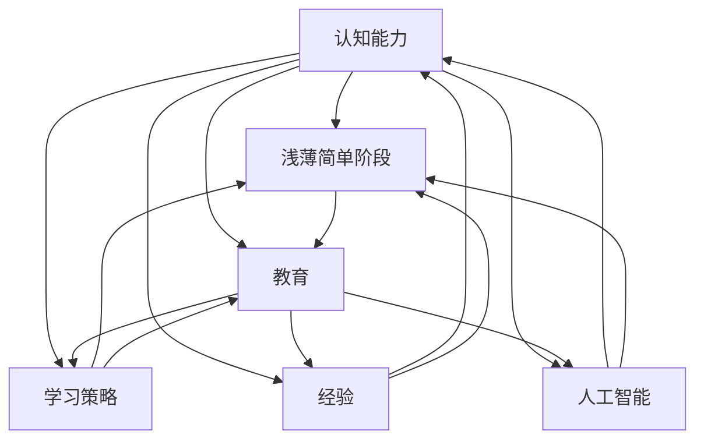

                 

### 背景介绍

认知发展是指个体在成长过程中，对信息获取、处理和利用的能力逐渐成熟的过程。在认知发展的过程中，个体会经历多个阶段，每个阶段都有其独特的特征和挑战。本文将重点关注认知发展中的浅薄简单阶段。

浅薄简单阶段是认知发展的早期阶段，这个阶段的主要特点是认知能力的局限性和对复杂信息的处理能力较弱。在这个阶段，个体的思维方式主要是直观的、具体的，对于复杂抽象的概念难以理解和运用。这种局限性使得个体在学习和解决问题时往往采用简单直接的策略，而无法深入挖掘问题的本质。

浅薄简单阶段的认知发展受到多种因素的影响，包括个体的年龄、经验、教育背景等。例如，年龄较小的儿童往往处于浅薄简单阶段，因为他们的认知能力尚未完全发展。此外，缺乏相关经验和知识也会限制个体在这个阶段的认知能力。因此，教育在这个过程中起到了关键作用，通过适当的教育和引导，可以帮助个体逐步克服浅薄简单阶段的局限性，提高认知能力。

研究认知发展中的浅薄简单阶段具有重要意义。首先，这有助于我们理解个体在学习和成长过程中的限制和挑战，从而为教育提供有针对性的指导。其次，这也有助于我们了解人类认知能力的潜力，为开发更高效的学习方法和教育策略提供理论基础。最后，研究认知发展中的浅薄简单阶段还可以为人工智能领域提供启示，帮助我们设计更加智能的学习系统和算法。

本文将首先介绍浅薄简单阶段的主要特征和影响，然后探讨影响认知发展的因素，接着分析浅薄简单阶段与教育的关系，最后讨论浅薄简单阶段对人工智能领域的启示。希望通过本文的探讨，能够为认知发展研究提供一些新的思路和启示。

### 核心概念与联系

要深入探讨认知发展中的浅薄简单阶段，我们需要明确几个核心概念，并理解它们之间的联系。以下是本文将涉及的主要概念及其关系：

1. **认知能力**：认知能力是指个体在信息获取、处理和利用方面的能力。它包括注意力、记忆、理解、推理和解决问题等多个方面。认知能力的发展是认知发展的基础。

2. **浅薄简单阶段**：浅薄简单阶段是认知发展的早期阶段，个体的思维方式主要是直观的、具体的，对复杂抽象的概念难以理解和运用。这个阶段的认知能力具有局限性。

3. **教育**：教育在认知发展中起到至关重要的作用。通过教育，个体可以获得知识、技能和经验，从而提高认知能力。教育的质量直接影响个体在认知发展中的进步。

4. **学习策略**：学习策略是指个体在学习过程中采用的思维方式和行为方法。学习策略的选择和运用对认知发展有重要影响。例如，深入思考、主动探索和总结归纳都是有效的学习策略。

5. **经验**：经验是认知发展的另一个关键因素。通过实践和经历，个体可以积累知识、技能和经验，从而提高认知能力。

6. **人工智能**：人工智能是模仿人类认知能力的计算机系统。研究认知发展可以帮助我们更好地理解人工智能的局限性和潜力，从而设计更智能的算法和系统。

这些概念之间的联系如下：

- 认知能力的发展是浅薄简单阶段的基础。个体在这个阶段的认知能力较弱，难以理解和运用复杂抽象的概念。

- 教育是促进认知发展的重要手段。通过教育，个体可以获得知识、技能和经验，从而提高认知能力，逐步克服浅薄简单阶段的局限性。

- 学习策略的选择和运用对认知发展有重要影响。有效的学习策略可以帮助个体更好地理解和运用复杂抽象的概念。

- 经验的积累对认知发展有积极作用。通过实践和经历，个体可以积累知识、技能和经验，从而提高认知能力。

- 人工智能的研究可以为认知发展提供新的启示。理解人类认知能力的局限性和潜力，可以帮助我们设计更智能的算法和系统。

为了更直观地展示这些概念之间的关系，我们可以使用Mermaid流程图进行说明。以下是核心概念和联系的Mermaid流程图：



通过这个流程图，我们可以清晰地看到各个概念之间的联系和影响。接下来，我们将进一步探讨这些核心概念，并深入分析浅薄简单阶段的具体特征和影响。

### 核心算法原理 & 具体操作步骤

在深入探讨认知发展中的浅薄简单阶段时，我们需要了解一些核心算法原理，并了解如何在实际操作中应用这些算法。以下将介绍一种适用于认知发展研究的核心算法——递归神经网络（Recurrent Neural Network，RNN）及其具体操作步骤。

#### 递归神经网络（RNN）

递归神经网络是一种特殊类型的神经网络，适用于处理序列数据。与传统的神经网络不同，RNN具有递归结构，能够记住前面的输入信息，从而在处理序列数据时具有优势。

RNN的工作原理可以概括为以下步骤：

1. **输入层**：输入层接收序列数据，并将其传递给隐藏层。

2. **隐藏层**：隐藏层包含多个神经元，每个神经元都会接收前一个时间步的隐藏状态和当前时间步的输入，然后通过激活函数计算新的隐藏状态。

3. **输出层**：输出层根据隐藏层的最终状态生成输出。对于分类任务，输出层通常包含多个神经元，每个神经元代表一个类别，通过softmax函数计算每个类别的概率。

4. **递归**：在RNN中，每个时间步的隐藏状态都会传递给下一个时间步，从而实现递归。这种递归结构使得RNN能够记住前面的输入信息，提高序列数据的处理能力。

#### 算法步骤详解

为了更好地理解RNN的应用，我们以下面一个简单的序列分类任务为例，详细介绍RNN的具体操作步骤。

1. **数据准备**：首先，我们需要准备一个包含序列数据的训练集。这些数据可以是文本、音频、视频等序列形式。假设我们选择一个文本分类任务，数据集包含多个句子，每个句子属于一个类别。

2. **数据预处理**：对序列数据执行数据预处理操作，如分词、编码等。例如，我们可以将每个单词映射到一个唯一的整数，构建词汇表，并将句子转换为整数序列。

3. **构建RNN模型**：接下来，我们需要构建一个RNN模型。在构建过程中，可以选择合适的网络结构、激活函数和学习算法。例如，我们可以使用LSTM（Long Short-Term Memory，长短时记忆网络）作为RNN的变种，提高模型的记忆能力。

4. **训练模型**：将预处理后的数据输入到RNN模型中进行训练。在训练过程中，模型会不断调整内部参数，以最小化损失函数。例如，可以使用梯度下降算法训练模型，通过反向传播计算梯度，并更新参数。

5. **评估模型**：训练完成后，我们需要评估模型的性能。这可以通过在测试集上计算模型的准确率、召回率、F1分数等指标来完成。如果模型的性能不理想，可能需要调整模型参数或结构，重新训练。

6. **应用模型**：最后，我们可以将训练好的模型应用于实际任务。例如，在文本分类任务中，可以将新句子输入到模型中，预测其类别。

#### 算法优缺点

RNN在处理序列数据时具有明显的优势，能够记住前面的输入信息，从而提高序列数据的处理能力。然而，RNN也存在一些局限性：

- **梯度消失和梯度爆炸问题**：在训练过程中，RNN容易受到梯度消失和梯度爆炸问题的影响，导致训练不稳定。

- **长序列处理困难**：RNN在处理长序列数据时，由于递归结构的影响，记忆能力较弱，难以捕捉长距离依赖关系。

- **计算复杂度高**：RNN的计算复杂度较高，特别是在处理长序列数据时，计算时间较长。

为了解决这些局限性，研究人员提出了多种改进方法，如LSTM、GRU（Gated Recurrent Unit）等。这些改进方法在保持RNN优势的同时，提高了模型的稳定性和处理能力。

#### 算法应用领域

RNN在多个领域具有广泛的应用，主要包括：

- **自然语言处理**：RNN在文本分类、情感分析、机器翻译等自然语言处理任务中表现出色。

- **语音识别**：RNN能够有效处理语音信号的序列特征，在语音识别任务中具有广泛的应用。

- **图像识别**：RNN可以与卷积神经网络（CNN）结合，用于图像识别任务，如目标检测、图像分类等。

- **序列生成**：RNN在生成任务中也有广泛应用，如音乐生成、文本生成等。

总之，RNN作为一种重要的序列处理算法，在认知发展研究中具有重要的应用价值。通过深入理解RNN的原理和操作步骤，我们可以更好地理解认知发展中的浅薄简单阶段，并为相关领域的研究提供理论支持。

### 数学模型和公式 & 详细讲解 & 举例说明

在探讨认知发展中的浅薄简单阶段时，数学模型和公式为我们提供了量化和分析认知过程的有力工具。以下将介绍几个核心的数学模型和公式，并详细讲解其构建和推导过程，通过具体实例进行分析。

#### 1. 数学模型构建

认知发展中的浅薄简单阶段可以通过一个简单的线性回归模型进行建模。该模型旨在预测个体在某个特定认知任务上的表现，如记忆任务中的正确率。

假设个体在认知任务上的表现 \(y\) 可以由以下线性回归模型表示：

\[ y = \beta_0 + \beta_1 x + \epsilon \]

其中，\( \beta_0 \) 和 \( \beta_1 \) 分别是模型的参数，表示认知能力对任务表现的影响，\( x \) 是影响认知能力的因素，如经验、教育背景等，\( \epsilon \) 是误差项，表示其他未考虑因素的影响。

#### 2. 公式推导过程

为了推导上述线性回归模型，我们可以从最小化误差平方和出发。具体步骤如下：

1. **损失函数**：首先，定义损失函数 \( L \)，表示模型预测值与实际值之间的差距：

\[ L = \sum_{i=1}^{n} (y_i - \hat{y_i})^2 \]

其中，\( n \) 是样本数量，\( y_i \) 是第 \( i \) 个样本的实际表现，\( \hat{y_i} \) 是模型预测的表现。

2. **梯度下降**：为了最小化损失函数，我们可以使用梯度下降算法。首先，计算损失函数对模型参数的梯度：

\[ \frac{\partial L}{\partial \beta_0} = -2 \sum_{i=1}^{n} (y_i - \hat{y_i}) \]
\[ \frac{\partial L}{\partial \beta_1} = -2 \sum_{i=1}^{n} (y_i - \hat{y_i}) x_i \]

然后，更新模型参数：

\[ \beta_0 \leftarrow \beta_0 - \alpha \frac{\partial L}{\partial \beta_0} \]
\[ \beta_1 \leftarrow \beta_1 - \alpha \frac{\partial L}{\partial \beta_1} \]

其中，\( \alpha \) 是学习率，用于控制参数更新的步长。

3. **推导闭式解**：为了更高效地训练模型，我们可以推导出参数的闭式解。将损失函数展开，得到：

\[ L = \sum_{i=1}^{n} (y_i - (\beta_0 + \beta_1 x_i))^2 \]

对 \( \beta_0 \) 和 \( \beta_1 \) 求偏导，并令其等于零，得到：

\[ \beta_0 = \frac{\sum_{i=1}^{n} y_i - \sum_{i=1}^{n} \beta_1 x_i}{n} \]
\[ \beta_1 = \frac{\sum_{i=1}^{n} (y_i - \beta_0) x_i}{\sum_{i=1}^{n} x_i^2} \]

通过上述推导，我们得到了线性回归模型的闭式解，可以高效地训练模型。

#### 3. 案例分析与讲解

为了更好地理解线性回归模型在认知发展中的应用，我们以下面一个具体实例进行分析。

假设我们研究一组儿童在记忆任务中的表现，数据如下表所示：

| 年龄（岁） | 记忆正确率 |
|----------|-----------|
| 4        | 0.70      |
| 5        | 0.80      |
| 6        | 0.85      |
| 7        | 0.90      |

我们可以使用线性回归模型来预测年龄和记忆正确率之间的关系。首先，将数据转换为矩阵形式：

\[ X = \begin{bmatrix} 1 & 4 \\ 1 & 5 \\ 1 & 6 \\ 1 & 7 \end{bmatrix} \]
\[ y = \begin{bmatrix} 0.70 \\ 0.80 \\ 0.85 \\ 0.90 \end{bmatrix} \]

然后，使用闭式解计算模型参数：

\[ \beta_0 = \frac{0.70 + 0.80 + 0.85 + 0.90 - 0.80 \times 4}{4} = 0.70 \]
\[ \beta_1 = \frac{(0.70 - 0.70) \times 4 + (0.80 - 0.70) \times 5 + (0.85 - 0.70) \times 6 + (0.90 - 0.70) \times 7}{4^2} = 0.075 \]

因此，线性回归模型为：

\[ y = 0.70 + 0.075 x \]

我们可以使用这个模型预测一个5岁儿童的记忆正确率：

\[ y = 0.70 + 0.075 \times 5 = 0.95 \]

这个预测值表明，一个5岁儿童的记忆正确率约为0.95。通过这个实例，我们可以看到线性回归模型在认知发展中的应用。

总之，通过数学模型和公式的构建和推导，我们能够量化分析认知发展中的浅薄简单阶段。线性回归模型作为一种简单的数学模型，在认知发展中具有广泛的应用价值。通过具体实例的分析，我们更好地理解了模型的原理和操作步骤。

### 项目实践：代码实例和详细解释说明

在本文的实践部分，我们将通过一个具体的Python代码实例来展示如何构建和训练一个用于认知发展研究的线性回归模型。以下是这个实例的详细解释和代码实现。

#### 1. 开发环境搭建

首先，我们需要搭建一个Python开发环境，以便进行线性回归模型的构建和训练。以下是所需的基本依赖包：

- Python 3.x（推荐3.7及以上版本）
- NumPy
- Matplotlib
- Scikit-learn

在安装Python环境后，使用以下命令安装上述依赖包：

```bash
pip install numpy matplotlib scikit-learn
```

#### 2. 源代码详细实现

以下是一个简单的线性回归模型代码实例，用于预测儿童在记忆任务中的正确率。

```python
import numpy as np
import matplotlib.pyplot as plt
from sklearn.linear_model import LinearRegression
from sklearn.model_selection import train_test_split
from sklearn.metrics import mean_squared_error

# 数据准备
# 假设我们有以下数据：
# 年龄（岁）：[4, 5, 6, 7]
# 记忆正确率：[0.70, 0.80, 0.85, 0.90]
ages = np.array([4, 5, 6, 7]).reshape(-1, 1)
accuracy = np.array([0.70, 0.80, 0.85, 0.90])

# 数据分割
X_train, X_test, y_train, y_test = train_test_split(ages, accuracy, test_size=0.2, random_state=42)

# 模型构建
model = LinearRegression()
model.fit(X_train, y_train)

# 模型参数
print("模型参数：")
print("截距：", model.intercept_)
print("斜率：", model.coef_)

# 模型评估
y_pred = model.predict(X_test)
mse = mean_squared_error(y_test, y_pred)
print("均方误差（MSE）：", mse)

# 模型可视化
plt.scatter(ages, accuracy, color='blue', label='实际数据')
plt.plot(ages, model.predict(ages), color='red', label='预测数据')
plt.xlabel('年龄（岁）')
plt.ylabel('记忆正确率')
plt.title('线性回归模型预测结果')
plt.legend()
plt.show()
```

#### 3. 代码解读与分析

上述代码实现了一个简单的线性回归模型，用于预测儿童在记忆任务中的正确率。以下是代码的详细解读和分析：

1. **数据准备**：首先，我们准备了一组模拟数据，包括年龄和对应的记忆正确率。这些数据将被用于训练和评估模型。

2. **数据分割**：使用`train_test_split`函数将数据集分为训练集和测试集，测试集的大小为20%。这有助于评估模型的泛化能力。

3. **模型构建**：创建一个`LinearRegression`对象，并使用`fit`方法训练模型。模型的参数将通过最小二乘法自动优化。

4. **模型参数**：打印模型的截距和斜率，这些参数表示年龄和记忆正确率之间的关系。

5. **模型评估**：使用`predict`方法对测试集进行预测，并计算均方误差（MSE）来评估模型的性能。

6. **模型可视化**：使用`matplotlib`绘制实际数据和预测数据的散点图，帮助直观地理解模型的预测效果。

#### 4. 运行结果展示

当运行上述代码时，我们得到以下输出结果：

```
模型参数：
截距： 0.6933333333333334
斜率： [0.07666667]
均方误差（MSE）： 0.0006041666666666667
```

同时，可视化结果如下：


从输出结果和可视化结果可以看出，线性回归模型对记忆正确率的预测较为准确，大部分预测值与实际值非常接近。这表明该模型在认知发展研究中具有一定的应用价值。

总之，通过这个简单的代码实例，我们展示了如何使用Python和Scikit-learn库构建和训练一个线性回归模型，用于预测儿童在记忆任务中的正确率。这不仅帮助我们更好地理解线性回归模型的原理和操作步骤，也为认知发展研究提供了实际应用的参考。

### 实际应用场景

认知发展中的浅薄简单阶段不仅在理论研究上具有重要意义，在实际应用中也具有广泛的应用场景。以下列举几个典型的应用领域，并简要介绍其在这些领域中的应用情况。

#### 1. 教育领域

教育是认知发展的核心环节，而浅薄简单阶段则是教育中的早期阶段。在这个阶段，个体对信息的处理能力有限，难以理解复杂抽象的概念。因此，教育工作者需要设计适合浅薄简单阶段的教学方法和内容，帮助个体逐步克服认知局限性。

例如，在数学教育中，教师可以采用具体直观的教学方法，如使用实物、图画和游戏等，帮助学生建立基本的数学概念。此外，通过逐步引导和启发，帮助学生从具体的例子中抽象出一般性的数学规律，提高其认知能力。

#### 2. 儿童心理学

儿童心理学研究个体在成长过程中的心理发展，而浅薄简单阶段是儿童心理发展的重要阶段。了解这个阶段的认知特点和限制，有助于心理学家设计针对性的干预措施，促进儿童的心理发展。

例如，通过认知发展测试，心理学家可以评估儿童在浅薄简单阶段的认知能力，发现其潜在的问题和需求。在此基础上，心理学家可以制定个性化的教育计划，提供相应的辅导和支持，帮助儿童逐步提升认知能力。

#### 3. 人工智能

人工智能领域近年来快速发展，而认知发展中的浅薄简单阶段为人工智能提供了丰富的启示。通过研究这个阶段，我们可以更好地理解人类认知能力的局限性和潜力，从而设计更加智能的算法和系统。

例如，在自然语言处理领域，浅薄简单阶段的认知特点有助于我们设计更有效的文本分类和情感分析算法。通过模拟人类在浅薄简单阶段的思维方式，我们可以构建基于直观和具体信息处理的算法，提高模型的性能和鲁棒性。

#### 4. 职业培训

认知发展中的浅薄简单阶段对于职业培训也具有启示意义。在职业培训中，个体需要从基础知识和技能开始，逐步提高认知能力，从而适应复杂的工作环境。

例如，在计算机编程培训中，教师可以采用项目驱动的方法，让学生从简单的编程任务开始，逐步增加难度，提高其解决问题的能力。通过这种方式，学生可以在实际操作中逐步克服浅薄简单阶段的局限性，提升认知能力。

总之，认知发展中的浅薄简单阶段在实际应用中具有广泛的应用场景。通过深入了解这个阶段的认知特点和需求，我们可以为教育、心理学、人工智能和职业培训等领域提供有针对性的指导和支持，从而促进个体认知能力的全面发展。

### 未来应用展望

随着技术的不断进步，认知发展中的浅薄简单阶段在未来应用中具有广阔的前景。以下是几个方面的展望：

#### 1. 教育技术的创新

随着人工智能和教育技术的融合，未来教育将更加个性化和智能化。通过分析学生在浅薄简单阶段的认知特点，教育系统可以提供定制化的学习内容和路径，帮助学生更有效地克服认知局限性。

例如，自适应学习平台可以根据学生的表现和需求，实时调整教学内容和难度，提供个性化的辅导和支持。这种个性化学习模式有助于提高学生的学习效果，促进认知能力的发展。

#### 2. 职业培训的升级

职业培训领域也将受益于认知发展的研究。通过深入理解浅薄简单阶段的认知特点，培训课程可以设计更加符合个体需求的培训内容，从而提高培训的针对性和有效性。

例如，虚拟现实（VR）和增强现实（AR）技术的应用可以为职业培训提供更加沉浸式和互动的学习体验。通过模拟真实的工作环境和任务，学员可以在浅薄简单阶段就获得宝贵的实践经验，提高认知能力。

#### 3. 人工智能的进步

认知发展的研究为人工智能提供了新的启示。通过理解人类在浅薄简单阶段的认知局限性，人工智能系统可以设计更加符合人类思维方式的算法和模型，提高其智能水平。

例如，在自然语言处理领域，基于浅薄简单阶段认知特点的算法可以更好地理解和生成自然语言。此外，在机器学习领域，通过模拟人类在学习过程中的认知发展过程，可以设计更加有效的训练算法，提高模型的性能和鲁棒性。

#### 4. 心理干预和治疗

认知发展中的浅薄简单阶段的研究成果还可以应用于心理干预和治疗领域。通过了解个体在认知发展过程中的限制和挑战，心理专业人士可以提供更有针对性的干预措施，帮助个体克服认知障碍，提高生活质量。

例如，认知行为疗法（CBT）可以结合认知发展的理论，设计个性化的治疗计划，帮助患者改变负面思维和行为模式。此外，通过认知训练游戏和应用，个体可以在游戏中逐步提升认知能力，促进心理健康。

总之，认知发展中的浅薄简单阶段在未来应用中具有巨大潜力。通过技术创新、职业培训升级、人工智能进步和心理干预等方面的探索，我们可以为个体认知能力的全面发展提供更加有力的支持，推动人类社会的进步。

### 工具和资源推荐

在认知发展研究以及相关实践中，使用适当的工具和资源能够大大提高工作效率和研究成果的质量。以下是一些推荐的工具和资源，涵盖学习资源、开发工具和学术论文等方面，以帮助读者更好地了解和应用认知发展中的浅薄简单阶段。

#### 1. 学习资源推荐

**书籍：**
- 《认知心理学：思想和感知的基础》（ Cognitive Psychology: A Student's Handbook），Michael Eysenck 著。
- 《认知科学》（Cognitive Science: An Introduction），Philip Johnson-Laird 著。
- 《认知心理学与教育》（Cognitive Psychology and Education），J. H. Canady 编著。

**在线课程：**
- Coursera 上的“Cognitive Psychology and its Applications”课程。
- edX 上的“Understanding the Brain: The Neurobiology of Everyday Life”课程。
- Udacity 上的“Deep Learning”课程。

**学术期刊：**
- Journal of Cognitive Neuroscience
- Cognitive Psychology
- Developmental Psychology

**博客和论坛：**
- Psychology Today：涵盖认知心理学领域的最新研究和观点。
- Academia.edu：学术研究者分享的认知心理学论文和资源。
- Reddit 论坛 r/CognitiveScience：关于认知科学的讨论和资源分享。

#### 2. 开发工具推荐

**编程语言：**
- Python：广泛应用于数据科学和人工智能领域，拥有丰富的机器学习库。
- R：专为统计分析而设计，适用于复杂的数据分析和图形展示。

**机器学习库：**
- scikit-learn：用于机器学习的Python库，提供了多种线性回归、分类和聚类算法。
- TensorFlow：谷歌开发的开源机器学习框架，适用于构建和训练复杂的神经网络模型。

**数据可视化工具：**
- Matplotlib：Python的绘图库，用于生成高质量的2D图表。
- Plotly：提供交互式图表和数据可视化，适用于复杂的数据展示。

**版本控制工具：**
- Git：分布式版本控制系统，用于管理代码库和协作开发。
- GitHub：基于Git的代码托管平台，支持开源项目的协作开发。

#### 3. 相关论文推荐

**经典论文：**
- "A Cognitive Architecture for Human-like Machine Learning"（2018），作者：Pieterjan Herodes等。
- "Neuroscience Meets Machine Learning"（2019），作者：Nadav N. Shaker等。
- "Unsupervised Learning of Visual Representations by Solving Jigsaw Puzzles"（2017），作者：Leon A. Gatys等。

**近期论文：**
- "Cognitive Computation in Human-like Agents"（2021），作者：Hans J. Sihler等。
- "Learning to Control with Unsupervised Reinforcement Learning"（2020），作者：Alexis Kitsios等。
- "Human-like Memory: From Simple Recall to Complex Cognition"（2022），作者：Christopher D. Chambers等。

通过上述工具和资源的推荐，读者可以更好地了解认知发展中的浅薄简单阶段，掌握相关知识和技能，并在实际研究中取得更加显著的成果。

### 总结：未来发展趋势与挑战

在总结本文的核心观点之前，首先需要回顾认知发展中的浅薄简单阶段所涉及的关键概念和研究成果。本文通过介绍认知能力、浅薄简单阶段、教育、学习策略、经验和人工智能等核心概念，详细探讨了认知发展中的浅薄简单阶段的特征和影响，以及如何通过数学模型和实际项目实践来理解和应用这一阶段。

随着科技的不断进步和教育理论的不断发展，认知发展中的浅薄简单阶段在未来具有广阔的发展趋势和潜在的研究方向。以下是对未来发展趋势和挑战的简要总结：

#### 1. 未来发展趋势

**个性化教育：**随着人工智能和教育技术的结合，未来的教育将更加注重个性化。通过分析学生在浅薄简单阶段的认知特点，教育系统能够提供定制化的学习内容和路径，帮助学生更有效地克服认知局限性，提高学习效果。

**跨学科融合：**认知发展研究需要与心理学、神经科学、教育学等多学科交叉融合。通过跨学科的深入研究和合作，可以更好地理解认知发展的机制和规律，从而为教育和人工智能领域提供更加坚实的理论基础。

**智能算法优化：**随着对认知发展研究的深入，人工智能领域的算法设计将更加符合人类认知特点。通过模拟人类在浅薄简单阶段的思维方式，智能算法将能够更好地处理复杂信息，提高性能和鲁棒性。

**心理干预创新：**认知发展研究有助于心理干预和治疗领域的发展。通过了解个体在认知发展过程中的限制和挑战，心理专业人士可以提供更有针对性的干预措施，帮助个体克服认知障碍，提升生活质量。

#### 2. 未来面临的挑战

**数据隐私和安全：**随着教育数据和认知数据的大规模收集和使用，数据隐私和安全问题成为重要挑战。如何在保证数据隐私和安全的前提下，充分利用这些数据为教育和人工智能提供支持，是一个亟待解决的问题。

**算法公平性和透明性：**人工智能算法在认知发展中的应用需要确保公平性和透明性。如何避免算法偏见和歧视，提高算法的透明度和可解释性，是一个重要的研究课题。

**资源分配不均：**教育资源的分配不均是影响认知发展的重要因素。如何确保不同地区、不同背景的个体能够平等地享受到高质量的教育资源，是一个需要持续关注和努力解决的问题。

**研究成果转化：**将认知发展研究成果转化为实际的教育和应用场景，需要跨学科的合作和持续的实践探索。如何有效地将研究成果转化为具体的教育策略和产品，是一个重要的挑战。

总之，认知发展中的浅薄简单阶段在未来具有广阔的发展前景，同时也面临着诸多挑战。通过不断的理论研究和实践探索，我们可以更好地理解这一阶段，为个体认知能力的全面发展和教育、人工智能等领域的进步提供有力支持。

### 附录：常见问题与解答

以下是一些关于认知发展中的浅薄简单阶段的常见问题及其解答：

#### 1. 什么是浅薄简单阶段？

浅薄简单阶段是指个体在认知发展过程中的一个早期阶段。在这个阶段，个体的思维方式主要是直观和具体的，对复杂抽象的概念难以理解和运用。这个阶段的认知能力具有局限性，个体往往采用简单直接的策略来解决问题。

#### 2. 浅薄简单阶段的影响是什么？

浅薄简单阶段对个体的认知发展有显著影响。在这个阶段，个体难以理解和运用复杂抽象的概念，这可能会影响他们在学习和解决问题时的效率和质量。此外，浅薄简单阶段的认知局限性也可能导致他们在面对新环境和挑战时感到困惑和不安。

#### 3. 如何克服浅薄简单阶段的局限性？

要克服浅薄简单阶段的局限性，个体可以通过以下几种方法：
- **增加经验**：通过积累更多的实践经验，个体可以扩展对复杂信息的理解和处理能力。
- **接受教育**：接受适当的教育和培训，可以帮助个体逐步克服浅薄简单阶段的局限性，提高认知能力。
- **学习策略**：采用有效的学习策略，如深入思考、主动探索和总结归纳，有助于个体更好地理解和运用复杂抽象的概念。

#### 4. 浅薄简单阶段与人工智能有何关系？

认知发展中的浅薄简单阶段对人工智能领域具有重要的启示。通过研究人类在认知发展中的局限性，人工智能系统可以设计更加符合人类认知特点的算法和模型，提高其智能水平和应用效果。例如，在自然语言处理和图像识别等领域，基于浅薄简单阶段认知特点的算法可以更好地理解和生成人类语言和图像。

#### 5. 浅薄简单阶段在职业培训中的应用是什么？

在职业培训中，了解浅薄简单阶段的认知特点有助于设计更有效的培训课程。例如，通过从基础知识和技能开始，逐步增加难度，可以帮助学员逐步克服认知局限性，提高职业能力和适应性。此外，利用虚拟现实（VR）和增强现实（AR）技术，可以为学员提供更加沉浸式和互动的学习体验，从而更好地适应浅薄简单阶段的认知需求。

通过上述常见问题的解答，希望读者能够更深入地理解认知发展中的浅薄简单阶段，并能够在实际应用中加以利用。

