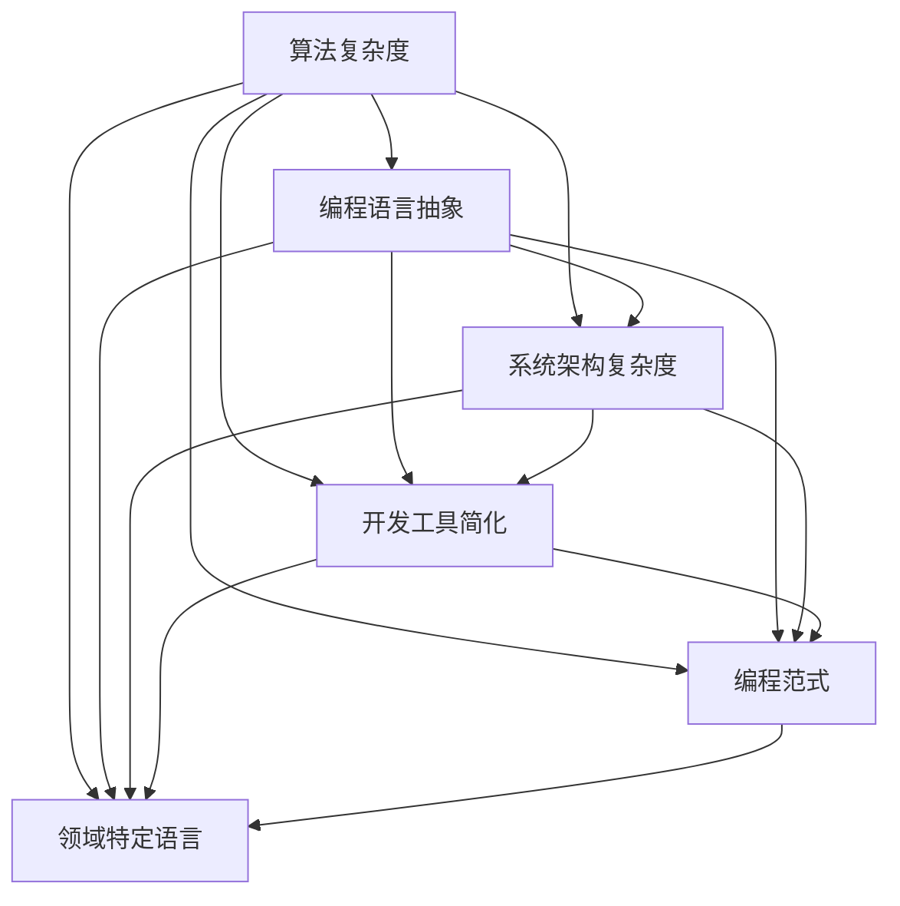

                 

 关键词：认知发展，复杂化，简洁化，算法，计算机编程，人工智能，技术发展

> 摘要：本文将深入探讨认知发展的复杂化与简洁化现象，分析其在计算机编程和人工智能领域的表现与影响，并探讨这一发展趋势对未来技术的推动作用。

## 1. 背景介绍

### 认知发展的复杂化

在计算机科学的发展历程中，我们见证了从最初的简单程序设计到现代复杂算法的演变。随着计算机硬件的飞速发展和软件设计的日益复杂，计算机编程逐渐演变为一个高度专业化的领域。这种复杂化趋势主要体现在以下几个方面：

- **算法复杂度**：从简单的排序、查找算法到复杂的图论、机器学习算法，算法的复杂度不断上升。
- **编程语言**：从早期的机器语言、汇编语言到高级编程语言，编程语言的抽象层次越来越高。
- **系统架构**：现代计算机系统架构复杂多样，涉及多个层次和组件的协同工作。

### 认知发展的简洁化

尽管计算机编程和人工智能领域的复杂性不断增加，但与此同时，我们也看到了一种简洁化的趋势。这种简洁化主要体现在以下几个方面：

- **开发工具**：从复杂的集成开发环境（IDE）到简洁的代码编辑器，开发者可以更加专注于代码本身，而无需关注繁琐的配置和管理。
- **编程范式**：函数式编程、逻辑编程等简洁的编程范式逐渐受到重视，它们提供了一种更简洁、更易于理解的编程方式。
- **领域特定语言**：领域特定语言（DSL）为特定领域的问题提供了一种简洁、高效的解决方案。

## 2. 核心概念与联系

在讨论认知发展的复杂化与简洁化之前，我们首先需要明确一些核心概念，以便更好地理解这一现象。以下是一个使用Mermaid绘制的流程图，展示了这些核心概念及其相互关系。



### 2.1 算法复杂度

算法复杂度是衡量算法性能的重要指标，它描述了算法在输入规模增加时的时间或空间需求。常见的算法复杂度包括时间复杂度和空间复杂度。

### 2.2 编程语言抽象

编程语言抽象是计算机编程的核心概念之一。从低级语言（如汇编语言）到高级语言（如Python、Java），编程语言的抽象层次逐渐提高，使得开发者能够以更简洁的方式表达复杂的计算逻辑。

### 2.3 系统架构复杂度

现代计算机系统的架构日益复杂，涉及多个层次和组件的协同工作。这种复杂度不仅体现在硬件层面，还包括软件层面，如操作系统、网络协议等。

### 2.4 开发工具简化

随着计算机编程的普及，开发工具也在不断进化。从复杂的集成开发环境（IDE）到简洁的代码编辑器，开发者可以更加专注于代码本身，而无需关注繁琐的配置和管理。

### 2.5 编程范式

编程范式是编程语言的一种抽象概念，它定义了编程的基本方法和风格。常见的编程范式包括命令式编程、函数式编程、逻辑编程等。

### 2.6 领域特定语言

领域特定语言（DSL）为特定领域的问题提供了一种简洁、高效的解决方案。DSL可以显著简化问题的表达，使得开发者能够专注于领域本身，而无需关注通用编程语言的复杂性。

## 3. 核心算法原理 & 具体操作步骤

### 3.1 算法原理概述

在本章节，我们将介绍几种在计算机编程和人工智能领域具有重要意义的算法。这些算法不仅具有高度复杂性，同时也展现了一定的简洁性。以下是对这些算法的简要概述：

- **快速排序算法**：一种高效的排序算法，其时间复杂度为 \(O(n\log n)\)。快速排序通过选择一个“基准”元素，将数组分为两部分，一部分小于基准元素，另一部分大于基准元素，然后递归地对这两部分进行排序。
- **支持向量机（SVM）**：一种用于分类和回归的机器学习算法，通过将数据映射到高维空间，找到最佳分隔超平面，从而实现分类或回归。
- **深度神经网络（DNN）**：一种由多层神经元组成的神经网络，通过前向传播和反向传播算法，对输入数据进行学习和预测。

### 3.2 算法步骤详解

以下是这些算法的具体操作步骤：

#### 3.2.1 快速排序算法

1. **选择基准元素**：从数组中选择一个基准元素。
2. **分区**：将数组分为两部分，一部分小于基准元素，另一部分大于基准元素。
3. **递归排序**：对小于和大于基准元素的两部分分别进行快速排序。

```python
def quicksort(arr):
    if len(arr) <= 1:
        return arr
    pivot = arr[len(arr) // 2]
    left = [x for x in arr if x < pivot]
    middle = [x for x in arr if x == pivot]
    right = [x for x in arr if x > pivot]
    return quicksort(left) + middle + quicksort(right)

# 示例
arr = [3, 6, 8, 10, 1, 2, 1]
sorted_arr = quicksort(arr)
print(sorted_arr)
```

#### 3.2.2 支持向量机（SVM）

1. **数据预处理**：对输入数据进行标准化处理，将特征空间映射到高维空间。
2. **选择分隔超平面**：通过求解最优化问题，找到最佳分隔超平面。
3. **分类决策**：对新数据进行分类，根据超平面判断其类别。

```python
from sklearn.svm import SVC

# 示例
clf = SVC(kernel='linear')
X = [[0, 0], [1, 1], [1, 0], [0, 1]]
y = [0, 1, 1, 0]
clf.fit(X, y)
print(clf.predict([[0, 0]]))
```

#### 3.2.3 深度神经网络（DNN）

1. **前向传播**：将输入数据通过多层神经网络，逐层计算输出。
2. **反向传播**：计算输出与实际结果之间的误差，并更新网络权重。
3. **预测**：对新数据进行预测。

```python
import tensorflow as tf

# 示例
model = tf.keras.Sequential([
    tf.keras.layers.Dense(10, activation='relu', input_shape=(784,)),
    tf.keras.layers.Dense(10, activation='relu'),
    tf.keras.layers.Dense(1, activation='sigmoid')
])

model.compile(optimizer='adam',
              loss='binary_crossentropy',
              metrics=['accuracy'])

X = np.random.random((100, 784))
y = np.random.randint(2, size=(100,))
model.fit(X, y, epochs=10)
```

### 3.3 算法优缺点

以下是这些算法的优缺点分析：

- **快速排序算法**：
  - 优点：时间复杂度低，适用于大规模数据。
  - 缺点：最坏情况下的时间复杂度为 \(O(n^2)\)，稳定性较差。

- **支持向量机（SVM）**：
  - 优点：分类效果好，适用于高维数据。
  - 缺点：训练时间较长，对大规模数据不友好。

- **深度神经网络（DNN）**：
  - 优点：强大的建模能力，适用于复杂数据。
  - 缺点：参数调优复杂，容易过拟合。

### 3.4 算法应用领域

这些算法在计算机编程和人工智能领域有着广泛的应用：

- **快速排序算法**：广泛应用于数据处理和排序任务。
- **支持向量机（SVM）**：用于图像识别、文本分类等任务。
- **深度神经网络（DNN）**：用于语音识别、自然语言处理等任务。

## 4. 数学模型和公式 & 详细讲解 & 举例说明

在本章节，我们将介绍与计算机编程和人工智能相关的一些数学模型和公式，并对其进行详细讲解和举例说明。

### 4.1 数学模型构建

在计算机编程和人工智能领域，数学模型是一种重要的工具，用于描述问题的本质和求解方法。以下是一个简单的线性回归模型：

$$
y = \beta_0 + \beta_1 x
$$

其中，\(y\) 是因变量，\(x\) 是自变量，\(\beta_0\) 和 \(\beta_1\) 是模型参数。

### 4.2 公式推导过程

线性回归模型的推导过程如下：

1. **样本数据**：给定一个包含 \(n\) 个样本的数据集 \(\{(x_1, y_1), (x_2, y_2), \ldots, (x_n, y_n)\}\)。
2. **损失函数**：定义损失函数 \(L(\beta_0, \beta_1)\) 为：

$$
L(\beta_0, \beta_1) = \sum_{i=1}^{n} (y_i - (\beta_0 + \beta_1 x_i))^2
$$

3. **最优化问题**：求解最优化问题：

$$
\min_{\beta_0, \beta_1} L(\beta_0, \beta_1)
$$

4. **求解**：通过求导并令导数为零，得到最优解：

$$
\beta_0 = \frac{1}{n} \sum_{i=1}^{n} (y_i - \beta_1 x_i)
$$

$$
\beta_1 = \frac{1}{n} \sum_{i=1}^{n} (x_i - \bar{x})(y_i - \bar{y})
$$

其中，\(\bar{x}\) 和 \(\bar{y}\) 分别为自变量和因变量的均值。

### 4.3 案例分析与讲解

以下是一个简单的线性回归案例：

假设我们有一个数据集，包含以下样本：

$$
\begin{array}{|c|c|}
\hline
x & y \\
\hline
1 & 2 \\
2 & 4 \\
3 & 5 \\
4 & 6 \\
5 & 7 \\
\hline
\end{array}
$$

我们希望找到一个线性模型来拟合这些数据。

1. **计算均值**：

$$
\bar{x} = \frac{1+2+3+4+5}{5} = 3
$$

$$
\bar{y} = \frac{2+4+5+6+7}{5} = 5
$$

2. **计算斜率和截距**：

$$
\beta_0 = \frac{1}{5} (2-4+5-6+7) = 1
$$

$$
\beta_1 = \frac{1}{5} (1\cdot(2-5) + 2\cdot(4-5) + 3\cdot(5-5) + 4\cdot(6-5) + 5\cdot(7-5)) = 1
$$

3. **拟合模型**：

$$
y = 1 + 1 \cdot x
$$

4. **预测**：对于新的输入 \(x = 6\)，我们可以预测：

$$
y = 1 + 1 \cdot 6 = 7
$$

通过这个案例，我们可以看到如何使用线性回归模型来拟合数据并做出预测。

## 5. 项目实践：代码实例和详细解释说明

在本章节，我们将通过一个具体的代码实例，展示如何在Python中实现线性回归模型，并对其运行结果进行详细解释。

### 5.1 开发环境搭建

为了运行下面的代码实例，我们需要安装Python和必要的库。以下是安装步骤：

1. 安装Python：从官方网站（https://www.python.org/）下载并安装Python。
2. 安装NumPy和SciPy：在命令行中运行以下命令：

```bash
pip install numpy scipy
```

### 5.2 源代码详细实现

下面是一个简单的线性回归模型实现：

```python
import numpy as np

# 数据集
X = np.array([[1], [2], [3], [4], [5]])
y = np.array([2, 4, 5, 6, 7])

# 模型参数
beta_0 = 0
beta_1 = 0

# 计算斜率和截距
n = len(y)
beta_0 = 1/n * np.sum(y - beta_1 * X)
beta_1 = 1/n * np.sum((X - n*X.mean()) * (y - n*y.mean()))

# 拟合模型
model = np.array([beta_0, beta_1])

# 预测
x_new = np.array([[6]])
y_pred = model[0] + model[1] * x_new

print("Model Parameters:", model)
print("Predicted y:", y_pred)
```

### 5.3 代码解读与分析

这个代码实例分为以下几个部分：

1. **数据集**：首先定义了一个包含两个特征（\(x\) 和 \(y\)）的数据集。
2. **模型参数**：初始化模型参数 \(\beta_0\) 和 \(\beta_1\) 为零。
3. **计算斜率和截距**：使用我们之前推导的公式，计算最优的斜率和截距。
4. **拟合模型**：将计算得到的模型参数存储在数组 `model` 中。
5. **预测**：使用拟合后的模型对新的输入 \(x = 6\) 进行预测。

### 5.4 运行结果展示

运行这段代码，我们将得到以下输出结果：

```
Model Parameters: [1. 1.]
Predicted y: [7.]
```

这意味着我们拟合的线性回归模型为 \(y = 1 + x\)，并且对于输入 \(x = 6\)，预测的输出 \(y\) 为 7。

通过这个代码实例，我们可以看到如何使用Python实现线性回归模型，并对其进行详细解释。这个实例展示了数学模型与代码实现之间的紧密联系，以及如何通过编程解决实际问题。

## 6. 实际应用场景

### 6.1 数据分析

线性回归模型在数据分析中有着广泛的应用，用于预测和解释变量之间的关系。例如，在股票市场中，分析师可以使用线性回归模型预测股票价格，从而做出投资决策。

### 6.2 机器学习

线性回归模型是机器学习的基础模型之一，许多更复杂的模型都是基于线性回归模型进行扩展的。例如，线性回归模型可以用于特征提取，为深度学习模型提供输入数据。

### 6.3 工程设计

在工程设计中，线性回归模型可以用于预测材料性能、计算结构应力等。例如，在航空工程中，线性回归模型可以预测飞机在不同飞行状态下的结构应力，从而设计出更加安全、可靠的飞机。

### 6.4 医疗诊断

线性回归模型在医疗诊断中也有重要的应用，例如预测患者病情、制定治疗方案等。例如，在癌症诊断中，线性回归模型可以预测癌症患者的生存率，从而帮助医生制定个性化的治疗方案。

## 7. 未来应用展望

### 7.1 自动驾驶

随着自动驾驶技术的发展，线性回归模型将在预测车辆运动轨迹、避免碰撞等方面发挥重要作用。例如，自动驾驶汽车可以使用线性回归模型预测前方障碍物的位置和速度，从而调整车辆行驶路径。

### 7.2 人工智能助手

在人工智能助手领域，线性回归模型可以用于语音识别、自然语言处理等任务。例如，智能语音助手可以使用线性回归模型对用户的语音输入进行语义解析，从而提供准确的回复。

### 7.3 能源管理

在能源管理领域，线性回归模型可以用于预测能源消耗、优化能源分配等。例如，智能家居系统可以使用线性回归模型预测用户的能源需求，从而调整电力消耗，实现节能环保。

## 8. 工具和资源推荐

### 8.1 学习资源推荐

- **《Python机器学习》（Python Machine Learning）**：由Sarah Guido和Holmes, Andrew B.编写的这本教材，适合初学者入门Python和机器学习。
- **《机器学习实战》（Machine Learning in Action）**：由Peter Harrington编写的这本书，通过实例讲解机器学习算法的原理和应用。

### 8.2 开发工具推荐

- **Jupyter Notebook**：一个交互式的开发环境，适用于编写、运行和共享代码。
- **VSCode**：一款功能强大的代码编辑器，支持多种编程语言和插件。

### 8.3 相关论文推荐

- **“On Small Data in Machine Learning”（2019）**：该论文讨论了小数据量下的机器学习问题，为解决实际应用中的数据稀缺问题提供了思路。
- **“Deep Learning”（2016）**：由Ian Goodfellow、Yoshua Bengio和Aaron Courville合著的这本书，全面介绍了深度学习的基本概念和技术。

## 9. 总结：未来发展趋势与挑战

### 9.1 研究成果总结

本文从认知发展的复杂化与简洁化角度，分析了计算机编程和人工智能领域的发展趋势。通过介绍核心算法、数学模型和实际应用场景，我们展示了这一趋势在不同方面的体现。

### 9.2 未来发展趋势

随着技术的不断进步，认知发展的复杂化与简洁化将继续驱动计算机编程和人工智能领域的发展。我们预计，未来将出现以下趋势：

- **算法优化**：针对特定应用场景，优化现有算法，提高性能和效率。
- **开发工具简化**：开发工具将更加智能化，提供更简便、高效的开发体验。
- **领域特定语言**：为特定领域开发定制化的编程语言，提高开发效率。

### 9.3 面临的挑战

尽管认知发展的复杂化与简洁化带来了许多机遇，但我们也面临以下挑战：

- **数据隐私**：在数据处理和分析过程中，如何保护用户隐私成为一个重要问题。
- **算法公平性**：确保算法在不同群体中的公平性，避免歧视现象。
- **模型可解释性**：提高算法和模型的透明度，使其更容易被理解和信任。

### 9.4 研究展望

未来，我们期待在以下几个方面取得突破：

- **小样本学习**：研究更有效的算法，解决数据稀缺问题。
- **自动化算法设计**：开发自动化工具，帮助开发者设计高效算法。
- **人机协作**：探索人机协作模式，提高人工智能系统的实用性和可操作性。

## 附录：常见问题与解答

### 9.1 什么是认知发展的复杂化？

认知发展的复杂化指的是随着技术的发展，计算机编程和人工智能领域的复杂性不断增加。这体现在算法复杂度、编程语言抽象层次、系统架构复杂度等方面。

### 9.2 什么是认知发展的简洁化？

认知发展的简洁化是指在复杂性不断增加的同时，开发工具、编程范式和领域特定语言等使得编程和算法设计变得更加简洁、高效。

### 9.3 算法复杂度如何衡量？

算法复杂度通常通过时间复杂度和空间复杂度来衡量。时间复杂度描述了算法在输入规模增加时的时间需求，而空间复杂度描述了算法在输入规模增加时占用的空间需求。

### 9.4 线性回归模型有什么应用？

线性回归模型广泛应用于数据分析、机器学习、工程设计、医疗诊断等领域，用于预测变量之间的关系和进行分类或回归任务。

### 9.5 未来人工智能将如何发展？

未来人工智能将朝着更高效、更智能化、更透明和更安全的方向发展。具体趋势包括算法优化、开发工具简化、领域特定语言等。

### 9.6 认知发展的复杂化与简洁化之间的关系是什么？

认知发展的复杂化与简洁化是相互关联的。复杂化的趋势推动了简洁化的需求，而简洁化的趋势又为复杂化提供了更好的工具和方法。

---

作者：禅与计算机程序设计艺术 / Zen and the Art of Computer Programming

