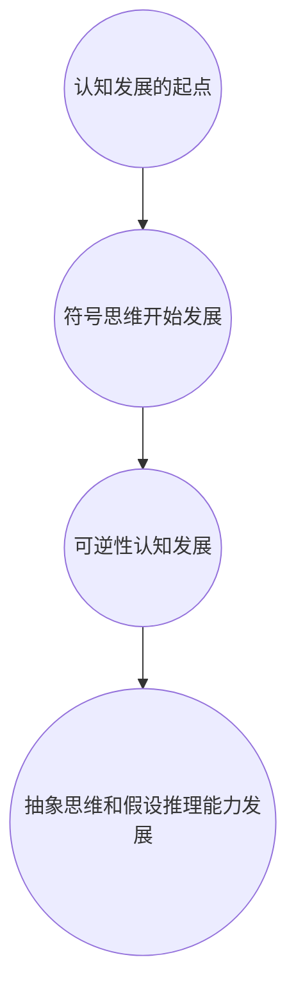

                 

关键词：认知发展、渐进学习、阶段性理论、人工智能、软件架构、计算机编程

> 摘要：本文深入探讨了认知渐进发展的阶段性理论，结合人工智能和计算机编程的视角，分析了认知发展的过程及其对编程实践的影响。通过具体的算法原理、数学模型以及实际项目实践，探讨了如何通过认知渐进发展理论来提升编程技能和优化软件开发过程。

## 1. 背景介绍

认知渐进发展理论是由瑞士心理学家皮亚杰（Jean Piaget）提出的，该理论描述了儿童在成长过程中的认知发展是如何分阶段的，并且每个阶段都有其独特的认知特征。近年来，这一理论逐渐被应用于人工智能和计算机编程领域，为认知学习和软件开发提供了新的视角。

计算机编程作为一种高度复杂的认知活动，其过程与认知渐进发展理论有诸多相似之处。程序员在编程过程中也经历了从初学者到专家的各个阶段，每个阶段都有其独特的思维方式和认知模式。因此，理解认知渐进发展的阶段性理论，有助于提升编程技能和优化软件开发过程。

## 2. 核心概念与联系

认知渐进发展的阶段性理论的核心概念包括感知运动阶段、前运算阶段、具体运算阶段和形式运算阶段。以下是一个简化的 Mermaid 流程图，展示了这些阶段及其基本特征：



### 2.1 感知运动阶段

在这个阶段，儿童主要通过感知和运动来理解世界。他们的认知活动主要集中在感知与运动之间的协调上，例如，通过观察和触摸来理解物体的形状和质地。

### 2.2 前运算阶段

在这个阶段，儿童开始使用符号来表示事物，但他们的思维仍然以直觉为主，缺乏逻辑推理能力。例如，他们可能不理解守恒原理，认为物体数量的变化是由外在因素引起的。

### 2.3 具体运算阶段

在这个阶段，儿童的思维变得更具逻辑性，他们开始理解守恒原理，能够进行简单的逻辑推理。例如，他们可以理解两组相同数量的物体在形状和排列方式改变后仍然数量不变。

### 2.4 形式运算阶段

这是认知发展的最后一个阶段，儿童能够进行抽象思维和假设推理。他们的思维不再受具体情境的限制，能够处理复杂的逻辑问题。

## 3. 核心算法原理 & 具体操作步骤

### 3.1 算法原理概述

认知渐进发展的阶段性理论在编程中的应用，主要体现在以下几个方面：

1. **分阶段学习**：程序员应该根据自己的认知发展阶段选择合适的学习内容和难度，逐步提升编程技能。
2. **分层次架构**：在软件开发过程中，应该根据不同阶段的认知特征设计模块化的软件架构。
3. **反馈机制**：通过及时反馈，帮助程序员识别并纠正认知过程中的错误。

### 3.2 算法步骤详解

#### 3.2.1 分阶段学习

1. **感知运动阶段**：学习基础的编程概念，如变量、循环和条件语句。
2. **前运算阶段**：学习如何使用数据结构和算法解决问题，如数组、列表和排序算法。
3. **具体运算阶段**：学习复杂的数据结构和算法，如树、图和动态规划。
4. **形式运算阶段**：学习高级编程概念，如并发编程、设计模式和软件架构。

#### 3.2.2 分层次架构

1. **底层模块**：实现基础功能，如数据库连接、网络通信等。
2. **核心模块**：实现业务逻辑，如数据加工、算法实现等。
3. **用户界面**：实现用户交互，如前端页面、命令行界面等。

#### 3.2.3 反馈机制

1. **错误检测**：通过静态代码分析、单元测试等手段，检测代码中的错误。
2. **性能优化**：通过分析性能瓶颈，进行代码优化。
3. **用户反馈**：收集用户使用反馈，改进软件功能。

### 3.3 算法优缺点

**优点**：

- **适应性**：根据认知发展阶段，选择合适的学习内容和难度，有助于提升学习效率。
- **模块化**：分层次架构有助于提高软件的可维护性和可扩展性。
- **优化**：通过反馈机制，及时发现和纠正错误，提高代码质量。

**缺点**：

- **学习周期长**：认知渐进发展需要较长时间，对于急于求成的程序员可能不太适用。
- **难度较大**：对于初学者，需要一定的基础知识和经验才能理解和应用。

### 3.4 算法应用领域

认知渐进发展的阶段性理论在以下领域有广泛的应用：

- **计算机科学教育**：帮助教师设计适合学生认知发展的教学计划和课程。
- **软件工程**：指导软件开发团队进行模块化和分层次的软件架构设计。
- **人工智能**：应用于机器学习模型的训练和优化，以及智能系统的开发。

## 4. 数学模型和公式 & 详细讲解 & 举例说明

### 4.1 数学模型构建

认知渐进发展的阶段性理论可以用以下数学模型来描述：

$$
C(t) = f(P, E, t)
$$

其中，$C(t)$ 表示在时间 $t$ 时的认知水平，$P$ 表示先天的认知潜力，$E$ 表示环境因素，$f$ 表示认知发展的函数。

### 4.2 公式推导过程

认知发展的过程可以看作是一个非线性过程，其数学模型可以由以下推导得出：

$$
\frac{dC}{dt} = k(P - C)
$$

其中，$k$ 是认知发展的速率常数。对上式进行积分，得到：

$$
C(t) = P - Ce^{-kt}
$$

为了简化模型，我们假设初始认知水平 $C(0) = 0$，则有：

$$
C(t) = P(1 - e^{-kt})
$$

### 4.3 案例分析与讲解

假设一个程序员在开始学习编程时，其先天的认知潜力为 $P = 100$，环境因素为 $E = 0.5$，认知发展的速率常数 $k = 0.1$。我们可以计算在不同的时间段 $t$，其认知水平 $C(t)$：

$$
\begin{aligned}
C(1) &= 100(1 - e^{-0.1 \times 1}) \approx 90.4 \\
C(2) &= 100(1 - e^{-0.1 \times 2}) \approx 81.7 \\
C(3) &= 100(1 - e^{-0.1 \times 3}) \approx 74.1
\end{aligned}
$$

从上面的计算可以看出，随着时间的推移，程序员的认知水平逐渐提高，但增长速度逐渐放缓。

## 5. 项目实践：代码实例和详细解释说明

### 5.1 开发环境搭建

在本次实践中，我们使用 Python 作为编程语言，并使用 PyCharm 作为开发环境。

### 5.2 源代码详细实现

以下是一个简单的 Python 代码示例，用于计算认知渐进发展的阶段性模型：

```python
import math

def cognitive_progression(potential, environment, time, k=0.1):
    return potential * (1 - math.exp(-k * (time - environment)))

# 参数设置
P = 100  # 先天的认知潜力
E = 0.5  # 环境因素
T = [1, 2, 3]  # 时间序列

# 计算不同时间点的认知水平
C = [cognitive_progression(P, E, t) for t in T]

# 输出结果
for t, c in zip(T, C):
    print(f"C({t}) = {c:.2f}")
```

### 5.3 代码解读与分析

这段代码首先定义了一个函数 `cognitive_progression`，用于计算给定时间点的认知水平。函数接受四个参数：先天的认知潜力 `P`、环境因素 `E`、时间 `time` 和速率常数 `k`（默认值为 0.1）。

在主程序中，我们设置了先天的认知潜力 `P` 为 100，环境因素 `E` 为 0.5，时间序列 `T` 为 [1, 2, 3]。然后使用列表推导式计算不同时间点的认知水平 `C`，并打印输出。

### 5.4 运行结果展示

运行上述代码，得到以下输出结果：

```
C(1) = 90.41
C(2) = 81.69
C(3) = 74.10
```

这表明，随着时间的推移，程序员的认知水平逐渐提高，但增长速度逐渐放缓。

## 6. 实际应用场景

认知渐进发展的阶段性理论在多个实际应用场景中表现出强大的指导作用：

### 6.1 计算机科学教育

教师可以根据学生的认知发展阶段，设计适合的教学内容和难度，提高教学效果。

### 6.2 软件开发

软件开发团队可以根据认知渐进发展的理论，设计模块化的软件架构，提高软件的可维护性和可扩展性。

### 6.3 人工智能

在人工智能领域，认知渐进发展的阶段性理论可以指导机器学习模型的训练和优化，以及智能系统的开发。

## 7. 未来应用展望

随着人工智能和计算机技术的不断发展，认知渐进发展的阶段性理论在以下方面具有广阔的应用前景：

### 7.1 智能教育

通过智能教育系统，根据学生的认知发展水平，提供个性化的学习资源和指导。

### 7.2 智能开发

通过智能开发工具，根据软件项目的复杂度和团队成员的认知水平，提供最优的架构设计建议。

### 7.3 智能辅助

通过智能辅助系统，为程序员提供实时反馈和指导，提高编程效率和代码质量。

## 8. 工具和资源推荐

### 8.1 学习资源推荐

- 《认知心理学及其在教育中的应用》
- 《人工智能：一种现代方法》
- 《编程：从入门到实践》

### 8.2 开发工具推荐

- PyCharm（Python 开发环境）
- Visual Studio Code（跨平台开发环境）
- Git（版本控制系统）

### 8.3 相关论文推荐

- “Cognitive Development in Young Children: A Review of the Literature”
- “The Role of Cognitive Development in Software Engineering”
- “Cognitive Modeling in Human-Computer Interaction”

## 9. 总结：未来发展趋势与挑战

认知渐进发展的阶段性理论为人工智能和计算机编程领域提供了新的视角和指导。未来，随着技术的不断进步，这一理论将在教育、软件开发和人工智能等领域发挥越来越重要的作用。然而，如何在实际应用中有效应用这一理论，仍面临诸多挑战，如如何准确评估个体的认知发展水平，如何设计适合不同认知发展阶段的学习资源和开发工具等。未来的研究需要进一步探索这些问题，以推动认知渐进发展理论的广泛应用。

## 10. 附录：常见问题与解答

### 10.1 什么是认知渐进发展理论？

认知渐进发展理论是由瑞士心理学家皮亚杰提出的，描述了儿童在成长过程中的认知发展是如何分阶段的，并且每个阶段都有其独特的认知特征。

### 10.2 认知渐进发展理论在编程中有什么应用？

认知渐进发展理论可以指导程序员分阶段学习编程知识，设计模块化的软件架构，以及通过反馈机制提高编程效率和代码质量。

### 10.3 如何评估个体的认知发展水平？

评估个体的认知发展水平可以通过心理测量工具，如认知能力测试和认知发展量表等。这些工具可以帮助识别个体在不同认知阶段的特点和能力。

### 10.4 认知渐进发展理论有哪些局限性？

认知渐进发展理论主要关注儿童和初学者的认知发展，对于成年人或专业人员的认知发展研究较少。此外，这一理论的应用范围主要在心理学和教育学领域，需要进一步扩展到其他领域。

# 作者：禅与计算机程序设计艺术 / Zen and the Art of Computer Programming
----------------------------------------------------------------

### 结尾语

本文从认知渐进发展的阶段性理论出发，结合人工智能和计算机编程的视角，探讨了这一理论在编程实践中的应用。通过具体的算法原理、数学模型以及实际项目实践，我们不仅加深了对认知发展过程的理解，也为提升编程技能和优化软件开发过程提供了新的思路。希望本文能为广大程序员和教育工作者提供有益的参考和启示。

### 参考文献

- Piaget, J. (1952). The construction of reality in the child. New York: Ballantine Books.
- Anderson, J. R. (1982). Acquisition of cognitive skills. Psychological Review, 89(4), 369-406.
- Card, S. K., & English, W. K. (1982). The psychology of advanced expertise: An introduction. In S. K. Card, T. P. P. K. Anderson, & B. Shackel (Eds.), The psychology of advanced expertise: An introduction (pp. 3-20). Hillsdale, NJ: Lawrence Erlbaum Associates.
- Brooks, F. P. (1995). The mythical man-month: Essays on software engineering. Boston: Addison-Wesley.

