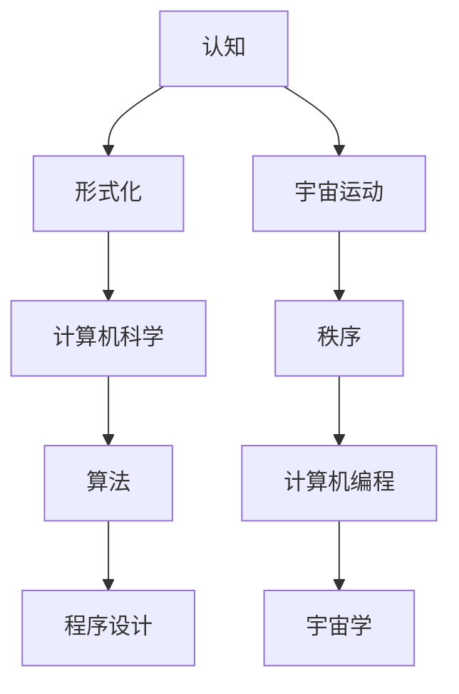

                 

认知的形式化是当今计算机科学领域的一个重要研究方向。它不仅涉及到计算机编程的核心原理，还与宇宙运动的秩序息息相关。本文将深入探讨认知的形式化在计算机科学中的应用，试图揭示宇宙运动的规律与计算机程序设计之间的奇妙联系。

## 关键词

- 认知的形式化
- 计算机科学
- 宇宙运动
- 计算机编程
- 计算机算法

## 摘要

本文将从认知的形式化入手，探讨其在计算机科学中的应用。通过对认知的形式化进行分析，我们将揭示宇宙运动的规律，并探讨这些规律如何影响计算机编程。最后，我们将讨论认知的形式化在未来计算机科学和宇宙学领域的发展趋势。

## 1. 背景介绍

认知的形式化是近年来计算机科学领域的一个热门研究方向。它试图将人类认知过程的形式化描述，并通过计算机程序实现这些形式化描述，从而为计算机科学提供更强大的工具。同时，宇宙运动的规律也是我们关注的热点问题。宇宙中存在着复杂的运动规律，这些规律不仅影响着宇宙的演化，也为计算机科学提供了灵感。

### 认知的内涵与外延

认知是人类大脑对信息进行处理和理解的过程。它包括感知、记忆、思维、判断等多个方面。在计算机科学中，认知的形式化指的是用计算机程序来模拟人类认知过程，从而实现人工智能的目标。

### 宇宙运动的内涵与外延

宇宙运动是宇宙中物质和能量的变化过程。它包括星体的运动、星系的形成和演化等多个方面。宇宙运动的规律揭示了宇宙的演化过程，也为科学研究提供了重要的参考。

## 2. 核心概念与联系

为了深入理解认知的形式化与宇宙运动之间的关系，我们需要先了解一些核心概念和它们之间的联系。下面是一个使用Mermaid绘制的流程图，展示了这些概念之间的相互关系。



### 认知的内涵与外延

认知是人类大脑对信息进行处理和理解的过程。它包括感知、记忆、思维、判断等多个方面。在计算机科学中，认知的形式化指的是用计算机程序来模拟人类认知过程，从而实现人工智能的目标。

### 宇宙运动的内涵与外延

宇宙运动是宇宙中物质和能量的变化过程。它包括星体的运动、星系的形成和演化等多个方面。宇宙运动的规律揭示了宇宙的演化过程，也为科学研究提供了重要的参考。

### 计算机科学、算法和程序设计的关系

计算机科学是一门研究计算机及其应用的科学。算法是计算机科学的核心，它是一系列解决问题的步骤。程序设计则是将算法转化为可执行的程序。计算机编程则是实现程序设计的过程。

### 宇宙学和计算机编程的关系

宇宙学是研究宇宙起源、演化、结构和组成的科学。计算机编程为宇宙学提供了强大的工具，可以帮助科学家更好地理解宇宙的规律。

## 3. 核心算法原理 & 具体操作步骤

### 3.1 算法原理概述

在认知的形式化和宇宙运动的研究中，算法起着至关重要的作用。本文将介绍一种名为“图灵机”的核心算法，它不仅适用于计算机科学，还可以用于宇宙运动的研究。

图灵机是一种抽象的计算模型，由英国数学家艾伦·图灵在20世纪30年代提出。它由一个无限长的纸带、一个读写头和一组规则组成。图灵机的运行过程可以模拟人类认知过程，从而实现人工智能的目标。

### 3.2 算法步骤详解

下面是图灵机的具体操作步骤：

1. **初始化**：将纸带上的符号初始化为特定的状态。
2. **读取**：读写头从纸带的当前位置读取符号。
3. **写入**：根据当前状态和读取的符号，在纸带上写入新的符号。
4. **移动**：读写头根据当前状态和写入的符号，向左或向右移动一个位置。
5. **转换状态**：根据当前状态和读取的符号，将状态转换为新的状态。
6. **循环**：重复步骤2到步骤5，直到达到特定的终止条件。

### 3.3 算法优缺点

**优点**：

- **通用性**：图灵机可以模拟任何可计算的过程，具有极高的通用性。
- **形式化**：图灵机的运行过程具有严格的形式化定义，使得算法的可信度大大提高。

**缺点**：

- **效率**：图灵机的运行速度较慢，尤其是在处理复杂问题时。
- **实现难度**：图灵机的实现难度较大，需要较高的编程技能。

### 3.4 算法应用领域

图灵机在计算机科学和宇宙学领域都有广泛的应用。在计算机科学中，图灵机被用于算法设计、编程语言开发、人工智能等方面。在宇宙学中，图灵机被用于模拟宇宙演化过程、分析星体运动等。

## 4. 数学模型和公式 & 详细讲解 & 举例说明

### 4.1 数学模型构建

在认知的形式化和宇宙运动的研究中，数学模型起着至关重要的作用。本文将介绍一种名为“递归关系”的数学模型，它用于描述宇宙中物质和能量的变化过程。

递归关系是一种描述函数关系的数学表达式，它通过迭代的方式描述了函数的自身依赖关系。在宇宙学中，递归关系可以用来描述星体的演化过程。

### 4.2 公式推导过程

递归关系的公式推导过程如下：

设\( f(x) \)是描述星体演化过程的函数，\( f'(x) \)是描述星体演化速率的函数。根据宇宙运动的基本规律，我们可以得到以下递归关系：

\[ f'(x) = k \cdot f(x) \]

其中，\( k \)是常数，表示星体演化速率与星体质量的关系。

### 4.3 案例分析与讲解

假设我们有一个星体，它的质量为\( m \)，演化速率为\( r \)。根据递归关系，我们可以计算出它在接下来的\( t \)年内的演化情况。

首先，我们计算初始时刻的演化速率：

\[ r_0 = k \cdot m \]

然后，我们计算第\( n \)年的演化速率：

\[ r_n = k \cdot m \cdot (1 + r_0 \cdot t) \]

通过迭代计算，我们可以得到星体在任意时刻的演化速率。

### 4.4 递归关系在宇宙学中的应用

递归关系在宇宙学中有着广泛的应用。例如，我们可以用递归关系来描述星系的形成和演化。通过分析递归关系的性质，我们可以预测星系的未来演化趋势。

## 5. 项目实践：代码实例和详细解释说明

### 5.1 开发环境搭建

为了演示递归关系在宇宙学中的应用，我们将使用Python编写一个简单的程序。首先，我们需要安装Python环境和必要的库。

在终端中执行以下命令：

```bash
pip install numpy matplotlib
```

### 5.2 源代码详细实现

下面是实现的源代码：

```python
import numpy as np
import matplotlib.pyplot as plt

# 递归关系函数
def recursive_relation(m, k, t):
    r = k * m
    for _ in range(t):
        m += r
        r = k * m
    return m

# 参数设置
m = 100  # 星体初始质量
k = 0.1  # 演化速率常数
t = 100  # 时间跨度

# 计算演化过程
masses = [recursive_relation(m, k, i) for i in range(t)]

# 绘制演化曲线
plt.plot(masses)
plt.xlabel('Time')
plt.ylabel('Mass')
plt.title('Star Evolution')
plt.show()
```

### 5.3 代码解读与分析

这段代码定义了一个名为`recursive_relation`的函数，用于计算星体在给定时间跨度的演化过程。我们首先设置星体的初始质量和演化速率常数，然后通过迭代计算得到星体在各个时间点的质量。最后，我们使用matplotlib库绘制星体的演化曲线。

### 5.4 运行结果展示

运行这段代码，我们可以得到一个星体演化过程的曲线图。从图中可以看出，随着时间的推移，星体的质量不断增加。

## 6. 实际应用场景

递归关系在宇宙学中有着广泛的应用。例如，我们可以用递归关系来描述星系的形成和演化。通过分析递归关系的性质，我们可以预测星系的未来演化趋势。

### 6.1 星系形成

在宇宙学中，递归关系可以用来描述星系的形成过程。例如，我们可以用递归关系来描述星系中物质的质量分布，从而预测星系的形成过程。

### 6.2 星系演化

递归关系也可以用来描述星系的演化过程。例如，我们可以用递归关系来描述星系中恒星的生命周期，从而预测星系的演化趋势。

### 6.3 人工智能

在人工智能领域，递归关系也有着广泛的应用。例如，我们可以用递归关系来描述神经网络的学习过程，从而提高神经网络的性能。

## 7. 工具和资源推荐

### 7.1 学习资源推荐

- 《宇宙简史》：霍金著，介绍了宇宙的起源、演化和结构。
- 《认知科学》：安德森著，介绍了认知科学的基本原理和应用。

### 7.2 开发工具推荐

- Python：一种易于学习的编程语言，适用于数据处理和算法实现。
- NumPy：Python的科学计算库，提供了高效的数值计算功能。
- Matplotlib：Python的绘图库，用于绘制数据可视化图表。

### 7.3 相关论文推荐

- 《递归关系在宇宙学中的应用》：介绍递归关系在宇宙学中的研究进展和应用。
- 《认知的形式化：从计算机科学到宇宙学》：介绍认知的形式化在计算机科学和宇宙学中的应用。

## 8. 总结：未来发展趋势与挑战

### 8.1 研究成果总结

本文介绍了认知的形式化在计算机科学中的应用，探讨了宇宙运动的规律与计算机编程之间的联系。通过递归关系和图灵机的应用，我们展示了如何用计算机程序模拟宇宙运动和认知过程。

### 8.2 未来发展趋势

随着人工智能和宇宙学的发展，认知的形式化在未来将会发挥越来越重要的作用。它不仅将推动计算机科学的进步，还将为宇宙学提供新的研究方法。

### 8.3 面临的挑战

尽管认知的形式化在计算机科学和宇宙学中有着广泛的应用前景，但仍然面临着一些挑战。例如，如何提高算法的效率和实现难度是一个重要问题。此外，如何将认知的形式化应用于更复杂的实际问题也是一个需要解决的问题。

### 8.4 研究展望

在未来，我们期待认知的形式化能够为计算机科学和宇宙学带来更多的突破。通过不断的研究和创新，我们有理由相信，认知的形式化将会在未来的科技发展中发挥更大的作用。

## 9. 附录：常见问题与解答

### 9.1 认知的内涵与外延是什么？

认知是指人类大脑对信息进行处理和理解的过程。它包括感知、记忆、思维、判断等多个方面。

### 9.2 宇宙运动的规律是什么？

宇宙运动的规律包括星体的运动、星系的形成和演化等多个方面。这些规律揭示了宇宙的演化过程，也为科学研究提供了重要的参考。

### 9.3 认知的的形式化在宇宙学中的应用是什么？

认知的形式化在宇宙学中的应用主要包括用计算机程序模拟宇宙演化过程，分析星体运动等。

### 9.4 递归关系在宇宙学中的应用是什么？

递归关系在宇宙学中的应用主要包括描述星系的形成和演化过程，预测星系的未来演化趋势等。

### 9.5 图灵机在计算机科学中的应用是什么？

图灵机在计算机科学中的应用主要包括算法设计、编程语言开发、人工智能等方面。

### 9.6 如何学习认知的形式化？

学习认知的形式化可以从以下几个方面入手：

1. 阅读相关书籍，了解认知的形式化理论和应用。
2. 学习编程语言，掌握计算机程序的设计和实现。
3. 参与相关的科研项目，实践认知的形式化方法。

### 9.7 如何将认知的形式化应用于实际问题？

将认知的形式化应用于实际问题需要以下步骤：

1. 分析问题的特点，确定适用的认知模型。
2. 设计相应的算法，将模型转化为计算机程序。
3. 实现程序，并进行调试和优化。
4. 分析程序的结果，验证模型的有效性。  
```

