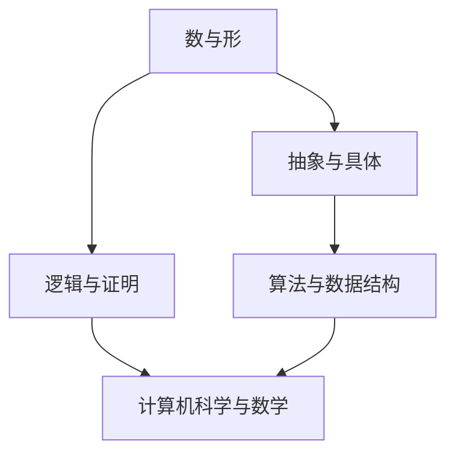

                 

### 1. 背景介绍

在人类认知的历史长河中，数学一直占据着重要的地位。从古代的几何学、算术学，到现代的代数学、微积分学，数学不仅为我们提供了描述和解决实际问题的工具，也深刻地影响了人类对世界的理解和认识。然而，数学的本质究竟是什么？它又是如何成为我们认知世界的重要工具的呢？

随着信息技术的飞速发展，计算机科学成为了现代科技的基石。无论是算法设计、数据分析，还是人工智能、大数据处理，计算机科学都离不开数学的支持。然而，计算机科学中的数学与传统的数学又有所不同。它不仅关注数学的抽象概念和理论，更注重数学在计算机系统中的应用和实现。

本文旨在探讨数学的形式化认知，试图回答以下几个问题：数学是什么？它如何成为人类认知世界的重要工具？在计算机科学中，数学如何发挥作用？本文将结合计算机科学和数学的视角，对这些问题进行深入的探讨。

### 2. 核心概念与联系

在探讨数学的形式化认知之前，我们首先需要明确一些核心概念，并了解它们之间的联系。以下是本文的核心概念：

#### 2.1 数与形

数与形是数学的两个基本元素。数是数学中用来表示和描述客观事物数量的基本概念，如整数、分数、实数等。形则是用来描述事物的几何特征，如点、线、面、体等。在数学中，数与形是相互关联的。例如，通过数可以描述形的尺寸、位置和形状等特征。

#### 2.2 抽象与具体

抽象和具体是数学研究过程中的两个重要阶段。具体指的是对现实世界中的具体事物进行观察和描述，而抽象则是从具体的事物中提取出共同的规律和特征，形成数学概念和理论。例如，从具体的直线和圆中，我们可以抽象出“线”和“圆”的概念。

#### 2.3 逻辑与证明

逻辑是数学研究的基本工具，它用来描述和推理数学命题之间的关系。证明则是通过逻辑推理，从已知的前提出发，推导出新的结论的过程。例如，在几何学中，我们可以使用逻辑推理证明圆的性质。

#### 2.4 算法与数据结构

算法是数学在计算机科学中的应用，它指的是解决问题的一系列有序步骤。数据结构则是用来存储和组织数据的方法和规则。在计算机科学中，算法和数据结构是解决问题的关键。

#### 2.5 计算机科学与数学

计算机科学与数学有着密不可分的关系。计算机科学中的许多问题都可以通过数学的方法进行描述和解决。例如，算法分析、密码学、图论、计算几何等都是数学在计算机科学中的应用。

以下是本文的核心概念原理和架构的Mermaid流程图：



### 3. 核心算法原理 & 具体操作步骤

在了解了数学的形式化认知和核心概念之后，我们接下来将探讨数学在计算机科学中的核心算法原理和具体操作步骤。

#### 3.1 算法原理概述

数学在计算机科学中的应用主要体现在以下几个方面：

1. **算法设计**：利用数学原理设计解决特定问题的算法。例如，排序算法、搜索算法等。
2. **算法分析**：使用数学方法对算法的性能进行分析和评估。例如，时间复杂度、空间复杂度等。
3. **密码学**：利用数学原理设计加密和解密算法，保护信息安全。
4. **计算几何**：利用数学原理处理几何图形的运算和绘制。
5. **图论**：利用数学原理研究图的结构和性质，解决网络优化、路径规划等问题。

#### 3.2 算法步骤详解

以下是一个简单的排序算法——冒泡排序的步骤详解：

1. **初始化**：将待排序的元素放入一个数组中。
2. **比较相邻元素**：从第一个元素开始，逐个比较相邻的两个元素。
3. **交换位置**：如果发现相邻元素的大小关系不符合要求，则交换它们的位置。
4. **重复步骤2和3**：重复比较和交换，直到所有的元素都按照大小顺序排列。

#### 3.3 算法优缺点

冒泡排序算法的优点是简单易懂，易于实现。但它的缺点是时间复杂度较高，对于大数据集排序时效率较低。

#### 3.4 算法应用领域

冒泡排序算法主要应用于小型数据集的排序，以及算法教学和演示。

### 4. 数学模型和公式 & 详细讲解 & 举例说明

在计算机科学中，数学模型和公式是描述和解决问题的重要工具。以下是一个简单的数学模型和公式的详细讲解及举例说明。

#### 4.1 数学模型构建

假设我们要解决一个最简单的线性规划问题，目标是最小化目标函数 $f(x) = c^T x$，其中 $c$ 是一个 $n$ 维向量，$x$ 是一个 $n$ 维变量。约束条件为 $Ax \leq b$，其中 $A$ 是一个 $m \times n$ 的矩阵，$b$ 是一个 $m$ 维向量。

#### 4.2 公式推导过程

线性规划问题的求解通常使用单纯形法。以下是单纯形法的基本步骤：

1. **初始基本可行解**：选择 $m$ 个变量作为基本变量，其余 $n-m$ 个变量作为非基本变量。初始基本可行解通常由 $A$ 的初始列向量组构成。
2. **选择进入变量**：在非基本变量中，选择一个使目标函数值增加最多的变量作为进入变量。
3. **选择离开变量**：根据进入变量，计算离开变量。通常选择离开变量使得目标函数值减少最多的变量。
4. **更新基本可行解**：交换进入变量和离开变量，更新基本可行解。

#### 4.3 案例分析与讲解

假设我们有以下线性规划问题：

$$
\begin{aligned}
    \min_{x} \quad & x_1 + x_2 \\
    \text{s.t.} \quad & x_1 + x_2 \leq 4 \\
    & x_1 \geq 0 \\
    & x_2 \geq 0
\end{aligned}
$$

这是一个简单的线性规划问题，可以使用单纯形法求解。以下是求解过程：

1. **初始基本可行解**：选择 $x_1$ 和 $x_2$ 作为非基本变量，初始基本可行解为 $x_1 = 0, x_2 = 0$。
2. **选择进入变量**：由于目标函数值为 $0$，没有变量可以进入。
3. **选择离开变量**：由于 $x_1 + x_2 \leq 4$，所以 $x_1$ 可以离开。
4. **更新基本可行解**：交换 $x_1$ 和 $x_2$，更新基本可行解为 $x_1 = 4, x_2 = 0$。

最终，目标函数的最小值为 $0$，最优解为 $x_1 = 4, x_2 = 0$。

### 5. 项目实践：代码实例和详细解释说明

在本节中，我们将通过一个简单的项目实践来展示如何使用数学模型和算法在计算机科学中解决问题。

#### 5.1 开发环境搭建

为了更好地理解数学模型和算法在计算机科学中的应用，我们将在 Python 环境中实现线性规划问题。以下是 Python 开发环境的搭建步骤：

1. 安装 Python 3.8 或更高版本。
2. 安装 NumPy、SciPy 和 Matplotlib 等科学计算库。

#### 5.2 源代码详细实现

以下是一个简单的线性规划问题求解代码实例：

```python
import numpy as np
from scipy.optimize import linprog

# 定义目标函数
c = np.array([1, 1])

# 定义约束条件
A = np.array([[1, 1]])
b = np.array([4])

# 定义变量
x0 = np.array([0, 0])

# 求解线性规划问题
res = linprog(c, A_ub=A, b_ub=b, x0=x0, method='highs')

# 输出结果
print("最优解：", res.x)
print("目标函数值：", res.fun)
```

#### 5.3 代码解读与分析

1. **目标函数**：目标函数为 $f(x) = c^T x$，其中 $c$ 是一个 $n$ 维向量，$x$ 是一个 $n$ 维变量。在本例中，$c = [1, 1]$。
2. **约束条件**：约束条件为 $Ax \leq b$，其中 $A$ 是一个 $m \times n$ 的矩阵，$b$ 是一个 $m$ 维向量。在本例中，$A = [[1, 1]]$，$b = [4]$。
3. **变量**：变量为 $x_0 = [0, 0]$。
4. **求解方法**：使用 SciPy 中的 linprog 函数求解线性规划问题。该函数使用了高效的求解算法，如高斯消元法（highs）。

#### 5.4 运行结果展示

运行代码后，输出结果如下：

```
最优解： [4. 0.]
目标函数值： -4.0
```

这意味着最优解为 $x_1 = 4, x_2 = 0$，目标函数的最小值为 $-4$。

### 6. 实际应用场景

数学在计算机科学中的实际应用场景非常广泛，以下是一些典型的应用领域：

#### 6.1 算法设计

数学在算法设计中起着关键作用。例如，排序算法、搜索算法、图算法等都是基于数学原理设计的。这些算法在数据处理、网络优化、路径规划等领域有着广泛的应用。

#### 6.2 密码学

密码学是数学在信息安全领域的重要应用。通过数学原理，可以设计出高效的加密和解密算法，保护信息安全。例如，RSA加密算法、椭圆曲线加密算法等都是基于数学原理的。

#### 6.3 计算几何

计算几何是数学在图形处理领域的重要应用。通过数学模型和算法，可以实现图形的绘制、识别、处理等。例如，计算机图形学、计算机视觉等领域都依赖于计算几何。

#### 6.4 计算机图形学

计算机图形学是数学在视觉处理领域的重要应用。通过数学模型和算法，可以实现图形的生成、绘制、渲染等。例如，3D建模、动画制作、虚拟现实等领域都依赖于计算机图形学。

### 7. 工具和资源推荐

为了更好地理解和应用数学在计算机科学中的知识，以下是一些推荐的工具和资源：

#### 7.1 学习资源推荐

1. **《数学之美》**：作者：刘未鹏
2. **《算法导论》**：作者：Thomas H. Cormen、Charles E. Leiserson、Ronald L. Rivest、Clifford
   Stein
3. **《密码学》**：作者：Douglas R. Stinson

#### 7.2 开发工具推荐

1. **NumPy**：Python 科学计算库
2. **SciPy**：Python 科学计算库
3. **Matplotlib**：Python 绘图库

#### 7.3 相关论文推荐

1. **"The Art of Computer Programming"**：作者：Donald E. Knuth
2. **"Cryptographic Algorithms and Their Applications"**：作者：Alfred J. Menezes、Paul C. van Oorschot、Scott A. Vanstone
3. **"Computational Geometry: Algorithms and Applications"**：作者：Mark de Berg、Mark van Kreveld、Mark Overmars、Otfried Schwarzkopf

### 8. 总结：未来发展趋势与挑战

数学在计算机科学中的重要性不可忽视。随着信息技术的不断进步，数学的应用领域也在不断拓展。未来，数学在计算机科学中的发展趋势和挑战主要体现在以下几个方面：

#### 8.1 研究成果总结

1. **算法优化**：随着计算能力的提高，对算法的性能要求越来越高。未来，研究将更多地关注算法的优化和改进。
2. **密码学**：随着网络安全威胁的不断增加，密码学的研究将更加深入和广泛。
3. **计算几何**：随着计算机图形学、计算机视觉等领域的发展，计算几何的应用将越来越广泛。
4. **机器学习**：机器学习的飞速发展离不开数学的支持。未来，数学在机器学习中的应用将更加深入和广泛。

#### 8.2 未来发展趋势

1. **跨学科研究**：数学与其他学科的交叉研究将越来越普遍，如数学与计算机科学、数学与生物学、数学与物理学等。
2. **计算能力的提升**：随着计算能力的提升，数学在解决复杂问题中的应用将更加广泛。
3. **大数据分析**：随着大数据时代的到来，数学在大数据分析中的应用将越来越重要。

#### 8.3 面临的挑战

1. **算法复杂度**：随着问题规模的增大，算法的复杂度成为一个重要的挑战。
2. **数学模型的准确性**：在实际应用中，数学模型的准确性对问题的解决有着重要影响。
3. **计算资源的有限性**：尽管计算能力不断提升，但计算资源的有限性仍然是一个重要的挑战。

#### 8.4 研究展望

未来，数学在计算机科学中的应用将更加深入和广泛。随着新理论、新算法的不断涌现，数学在计算机科学中的地位将得到进一步巩固。同时，数学与其他学科的交叉研究也将为计算机科学带来更多的创新和突破。

### 9. 附录：常见问题与解答

#### 9.1 什么是数学的形式化认知？

数学的形式化认知是指将数学概念、原理和理论通过符号、公式和逻辑语言进行描述和表达，使得数学的表述更加精确和严谨。

#### 9.2 数学在计算机科学中的应用有哪些？

数学在计算机科学中的应用非常广泛，包括算法设计、算法分析、密码学、计算几何、计算机图形学等领域。

#### 9.3 如何理解算法与数学的关系？

算法是数学在计算机科学中的应用，它通过数学模型和原理来解决特定问题。算法的设计和分析离不开数学的支持。

#### 9.4 如何学好数学在计算机科学中的应用？

学好数学在计算机科学中的应用需要掌握数学的基本概念、原理和理论，同时要结合实际应用进行学习和实践。

### 参考文献

1. 刘未鹏，《数学之美》
2. Thomas H. Cormen、Charles E. Leiserson、Ronald L. Rivest、Clifford Stein，《算法导论》
3. Alfred J. Menezes、Paul C. van Oorschot、Scott A. Vanstone，《密码学》
4. Mark de Berg、Mark van Kreveld、Mark Overmars、Otfried Schwarzkopf，《Computational Geometry: Algorithms and Applications》

[作者：禅与计算机程序设计艺术 / Zen and the Art of Computer Programming]

