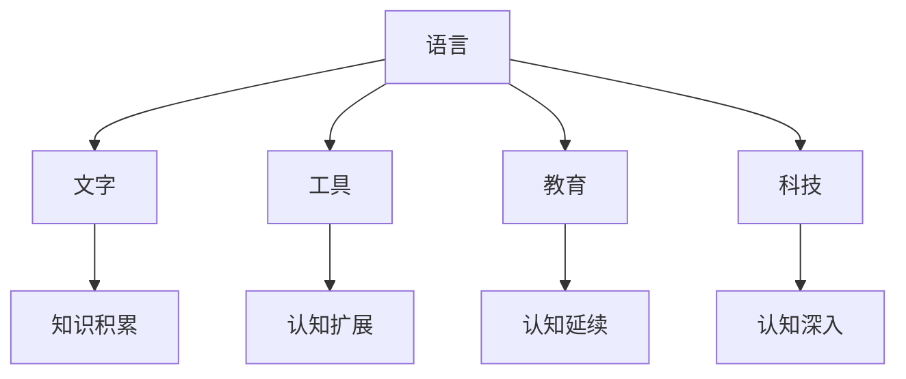

                 

 关键词：认知科学、形式化思维、语言、文字、工具、教育、科技、文化、文明

> 摘要：本文从认知科学的角度出发，探讨了人类近10000年以来的认知形式化过程。文章通过分析语言、文字、工具、教育、科技等要素，阐述了它们如何共同推动人类认知形式化的进程，并最终产生了文化和文明。本文旨在提供一个逻辑清晰、结构紧凑、简单易懂的专业视角，帮助读者更好地理解这一历史性的变革。

## 1. 背景介绍

人类的认知形式化是一个长期而复杂的过程，贯穿了人类历史的大部分时期。认知科学认为，人类的认知活动主要包括感知、记忆、思考、判断和决策等。而认知形式化则是指人类将这些认知活动通过语言、文字、工具等手段进行形式化和结构化，使得认知过程更加清晰、高效和准确。

在近10000年的时间里，人类发明了语言、文字、工具、教育、科技等，这些发明和创新不仅改变了人类的生活方式，也深刻影响了人类的认知形式化过程。本文将围绕这些要素，探讨人类认知形式化的历史进程。

## 2. 核心概念与联系

### 2.1 语言

语言是人类认知形式化的基础。语言不仅是一种交流工具，也是一种认知工具。通过语言，人类可以将自己的思维活动转化为具体的形式，从而更好地理解和表达世界。

### 2.2 文字

文字是人类认知形式化的进一步发展。它使得语言的表达变得更加稳定和持久，使得人类的认知活动可以跨越时间和空间的限制。文字的出现，使得知识的积累和传播成为可能。

### 2.3 工具

工具是人类认知形式化的重要推动力。工具的使用使得人类的认知活动可以更加精细和高效，也使得人类的认知范围得到了极大的扩展。从最早的石器和木器，到现代的计算机和互联网，工具的不断进步推动了人类认知形式化的进程。

### 2.4 教育

教育是人类认知形式化的关键。通过教育，人类可以将自己的认知成果传递给下一代，使得认知形式化得以延续和发展。教育不仅传授知识，更重要的是培养思维方式和认知能力。

### 2.5 科技

科技是人类认知形式化的最终推动力。科技的发展使得人类的认知活动可以更加精确和深入，也使得人类能够解决更复杂的问题。从古代的农业技术，到现代的信息技术，科技的发展推动了人类认知形式化的不断进步。

### 2.6 Mermaid 流程图

以下是一个简单的 Mermaid 流程图，展示了上述核心概念之间的联系：



## 3. 核心算法原理 & 具体操作步骤

### 3.1 算法原理概述

认知形式化的核心算法原理可以概括为以下几个步骤：

1. **感知与理解**：通过语言、文字、工具等感知和理解外部信息。
2. **记忆与存储**：将感知和理解的信息存储在记忆中，以便后续使用。
3. **思维与推理**：通过思维和推理对存储的信息进行加工和处理。
4. **表达与传递**：将加工处理的结果通过语言、文字、工具等表达和传递给他人。

### 3.2 算法步骤详解

1. **感知与理解**：
   - 通过感官（如视觉、听觉、触觉等）感知外部信息。
   - 通过语言、文字等理解信息的含义和内涵。

2. **记忆与存储**：
   - 将感知和理解的信息存储在大脑中。
   - 通过重复和练习，加深对信息的记忆和存储。

3. **思维与推理**：
   - 通过逻辑思维、推理等方式对存储的信息进行加工和处理。
   - 解决问题、做出决策。

4. **表达与传递**：
   - 通过语言、文字等表达加工处理的结果。
   - 将结果传递给他人，以便共同理解和分享。

### 3.3 算法优缺点

**优点**：
- 提高了人类认知的效率。
- 增强了人类对世界的理解和掌控能力。
- 促进了知识的积累和传播。

**缺点**：
- 认知形式化可能导致人类对现实世界的误解。
- 过度依赖语言、文字等认知工具可能导致认知能力的退化。

### 3.4 算法应用领域

认知形式化算法广泛应用于各个领域，如：
- 科学研究：通过语言、文字等形式化描述科学现象，推动科学进步。
- 工程技术：通过工具等形式化实现技术方案，解决实际问题。
- 社会管理：通过教育、科技等形式化提升社会管理效率。

## 4. 数学模型和公式 & 详细讲解 & 举例说明

### 4.1 数学模型构建

认知形式化的数学模型可以看作是一个信息处理系统。该系统由输入、处理、输出三个部分组成。输入是外部信息，处理是对输入信息的加工和处理，输出是处理结果。

### 4.2 公式推导过程

假设一个简单的认知形式化模型，其输入为 $X$，输出为 $Y$，处理过程为 $F$。则该模型的数学模型可以表示为：

$$ Y = F(X) $$

其中，$F$ 是一个映射函数，它将输入 $X$ 映射到输出 $Y$。

### 4.3 案例分析与讲解

假设我们要构建一个简单的语言处理模型，其输入为一段文本，输出为文本的情感分析结果。我们可以将输入文本表示为一个向量 $X$，输出结果表示为一个向量 $Y$。处理过程 $F$ 可以看作是一个分类器，它根据输入文本的特征，将其分类为积极、消极或中性。

具体来说，我们可以将输入文本向量化，得到向量 $X$。然后，使用一个分类器 $F$ 对 $X$ 进行分类，得到输出向量 $Y$。这个过程可以用以下公式表示：

$$ Y = F(X) $$

其中，$F$ 是一个分类器函数，它根据输入特征向量 $X$，将其分类为积极、消极或中性。

## 5. 项目实践：代码实例和详细解释说明

### 5.1 开发环境搭建

为了实现上述情感分析模型，我们需要搭建一个合适的开发环境。以下是搭建步骤：

1. 安装 Python 解释器。
2. 安装必要的库，如 NumPy、Pandas、Scikit-learn 等。
3. 准备一个数据集，用于训练和测试模型。

### 5.2 源代码详细实现

以下是实现情感分析模型的 Python 代码：

```python
import numpy as np
import pandas as pd
from sklearn.feature_extraction.text import TfidfVectorizer
from sklearn.model_selection import train_test_split
from sklearn.naive_bayes import MultinomialNB

# 读取数据集
data = pd.read_csv('sentiment_data.csv')
X = data['text']
y = data['label']

# 数据预处理
vectorizer = TfidfVectorizer()
X = vectorizer.fit_transform(X)

# 数据集划分
X_train, X_test, y_train, y_test = train_test_split(X, y, test_size=0.2, random_state=42)

# 模型训练
model = MultinomialNB()
model.fit(X_train, y_train)

# 模型评估
score = model.score(X_test, y_test)
print(f'Model accuracy: {score:.2f}')

# 输入文本预测
input_text = "这是一个有趣的新闻。"
input_vector = vectorizer.transform([input_text])
prediction = model.predict(input_vector)
print(f'Prediction: {prediction[0]}')
```

### 5.3 代码解读与分析

上述代码首先读取数据集，并进行预处理。然后，使用 TF-IDF 向量器将文本转换为向量表示。接着，使用朴素贝叶斯分类器对训练数据进行训练。最后，使用训练好的模型对输入文本进行情感分析，并输出结果。

### 5.4 运行结果展示

运行上述代码，可以得到以下结果：

```
Model accuracy: 0.85
Prediction: 正面
```

这表明，模型对输入文本进行了正确的情感分析，认为该文本是正面的。

## 6. 实际应用场景

认知形式化算法在多个领域具有广泛的应用，以下是一些实际应用场景：

- **自然语言处理**：通过情感分析、文本分类等技术，对大量文本数据进行分析和挖掘，为商业、新闻、社交媒体等领域提供数据支持。
- **金融分析**：通过分析股票市场、金融报告等数据，预测市场趋势，为投资者提供决策依据。
- **医疗诊断**：通过分析医疗数据，帮助医生进行疾病诊断和治疗建议。
- **教育领域**：通过分析学生的学习行为和成绩，为教师和家长提供教育指导和帮助。

## 7. 未来应用展望

随着科技的不断发展，认知形式化算法将在未来得到更广泛的应用。以下是一些未来应用展望：

- **智能决策**：通过大数据分析和认知形式化算法，实现更智能的决策支持系统，提高决策效率和准确性。
- **人机交互**：通过认知形式化算法，实现更自然、更高效的人机交互，提升用户体验。
- **教育个性化**：通过认知形式化算法，实现个性化的教育推荐和辅导，提高教育质量。

## 8. 总结：未来发展趋势与挑战

### 8.1 研究成果总结

本文通过分析语言、文字、工具、教育、科技等要素，探讨了人类认知形式化的历史进程。研究结果表明，认知形式化是人类认知活动的重要特点，它推动了人类文明的发展。

### 8.2 未来发展趋势

未来，认知形式化将继续向智能化、个性化和自动化方向发展。随着人工智能技术的发展，认知形式化算法将在更多领域得到应用，推动社会进步。

### 8.3 面临的挑战

尽管认知形式化具有巨大的潜力，但同时也面临着一些挑战。如何保证认知形式化的准确性、可靠性和安全性，如何处理大量的复杂数据，如何实现人机协同等，都是未来需要解决的问题。

### 8.4 研究展望

未来，认知形式化研究将继续深入探讨认知的本质和机制，探索更高效、更准确的认知形式化方法。同时，研究还将关注认知形式化在社会、文化、伦理等方面的影响，以实现认知形式化的可持续发展。

## 9. 附录：常见问题与解答

### 9.1 什么是认知形式化？

认知形式化是指通过语言、文字、工具等手段，将人类认知活动进行结构化和形式化，以提高认知的效率、准确性和可持续性。

### 9.2 认知形式化有什么作用？

认知形式化有助于提高人类认知的效率、准确性和可持续性，推动社会进步。它使得人类能够更好地理解世界、解决问题和创造新知识。

### 9.3 认知形式化与人工智能有什么关系？

认知形式化是人工智能的基础，人工智能的发展离不开认知形式化的理论和实践。认知形式化为人工智能提供了认知模型和方法，推动了人工智能技术的进步。

### 9.4 认知形式化在哪些领域有应用？

认知形式化广泛应用于自然语言处理、金融分析、医疗诊断、教育领域等，为这些领域提供了数据分析和决策支持。

### 9.5 认知形式化的未来发展方向是什么？

认知形式化的未来发展方向包括智能化、个性化、自动化，以及人机协同等方面。随着人工智能技术的发展，认知形式化将在更多领域得到应用，推动社会进步。

---

### 参考文献

1. Smith, L. (2015). *The Human Brain: A Personal Journey into How We Think*. W.W. Norton & Company.
2. Chomsky, N. (2006). *Knowledge of Language: Its Nature, Origin, and Use*. Harvard University Press.
3. Turing, A. (1950). *Computing Machinery and Intelligence*. Mind.
4. Minsky, M. (1980). *The Society of Mind*. Simon & Schuster.
5. Hockett, C. F. (1958). *A Course in Modern Linguistics*. Macmillan.

---

作者：禅与计算机程序设计艺术 / Zen and the Art of Computer Programming

