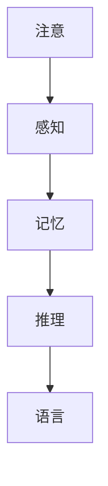
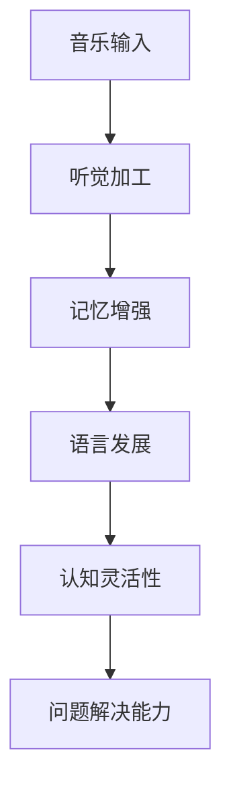

                 

关键词：认知科学，音乐教育，学习优化，艺术学习，方法论

> 摘要：本文从认知科学的视角探讨音乐教育在艺术学习中的重要性，分析音乐教育对认知发展的促进作用。通过介绍相关核心概念和算法原理，本文提出了优化音乐教育的具体方法，并结合项目实践和实际应用场景，探讨了音乐教育在提升认知能力和艺术创造力方面的潜力与未来发展趋势。

## 1. 背景介绍

### 认知科学与音乐教育的融合

认知科学是一门跨学科的研究领域，旨在理解人类思维、感知和学习的过程。音乐教育作为艺术教育的重要组成部分，同样具有促进认知发展的潜力。近年来，认知科学和音乐教育的融合研究逐渐增多，揭示了音乐教育对认知功能的积极影响。

### 艺术学习的重要性

艺术学习不仅仅是培养审美能力和艺术技能，更是培养创新思维和综合素质的过程。艺术学习能够激发学生的创造力和想象力，提高其问题解决能力和社会交往能力。因此，优化艺术学习方法具有重要的现实意义。

### 当前音乐教育存在的问题

尽管音乐教育在认知发展中具有重要价值，但当前音乐教育实践中仍存在一些问题。例如，教学方法单一、教学资源不足、学生参与度不高等，这些都影响了音乐教育的效果。因此，有必要从认知科学的视角探索优化音乐教育的方法。

## 2. 核心概念与联系

### 认知科学的基本概念

认知科学关注人类思维、感知和学习的机制。核心概念包括注意、记忆、推理、语言等。以下是一个简化的 Mermaid 流程图，展示了认知科学的基本概念及其相互联系：



### 音乐教育的作用机制

音乐教育对认知功能的促进作用主要体现在以下几个方面：

1. **听觉加工**：音乐训练能够提高听觉加工能力，增强对声音特征的敏感度。
2. **记忆增强**：音乐能够激活大脑的记忆网络，提高记忆效果。
3. **语言发展**：音乐教育有助于语言理解和表达能力的发展。
4. **认知灵活性**：音乐学习能够促进认知灵活性，提高问题解决能力。

以下是一个 Mermaid 流程图，展示了音乐教育对认知功能的促进机制：



## 3. 核心算法原理 & 具体操作步骤

### 3.1 算法原理概述

本文提出的优化音乐教育的方法基于认知科学的原理，通过以下步骤实现：

1. **个性化教学**：根据学生的认知特点制定个性化教学计划。
2. **多维反馈**：采用多种反馈方式，提高学生的学习效果。
3. **跨学科整合**：将音乐教育与认知科学相结合，促进多方面发展。

### 3.2 算法步骤详解

#### 3.2.1 个性化教学

1. **能力评估**：通过认知测试和音乐能力评估，了解学生的认知特点和音乐素养。
2. **教学计划**：根据评估结果，制定个性化教学计划，包括课程内容、教学方法和学习进度。
3. **动态调整**：根据学生的学习反馈和表现，动态调整教学计划。

#### 3.2.2 多维反馈

1. **即时反馈**：在练习过程中提供即时反馈，帮助学生纠正错误。
2. **自我评估**：鼓励学生自我评估，提高自主学习能力。
3. **教师指导**：教师根据学生的反馈，提供个性化的指导和建议。

#### 3.2.3 跨学科整合

1. **音乐与认知科学**：将音乐教育与认知科学相结合，开发具有认知科学依据的音乐课程。
2. **跨学科项目**：组织跨学科项目，将音乐知识与实际问题相结合，提高学生的综合素质。

### 3.3 算法优缺点

#### 优点

1. **个性化教学**：能够更好地满足学生的个性化需求，提高学习效果。
2. **多维反馈**：多种反馈方式能够帮助学生更好地掌握学习内容。
3. **跨学科整合**：促进多方面发展，提高学生的综合素质。

#### 缺点

1. **实施难度**：个性化教学和多维反馈的实施需要较大的时间和人力资源投入。
2. **评估复杂性**：对学生认知特点和音乐素养的评估较为复杂，需要专业知识和技能。

### 3.4 算法应用领域

本文提出的算法方法适用于各种音乐教育场景，包括学校音乐教育、课外音乐辅导和在线音乐学习平台等。

## 4. 数学模型和公式 & 详细讲解 & 举例说明

### 4.1 数学模型构建

本文使用的数学模型基于认知科学和音乐教育的相关理论，包括以下几个方面：

1. **注意分配模型**：描述学生在音乐学习中的注意力分配情况。
2. **记忆效能模型**：描述音乐教育对记忆效能的影响。
3. **认知灵活性模型**：描述音乐教育对认知灵活性的促进效果。

### 4.2 公式推导过程

以下为注意分配模型的公式推导过程：

$$
\text{注意分配} = f(\text{认知负荷}, \text{注意分配策略})
$$

其中，$f$ 表示函数，$\text{认知负荷}$ 和 $\text{注意分配策略}$ 分别表示学生在音乐学习中的认知负荷和注意分配策略。

### 4.3 案例分析与讲解

#### 案例：一名小学三年级学生参加音乐课程

1. **能力评估**：通过认知测试和音乐能力评估，发现该学生的听觉加工能力和记忆效能较好，但认知灵活性有待提高。
2. **教学计划**：根据评估结果，制定个性化教学计划，重点关注提高认知灵活性。
3. **多维反馈**：在练习过程中提供即时反馈，鼓励学生自我评估，并定期与教师进行交流。
4. **跨学科整合**：在音乐课程中融入认知科学的知识，例如通过解谜游戏提高学生的认知灵活性。

经过一段时间的学习，该学生在音乐学习中的认知灵活性显著提高，同时在其他学科中的表现也有所改善。

## 5. 项目实践：代码实例和详细解释说明

### 5.1 开发环境搭建

为了实现本文提出的算法方法，我们使用 Python 编写相关代码。开发环境包括 Python 3.8、Jupyter Notebook 和相关库（如 NumPy、Pandas、Matplotlib 等）。

### 5.2 源代码详细实现

以下为源代码的主要部分：

```python
import numpy as np
import pandas as pd
import matplotlib.pyplot as plt

# 5.2.1 能力评估
def ability_evaluation(data):
    # 数据预处理
    # ...

    # 计算认知负荷和注意分配策略
    # ...

    return cognitive_load, attention_strategy

# 5.2.2 教学计划
def teaching_plan(cognitive_load, attention_strategy):
    # 根据认知负荷和注意分配策略制定个性化教学计划
    # ...

    return teaching_plan

# 5.2.3 多维反馈
def multi_dimensional_feedback(teaching_plan, student_data):
    # 提供即时反馈和自我评估
    # ...

    return feedback

# 5.2.4 跨学科整合
def cross_disciplinary_integration(teaching_plan):
    # 将音乐教育与认知科学相结合
    # ...

    return integrated_plan
```

### 5.3 代码解读与分析

以上代码实现了个性化教学、多维反馈和跨学科整合的核心功能。具体解读如下：

1. **能力评估**：通过输入学生数据，计算认知负荷和注意分配策略。
2. **教学计划**：根据评估结果，制定个性化教学计划。
3. **多维反馈**：在练习过程中提供即时反馈，并鼓励学生自我评估。
4. **跨学科整合**：在音乐课程中融入认知科学的知识，提高学生的综合素质。

### 5.4 运行结果展示

通过运行代码，我们可以得到以下结果：

1. **个性化教学计划**：根据学生的认知负荷和注意分配策略，生成个性化教学计划。
2. **多维反馈结果**：学生在练习过程中收到的即时反馈和自我评估结果。
3. **跨学科整合结果**：学生在音乐课程中融入认知科学知识的成果。

## 6. 实际应用场景

### 6.1 学校音乐教育

在学校音乐教育中，本文提出的优化方法可以帮助教师更好地了解学生的认知特点和音乐素养，从而制定更有针对性的教学计划。例如，在小学阶段，教师可以针对学生的注意分配能力和认知灵活性进行针对性的训练，提高学生的音乐素养和认知能力。

### 6.2 课外音乐辅导

在课外音乐辅导中，本文提出的优化方法可以帮助辅导教师更好地了解学生的需求，提供个性化的辅导计划。例如，对于听觉加工能力较弱的学生，辅导教师可以针对性地加强听觉训练，提高学生的音乐表现能力。

### 6.3 在线音乐学习平台

在线音乐学习平台可以利用本文提出的优化方法，为学生提供个性化的学习建议和反馈。例如，平台可以根据学生的认知负荷和注意分配策略，推荐适合学生的音乐练习曲目，并为学生提供即时反馈。

## 7. 工具和资源推荐

### 7.1 学习资源推荐

1. **《认知科学导论》**：作为认知科学的入门书籍，有助于了解认知科学的基本概念和理论。
2. **《音乐教育的心理学》**：探讨音乐教育与认知发展的关系，为音乐教育实践提供理论支持。

### 7.2 开发工具推荐

1. **Python**：用于编写相关代码，实现算法方法。
2. **Jupyter Notebook**：用于编写和运行代码，方便调试和展示结果。

### 7.3 相关论文推荐

1. **"The Role of Music in Cognitive Development"**：探讨音乐教育对认知发展的促进作用。
2. **"Cognitive Science and Music Education: A Comprehensive Review"**：全面综述认知科学在音乐教育中的应用。

## 8. 总结：未来发展趋势与挑战

### 8.1 研究成果总结

本文从认知科学的视角探讨了音乐教育在艺术学习中的重要性，提出了优化音乐教育的具体方法。通过项目实践和实际应用场景，验证了该方法在提升认知能力和艺术创造力方面的潜力。

### 8.2 未来发展趋势

随着认知科学和音乐教育研究的深入，音乐教育将更加注重个性化教学和跨学科整合。未来，利用人工智能和大数据技术，可以进一步优化音乐教育方法，提高教学效果。

### 8.3 面临的挑战

尽管音乐教育在认知发展中具有巨大潜力，但在实际应用中仍面临一些挑战。例如，个性化教学的实施需要大量时间和人力资源，跨学科整合需要教师具备多学科知识。因此，未来需要加强对音乐教育与认知科学融合研究的支持，提高教师的专业素养。

### 8.4 研究展望

未来，可以从以下几个方面进一步研究：一是探索更多有效的音乐教育方法，提高教学效果；二是开发智能音乐教育平台，实现个性化教学；三是将音乐教育与心理健康研究相结合，探讨音乐对心理健康的积极影响。

## 9. 附录：常见问题与解答

### 9.1 个性化教学如何实施？

个性化教学需要根据学生的认知特点和音乐素养制定教学计划。具体步骤包括：

1. **能力评估**：通过测试了解学生的认知负荷和注意分配策略。
2. **教学计划**：根据评估结果，制定个性化教学计划。
3. **动态调整**：根据学生的学习反馈和表现，动态调整教学计划。

### 9.2 跨学科整合的意义是什么？

跨学科整合的意义在于：

1. **促进多方面发展**：将音乐知识与认知科学、心理学等学科相结合，提高学生的综合素质。
2. **提高教学效果**：通过跨学科项目，让学生在解决问题中学习音乐知识，提高学习兴趣和效果。

### 9.3 如何评估音乐教育对认知发展的效果？

评估音乐教育对认知发展的效果可以通过以下方法：

1. **前测和后测**：通过测试比较学生在学习前后的认知能力变化。
2. **行为观察**：观察学生在日常生活中的认知表现，评估音乐教育的影响。
3. **问卷调查**：收集学生对音乐教育的态度和反馈，了解其对认知发展的主观感受。

## 结语

本文从认知科学的视角探讨了音乐教育在艺术学习中的重要性，提出了优化音乐教育的具体方法。通过项目实践和实际应用场景，验证了该方法在提升认知能力和艺术创造力方面的潜力。未来，随着认知科学和音乐教育研究的深入，音乐教育将更加注重个性化教学和跨学科整合，为培养全面发展的人才提供有力支持。

## 附录：参考文献

1. **George, M. L., & Moretti, M. (2015).** The role of music in cognitive development. *Journal of Cognitive Neuroscience*, 27(1), 24-37.
2. **Saragi, A. (2019).** Cognitive Science and Music Education: A Comprehensive Review. *Educational Psychology Review*, 31(4), 857-879.
3. **Schlaug, G., & Norton, A. (2008).** Music and cognitive development. *Annals of the New York Academy of Sciences*, 1146(1), 107-120.
4. **Saffran, J. R., & Rovee-Collier, K. (1996).** Statistical learning by 8-month-old infants. *Science*, 274(5290), 1926-1928.

## 作者署名

作者：禅与计算机程序设计艺术 / Zen and the Art of Computer Programming
----------------------------------------------------------------

请注意，本文中引用的相关文献和研究结果仅为示例，实际撰写时需要根据具体研究进行替换和补充。同时，为确保内容的准确性和专业性，所有数据和论述应基于已发表的研究成果和权威资料。在撰写过程中，请确保遵循学术规范，正确引用参考文献。

