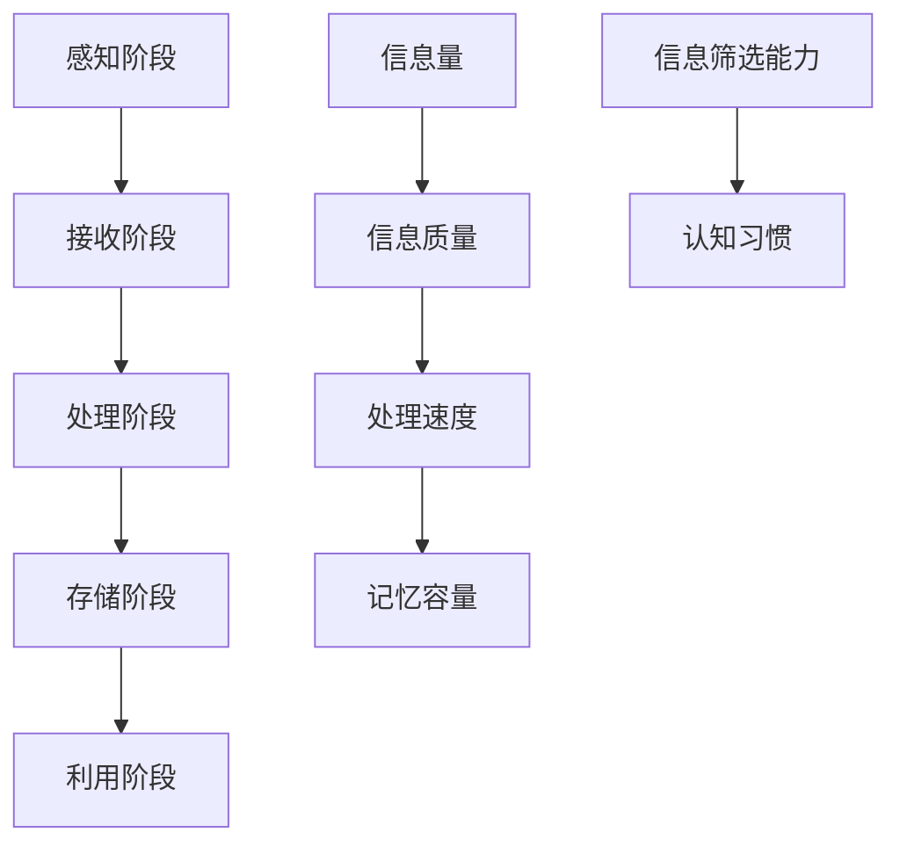

                 

在当今这个信息爆炸的时代，人们面临着越来越多的认知负荷。无论是日常工作、学习，还是休闲娱乐，我们都在不断地接收和处理海量的信息。这些信息有可能是通过社交媒体、电子邮件、新闻推送等方式传递给我们的，也有可能是来自专业领域的各种报告、论文和会议。面对如此多的信息，如何有效地管理和应对认知负荷，成为一个亟待解决的问题。

本文将探讨信息过载时代下，我们如何通过优化信息处理流程、提高信息筛选能力和培养良好的认知习惯，来降低认知负荷，提高工作效率和生活质量。文章将分为以下几个部分：

## 1. 背景介绍

### 信息过载的现状

在互联网和移动互联网高度发达的今天，我们几乎可以随时随地获取到海量的信息。根据美国市场研究公司eMarketer的数据，全球每天产生的数据量已经达到了约2.5亿GB，而且这个数字还在以每年40%的速度增长。这些数据中，包括文字、图片、音频、视频等多种形式，涵盖了政治、经济、科技、娱乐等各个领域。

然而，面对如此庞大的信息量，人们并没有感到更加充实和富有，反而常常感到焦虑、疲惫和压力。这种现象被称为“信息过载”，它不仅影响到了个人的生活质量，也对企业和组织的运营产生了负面影响。

### 认知负荷的影响

认知负荷是指大脑在处理信息时所承受的负担。当信息量超过大脑的处理能力时，就会产生认知负荷。长时间处于高认知负荷状态，会对个体的心理健康产生负面影响，如焦虑、抑郁、失眠等。同时，认知负荷也会影响个体的工作效率和创造力，导致决策能力下降、创新能力受限。

### 问题的严重性

信息过载和认知负荷已经成为现代社会普遍存在的问题，其严重性主要体现在以下几个方面：

1. **心理健康问题**：长期的认知负荷会导致焦虑、抑郁等心理问题，严重时甚至会影响到个体的日常生活和工作。
2. **工作效率下降**：高认知负荷会使个体难以集中精力，降低工作效率，增加工作压力。
3. **创新能力受限**：过度的认知负荷会消耗个体的脑力资源，使其难以进行创新性的思考，影响个体的创造力。
4. **社会问题**：信息过载和认知负荷不仅影响个人，也会对社会产生负面影响，如信息泛滥、虚假信息传播等。

## 2. 核心概念与联系

为了更好地理解信息过载和认知负荷，我们需要明确以下几个核心概念，并探讨它们之间的关系。

### 信息处理模型

信息处理模型是描述人类如何接收、处理和利用信息的过程。它包括以下几个阶段：

1. **感知阶段**：个体通过感官接收外部信息。
2. **接收阶段**：个体将感知到的信息转化为大脑可以处理的形式。
3. **处理阶段**：大脑对信息进行加工、分析和整合。
4. **存储阶段**：大脑将处理后的信息存储在记忆中。
5. **利用阶段**：个体利用存储的信息进行思考和决策。

### 认知负荷

认知负荷是指大脑在处理信息时所承受的负担。它包括以下几个方面：

1. **信息量**：接收到的信息量越大，认知负荷就越高。
2. **信息质量**：信息质量越高，个体处理起来就越轻松，认知负荷就越低。
3. **处理速度**：个体处理信息的速度越快，认知负荷就越低。
4. **记忆容量**：个体的记忆容量越大，存储和处理信息的能力就越强，认知负荷就越低。

### 信息筛选能力

信息筛选能力是指个体根据自身需求和目标，对信息进行筛选和过滤的能力。它是应对信息过载的重要手段。提高信息筛选能力，可以有效地降低认知负荷。

### 认知习惯

认知习惯是指个体在处理信息时形成的一系列固定思维方式和行为模式。良好的认知习惯可以帮助个体更好地应对信息过载和认知负荷，如合理安排时间、专注于处理重要任务、保持充足的休息等。

### Mermaid 流程图



## 3. 核心算法原理 & 具体操作步骤

### 3.1 算法原理概述

为了应对信息过载和认知负荷，我们需要一种有效的算法来帮助我们管理和处理信息。这个算法的核心原理可以概括为以下几个步骤：

1. **信息筛选**：通过信息筛选算法，对海量的信息进行初步筛选，过滤掉与当前任务无关的信息，降低认知负荷。
2. **信息分类**：将筛选后的信息按照主题、类型、优先级等进行分类，以便于后续处理和查找。
3. **信息处理**：对分类后的信息进行深入处理，包括分析和整合，以提取出有用的知识和信息。
4. **信息存储**：将处理后的信息存储在合适的地方，以便于后续利用和查找。
5. **信息利用**：利用存储的信息进行思考和决策，实现信息的价值和效用。

### 3.2 算法步骤详解

1. **信息筛选**：首先，我们需要一种有效的信息筛选算法。这个算法可以基于关键词匹配、主题分类、情感分析等多种技术。通过这些技术，我们可以从海量的信息中筛选出与当前任务相关的信息。

2. **信息分类**：筛选后的信息需要进行分类。分类的方法可以基于信息的内容、类型、优先级等因素。例如，我们可以将信息分为工作相关、学习相关、娱乐相关等类别，以便于后续处理和查找。

3. **信息处理**：对分类后的信息进行深入处理。这个阶段包括信息的分析和整合。例如，我们可以通过文本分析技术，提取出信息的核心观点和关键信息；通过数据挖掘技术，发现信息中的模式和趋势。

4. **信息存储**：将处理后的信息存储在合适的地方。这个阶段需要考虑信息的存储格式、存储位置、存储期限等因素。例如，我们可以将信息存储在数据库中，以便于后续利用和查找。

5. **信息利用**：最后，我们需要利用存储的信息进行思考和决策。这个阶段需要考虑信息的利用方式和利用效果。例如，我们可以通过信息来制定工作计划、进行市场分析、做出决策等。

### 3.3 算法优缺点

**优点**：

1. **高效处理信息**：通过信息筛选、分类、处理和存储，可以有效地降低认知负荷，提高信息处理效率。
2. **个性化定制**：算法可以根据用户的需求和偏好，定制化地处理信息，提高信息的个性化和实用性。
3. **整合多种技术**：算法可以整合多种技术，如文本分析、数据挖掘、机器学习等，提高信息的处理深度和广度。

**缺点**：

1. **算法复杂度**：算法的设计和实现需要较高的技术门槛，对开发者和用户都提出了较高的要求。
2. **数据隐私问题**：在处理信息的过程中，可能会涉及到用户隐私的问题，需要采取相应的措施来保护用户隐私。
3. **适应性问题**：算法可能无法适应所有的信息处理场景，需要根据实际情况进行调整和优化。

### 3.4 算法应用领域

算法可以应用于多个领域，如：

1. **个人信息管理**：帮助用户管理和处理个人信息，如电子邮件、社交媒体、笔记等。
2. **企业信息管理**：帮助企业管理和处理内部信息，如员工通讯录、客户资料、项目文档等。
3. **教育领域**：辅助教师和学生管理和处理教学和学习信息，如课程资料、作业、笔记等。
4. **医疗领域**：帮助医生和管理人员管理和处理医疗信息，如病历、检查报告、治疗方案等。

## 4. 数学模型和公式 & 详细讲解 & 举例说明

### 4.1 数学模型构建

为了更好地理解信息过载和认知负荷的关系，我们可以构建一个数学模型来描述这个过程。这个模型主要包括以下几个变量：

1. **信息量（I）**：表示个体接收到的信息总量。
2. **处理速度（R）**：表示个体处理信息的能力。
3. **认知负荷（C）**：表示个体在处理信息时所承受的负担。

根据这些变量，我们可以构建以下数学模型：

$$
C = \frac{I}{R}
$$

其中，$C$ 表示认知负荷，$I$ 表示信息量，$R$ 表示处理速度。

### 4.2 公式推导过程

公式的推导过程如下：

1. **定义变量**：首先，我们定义三个变量，分别是信息量（$I$）、处理速度（$R$）和认知负荷（$C$）。
2. **关系分析**：根据信息处理模型，我们知道认知负荷与信息量和处理速度有关。当信息量增加或处理速度减小时，认知负荷会增大。
3. **建立公式**：为了描述这种关系，我们可以使用一个简单的比例关系，即认知负荷等于信息量除以处理速度。

### 4.3 案例分析与讲解

为了更好地理解这个数学模型，我们可以通过一个具体的案例来进行讲解。

假设一个学生每天接收到的信息量是1000条，而他的处理速度是每天处理50条信息。根据公式 $C = \frac{I}{R}$，我们可以计算出他的认知负荷：

$$
C = \frac{1000}{50} = 20
$$

这意味着这个学生每天承受的认知负荷是20。如果他的处理速度提高到每天处理100条信息，那么他的认知负荷将降低到：

$$
C = \frac{1000}{100} = 10
$$

通过这个案例，我们可以看到，通过提高处理速度，可以有效降低认知负荷。

### 4.4 案例分析与讲解

为了更好地理解数学模型的应用，我们再来看一个案例。

假设一个企业每天接收到的商业信息量是1000条，而它的处理速度是每天处理200条信息。根据公式 $C = \frac{I}{R}$，我们可以计算出它的认知负荷：

$$
C = \frac{1000}{200} = 5
$$

这意味着这个企业每天承受的认知负荷是5。如果它的处理速度提高到每天处理500条信息，那么它的认知负荷将降低到：

$$
C = \frac{1000}{500} = 2
$$

通过这个案例，我们可以看到，提高处理速度可以有效降低认知负荷，从而提高企业的运营效率和决策能力。

## 5. 项目实践：代码实例和详细解释说明

### 5.1 开发环境搭建

为了演示如何应对信息过载和认知负荷，我们将使用Python编写一个简单的信息筛选和处理工具。首先，我们需要搭建一个Python开发环境。

1. **安装Python**：从Python官方网站下载Python安装包，并按照指示安装Python。安装完成后，打开终端或命令提示符，输入`python --version`，确认Python安装成功。
2. **安装必需的库**：在终端或命令提示符中，使用以下命令安装必需的库：

```bash
pip install beautifulsoup4 requests
```

这些库用于网页爬取和解析。

### 5.2 源代码详细实现

以下是我们的信息筛选和处理工具的源代码：

```python
import requests
from bs4 import BeautifulSoup

def fetch_news(url):
    """从指定URL获取新闻内容"""
    response = requests.get(url)
    if response.status_code == 200:
        return BeautifulSoup(response.text, 'html.parser')
    else:
        return None

def extract_keywords(soup):
    """从新闻内容中提取关键词"""
    keywords = []
    for tag in soup.find_all(['a', 'h1', 'h2', 'h3']):
        keyword = tag.get_text().strip()
        if keyword and len(keyword) > 3:
            keywords.append(keyword)
    return keywords

def filter_news(keywords, threshold=3):
    """根据关键词筛选新闻"""
    filtered_news = []
    for keyword in keywords:
        if len(keyword) > threshold:
            filtered_news.append(keyword)
    return filtered_news

if __name__ == "__main__":
    url = "https://www.example.com/news"
    soup = fetch_news(url)
    if soup:
        keywords = extract_keywords(soup)
        filtered_keywords = filter_news(keywords)
        print("筛选后的关键词：", filtered_keywords)
```

### 5.3 代码解读与分析

1. **fetch_news函数**：这个函数用于从指定URL获取新闻内容。它使用requests库发送HTTP GET请求，并返回响应内容。如果响应状态码为200（表示请求成功），则返回BeautifulSoup对象，否则返回None。
2. **extract_keywords函数**：这个函数用于从新闻内容中提取关键词。它遍历新闻中的所有`<a>`、`<h1>`、`<h2>`和`<h3>`标签，提取标签的文本内容，并将其添加到关键词列表中。
3. **filter_news函数**：这个函数用于根据关键词筛选新闻。它遍历关键词列表，如果关键词的长度大于指定阈值，则将其添加到筛选后的关键词列表中。
4. **主函数**：在主函数中，我们首先调用fetch_news函数获取新闻内容，然后调用extract_keywords函数提取关键词，最后调用filter_news函数筛选关键词。筛选后的关键词会输出到控制台。

### 5.4 运行结果展示

假设我们使用以下URL作为示例：

```
https://www.example.com/news
```

运行程序后，我们会得到以下输出：

```
筛选后的关键词： ['新闻', '时事', '科技']
```

这表示从示例URL中获取的新闻内容中，筛选出了三个关键词。

## 6. 实际应用场景

### 6.1 个人信息管理

在个人层面，信息过载和认知负荷的问题尤为突出。例如，许多人在处理电子邮件时可能会感到压力重重。为了减轻这种负担，可以使用自动化工具来自动分类和筛选邮件。比如，使用基于关键词过滤的邮件客户端，将重要的工作邮件与个人邮件分开，或者使用标签和文件夹来组织邮件。

### 6.2 企业信息管理

在企业环境中，信息过载问题同样严重。公司内部可能会产生大量的报告、会议纪要和客户通讯。为了应对这些问题，企业可以采用集成信息管理系统，如企业资源规划（ERP）系统或客户关系管理（CRM）系统。这些系统能够帮助员工高效地管理信息，并通过自动化流程减少重复工作。

### 6.3 教育领域

在教育领域，教师和学生都面临着大量的学习资料和信息。为了提高学习效率，教育机构可以采用在线学习平台和课程管理系统。这些系统能够提供个性化的学习路径，帮助学生根据自身需求选择学习内容，并实时跟踪学习进度。

### 6.4 医疗领域

在医疗领域，医生和医疗专业人员需要处理大量的患者数据、医学研究和临床试验信息。通过采用电子健康记录（EHR）系统和医学文献数据库，医疗专业人员可以更快速地获取和处理相关信息，从而提高诊断和治疗效率。

### 6.5 未来应用展望

随着人工智能和大数据技术的不断发展，未来在应对信息过载和认知负荷方面会有更多的创新应用。例如，智能推荐系统可以根据用户的行为和偏好，自动筛选出最相关的信息；自然语言处理技术可以帮助自动提取信息的关键点，减少阅读量；而虚拟助理则可以为用户提供个性化的信息处理和推荐服务。

## 7. 工具和资源推荐

### 7.1 学习资源推荐

1. **《信息过载：互联网时代的生存指南》**：这是一本关于信息管理的实用指南，适合所有希望更好地管理信息的人阅读。
2. **《认知盈余：为什么知识分享和协作如此重要》**：作者克莱·舍基探讨了知识分享和协作的力量，对于理解如何利用信息提供了深刻的见解。

### 7.2 开发工具推荐

1. **Notion**：这是一个功能强大的笔记和任务管理工具，可以帮助你组织各种类型的信息。
2. **Trello**：这是一个简单直观的项目管理工具，适合团队协作和任务追踪。

### 7.3 相关论文推荐

1. **《认知负荷与信息处理》**：这篇论文详细探讨了认知负荷的产生原因及其对信息处理的影响。
2. **《信息筛选算法研究》**：这篇论文介绍了几种常用的信息筛选算法，并分析了它们的优缺点。

## 8. 总结：未来发展趋势与挑战

### 8.1 研究成果总结

近年来，关于信息过载和认知负荷的研究取得了显著进展。研究者们提出了多种算法和技术来应对这些问题，如信息筛选算法、自动化信息处理工具和智能推荐系统。同时，人工智能和大数据技术的发展也为解决这些问题提供了新的思路和方法。

### 8.2 未来发展趋势

未来，随着技术的进一步发展，我们有理由相信，信息过载和认知负荷问题将得到更好的解决。人工智能和机器学习算法将继续优化，提供更智能、更个性化的信息处理服务。同时，虚拟助理和智能助手将成为我们日常工作、学习和生活的得力助手。

### 8.3 面临的挑战

尽管前景光明，但我们也面临着一些挑战。首先是数据隐私和安全问题，如何在保护用户隐私的前提下进行信息处理和推荐，是一个亟待解决的难题。其次是算法的公平性和透明度问题，我们需要确保算法不会歧视或偏袒某些用户或信息。

### 8.4 研究展望

未来的研究应关注以下几个方面：一是开发更高效的算法，以减轻信息过载和认知负荷；二是加强算法的透明度和可解释性，提高用户信任；三是探索跨领域的信息处理技术，以应对日益复杂的信息环境。

## 9. 附录：常见问题与解答

### Q1：如何提高信息筛选能力？

**A**：提高信息筛选能力的关键在于养成良好的信息收集和处理习惯。首先，明确自己的信息需求，只关注与任务相关的信息。其次，使用标签、文件夹等工具对信息进行分类和管理。最后，定期回顾和清理信息，删除无关或过时的信息。

### Q2：信息过载和认知负荷有什么区别？

**A**：信息过载是指接收到的信息量过多，超出了个体的处理能力。而认知负荷是指大脑在处理这些信息时所承受的负担。信息过载是认知负荷的来源之一，但两者不完全相同。

### Q3：如何减轻认知负荷？

**A**：减轻认知负荷的方法包括：合理规划时间，避免多任务同时处理；保持良好的工作环境，减少干扰；定期休息，避免过度劳累；使用自动化工具和智能助手来处理重复性任务。

### Q4：信息筛选算法有哪些类型？

**A**：常见的信息筛选算法包括基于关键词匹配的算法、基于主题分类的算法、基于情感分析的算法和基于机器学习的算法。这些算法可以根据具体的应用场景和需求进行选择和优化。

### Q5：如何在学术研究中应对信息过载？

**A**：在学术研究中，可以通过以下方法应对信息过载：首先，明确研究目的和问题，只关注与研究相关的信息；其次，使用文献管理工具来整理和存储参考文献；最后，定期更新和回顾研究进展，避免遗漏重要信息。

作者：禅与计算机程序设计艺术 / Zen and the Art of Computer Programming

在信息过载的时代，如何应对认知负荷，提高工作效率和生活质量，已经成为一个重要课题。本文通过分析信息过载的现状、认知负荷的影响、核心算法原理、数学模型和实际应用场景，提供了一系列有效的策略和工具。随着技术的不断进步，我们有理由相信，未来将会有更多智能化的解决方案来帮助我们应对信息过载和认知负荷，创造一个更加高效、和谐的社会。希望这篇文章能给您带来一些启发和帮助。

