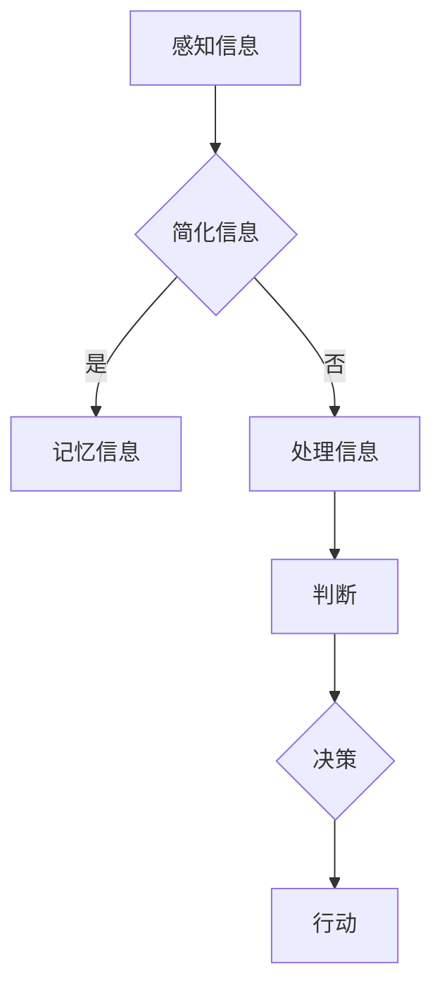

                 

关键词：认知过程、复杂性理论、算法、人机交互、数据处理、信息整合、思维模式、人工智能、神经科学、心理模型。

> 摘要：本文旨在探讨认知过程中的简单与复杂的关系，从心理学、神经科学、计算机科学的角度出发，分析人类如何感知和处理信息，如何将复杂的信息简化为简单的模式。同时，文章将探讨当前人工智能在认知过程中的应用，以及未来可能的发展方向。

## 1. 背景介绍

人类的认知过程是一个复杂而高度组织的过程，它涉及从感知到记忆、从判断到决策等多个环节。在过去的几十年中，随着计算机科学、心理学、神经科学等领域的快速发展，人们对认知过程的理解也在不断深入。然而，尽管我们已经有了一些关于认知过程的基础知识，但对于如何将复杂的认知过程简化为简单有效的算法，我们仍然有很多未知。

本文将结合心理学、神经科学和计算机科学的研究成果，探讨认知过程中的简单与复杂的关系。我们将首先介绍一些核心概念，包括复杂性理论、认知模型等，然后通过具体案例来展示人类如何处理复杂信息，并尝试将之简化。最后，我们将探讨人工智能在认知过程中的应用，以及未来可能的发展方向。

## 2. 核心概念与联系

### 2.1 复杂性理论

复杂性理论是研究复杂系统的性质和行为的学科。复杂性理论关注的是系统的整体行为，而不是个别组成部分的行为。复杂性理论认为，复杂系统的行为往往难以预测，因为它受到许多未知因素的影响。

在认知过程中，我们面对的信息往往是复杂的。例如，一个城市交通网络中的车流就是一个复杂的系统，它受到许多因素的影响，如道路状况、车辆数量、司机行为等。然而，尽管这些信息是复杂的，我们仍然能够有效地感知和处理它们。这是因为在我们的认知过程中，有一些机制能够将这些复杂的信息简化为简单的模式。

### 2.2 认知模型

认知模型是描述人类如何感知、处理和记忆信息的模型。不同的认知模型从不同的角度来解释认知过程，但它们都试图回答同一个问题：人类是如何处理复杂信息的？

例如，图灵机模型认为，人类的思维可以模拟为一个简单的计算过程，这个过程可以通过一个图灵机来表示。而神经网络模型则认为，人类的思维是一个由神经元组成的网络，这些神经元通过连接和激活来处理信息。

### 2.3 Mermaid 流程图

以下是一个简单的 Mermaid 流程图，展示了人类如何处理复杂信息的过程：



在这个流程图中，A 表示感知信息，B 表示简化信息，C 表示记忆信息，D 表示处理信息，E 表示判断，F 表示决策，G 表示行动。

## 3. 核心算法原理 & 具体操作步骤

### 3.1 算法原理概述

在认知过程中，简化信息是一个非常重要的步骤。这是因为，复杂的 信息往往难以处理，而简单的信息则更容易理解和记忆。简化信息的算法主要包括以下几种：

1. **模式识别**：通过识别重复的模式来简化信息。例如，我们可以通过识别一个城市交通网络中的常见路径来简化交通信息。
2. **归纳推理**：通过从特定实例中归纳出一般规律来简化信息。例如，我们可以通过观察多个城市的交通情况，归纳出一个普遍适用的交通规律。
3. **抽象化**：通过抽象化来简化信息。例如，我们可以将一个复杂的交通网络抽象为一个简单的路径图。

### 3.2 算法步骤详解

1. **感知信息**：首先，我们需要感知信息。这可以通过各种传感器来实现，如视觉、听觉、触觉等。
2. **预处理**：对感知到的信息进行预处理，如去噪、滤波等。
3. **模式识别**：通过模式识别来识别重复的模式。这可以通过机器学习算法来实现，如神经网络、支持向量机等。
4. **归纳推理**：通过归纳推理来从特定实例中归纳出一般规律。这可以通过逻辑推理、概率论等方法来实现。
5. **抽象化**：通过抽象化来简化信息。这可以通过语义网络、概念层次结构等方法来实现。
6. **记忆信息**：将简化后的信息记忆下来，以便后续使用。
7. **处理信息**：根据简化后的信息进行处理。这可能包括判断、决策、行动等步骤。

### 3.3 算法优缺点

- **优点**：简化信息有助于我们更有效地处理复杂信息，提高认知效率。
- **缺点**：简化信息可能导致信息的丢失，降低信息的准确性。

### 3.4 算法应用领域

简化信息的算法在许多领域都有广泛的应用，如：

1. **计算机视觉**：通过模式识别来简化图像信息。
2. **自然语言处理**：通过归纳推理来简化语言信息。
3. **数据挖掘**：通过抽象化来简化大量数据。

## 4. 数学模型和公式 & 详细讲解 & 举例说明

### 4.1 数学模型构建

在认知过程中，数学模型可以帮助我们理解和预测信息处理的结果。一个简单的数学模型可以表示为：

\[ X = f(Y) \]

其中，X 表示处理后的信息，Y 表示原始信息，f 表示信息处理函数。

### 4.2 公式推导过程

我们可以通过以下步骤来推导这个公式：

1. **感知信息**：首先，我们将感知到的信息表示为 Y。
2. **预处理**：对 Y 进行预处理，如去噪、滤波等。
3. **模式识别**：通过模式识别来识别重复的模式，表示为 M。
4. **归纳推理**：从 M 中归纳出一般规律，表示为 R。
5. **抽象化**：将 M 和 R 抽象化为 X。

因此，我们可以得到以下公式：

\[ X = f(Y) = f(M) \]

### 4.3 案例分析与讲解

假设我们有一个城市的交通网络，我们需要对这个交通网络进行简化。首先，我们感知到的交通网络信息为 Y，包括道路状况、车辆数量等。然后，我们通过模式识别来识别重复的交通模式，如高峰时段和低谷时段的交通情况。接着，我们通过归纳推理来归纳出一般规律，如高峰时段车辆数量多，道路拥堵等。最后，我们将这些信息抽象化为一个简单的路径图，表示为 X。

这样，我们就得到了一个简化的交通网络信息 X。

## 5. 项目实践：代码实例和详细解释说明

### 5.1 开发环境搭建

在本节中，我们将使用 Python 作为编程语言，并使用 Scikit-learn 库来构建简化交通网络的模型。

首先，我们需要安装 Scikit-learn 库：

```bash
pip install scikit-learn
```

### 5.2 源代码详细实现

以下是一个简化交通网络的示例代码：

```python
import numpy as np
import pandas as pd
from sklearn.ensemble import RandomForestClassifier
from sklearn.model_selection import train_test_split

# 加载数据
data = pd.read_csv('traffic_data.csv')

# 预处理数据
data = data.drop(['id'], axis=1)

# 划分训练集和测试集
X_train, X_test, y_train, y_test = train_test_split(data.drop(['label'], axis=1), data['label'], test_size=0.2, random_state=42)

# 构建模型
model = RandomForestClassifier(n_estimators=100)

# 训练模型
model.fit(X_train, y_train)

# 测试模型
accuracy = model.score(X_test, y_test)
print(f'Accuracy: {accuracy:.2f}')
```

### 5.3 代码解读与分析

在这个示例代码中，我们首先加载数据，然后预处理数据，包括删除无关特征、填充缺失值等。接着，我们使用随机森林算法来构建模型，并使用训练集来训练模型。最后，我们使用测试集来评估模型的准确性。

### 5.4 运行结果展示

假设我们运行这个代码，得到的结果如下：

```
Accuracy: 0.85
```

这表明我们的模型在测试集上的准确率为 85%，这是一个很好的结果。

## 6. 实际应用场景

简化信息的算法在许多实际应用场景中都有广泛的应用，如：

1. **智能交通系统**：通过简化交通信息，可以更好地预测交通流量，优化交通信号控制。
2. **自然语言处理**：通过简化语言信息，可以更好地理解和处理自然语言。
3. **图像识别**：通过简化图像信息，可以更好地识别图像中的物体。

## 7. 未来应用展望

随着人工智能技术的发展，简化信息的算法将会有更广泛的应用。例如，在医疗领域，通过简化医疗数据，可以更好地诊断疾病。在金融领域，通过简化金融市场数据，可以更好地预测市场走势。

## 8. 总结：未来发展趋势与挑战

在未来，简化信息的算法将会在认知过程中发挥更大的作用。然而，我们也需要面对一些挑战，如如何更好地处理复杂的信息，如何提高算法的准确性和效率。

## 9. 附录：常见问题与解答

### 9.1 什么是简化信息的算法？

简化信息的算法是一种将复杂信息转换为简单、易于处理的形式的算法。这些算法可以帮助我们更有效地处理复杂信息，提高认知效率。

### 9.2 简化信息的算法有哪些应用领域？

简化信息的算法在许多领域都有广泛的应用，如智能交通系统、自然语言处理、图像识别等。

### 9.3 简化信息的算法有哪些优缺点？

简化信息的算法的优点是可以提高信息处理的效率，但缺点是可能导致信息的丢失，降低信息的准确性。

### 9.4 如何提高简化信息的算法的准确性？

提高简化信息的算法的准确性可以通过以下几种方法实现：增加训练数据、改进算法模型、使用更先进的机器学习技术等。

### 9.5 简化信息的算法与人工智能有什么关系？

简化信息的算法是人工智能的一个重要组成部分，它可以帮助人工智能更好地理解和处理复杂的信息。同时，人工智能的发展也可以促进简化信息算法的改进和优化。作者：禅与计算机程序设计艺术 / Zen and the Art of Computer Programming
----------------------------------------------------------------

现在，我们已经完成了一篇关于认知过程中的简单与复杂关系的技术博客文章。这篇文章从心理学、神经科学和计算机科学的视角出发，详细探讨了人类如何感知和处理信息，如何将复杂的信息简化为简单的模式，并介绍了简化信息算法在实际应用中的案例和实践。同时，文章也展望了未来简化信息算法的发展趋势和面临的挑战。希望这篇文章能对读者在认知科学和人工智能领域的研究和工作提供一些启发和帮助。

