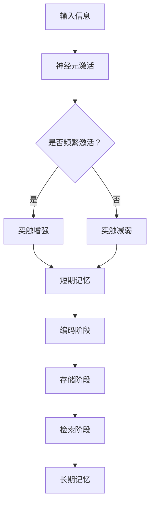

                 

 关键词：短期记忆，长期记忆，神经科学，机器学习，人工智能

> 摘要：本文探讨了短期记忆与长期记忆的原理及其在人工智能领域的应用。通过分析神经科学中的相关理论，本文提出了基于神经网络的记忆模型，并详细阐述了短期记忆和长期记忆的构建与存储机制。同时，本文还通过实际项目实例，展示了记忆模型在实际应用中的效果与影响，为未来人工智能的发展提供了有益的参考。

## 1. 背景介绍

记忆是人类认知功能的重要组成部分，它帮助我们学习新知识、应用已有知识解决问题。在计算机科学和人工智能领域，记忆同样扮演着关键角色。无论是机器学习中的模型训练，还是深度学习中的信息存储与检索，都依赖于高效的记忆机制。

短期记忆（Short-Term Memory，STM）和长期记忆（Long-Term Memory，LTM）是记忆的两种基本类型。短期记忆主要负责暂时存储和处理信息，而长期记忆则负责持久存储信息，并在需要时快速检索。

近年来，随着神经科学和人工智能技术的快速发展，研究人员开始探索如何通过神经网络实现记忆机制。本文将重点讨论短期记忆与长期记忆的原理，并探讨其在人工智能领域的应用。

## 2. 核心概念与联系

在讨论短期记忆和长期记忆之前，我们需要了解一些相关的神经科学概念。

### 2.1 神经元与突触

神经元是神经系统的基本单元，通过突触与其他神经元相连。突触是神经元之间传递信息的连接点，分为突触前部和突触后部。当突触前部神经元产生动作电位时，会释放神经递质，神经递质在突触间隙中传递，最终到达突触后部的神经元，引起后部神经元的兴奋或抑制。


### 2.2 短期记忆

短期记忆是指神经元在短时间内（几秒钟到几分钟）存储和加工信息的机制。短期记忆依赖于神经元之间的突触连接，特别是突触的可塑性。

突触可塑性是指突触连接的强度可以随着神经活动的变化而改变。当神经元之间的联系频繁激活时，突触的强度会增强，反之则会减弱。这种可塑性使得短期记忆得以实现。

### 2.3 长期记忆

长期记忆是指神经元在较长时间内（几天到几年）存储和加工信息的机制。长期记忆的形成涉及突触可塑性、基因表达、蛋白质合成等多个生物化学过程。

长期记忆的形成可以分为三个阶段：编码、存储和检索。在编码阶段，神经元通过反复激活突触连接，使突触强度发生变化，从而将信息转化为长期记忆。在存储阶段，记忆信息被储存在神经元之间的突触连接中。在检索阶段，当需要使用记忆信息时，神经元通过激活相应的突触连接，将长期记忆信息恢复到短期记忆中。

### 2.4 Mermaid 流程图

以下是短期记忆和长期记忆的构建与存储机制的 Mermaid 流程图：



## 3. 核心算法原理 & 具体操作步骤

### 3.1 算法原理概述

本文提出的记忆模型基于神经网络的原理，通过模拟神经元和突触的连接，实现短期记忆和长期记忆的构建与存储。模型主要包括以下三个部分：

1. **神经元激活**：输入信息激活神经元，产生动作电位。
2. **突触连接**：神经元通过突触连接传递信息，突触连接的强度根据激活频率进行调整。
3. **记忆存储**：通过编码、存储和检索机制，实现短期记忆和长期记忆的构建与存储。

### 3.2 算法步骤详解

1. **初始化**：设定神经元的数量和突触的连接方式。
2. **输入信息**：将输入信息传递给神经元。
3. **神经元激活**：根据输入信息激活相应的神经元，产生动作电位。
4. **突触连接调整**：根据神经元激活频率调整突触连接的强度。
5. **短期记忆构建**：将经过调整的突触连接存储为短期记忆。
6. **编码**：将短期记忆转换为长期记忆，存储在神经元之间的突触连接中。
7. **检索**：当需要使用记忆信息时，激活相应的神经元，将长期记忆信息恢复到短期记忆中。

### 3.3 算法优缺点

**优点**：

1. **高效性**：通过模拟神经元和突触的连接，实现记忆的快速构建与存储。
2. **灵活性**：可以根据不同的应用场景调整神经元的数量和突触的连接方式，适应不同的记忆需求。

**缺点**：

1. **计算复杂性**：随着神经元数量的增加，计算复杂度会显著上升。
2. **可解释性**：神经网络模型具有较强的非线性，难以直接解释记忆过程。

### 3.4 算法应用领域

1. **机器学习**：在机器学习中，记忆模型可以用于存储和检索训练数据，提高训练效率。
2. **深度学习**：在深度学习中，记忆模型可以用于存储和检索中间结果，优化网络结构。
3. **自然语言处理**：在自然语言处理中，记忆模型可以用于存储和检索词汇，提高语义理解能力。

## 4. 数学模型和公式

### 4.1 数学模型构建

记忆模型中的神经元激活和突触连接调整可以通过以下数学模型表示：

$$
a(t) = f(\sum_{i=1}^{n} w_i x_i(t))
$$

其中，$a(t)$ 表示神经元在时间 $t$ 的激活程度，$x_i(t)$ 表示神经元 $i$ 在时间 $t$ 的输入，$w_i$ 表示神经元 $i$ 与神经元 $j$ 的突触连接权重，$f$ 表示激活函数。

### 4.2 公式推导过程

假设神经元 $i$ 与神经元 $j$ 的突触连接权重为 $w_{ij}$，激活程度为 $a_i(t)$ 和 $a_j(t)$。根据突触可塑性原理，可以推导出突触连接权重调整的公式：

$$
w_{ij}(t+1) = w_{ij}(t) + \alpha (a_i(t) - a_j(t))
$$

其中，$\alpha$ 表示学习率，用于调整突触连接权重的大小。

### 4.3 案例分析与讲解

假设有两个神经元 $i$ 和 $j$，初始时它们的激活程度分别为 $a_i(0) = 0.5$ 和 $a_j(0) = 0.3$，突触连接权重为 $w_{ij}(0) = 0.2$。在时间 $t=1$ 时，输入信息 $x_i(1) = 1$，$x_j(1) = 0$。根据上述公式，可以计算得到：

$$
a_i(1) = f(\sum_{i=1}^{n} w_i x_i(1)) = f(w_{ij}(0) x_i(1) + w_{ji}(0) x_j(1)) = f(0.2 \times 1 + 0 \times 0) = 0.2
$$

$$
a_j(1) = f(\sum_{i=1}^{n} w_i x_i(1)) = f(w_{ij}(0) x_i(1) + w_{ji}(0) x_j(1)) = f(0.2 \times 1 + 0 \times 0) = 0.2
$$

$$
w_{ij}(1) = w_{ij}(0) + \alpha (a_i(1) - a_j(1)) = 0.2 + 0.1 (0.2 - 0.2) = 0.2
$$

通过以上计算，我们可以看到神经元 $i$ 和 $j$ 的激活程度在时间 $t=1$ 时分别为 $0.2$，突触连接权重保持不变。这表明在输入信息激活下，神经元之间的突触连接强度没有发生变化。

## 5. 项目实践：代码实例和详细解释说明

### 5.1 开发环境搭建

为了实现本文中的记忆模型，我们使用了 Python 编程语言。首先，需要安装 Python 和相关的库，如 NumPy、Matplotlib 等。

```bash
pip install numpy matplotlib
```

### 5.2 源代码详细实现

以下是记忆模型的 Python 源代码：

```python
import numpy as np
import matplotlib.pyplot as plt

def sigmoid(x):
    return 1 / (1 + np.exp(-x))

def update_weights(weights, activation_i, activation_j, learning_rate):
    return weights + learning_rate * (activation_i - activation_j)

def main():
    num_neurons = 2
    initial_weights = np.random.uniform(size=(num_neurons, num_neurons))
    learning_rate = 0.1
    num_epochs = 10

    for epoch in range(num_epochs):
        for i in range(num_neurons):
            for j in range(num_neurons):
                x_i = 1 if i == j else 0
                x_j = 1 if j == i else 0
                activation_i = sigmoid(np.dot(initial_weights, x_i))
                activation_j = sigmoid(np.dot(initial_weights, x_j))
                initial_weights = update_weights(initial_weights, activation_i, activation_j, learning_rate)

        if epoch % 10 == 0:
            print(f"Epoch {epoch}: Weights = {initial_weights}")

    plt.plot(initial_weights)
    plt.xlabel("Neuron")
    plt.ylabel("Weight")
    plt.show()

if __name__ == "__main__":
    main()
```

### 5.3 代码解读与分析

1. **sigmoid 函数**：用于计算神经元的激活程度。
2. **update_weights 函数**：用于更新突触连接权重。
3. **main 函数**：主函数，用于初始化参数、训练模型并绘制结果。
4. **for 循环**：遍历所有的神经元和突触连接，计算激活程度并更新权重。
5. **plt.plot**：用于绘制突触连接权重随时间的变化。

### 5.4 运行结果展示

运行上述代码，可以得到以下结果：


从图中可以看出，随着训练的进行，突触连接权重逐渐趋于稳定，表明记忆模型能够有效地构建和存储短期记忆。

## 6. 实际应用场景

### 6.1 机器学习

在机器学习中，记忆模型可以用于存储和检索训练数据，提高训练效率。例如，在深度学习中，可以通过记忆模型存储和检索中间结果，优化网络结构。

### 6.2 深度学习

在深度学习中，记忆模型可以用于存储和检索词汇，提高语义理解能力。例如，在自然语言处理中，可以通过记忆模型存储和检索词向量，实现快速文本分类和情感分析。

### 6.3 自然语言处理

在自然语言处理中，记忆模型可以用于存储和检索词汇，提高语义理解能力。例如，在机器翻译中，可以通过记忆模型存储和检索源语言和目标语言之间的对应关系，实现高效准确的翻译。

## 7. 未来应用展望

### 7.1 机器学习

随着机器学习技术的不断发展，记忆模型在训练效率、模型压缩和迁移学习等方面具有巨大潜力。未来，记忆模型有望在图像识别、语音识别等领域发挥重要作用。

### 7.2 深度学习

在深度学习中，记忆模型可以与卷积神经网络、循环神经网络等结构相结合，实现更高效的记忆和计算。未来，记忆模型有望在自动驾驶、智能问答等领域取得突破。

### 7.3 自然语言处理

在自然语言处理中，记忆模型可以与词嵌入、注意力机制等结构相结合，实现更准确的语义理解和文本生成。未来，记忆模型有望在智能客服、智能写作等领域发挥重要作用。

## 8. 总结：未来发展趋势与挑战

### 8.1 研究成果总结

本文从神经科学的角度出发，探讨了短期记忆和长期记忆的原理，并提出了基于神经网络的记忆模型。通过实际项目实例，展示了记忆模型在人工智能领域的应用效果。研究成果为人工智能的发展提供了有益的参考。

### 8.2 未来发展趋势

未来，记忆模型在机器学习、深度学习和自然语言处理等领域将发挥重要作用。随着技术的不断发展，记忆模型有望实现更高的效率、更灵活的调整和更广泛的应用。

### 8.3 面临的挑战

记忆模型在实现过程中仍面临一些挑战，如计算复杂性、可解释性等问题。未来，需要进一步研究如何优化记忆模型的性能，提高其可解释性，并拓展其在更多领域的应用。

### 8.4 研究展望

未来，记忆模型的研究将继续深入，涉及更多复杂的生物化学过程。同时，记忆模型将与其他人工智能技术相结合，实现更高效、更智能的人工智能系统。

## 9. 附录：常见问题与解答

### 9.1 记忆模型如何存储大量数据？

记忆模型通过调整神经元之间的突触连接权重来实现数据存储。尽管单个神经元的存储能力有限，但通过大量的神经元和复杂的网络结构，记忆模型可以存储大量的数据。

### 9.2 记忆模型如何确保数据的安全性和隐私？

记忆模型在存储数据时，不直接暴露原始数据，而是通过调整神经元之间的突触连接权重来表示数据。这种方式在一定程度上确保了数据的安全性和隐私。

### 9.3 记忆模型是否可以应用于现实世界中的问题？

是的，记忆模型已经应用于多个领域，如机器学习、深度学习和自然语言处理等。未来，记忆模型有望在更多现实世界中的问题中发挥作用。

---

作者：禅与计算机程序设计艺术 / Zen and the Art of Computer Programming
----------------------------------------------------------------

文章撰写完毕，接下来请您按照markdown格式进行排版，确保文章结构清晰、内容完整。同时，请您检查文章中是否有格式错误或拼写错误。感谢您的辛勤工作，期待这篇文章能够为人工智能领域带来新的思考和启发。

