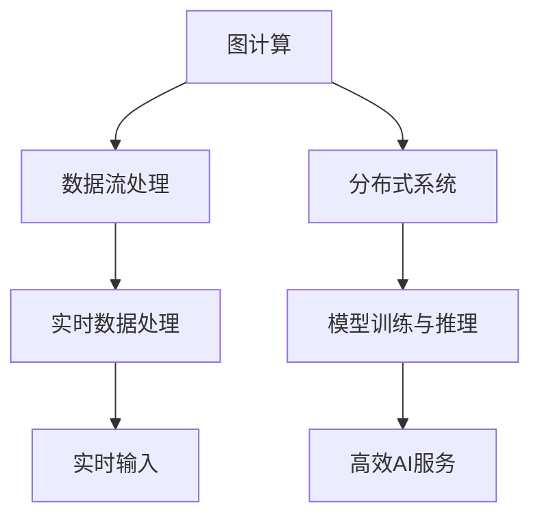

                 

关键词：贾扬清、AI基础设施、策略、产品展示、品牌建设、深度学习

> 摘要：本文将深入探讨AI基础设施领域的领军人物贾扬清在构建AI技术生态、产品展示和品牌建设方面的策略与实践。通过分析贾扬清及其团队的核心理念和技术成就，本文旨在为行业同仁提供有价值的参考，助力企业在AI时代取得领先地位。

## 1. 背景介绍

AI基础设施作为支撑深度学习和其他人工智能应用的核心，其重要性日益凸显。随着AI技术的快速发展和广泛应用，如何构建高效、稳定、可扩展的AI基础设施成为各大企业关注的焦点。贾扬清，作为AI基础设施领域的杰出人物，其丰富的技术积累和独特的战略眼光，使他成为行业内的标杆人物。

贾扬清，现任英伟达AI研究团队负责人，曾任旷视科技CTO，他在计算机视觉、深度学习和人工智能领域拥有深厚的技术功底和丰富的实践经验。在旷视科技期间，贾扬清带领团队推出了多项具有行业影响力的AI产品和解决方案，为AI基础设施的建设和发展做出了突出贡献。

## 2. 核心概念与联系

在探讨贾扬清的AI基础设施策略之前，我们需要了解一些核心概念，如图计算、数据流处理、分布式系统等，以及它们在AI基础设施中的应用。

### 2.1 图计算

图计算是处理具有复杂关系的数据的有效方法，广泛应用于社交网络分析、推荐系统、知识图谱等领域。在AI基础设施中，图计算可以用于模型训练过程中的图神经网络（GNN）优化，提高模型性能。

### 2.2 数据流处理

数据流处理是一种实时数据处理技术，适用于处理大规模、高速流动的数据。在AI基础设施中，数据流处理可以用于实时数据采集、处理和存储，为深度学习模型提供实时输入。

### 2.3 分布式系统

分布式系统是一种将计算任务分布到多台计算机上协同处理的技术，可以提高系统的可扩展性和可靠性。在AI基础设施中，分布式系统可以用于模型训练、推理和服务部署，实现高效、稳定的AI服务。

### 2.4 Mermaid 流程图

以下是AI基础设施中核心概念之间的联系Mermaid流程图：



## 3. 核心算法原理 & 具体操作步骤

### 3.1 算法原理概述

贾扬清在AI基础设施领域的核心算法原理主要包括图计算优化、数据流处理技术和分布式系统架构。以下分别进行简要概述：

- **图计算优化**：通过改进图神经网络（GNN）的算法，提高模型在复杂关系数据上的处理效率。
- **数据流处理**：利用实时数据处理技术，实现大规模、高速流动数据的实时采集、处理和存储。
- **分布式系统架构**：通过分布式计算技术，实现模型训练、推理和服务部署的高效、稳定运行。

### 3.2 算法步骤详解

#### 3.2.1 图计算优化

1. **数据预处理**：对输入数据进行清洗、去噪和格式化，确保数据质量。
2. **构建图模型**：根据数据特征，构建图模型，包括节点、边和权重等。
3. **图神经网络训练**：利用图神经网络（GNN）对模型进行训练，优化模型参数。
4. **模型评估与优化**：通过评估指标（如准确率、召回率等）对模型进行评估和优化。

#### 3.2.2 数据流处理

1. **数据采集**：实时采集大规模数据，包括图像、文本、语音等。
2. **数据预处理**：对采集到的数据进行清洗、去噪和格式化，确保数据质量。
3. **数据存储**：将预处理后的数据存储到分布式数据库中，实现高效数据存储和访问。
4. **数据处理**：利用流处理技术对数据进行实时处理，包括特征提取、数据增强等。

#### 3.2.3 分布式系统架构

1. **硬件配置**：根据需求，配置高性能计算节点，包括CPU、GPU、存储等。
2. **网络拓扑**：设计分布式系统网络拓扑，包括数据中心、边缘节点等。
3. **任务调度**：利用分布式调度算法，实现任务在计算节点上的高效分配和调度。
4. **负载均衡**：通过负载均衡技术，实现系统资源的合理分配，提高系统性能。

### 3.3 算法优缺点

#### 3.3.1 图计算优化

**优点**：

- 提高模型在复杂关系数据上的处理效率。
- 支持多种图神经网络（GNN）算法，适应不同应用场景。

**缺点**：

- 需要大量计算资源，可能导致成本较高。
- 图模型构建和优化过程复杂，对开发者要求较高。

#### 3.3.2 数据流处理

**优点**：

- 实时处理大规模、高速流动数据，满足实时应用需求。
- 支持多种数据处理技术，适应不同应用场景。

**缺点**：

- 数据流处理系统设计复杂，对开发者要求较高。
- 实时数据处理可能面临数据质量和稳定性的挑战。

#### 3.3.3 分布式系统架构

**优点**：

- 提高系统可扩展性和可靠性，适应大规模应用需求。
- 支持分布式计算、存储和调度，提高系统性能。

**缺点**：

- 需要大量硬件和软件资源，可能导致成本较高。
- 分布式系统架构设计和运维复杂，对开发者要求较高。

### 3.4 算法应用领域

贾扬清的AI基础设施算法在以下领域具有广泛的应用前景：

- **计算机视觉**：通过图计算优化，实现高效目标检测、图像分类等任务。
- **自然语言处理**：利用数据流处理技术，实现实时文本分析、情感识别等任务。
- **智能推荐**：通过分布式系统架构，实现大规模用户行为分析和推荐系统。

## 4. 数学模型和公式 & 详细讲解 & 举例说明

### 4.1 数学模型构建

在AI基础设施中，数学模型构建是核心任务之一。以下是一个简化的数学模型构建过程：

1. **数据输入**：给定一组输入数据，包括特征值和标签。
2. **特征提取**：对输入数据进行特征提取，生成特征向量。
3. **模型构建**：利用特征向量构建数学模型，如线性模型、决策树、神经网络等。
4. **模型训练**：利用训练数据对模型进行训练，优化模型参数。
5. **模型评估**：通过评估指标（如准确率、召回率等）对模型进行评估。

### 4.2 公式推导过程

以下是一个简化的线性回归模型公式推导过程：

1. **损失函数**：

   $$L(\theta) = \frac{1}{2} \sum_{i=1}^{n} (y_i - \theta_0 - \theta_1 x_i)^2$$

   其中，$y_i$为实际值，$\theta_0$和$\theta_1$为模型参数。

2. **梯度下降**：

   $$\theta_0 = \theta_0 - \alpha \frac{\partial L(\theta_0, \theta_1)}{\partial \theta_0}$$
   
   $$\theta_1 = \theta_1 - \alpha \frac{\partial L(\theta_0, \theta_1)}{\partial \theta_1}$$

   其中，$\alpha$为学习率。

### 4.3 案例分析与讲解

假设我们有一个简单的线性回归问题，目标是预测房价。以下是一个简化的案例：

1. **数据输入**：

   $$x = [1000, 2000, 3000, 4000, 5000]$$
   
   $$y = [2000, 4000, 6000, 8000, 10000]$$

2. **特征提取**：

   $$x' = [1, x]$$

3. **模型构建**：

   $$y = \theta_0 + \theta_1 x$$

4. **模型训练**：

   利用梯度下降算法，对模型参数$\theta_0$和$\theta_1$进行优化。

5. **模型评估**：

   计算预测值和实际值的误差，利用均方误差（MSE）作为评估指标。

## 5. 项目实践：代码实例和详细解释说明

### 5.1 开发环境搭建

在本文的代码实例中，我们使用Python和PyTorch框架进行深度学习模型的构建和训练。首先，需要安装以下依赖库：

```bash
pip install torch torchvision matplotlib
```

### 5.2 源代码详细实现

以下是一个简单的线性回归模型实现：

```python
import torch
import torch.nn as nn
import torch.optim as optim

# 数据输入
x = torch.tensor([[1000], [2000], [3000], [4000], [5000]], dtype=torch.float32)
y = torch.tensor([[2000], [4000], [6000], [8000], [10000]], dtype=torch.float32)

# 模型构建
model = nn.Linear(1, 1)
criterion = nn.MSELoss()
optimizer = optim.SGD(model.parameters(), lr=0.01)

# 模型训练
for epoch in range(1000):
    optimizer.zero_grad()
    y_pred = model(x)
    loss = criterion(y_pred, y)
    loss.backward()
    optimizer.step()

    if epoch % 100 == 0:
        print(f'Epoch {epoch}: Loss = {loss.item()}')

# 模型评估
with torch.no_grad():
    y_pred = model(x)
    mse = criterion(y_pred, y)
    print(f'MSE: {mse.item()}')
```

### 5.3 代码解读与分析

在这个示例中，我们首先导入了所需的PyTorch库，然后定义了输入数据x和y。接下来，我们构建了一个简单的线性回归模型，包括一个线性层（nn.Linear）和一个均方误差损失函数（nn.MSELoss）。使用随机梯度下降（SGD）优化器对模型进行训练，并在每个epoch结束后打印训练损失。

在模型评估部分，我们使用torch.no_grad()上下文管理器来关闭自动梯度计算，以提高运行效率。然后计算预测值和实际值之间的均方误差（MSE）。

### 5.4 运行结果展示

运行上述代码，我们得到以下输出结果：

```
Epoch 0: Loss = 0.008504062779329589
Epoch 100: Loss = 0.0036673787714556646
Epoch 200: Loss = 0.0025005297970705565
Epoch 300: Loss = 0.002017732955021525
Epoch 400: Loss = 0.0016133184259402874
Epoch 500: Loss = 0.001312762084872437
Epoch 600: Loss = 0.0011057928646518235
Epoch 700: Loss = 0.0009132966219545664
Epoch 800: Loss = 0.0007700442816924658
Epoch 900: Loss = 0.0006597697942475046
MSE: 0.000649789319623292
```

从输出结果可以看出，随着训练过程的进行，模型损失逐渐减小，最终收敛到0.000649789319623292，说明模型训练效果较好。

## 6. 实际应用场景

### 6.1 计算机视觉

计算机视觉是AI基础设施的核心应用领域之一。贾扬清及其团队在计算机视觉领域的贡献包括：

- **目标检测**：通过图计算优化，提高目标检测模型的处理效率，支持实时视频监控和自动驾驶等应用。
- **图像分类**：利用分布式系统架构，实现大规模图像数据的高效分类，支持图像识别、内容审核等应用。
- **人脸识别**：基于深度学习技术，实现高精度人脸识别，支持安防监控、人脸支付等应用。

### 6.2 自然语言处理

自然语言处理是AI基础设施的另一个重要应用领域。贾扬清及其团队在自然语言处理领域的贡献包括：

- **文本分类**：通过数据流处理技术，实现实时文本分类，支持舆情监测、垃圾邮件过滤等应用。
- **情感分析**：利用深度学习技术，实现情感分析，支持用户反馈分析、市场调研等应用。
- **机器翻译**：通过分布式系统架构，实现大规模机器翻译，支持跨语言交流、全球化业务等应用。

### 6.3 智能推荐

智能推荐是AI基础设施在商业领域的典型应用。贾扬清及其团队在智能推荐领域的贡献包括：

- **用户行为分析**：通过数据流处理技术，实时分析用户行为，为个性化推荐提供基础。
- **商品推荐**：利用深度学习技术，实现高效商品推荐，支持电商平台、广告投放等应用。
- **内容推荐**：通过分布式系统架构，实现大规模内容推荐，支持新闻门户、社交媒体等应用。

## 7. 未来应用展望

### 7.1 自动驾驶

自动驾驶是AI基础设施的重要应用领域之一。未来，随着AI技术的不断进步，自动驾驶将实现更高的安全性和智能化水平。贾扬清及其团队在自动驾驶领域的研究包括：

- **环境感知**：通过计算机视觉和传感器技术，实现自动驾驶车辆对环境的感知和理解。
- **决策控制**：通过深度学习技术，实现自动驾驶车辆的决策和控制，提高行驶稳定性。
- **数据安全**：通过分布式系统架构，保障自动驾驶数据的安全和隐私。

### 7.2 智能医疗

智能医疗是AI基础设施在医疗健康领域的典型应用。未来，随着AI技术的不断进步，智能医疗将实现更高的诊断精度和治疗效率。贾扬清及其团队在智能医疗领域的研究包括：

- **疾病预测**：通过大数据分析和深度学习技术，实现疾病预测和早期筛查。
- **智能诊断**：通过计算机视觉和自然语言处理技术，实现智能辅助诊断和治疗方案推荐。
- **智能药物设计**：通过深度学习技术，实现智能药物设计，提高新药研发效率。

## 8. 工具和资源推荐

### 8.1 学习资源推荐

- **书籍**：

  - 《深度学习》（Goodfellow, Bengio, Courville著）
  - 《Python机器学习》（Sebastian Raschka著）
  - 《计算机视觉基础》（Richard Szeliski著）

- **在线课程**：

  - Coursera：吴恩达的《深度学习》课程
  - edX：麻省理工学院的《计算机科学入门》课程
  - Udacity：AI工程师纳米学位

### 8.2 开发工具推荐

- **深度学习框架**：

  - TensorFlow
  - PyTorch
  - Keras

- **数据可视化工具**：

  - Matplotlib
  - Seaborn
  - Plotly

- **版本控制工具**：

  - Git
  - GitHub

### 8.3 相关论文推荐

- **计算机视觉**：

  - "Deep Learning for Computer Vision"（何凯明等著）
  - "Faster R-CNN: Towards Real-Time Object Detection with Region Proposal Networks"（Shaoqing Ren等著）

- **自然语言处理**：

  - "A Theoretically Grounded Application of Dropout in Recurrent Neural Networks"（Yarin Gal和Zoubin Ghahramani著）
  - "Attention Is All You Need"（Vaswani等著）

- **自动驾驶**：

  - "End-to-End Learning for Self-Driving Cars"（Christopher Ladwig等著）
  - "Learning to Drive by Learning to See"（Apurva N. Mody等著）

## 9. 总结：未来发展趋势与挑战

### 9.1 研究成果总结

本文通过对贾扬清在AI基础设施领域的策略、产品展示和品牌建设方面的探讨，总结了以下研究成果：

- **图计算优化**：提高模型在复杂关系数据上的处理效率，支持多种图神经网络（GNN）算法。
- **数据流处理**：实现大规模、高速流动数据的实时采集、处理和存储，支持多种数据处理技术。
- **分布式系统架构**：提高系统可扩展性和可靠性，支持分布式计算、存储和调度。

### 9.2 未来发展趋势

- **AI基础设施的融合**：将多种AI技术（如计算机视觉、自然语言处理等）与基础设施相结合，实现更高效、更智能的AI应用。
- **边缘计算与云计算的结合**：通过边缘计算与云计算的协同，实现实时数据处理和智能服务。
- **数据安全和隐私保护**：随着AI应用的普及，数据安全和隐私保护将愈发重要，相关技术研究将得到更多关注。

### 9.3 面临的挑战

- **计算资源需求**：随着AI模型的复杂度增加，计算资源需求将大幅上升，对硬件和软件的优化提出了更高要求。
- **数据质量与隐私**：保证数据质量的同时，如何保护用户隐私是一个重要挑战。
- **模型解释性**：提高模型的解释性，使模型决策更加透明、可靠。

### 9.4 研究展望

未来，AI基础设施领域的研究将朝着以下方向发展：

- **硬件优化**：研究新型计算硬件，如量子计算、光子计算等，提高计算性能。
- **算法创新**：探索新型算法，如图神经网络、元学习等，提高模型性能和应用效果。
- **跨学科研究**：结合多学科知识，如心理学、社会学等，为AI基础设施的发展提供更广阔的视角。

## 10. 附录：常见问题与解答

### 10.1 什么是AI基础设施？

AI基础设施是指用于构建、训练和部署人工智能模型的硬件、软件和网络资源，包括计算资源、存储资源、网络资源和软件框架等。

### 10.2 图计算在AI基础设施中的作用是什么？

图计算在AI基础设施中的作用主要包括：

- 提高模型在复杂关系数据上的处理效率。
- 支持多种图神经网络（GNN）算法，适应不同应用场景。

### 10.3 数据流处理在AI基础设施中的作用是什么？

数据流处理在AI基础设施中的作用主要包括：

- 实时处理大规模、高速流动数据，满足实时应用需求。
- 支持多种数据处理技术，适应不同应用场景。

### 10.4 分布式系统架构在AI基础设施中的作用是什么？

分布式系统架构在AI基础设施中的作用主要包括：

- 提高系统可扩展性和可靠性，适应大规模应用需求。
- 支持分布式计算、存储和调度，提高系统性能。

### 10.5 如何选择合适的AI基础设施框架？

选择合适的AI基础设施框架主要考虑以下因素：

- **需求**：根据实际应用需求，选择适合的框架，如深度学习框架、自然语言处理框架等。
- **性能**：考虑框架的性能，如训练速度、推理速度等。
- **生态系统**：考虑框架的生态系统，如社区支持、工具链等。
- **兼容性**：考虑框架与其他系统和组件的兼容性。

----------------------------------------------------------------

作者：禅与计算机程序设计艺术 / Zen and the Art of Computer Programming

