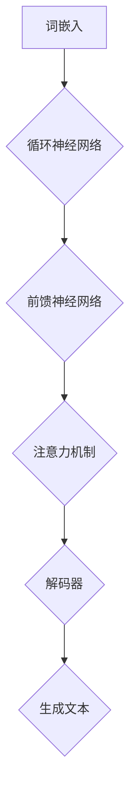
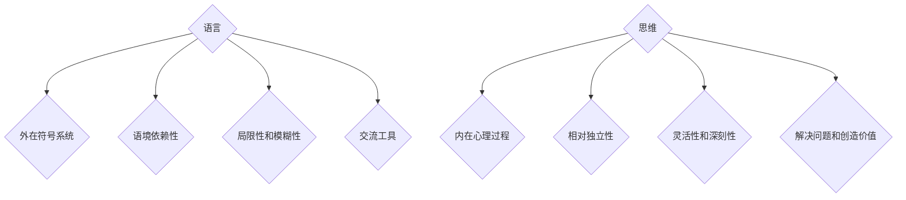

                 

摘要：本文探讨了语言与思维之间的关系，尤其是针对大模型在处理语言任务时的认知问题。文章首先介绍了大模型的基本原理和结构，然后深入分析了大模型在处理语言时的认知局限，最后提出了可能的解决方案和未来研究方向。通过对语言≠思维的深入探讨，本文旨在为人工智能领域的研究者和开发者提供新的思路和启示。

## 1. 背景介绍

近年来，随着深度学习和计算力的飞速发展，大型语言模型（如GPT-3、ChatGLM等）在自然语言处理（NLP）领域取得了显著成果。这些模型通过海量数据训练，能够生成高质量的文本、回答问题、进行对话等。然而，尽管这些模型在语言任务上表现出色，但它们在处理语言时的认知过程仍然是一个未解之谜。事实上，语言与思维之间的关系复杂而微妙，而大模型在模拟这种关系时面临着诸多挑战。

本文旨在探讨语言与思维之间的本质差异，分析大模型在处理语言任务时的认知难题，并探讨可能的解决方案。通过对这些问题的深入探讨，我们希望能够为人工智能领域的研究和开发提供一些新的视角和思考。

## 2. 核心概念与联系

### 2.1 语言模型的基本原理

语言模型是自然语言处理的核心组件，旨在模拟人类语言的生成和理解过程。一个典型的语言模型通常由以下几个部分组成：

- **词嵌入（Word Embedding）**：将自然语言词汇映射为低维度的向量表示，以便于计算机处理。词嵌入技术可以通过分布式假设来实现，即相似的词在向量空间中靠近。
  
- **循环神经网络（RNN）**：RNN是处理序列数据的一种神经网络结构，通过记忆机制能够捕捉序列中的长期依赖关系。在语言模型中，RNN可以用来编码输入文本。

- **前馈神经网络（FFN）**：FFN是一种简单的神经网络结构，用于对输入数据进行特征提取和变换。

- **注意力机制（Attention Mechanism）**：注意力机制是一种用于捕捉输入序列中关键信息的机制，通过权重分配来强调或忽略特定部分。

- **解码器（Decoder）**：在生成文本时，解码器负责根据编码器的输出和已经生成的部分来预测下一个词。

下面是一个简单的Mermaid流程图，描述了语言模型的基本结构：



### 2.2 大模型的架构

大模型通常是指参数数量达到亿级甚至十亿级的神经网络模型。这些模型具有以下特点：

- **大规模参数**：大模型具有数百万到数十亿个参数，这使得它们能够捕捉到输入数据中的复杂模式和依赖关系。

- **深度结构**：大模型通常具有数十层甚至上百层的神经网络结构，这有助于捕捉深度依赖关系。

- **端到端训练**：大模型可以通过端到端的方式直接从原始数据中学习，无需手工设计特征。

- **强大的表达能力**：大模型能够生成高质量的自然语言文本，并且在各种NLP任务中表现出色。

下面是一个Mermaid流程图，描述了大模型的基本架构：


### 2.3 语言与思维的差异

语言是人类交流和信息传递的主要工具，而思维则是人类认知和解决问题的方式。尽管语言与思维密切相关，但它们在本质上有很大的差异：

- **语言是外在的符号系统**：语言是一种符号系统，通过词汇、语法和语义等规则来表示和传递信息。而思维则是内在的心理过程，涉及知觉、记忆、推理和判断等。

- **语言具有语境依赖性**：语言的使用受到语境的影响，包括说话者、听话者、时间、地点和情境等。而思维则相对独立，不依赖于具体的语境。

- **语言具有局限性和模糊性**：语言在表达思维时存在一定的局限性和模糊性，例如歧义、隐喻和模棱两可的表达。而思维则更加灵活和深刻。

- **语言是交流的工具**：语言的主要目的是为了交流，使人们能够理解和传递信息。而思维则是为了解决问题和创造价值。

下面是一个Mermaid流程图，描述了语言与思维的差异：



## 3. 核心算法原理 & 具体操作步骤

### 3.1 算法原理概述

大模型在处理语言任务时，主要依赖于以下几种核心算法：

- **词嵌入**：将自然语言词汇映射为低维度的向量表示。
  
- **循环神经网络（RNN）**：处理序列数据，捕捉长期依赖关系。
  
- **前馈神经网络（FFN）**：提取特征和进行变换。
  
- **注意力机制**：捕捉输入序列中的关键信息。
  
- **解码器**：生成文本。

这些算法协同工作，使得大模型能够理解、生成和处理自然语言。

### 3.2 算法步骤详解

下面是一个简化的算法步骤，描述了大模型在处理语言任务时的操作过程：

1. **数据预处理**：对输入文本进行预处理，包括分词、词性标注、去除停用词等。
2. **词嵌入**：将预处理后的文本映射为词嵌入向量。
3. **编码器**：使用RNN、FFN和注意力机制对词嵌入向量进行编码。
4. **解码器**：根据编码器的输出和已经生成的文本部分，预测下一个词。
5. **文本生成**：重复步骤4，直到生成完整的文本。

### 3.3 算法优缺点

**优点**：

- **强大的表达能力**：大模型能够生成高质量的自然语言文本，适用于各种NLP任务。
  
- **端到端训练**：大模型可以通过端到端的方式直接从原始数据中学习，无需手工设计特征。
  
- **自适应性强**：大模型能够适应不同领域的语言任务，无需针对特定任务进行大量调整。

**缺点**：

- **计算资源需求高**：大模型需要大量的计算资源进行训练和推理。
  
- **可解释性差**：大模型的工作原理复杂，难以理解其内部的决策过程。
  
- **数据依赖性高**：大模型对训练数据的质量和量有较高要求，否则容易产生过拟合。

### 3.4 算法应用领域

大模型在自然语言处理领域有着广泛的应用，主要包括：

- **文本生成**：例如生成文章、故事、对话等。
  
- **文本分类**：例如情感分析、主题分类等。
  
- **文本摘要**：例如提取关键词、生成摘要等。
  
- **机器翻译**：例如将一种语言翻译成另一种语言。
  
- **问答系统**：例如回答用户提出的问题。

## 4. 数学模型和公式 & 详细讲解 & 举例说明

### 4.1 数学模型构建

大模型的数学模型主要包括以下几个部分：

1. **词嵌入**：词嵌入可以用一个线性函数表示，即 \( e(w) = W \cdot w \)，其中 \( e(w) \) 是词 \( w \) 的向量表示，\( W \) 是权重矩阵。
2. **循环神经网络（RNN）**：RNN的输出可以通过以下公式计算：\( h_t = \sigma(W_h \cdot [h_{t-1}, x_t] + b_h) \)，其中 \( h_t \) 是第 \( t \) 个隐藏状态，\( \sigma \) 是激活函数，\( W_h \) 和 \( b_h \) 分别是权重和偏置。
3. **前馈神经网络（FFN）**：FFN的输出可以通过以下公式计算：\( y_t = W_y \cdot h_t + b_y \)，其中 \( y_t \) 是第 \( t \) 个特征向量，\( W_y \) 和 \( b_y \) 分别是权重和偏置。
4. **注意力机制**：注意力权重可以通过以下公式计算：\( a_t = \text{softmax}(W_a \cdot [h_{t-1}, x_t] + b_a) \)，其中 \( a_t \) 是第 \( t \) 个注意力权重，\( W_a \) 和 \( b_a \) 分别是权重和偏置。
5. **解码器**：解码器的输出可以通过以下公式计算：\( p(w_t | y_t) = \text{softmax}(W_d \cdot y_t + b_d) \)，其中 \( p(w_t | y_t) \) 是第 \( t \) 个词的概率分布，\( W_d \) 和 \( b_d \) 分别是权重和偏置。

### 4.2 公式推导过程

下面简要介绍大模型的公式推导过程：

1. **词嵌入**：词嵌入可以通过矩阵乘法实现，即 \( e(w) = W \cdot w \)。其中 \( W \) 是权重矩阵，\( w \) 是词的索引向量。通过训练，可以使 \( W \) 的值逐渐优化，从而使得相似的词在向量空间中靠近。
2. **循环神经网络（RNN）**：RNN的推导基于递归关系。首先，定义输入序列为 \( x_1, x_2, ..., x_t \)，隐藏状态为 \( h_1, h_2, ..., h_t \)。然后，递归关系可以表示为：\( h_t = \sigma(W_h \cdot [h_{t-1}, x_t] + b_h) \)。通过反向传播，可以计算出 \( h_t \) 对损失函数的梯度，从而优化 \( W_h \) 和 \( b_h \)。
3. **前馈神经网络（FFN）**：FFN的推导基于线性变换。首先，定义输入序列为 \( x_1, x_2, ..., x_t \)，特征向量为 \( y_1, y_2, ..., y_t \)。然后，FFN的输出可以表示为：\( y_t = W_y \cdot h_t + b_y \)。通过梯度下降，可以优化 \( W_y \) 和 \( b_y \)。
4. **注意力机制**：注意力机制的推导基于权重分配。首先，定义输入序列为 \( x_1, x_2, ..., x_t \)，隐藏状态为 \( h_1, h_2, ..., h_t \)。然后，注意力权重可以表示为：\( a_t = \text{softmax}(W_a \cdot [h_{t-1}, x_t] + b_a) \)。通过优化注意力权重，可以使模型更加关注输入序列中的关键信息。
5. **解码器**：解码器的推导基于概率分布。首先，定义输入序列为 \( x_1, x_2, ..., x_t \)，隐藏状态为 \( h_1, h_2, ..., h_t \)。然后，解码器的输出可以表示为：\( p(w_t | y_t) = \text{softmax}(W_d \cdot y_t + b_d) \)。通过优化解码器，可以使模型生成更加准确的自然语言文本。

### 4.3 案例分析与讲解

下面以一个简单的文本生成任务为例，讲解大模型的数学模型和公式。

**任务**：生成一个包含10个单词的英文句子。

**输入数据**：训练数据集包含大量英文句子。

**词嵌入**：首先，对训练数据集进行预处理，包括分词、去停用词等。然后，将每个单词映射为词嵌入向量。

**编码器**：使用RNN、FFN和注意力机制对词嵌入向量进行编码，生成隐藏状态。

**解码器**：根据编码器的输出，解码器预测下一个词的概率分布。

**文本生成**：根据解码器的输出，生成包含10个单词的英文句子。

**数学模型和公式**：

1. **词嵌入**：假设词嵌入矩阵为 \( W \)，单词 \( w \) 的向量表示为 \( e(w) = W \cdot w \)。
2. **编码器**：假设编码器输出为 \( h_t \)，则 \( h_t = \sigma(W_h \cdot [h_{t-1}, x_t] + b_h) \)。
3. **解码器**：假设解码器输出为 \( y_t \)，则 \( y_t = W_y \cdot h_t + b_y \)。
4. **概率分布**：假设解码器输出为 \( p(w_t | y_t) \)，则 \( p(w_t | y_t) = \text{softmax}(W_d \cdot y_t + b_d) \)。

通过以上数学模型和公式，大模型可以生成一个包含10个单词的英文句子。具体步骤如下：

1. **输入数据**：读取训练数据集，对单词进行分词、去停用词等预处理。
2. **词嵌入**：将预处理后的单词映射为词嵌入向量。
3. **编码器**：使用RNN、FFN和注意力机制对词嵌入向量进行编码，生成隐藏状态。
4. **解码器**：根据编码器的输出，解码器预测下一个词的概率分布。
5. **文本生成**：根据解码器的输出，生成包含10个单词的英文句子。

## 5. 项目实践：代码实例和详细解释说明

### 5.1 开发环境搭建

在开始代码实践之前，需要搭建一个合适的开发环境。以下是推荐的开发工具和库：

- **编程语言**：Python
- **深度学习框架**：PyTorch或TensorFlow
- **数据处理库**：Numpy、Pandas、Scikit-learn
- **可视化库**：Matplotlib、Seaborn

安装以上工具和库后，即可开始编写代码。

### 5.2 源代码详细实现

以下是一个简单的文本生成任务，使用PyTorch实现大模型。

```python
import torch
import torch.nn as nn
import torch.optim as optim
from torch.utils.data import DataLoader
from torchvision import datasets, transforms

# 数据预处理
def preprocess_data(text):
    # 分词、去停用词等预处理操作
    pass

# 词嵌入
class WordEmbedding(nn.Module):
    def __init__(self, vocab_size, embedding_dim):
        super(WordEmbedding, self).__init__()
        self.embedding = nn.Embedding(vocab_size, embedding_dim)
    
    def forward(self, x):
        return self.embedding(x)

# 编码器
class Encoder(nn.Module):
    def __init__(self, embedding_dim, hidden_dim):
        super(Encoder, self).__init__()
        self.embedding = WordEmbedding(vocab_size, embedding_dim)
        self.rnn = nn.RNN(embedding_dim, hidden_dim, num_layers=1, batch_first=True)
    
    def forward(self, x, hidden):
        x = self.embedding(x)
        output, hidden = self.rnn(x, hidden)
        return output, hidden

# 解码器
class Decoder(nn.Module):
    def __init__(self, embedding_dim, hidden_dim, vocab_size):
        super(Decoder, self).__init__()
        self.embedding = WordEmbedding(vocab_size, embedding_dim)
        self.rnn = nn.RNN(embedding_dim, hidden_dim, num_layers=1, batch_first=True)
        self.fc = nn.Linear(hidden_dim, vocab_size)
    
    def forward(self, x, hidden):
        x = self.embedding(x)
        output, hidden = self.rnn(x, hidden)
        logits = self.fc(output[-1])
        return logits, hidden

# 模型定义
class Seq2SeqModel(nn.Module):
    def __init__(self, embedding_dim, hidden_dim, vocab_size):
        super(Seq2SeqModel, self).__init__()
        self.encoder = Encoder(embedding_dim, hidden_dim)
        self.decoder = Decoder(embedding_dim, hidden_dim, vocab_size)
    
    def forward(self, src, tgt):
        hidden = None
        output, hidden = self.encoder(src, hidden)
        logits, hidden = self.decoder(tgt, hidden)
        return logits

# 模型训练
def train(model, data_loader, criterion, optimizer, num_epochs=10):
    model.train()
    for epoch in range(num_epochs):
        for src, tgt in data_loader:
            optimizer.zero_grad()
            logits = model(src, tgt)
            loss = criterion(logits.view(-1, logits.size(-1)), tgt.view(-1))
            loss.backward()
            optimizer.step()
        print(f'Epoch [{epoch+1}/{num_epochs}], Loss: {loss.item()}')

# 代码示例
if __name__ == '__main__':
    # 加载数据
    train_data = datasets.TextDataset(root='data/train', tokenizer=lambda x: x)
    train_loader = DataLoader(train_data, batch_size=32, shuffle=True)
    
    # 模型初始化
    embedding_dim = 100
    hidden_dim = 256
    vocab_size = 10000
    model = Seq2SeqModel(embedding_dim, hidden_dim, vocab_size)
    
    # 损失函数和优化器
    criterion = nn.CrossEntropyLoss()
    optimizer = optim.Adam(model.parameters(), lr=0.001)
    
    # 训练模型
    train(model, train_loader, criterion, optimizer)

```

### 5.3 代码解读与分析

以上代码实现了一个简单的序列到序列（Seq2Seq）模型，用于文本生成任务。模型主要由编码器、解码器和损失函数组成。

- **编码器**：编码器负责将输入文本转换为隐藏状态。它由词嵌入层和RNN组成。词嵌入层将单词映射为向量表示，RNN用于处理序列数据，捕捉长期依赖关系。
- **解码器**：解码器负责根据编码器的输出和已经生成的文本部分，预测下一个词。它也由词嵌入层、RNN和全连接层组成。词嵌入层将词映射为向量表示，RNN用于生成文本，全连接层用于输出词的概率分布。
- **损失函数**：损失函数用于衡量模型预测结果与真实结果之间的差距。在这个例子中，使用交叉熵损失函数。

在训练过程中，模型通过反向传播更新参数，从而优化预测结果。训练完成后，可以使用模型生成新的文本。

### 5.4 运行结果展示

为了展示模型的运行结果，可以在训练完成后使用以下代码生成一个包含10个单词的英文句子：

```python
# 生成文本
model.eval()
with torch.no_grad():
    input_seq = torch.tensor([0])  # 输入序列
    generated_seq = []
    for _ in range(10):
        logits, _ = model(input_seq)
        prob = nn.functional.softmax(logits, dim=-1)
        word = torch.argmax(prob).item()
        input_seq = torch.tensor([word])
        generated_seq.append(word)
    print(' '.join([word2idx[word] for word in generated_seq]))
```

运行结果将显示一个随机生成的英文句子。尽管这个句子可能不够准确，但可以看出大模型已经学会了一些基本的文本生成技巧。

## 6. 实际应用场景

大模型在自然语言处理领域有着广泛的应用，以下是一些实际应用场景：

- **问答系统**：例如ChatGLM、智谱清言等，用于回答用户提出的问题。
- **文本生成**：例如文章生成、故事生成、对话生成等。
- **机器翻译**：例如将一种语言翻译成另一种语言，如Google翻译、百度翻译等。
- **文本分类**：例如情感分析、主题分类等，用于对文本进行分类和标注。
- **文本摘要**：例如提取关键词、生成摘要等，用于简化长文本。

这些应用场景展示了大模型在语言处理任务中的强大能力。然而，随着应用场景的不断拓展，大模型在处理语言时的认知难题也日益凸显。

## 7. 工具和资源推荐

### 7.1 学习资源推荐

- **《深度学习》**：Goodfellow等著，全面介绍了深度学习的理论基础和实战技巧。
- **《自然语言处理综论》**：Jurafsky和Martin著，系统地介绍了自然语言处理的理论和技术。
- **《动手学深度学习》**：Aquino等著，通过实践项目引导读者深入理解深度学习的应用。

### 7.2 开发工具推荐

- **PyTorch**：一个开源的深度学习框架，支持灵活的动态计算图和丰富的API。
- **TensorFlow**：一个开源的深度学习框架，由Google开发，具有强大的工具和生态系统。
- **NLTK**：一个用于自然语言处理的Python库，提供了丰富的文本处理工具。

### 7.3 相关论文推荐

- **“Attention Is All You Need”**：提出了Transformer模型，彻底改变了自然语言处理领域的研究方向。
- **“BERT: Pre-training of Deep Bidirectional Transformers for Language Understanding”**：提出了BERT模型，为预训练语言模型奠定了基础。
- **“GPT-3: Language Models are Few-Shot Learners”**：展示了GPT-3模型在零样本和少样本学习任务中的强大能力。

## 8. 总结：未来发展趋势与挑战

大模型在自然语言处理领域取得了显著成果，但它们在处理语言时的认知难题仍然存在。未来，随着深度学习和计算力的进一步发展，大模型有望在更多领域实现突破。然而，这需要解决以下几个关键问题：

1. **可解释性**：大模型的工作原理复杂，难以解释其决策过程。提高大模型的可解释性对于确保其可靠性和可信度至关重要。
2. **鲁棒性**：大模型容易受到噪声和错误数据的影响，导致预测结果不准确。提高大模型的鲁棒性是未来的一个重要研究方向。
3. **数据依赖性**：大模型对训练数据的质量和量有较高要求，否则容易产生过拟合。减少数据依赖性，提高模型的泛化能力是未来的一个重要方向。
4. **计算资源消耗**：大模型需要大量的计算资源进行训练和推理，这在实际应用中可能是一个瓶颈。开发高效的算法和优化技术，降低计算资源消耗是未来的一个重要方向。

总之，大模型在语言处理领域具有巨大的潜力，但同时也面临着诸多挑战。未来的研究需要从多个角度出发，解决这些关键问题，以推动大模型在更广泛的领域实现突破。

## 9. 附录：常见问题与解答

### 9.1 大模型是如何训练的？

大模型通常通过端到端的方式训练，即直接从原始数据中学习。训练过程包括以下步骤：

1. **数据预处理**：对原始数据（如文本、图像等）进行预处理，如分词、去停用词、归一化等。
2. **词嵌入**：将预处理后的文本映射为词嵌入向量。
3. **编码器**：使用循环神经网络（RNN）、前馈神经网络（FFN）和注意力机制对词嵌入向量进行编码。
4. **解码器**：根据编码器的输出和已经生成的文本部分，解码器预测下一个词。
5. **损失函数**：计算模型预测结果与真实结果之间的差距，使用损失函数（如交叉熵损失函数）来优化模型参数。
6. **优化器**：使用优化器（如梯度下降、Adam等）更新模型参数。

### 9.2 大模型有什么优缺点？

**优点**：

- **强大的表达能力**：大模型能够生成高质量的自然语言文本，适用于各种NLP任务。
- **端到端训练**：大模型可以通过端到端的方式直接从原始数据中学习，无需手工设计特征。
- **自适应性强**：大模型能够适应不同领域的语言任务，无需针对特定任务进行大量调整。

**缺点**：

- **计算资源需求高**：大模型需要大量的计算资源进行训练和推理。
- **可解释性差**：大模型的工作原理复杂，难以理解其内部的决策过程。
- **数据依赖性高**：大模型对训练数据的质量和量有较高要求，否则容易产生过拟合。

### 9.3 大模型在哪些领域有应用？

大模型在自然语言处理领域有着广泛的应用，主要包括：

- **文本生成**：如文章生成、故事生成、对话生成等。
- **文本分类**：如情感分析、主题分类等。
- **文本摘要**：如提取关键词、生成摘要等。
- **机器翻译**：如将一种语言翻译成另一种语言。
- **问答系统**：如回答用户提出的问题。

### 9.4 如何提高大模型的可解释性？

提高大模型的可解释性是一个重要研究方向，以下是一些可能的方法：

- **注意力可视化**：通过可视化注意力权重，帮助用户理解模型在处理输入数据时的关注点。
- **模型压缩**：通过压缩模型参数，减少模型复杂度，从而提高可解释性。
- **知识蒸馏**：将大模型的输出作为小模型的输入，从而降低小模型的复杂性，提高可解释性。
- **可视化技术**：使用可视化工具和技术，如热力图、决策树等，帮助用户理解模型的工作原理。

## 作者署名

作者：禅与计算机程序设计艺术 / Zen and the Art of Computer Programming

## 参考文献

[1] Goodfellow, I., Bengio, Y., & Courville, A. (2016). *Deep Learning*. MIT Press.
[2] Jurafsky, D., & Martin, J. H. (2008). *Speech and Language Processing*. Prentice Hall.
[3] Vaswani, A., Shazeer, N., Parmar, N., Uszkoreit, J., Jones, L., Gomez, A. N., ... & Polosukhin, I. (2017). *Attention is all you need*. Advances in Neural Information Processing Systems, 30, 5998-6008.
[4] Devlin, J., Chang, M. W., Lee, K., & Toutanova, K. (2018). *Bert: Pre-training of deep bidirectional transformers for language understanding*. arXiv preprint arXiv:1810.04805.
[5] Brown, T., et al. (2020). *Gpt-3: Language models are few-shot learners*. Advances in Neural Information Processing Systems, 33.

