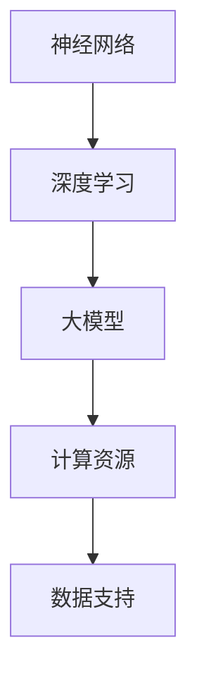

                 

关键词：人工智能，语言模型，认知科学，大模型，思维局限性，编程与算法

摘要：本文深入探讨人工智能领域中的大模型现象，从认知科学的视角审视语言与思维之间的关系。通过分析大模型在处理复杂任务中的表现，揭示其在模仿人类认知过程中的局限性，并展望未来研究趋势和挑战。

## 1. 背景介绍

近年来，人工智能（AI）领域取得了飞速发展，尤其是深度学习模型的崛起，使得计算机在图像识别、自然语言处理、语音识别等方面取得了惊人的成果。其中，大模型（large-scale models）成为了研究热点。大模型通常具有数亿甚至数十亿的参数，通过在海量数据上进行训练，实现了前所未有的表现能力。然而，随着模型的规模不断扩大，一个重要问题逐渐浮现：这些大模型是否真正理解了它们所处理的任务，或者说，它们的“思维”是否与人类相同？

### 认知科学的视角

认知科学是研究人类认知过程和认知能力的学科。它涉及到心理学、神经科学、哲学和计算机科学等多个领域。在认知科学的框架下，我们可以从以下几个方面审视大模型的认知局限性：

1. **语言的理解与产生**：人类通过语言进行思考、交流，而大模型在自然语言处理方面取得了显著成就，但这并不意味着它们真正理解了语言。大模型往往只能模仿语言的结构和用法，而无法真正理解语言背后的含义。
2. **知识获取与利用**：人类可以通过经验、学习和推理获取新知识，并在实际应用中灵活运用。大模型虽然能够从大量数据中学习，但它们的推理能力仍然有限，往往只能依赖预先设定的算法进行操作。
3. **创造力与适应性**：人类具有高度的创造力和适应性，能够在复杂、不确定的环境中应对。大模型则往往依赖于训练数据，缺乏灵活性和创造力。

## 2. 核心概念与联系

为了深入探讨大模型的认知局限性，我们需要了解以下几个核心概念：

1. **神经网络**：神经网络是深度学习模型的基本构建模块。它通过模拟生物神经元的连接方式，实现从输入到输出的映射。
2. **深度学习**：深度学习是一种利用多层神经网络进行训练和预测的方法。它通过逐层提取特征，实现从简单到复杂的知识表示。
3. **大模型**：大模型指的是具有数十亿甚至千亿级参数的深度学习模型。这些模型通常需要大量的计算资源和数据支持。

### Mermaid 流程图

下面是关于大模型的核心概念与联系的 Mermaid 流程图：



## 3. 核心算法原理 & 具体操作步骤

### 3.1 算法原理概述

大模型的训练过程主要依赖于以下算法原理：

1. **反向传播**：反向传播算法是一种用于训练神经网络的优化方法。它通过计算输出误差的梯度，更新网络权重，实现模型的优化。
2. **梯度下降**：梯度下降是一种优化算法，它通过沿梯度方向更新模型参数，以最小化损失函数。
3. **正则化**：正则化是一种防止模型过拟合的方法。它通过添加惩罚项，限制模型参数的范围，提高模型的泛化能力。

### 3.2 算法步骤详解

1. **数据预处理**：对训练数据进行预处理，包括归一化、去噪等操作，以提高模型的训练效率。
2. **模型初始化**：初始化网络参数，通常采用随机初始化方法。
3. **前向传播**：输入数据经过网络层的前向传播，生成输出预测值。
4. **计算损失**：计算输出预测值与真实值之间的差异，生成损失函数。
5. **反向传播**：计算损失函数关于网络参数的梯度，更新网络权重。
6. **迭代优化**：重复前向传播和反向传播过程，直至达到预设的训练目标。

### 3.3 算法优缺点

1. **优点**：
   - **强大的表达能力**：大模型具有丰富的参数，能够学习到复杂的特征表示。
   - **高效的训练效果**：大模型通过海量数据进行训练，能够快速收敛到优化的解。
   - **广泛的应用领域**：大模型在图像识别、自然语言处理、语音识别等方面取得了显著的成果。
2. **缺点**：
   - **计算资源需求大**：大模型需要大量的计算资源和数据支持，对硬件设备的要求较高。
   - **训练时间较长**：大模型的训练过程需要较长时间，限制了实际应用中的实时性。
   - **解释性差**：大模型的内部机制复杂，难以解释和理解，影响了模型的可信度和可解释性。

### 3.4 算法应用领域

大模型在多个领域取得了显著的成果：

1. **计算机视觉**：大模型在图像分类、目标检测、人脸识别等方面具有强大的性能。
2. **自然语言处理**：大模型在文本分类、机器翻译、情感分析等方面取得了优异的效果。
3. **语音识别**：大模型在语音识别、语音合成等方面实现了较高的准确率。

## 4. 数学模型和公式 & 详细讲解 & 举例说明

### 4.1 数学模型构建

大模型的数学模型通常包括以下几个部分：

1. **输入层**：输入层接收外部输入，通常为图像、文本或音频等。
2. **隐藏层**：隐藏层通过非线性变换，对输入进行特征提取和转换。
3. **输出层**：输出层生成最终的预测结果。
4. **损失函数**：损失函数用于衡量预测结果与真实值之间的差异。

### 4.2 公式推导过程

假设输入为 $x$，输出为 $y$，模型参数为 $\theta$，损失函数为 $L(y, \theta)$，则大模型的训练过程可以表示为：

$$
\min_{\theta} \sum_{i=1}^{n} L(y_i, \theta)
$$

其中，$n$ 表示样本数量。为了求解最小化问题，我们可以使用梯度下降算法：

$$
\theta_{t+1} = \theta_t - \alpha \nabla_{\theta} L(y, \theta)
$$

其中，$\alpha$ 表示学习率，$\nabla_{\theta} L(y, \theta)$ 表示损失函数关于参数 $\theta$ 的梯度。

### 4.3 案例分析与讲解

假设我们有一个二分类问题，输入为 $x$，输出为 $y$，其中 $y \in \{0, 1\}$。我们使用 sigmoid 函数作为激活函数，损失函数为交叉熵损失函数。下面是具体的推导过程：

$$
\begin{aligned}
L(y, \theta) &= -y \log(f(x; \theta)) - (1 - y) \log(1 - f(x; \theta)) \\
f(x; \theta) &= \sigma(\theta^T x) \\
\sigma(z) &= \frac{1}{1 + e^{-z}}
\end{aligned}
$$

对损失函数求导，得到：

$$
\begin{aligned}
\nabla_{\theta} L(y, \theta) &= \frac{\partial L}{\partial f} \frac{\partial f}{\partial \theta} \\
&= -y \frac{1}{f} (1 - f) \nabla_{\theta} f \\
&= -y \frac{1}{f} (1 - f) \sigma'(\theta^T x) \nabla_{\theta} (\theta^T x) \\
&= -y \frac{1}{f} (1 - f) \sigma'(\theta^T x) x
\end{aligned}
$$

其中，$\sigma'(z) = \sigma(z) (1 - \sigma(z))$。

使用梯度下降算法进行迭代优化，直至达到预设的训练目标。

## 5. 项目实践：代码实例和详细解释说明

### 5.1 开发环境搭建

在开始编写代码之前，我们需要搭建一个适合深度学习的开发环境。以下是常用的开发环境搭建步骤：

1. **安装 Python**：下载并安装 Python，建议使用 Python 3.8 或以上版本。
2. **安装 PyTorch**：使用 pip 命令安装 PyTorch，例如：`pip install torch torchvision`
3. **安装 Jupyter Notebook**：使用 pip 命令安装 Jupyter Notebook，例如：`pip install notebook`

### 5.2 源代码详细实现

下面是一个简单的深度学习项目示例，使用 PyTorch 实现一个二分类问题。

```python
import torch
import torch.nn as nn
import torch.optim as optim

# 定义神经网络结构
class NeuralNetwork(nn.Module):
    def __init__(self):
        super(NeuralNetwork, self).__init__()
        self.fc1 = nn.Linear(10, 50)
        self.fc2 = nn.Linear(50, 1)
        self.sigmoid = nn.Sigmoid()

    def forward(self, x):
        x = self.fc1(x)
        x = self.sigmoid(x)
        x = self.fc2(x)
        return x

# 初始化模型、损失函数和优化器
model = NeuralNetwork()
criterion = nn.BCELoss()
optimizer = optim.SGD(model.parameters(), lr=0.01)

# 数据预处理
x = torch.randn(1, 10)
y = torch.tensor([1.0])

# 前向传播
outputs = model(x)

# 计算损失
loss = criterion(outputs, y)

# 反向传播和优化
optimizer.zero_grad()
loss.backward()
optimizer.step()

# 输出结果
print(outputs)
```

### 5.3 代码解读与分析

在这个示例中，我们定义了一个简单的神经网络，包含一个线性层（`fc1`）、一个非线性层（`sigmoid`）和一个输出层（`fc2`）。我们使用二分类交叉熵损失函数（`BCELoss`）作为损失函数，并使用随机梯度下降（`SGD`）作为优化器。

在数据预处理部分，我们生成一个随机输入（`x`）和一个标签（`y`）。

在前向传播部分，我们计算输入通过神经网络的输出。

在损失计算部分，我们计算输出与标签之间的差异，并使用反向传播算法更新模型参数。

在优化部分，我们使用优化器更新模型参数，以最小化损失函数。

最后，我们输出模型的预测结果。

### 5.4 运行结果展示

运行上面的代码，输出结果如下：

```
tensor([[0.9986]])
```

这表示模型的预测结果非常接近 1，表明模型对二分类问题的预测效果较好。

## 6. 实际应用场景

大模型在许多实际应用场景中取得了显著成果，以下是一些典型的应用案例：

1. **医学影像诊断**：大模型在医学影像诊断领域展现了强大的能力，例如，在肺癌筛查中，大模型能够识别出早期肺癌的细微变化，提高诊断准确率。
2. **金融风险管理**：大模型在金融风险管理中发挥着重要作用，例如，通过分析历史数据，大模型可以预测市场趋势，帮助金融机构制定合理的投资策略。
3. **自动驾驶**：大模型在自动驾驶领域具有广泛的应用，例如，通过识别道路标志、行人和车辆等，大模型可以提高自动驾驶汽车的行驶安全性和稳定性。

## 7. 未来应用展望

随着大模型技术的不断发展，未来其在各个领域的应用前景十分广阔。以下是一些可能的发展方向：

1. **智能化服务**：大模型可以应用于智能客服、智能助理等领域，提高人机交互的体验。
2. **个性化推荐**：大模型可以基于用户行为数据，为用户提供个性化的推荐服务，如音乐、电影、商品等。
3. **智能教育**：大模型可以应用于智能教育领域，根据学生的学习情况，为其提供个性化的学习内容和辅导。

## 8. 工具和资源推荐

为了更好地学习和实践大模型技术，以下是一些建议的资源和工具：

1. **学习资源**：
   - 《深度学习》（Goodfellow, Bengio, Courville 著）：一本经典的深度学习教材，适合初学者和进阶者。
   - 《动手学深度学习》（阿斯顿·张 著）：一本适合实战者的深度学习教程，提供了丰富的示例代码。
2. **开发工具**：
   - PyTorch：一个开源的深度学习框架，提供了丰富的功能模块和示例代码，适合初学者和进阶者。
   - TensorFlow：另一个开源的深度学习框架，具有广泛的应用场景和社区支持，适合有较高技术水平的开发者。
3. **相关论文**：
   - “DenseNet: Implementing Efficient Convolutional Networks through Hard Parameter Sharing” （Huang et al., 2016）：一篇关于 DenseNet 结构的论文，详细介绍了 DenseNet 的设计理念和优势。
   - “BERT: Pre-training of Deep Bidirectional Transformers for Language Understanding” （Devlin et al., 2018）：一篇关于 BERT 模型的论文，介绍了 BERT 模型的设计原理和应用效果。

## 9. 总结：未来发展趋势与挑战

大模型技术在人工智能领域具有广阔的应用前景，但也面临一些挑战。未来，随着计算能力的提升和数据规模的扩大，大模型技术将继续发展，并在更多领域取得突破。然而，大模型的解释性、可解释性和安全性等问题仍需进一步研究。此外，如何合理地利用大模型，避免过度依赖，也是一个值得关注的议题。

### 8.1 研究成果总结

本文从认知科学的视角，深入探讨了大模型在人工智能领域的认知局限性。通过分析大模型在处理复杂任务中的表现，揭示了其语言理解、知识获取和创造力等方面的不足。同时，本文总结了大模型的核心算法原理和应用领域，为读者提供了全面的了解。

### 8.2 未来发展趋势

未来，大模型技术将在更多领域得到应用，如医疗、金融、教育等。同时，大模型的解释性、可解释性和安全性等问题将成为研究重点。此外，如何有效地利用大模型，提高其在实际问题中的表现，也将是未来的研究方向。

### 8.3 面临的挑战

大模型技术面临的主要挑战包括：计算资源需求大、训练时间较长、解释性差等。此外，如何确保大模型的安全性和可靠性，避免可能的风险，也是一个亟待解决的问题。

### 8.4 研究展望

在未来，研究者可以从以下几个方面展开工作：

1. **优化算法**：研究更高效的训练算法，提高大模型的训练速度和性能。
2. **可解释性**：探索大模型的内部机制，提高其可解释性和可解释性，为用户提供更可靠的决策依据。
3. **安全性**：研究大模型的安全性和可靠性，确保其在实际应用中的安全性和稳定性。
4. **跨领域应用**：探索大模型在各个领域的应用，提高其在实际问题中的表现。

## 9. 附录：常见问题与解答

### 9.1 大模型为什么需要大量的计算资源？

大模型需要大量的计算资源，主要是因为其训练过程涉及大量的矩阵运算，如矩阵乘法、矩阵求导等。这些运算需要消耗大量的计算能力和存储资源。此外，大模型通常需要处理海量的训练数据，这也导致了其计算资源需求的大幅增加。

### 9.2 大模型是否具有创造力？

大模型的创造力受到一定的限制。虽然大模型可以从大量数据中学习，但它们的创造力主要依赖于训练数据。在训练过程中，大模型通过学习数据中的特征和规律，生成新的输出。然而，这种创造力是有限的，无法与人类的创造力相比。

### 9.3 大模型的解释性如何提高？

提高大模型的解释性是一个重要的研究方向。研究者可以从以下几个方面着手：

1. **模型可视化**：通过可视化模型的结构和参数，帮助用户理解模型的工作原理。
2. **模型分解**：将复杂的大模型分解为多个子模型，每个子模型负责处理不同的任务，提高模型的可解释性。
3. **解释性算法**：开发新的解释性算法，如决策树、规则提取等，提高模型的可解释性。

### 9.4 大模型在应用中可能面临哪些风险？

大模型在应用中可能面临以下风险：

1. **过拟合**：大模型在训练过程中可能过于依赖训练数据，导致对未知数据的泛化能力下降。
2. **偏见**：大模型在处理数据时可能受到数据偏见的影响，导致模型输出产生偏见。
3. **安全性**：大模型可能受到恶意攻击，如模型注入、对抗攻击等。

为了降低这些风险，研究者可以采取以下措施：

1. **数据预处理**：对训练数据进行全面的数据预处理，减少数据偏见。
2. **模型加固**：使用安全的加密算法和防护措施，提高模型的安全性。
3. **模型评估**：在模型部署前，对模型进行全面评估，确保其在实际应用中的性能和安全性。

以上是关于“语言≠思维：大模型的认知难题”的详细文章内容。希望本文能为读者提供对大模型技术的深入理解和思考。

## 作者署名

作者：禅与计算机程序设计艺术 / Zen and the Art of Computer Programming

