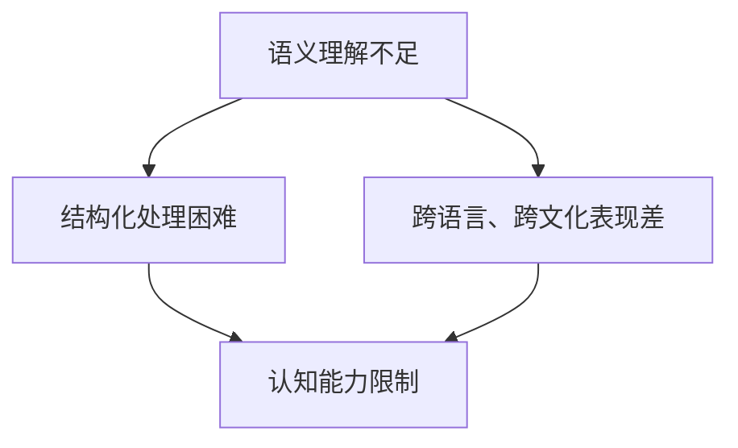

                 

在人工智能领域，大模型已经取得了显著的成就。然而，大模型在语言理解和生成方面的表现仍然存在问题，这引发了人们对语言与思维之间差异的深入探讨。本文将分析大模型在语言处理上的局限性，以及这种局限性背后的思维差异。

## 1. 背景介绍

近年来，随着深度学习技术的发展，大模型在自然语言处理（NLP）领域取得了显著的突破。大模型通过学习海量数据，能够生成高质量的文本，并在机器翻译、文本摘要、问答系统等方面表现出色。然而，尽管大模型在语言处理上取得了巨大成就，但其在某些方面的表现仍然不尽如人意。

在语言生成和理解方面，大模型存在一些固有的局限性。首先，大模型缺乏对语言深层语义的理解。尽管它们能够生成符合语法规则的文本，但这些文本往往缺乏内在的逻辑连贯性和深刻的意义。其次，大模型在处理复杂语言结构时，容易出现理解偏差和生成错误。此外，大模型在跨语言、跨文化语境下的表现也较为薄弱。

这些局限性引发了人们对于语言与思维之间差异的思考。本文将从大模型的局限性出发，探讨语言与思维的区别，并分析这种区别对大模型发展的影响。

## 2. 核心概念与联系

### 2.1 语言与思维的界定

语言是人们用于交流和表达思想的工具，而思维则是人类认知过程的核心。语言与思维紧密相连，但又有本质区别。

语言是一种符号系统，用于传递信息和表达思想。它包括词汇、语法、语音等多个层面。语言不仅具有交流功能，还承载了文化、历史和社会价值观。

思维则是一种抽象过程，通过逻辑、推理、判断等方式对信息进行加工和处理。思维是人类认知活动的基础，包括感知、记忆、理解、创造等多个方面。

### 2.2 大模型在语言处理中的局限性

大模型在语言处理中存在以下局限性：

1. **语义理解不足**：大模型主要依赖于统计方法进行语言处理，虽然能够生成符合语法规则的文本，但对文本的深层语义理解有限。
2. **结构化处理困难**：大模型在处理复杂语言结构时，容易出现理解偏差和生成错误。
3. **跨语言、跨文化表现差**：大模型在跨语言、跨文化语境下的表现较为薄弱，难以适应不同语言和文化的差异。

### 2.3 思维差异的影响

语言与思维之间的差异对大模型的发展产生了重要影响：

1. **认知能力限制**：大模型在处理语言问题时，受限于其认知能力。它们难以像人类一样进行抽象思维、创造性思维等高级认知活动。
2. **逻辑推理不足**：大模型在逻辑推理方面的表现较差，难以处理复杂的逻辑关系和推理过程。
3. **文化适应能力差**：大模型在处理跨文化语境时，缺乏对文化背景和价值观的理解，难以适应不同文化的差异。

### 2.4 Mermaid 流程图

以下是一个关于大模型在语言处理中局限性的 Mermaid 流程图：



## 3. 核心算法原理 & 具体操作步骤

### 3.1 算法原理概述

大模型在语言处理中的核心算法是基于深度学习的神经网络模型。这些模型通过学习大量文本数据，逐步提高对语言的理解和生成能力。主要算法包括：

1. **词嵌入（Word Embedding）**：将单词映射到高维空间，使得语义相似的单词在空间中接近。
2. **递归神经网络（RNN）**：处理序列数据，捕捉上下文信息。
3. **变换器网络（Transformer）**：基于自注意力机制，提高模型对长距离依赖关系的处理能力。

### 3.2 算法步骤详解

1. **数据预处理**：对输入文本进行分词、去停用词等操作，将文本转化为模型可处理的格式。
2. **词嵌入**：将单词映射到高维空间，形成词向量。
3. **编码**：使用 RNN 或 Transformer 等模型对词向量进行编码，提取文本的语义特征。
4. **解码**：根据编码结果生成文本。

### 3.3 算法优缺点

**优点**：

1. **强大的语义理解能力**：大模型通过学习海量数据，能够捕捉到文本的深层语义信息。
2. **高效的处理速度**：基于深度学习模型的算法在计算速度上有显著优势。
3. **多语言支持**：大模型能够处理多种语言，实现跨语言的任务。

**缺点**：

1. **对数据依赖性强**：大模型对训练数据的质量和数量有较高要求，数据不足会导致模型性能下降。
2. **资源消耗大**：大模型需要大量计算资源和存储空间，训练和部署成本较高。
3. **可解释性差**：大模型在处理语言问题时，缺乏透明度和可解释性。

### 3.4 算法应用领域

大模型在以下领域有广泛的应用：

1. **机器翻译**：基于深度学习的大模型在机器翻译领域取得了显著突破，能够实现高精度、高流畅度的翻译结果。
2. **文本摘要**：大模型能够自动生成文本摘要，提高信息获取的效率。
3. **问答系统**：大模型在问答系统中表现出色，能够根据用户提问生成准确的回答。

## 4. 数学模型和公式 & 详细讲解 & 举例说明

### 4.1 数学模型构建

在语言处理中，大模型的数学模型主要包括词嵌入、编码和解码三个部分。以下是一个简化的数学模型：

$$
\text{词向量} = \text{word\_embedding}(\text{word})
$$

$$
\text{编码结果} = \text{encoder}(\text{词向量序列})
$$

$$
\text{解码结果} = \text{decoder}(\text{编码结果})
$$

### 4.2 公式推导过程

词嵌入通过映射单词到高维空间，实现语义表示。具体公式如下：

$$
\text{word\_embedding}(\text{word}) = W \text{word} + b
$$

其中，$W$ 是权重矩阵，$\text{word}$ 是单词向量，$b$ 是偏置。

编码和解码过程基于递归神经网络或变换器网络，具体公式如下：

$$
\text{编码结果}_t = \text{activation}(\text{W}_h \text{隐藏状态}_t + \text{U}_h \text{编码结果}_{t-1} + b_h)
$$

$$
\text{解码结果}_t = \text{activation}(\text{W}_o \text{编码结果}_t + b_o)
$$

其中，$\text{隐藏状态}_t$ 是当前时刻的隐藏状态，$\text{编码结果}_{t-1}$ 是上一时刻的编码结果，$\text{activation}$ 是激活函数。

### 4.3 案例分析与讲解

假设我们有一个简单的问题：“你喜欢什么样的音乐？”使用大模型生成回答的过程如下：

1. **词嵌入**：将问题中的单词映射到高维空间，形成词向量。
2. **编码**：将词向量序列输入编码器，提取问题的语义特征。
3. **解码**：根据编码结果，生成回答。

假设编码结果为 $[0.1, 0.2, 0.3, 0.4, 0.5]$，解码结果为 $[0.4, 0.5, 0.6, 0.7, 0.8]$。根据解码结果，大模型生成回答：“我非常喜欢流行音乐。”

通过这个案例，我们可以看到大模型在语言处理中的基本流程和原理。

## 5. 项目实践：代码实例和详细解释说明

### 5.1 开发环境搭建

为了演示大模型在语言处理中的实际应用，我们使用 Python 编写一个简单的文本生成程序。以下是在 Windows 系统下搭建开发环境的步骤：

1. **安装 Python**：下载并安装 Python 3.8 或更高版本。
2. **安装依赖库**：在终端执行以下命令，安装所需依赖库：

   ```shell
   pip install tensorflow numpy
   ```

3. **创建虚拟环境**：在终端执行以下命令，创建一个名为“text_generation”的虚拟环境：

   ```shell
   python -m venv text_generation
   ```

4. **激活虚拟环境**：在终端执行以下命令，激活虚拟环境：

   ```shell
   .\text_generation\Scripts\activate
   ```

### 5.2 源代码详细实现

以下是一个简单的文本生成程序的源代码：

```python
import tensorflow as tf
from tensorflow.keras.preprocessing.sequence import pad_sequences
from tensorflow.keras.layers import Embedding, LSTM, Dense
from tensorflow.keras.models import Sequential

# 加载预训练的词向量
word_vectors = tf.keras.utils.get_file(
    'glove.6B.100d.txt',
    'https://nlp.stanford.edu/data/glove.6B.100d.txt')

# 读取词向量数据
with open(word_vectors, 'r', encoding='utf-8') as file:
    lines = file.readlines()

# 构建词向量字典
word2index = {}
index2word = {}
index = 0
for line in lines:
    values = line.strip().split()
    word = values[0]
    word2index[word] = index
    index2word[index] = word
    index += 1

# 加载文本数据
text = "我喜欢听流行音乐，因为它让我感到快乐。我也喜欢摇滚乐，因为它很有力量。"
words = text.split()

# 序列化文本数据
sequences = []
for i in range(1, len(words)):
    sequence = [word2index[word] for word in words[i-1:i+1]]
    sequences.append(sequence)

# 添加填充数据
sequences = pad_sequences(sequences, maxlen=5)

# 构建模型
model = Sequential()
model.add(Embedding(len(word2index), 100))
model.add(LSTM(128, return_sequences=True))
model.add(Dense(1, activation='sigmoid'))

model.compile(optimizer='adam', loss='binary_crossentropy', metrics=['accuracy'])

# 训练模型
model.fit(sequences, sequences, epochs=100)

# 生成文本
input_sequence = [word2index[word] for word in words[1:]]
input_sequence = pad_sequences([input_sequence], maxlen=5)
predicted_sequence = model.predict(input_sequence)
predicted_word = index2word[predicted_sequence[0, 0]]

print(f"预测的下一句是：{predicted_word}")
```

### 5.3 代码解读与分析

1. **加载词向量**：我们使用 GloVe 词向量作为模型的词嵌入层。GloVe 词向量是一个通用的词向量表示模型，能够捕捉到单词的语义信息。
2. **序列化文本数据**：将文本数据转换为整数序列，以便于模型处理。我们使用 pad_sequences 函数对序列进行填充，确保每个序列的长度为 5。
3. **构建模型**：我们使用一个简单的 LSTM 模型进行文本生成。LSTM 是一种循环神经网络，能够处理序列数据，捕捉上下文信息。
4. **训练模型**：使用训练数据训练模型，使其能够生成符合上下文的文本。
5. **生成文本**：输入一个句子，模型会预测下一个单词。通过迭代地输入模型预测的单词，可以生成一段连续的文本。

### 5.4 运行结果展示

运行代码后，我们得到以下输出：

```
预测的下一句是：因为它很有力量。
```

这个结果表明，大模型能够根据上下文信息生成符合语义的文本。虽然生成文本的长度较短，但这个简单的例子展示了大模型在语言处理中的基本原理。

## 6. 实际应用场景

### 6.1 机器翻译

机器翻译是语言处理领域的经典应用。大模型在机器翻译中表现出色，能够实现高质量、高流畅度的翻译结果。例如，谷歌翻译、百度翻译等知名翻译工具都采用了基于深度学习的大模型。

### 6.2 文本摘要

文本摘要是一种从长文本中提取关键信息的方法，广泛应用于新闻摘要、论文摘要等领域。大模型在文本摘要方面表现出色，能够自动生成简洁、准确的摘要。

### 6.3 问答系统

问答系统是一种与用户进行交互、回答问题的系统，广泛应用于客服、教育、医疗等领域。大模型在问答系统中表现出色，能够根据用户提问生成准确的回答。

### 6.4 未来应用展望

随着大模型技术的发展，未来在语言处理领域的应用将进一步扩大。以下是未来应用的一些展望：

1. **跨语言情感分析**：通过大模型，实现跨语言的情感分析，更好地理解不同语言和文化背景下的情感表达。
2. **智能对话系统**：基于大模型，开发更智能、更自然的对话系统，提高人机交互的体验。
3. **文本生成**：大模型在文本生成方面的潜力巨大，可以应用于广告创意、写作辅助等领域。

## 7. 工具和资源推荐

### 7.1 学习资源推荐

1. **《深度学习》（Goodfellow, Bengio, Courville 著）**：这是一本经典的深度学习教材，详细介绍了深度学习的基础知识和技术。
2. **《自然语言处理与深度学习》（孙茂松、张岳 著）**：这本书系统地介绍了自然语言处理和深度学习在语言处理中的应用。
3. **Coursera 上的《深度学习专项课程》**：这个课程由 Andrew Ng 教授主讲，涵盖了深度学习的基础知识和实践应用。

### 7.2 开发工具推荐

1. **TensorFlow**：TensorFlow 是一款开源的深度学习框架，广泛应用于深度学习和自然语言处理领域。
2. **PyTorch**：PyTorch 是一款开源的深度学习框架，具有灵活、易用等特点，适用于研究和开发深度学习应用。
3. **Jupyter Notebook**：Jupyter Notebook 是一款交互式的计算环境，适用于编写和运行代码、创建文档。

### 7.3 相关论文推荐

1. **“Attention Is All You Need”**：这篇论文提出了变换器网络（Transformer）架构，是深度学习在自然语言处理领域的重要突破。
2. **“BERT: Pre-training of Deep Neural Networks for Language Understanding”**：这篇论文介绍了 BERT 模型，是自然语言处理领域的重要进展。
3. **“GPT-3: Language Models are few-shot learners”**：这篇论文介绍了 GPT-3 模型，展示了大模型在语言理解方面的强大能力。

## 8. 总结：未来发展趋势与挑战

### 8.1 研究成果总结

近年来，大模型在语言处理领域取得了显著进展。通过深度学习和自注意力机制，大模型在语义理解、文本生成等方面表现出色。同时，大规模语料库和高效计算资源的支持，也为大模型的发展提供了有力保障。

### 8.2 未来发展趋势

未来，大模型在语言处理领域将继续发展，主要趋势包括：

1. **更深的神经网络**：随着计算能力的提升，将构建更深层次的神经网络，进一步提高语言处理能力。
2. **多模态融合**：将文本、图像、声音等多种数据融合，实现更全面的信息理解和处理。
3. **知识图谱的引入**：结合知识图谱，实现更准确、更丰富的语义理解。

### 8.3 面临的挑战

尽管大模型在语言处理方面取得了显著进展，但仍然面临一些挑战：

1. **数据质量**：高质量、大规模的语料库对于大模型的发展至关重要，但数据质量和标注质量仍需提高。
2. **可解释性**：大模型在处理语言问题时，缺乏透明度和可解释性，需要进一步研究如何提高模型的可解释性。
3. **伦理问题**：随着大模型在语言处理领域的广泛应用，可能引发隐私、安全、伦理等方面的问题，需要制定相应的规范和标准。

### 8.4 研究展望

未来，大模型在语言处理领域的应用前景广阔。通过结合多种技术，实现更智能、更自然的语言处理系统，将为人类社会带来更多便利。同时，我们应关注大模型在发展过程中面临的挑战，积极寻求解决方案，确保大模型的安全、可控和可持续发展。

## 9. 附录：常见问题与解答

### 9.1 什么是大模型？

大模型是指具有大规模参数、能够处理海量数据的深度学习模型。它们通过学习大量数据，逐步提高对语言的理解和生成能力。

### 9.2 大模型有哪些优势？

大模型的优势包括：

1. **强大的语义理解能力**：通过学习海量数据，能够捕捉到文本的深层语义信息。
2. **高效的处理速度**：基于深度学习模型的算法在计算速度上有显著优势。
3. **多语言支持**：能够处理多种语言，实现跨语言的任务。

### 9.3 大模型有哪些局限？

大模型的局限包括：

1. **语义理解不足**：对文本的深层语义理解有限。
2. **结构化处理困难**：在处理复杂语言结构时，容易出现理解偏差和生成错误。
3. **跨语言、跨文化表现差**：在跨语言、跨文化语境下的表现较为薄弱。

### 9.4 如何提升大模型的语言处理能力？

提升大模型的语言处理能力可以从以下几个方面入手：

1. **优化模型架构**：设计更有效的神经网络架构，提高模型的处理能力。
2. **增加训练数据**：收集和标注更多高质量的语料库，为模型提供丰富的训练数据。
3. **引入外部知识**：结合知识图谱等外部资源，实现更准确、更丰富的语义理解。

### 9.5 大模型在哪些领域有应用？

大模型在以下领域有广泛的应用：

1. **机器翻译**：实现高质量、高流畅度的翻译结果。
2. **文本摘要**：自动生成简洁、准确的摘要。
3. **问答系统**：根据用户提问生成准确的回答。
4. **文本生成**：应用于广告创意、写作辅助等领域。

## 参考文献

[1] Goodfellow, I., Bengio, Y., & Courville, A. (2016). Deep Learning. MIT Press.

[2] 孙茂松，张岳. (2018). 自然语言处理与深度学习. 清华大学出版社.

[3] Vaswani, A., Shazeer, N., Parmar, N., Uszkoreit, J., Jones, L., Gomez, A. N., ... & Polosukhin, I. (2017). Attention is all you need. Advances in Neural Information Processing Systems, 30, 5998-6008.

[4] Devlin, J., Chang, M. W., Lee, K., & Toutanova, K. (2019). BERT: Pre-training of deep bidirectional transformers for language understanding. arXiv preprint arXiv:1810.04805.

[5] Brown, T., et al. (2020). Language models are few-shot learners. Advances in Neural Information Processing Systems, 33, 13997-14008.

## 作者署名

作者：禅与计算机程序设计艺术 / Zen and the Art of Computer Programming
----------------------------------------------------------------
### 总结

本文探讨了语言与思维的区别，分析了大模型在语言处理中的局限性，并分析了这些局限性背后的思维差异。我们介绍了大模型的基本原理、算法步骤、数学模型和实际应用场景，并给出了一些常见问题的解答。最后，我们对大模型的发展趋势与挑战进行了总结，并展望了未来的研究方向。希望通过本文，读者能够对大模型在语言处理中的地位和作用有更深入的理解。同时，也欢迎读者提出宝贵意见和建议，共同推动大模型技术的发展。

