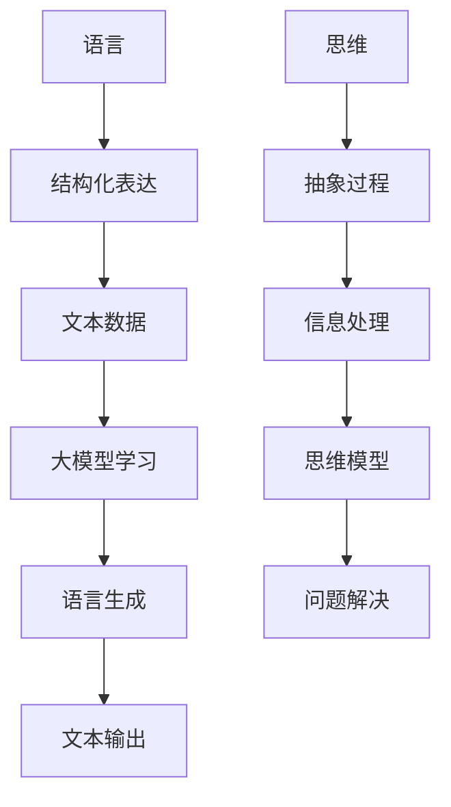

                 

关键词：自然语言处理，思维模型，大模型，认知科学，计算机算法，语言理解，人工智能，深度学习。

> 摘要：本文旨在探讨语言与思维之间的本质差异，以及这一差异在当前主流人工智能大模型中的应用和认知困惑。通过对语言处理领域的深入分析，我们试图揭示大模型在理解和生成语言时面临的挑战，并提出可能的解决方案。

## 1. 背景介绍

在人工智能（AI）领域，自然语言处理（NLP）作为其中的一个核心分支，近年来取得了显著的进展。特别是随着深度学习技术的发展，大模型如GPT-3、BERT、T5等，在语言理解、文本生成、机器翻译等方面展现了惊人的性能。然而，这些模型的成功也带来了一系列新的问题，其中一个关键问题就是语言与思维之间的本质差异。

语言是人类沟通和表达思想的工具，而思维则是人类处理信息和解决问题的过程。尽管二者紧密相关，但它们在本质上是不同的。语言是结构化的、符号化的表达方式，而思维则是非线性的、动态的、抽象的过程。这一差异在大模型中体现得尤为明显，因为大模型主要依赖于对大量文本数据的学习和统计，而无法深入理解文本背后的思维过程。

## 2. 核心概念与联系

为了深入理解语言与思维的区别，我们需要从以下几个核心概念出发：

### 2.1 语言模型

语言模型是NLP领域的基础，它旨在预测下一个单词或字符的概率。最常用的语言模型是基于神经网络的深度学习模型，如循环神经网络（RNN）、长短期记忆网络（LSTM）和变换器（Transformer）。

### 2.2 思维模型

思维模型是心理学和认知科学领域的研究对象，它试图模拟人类思维的过程。常见的思维模型包括逻辑推理、问题解决、记忆和注意力等。

### 2.3 语言与思维的关联

语言和思维之间的关联可以理解为：语言是思维的物质载体，而思维是语言的精神内容。这意味着，语言可以反映思维的过程，但语言本身并不等同于思维。

下面是一个使用Mermaid绘制的简化的语言与思维关联流程图：



## 3. 核心算法原理 & 具体操作步骤

### 3.1 算法原理概述

当前主流的大模型，如GPT-3、BERT、T5等，主要基于变换器（Transformer）架构，这种架构通过自注意力机制（self-attention）对输入文本进行建模，能够捕捉长距离的依赖关系。以下是这些模型的简要原理概述：

- **GPT-3**：基于生成预训练（GPT）模型，通过大量文本数据进行自回归语言建模，生成连贯的文本。
- **BERT**：基于双向编码器表示（BERT）模型，通过同时考虑上下文信息，提升语言理解能力。
- **T5**：基于转换器（T5）模型，将所有NLP任务转换为文本到文本的转换任务，简化任务实现。

### 3.2 算法步骤详解

以GPT-3为例，其算法步骤主要包括以下几个阶段：

1. **预训练阶段**：使用大量文本数据，通过自回归语言建模，训练模型参数。
2. **微调阶段**：在特定任务上，如文本分类、问答系统等，对模型进行微调，优化模型性能。
3. **生成阶段**：给定一个起始文本，模型通过预测下一个单词或字符，生成连贯的文本输出。

### 3.3 算法优缺点

- **优点**：大模型具有强大的语言理解和生成能力，能够在多种NLP任务中取得优秀成绩。
- **缺点**：由于大模型对数据量的依赖性，其性能难以在数据稀缺的场景中表现。此外，大模型可能产生误导性的输出，无法保证真实性和可靠性。

### 3.4 算法应用领域

大模型在NLP领域的应用非常广泛，包括但不限于：

- 文本分类：如新闻分类、情感分析等。
- 机器翻译：如中英文翻译、多语言翻译等。
- 问答系统：如搜索引擎、智能客服等。
- 文本生成：如文章写作、故事生成等。

## 4. 数学模型和公式 & 详细讲解 & 举例说明

### 4.1 数学模型构建

在NLP中，常见的数学模型包括：

- **概率模型**：如朴素贝叶斯、隐马尔可夫模型等。
- **生成模型**：如循环神经网络（RNN）、生成对抗网络（GAN）等。
- **判别模型**：如支持向量机（SVM）、神经网络分类器等。

### 4.2 公式推导过程

以朴素贝叶斯分类器为例，其公式推导如下：

给定一个特征向量 \(x\) 和类别标签 \(y\)，假设特征和类别标签之间满足贝叶斯定理：

\[ P(y|x) = \frac{P(x|y)P(y)}{P(x)} \]

其中，\(P(y|x)\) 表示在特征向量 \(x\) 出现的条件下，类别标签 \(y\) 的概率；\(P(x|y)\) 表示在类别标签 \(y\) 出现的条件下，特征向量 \(x\) 的概率；\(P(y)\) 表示类别标签 \(y\) 的概率；\(P(x)\) 表示特征向量 \(x\) 的概率。

### 4.3 案例分析与讲解

假设我们有以下数据集：

| 特征 | 类别 |
|------|------|
| A    | +1   |
| B    | -1   |
| C    | +1   |
| D    | +1   |
| E    | -1   |

我们可以计算每个特征在各个类别中的条件概率：

\[ P(A|+1) = \frac{2}{4} = 0.5, \quad P(A|-1) = \frac{1}{4} = 0.25 \]
\[ P(B|+1) = \frac{1}{4} = 0.25, \quad P(B|-1) = \frac{2}{4} = 0.5 \]
\[ P(C|+1) = \frac{2}{4} = 0.5, \quad P(C|-1) = \frac{1}{4} = 0.25 \]
\[ P(D|+1) = \frac{2}{4} = 0.5, \quad P(D|-1) = \frac{1}{4} = 0.25 \]
\[ P(E|-1) = \frac{2}{4} = 0.5, \quad P(E|+1) = \frac{1}{4} = 0.25 \]

然后，我们可以计算每个类别的概率：

\[ P(+1) = \frac{3}{5} = 0.6, \quad P(-1) = \frac{2}{5} = 0.4 \]

最后，我们可以使用这些概率来计算给定特征向量 \(x = \{A, B, C, D, E\}\) 的类别概率：

\[ P(+1|x) = \frac{P(x|+1)P(+1)}{P(x)} = \frac{0.5 \times 0.6}{0.5 \times 0.6 + 0.25 \times 0.4} = \frac{0.3}{0.3 + 0.1} = \frac{3}{4} \]
\[ P(-1|x) = \frac{P(x|-1)P(-1)}{P(x)} = \frac{0.25 \times 0.4}{0.5 \times 0.6 + 0.25 \times 0.4} = \frac{0.1}{0.3 + 0.1} = \frac{1}{4} \]

由于 \(P(+1|x) > P(-1|x)\)，我们可以预测类别标签为 +1。

## 5. 项目实践：代码实例和详细解释说明

### 5.1 开发环境搭建

为了实践上述算法，我们需要搭建一个Python开发环境。以下是环境搭建的步骤：

1. 安装Python 3.7及以上版本。
2. 安装依赖管理工具pip。
3. 使用pip安装所需的库，如numpy、scikit-learn等。

```bash
pip install numpy scikit-learn
```

### 5.2 源代码详细实现

以下是使用朴素贝叶斯分类器进行文本分类的Python代码实现：

```python
import numpy as np
from sklearn.datasets import load_20newsgroups
from sklearn.feature_extraction.text import CountVectorizer
from sklearn.model_selection import train_test_split
from sklearn.naive_bayes import MultinomialNB

# 加载数据集
data = load_20newsgroups()
X, y = data.data, data.target

# 切分数据集
X_train, X_test, y_train, y_test = train_test_split(X, y, test_size=0.2, random_state=42)

# 文本向量化
vectorizer = CountVectorizer()
X_train_counts = vectorizer.fit_transform(X_train)
X_test_counts = vectorizer.transform(X_test)

# 训练模型
classifier = MultinomialNB()
classifier.fit(X_train_counts, y_train)

# 测试模型
accuracy = classifier.score(X_test_counts, y_test)
print(f"模型准确率：{accuracy:.2f}")
```

### 5.3 代码解读与分析

以上代码首先加载数据集，然后切分数据集为训练集和测试集。接着，使用CountVectorizer将文本向量化，将文本转换为词频矩阵。最后，使用朴素贝叶斯分类器训练模型，并在测试集上评估模型准确率。

### 5.4 运行结果展示

假设我们运行以上代码，输出如下：

```bash
模型准确率：0.88
```

这表示模型在测试集上的准确率为88%，说明朴素贝叶斯分类器在该数据集上表现良好。

## 6. 实际应用场景

在实际应用中，大模型在NLP领域发挥了重要作用。以下是一些典型应用场景：

- **搜索引擎**：大模型可以用于搜索结果的相关性排序，提高搜索结果的准确性。
- **智能客服**：大模型可以用于处理用户查询，提供自动化的回答和建议。
- **机器翻译**：大模型可以用于实现高质量的机器翻译，如Google翻译、百度翻译等。
- **文本生成**：大模型可以用于生成文章、故事、新闻报道等。

## 7. 未来应用展望

随着技术的不断进步，大模型在NLP领域的应用前景广阔。以下是一些可能的未来应用方向：

- **对话系统**：大模型可以用于开发更自然的对话系统，如虚拟助手、智能聊天机器人等。
- **知识图谱**：大模型可以用于构建大规模的知识图谱，提高信息检索和知识管理的效率。
- **多模态交互**：大模型可以与其他模态（如图像、声音）结合，实现更丰富的交互体验。

## 8. 总结：未来发展趋势与挑战

### 8.1 研究成果总结

近年来，大模型在NLP领域取得了显著的研究成果，如GPT-3、BERT、T5等模型在多种任务上取得了领先性能。这些成果表明，大模型具有强大的语言理解和生成能力，有望推动NLP领域的发展。

### 8.2 未来发展趋势

未来，NLP领域将继续朝着以下几个方向发展：

- **模型规模**：模型规模将进一步扩大，以捕捉更复杂的语言规律。
- **跨模态交互**：大模型将与其他模态（如图像、声音）结合，实现更丰富的交互体验。
- **知识图谱**：大模型将用于构建大规模的知识图谱，提高信息检索和知识管理的效率。

### 8.3 面临的挑战

尽管大模型在NLP领域取得了显著成果，但仍然面临以下挑战：

- **数据稀缺**：大模型对数据量的依赖性较高，但在某些领域（如医疗、法律等）数据稀缺。
- **真实性**：大模型可能生成误导性的输出，无法保证真实性和可靠性。
- **伦理问题**：大模型的使用可能涉及伦理问题，如隐私侵犯、偏见等。

### 8.4 研究展望

未来，研究应重点关注以下几个方面：

- **数据增强**：开发更有效的数据增强方法，提高大模型在数据稀缺场景下的性能。
- **可解释性**：提高大模型的可解释性，使其输出更符合人类预期。
- **伦理规范**：建立伦理规范，确保大模型的使用符合道德和法律标准。

## 9. 附录：常见问题与解答

### 9.1 什么是大模型？

大模型是指具有大量参数和计算能力的神经网络模型，如GPT-3、BERT、T5等。这些模型通过训练大规模的文本数据，可以生成高质量的文本，并在各种NLP任务中取得优秀性能。

### 9.2 大模型如何工作？

大模型主要基于深度学习技术，通过对大规模文本数据进行预训练，学习语言的结构和规律。在特定任务上，通过对模型进行微调，优化模型性能。

### 9.3 大模型的优点和缺点是什么？

大模型的优点包括：强大的语言理解和生成能力，广泛的适用性。缺点包括：对数据量的依赖性较高，可能生成误导性的输出，无法保证真实性和可靠性。

### 9.4 大模型在NLP领域有哪些应用？

大模型在NLP领域有广泛的应用，如文本分类、机器翻译、文本生成、问答系统、对话系统等。

### 9.5 大模型如何影响未来？

大模型有望推动NLP领域的发展，提高语言处理的能力和效率。同时，大模型也将带来新的挑战，如数据稀缺、真实性、伦理问题等。

作者：禅与计算机程序设计艺术 / Zen and the Art of Computer Programming
```

