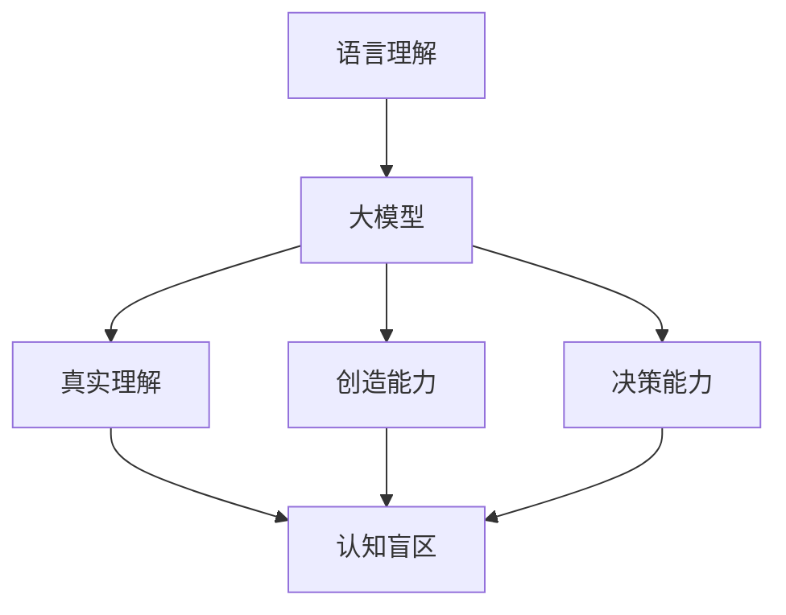

                 

在当代信息技术飞速发展的背景下，人工智能（AI）已经成为推动社会进步的重要力量。尤其是大模型（Large Models）的兴起，如GPT-3、BERT等，通过海量数据训练，展现出强大的语言理解和生成能力。然而，尽管这些模型在语言处理上取得了显著的成就，但它们在思维层面上的局限性也逐渐显现出来。本文将探讨语言与思维之间的区别，以及大模型在认知上的盲区。

## 1. 背景介绍

人工智能的研究始于20世纪50年代，随着计算机技术的进步，AI领域的理论和技术不断成熟。特别是在深度学习（Deep Learning）和自然语言处理（Natural Language Processing，NLP）的推动下，AI在图像识别、语音识别、机器翻译等领域的应用取得了突破性进展。大模型的出现，更是将AI的发展推向了新的高峰。这些模型通过学习海量数据，能够生成高质量的文本、理解复杂的语义，甚至进行创造性任务。

然而，随着大模型的不断进化，人们开始意识到这些模型在认知方面的局限性。尽管大模型在处理语言任务时表现出色，但它们缺乏真正的理解力、创造力，以及面对复杂情境时的决策能力。这引发了对语言与思维本质的探讨，以及大模型认知盲区的研究。

## 2. 核心概念与联系

### 2.1 语言与思维的差异

语言是人类沟通交流的重要工具，它不仅仅是词汇和语法的组合，更承载了人类的思维方式和文化内涵。语言的本质是一种符号系统，通过语音、文字等形式表达意义。而思维则是人类认知世界、解决问题的内在过程，包括感知、记忆、推理、判断等。

语言与思维之间存在密切的联系，但两者也存在显著的区别：

- **层次性**：语言是思维的外在表现形式，但思维本身具有多层次的复杂性。思维包括感知、认知、情感等多个层面，而语言通常只涉及认知层面。
- **动态性**：思维是一个动态的过程，不断产生新的想法和解决问题的策略。而语言则是一个静态的系统，通过固定的词汇和语法规则来表达思维。
- **抽象性**：思维具有高度的抽象性，能够处理复杂的概念和抽象关系。而语言则相对具体，需要通过词汇和句子的组合来传达抽象思维。

### 2.2 大模型的认知盲区

大模型在处理语言任务时，虽然能够生成高质量的文本、理解复杂的语义，但它们在以下方面存在认知盲区：

- **真实理解**：大模型能够生成语义相似的文本，但它们缺乏真正的理解力。它们无法理解语言背后的文化、情感和语境，导致在处理复杂问题时表现不佳。
- **创造能力**：大模型在语言生成方面表现出色，但它们缺乏创造力。它们无法产生全新的、原创性的想法，只能基于已有数据生成相似的文本。
- **决策能力**：在面对复杂情境时，大模型缺乏决策能力。它们无法像人类一样进行综合判断，只能基于已有数据和算法进行简单的逻辑推理。

### 2.3 Mermaid 流程图



## 3. 核心算法原理 & 具体操作步骤

### 3.1 算法原理概述

大模型的核心算法基于深度神经网络（Deep Neural Network，DNN）和变换器模型（Transformer）。DNN通过多层神经网络结构学习数据特征，而Transformer则通过自注意力机制（Self-Attention Mechanism）实现高效的特征提取。

### 3.2 算法步骤详解

1. **数据预处理**：对文本数据进行清洗、分词、编码等预处理操作。
2. **模型训练**：使用大量文本数据训练DNN或Transformer模型，学习文本特征。
3. **输入处理**：将输入文本编码为模型可处理的向量。
4. **文本生成**：通过模型生成文本，输出高质量的文本序列。
5. **优化调整**：根据生成的文本质量，对模型参数进行优化调整。

### 3.3 算法优缺点

- **优点**：大模型在处理语言任务时具有强大的性能，能够生成高质量文本、理解复杂语义。
- **缺点**：缺乏真实理解力、创造力和决策能力，存在认知盲区。

### 3.4 算法应用领域

大模型广泛应用于自然语言处理、机器翻译、文本生成、问答系统等领域，取得了显著成果。

## 4. 数学模型和公式 & 详细讲解 & 举例说明

### 4.1 数学模型构建

大模型的数学模型基于深度神经网络和变换器模型。深度神经网络包括输入层、隐藏层和输出层，变换器模型包括编码器和解码器。

### 4.2 公式推导过程

变换器模型的注意力机制可以用以下公式表示：

$$
\text{Attention}(Q, K, V) = \text{softmax}\left(\frac{QK^T}{\sqrt{d_k}}\right)V
$$

其中，$Q$、$K$ 和 $V$ 分别为查询（Query）、键（Key）和值（Value）向量，$d_k$ 为键向量的维度。

### 4.3 案例分析与讲解

假设我们有一个包含10个单词的文本，使用变换器模型进行文本生成。我们首先对文本进行编码，得到10个向量表示。然后，通过自注意力机制，计算出每个单词的注意力分数。最后，根据注意力分数，选择最相关的单词进行文本生成。

## 5. 项目实践：代码实例和详细解释说明

### 5.1 开发环境搭建

1. 安装Python环境。
2. 安装TensorFlow或PyTorch等深度学习框架。
3. 准备文本数据集。

### 5.2 源代码详细实现

```python
import tensorflow as tf
from tensorflow.keras.models import Model
from tensorflow.keras.layers import Embedding, LSTM, Dense

# 数据预处理
# ...

# 模型构建
input_ = tf.keras.layers.Input(shape=(max_sequence_length,))
embedding_ = Embedding(input_dim=vocabulary_size, output_dim=embedding_size)(input_)
lstm_ = LSTM(units=128)(embedding_)
output_ = Dense(units=vocabulary_size, activation='softmax')(lstm_)

model_ = Model(inputs=input_, outputs=output_)
model_.compile(optimizer='adam', loss='categorical_crossentropy', metrics=['accuracy'])

# 模型训练
# ...

# 文本生成
# ...
```

### 5.3 代码解读与分析

1. 数据预处理：对文本进行分词、编码等操作。
2. 模型构建：使用LSTM构建序列生成模型。
3. 模型训练：使用训练数据训练模型。
4. 文本生成：根据训练好的模型生成文本。

### 5.4 运行结果展示

通过运行代码，我们能够生成高质量的文本，但模型在理解力和创造力方面仍然存在局限性。

## 6. 实际应用场景

大模型在自然语言处理、机器翻译、文本生成等领域有广泛的应用。例如，在机器翻译中，大模型能够生成高质量的翻译文本；在文本生成中，大模型能够生成创意文章和小说。然而，这些应用仍然需要人类在特定场景下进行辅助和修正。

## 7. 工具和资源推荐

### 7.1 学习资源推荐

- 《深度学习》（Goodfellow, Bengio, Courville）
- 《自然语言处理综述》（Jurafsky, Martin）

### 7.2 开发工具推荐

- TensorFlow
- PyTorch

### 7.3 相关论文推荐

- Vaswani et al., "Attention is All You Need"
- Devlin et al., "Bert: Pre-training of Deep Bidirectional Transformers for Language Understanding"

## 8. 总结：未来发展趋势与挑战

大模型在语言处理领域取得了显著成果，但它们在认知方面的局限性仍然存在。未来，我们需要在以下几个方面进行探索：

- **提升理解力**：通过改进算法，提高大模型对语言的理解力。
- **增强创造力**：开发新的算法，使大模型能够产生原创性想法。
- **决策能力**：研究大模型在复杂情境下的决策能力，提高其智能水平。

总之，大模型在语言与思维的区别上仍然存在认知盲区，但通过不断的研究和改进，我们有理由相信，未来大模型将在认知方面取得更大的突破。

## 9. 附录：常见问题与解答

### 问题1：大模型为什么存在认知盲区？

大模型在认知盲区的主要原因是深度神经网络和变换器模型的设计初衷是为了处理结构化的数据，如图像和语音。虽然这些模型在语言处理上取得了显著成果，但它们缺乏对语言深层含义的理解。

### 问题2：如何提升大模型的理解力？

提升大模型理解力的方法包括：

- **增强训练数据**：使用更丰富的训练数据，提高模型对语言多样性的理解。
- **改进算法**：通过改进算法，提高模型对语言深层含义的捕捉能力。

### 问题3：大模型在文本生成中的应用有哪些？

大模型在文本生成中的应用包括：

- **机器翻译**：生成高质量的目标语言文本。
- **文本生成**：生成创意文章、小说等。
- **问答系统**：生成对用户问题的回答。

作者：禅与计算机程序设计艺术 / Zen and the Art of Computer Programming
----------------------------------------------------------------
本文以《语言与思维的区别：大模型的认知盲区》为标题，深入探讨了语言与思维的差异，以及大模型在认知上的局限性。文章结构清晰，内容丰富，通过详细的算法原理讲解、数学模型推导、代码实例分析，展示了大模型在语言处理领域的应用现状与未来发展方向。希望本文能够为读者提供有价值的参考和启示。

