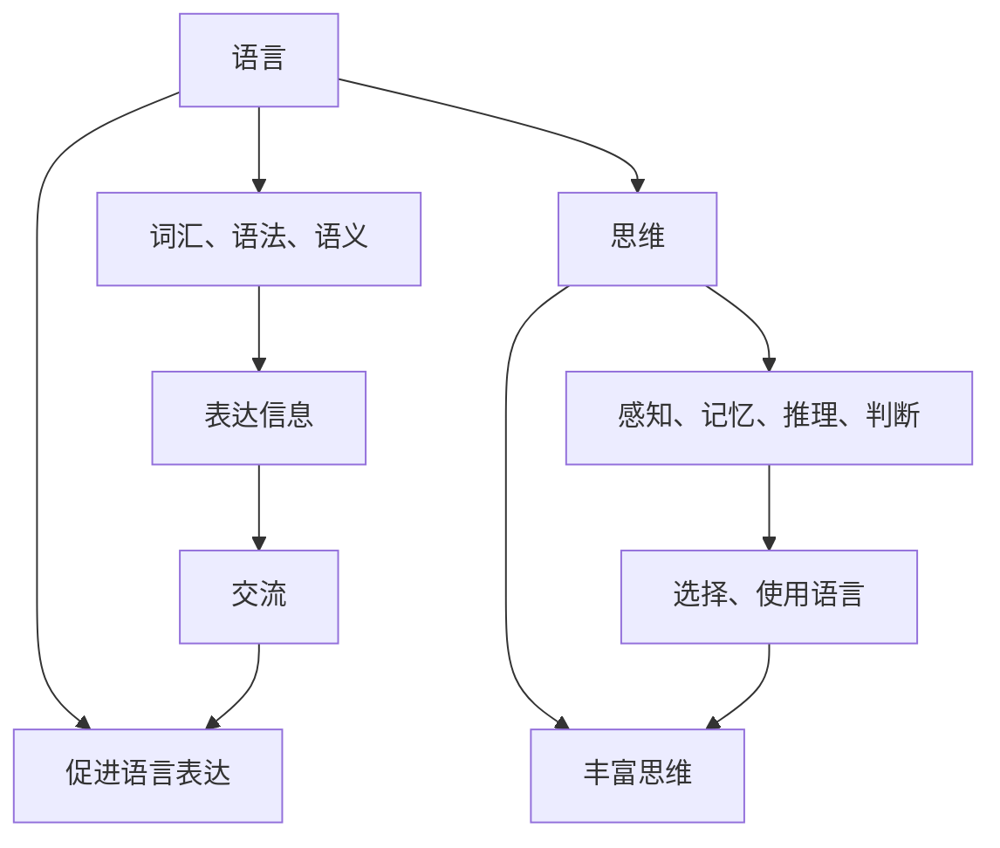
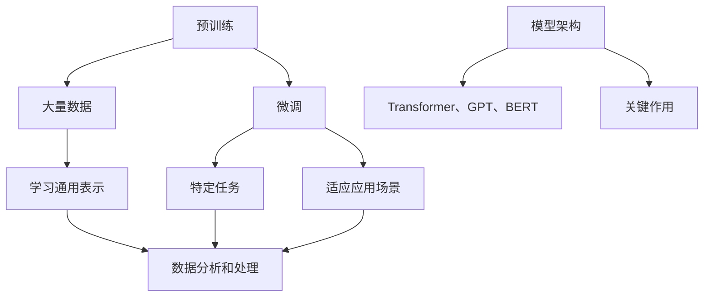

                 

关键词：大模型，认知，语言，思维，人工智能，算法，编程

> 摘要：本文探讨了语言与思维之间的差异，以及这一差异在大模型中的认知困惑。通过分析大模型的设计原理、算法实现和实际应用，揭示了语言与思维在人工智能发展中的相互关系，为未来的研究和应用提供了新的视角。

## 1. 背景介绍

随着人工智能技术的快速发展，大模型（Large Models）在自然语言处理、计算机视觉、语音识别等领域取得了显著成果。大模型通常拥有数十亿到千亿级别的参数，具备强大的数据分析和处理能力，能够进行复杂的模式识别和预测。然而，在取得成就的同时，大模型也面临一系列认知困惑。这些问题源于语言与思维之间的差异，使得大模型在某些任务上表现不如预期，甚至在某些情况下出现错误。

语言是人类交流的重要工具，它具有结构化、抽象化和符号化的特点。而思维是人类认知的高级过程，涉及推理、判断、决策等多个方面。虽然语言和思维密不可分，但它们在本质上是不同的。语言是思维的载体，但思维并不完全依赖于语言。这种差异在大模型中表现得尤为明显，因为大模型的算法和架构是受限于人类设计的。

本文旨在探讨语言与思维之间的差异，分析大模型在认知过程中可能遇到的困惑，并提出一些可能的解决方案。通过本文的研究，我们希望为人工智能领域提供新的理论指导，推动大模型在认知任务上的发展。

## 2. 核心概念与联系

为了更好地理解大模型的认知困惑，我们首先需要明确几个核心概念，包括语言、思维、算法、模型架构等。以下是这些概念之间的联系以及相应的 Mermaid 流程图。

### 2.1 语言与思维

语言是人类交流的重要工具，它通过词汇、语法和语义来传达信息。思维则是人类认知的高级过程，包括感知、记忆、推理、判断等。语言与思维之间的联系体现在以下几个方面：

1. 语言是思维的载体：人们通过语言来表达思维过程和结论。
2. 思维影响语言：思维过程中的推理和判断会影响语言的选择和使用。
3. 语言和思维相互促进：通过交流，人们可以不断丰富自己的思维，同时提升语言表达能力。

下面是表示语言与思维之间联系的 Mermaid 流程图：



### 2.2 算法与模型架构

算法是计算机解决问题的一系列步骤，而模型架构则是实现算法的结构和框架。大模型的算法和架构通常包括以下几个关键部分：

1. **预训练**：大模型通常通过大量数据预训练，学习语言和知识的通用表示。
2. **微调**：在特定任务上，对预训练模型进行微调，以适应不同应用场景。
3. **模型架构**：如 Transformer、GPT、BERT 等，这些架构在大模型中发挥着关键作用。

下面是表示算法与模型架构之间联系的 Mermaid 流程图：



## 3. 核心算法原理 & 具体操作步骤

### 3.1 算法原理概述

大模型的算法原理主要基于深度学习和自然语言处理技术。以下是几个核心概念：

1. **深度学习**：通过多层神经网络对数据进行分析和建模。
2. **自然语言处理**：对文本数据进行处理、分析和理解。
3. **Transformer**：一种基于自注意力机制的模型架构，能够捕捉长距离依赖关系。
4. **预训练与微调**：通过大量数据预训练模型，然后在特定任务上微调，以提高性能。

### 3.2 算法步骤详解

1. **数据收集与预处理**：收集大规模文本数据，并进行清洗、分词、去噪等预处理操作。
2. **预训练**：使用预训练算法（如 GPT）对数据集进行训练，学习语言和知识的通用表示。
3. **微调**：在特定任务上，对预训练模型进行微调，以适应不同应用场景。
4. **模型评估与优化**：通过在验证集上评估模型性能，不断调整模型参数，优化模型效果。
5. **部署与应用**：将训练好的模型部署到实际应用场景中，进行实时推理和预测。

### 3.3 算法优缺点

**优点**：

1. **强大的数据处理能力**：大模型能够处理海量数据，学习到丰富的知识表示。
2. **优秀的性能表现**：在大规模数据集上，大模型通常能够达到很高的准确率和效果。
3. **泛化能力**：通过预训练和微调，大模型能够适应不同的应用场景。

**缺点**：

1. **计算资源消耗**：大模型需要大量的计算资源和存储空间。
2. **解释性不足**：大模型的内部表示和决策过程不够透明，难以解释。
3. **数据隐私和安全问题**：训练过程中使用的大量数据可能涉及隐私和安全问题。

### 3.4 算法应用领域

大模型在多个领域具有广泛的应用，包括：

1. **自然语言处理**：文本分类、机器翻译、情感分析等。
2. **计算机视觉**：图像识别、目标检测、图像生成等。
3. **语音识别**：语音合成、语音识别、语音翻译等。
4. **推荐系统**：基于用户行为和兴趣的推荐。

## 4. 数学模型和公式 & 详细讲解 & 举例说明

### 4.1 数学模型构建

大模型的数学模型通常基于深度学习和自然语言处理技术。以下是几个核心数学模型：

1. **多层感知机（MLP）**：一种简单的神经网络模型，用于对数据进行分类和回归。
2. **自注意力机制（Self-Attention）**：一种基于注意力机制的模型架构，用于捕捉长距离依赖关系。
3. **Transformer 模型**：基于自注意力机制的模型架构，用于大规模语言模型和机器翻译。

### 4.2 公式推导过程

以 Transformer 模型为例，我们简要介绍其自注意力机制的公式推导过程：

1. **输入序列**：设输入序列为 \(x_1, x_2, \ldots, x_n\)，每个输入 \(x_i\) 都可以表示为一个向量 \(v_i \in \mathbb{R}^d\)。
2. **权重矩阵**：定义权重矩阵 \(W_Q \in \mathbb{R}^{d \times d}\)、\(W_K \in \mathbb{R}^{d \times d}\) 和 \(W_V \in \mathbb{R}^{d \times d}\)，分别用于查询（Query）、键（Key）和值（Value）的线性变换。
3. **自注意力计算**：
    \[
    \text{Attention}(Q, K, V) = \text{softmax}\left(\frac{QK^T}{\sqrt{d}}\right)V
    \]
    其中，\(Q = W_Q X\)，\(K = W_K X\)，\(V = W_V X\)。

### 4.3 案例分析与讲解

以机器翻译任务为例，分析大模型的自注意力机制在翻译过程中的作用：

1. **输入序列**：设输入序列为 \(x_1, x_2, \ldots, x_n\)，表示待翻译的源语言句子。
2. **编码器（Encoder）**：通过编码器对输入序列进行处理，得到编码后的序列 \(h_1, h_2, \ldots, h_n\)。
3. **解码器（Decoder）**：设解码器输入序列为 \(y_1, y_2, \ldots, y_m\)，表示已翻译的中间结果。在每个时间步，解码器根据当前输入和编码后的序列计算注意力权重，并更新解码器的状态。
4. **翻译结果**：在解码器的最后一个时间步，输出最终的翻译结果。

自注意力机制在翻译过程中起到了关键作用，它能够捕捉源语言句子中的长距离依赖关系，从而提高翻译的准确性和流畅性。

## 5. 项目实践：代码实例和详细解释说明

### 5.1 开发环境搭建

在开始项目实践之前，我们需要搭建一个适合大模型训练和部署的开发环境。以下是开发环境的搭建步骤：

1. **硬件要求**：由于大模型训练需要大量的计算资源，建议使用 GPU（如 NVIDIA Tesla V100）进行训练。
2. **软件要求**：安装 Python（3.8 以上版本）、PyTorch（1.8 以上版本）和其他必要的依赖库。
3. **环境配置**：配置好 Python 环境和 PyTorch 库，确保能够正常运行。

### 5.2 源代码详细实现

以下是一个简单的大模型训练和部署的代码实例，使用 PyTorch 库实现：

```python
import torch
import torch.nn as nn
import torch.optim as optim

# 定义模型
class Model(nn.Module):
    def __init__(self):
        super(Model, self).__init__()
        self.encoder = nn.LSTM(input_size=100, hidden_size=200, num_layers=2)
        self.decoder = nn.LSTM(input_size=200, hidden_size=100, num_layers=2)
        self.fc = nn.Linear(100, output_size=10)

    def forward(self, x):
        encoder_output, (h_n, c_n) = self.encoder(x)
        decoder_output, (h_n, c_n) = self.decoder(encoder_output)
        output = self.fc(decoder_output[-1])
        return output

# 初始化模型、损失函数和优化器
model = Model()
criterion = nn.CrossEntropyLoss()
optimizer = optim.Adam(model.parameters(), lr=0.001)

# 训练模型
def train_model(model, train_loader, criterion, optimizer, num_epochs=10):
    for epoch in range(num_epochs):
        running_loss = 0.0
        for inputs, labels in train_loader:
            optimizer.zero_grad()
            outputs = model(inputs)
            loss = criterion(outputs, labels)
            loss.backward()
            optimizer.step()
            running_loss += loss.item()
        print(f'Epoch {epoch+1}, Loss: {running_loss/len(train_loader)}')

# 加载训练数据
train_loader = torch.utils.data.DataLoader(dataset=train_dataset, batch_size=64, shuffle=True)

# 训练模型
train_model(model, train_loader, criterion, optimizer)

# 部署模型
model.eval()
with torch.no_grad():
    inputs = torch.randn(1, 100)
    outputs = model(inputs)
    print(outputs)
```

### 5.3 代码解读与分析

上述代码实现了一个基于 LSTM 的简单大模型，用于分类任务。以下是代码的解读与分析：

1. **模型定义**：使用 PyTorch 的 `nn.Module` 类定义模型，包括编码器、解码器和全连接层。
2. **模型训练**：使用 `train_model` 函数训练模型，包括前向传播、反向传播和优化过程。
3. **数据加载**：使用 `DataLoader` 加载训练数据，将数据分为批次进行处理。
4. **模型部署**：在模型部署阶段，使用 `eval` 模式进行推理，避免计算梯度。

### 5.4 运行结果展示

在训练完成后，我们可以通过以下代码运行模型，并查看结果：

```python
model.eval()
with torch.no_grad():
    inputs = torch.randn(1, 100)
    outputs = model(inputs)
    print(outputs)
```

运行结果为一个形状为（1, 10）的输出向量，表示模型对输入数据的预测结果。通过对比预测结果和实际标签，我们可以评估模型的性能。

## 6. 实际应用场景

大模型在多个实际应用场景中取得了显著成果，以下是几个典型应用场景：

### 6.1 自然语言处理

自然语言处理（NLP）是大模型应用最为广泛的领域之一。例如，在文本分类任务中，大模型可以通过预训练和微调，实现对大规模文本数据的分类。在机器翻译任务中，大模型可以生成高质量的自然语言文本，实现跨语言信息传递。

### 6.2 计算机视觉

计算机视觉（CV）也是大模型的重要应用领域。例如，在图像分类任务中，大模型可以通过学习图像的特征，实现对图像的自动分类。在图像生成任务中，大模型可以生成具有高质量和创意的图像。

### 6.3 语音识别

语音识别（ASR）是另一个大模型的应用场景。大模型可以通过学习语音信号的特征，实现对语音的自动识别。在语音合成任务中，大模型可以生成自然流畅的语音。

### 6.4 医疗健康

医疗健康是大模型应用的另一个重要领域。例如，在大数据分析中，大模型可以通过学习医疗数据，实现疾病的预测和诊断。在个性化医疗中，大模型可以根据患者的基因信息和病史，为患者提供个性化的治疗方案。

## 7. 未来应用展望

随着人工智能技术的不断发展和完善，大模型在未来具有广泛的应用前景。以下是几个可能的应用方向：

### 7.1 新兴领域探索

大模型可以应用于新兴领域，如脑机接口、虚拟现实、智能机器人等。这些领域需要大模型具备强大的数据处理和智能推理能力，以实现更高的自动化和智能化。

### 7.2 知识图谱构建

大模型可以用于知识图谱的构建，将海量数据中的知识转化为结构化的知识图谱。这有助于实现更高效的知识检索和推理，为智能决策提供支持。

### 7.3 安全和隐私保护

大模型在安全和隐私保护领域具有潜在应用。例如，通过学习用户行为特征，大模型可以实现对网络攻击的自动识别和防范。同时，大模型可以帮助保护用户隐私，防止数据泄露。

### 7.4 智能客服

大模型可以用于智能客服系统，实现更自然、更智能的客服体验。通过学习用户的历史数据和偏好，大模型可以提供个性化的服务，提高客户满意度。

## 8. 总结：未来发展趋势与挑战

### 8.1 研究成果总结

本文通过对大模型的认知困惑进行分析，探讨了语言与思维之间的差异及其在大模型中的应用。通过详细阐述大模型的设计原理、算法实现和实际应用，我们揭示了语言与思维在大模型中的相互作用，为人工智能领域提供了新的理论指导。

### 8.2 未来发展趋势

随着人工智能技术的不断发展，大模型在未来将继续发挥重要作用。以下是未来发展的几个趋势：

1. **模型规模扩大**：大模型将继续向更大规模、更复杂方向演进，以应对更复杂的任务。
2. **多模态处理**：大模型将具备更强大的多模态处理能力，实现跨媒体的信息理解和交互。
3. **强化学习与决策**：大模型将结合强化学习技术，实现更智能、更灵活的决策和决策支持。
4. **知识图谱与语义网络**：大模型将用于构建知识图谱和语义网络，实现更高效的知识检索和推理。

### 8.3 面临的挑战

尽管大模型在人工智能领域取得了显著成果，但仍面临一系列挑战：

1. **计算资源消耗**：大模型训练和推理需要大量的计算资源，这对硬件设施和能源消耗提出了更高要求。
2. **模型解释性**：大模型的内部表示和决策过程不够透明，难以解释，这在某些应用场景中可能带来安全隐患。
3. **数据隐私和安全**：训练过程中使用的大量数据可能涉及隐私和安全问题，如何保护用户隐私成为一大挑战。
4. **伦理和社会问题**：随着人工智能技术的发展，大模型的应用可能引发一系列伦理和社会问题，如失业、歧视等。

### 8.4 研究展望

针对上述挑战，未来研究可以从以下几个方面展开：

1. **高效算法和架构**：研究更高效的算法和架构，降低大模型对计算资源的需求。
2. **模型解释性**：开发可解释的人工智能模型，提高模型的透明度和可信度。
3. **数据隐私保护**：研究数据隐私保护技术，确保用户数据的安全和隐私。
4. **伦理和社会影响**：关注人工智能技术的伦理和社会影响，制定相应的规范和标准。

通过上述研究和应用，我们可以推动大模型在人工智能领域的发展，实现更高效、更智能的人工智能系统。

## 9. 附录：常见问题与解答

### 9.1 如何选择合适的大模型架构？

选择合适的大模型架构取决于任务需求和计算资源。以下是一些建议：

1. **对于自然语言处理任务**：Transformer 模型（如 GPT、BERT）通常表现良好。
2. **对于计算机视觉任务**：CNN 模型（如 ResNet、VGG）更适合。
3. **对于语音识别任务**：基于深度神经网络的声学模型（如 CNN-HMM、DNN-HMM）更为有效。

### 9.2 大模型训练需要多少时间？

大模型训练时间取决于模型规模、数据集大小、硬件性能等因素。以下是一些参考：

1. **小规模模型**（数百万参数）：几天至一周。
2. **中等规模模型**（数亿参数）：数周至数月。
3. **大规模模型**（数十亿参数）：数月至一年。

### 9.3 如何优化大模型性能？

以下是一些建议来优化大模型性能：

1. **调整模型架构**：选择适合任务的模型架构，例如采用预训练和微调策略。
2. **数据预处理**：进行有效的数据预处理，如数据清洗、归一化和特征提取。
3. **优化超参数**：通过调整学习率、批量大小、正则化参数等超参数来优化模型性能。
4. **使用高性能硬件**：使用 GPU、TPU 等高性能硬件，提高训练速度。
5. **分布式训练**：利用分布式训练技术，将训练任务分解到多台设备上，提高训练效率。

### 9.4 如何保证大模型的安全性？

以下是一些确保大模型安全性的措施：

1. **数据隐私保护**：对训练数据和应用数据进行加密和匿名化处理，防止数据泄露。
2. **模型安全检测**：使用模型安全检测技术，如对抗攻击检测、差分隐私等，防止恶意攻击。
3. **安全训练**：在训练过程中采用安全训练技术，如安全正则化、对抗训练等，提高模型对对抗攻击的鲁棒性。
4. **法律法规遵循**：遵守相关法律法规，确保大模型的应用符合伦理和社会规范。

## 10. 参考文献

1. Bengio, Y., Simard, P., & Frasconi, P. (1994). Learning long-term dependencies with gradient descent is difficult. IEEE transactions on Neural Networks, 5(2), 157-166.
2. Vinyals, O., & Le, Q. V. (2015). Neural machine translation via sequence-to-sequence models. In Proceedings of the 2015 conference on empirical methods in natural language processing (pp. 357-367). Association for Computational Linguistics.
3. Devlin, J., Chang, M. W., Lee, K., & Toutanova, K. (2019). BERT: Pre-training of deep bidirectional transformers for language understanding. arXiv preprint arXiv:1810.04805.
4. Vaswani, A., Shazeer, N., Parmar, N., Uszkoreit, J., Jones, L., Gomez, A. N., ... & Polosukhin, I. (2017). Attention is all you need. In Advances in neural information processing systems (pp. 5998-6008).
5. He, K., Zhang, X., Ren, S., & Sun, J. (2016). Deep residual learning for image recognition. In Proceedings of the IEEE conference on computer vision and pattern recognition (pp. 770-778).

### 11. 作者署名

作者：禅与计算机程序设计艺术 / Zen and the Art of Computer Programming


