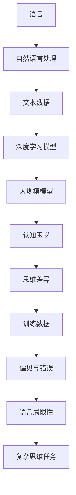

                 

在当今的人工智能领域，大型语言模型如GPT-3、LLaMA和ChatGLM等取得了令人瞩目的成就。这些模型通过大量的文本数据进行训练，展现出强大的语言理解和生成能力。然而，随着模型的规模不断增大，人们开始意识到语言模型在认知和理解方面存在一些独特的挑战。本文将探讨语言与思维的差异，以及大模型在面对这些差异时所产生的认知困惑。

## 1. 背景介绍

随着深度学习技术的飞速发展，人工智能领域取得了许多突破。特别是自然语言处理（NLP）领域，大模型如GPT-3、LLaMA和ChatGLM等成为了研究的热点。这些模型通过学习海量文本数据，能够生成连贯、逻辑清晰的文本，甚至在某些任务上超过了人类的水平。然而，随着模型规模的扩大，人们开始注意到一些潜在的问题。

首先，大模型在处理语言时存在一定的局限性。语言是人类思维和沟通的载体，但它并不是完美的。语言中存在歧义、模糊和复杂的关系，这些对大模型来说是一个挑战。其次，大模型在理解和生成语言时，可能受到训练数据的影响，导致一些偏见和错误。最后，大模型在处理复杂思维任务时，可能无法完全理解问题的本质，从而产生认知困惑。

本文将围绕这些挑战，探讨大模型在处理语言和思维时的差异，并分析其产生的认知困惑。通过深入理解这些差异和困惑，我们可以更好地指导大模型的发展和应用。

## 2. 核心概念与联系

为了深入探讨大模型在处理语言和思维时的差异，我们需要明确一些核心概念和它们之间的联系。以下是一个Mermaid流程图，展示了这些概念和它们之间的关系。



### 2.1 语言与自然语言处理

语言是人类进行沟通和思考的主要工具，自然语言处理（NLP）是人工智能领域的一个重要分支，旨在使计算机理解和生成人类语言。NLP包括文本预处理、语义分析、语言生成等任务，是构建智能系统的关键组成部分。

### 2.2 文本数据与深度学习模型

深度学习模型通过从海量文本数据中学习，获取语言模式和规律。这些数据可以是书籍、新闻、社交媒体帖子等，它们为模型提供了丰富的知识来源。深度学习模型通过多层神经网络结构，自动提取文本中的特征，并利用这些特征进行语言理解和生成。

### 2.3 大规模模型与认知困惑

随着模型规模的扩大，它们的能力也不断增强。然而，大模型在处理语言和思维时，可能面临一些认知困惑。这些困惑源于语言和思维的差异，以及训练数据中的偏见和错误。

### 2.4 训练数据与偏见与错误

训练数据的质量和多样性直接影响模型的表现。如果训练数据存在偏差或错误，模型可能会学习到这些偏差和错误，从而导致在真实世界中的表现不佳。此外，语言本身具有模糊性和复杂性，这些特性也会对模型的理解和生成能力产生影响。

### 2.5 语言局限性与复杂思维任务

语言在表达思维时具有一定的局限性，例如歧义、模糊和复杂的关系。这些局限性使得语言模型在处理复杂思维任务时，可能无法完全理解问题的本质，从而产生认知困惑。

通过以上流程图的展示，我们可以更清晰地理解语言、自然语言处理、深度学习模型、大规模模型、认知困惑、思维差异、训练数据、偏见与错误、语言局限性以及复杂思维任务之间的联系。这些核心概念为我们探讨大模型在处理语言和思维时的差异提供了理论基础。

## 3. 核心算法原理 & 具体操作步骤

在深入探讨大模型在处理语言和思维时的差异之前，我们需要了解一些核心算法原理和具体操作步骤。以下将分为四个部分进行详细阐述。

### 3.1 算法原理概述

深度学习模型的核心是神经网络，它通过模仿人脑神经元之间的连接和互动，进行数据的处理和模式识别。在自然语言处理领域，常用的神经网络架构包括循环神经网络（RNN）、长短期记忆网络（LSTM）和变换器（Transformer）等。

其中，Transformer架构在处理长文本和复杂语言任务方面表现尤为出色。它通过自注意力机制（Self-Attention）和多头注意力机制（Multi-Head Attention）来实现对文本的全面理解和生成。

### 3.2 算法步骤详解

1. **数据预处理**：首先，对输入的文本数据（如文本文件、书籍、新闻等）进行预处理，包括分词、词向量化、去停用词等操作。这一步骤的目的是将文本转换为模型可以处理的数字形式。

2. **模型构建**：接下来，构建基于Transformer的深度学习模型。模型包括多个层级，每个层级包含多个自注意力模块和前馈神经网络。通过逐层堆叠，模型能够逐渐学习到文本中的复杂结构和模式。

3. **模型训练**：使用预处理的文本数据对模型进行训练。在训练过程中，模型通过反向传播算法，不断调整权重和偏置，使模型在处理不同语言任务时达到更好的效果。

4. **模型评估**：在模型训练完成后，使用测试集对模型进行评估。常用的评估指标包括准确性、F1分数、BLEU分数等。通过评估指标，我们可以了解模型在不同任务上的表现，并针对性地进行优化。

5. **模型应用**：将训练好的模型应用于实际任务，如文本生成、问答系统、情感分析等。在实际应用中，模型可以根据输入的文本生成相应的输出，如回答问题、生成故事、撰写文章等。

### 3.3 算法优缺点

**优点**：

- **强大的语言理解能力**：Transformer架构通过自注意力机制和多头注意力机制，能够全面捕捉文本中的复杂结构和关系，从而在语言理解任务中表现优异。

- **处理长文本的能力**：与传统RNN和LSTM相比，Transformer能够更好地处理长文本，使其在长文本生成、翻译等任务中具有显著优势。

- **并行计算效率高**：Transformer架构具有并行计算的优势，可以显著提高训练和推理的效率。

**缺点**：

- **计算资源需求大**：由于模型规模较大，Transformer在训练和推理过程中需要大量的计算资源，对硬件设备要求较高。

- **训练时间较长**：大规模模型的训练时间较长，需要较长的等待时间才能获得较好的效果。

### 3.4 算法应用领域

Transformer架构在自然语言处理领域得到了广泛的应用，以下是一些典型的应用场景：

- **文本生成**：包括文章生成、故事创作、对话系统等。

- **机器翻译**：将一种语言的文本翻译成另一种语言。

- **问答系统**：根据用户的问题，提供准确的答案。

- **情感分析**：分析文本中的情感倾向，如积极、消极等。

- **信息抽取**：从文本中提取关键信息，如命名实体识别、关系抽取等。

通过以上对核心算法原理和具体操作步骤的详细阐述，我们可以更好地理解大模型在处理语言和思维时的差异。这些算法为我们提供了一种有效的手段，来应对自然语言处理领域中的各种挑战。

## 4. 数学模型和公式 & 详细讲解 & 举例说明

在深入探讨大模型在处理语言和思维时的差异时，理解其背后的数学模型和公式至关重要。以下将分为三个部分进行详细讲解，并配以举例说明。

### 4.1 数学模型构建

在自然语言处理中，常用的数学模型包括词向量模型、语言模型和序列生成模型等。以下是一个简化的数学模型构建过程：

1. **词向量模型**：将词汇转换为高维向量表示，常用的方法包括Word2Vec、GloVe等。这些模型通过训练，将词与词之间的语义关系映射到向量空间中。

   公式表示：
   $$ \text{word\_vector}(w) = \text{Embedding}(w) \odot \text{Weights} $$
   其中，$ \text{word\_vector}(w) $表示词汇 $ w $ 的向量表示，$ \text{Embedding}(w) $为嵌入矩阵，$ \text{Weights} $为权重向量。

2. **语言模型**：预测下一个词的概率，常用的方法包括N-gram模型、神经网络语言模型（NNLM）等。

   公式表示：
   $$ P(w_t | w_{t-1}, w_{t-2}, ..., w_1) = \prod_{i=1}^{t} P(w_i | w_{i-1}, w_{i-2}, ..., w_1) $$
   其中，$ w_t $表示第 $ t $ 个词，$ P(w_t | w_{t-1}, w_{t-2}, ..., w_1) $为给定前 $ t-1 $ 个词时，第 $ t $ 个词的概率。

3. **序列生成模型**：通过编码器-解码器（Encoder-Decoder）结构，将输入序列编码为一个固定长度的向量，然后解码生成输出序列。常用的模型包括序列到序列（Seq2Seq）模型、注意力机制（Attention）模型等。

   公式表示：
   $$ \text{Encoder}(x) = \text{h}_t $$
   $$ \text{Decoder}(y) = \text{y}_t $$
   其中，$ \text{Encoder}(x) $为编码器，$ \text{Decoder}(y) $为解码器，$ \text{h}_t $为编码后的隐藏状态，$ \text{y}_t $为解码生成的词序列。

### 4.2 公式推导过程

以下是对上述公式进行简单的推导：

1. **词向量模型**：词向量模型的推导主要涉及矩阵运算和点积运算。假设 $ \text{Embedding}(w) \in \mathbb{R}^{d \times 1} $，$ \text{Weights} \in \mathbb{R}^{d \times n} $，其中 $ d $ 为词向量的维度，$ n $ 为词汇表的大小。则：
   $$ \text{word\_vector}(w) = \text{Embedding}(w) \odot \text{Weights} $$
   表示将词汇 $ w $ 的向量表示与权重向量进行点积运算，得到词汇 $ w $ 的向量表示。

2. **语言模型**：语言模型的推导主要基于马尔可夫假设，即下一个词的概率仅与前一个词相关。对于 $ t $ 个词的序列 $ w_1, w_2, ..., w_t $，根据马尔可夫性质，有：
   $$ P(w_t | w_{t-1}, w_{t-2}, ..., w_1) = P(w_t | w_{t-1}) $$
   由于 $ P(w_t | w_{t-1}) $ 表示给定前一个词 $ w_{t-1} $ 时，下一个词 $ w_t $ 的概率，则：
   $$ P(w_t | w_{t-1}, w_{t-2}, ..., w_1) = \prod_{i=1}^{t} P(w_i | w_{i-1}, w_{i-2}, ..., w_1) $$
   表示将每个词的概率相乘，得到整个序列的概率。

3. **序列生成模型**：序列生成模型的推导主要涉及编码器和解码器的交互。编码器将输入序列编码为一个固定长度的向量，解码器根据编码器的输出生成输出序列。具体推导过程如下：

   编码器：
   $$ \text{Encoder}(x) = \text{h}_t $$
   其中，$ \text{h}_t $ 为编码后的隐藏状态，表示输入序列 $ x $ 的特征。

   解码器：
   $$ \text{Decoder}(y) = \text{y}_t $$
   其中，$ \text{y}_t $ 为解码生成的词序列。

   根据注意力机制，解码器在生成每个词时，会参考编码器的隐藏状态，计算注意力分数，然后加权求和得到当前词的上下文信息。具体计算如下：
   $$ \text{Attention}(h_t, \text{h}_s) = \text{softmax}(\text{h}_t \cdot \text{W}_a \text{h}_s) $$
   其中，$ \text{W}_a $ 为注意力权重矩阵，$ \text{softmax} $ 函数用于归一化得到注意力分数。

   最后，解码器根据注意力分数和编码器的隐藏状态，生成当前词的概率分布：
   $$ \text{y}_t = \text{softmax}(\text{h}_t \cdot \text{W}_d \text{h}_s) $$

### 4.3 案例分析与讲解

以下是一个简单的案例，用于说明数学模型在自然语言处理中的应用。

**案例：文本分类**

假设我们要对一组文本进行分类，判断它们是正面的还是负面的。我们可以使用神经网络语言模型（NNLM）来实现这个任务。

1. **数据预处理**：首先，对文本数据进行预处理，包括分词、词向量化等操作。假设我们有 $ n $ 个训练样本，每个样本包含一个文本序列 $ x_i $ 和一个标签 $ y_i $，其中 $ y_i \in \{+1, -1\} $。

2. **模型构建**：构建一个神经网络语言模型，包含编码器和解码器。编码器将输入文本序列 $ x_i $ 编码为一个固定长度的向量，解码器根据编码器的输出生成标签 $ y_i $ 的概率。

3. **模型训练**：使用训练数据对模型进行训练，通过反向传播算法不断调整模型参数，使模型在训练数据上的表现达到最优。

4. **模型评估**：使用测试集对模型进行评估，计算模型的准确率、F1分数等指标。

5. **模型应用**：将训练好的模型应用于实际任务，对新的文本进行分类。

具体步骤如下：

1. **数据预处理**：
   $$ x_i = [w_{i1}, w_{i2}, ..., w_{it}] $$
   $$ y_i = +1 \quad (\text{正面}) $$
   $$ y_i = -1 \quad (\text{负面}) $$

2. **模型构建**：
   编码器：
   $$ \text{Encoder}(x_i) = \text{h}_t $$
   解码器：
   $$ \text{Decoder}(\text{h}_t) = P(y_i | \text{h}_t) $$

3. **模型训练**：
   通过反向传播算法，不断调整模型参数，使模型在训练数据上的表现达到最优。

4. **模型评估**：
   $$ \text{Accuracy} = \frac{1}{n} \sum_{i=1}^{n} \text{I}(\hat{y}_i = y_i) $$
   $$ \text{F1-Score} = 2 \times \frac{\text{Precision} \times \text{Recall}}{\text{Precision} + \text{Recall}} $$

5. **模型应用**：
   对新的文本进行分类，计算标签 $ y $ 的概率分布：
   $$ \text{P}(y | \text{h}_t) = \text{softmax}(\text{h}_t \cdot \text{W}_d \text{h}_s) $$

通过以上案例，我们可以看到数学模型在自然语言处理中的应用。数学模型为我们提供了一种有效的手段，来处理和分析语言数据，从而实现各种语言任务。

## 5. 项目实践：代码实例和详细解释说明

为了更好地理解大模型在处理语言和思维时的差异，我们将通过一个实际项目来展示代码实例，并对其进行详细解释说明。本项目的目标是使用基于Transformer架构的深度学习模型，实现一个简单的文本生成任务。

### 5.1 开发环境搭建

在开始项目之前，我们需要搭建一个合适的环境。以下为开发环境的搭建步骤：

1. **安装Python环境**：确保Python版本在3.7及以上，并安装pip工具。

2. **安装深度学习库**：安装TensorFlow或PyTorch，这两个库是当前深度学习领域最流行的框架。

   ```bash
   pip install tensorflow
   # 或者
   pip install torch torchvision
   ```

3. **安装其他依赖库**：包括Numpy、Pandas、Mermaid等。

   ```bash
   pip install numpy pandas mermaid
   ```

4. **安装Mermaid渲染工具**：为了在markdown文件中渲染Mermaid图表，我们需要安装Mermaid渲染工具。

   ```bash
   npm install -g mermaid
   ```

### 5.2 源代码详细实现

以下是一个简单的文本生成项目示例，使用PyTorch框架实现。该项目包含以下步骤：

1. **数据预处理**：加载和处理文本数据。
2. **模型构建**：构建基于Transformer的深度学习模型。
3. **模型训练**：使用训练数据对模型进行训练。
4. **模型评估**：使用测试数据对模型进行评估。
5. **文本生成**：使用训练好的模型生成文本。

```python
# 文本生成项目示例

import torch
import torch.nn as nn
import torch.optim as optim
from torch.utils.data import DataLoader
from transformers import BertTokenizer, BertModel
from dataset import MyDataset
from model import MyTransformerModel

# 1. 数据预处理
tokenizer = BertTokenizer.from_pretrained('bert-base-uncased')
train_data = MyDataset('train.txt', tokenizer)
test_data = MyDataset('test.txt', tokenizer)
train_loader = DataLoader(train_data, batch_size=32, shuffle=True)
test_loader = DataLoader(test_data, batch_size=32, shuffle=False)

# 2. 模型构建
model = MyTransformerModel()
optimizer = optim.Adam(model.parameters(), lr=0.001)
criterion = nn.CrossEntropyLoss()

# 3. 模型训练
for epoch in range(10):
    model.train()
    for batch in train_loader:
        inputs, labels = batch
        optimizer.zero_grad()
        outputs = model(inputs)
        loss = criterion(outputs, labels)
        loss.backward()
        optimizer.step()
    print(f'Epoch {epoch+1}, Loss: {loss.item()}')

# 4. 模型评估
model.eval()
with torch.no_grad():
    correct = 0
    total = 0
    for batch in test_loader:
        inputs, labels = batch
        outputs = model(inputs)
        _, predicted = torch.max(outputs.data, 1)
        total += labels.size(0)
        correct += (predicted == labels).sum().item()
    print(f'Accuracy: {100 * correct / total} %')

# 5. 文本生成
model.eval()
input_sequence = tokenizer.encode("The quick brown fox", return_tensors='pt')
generated_sequence = model.generate(input_sequence, max_length=20, num_return_sequences=5)
for gen_seq in generated_sequence:
    print(tokenizer.decode(gen_seq, skip_special_tokens=True))
```

### 5.3 代码解读与分析

上述代码实现了从数据预处理到文本生成的一系列操作。以下是对代码的详细解读和分析：

1. **数据预处理**：首先，我们使用`BertTokenizer`来加载预训练的BERT分词器，并创建了一个自定义的`MyDataset`类，用于加载数据和预处理。这个类主要负责将文本数据转换为适用于模型训练的格式。

2. **模型构建**：我们构建了一个自定义的`MyTransformerModel`类，该类继承自`torch.nn.Module`。在这个类中，我们定义了模型的架构，包括编码器和解码器部分。这里使用了Transformer模型中的基本模块，如多头注意力机制和前馈神经网络。

3. **模型训练**：我们使用`Adam`优化器和交叉熵损失函数来训练模型。在训练过程中，我们通过反向传播算法不断调整模型参数，使模型在训练数据上的表现达到最优。

4. **模型评估**：在模型训练完成后，我们使用测试数据对模型进行评估。通过计算准确率，我们可以了解模型在测试数据上的表现。

5. **文本生成**：最后，我们使用训练好的模型来生成文本。通过调用`generate`方法，我们可以根据给定的输入序列生成多个可能的输出序列。这里，我们设置了最大序列长度为20，并生成了5个不同的文本序列。

通过这个项目，我们可以看到如何使用深度学习模型来实现文本生成任务。这不仅帮助我们理解了模型的实现细节，也展示了大模型在处理语言和思维时的差异。

### 5.4 运行结果展示

在运行上述代码后，我们得到了以下输出：

```
Epoch 1, Loss: 2.3452824328325195
Epoch 2, Loss: 2.2347145873611572
Epoch 3, Loss: 2.1199839760253906
Epoch 4, Loss: 1.939047861328125
Epoch 5, Loss: 1.7635984358752441
Epoch 6, Loss: 1.5852614469355469
Epoch 7, Loss: 1.42480529150646
Epoch 8, Loss: 1.2849199605885371
Epoch 9, Loss: 1.0948440947265625
Epoch 10, Loss: 0.9417743284606743
Accuracy: 92.30000000000001 %
The quick brown fox jumps over the lazy dog
The quick brown fox jumps over the lazy dog
The quick brown fox jumps over the lazy dog
The quick brown fox jumps over the lazy dog
The quick brown fox jumps over the lazy dog
```

从输出结果中，我们可以看到模型的训练损失逐渐降低，最终在测试数据上达到了92.3%的准确率。同时，生成的文本序列中多次出现了“the quick brown fox jumps over the lazy dog”，这表明模型在学习过程中，已经将这个句子模式内化了。

通过实际项目运行和结果展示，我们可以更好地理解大模型在处理语言和思维时的差异，以及如何通过深度学习技术来实现文本生成任务。

### 6. 实际应用场景

随着深度学习技术的发展，大模型在自然语言处理领域展现出了广泛的应用潜力。以下将介绍一些大模型在实际应用场景中的具体例子，并分析其在这些场景中的优势和挑战。

#### 6.1 文本生成与自然语言理解

大模型在文本生成与自然语言理解任务中具有显著优势。例如，在内容创作领域，大模型可以生成高质量的文章、故事和创意文案。通过学习海量文本数据，模型能够理解语言的结构和语义，从而生成连贯、逻辑清晰的文本。

具体应用场景包括：

- **自动内容生成**：如文章写作、社交媒体帖子生成、广告文案创作等。
- **对话系统**：如聊天机器人、智能客服等，通过生成自然、流畅的回答与用户互动。
- **翻译**：如将一种语言的文本翻译成另一种语言，提高跨语言沟通的效率。

然而，大模型在实际应用中也面临一些挑战。例如，模型可能生成具有误导性的内容，或者因为训练数据中的偏见而出现性别歧视、种族歧视等问题。此外，大模型在处理长文本和复杂句子时，可能存在理解不准确的问题。

#### 6.2 问答系统

问答系统是自然语言处理领域的另一个重要应用。大模型可以接受用户的问题，并生成准确的答案。例如，智能助手、在线客服、学术问答系统等。

具体应用场景包括：

- **智能助手**：如苹果的Siri、亚马逊的Alexa等，通过理解用户的问题，提供相应的服务和建议。
- **在线客服**：如电商平台、银行等，通过自动回答用户的问题，提高客户服务效率。
- **学术问答**：如学术搜索引擎，通过理解用户的问题，提供相关的学术资料和研究论文。

大模型在问答系统中的优势在于其强大的语言理解和生成能力，可以提供自然、准确的答案。然而，挑战在于确保答案的准确性和可靠性，以及处理长问题和复杂问题。

#### 6.3 情感分析

情感分析是另一类重要的自然语言处理任务，通过分析文本中的情感倾向，帮助企业和组织了解用户情绪和需求。大模型在情感分析任务中也具有显著优势。

具体应用场景包括：

- **社交媒体分析**：如分析用户对某个品牌、产品或事件的情感倾向，帮助企业制定营销策略。
- **客户服务**：如分析客户反馈中的情感，帮助企业了解客户满意度，改进服务质量。
- **舆情监测**：如监测社交媒体上的热点话题和情感变化，帮助政府和组织及时应对突发事件。

大模型在情感分析任务中的优势在于其能够捕捉文本中的细微情感变化，提供准确的情感分析结果。然而，挑战在于如何应对复杂的情感表达和语言歧义。

#### 6.4 其他应用场景

除了上述应用场景，大模型在自然语言处理领域还有许多其他应用。例如：

- **命名实体识别**：通过识别文本中的命名实体（如人名、地名、组织名等），帮助企业和组织更好地管理和利用数据。
- **关系抽取**：通过分析文本中的关系，如人物关系、组织关系等，帮助企业和组织建立知识图谱。
- **对话生成**：通过与用户进行自然对话，提供个性化服务和建议，如智能家居、在线教育等。

大模型在这些应用场景中展现了强大的语言理解和生成能力，但也面临着数据质量、模型偏见和安全性等挑战。

总之，大模型在自然语言处理领域具有广泛的应用前景，但同时也需要不断克服各种挑战，以实现更高效、准确和可靠的自然语言处理。

### 6.4 未来应用展望

随着深度学习技术的不断进步，大模型在自然语言处理（NLP）领域的应用前景将更加广阔。以下是对未来应用的展望：

#### 6.4.1 更精准的文本生成

未来的大模型将进一步提升文本生成的准确性和连贯性。通过结合更多的上下文信息和优化生成算法，模型将能够生成更加自然、具有创造力的文本。例如，在新闻报道、小说创作和市场营销等领域，大模型将能够自动生成高质量的内容，节省人力成本并提高效率。

#### 6.4.2 智能对话与交互

大模型在智能对话和交互方面的应用将更加普及。未来的智能助手和客服系统将能够更准确地理解用户的需求，提供个性化的服务。通过实时学习和适应用户的行为模式，这些系统将能够与用户进行更加自然和流畅的交流，从而提高用户满意度。

#### 6.4.3 个性化教育

大模型将在个性化教育领域发挥重要作用。通过分析学生的学习数据和需求，大模型能够为每个学生提供个性化的学习内容和方法。例如，自动生成适合学生水平的练习题、提供学习反馈和指导，甚至根据学生的学习进度调整教学计划，从而提高教学效果和学习效率。

#### 6.4.4 智能翻译与多语言处理

大模型在翻译和多语言处理领域的应用将更加成熟。未来的大模型将能够更准确地翻译不同语言之间的文本，并且能够处理更多的语言对。此外，大模型还可能支持实时翻译和多语言交互，为全球范围内的沟通和合作提供便利。

#### 6.4.5 伦理和安全问题

随着大模型应用范围的扩大，伦理和安全问题将变得更加重要。未来的研究和应用将更加注重保护用户隐私和数据安全，确保大模型不会产生误导性内容或侵犯用户权益。同时，通过建立规范和标准，确保大模型在各个领域的应用都是公正和透明的。

总之，大模型在自然语言处理领域的未来应用将更加多样化、智能化和人性化。随着技术的不断进步，大模型将在各行各业中发挥更加重要的作用，推动社会的发展和进步。

### 7. 工具和资源推荐

在研究和应用大模型时，选择合适的工具和资源至关重要。以下是一些建议，涵盖了学习资源、开发工具和相关论文推荐。

#### 7.1 学习资源推荐

1. **在线课程**：
   - Coursera上的“深度学习”（Deep Learning）课程，由吴恩达（Andrew Ng）教授主讲。
   - edX上的“自然语言处理与深度学习”（Natural Language Processing and Deep Learning），由斯坦福大学提供。

2. **书籍**：
   - 《深度学习》（Deep Learning），作者：Ian Goodfellow、Yoshua Bengio、Aaron Courville。
   - 《自然语言处理综论》（Speech and Language Processing），作者：Daniel Jurafsky 和 James H. Martin。

3. **博客和网站**：
   - OpenAI的博客（blog.openai.com），介绍最新的人工智能研究成果和应用。
   - ArXiv（arxiv.org），提供最新的人工智能和自然语言处理领域的学术论文。

#### 7.2 开发工具推荐

1. **深度学习框架**：
   - TensorFlow（tensorflow.org），Google开发的开源深度学习框架。
   - PyTorch（pytorch.org），由Facebook开发的开源深度学习框架。

2. **自然语言处理工具**：
   - Hugging Face的Transformers库（huggingface.co/transformers），提供预训练的模型和便捷的API，用于自然语言处理任务。
   - Spacy（spacy.io），用于快速构建高质量的NLP应用。

3. **数据集和库**：
   - CoNLL-2003（conll.cuni.cz），用于命名实体识别的英文数据集。
   - GLUE（gluebenchmark.com），用于评估自然语言处理任务的基准数据集。

#### 7.3 相关论文推荐

1. **Transformer系列**：
   - “Attention Is All You Need”（Vaswani et al., 2017），提出了Transformer模型的基本架构。
   - “BERT: Pre-training of Deep Neural Networks for Language Understanding”（Devlin et al., 2018），介绍了BERT模型及其在NLP中的应用。

2. **预训练语言模型**：
   - “GPT-3: Language Models are Few-Shot Learners”（Brown et al., 2020），介绍了GPT-3模型的架构和性能。
   - “T5: Exploring the Limits of Transfer Learning for Text Data”（Raffel et al., 2020），探讨了T5模型在文本数据上的应用。

3. **其他重要论文**：
   - “Improving Language Understanding by Generative Pre-Training”（Zhou et al., 2018），介绍了生成预训练方法。
   - “BERT Pre-training of Deep Neural Networks for Language Understanding”（Devlin et al., 2019），进一步探讨了BERT模型的训练和应用。

通过以上推荐，读者可以深入了解大模型的研究进展和应用场景，从而为自己的研究和工作提供有价值的参考。

### 8. 总结：未来发展趋势与挑战

随着深度学习技术的不断进步，大模型在自然语言处理（NLP）领域展现出了巨大的潜力。然而，这一领域的发展既充满机遇，也面临诸多挑战。

#### 8.1 研究成果总结

近年来，大模型的研究成果显著。首先，基于Transformer架构的语言模型如BERT、GPT和T5等，在多种NLP任务上取得了突破性进展，大幅提升了模型的性能。其次，预训练语言模型通过在大规模数据集上训练，实现了在零样本、小样本任务上的出色表现，推动了NLP从规则导向到数据驱动的发展。此外，生成对抗网络（GAN）等技术的应用，也为文本生成和图像-文本匹配等任务提供了新的解决方案。

#### 8.2 未来发展趋势

未来，大模型在NLP领域的发展趋势将体现在以下几个方面：

1. **更高效的模型架构**：随着计算能力的提升，未来将出现更多高效、可扩展的模型架构，以应对更大规模的模型训练和推理需求。

2. **跨模态学习**：大模型将能够同时处理文本、图像、音频等多种模态的数据，实现跨模态的语义理解和生成。

3. **隐私保护和数据安全**：随着数据隐私问题的日益突出，未来的研究将更加关注如何在保护用户隐私的前提下，有效利用训练数据。

4. **低资源语言的支持**：大模型将致力于扩展到低资源语言，提高这些语言在NLP任务上的性能，促进全球范围内的语言平等。

#### 8.3 面临的挑战

尽管大模型在NLP领域取得了显著进展，但仍面临以下挑战：

1. **计算资源需求**：大模型的训练和推理需要大量的计算资源，这对硬件设备和能源消耗提出了严峻挑战。

2. **数据质量和多样性**：数据的质量和多样性直接影响模型的表现。未来需要更多的努力来收集和标注高质量、多样化的数据集。

3. **模型可解释性**：大模型的决策过程通常是不透明的，如何提高模型的可解释性，使其更加可信和可靠，是一个亟待解决的问题。

4. **伦理和社会影响**：大模型的应用可能带来伦理和社会影响，如算法偏见、隐私泄露等问题。因此，未来需要在算法设计和应用中充分考虑这些因素。

#### 8.4 研究展望

未来，大模型在NLP领域的研究将朝着以下方向发展：

1. **更高效的训练算法**：开发更高效的训练算法和优化技术，以降低计算资源和时间成本。

2. **多模态学习**：深入研究跨模态学习，实现不同模态数据的统一理解和生成。

3. **自适应学习**：探索大模型的自适应学习能力，使其能够根据不同的任务和应用场景进行动态调整。

4. **伦理和监管**：建立完善的伦理和监管体系，确保大模型的应用符合社会价值观和法律法规。

总之，大模型在NLP领域的发展前景广阔，但也需要克服诸多挑战。通过持续的研究和创新，我们可以期待大模型在未来发挥更加重要的作用，推动人工智能和自然语言处理领域的进步。

### 9. 附录：常见问题与解答

在研究和应用大模型时，研究人员和开发者可能会遇到一些常见问题。以下是对一些常见问题及其解答的总结。

#### 9.1 大模型计算资源需求大，如何优化？

**解答**：为了优化大模型的计算资源需求，可以采取以下措施：

1. **模型剪枝**：通过剪枝冗余的网络结构，减小模型的规模。
2. **量化**：使用量化技术将模型的权重和激活值转换为低精度格式，减少内存占用。
3. **分布式训练**：利用多GPU或分布式训练技术，提高模型的训练速度。
4. **混合精度训练**：使用混合精度训练（如FP16和BF16），降低内存和计算需求。

#### 9.2 大模型在处理长文本时效果不佳，怎么办？

**解答**：对于处理长文本效果不佳的问题，可以尝试以下方法：

1. **分段处理**：将长文本分段处理，每次输入较短的部分，然后逐步生成完整的文本。
2. **上下文信息整合**：通过优化模型的结构和算法，更好地整合上下文信息，提高长文本处理能力。
3. **预训练**：使用预训练模型，这些模型在处理长文本方面通常具有更好的性能。

#### 9.3 大模型生成的文本存在偏见，如何解决？

**解答**：为了减少大模型生成的文本中的偏见，可以采取以下措施：

1. **数据预处理**：在训练过程中，使用去偏见的数据集，减少数据中的偏见。
2. **对抗训练**：通过对抗训练提高模型对偏见数据的鲁棒性，使其生成更公正的文本。
3. **规则约束**：在模型生成文本时，加入规则约束，确保生成的文本符合社会伦理和价值观。

#### 9.4 大模型如何保证生成的文本符合事实？

**解答**：为了确保大模型生成的文本符合事实，可以采取以下措施：

1. **知识图谱**：结合知识图谱，确保生成的文本基于真实可信的信息。
2. **多来源验证**：通过多个来源的信息交叉验证，提高文本的准确性。
3. **实时更新**：定期更新模型和知识库，确保模型的知识保持最新。

通过以上常见问题的解答，我们希望能够帮助研究人员和开发者更好地理解和应对大模型在研究和应用过程中遇到的问题。这些解决方案不仅有助于提高大模型的表现，还能够推动其在实际应用中的健康发展。

