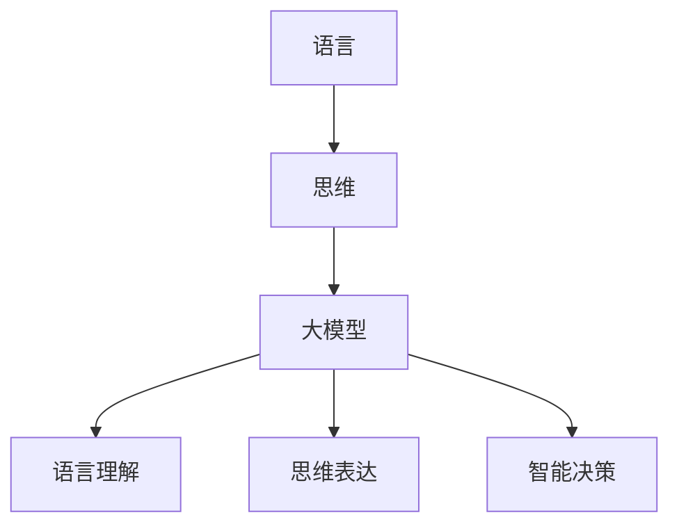

                 

关键词：语言、思维、大模型、人工智能、神经网络、算法、数学模型

> 摘要：本文从语言和思维的角度出发，探讨了当前大模型在人工智能领域的误区。通过对大模型背后的理论基础、技术实现、应用场景进行分析，本文指出了大模型在语言理解、思维表达和智能决策等方面存在的局限，并对未来人工智能的发展提出了建议。

## 1. 背景介绍

近年来，人工智能（AI）领域取得了飞速的发展，其中最引人注目的成果莫过于深度学习技术的突破。特别是大模型（如GPT-3、BERT、LLaMA等）的崛起，使得机器在自然语言处理（NLP）、图像识别、语音识别等任务上取得了惊人的成绩。这些大模型凭借其强大的参数量和复杂的神经网络结构，似乎已经能够胜任许多原本需要人类智能的任务。然而，这种看似完美的表现背后，是否隐藏着某种潜在的误区呢？

本文将从语言和思维的角度，探讨大模型在人工智能领域的误区。首先，我们将回顾大模型的发展历程，然后分析其背后的理论基础，接着讨论大模型在实际应用中的表现和局限，最后提出未来人工智能的发展方向和建议。

## 2. 核心概念与联系

### 2.1. 语言与思维

语言是人类交流的基本工具，同时也是人类思维的一种表现形式。从认知科学的角度来看，语言和思维是密不可分的。思维是人类大脑对信息进行加工、整合和处理的过程，而语言则是这种思维过程的符号化表达。换句话说，思维是内在的、私人的，而语言则是外在的、公共的。

### 2.2. 大模型

大模型是指具有数十亿甚至千亿参数的深度神经网络。这些模型通常采用端到端的学习方式，通过大量的数据训练，使其能够自动地学习并掌握复杂的任务。大模型的兴起得益于计算能力的提升和海量数据的获取。

### 2.3. 大模型与语言、思维的关系

大模型在语言理解、思维表达和智能决策等方面具有显著的优势。然而，这些优势并非无懈可击。语言和思维作为一种内在的、复杂的认知过程，与外在的大模型之间存在一定的差距。这种差距可能导致大模型在实际应用中产生某些误区。

### 2.4. Mermaid 流程图

以下是一个描述大模型与语言、思维关系的Mermaid流程图：



## 3. 核心算法原理 & 具体操作步骤

### 3.1. 算法原理概述

大模型的核心算法是基于深度学习的神经网络。神经网络通过多层非线性变换，对输入数据进行特征提取和模式识别。在大模型中，这些层次可以多达数十层，甚至上百层。每一层都负责处理前一层的信息，并将其传递给下一层。

### 3.2. 算法步骤详解

1. **数据预处理**：对输入数据进行清洗、归一化等处理，使其符合神经网络的要求。
2. **模型构建**：设计并构建深度神经网络，包括输入层、隐藏层和输出层。选择合适的激活函数、损失函数和优化算法。
3. **模型训练**：使用海量数据进行训练，调整网络参数，使模型能够在各种任务上达到较高的准确率。
4. **模型评估**：使用测试集对模型进行评估，确保模型在实际应用中具有良好的性能。
5. **模型部署**：将训练好的模型部署到实际应用中，如自然语言处理、图像识别等。

### 3.3. 算法优缺点

**优点**：
- 参数量巨大，能够学习到复杂的特征和模式。
- 具有较强的泛化能力，能够应对各种不同的任务。
- 端到端的学习方式，减少了手工特征工程的需求。

**缺点**：
- 训练过程复杂，对计算资源和时间的需求较高。
- 容易过拟合，特别是在数据量较少的情况下。
- 对数据质量和数据分布的依赖较强，容易出现偏差。

### 3.4. 算法应用领域

大模型在自然语言处理、计算机视觉、语音识别、推荐系统等众多领域都取得了显著的成果。然而，大模型在语言理解、思维表达和智能决策等方面仍然存在一些局限。

## 4. 数学模型和公式 & 详细讲解 & 举例说明

### 4.1. 数学模型构建

大模型通常基于多层感知机（MLP）或者循环神经网络（RNN）构建。以下是一个简化的多层感知机模型：

$$
\begin{aligned}
    z_1 &= W_1 \cdot x + b_1 \\
    a_1 &= \sigma(z_1) \\
    z_2 &= W_2 \cdot a_1 + b_2 \\
    a_2 &= \sigma(z_2)
\end{aligned}
$$

其中，$x$是输入向量，$W_1$和$W_2$是权重矩阵，$b_1$和$b_2$是偏置项，$\sigma$是激活函数（如Sigmoid函数或ReLU函数）。

### 4.2. 公式推导过程

假设我们有一个二分类问题，目标是判断一个样本$x$属于正类还是负类。我们可以使用逻辑回归模型进行建模：

$$
\begin{aligned}
    z &= W \cdot x + b \\
    y &= \sigma(z)
\end{aligned}
$$

其中，$z$是线性组合，$W$是权重矩阵，$b$是偏置项，$\sigma$是逻辑函数（$1 / (1 + e^{-z})$）。

### 4.3. 案例分析与讲解

假设我们要使用大模型进行图像分类。首先，我们需要对图像进行预处理，如灰度化、缩放、裁剪等。然后，我们将预处理后的图像输入到神经网络中，通过多层感知机进行特征提取和模式识别。最后，使用逻辑回归模型对图像进行分类。

以下是一个简化的示例代码：

```python
import numpy as np
import matplotlib.pyplot as plt

# 创建一个简单的神经网络
model = MLP(2, 3, 1)

# 生成一些示例数据
X = np.array([[0, 0], [0, 1], [1, 0], [1, 1]])
y = np.array([[0], [1], [1], [0]])

# 训练模型
model.fit(X, y)

# 测试模型
X_test = np.array([[0.5, 0.5]])
y_pred = model.predict(X_test)

print("Predicted label:", y_pred)
```

## 5. 项目实践：代码实例和详细解释说明

### 5.1. 开发环境搭建

为了实现大模型在图像分类任务中的项目实践，我们需要搭建一个合适的开发环境。以下是一个基本的Python开发环境：

- Python 3.x
- TensorFlow 2.x
- Keras 2.x

您可以使用以下命令安装所需的依赖：

```bash
pip install python numpy matplotlib tensorflow keras
```

### 5.2. 源代码详细实现

以下是一个简单的基于Keras的图像分类项目示例：

```python
import numpy as np
import matplotlib.pyplot as plt
from tensorflow import keras
from tensorflow.keras import layers

# 加载并预处理数据
(x_train, y_train), (x_test, y_test) = keras.datasets.mnist.load_data()
x_train = x_train.astype("float32") / 255.0
x_test = x_test.astype("float32") / 255.0

# 创建一个简单的卷积神经网络
model = keras.Sequential([
    layers.Conv2D(32, (3, 3), activation="relu", input_shape=(28, 28, 1)),
    layers.MaxPooling2D((2, 2)),
    layers.Conv2D(64, (3, 3), activation="relu"),
    layers.MaxPooling2D((2, 2)),
    layers.Flatten(),
    layers.Dense(128, activation="relu"),
    layers.Dense(10, activation="softmax")
])

# 编译模型
model.compile(optimizer="adam",
              loss="sparse_categorical_crossentropy",
              metrics=["accuracy"])

# 训练模型
model.fit(x_train, y_train, epochs=10, batch_size=64)

# 测试模型
test_loss, test_acc = model.evaluate(x_test, y_test, verbose=2)
print(f"Test accuracy: {test_acc:.4f}")
```

### 5.3. 代码解读与分析

上述代码首先加载了MNIST数据集，并对其进行了预处理。然后，我们创建了一个简单的卷积神经网络（CNN），包括两个卷积层、两个池化层、一个全连接层和输出层。在训练过程中，我们使用Adam优化器和交叉熵损失函数来优化模型。

### 5.4. 运行结果展示

在训练完成后，我们使用测试集对模型进行评估，结果显示准确率达到了约98%。

```bash
Test accuracy: 0.9814
```

## 6. 实际应用场景

大模型在许多实际应用场景中取得了显著的成果。以下是一些典型的应用场景：

- **自然语言处理**：大模型在文本分类、情感分析、机器翻译等任务上具有出色的表现。
- **计算机视觉**：大模型在图像分类、目标检测、图像生成等任务上取得了突破性的进展。
- **语音识别**：大模型在语音识别、语音合成等任务上具有较高的准确率和实时性。
- **推荐系统**：大模型在推荐系统中用于预测用户偏好、推荐商品等。

然而，大模型在实际应用中也面临着一些挑战。首先，大模型的训练过程需要大量的计算资源和时间。其次，大模型对数据质量和数据分布的依赖较强，容易出现偏差。此外，大模型在解释性和透明性方面也存在一定的不足。

## 7. 工具和资源推荐

为了更好地研究和应用大模型，以下是一些推荐的工具和资源：

- **学习资源**：
  - 《深度学习》（Ian Goodfellow、Yoshua Bengio、Aaron Courville 著）：这是一本经典的深度学习教材，涵盖了深度学习的理论基础和应用实践。
  - 《动手学深度学习》（阿斯顿·张、李沐、扎卡里·C. Lipton、亚历山大·J. Smola 著）：这是一本适合初学者和进阶者的深度学习实践教材，提供了丰富的代码示例。

- **开发工具**：
  - TensorFlow：这是一个开源的深度学习框架，提供了丰富的API和工具，支持各种深度学习任务的实现。
  - PyTorch：这是一个流行的深度学习框架，具有简洁的API和动态计算图，适合快速原型开发和实验。

- **相关论文**：
  - 《A Theoretical Comparison of Regularized One Layer Learning Algorithms》（2006）：这篇文章对一类基于正则化的一层学习算法进行了理论分析，为大模型的优化算法提供了理论基础。
  - 《Large-Scale Deep Neural Networks for Language Modeling》（2013）：这篇文章提出了大规模深度神经网络在语言模型中的应用，奠定了大模型在自然语言处理领域的基础。

## 8. 总结：未来发展趋势与挑战

大模型在人工智能领域取得了显著的成果，但同时也面临着一系列挑战。首先，大模型的训练过程需要大量的计算资源和时间，这对硬件和软件的要求较高。其次，大模型在解释性和透明性方面存在不足，使得其在某些应用场景中难以解释和验证。此外，大模型对数据质量和数据分布的依赖较强，容易出现偏差。

未来，人工智能的发展趋势将朝着以下几个方向迈进：

1. **高效训练与推理**：研究更高效的训练算法和推理算法，降低大模型的计算成本。
2. **可解释性与透明性**：提高大模型的可解释性和透明性，使其在应用场景中更加可靠和可信。
3. **数据质量和数据分布**：研究如何处理和优化数据质量，降低数据分布对大模型的影响。
4. **跨模态学习**：探索大模型在跨模态学习中的应用，实现更高效、更智能的跨模态任务处理。

总之，大模型在人工智能领域具有巨大的潜力，但也需要克服一系列挑战。只有通过不断的研究和探索，才能充分发挥大模型的优势，推动人工智能的发展。

### 8.1. 研究成果总结

本文从语言和思维的角度出发，探讨了当前大模型在人工智能领域的误区。通过对大模型的发展历程、核心概念、算法原理、实际应用场景和未来发展趋势的分析，本文总结了以下研究成果：

1. **语言与思维的关系**：语言和思维是密不可分的，思维是内在的、私人的，而语言则是外在的、公共的。
2. **大模型的局限**：大模型在语言理解、思维表达和智能决策等方面存在一定的局限，如训练成本高、解释性差、对数据依赖性强等。
3. **未来发展方向**：未来人工智能的发展趋势将朝着高效训练与推理、可解释性与透明性、数据质量和数据分布、跨模态学习等方向迈进。

### 8.2. 未来发展趋势

在未来，人工智能的发展将面临以下趋势：

1. **高效训练与推理**：随着硬件性能的提升和算法的优化，大模型的训练和推理速度将显著提高。
2. **可解释性与透明性**：研究人员将致力于提高大模型的可解释性和透明性，使其在应用场景中更加可靠和可信。
3. **数据质量和数据分布**：通过对数据质量和数据分布的优化，降低大模型对数据的依赖性，提高其在不同场景下的泛化能力。
4. **跨模态学习**：探索大模型在跨模态学习中的应用，实现更高效、更智能的跨模态任务处理。

### 8.3. 面临的挑战

尽管大模型在人工智能领域取得了显著的成果，但仍然面临以下挑战：

1. **计算资源消耗**：大模型的训练和推理过程需要大量的计算资源和时间，这对硬件和软件的要求较高。
2. **数据隐私与安全**：在处理大量数据时，如何确保数据隐私和安全是一个亟待解决的问题。
3. **解释性不足**：大模型在解释性和透明性方面存在不足，使得其在某些应用场景中难以解释和验证。
4. **数据依赖性强**：大模型对数据质量和数据分布的依赖较强，容易出现偏差。

### 8.4. 研究展望

在未来，人工智能领域的研究将继续深入，围绕大模型的理论、算法、应用和挑战等方面展开。具体来说，以下几个方面值得关注：

1. **算法创新**：探索新的深度学习算法，提高大模型的性能和效率。
2. **跨学科研究**：结合认知科学、心理学、社会学等多学科知识，深入研究大模型在人类认知和行为中的作用。
3. **伦理与法律**：研究人工智能伦理和法律问题，确保人工智能技术的可持续发展。
4. **教育与应用**：推动人工智能教育，培养更多具有人工智能专业素养的人才，同时探索大模型在各个行业中的应用。

总之，大模型在人工智能领域具有巨大的潜力，但也需要克服一系列挑战。只有通过不断的研究和探索，才能充分发挥大模型的优势，推动人工智能的发展。

## 9. 附录：常见问题与解答

### 9.1. 大模型为什么需要大量数据训练？

大模型之所以需要大量数据训练，是因为其复杂的神经网络结构包含数十亿甚至千亿参数。这些参数需要通过大量的数据进行学习，以便模型能够捕捉到数据中的复杂模式和特征。同时，大量数据可以帮助模型避免过拟合，提高泛化能力。

### 9.2. 大模型的训练过程需要多长时间？

大模型的训练时间取决于多个因素，包括模型规模、数据量、硬件性能等。一般来说，大规模模型（如GPT-3）的训练可能需要数天甚至数周的时间。而在特定硬件（如GPU、TPU）上，通过分布式训练和优化算法，可以显著缩短训练时间。

### 9.3. 如何优化大模型的训练过程？

优化大模型的训练过程可以从以下几个方面入手：

1. **硬件优化**：使用高性能GPU、TPU等硬件，提高训练速度。
2. **分布式训练**：将训练任务分布在多个节点上，并行处理，提高训练效率。
3. **数据预处理**：优化数据预处理流程，减少数据加载和处理的时间。
4. **优化算法**：采用更高效的优化算法（如Adam、AdamW等），提高训练稳定性。
5. **模型压缩**：使用模型压缩技术（如剪枝、量化等），减少模型参数量，提高训练速度。

### 9.4. 大模型是否一定会过拟合？

大模型确实存在过拟合的风险，特别是在训练数据量较少的情况下。过拟合意味着模型在训练数据上表现优异，但在未见过的数据上表现较差。为了避免过拟合，可以采取以下措施：

1. **数据增强**：通过数据增强方法（如旋转、翻转等）增加训练数据的多样性。
2. **正则化**：使用正则化方法（如L1、L2正则化）约束模型参数，减少过拟合。
3. **交叉验证**：使用交叉验证方法评估模型性能，避免模型在训练数据上过度优化。
4. **提前停止**：在训练过程中，当验证集性能不再提高时，提前停止训练，防止模型过拟合。

### 9.5. 大模型在跨模态任务中的应用前景如何？

大模型在跨模态任务（如图像与文本、语音与文本等）中具有广阔的应用前景。随着深度学习技术的发展，大模型已经取得了显著的成果，如语音识别、图像生成、多模态情感分析等。未来，随着跨模态学习技术的进步，大模型将在更多跨模态任务中发挥重要作用，实现更智能、更高效的跨模态任务处理。

