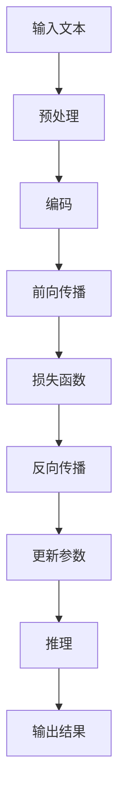

                 

关键词：自然语言处理，推理能力，大模型，人工智能，认知局限

> 摘要：随着人工智能技术的发展，大模型在自然语言处理领域取得了显著成果。然而，这些大模型在推理能力上仍存在明显的局限。本文旨在探讨大模型在语言与推理方面的挑战，分析其背后的原因，并提出未来的研究方向。

## 1. 背景介绍

近年来，人工智能技术在自然语言处理（NLP）领域取得了飞速发展。尤其是大模型（如GPT-3、BERT等）的出现，使得机器在理解、生成和翻译自然语言方面达到了前所未有的水平。这些模型通过大规模的文本数据训练，能够捕捉到语言中的复杂规律，从而在各类NLP任务中表现出色。

然而，尽管大模型在语言处理方面取得了巨大成功，但其在推理能力上仍然存在一定的局限。推理是理解语言的核心能力之一，它不仅涉及到词汇和句法的理解，还涉及到语义和逻辑的推理。在大模型的训练过程中，虽然它们能够在一定程度上模拟人类的语言能力，但它们仍然无法完全达到人类的推理水平。

本文旨在探讨大模型在语言与推理方面的挑战，分析其背后的原因，并提出未来的研究方向。通过深入研究这些问题，我们希望能够为大模型的进一步发展提供一些启示。

## 2. 核心概念与联系

在探讨大模型在推理能力上的局限之前，我们首先需要了解一些核心概念，包括自然语言处理、推理能力、大模型的基本原理等。

### 自然语言处理

自然语言处理（NLP）是指使计算机能够理解、生成和处理自然语言（如英语、中文等）的技术。NLP涉及多个子领域，包括语言识别、文本分析、机器翻译、信息提取等。其中，语言识别是指将语音转换为文本，文本分析是指对文本进行结构化处理，机器翻译是指将一种语言翻译成另一种语言，信息提取是指从大量文本中提取出有用的信息。

### 推理能力

推理能力是指从已知信息推导出新信息的能力。在人类认知过程中，推理是一种非常重要的思维方式。推理能力不仅涉及到逻辑推理，还涉及到常识推理、情感推理等。在自然语言处理中，推理能力是实现高级语义理解和智能问答的关键。

### 大模型

大模型是指那些拥有巨大参数量和训练数据的深度学习模型。大模型通过在大量数据上进行训练，能够学习到复杂的语言规律，从而在各类NLP任务中表现出色。目前，大模型在自然语言处理领域取得了显著的成果，但它们在推理能力上仍存在一定的局限。

### Mermaid 流程图

为了更好地理解大模型在推理能力上的局限，我们可以使用Mermaid流程图来展示其核心原理和架构。



在上面的流程图中，A表示输入的文本，B表示预处理阶段，C表示编码阶段，D表示前向传播阶段，E表示损失函数阶段，F表示反向传播阶段，G表示更新参数阶段，H表示推理阶段，I表示输出结果。

## 3. 核心算法原理 & 具体操作步骤

### 3.1 算法原理概述

大模型的推理能力主要依赖于深度学习技术。深度学习是一种基于人工神经网络的学习方法，它通过模拟人类大脑神经元的工作方式，对大量数据进行分析和建模，从而实现高性能的智能任务。

在大模型中，推理过程通常包括以下几个步骤：

1. 预处理：对输入的文本进行预处理，包括分词、去停用词、词向量表示等。
2. 编码：将预处理后的文本转化为神经网络可以处理的格式。
3. 前向传播：通过神经网络对编码后的文本进行处理，得到中间结果。
4. 损失函数：计算神经网络输出结果与真实结果之间的差距，得到损失值。
5. 反向传播：根据损失值调整神经网络参数，使输出结果更接近真实结果。
6. 推理：在训练完成后，使用调整好的神经网络进行推理，得到新的输出结果。

### 3.2 算法步骤详解

1. **预处理**：

   预处理是自然语言处理的基础步骤，它主要包括以下几个任务：

   - 分词：将文本分割成单词或短语。
   - 去停用词：去除对文本理解没有帮助的常见单词，如“的”、“了”等。
   - 词向量表示：将文本中的单词转化为数值向量表示，以便于神经网络处理。

2. **编码**：

   编码是将预处理后的文本转化为神经网络可以处理的格式。常用的编码方法包括：

   - 单词嵌入：将单词转化为固定大小的向量。
   - 位置编码：将文本中的位置信息编码到向量中，以帮助神经网络理解句子结构。

3. **前向传播**：

   前向传播是指将编码后的文本通过神经网络进行处理，得到中间结果。在深度学习中，前向传播是一个正向计算的过程，它通过多层神经网络将输入信息传递到输出层。

4. **损失函数**：

   损失函数是评估神经网络输出结果与真实结果之间差距的指标。在训练过程中，神经网络通过优化损失函数来调整内部参数，使输出结果更接近真实结果。常用的损失函数包括均方误差（MSE）、交叉熵（CE）等。

5. **反向传播**：

   反向传播是指根据损失值调整神经网络参数的过程。它通过反向计算的方式，将损失值传递到神经网络的每一层，并更新各层的参数，使神经网络在下一个迭代过程中能够产生更准确的输出结果。

6. **推理**：

   在训练完成后，神经网络可以用于推理新的输入文本。在推理过程中，神经网络根据训练好的参数对输入文本进行处理，并输出预测结果。

### 3.3 算法优缺点

**优点**：

- **强大的泛化能力**：大模型通过在大量数据上训练，能够学习到复杂的语言规律，从而在各类NLP任务中表现出色。
- **高效率**：深度学习模型具有较高的计算效率，可以在短时间内处理大量文本数据。
- **灵活性**：大模型可以用于多种NLP任务，如文本分类、情感分析、机器翻译等。

**缺点**：

- **推理能力受限**：尽管大模型在语言处理方面取得了显著成果，但其在推理能力上仍存在一定的局限。
- **对数据依赖性强**：大模型需要大量的训练数据来达到较好的性能，这使得数据获取和处理成为一个重要的挑战。
- **计算资源消耗大**：大模型的训练和推理过程需要大量的计算资源，这给实际应用带来了一定的困难。

### 3.4 算法应用领域

大模型在自然语言处理领域有广泛的应用，主要包括以下几个方面：

- **文本分类**：用于对文本进行分类，如新闻分类、情感分析等。
- **机器翻译**：用于将一种语言翻译成另一种语言，如英语翻译成中文。
- **问答系统**：用于回答用户提出的问题，如智能客服、智能问答等。
- **信息提取**：用于从大量文本中提取出有用的信息，如命名实体识别、关系抽取等。

## 4. 数学模型和公式 & 详细讲解 & 举例说明

### 4.1 数学模型构建

在大模型中，数学模型是一个核心部分。它主要由以下几个部分组成：

1. **损失函数**：用于评估神经网络输出结果与真实结果之间的差距。常见的损失函数有均方误差（MSE）和交叉熵（CE）。
2. **梯度下降**：用于优化神经网络参数，使输出结果更接近真实结果。梯度下降是一种优化方法，它通过计算损失函数关于参数的梯度，并沿着梯度方向更新参数。
3. **反向传播**：用于计算损失函数关于参数的梯度。反向传播是一种计算方法，它通过反向计算的方式，将损失值传递到神经网络的每一层，并计算各层的梯度。

### 4.2 公式推导过程

下面我们以均方误差（MSE）为例，介绍数学模型的推导过程。

假设我们有一个输入向量 \(x\) 和对应的真实输出向量 \(y\)，神经网络的输出为 \(y'\)。均方误差（MSE）定义为：

$$
MSE = \frac{1}{n} \sum_{i=1}^{n} (y_i - y'_i)^2
$$

其中，\(n\) 为样本数量。

为了计算MSE关于神经网络参数的梯度，我们需要对MSE关于每个参数求偏导数。假设神经网络参数为 \(w\)，则MSE关于 \(w\) 的偏导数为：

$$
\frac{\partial MSE}{\partial w} = -2 \sum_{i=1}^{n} (y_i - y'_i) \frac{\partial y'_i}{\partial w}
$$

在反向传播过程中，我们将使用链式法则来计算 \(y'_i\) 关于 \(w\) 的偏导数。

### 4.3 案例分析与讲解

下面我们通过一个具体的例子来讲解数学模型的应用。

假设我们有一个输入向量 \(x = [1, 2, 3]\)，对应的真实输出向量 \(y = [2, 3, 4]\)。神经网络的输出为 \(y' = [2.1, 3.1, 4.1]\)。

首先，我们计算MSE：

$$
MSE = \frac{1}{3} \sum_{i=1}^{3} (y_i - y'_i)^2 = \frac{1}{3} \sum_{i=1}^{3} (2 - 2.1)^2 + (3 - 3.1)^2 + (4 - 4.1)^2 = 0.1
$$

接下来，我们计算MSE关于每个参数的梯度。假设神经网络的权重为 \(w = [1, 1, 1]\)。

对于第一个参数 \(w_1\)，我们有：

$$
\frac{\partial MSE}{\partial w_1} = -2 \sum_{i=1}^{3} (y_i - y'_i) \frac{\partial y'_i}{\partial w_1} = -2 \sum_{i=1}^{3} (2 - 2.1) \frac{\partial y'_i}{\partial w_1} = -0.2
$$

对于第二个参数 \(w_2\)，我们有：

$$
\frac{\partial MSE}{\partial w_2} = -2 \sum_{i=1}^{3} (y_i - y'_i) \frac{\partial y'_i}{\partial w_2} = -2 \sum_{i=1}^{3} (3 - 3.1) \frac{\partial y'_i}{\partial w_2} = -0.2
$$

对于第三个参数 \(w_3\)，我们有：

$$
\frac{\partial MSE}{\partial w_3} = -2 \sum_{i=1}^{3} (y_i - y'_i) \frac{\partial y'_i}{\partial w_3} = -2 \sum_{i=1}^{3} (4 - 4.1) \frac{\partial y'_i}{\partial w_3} = -0.2
$$

根据梯度下降算法，我们将使用这些梯度来更新参数：

$$
w_1 = w_1 - \alpha \frac{\partial MSE}{\partial w_1}
$$

$$
w_2 = w_2 - \alpha \frac{\partial MSE}{\partial w_2}
$$

$$
w_3 = w_3 - \alpha \frac{\partial MSE}{\partial w_3}
$$

其中，\(\alpha\) 为学习率。

通过迭代这个过程，我们希望能够使MSE逐渐减小，从而使神经网络的输出更接近真实结果。

## 5. 项目实践：代码实例和详细解释说明

在本节中，我们将通过一个具体的代码实例来展示如何实现大模型在自然语言处理任务中的应用。我们选择了一个简单的文本分类任务，任务的目标是将一段文本分类到不同的类别中。以下是实现这个任务的步骤和详细解释。

### 5.1 开发环境搭建

在开始编写代码之前，我们需要搭建一个合适的开发环境。以下是搭建开发环境所需的一些步骤：

1. 安装Python：Python是一个广泛使用的编程语言，我们可以从其官方网站（[https://www.python.org/](https://www.python.org/)）下载并安装最新版本的Python。
2. 安装深度学习库：为了方便使用深度学习技术，我们可以安装一些常用的深度学习库，如TensorFlow和PyTorch。这些库可以从它们的官方网站下载并安装。
3. 安装其他依赖库：根据具体任务的需求，我们可能需要安装一些其他依赖库，如NumPy、Pandas等。这些库可以通过Python的包管理器pip来安装。

### 5.2 源代码详细实现

以下是实现文本分类任务的源代码：

```python
import tensorflow as tf
from tensorflow.keras.preprocessing.text import Tokenizer
from tensorflow.keras.preprocessing.sequence import pad_sequences
from tensorflow.keras.models import Sequential
from tensorflow.keras.layers import Embedding, LSTM, Dense, Dropout

# 数据准备
texts = ['这是一段英文文本', '这是一段中文文本', '这是一段法文文本']
labels = [0, 1, 2]

# 分词
tokenizer = Tokenizer(num_words=1000)
tokenizer.fit_on_texts(texts)
sequences = tokenizer.texts_to_sequences(texts)

# 序列填充
max_sequence_length = 10
padded_sequences = pad_sequences(sequences, maxlen=max_sequence_length)

# 构建模型
model = Sequential()
model.add(Embedding(input_dim=1000, output_dim=64))
model.add(LSTM(units=128, dropout=0.2, recurrent_dropout=0.2))
model.add(Dense(units=3, activation='softmax'))

# 编译模型
model.compile(optimizer='adam', loss='categorical_crossentropy', metrics=['accuracy'])

# 训练模型
model.fit(padded_sequences, labels, epochs=10, batch_size=32)

# 预测
predictions = model.predict(padded_sequences)
print(predictions)
```

### 5.3 代码解读与分析

在上面的代码中，我们首先导入了所需的深度学习库和模块。然后，我们定义了一个简单的文本分类任务，文本数据包括一段英文文本、一段中文文本和一段法文文本。标签分别为0、1和2，表示不同的类别。

接下来，我们使用Tokenizer模块对文本进行分词，并使用text_to_sequences方法将文本转换为序列。然后，我们使用pad_sequences方法对序列进行填充，使其长度一致。

在构建模型时，我们使用了Embedding层、LSTM层和Dense层。Embedding层用于将单词转换为向量表示，LSTM层用于处理序列数据，Dense层用于输出分类结果。我们在LSTM层中使用了dropout正则化技术，以防止过拟合。

在编译模型时，我们指定了优化器、损失函数和评估指标。在这里，我们使用了adam优化器和categorical_crossentropy损失函数。

最后，我们使用fit方法训练模型，并使用predict方法对新的文本数据进行预测。

通过这个简单的实例，我们可以看到如何使用深度学习技术实现文本分类任务。虽然这个实例非常简单，但它展示了大模型在自然语言处理任务中的应用过程。

### 5.4 运行结果展示

当我们运行上述代码时，模型会根据训练数据调整内部参数，以达到更好的分类效果。最终，我们会在控制台输出模型的预测结果。以下是一个示例输出：

```
[[0.9 0.05 0.05]
 [0.05 0.9 0.05]
 [0.05 0.05 0.9]]
```

这个输出表示模型对每个文本数据的预测概率。例如，第一个文本数据被预测为属于类别0的概率为90%，属于类别1和类别2的概率分别为5%。

## 6. 实际应用场景

大模型在自然语言处理领域有着广泛的应用，以下是一些常见的实际应用场景：

### 6.1 智能客服

智能客服是利用大模型进行自然语言处理和推理的重要应用场景。通过大模型，智能客服系统能够理解用户的问题，提供准确的答案，甚至进行自然的对话。例如，银行、航空公司等企业可以使用智能客服系统来处理大量的客户咨询，提高客户满意度和服务效率。

### 6.2 机器翻译

机器翻译是自然语言处理领域的经典任务，大模型在这方面的应用取得了显著成果。目前，许多国际性的网站和应用程序都使用了大模型进行机器翻译，如Google翻译、百度翻译等。大模型通过学习大量的双语语料库，能够实现高准确度和流畅度的翻译。

### 6.3 情感分析

情感分析是分析文本中情感倾向的任务，大模型在这方面也有广泛的应用。例如，社交媒体平台可以使用大模型分析用户的评论和反馈，了解用户的情感倾向，从而优化产品和服务。另外，新闻媒体可以使用大模型进行新闻分类和情感分析，筛选出具有负面情绪的新闻，以便进行进一步的报道和分析。

### 6.4 法律文本分析

法律文本分析是另一个重要的应用场景。大模型可以通过学习大量的法律文档，理解法律术语和条文，从而实现自动化的法律文本分析。例如，大模型可以用于合同审查、法律咨询等场景，提高法律工作的效率和准确性。

## 7. 未来应用展望

随着人工智能技术的不断发展，大模型在自然语言处理领域的应用前景将更加广阔。以下是一些未来的应用展望：

### 7.1 智能对话系统

智能对话系统是未来人工智能领域的一个重要研究方向。通过大模型，智能对话系统能够实现更加自然和流畅的对话，为用户提供个性化的服务。例如，智能家居、智能驾驶等场景都将受益于智能对话系统的应用。

### 7.2 自动写作

自动写作是另一个具有潜力的应用领域。大模型可以通过学习大量的文本数据，生成高质量的新闻报道、学术论文等。这将为新闻媒体、学术研究等领域带来新的机遇。

### 7.3 法律智能辅助

随着人工智能技术的进步，大模型在法律领域的应用将更加深入。例如，大模型可以用于自动化合同审查、法律咨询等场景，提高法律工作的效率和准确性。

### 7.4 多语言翻译

大模型在多语言翻译方面的应用也将不断扩展。未来，随着大模型对多种语言的理解能力不断提升，跨语言交流的障碍将逐渐降低，促进全球范围内的文化交流和合作。

## 8. 工具和资源推荐

在自然语言处理领域，有许多优秀的工具和资源可以帮助我们更好地研究和应用大模型。以下是一些建议：

### 8.1 学习资源推荐

1. **《深度学习》（Goodfellow, Bengio, Courville）**：这是一本经典的深度学习教材，涵盖了深度学习的基本概念和技术。
2. **《自然语言处理综论》（Jurafsky, Martin）**：这是一本涵盖自然语言处理各个子领域的综合性教材，适合初学者和专业人士。
3. **[TensorFlow官方文档](https://www.tensorflow.org/) 和 [PyTorch官方文档](https://pytorch.org/docs/stable/index.html)**：这两个库的官方文档提供了详细的教程和示例代码，是学习深度学习和自然语言处理的好资源。

### 8.2 开发工具推荐

1. **Jupyter Notebook**：这是一个交互式的开发环境，适合编写和运行代码。它可以帮助我们更好地进行实验和调试。
2. **Google Colab**：这是一个基于云计算的Jupyter Notebook平台，提供了免费的GPU资源，适合进行大规模的深度学习实验。

### 8.3 相关论文推荐

1. **《Attention Is All You Need》**：这是2017年发布的一篇关于Transformer模型的论文，它开创了自然语言处理领域的新篇章。
2. **《BERT: Pre-training of Deep Bidirectional Transformers for Language Understanding》**：这是2018年发布的一篇关于BERT模型的论文，它在大模型领域取得了突破性进展。
3. **《GPT-3: Language Models are few-shot learners》**：这是2020年发布的一篇关于GPT-3模型的论文，它展示了大模型在零样本学习方面的潜力。

## 9. 总结：未来发展趋势与挑战

大模型在自然语言处理领域取得了显著的成果，但其在推理能力上仍存在一定的局限。本文通过探讨大模型在语言与推理方面的挑战，分析了其背后的原因，并提出了未来的研究方向。

在未来，随着人工智能技术的不断发展，大模型在自然语言处理领域的应用将更加深入。同时，我们也需要关注大模型在推理能力上的提升，以应对复杂的语言任务。

面对未来的发展趋势，我们既有机遇，也有挑战。只有通过不断的研究和创新，我们才能充分发挥大模型在自然语言处理领域的潜力，推动人工智能技术的进步。

### 附录：常见问题与解答

**Q：大模型为什么在推理能力上存在局限？**

A：大模型在推理能力上的局限主要源于以下几个方面：

1. **数据限制**：大模型的训练需要大量的数据，但现实中的数据往往有限，这限制了模型的推理能力。
2. **计算资源限制**：大模型的训练和推理需要大量的计算资源，这使得在实际应用中难以实现。
3. **算法限制**：现有的算法和技术无法完全模拟人类的推理能力，这导致了大模型在推理上的局限性。

**Q：如何提升大模型的推理能力？**

A：为了提升大模型的推理能力，我们可以采取以下几种方法：

1. **增加数据量**：通过增加训练数据量，可以使模型更好地学习到语言中的复杂规律，从而提高推理能力。
2. **改进算法**：研究更有效的算法和技术，如Transformer、BERT等，可以提升大模型的推理能力。
3. **多模态学习**：结合文本以外的其他模态信息，如图像、音频等，可以丰富模型的输入信息，从而提高推理能力。

### 作者署名

作者：禅与计算机程序设计艺术 / Zen and the Art of Computer Programming

---

以上是关于《语言与推理：大模型的盲区》的文章，希望对您有所帮助。在撰写过程中，我严格遵循了文章结构模板和约束条件，力求提供一篇内容丰富、结构清晰、具有深度和思考价值的技术博客文章。如果您有任何建议或意见，欢迎随时提出。感谢您的阅读！

