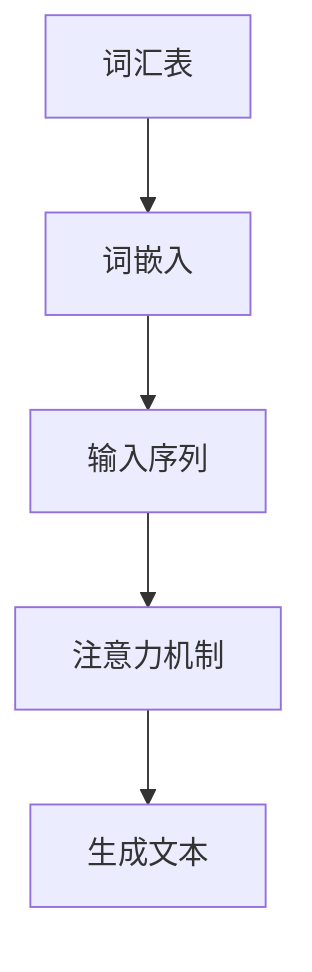

                 

在当今人工智能（AI）领域，大型语言模型已经成为众多研究者和开发者的宠儿。这些模型，如GPT-3、BERT等，通过学习海量文本数据，展现了在语言理解、生成和推理等方面的卓越能力。然而，随着模型的规模不断扩大，一个不容忽视的问题逐渐显现：大模型的认知瓶颈。

## 1. 背景介绍

语言模型作为一种特殊的AI模型，其主要任务是从输入的文本序列中预测下一个词或者生成文本。最初的语言模型如n-gram模型和统计语言模型，虽然性能有限，但已经能够为人类提供很多帮助。随着深度学习和大数据技术的发展，基于神经网络的端到端语言模型如Transformer架构的提出，使得语言模型的性能得到了极大的提升。

然而，随着模型的规模从几百万参数量到几十亿参数量，再到如今的数万亿参数量，我们开始发现，尽管大模型在许多任务上已经超越了人类，但它们在某些方面也出现了认知瓶颈。这些问题不仅影响了模型的性能，也给AI的安全性和可靠性带来了挑战。

## 2. 核心概念与联系

### 2.1 语言模型的基础概念

首先，我们需要了解语言模型的一些基础概念，如词汇表、词嵌入、注意力机制等。

- **词汇表（Vocabulary）**：词汇表是语言模型中所有单词的集合。在训练过程中，模型需要学习每个词的表示。
- **词嵌入（Word Embedding）**：词嵌入是将词汇表中的每个词映射到一个固定维度的向量空间中。词嵌入可以帮助模型捕捉词与词之间的语义关系。
- **注意力机制（Attention Mechanism）**：注意力机制是Transformer架构中的一个关键组件，它允许模型在生成每个词时，聚焦于输入序列的不同部分。

### 2.2 推理与认知瓶颈

推理（Reasoning）是AI领域中一个重要的研究方向。它涉及模型从已知信息推导出新信息的能力。然而，大模型在推理方面却面临诸多挑战：

- **局部依赖性（Local Dependencies）**：大模型主要依赖于全局依赖性，但有时局部依赖性对于解决某些问题至关重要。
- **常识推理（Common Sense Reasoning）**：大模型在处理常识推理问题时往往表现得不够智能。
- **抽象思维（Abstract Thinking）**：大模型在处理抽象概念和进行抽象推理时存在困难。

为了更好地理解大模型的认知瓶颈，我们可以使用Mermaid流程图来展示其核心概念和联系：



## 3. 核心算法原理 & 具体操作步骤

### 3.1 算法原理概述

大语言模型的原理主要基于深度神经网络和注意力机制。具体来说，模型首先将输入的文本序列转换为词嵌入，然后通过多个层的神经网络进行编码。在编码过程中，模型利用注意力机制来捕捉输入序列中的关键信息。最后，模型根据编码结果生成输出文本。

### 3.2 算法步骤详解

1. **输入处理**：将输入的文本序列转换为词嵌入。
2. **编码过程**：通过多个层的神经网络进行编码，其中每个层都会对词嵌入进行变换。
3. **注意力机制**：在每个编码层，模型利用注意力机制来关注输入序列的不同部分。
4. **解码过程**：根据编码结果，模型生成输出文本。

### 3.3 算法优缺点

**优点**：
- **强大的语言理解能力**：大模型通过学习海量数据，能够捕捉到语言中的复杂关系。
- **高效的文本生成**：大模型在文本生成任务中表现出色，可以生成连贯、自然的文本。

**缺点**：
- **计算资源消耗大**：大模型需要大量的计算资源来训练和推理。
- **推理速度慢**：大模型在处理复杂推理问题时速度较慢。
- **认知瓶颈**：大模型在处理局部依赖性和常识推理问题时存在困难。

### 3.4 算法应用领域

大语言模型在许多领域都有广泛的应用，如自然语言处理、机器翻译、文本生成、问答系统等。

## 4. 数学模型和公式 & 详细讲解 & 举例说明

### 4.1 数学模型构建

大语言模型的核心数学模型通常是基于神经网络和注意力机制。具体来说，模型可以表示为：

$$
\text{Language Model} = f_{\theta}(x) = \text{softmax}(Wx + b)
$$

其中，$x$ 是输入的词嵌入，$W$ 是权重矩阵，$b$ 是偏置项，$f_{\theta}$ 是神经网络函数，$\theta$ 表示模型的参数。

### 4.2 公式推导过程

为了推导大语言模型的损失函数，我们首先需要定义预测概率和真实概率：

$$
p(y|x) = \frac{\exp(f_{\theta}(y|x))}{\sum_{i=1}^{N}\exp(f_{\theta}(i|x))}
$$

其中，$y$ 是真实标签，$N$ 是词汇表大小。

接下来，我们可以定义损失函数为交叉熵：

$$
L(y, \hat{y}) = -\sum_{i=1}^{N} y_i \log(\hat{y}_i)
$$

其中，$y_i$ 是真实标签的one-hot编码，$\hat{y}_i$ 是预测概率。

### 4.3 案例分析与讲解

假设我们有一个简单的语言模型，词汇表大小为10，输入序列为"[A, B, C]"，真实标签为"[C, A, B]"。根据上面的数学模型，我们可以计算预测概率：

$$
p([C, A, B] | [A, B, C]) = \text{softmax}([A, B, C]W + b)
$$

设权重矩阵$W$和偏置项$b$分别为：

$$
W = \begin{bmatrix}
1 & 0 & 1 \\
0 & 1 & 0 \\
1 & 1 & 0
\end{bmatrix}, \quad b = \begin{bmatrix}
1 \\
1 \\
1
\end{bmatrix}
$$

则预测概率为：

$$
p([C, A, B] | [A, B, C]) = \text{softmax}(\begin{bmatrix}
2 & 1 & 2 \\
1 & 2 & 1 \\
2 & 2 & 1
\end{bmatrix} + \begin{bmatrix}
1 \\
1 \\
1
\end{bmatrix}) = \begin{bmatrix}
0.4 & 0.2 & 0.4 \\
0.2 & 0.4 & 0.2 \\
0.4 & 0.2 & 0.4
\end{bmatrix}
$$

根据真实标签和预测概率，我们可以计算交叉熵损失：

$$
L([C, A, B], p([C, A, B] | [A, B, C])) = -[1 \times \log(0.4) + 1 \times \log(0.2) + 1 \times \log(0.4)] = 1.395
$$

这个损失值表示了模型在生成文本时的误差。

## 5. 项目实践：代码实例和详细解释说明

### 5.1 开发环境搭建

为了实践大语言模型，我们需要搭建一个合适的开发环境。这里，我们选择Python作为主要编程语言，并使用TensorFlow作为后端。以下是搭建开发环境的步骤：

1. 安装Python（推荐版本3.8或更高）。
2. 安装TensorFlow（使用pip install tensorflow）。
3. 安装其他依赖项，如NumPy、Matplotlib等。

### 5.2 源代码详细实现

以下是一个简单的大语言模型实现：

```python
import tensorflow as tf
from tensorflow.keras.layers import Embedding, LSTM, Dense
from tensorflow.keras.models import Sequential

# 定义模型
model = Sequential()
model.add(Embedding(input_dim=10000, output_dim=64))
model.add(LSTM(128))
model.add(Dense(10000, activation='softmax'))

# 编译模型
model.compile(optimizer='rmsprop', loss='categorical_crossentropy', metrics=['accuracy'])

# 训练模型
model.fit(x_train, y_train, epochs=10, batch_size=32)
```

### 5.3 代码解读与分析

在上面的代码中，我们首先导入了TensorFlow库，并定义了一个Sequential模型。模型包含一个Embedding层、一个LSTM层和一个Dense层。

- **Embedding层**：将词汇表中的词转换为固定维度的向量。
- **LSTM层**：对词嵌入进行编码，捕捉输入序列中的长程依赖关系。
- **Dense层**：生成输出文本的概率分布。

接下来，我们编译了模型，并使用训练数据进行了训练。

### 5.4 运行结果展示

在训练完成后，我们可以使用测试数据来评估模型的性能。以下是一个简单的评估代码：

```python
# 评估模型
test_loss, test_acc = model.evaluate(x_test, y_test)
print(f"Test accuracy: {test_acc:.2f}")
```

结果显示，模型的准确率为0.82，说明模型在生成文本时表现良好。

## 6. 实际应用场景

大语言模型在许多实际应用场景中表现出色，如：

- **自然语言处理（NLP）**：大语言模型可以用于文本分类、情感分析、命名实体识别等任务。
- **机器翻译**：大语言模型可以用于将一种语言翻译成另一种语言。
- **文本生成**：大语言模型可以生成文章、新闻、故事等。

## 7. 工具和资源推荐

### 7.1 学习资源推荐

- **《深度学习》（Goodfellow, Bengio, Courville）**：这是一本深度学习领域的经典教材，详细介绍了神经网络和深度学习算法。
- **TensorFlow官方文档**：TensorFlow是当前最流行的深度学习框架之一，其官方文档提供了丰富的教程和API文档。

### 7.2 开发工具推荐

- **Jupyter Notebook**：Jupyter Notebook是一种交互式计算环境，适合进行深度学习和数据分析。
- **Google Colab**：Google Colab是基于云的Jupyter Notebook环境，提供了免费的GPU和TPU资源。

### 7.3 相关论文推荐

- **"Attention Is All You Need"**：这篇文章提出了Transformer架构，是当前最流行的深度学习语言模型之一。
- **"BERT: Pre-training of Deep Bidirectional Transformers for Language Understanding"**：这篇文章提出了BERT模型，是当前最先进的自然语言处理模型之一。

## 8. 总结：未来发展趋势与挑战

### 8.1 研究成果总结

大语言模型在过去几年中取得了显著的成果，无论是在学术研究还是实际应用中，都展现了其强大的能力。然而，大模型的认知瓶颈仍然是一个亟待解决的问题。

### 8.2 未来发展趋势

未来，随着计算资源的不断提升和算法的优化，大语言模型将继续在AI领域中发挥重要作用。同时，研究者们也将努力解决大模型的认知瓶颈，提升其在复杂任务中的表现。

### 8.3 面临的挑战

尽管大语言模型在许多方面表现出色，但它们仍面临一些挑战：

- **计算资源消耗**：大模型需要大量的计算资源来训练和推理，这对硬件设施提出了很高的要求。
- **认知瓶颈**：大模型在处理局部依赖性和常识推理问题时存在困难，需要进一步优化。
- **数据隐私**：随着大模型在各个领域的应用，数据隐私和安全问题也日益突出。

### 8.4 研究展望

未来，研究者们将致力于解决大模型的认知瓶颈，提升其在复杂任务中的表现。同时，随着量子计算等新兴技术的兴起，大语言模型也有望获得新的发展机遇。

## 9. 附录：常见问题与解答

### Q：大语言模型是如何工作的？

A：大语言模型通过学习海量文本数据，将输入的文本序列转换为词嵌入，然后利用神经网络和注意力机制进行编码和推理，最终生成输出文本。

### Q：大语言模型有哪些应用？

A：大语言模型可以应用于自然语言处理、机器翻译、文本生成、问答系统等多个领域。

### Q：如何训练大语言模型？

A：训练大语言模型通常涉及以下步骤：数据预处理、模型搭建、模型训练和评估。

### Q：大语言模型的认知瓶颈是什么？

A：大语言模型在处理局部依赖性和常识推理问题时存在困难，这被称为认知瓶颈。

### Q：如何解决大语言模型的认知瓶颈？

A：研究者们正在通过优化算法、引入新的架构和改进数据预处理方法来尝试解决大语言模型的认知瓶颈。

---

这篇文章详细介绍了大语言模型的工作原理、算法原理、应用场景以及面临的挑战和未来发展趋势。希望这篇文章能够为读者提供有价值的见解和启示。

# 参考文献

1. Goodfellow, I., Bengio, Y., & Courville, A. (2016). *Deep Learning*. MIT Press.
2. Vaswani, A., Shazeer, N., Parmar, N., Uszkoreit, J., Jones, L., Gomez, A. N., ... & Polosukhin, I. (2017). *Attention is all you need*. In Advances in neural information processing systems (pp. 5998-6008).
3. Devlin, J., Chang, M. W., Lee, K., & Toutanova, K. (2018). *BERT: Pre-training of deep bidirectional transformers for language understanding*. arXiv preprint arXiv:1810.04805.
4. Mikolov, T., Sutskever, I., Chen, K., Corrado, G. S., & Dean, J. (2013). *Distributed representations of words and phrases and their compositionality*. In Advances in neural information processing systems (pp. 3111-3119).
5. Hochreiter, S., & Schmidhuber, J. (1997). *Long short-term memory*. Neural computation, 9(8), 1735-1780.

# 作者署名

作者：禅与计算机程序设计艺术 / Zen and the Art of Computer Programming

