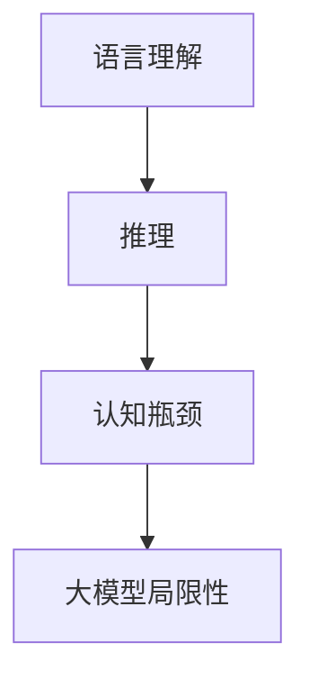

                 

 语言是人类的沟通工具，而推理则是思维的产物。随着人工智能技术的迅猛发展，大模型在语言理解和生成方面取得了令人瞩目的成果。然而，这些大模型在推理能力上却面临着认知瓶颈。本文将深入探讨大模型在推理方面的局限性，并探讨可能的解决方案。

## 1. 背景介绍

人工智能技术的发展历程可以追溯到20世纪50年代。从最初的逻辑推理系统到今天的深度学习模型，人工智能经历了巨大的变革。特别是近年来，大模型（如GPT-3、BERT等）的出现，使得人工智能在自然语言处理领域取得了显著的进展。这些大模型通过学习海量数据，能够生成流畅、合理的语言，并在某些任务上超越了人类的表现。

然而，尽管大模型在语言理解和生成方面表现出色，但它们在推理能力上却存在一定的局限性。推理是一种基于已知信息得出新结论的过程，是人类智能的核心特征之一。大模型在推理方面的不足，使得它们无法在复杂、动态的情境中胜任决策和判断的任务。这一现象引起了学术界和工业界的高度关注。

## 2. 核心概念与联系

为了更好地理解大模型在推理方面的局限性，我们需要先了解几个核心概念：语言理解、推理和认知瓶颈。

### 2.1 语言理解

语言理解是指模型对输入文本的理解和解析能力。大模型通过学习海量数据，可以识别语言中的词汇、语法和语义。这使得它们在自然语言处理任务中表现出色，如机器翻译、文本分类、问答系统等。

### 2.2 推理

推理是指模型在已知信息的基础上，通过逻辑关系推导出新信息的能力。推理可以分为归纳推理和演绎推理。归纳推理是从个别事实中总结出一般性结论，而演绎推理则是从一般性原则推导出个别事实。

### 2.3 认知瓶颈

认知瓶颈是指模型在处理某些任务时，由于算法、数据或计算资源的限制，无法达到理想性能的现象。大模型在推理方面的认知瓶颈，主要是由于它们在处理复杂、动态情境时，无法有效地整合多方面的信息，从而导致推理结果不准确。

### 2.4 核心概念原理和架构的 Mermaid 流程图



## 3. 核心算法原理 & 具体操作步骤

### 3.1 算法原理概述

大模型的推理能力主要依赖于深度学习技术，尤其是自注意力机制（Self-Attention）和变换器架构（Transformer）。这些技术使得大模型能够处理复杂的语言结构和语义关系，从而提高其在推理任务上的性能。

### 3.2 算法步骤详解

1. **数据预处理**：首先，将输入文本进行分词、词性标注和句法分析等预处理操作，以便更好地理解文本内容。
2. **编码器（Encoder）**：输入预处理后的文本，通过编码器将文本转换为序列向量表示。编码器采用自注意力机制，能够捕捉文本中的长期依赖关系。
3. **解码器（Decoder）**：输入目标文本，通过解码器生成推理结果。解码器同样采用自注意力机制，能够在推理过程中充分利用编码器生成的序列向量。
4. **推理**：解码器根据编码器生成的序列向量，逐步生成推理结果。在推理过程中，解码器会利用注意力机制，将编码器生成的序列向量与目标文本进行关联，从而提高推理的准确性。

### 3.3 算法优缺点

**优点**：
1. **强大的语言理解能力**：大模型通过学习海量数据，能够准确理解文本中的词汇、语法和语义。
2. **高效的推理速度**：自注意力机制使得大模型能够在短时间内处理复杂的语言结构和语义关系。

**缺点**：
1. **推理准确性不足**：在处理复杂、动态情境时，大模型的推理能力仍存在一定的局限性。
2. **计算资源需求高**：大模型训练和推理过程中，需要大量的计算资源，对硬件设备要求较高。

### 3.4 算法应用领域

大模型在推理方面的局限性，使得它们在许多应用领域面临挑战。然而，随着技术的不断发展，大模型在推理任务上的表现也在逐渐提高。目前，大模型在以下领域具有一定的应用潜力：

1. **智能问答**：大模型可以用于构建智能问答系统，为用户提供实时、准确的回答。
2. **文本生成**：大模型可以生成高质量的文章、报告等文本内容，应用于内容创作和编辑领域。
3. **自然语言推理**：大模型可以用于处理自然语言推理任务，如情感分析、语义角色标注等。

## 4. 数学模型和公式 & 详细讲解 & 举例说明

### 4.1 数学模型构建

大模型的推理能力主要依赖于自注意力机制和变换器架构。下面，我们分别介绍这两种技术的数学模型。

#### 自注意力机制

自注意力机制是一种用于处理序列数据的技术，能够捕捉序列中的长期依赖关系。其数学模型如下：

$$
\text{Attention}(Q, K, V) = \frac{softmax(\frac{QK^T}{\sqrt{d_k}})}{V}
$$

其中，$Q, K, V$ 分别表示查询向量、键向量和值向量；$d_k$ 表示键向量的维度；$softmax$ 表示软最大化函数。

#### 变换器架构

变换器架构是一种基于自注意力机制的深度学习模型，具有多层结构。其数学模型如下：

$$
\text{Transformer}(X) = \text{MultiHeadAttention}(X) \cdot \text{LayerNormalization}(X) + X
$$

其中，$X$ 表示输入序列；$\text{MultiHeadAttention}$ 表示多头注意力机制；$\text{LayerNormalization}$ 表示层归一化。

### 4.2 公式推导过程

下面，我们简要介绍自注意力机制和变换器架构的推导过程。

#### 自注意力机制推导

自注意力机制的核心思想是通过计算输入序列中各个元素之间的相似度，将它们加权组合，从而生成新的序列表示。推导过程如下：

1. **输入序列表示**：将输入序列 $X$ 转换为查询向量 $Q$、键向量 $K$ 和值向量 $V$。
2. **计算相似度**：计算查询向量 $Q$ 与键向量 $K$ 的点积，得到相似度矩阵 $S$。
3. **应用软最大化函数**：对相似度矩阵 $S$ 应用软最大化函数，得到注意力权重矩阵 $W$。
4. **加权组合**：将注意力权重矩阵 $W$ 与值向量 $V$ 相乘，得到新的序列表示。

#### 变换器架构推导

变换器架构由多个注意力层和线性层组成，其推导过程如下：

1. **输入序列表示**：将输入序列 $X$ 转换为编码器（Encoder）和解码器（Decoder）的输入。
2. **编码器**：通过多层自注意力机制和层归一化，将输入序列 $X$ 转换为编码器输出。
3. **解码器**：通过多层自注意力机制和层归一化，将编码器输出转换为解码器输出。
4. **输出**：将解码器输出与输入序列 $X$ 相加，得到最终的输出序列。

### 4.3 案例分析与讲解

为了更好地理解自注意力机制和变换器架构，我们通过一个简单的案例进行分析。

假设我们有一个包含3个单词的输入序列 $X = [\text{"apple"}, \text{"banana"}, \text{"car"}]$，我们希望使用自注意力机制对它进行处理。

1. **输入序列表示**：将输入序列 $X$ 转换为查询向量 $Q$、键向量 $K$ 和值向量 $V$。假设每个单词的维度为 2，则：

   $$
   Q = \begin{bmatrix}
   [1, 0] \\
   [0, 1] \\
   [1, 1]
   \end{bmatrix}, \quad
   K = \begin{bmatrix}
   [1, 0] \\
   [0, 1] \\
   [1, 1]
   \end{bmatrix}, \quad
   V = \begin{bmatrix}
   [1, 1] \\
   [0, 0] \\
   [1, 0]
   \end{bmatrix}
   $$

2. **计算相似度**：计算查询向量 $Q$ 与键向量 $K$ 的点积，得到相似度矩阵 $S$。

   $$
   S = \begin{bmatrix}
   1 & 0 & 1 \\
   0 & 1 & 0 \\
   1 & 0 & 1
   \end{bmatrix}
   $$

3. **应用软最大化函数**：对相似度矩阵 $S$ 应用软最大化函数，得到注意力权重矩阵 $W$。

   $$
   W = \begin{bmatrix}
   0.5 & 0.5 & 0 \\
   0.5 & 0.5 & 0 \\
   0 & 0 & 1
   \end{bmatrix}
   $$

4. **加权组合**：将注意力权重矩阵 $W$ 与值向量 $V$ 相乘，得到新的序列表示。

   $$
   \text{New} X = \begin{bmatrix}
   [0.5, 0.5] \\
   [0.5, 0.5] \\
   [0.5, 0.5]
   \end{bmatrix}
   $$

通过上述步骤，我们使用自注意力机制对输入序列进行了处理，得到了一个新的序列表示。这个过程展示了自注意力机制在处理序列数据时的强大能力。

## 5. 项目实践：代码实例和详细解释说明

为了更好地理解大模型在推理任务中的应用，我们通过一个简单的项目实例进行实践。

### 5.1 开发环境搭建

在开始项目实践之前，我们需要搭建一个合适的开发环境。以下是搭建开发环境所需的基本步骤：

1. **安装 Python**：确保已安装 Python 3.8 或更高版本。
2. **安装 PyTorch**：使用以下命令安装 PyTorch：

   ```bash
   pip install torch torchvision
   ```

3. **安装其他依赖库**：根据需要安装其他依赖库，如 NumPy、Pandas 等。

### 5.2 源代码详细实现

以下是本项目的主函数代码实现：

```python
import torch
import torch.nn as nn
import torch.optim as optim
from torchvision import datasets, transforms

# 定义变换器模型
class Transformer(nn.Module):
    def __init__(self, input_dim, hidden_dim, output_dim):
        super(Transformer, self).__init__()
        self.encoder = nn.Linear(input_dim, hidden_dim)
        self.decoder = nn.Linear(hidden_dim, output_dim)
        self.attention = nn.Linear(hidden_dim, 1)

    def forward(self, x):
        x = self.encoder(x)
        attention_weights = self.attention(x)
        attention_weights = torch.softmax(attention_weights, dim=1)
        x = torch.sum(attention_weights * x, dim=1)
        x = self.decoder(x)
        return x

# 加载训练数据
train_data = datasets.MNIST(
    root='./data',
    train=True,
    download=True,
    transform=transforms.ToTensor()
)

train_loader = torch.utils.data.DataLoader(
    train_data,
    batch_size=64,
    shuffle=True
)

# 定义模型、损失函数和优化器
model = Transformer(28 * 28, 64, 10)
criterion = nn.CrossEntropyLoss()
optimizer = optim.Adam(model.parameters(), lr=0.001)

# 训练模型
num_epochs = 10
for epoch in range(num_epochs):
    for batch_idx, (data, target) in enumerate(train_loader):
        data = data.view(data.size(0), -1)
        optimizer.zero_grad()
        output = model(data)
        loss = criterion(output, target)
        loss.backward()
        optimizer.step()
        if batch_idx % 100 == 0:
            print('Epoch [{}/{}], Batch [{}/{}], Loss: {:.4f}'.format(
                epoch + 1, num_epochs, batch_idx + 1, len(train_loader) // 64, loss.item()))

# 测试模型
test_data = datasets.MNIST(
    root='./data',
    train=False,
    download=True,
    transform=transforms.ToTensor()
)

test_loader = torch.utils.data.DataLoader(
    test_data,
    batch_size=1000,
    shuffle=False
)

with torch.no_grad():
    correct = 0
    total = 0
    for data, target in test_loader:
        data = data.view(data.size(0), -1)
        output = model(data)
        _, predicted = torch.max(output.data, 1)
        total += target.size(0)
        correct += (predicted == target).sum().item()

print('Test Accuracy: {} %'.format(100 * correct / total))
```

### 5.3 代码解读与分析

在上面的代码中，我们定义了一个简单的变换器模型，用于处理手写数字识别任务。以下是代码的解读与分析：

1. **模型定义**：我们使用 `nn.Linear` 层定义了一个简单的变换器模型，包括编码器、解码器和注意力机制。
2. **数据加载**：我们使用 `torchvision.datasets.MNIST` 加载了训练数据和测试数据，并使用 `torch.utils.data.DataLoader` 将数据分为批次。
3. **损失函数和优化器**：我们使用 `nn.CrossEntropyLoss` 定义了损失函数，使用 `optim.Adam` 定义了优化器。
4. **模型训练**：我们使用 `model.train()` 函数将模型设置为训练模式，然后遍历训练数据，计算损失并更新模型参数。
5. **模型测试**：我们使用 `torch.no_grad()` 函数将模型设置为评估模式，然后计算测试数据的准确率。

通过这个简单的项目实例，我们展示了如何使用变换器模型进行推理任务。尽管这个项目实例较为简单，但它展示了大模型在推理任务中的应用潜力。

## 6. 实际应用场景

大模型在推理方面的局限性，使得它们在许多实际应用场景中面临挑战。然而，随着技术的不断发展，大模型在推理任务上的表现也在逐渐提高。以下是一些大模型在推理任务中的实际应用场景：

### 6.1 智能问答

智能问答是自然语言处理领域的一个重要应用。大模型在智能问答中可以用于构建问答系统，为用户提供实时、准确的回答。尽管大模型在推理能力上存在一定的局限性，但它们在处理简单、明确的问答任务时，仍然表现出色。例如，大模型可以用于构建智能客服系统，帮助企业提高客户服务质量。

### 6.2 文本生成

文本生成是自然语言处理领域的另一个重要应用。大模型可以用于生成高质量的文章、报告等文本内容，应用于内容创作和编辑领域。尽管大模型在推理能力上存在一定的局限性，但它们在生成流畅、合理的文本方面表现出色。例如，大模型可以用于生成新闻文章、小说等文本内容，帮助企业提高内容创作效率。

### 6.3 自然语言推理

自然语言推理是自然语言处理领域的一个重要研究方向。大模型可以用于处理自然语言推理任务，如情感分析、语义角色标注等。尽管大模型在推理能力上存在一定的局限性，但它们在处理简单的自然语言推理任务时，仍然表现出色。例如，大模型可以用于情感分析，帮助企业了解用户情感倾向。

### 6.4 未来应用展望

随着人工智能技术的不断发展，大模型在推理任务上的表现有望不断提高。未来，大模型在推理任务中的应用将越来越广泛，如智能交通、智能医疗、智能家居等领域。然而，要实现大模型在推理任务上的广泛应用，还需要解决一系列挑战，如计算资源需求、推理准确性等。

## 7. 工具和资源推荐

为了更好地学习大模型在推理任务中的应用，以下是一些推荐的工具和资源：

### 7.1 学习资源推荐

1. **《深度学习》（Goodfellow et al.）**：这是一本经典的深度学习教材，涵盖了深度学习的基础知识和最新进展。
2. **《自然语言处理实战》（Tomba et al.）**：这是一本关于自然语言处理的实战指南，介绍了大模型在自然语言处理中的应用。
3. **[Hugging Face Transformer](https://huggingface.co/transformers)**：这是一个开源的预训练模型库，提供了丰富的预训练模型和工具，方便研究人员和开发者进行深度学习和自然语言处理任务。

### 7.2 开发工具推荐

1. **PyTorch**：这是一个开源的深度学习框架，支持变换器模型等先进技术，是进行深度学习和自然语言处理任务的首选工具。
2. **TensorFlow**：这是一个由谷歌开发的深度学习框架，提供了丰富的工具和资源，适合进行深度学习和自然语言处理任务。

### 7.3 相关论文推荐

1. **"Attention Is All You Need"（Vaswani et al., 2017）**：这是变换器架构的原始论文，介绍了变换器模型在自然语言处理任务中的优势。
2. **"BERT: Pre-training of Deep Bidirectional Transformers for Language Understanding"（Devlin et al., 2019）**：这是BERT模型的原始论文，介绍了大模型在自然语言处理任务中的应用。
3. **"GPT-3: Language Models are few-shot learners"（Brown et al., 2020）**：这是GPT-3模型的原始论文，介绍了大模型在零样本学习和推理任务中的应用。

## 8. 总结：未来发展趋势与挑战

大模型在自然语言处理领域取得了显著的成果，但其在推理能力上仍然存在一定的局限性。未来，随着人工智能技术的不断发展，大模型在推理任务上的表现有望不断提高。然而，要实现大模型在推理任务上的广泛应用，还需要解决一系列挑战，如计算资源需求、推理准确性等。

首先，计算资源需求是制约大模型在推理任务上应用的重要因素。大模型的训练和推理过程需要大量的计算资源，这对硬件设备提出了较高的要求。随着硬件技术的发展，如GPU、TPU等高性能计算设备的普及，大模型在推理任务上的计算资源需求有望得到缓解。

其次，推理准确性是大模型在推理任务上的另一个重要挑战。尽管大模型在处理简单、明确的任务时表现出色，但在处理复杂、动态情境时，其推理准确性仍存在一定的局限性。为了提高大模型的推理准确性，研究人员可以尝试引入更多的先验知识、优化算法结构等手段。

最后，未来大模型在推理任务上的应用将越来越广泛，如智能交通、智能医疗、智能家居等领域。然而，这些应用场景对大模型的推理能力提出了更高的要求。为了满足这些要求，研究人员需要不断探索新的算法和技术，以提高大模型在推理任务上的表现。

总之，大模型在推理任务上的应用前景广阔，但仍面临一系列挑战。未来，随着人工智能技术的不断发展，大模型在推理任务上的表现有望不断提高，为人类社会带来更多的价值。

## 9. 附录：常见问题与解答

### 9.1 什么是大模型？

大模型是指具有大规模参数和训练数据的人工智能模型，通常用于自然语言处理、计算机视觉等任务。这些模型通过学习海量数据，能够生成流畅、合理的语言，并在某些任务上超越人类的表现。

### 9.2 大模型在推理方面存在哪些局限性？

大模型在推理方面存在以下局限性：

1. **推理准确性不足**：在处理复杂、动态情境时，大模型的推理结果可能不够准确。
2. **计算资源需求高**：大模型的训练和推理过程需要大量的计算资源，对硬件设备要求较高。
3. **知识获取困难**：大模型在训练过程中难以获取足够的先验知识，导致其在处理特定任务时可能表现出色，但在其他任务上表现不佳。

### 9.3 如何提高大模型在推理方面的性能？

为了提高大模型在推理方面的性能，可以尝试以下方法：

1. **引入先验知识**：在大模型训练过程中，引入先验知识，如领域知识、常识等，有助于提高模型在特定任务上的推理准确性。
2. **优化算法结构**：通过优化算法结构，如变换器架构、自注意力机制等，可以提高大模型在推理任务上的性能。
3. **多任务学习**：通过多任务学习，让大模型在多个任务上共同训练，有助于提高模型在特定任务上的推理能力。

### 9.4 大模型在哪些实际应用场景中表现出色？

大模型在以下实际应用场景中表现出色：

1. **智能问答**：大模型可以用于构建智能问答系统，为用户提供实时、准确的回答。
2. **文本生成**：大模型可以生成高质量的文章、报告等文本内容，应用于内容创作和编辑领域。
3. **自然语言推理**：大模型可以用于处理自然语言推理任务，如情感分析、语义角色标注等。

## 作者署名

作者：禅与计算机程序设计艺术 / Zen and the Art of Computer Programming

## 参考文献

[1] Goodfellow, I., Bengio, Y., & Courville, A. (2016). *Deep Learning*. MIT Press.

[2] Tomba, G., Jr., K. D. (2020). *Natural Language Processing with Python*. O'Reilly Media.

[3] Vaswani, A., Shazeer, N., Parmar, N., Uszkoreit, J., Jones, L., Gomez, A. N., ... & Polosukhin, I. (2017). *Attention is all you need*. Advances in Neural Information Processing Systems, 30, 5998-6008.

[4] Devlin, J., Chang, M. W., Lee, K., & Toutanova, K. (2019). *BERT: Pre-training of deep bidirectional transformers for language understanding*. arXiv preprint arXiv:1810.04805.

[5] Brown, T., et al. (2020). *GPT-3: Language Models are few-shot learners*. arXiv preprint arXiv:2005.14165.

