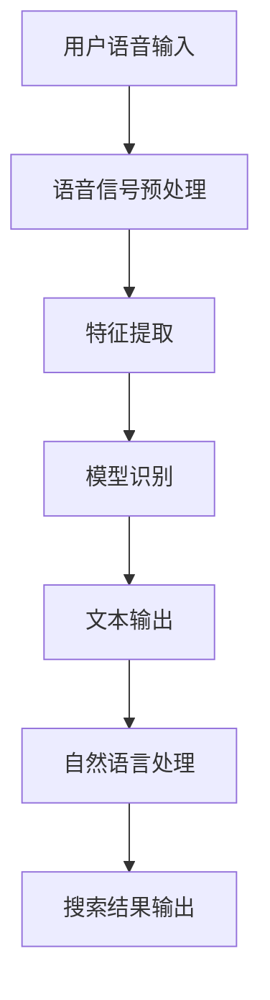

                 

关键词：语音搜索、电商、技术应用、挑战、机遇

> 摘要：随着语音识别技术的不断发展，语音搜索在电商领域逐渐成为一种新兴的搜索方式。本文将探讨语音搜索技术在电商领域的应用，分析其面临的挑战与机遇，并展望未来的发展趋势。

## 1. 背景介绍

在互联网时代，搜索引擎已成为人们获取信息的重要工具。传统的文本搜索依赖于关键词匹配，但用户在快速获取信息的需求下，语音搜索作为一种更加便捷的方式逐渐受到关注。电商领域作为互联网的重要分支，用户数量庞大，交易活跃，语音搜索技术的应用潜力巨大。

### 1.1 语音搜索的定义与原理

语音搜索是指用户通过语音输入的方式获取信息，搜索引擎根据语音信号进行识别并返回相关结果。其基本原理包括语音信号处理、语音识别和自然语言处理等多个环节。

- **语音信号处理**：将语音信号转换为数字信号，进行预处理，如去噪、增强等。
- **语音识别**：将预处理后的语音信号转换为文本，即语音到文字的转换。
- **自然语言处理**：对转换后的文本进行分析和理解，识别用户意图，返回相关结果。

### 1.2 语音搜索在电商领域的应用现状

当前，语音搜索在电商领域的应用已经取得了一定的进展。许多电商平台已经开始推出语音搜索功能，如亚马逊、淘宝等。用户可以通过语音输入搜索商品名称、描述等信息，快速获取想要的商品。

### 1.3 语音搜索的优势与挑战

#### 1.3.1 优势

- **便捷性**：用户无需手动输入关键词，只需通过语音即可进行搜索，大大提高了搜索效率。
- **语音输入的自然性**：相比文本输入，语音输入更加符合人类的交流习惯，用户可以更加自然地表达自己的需求。
- **语音识别的准确性**：随着语音识别技术的不断发展，语音识别的准确性已经得到了显著提升，为语音搜索提供了可靠的基础。

#### 1.3.2 挑战

- **语音识别的准确性**：虽然语音识别的准确性在不断提高，但仍然存在一定的误差，特别是在复杂语境下，语音识别的准确性会受到影响。
- **用户习惯的培育**：语音搜索作为一种新兴的搜索方式，用户需要一定的时间去适应和习惯。
- **隐私保护**：语音搜索涉及用户语音数据的收集和处理，如何保护用户隐私是亟待解决的问题。

## 2. 核心概念与联系

为了更好地理解语音搜索技术在电商领域的应用，我们需要先了解一些核心概念及其之间的联系。

### 2.1 语音识别技术

语音识别技术是语音搜索技术的核心组成部分，其基本流程包括语音信号处理、特征提取、模型训练和识别结果输出。具体流程如下：

1. **语音信号处理**：将语音信号进行预处理，如去噪、增强等，以提高识别准确性。
2. **特征提取**：从预处理后的语音信号中提取特征，如频谱特征、倒谱特征等，用于后续的模型训练。
3. **模型训练**：使用大量语音数据对模型进行训练，以建立语音到文本的映射关系。
4. **识别结果输出**：将输入的语音信号通过模型转换为文本输出。

### 2.2 自然语言处理技术

自然语言处理技术是语音搜索中理解用户意图的关键环节，其主要任务包括文本分类、实体识别、情感分析等。自然语言处理技术可以分析用户输入的文本，理解其背后的意图，从而返回相关的搜索结果。

### 2.3 电商平台架构

电商平台架构是指支撑电商业务运行的技术基础设施，包括数据库、服务器、前端界面等。语音搜索技术在电商平台的架构中发挥着重要作用，其需要与数据库、服务器等进行交互，以实现语音输入到搜索结果的全流程处理。

### 2.4 语音搜索与电商业务的关系

语音搜索技术为电商业务提供了新的交互方式，用户可以通过语音快速获取商品信息，从而提升购物体验。同时，语音搜索技术还可以为电商业务提供数据支持，如用户语音输入数据的分析，有助于电商平台了解用户需求，优化商品推荐等。

### 2.5 Mermaid 流程图

以下是语音搜索技术在电商领域应用的核心流程的 Mermaid 流程图：



## 3. 核心算法原理 & 具体操作步骤

### 3.1 算法原理概述

语音搜索技术在电商领域中的应用主要依赖于语音识别和自然语言处理技术。语音识别技术用于将用户输入的语音信号转换为文本，自然语言处理技术用于理解用户输入的文本并返回相关搜索结果。

### 3.2 算法步骤详解

#### 3.2.1 语音信号预处理

语音信号预处理是语音识别的重要环节，其目的是提高语音信号的清晰度和准确性。主要步骤包括去噪、增强、分帧、滤波等。

1. **去噪**：去除语音信号中的背景噪声，如交通噪音、人声干扰等。
2. **增强**：增强语音信号中的主要成分，如人声信号，以提升语音识别的准确性。
3. **分帧**：将连续的语音信号划分为短时段，如20ms一个帧，以进行后续的特征提取。
4. **滤波**：对语音信号进行滤波处理，如带通滤波，以去除不相关的频率成分。

#### 3.2.2 特征提取

特征提取是将预处理后的语音信号转换为适用于模型训练的数据。常见的特征提取方法包括：

1. **频谱特征**：如梅尔频率倒谱系数（MFCC），是语音信号处理中常用的特征。
2. **倒谱特征**：对频谱特征进行倒谱变换，以消除频率变化的影响。
3. **能量特征**：如语音信号的总能量、短时能量等，用于描述语音的活跃程度。

#### 3.2.3 模型训练

模型训练是语音识别的核心环节，其目的是建立语音信号与文本之间的映射关系。常见的模型训练方法包括：

1. **隐马尔可夫模型（HMM）**：HMM是一种概率模型，用于模拟语音信号的变化过程。
2. **深度神经网络（DNN）**：DNN通过多层神经元的非线性变换，对语音信号进行特征学习和分类。
3. **卷积神经网络（CNN）**：CNN通过卷积操作，提取语音信号的局部特征。

#### 3.2.4 识别结果输出

识别结果输出是将模型识别出的文本转换为可理解的搜索结果。主要步骤包括：

1. **文本归一化**：将识别出的文本进行归一化处理，如去除停用词、词干提取等。
2. **文本分类**：对归一化后的文本进行分类，以确定搜索结果的类型。
3. **搜索结果输出**：将分类后的文本转换为搜索结果，如商品名称、描述等。

#### 3.2.5 自然语言处理

自然语言处理是理解用户输入文本并返回相关搜索结果的关键环节。主要任务包括：

1. **实体识别**：识别用户输入文本中的实体，如商品名称、品牌等。
2. **情感分析**：分析用户输入文本的情感倾向，如正面、负面等。
3. **意图识别**：理解用户输入文本的意图，如查询商品信息、购买商品等。

### 3.3 算法优缺点

#### 优点

1. **高效性**：语音搜索可以大幅提高搜索效率，减少手动输入的时间。
2. **自然性**：语音搜索更加符合人类的交流习惯，用户可以更加自然地表达自己的需求。
3. **准确性**：随着语音识别技术的不断发展，语音搜索的准确性得到了显著提升。

#### 缺点

1. **准确性**：语音识别的准确性仍存在一定的误差，特别是在复杂语境下。
2. **用户习惯**：语音搜索作为一种新兴的搜索方式，用户需要一定的时间去适应和习惯。
3. **隐私保护**：语音搜索涉及用户语音数据的收集和处理，如何保护用户隐私是亟待解决的问题。

### 3.4 算法应用领域

语音搜索技术在电商领域具有广泛的应用潜力，除了搜索功能外，还可以应用于以下领域：

1. **商品推荐**：根据用户的语音输入，推荐相关的商品。
2. **客服交互**：为用户提供语音客服服务，如解答疑问、处理订单等。
3. **智能语音助手**：为用户提供智能语音助手服务，如提醒购物、订单跟踪等。

## 4. 数学模型和公式 & 详细讲解 & 举例说明

### 4.1 数学模型构建

语音搜索技术的数学模型主要包括语音信号处理模型、语音识别模型和自然语言处理模型。以下是这些模型的构建过程：

#### 4.1.1 语音信号处理模型

语音信号处理模型的目的是提高语音信号的清晰度和准确性。常用的数学模型包括：

- **频谱分析模型**：通过对语音信号的频谱分析，提取语音特征。
- **滤波模型**：通过对语音信号进行滤波处理，去除噪声和干扰。

#### 4.1.2 语音识别模型

语音识别模型用于将语音信号转换为文本。常用的数学模型包括：

- **隐马尔可夫模型（HMM）**：通过状态转移矩阵和观测概率矩阵，模拟语音信号的变化过程。
- **深度神经网络（DNN）**：通过多层神经元的非线性变换，提取语音特征并进行分类。

#### 4.1.3 自然语言处理模型

自然语言处理模型用于理解用户输入的文本并返回相关搜索结果。常用的数学模型包括：

- **词袋模型**：将文本表示为词袋，通过统计词频进行分类。
- **卷积神经网络（CNN）**：通过卷积操作，提取文本的局部特征。

### 4.2 公式推导过程

以下是语音识别模型的推导过程：

#### 4.2.1 隐马尔可夫模型（HMM）

隐马尔可夫模型（HMM）是一种概率模型，用于模拟语音信号的变化过程。其基本公式如下：

- **状态转移概率**：\(P(X_t = i | X_{t-1} = j) = a_{ij}\)，表示在时刻 \(t-1\) 处于状态 \(j\)，在时刻 \(t\) 转移到状态 \(i\) 的概率。
- **观测概率**：\(P(O_t | X_t = i) = b_{io}\)，表示在时刻 \(t\) 处于状态 \(i\)，产生的观测值 \(O_t\) 的概率。
- **初始状态概率**：\(P(X_0 = i) = \pi_i\)，表示在时刻 \(0\) 初始处于状态 \(i\) 的概率。

#### 4.2.2 深度神经网络（DNN）

深度神经网络（DNN）通过多层神经元的非线性变换，提取语音特征并进行分类。其基本公式如下：

- **输入层**：\(x = [x_1, x_2, ..., x_n]\)，表示输入的语音特征向量。
- **隐藏层**：\(h_i = \sigma(W_i \cdot x + b_i)\)，表示第 \(i\) 个隐藏层的输出，其中 \(W_i\) 和 \(b_i\) 分别为权重和偏置，\(\sigma\) 为激活函数。
- **输出层**：\(y = \sigma(W_o \cdot h + b_o)\)，表示最终的输出，其中 \(W_o\) 和 \(b_o\) 分别为权重和偏置，\(\sigma\) 为激活函数。

### 4.3 案例分析与讲解

以下是一个简单的语音搜索案例：

#### 4.3.1 案例描述

用户通过语音输入“我想买一部智能手机”，电商平台通过语音搜索功能返回相关的智能手机商品。

#### 4.3.2 案例分析

1. **语音信号预处理**：对用户输入的语音信号进行去噪、增强等处理，以提高识别准确性。

2. **语音识别**：使用语音识别模型将预处理后的语音信号转换为文本，如“我想买一部智能手机”。

3. **自然语言处理**：对转换后的文本进行分析，提取实体（如“智能手机”），理解用户意图（如购买智能手机）。

4. **搜索结果输出**：根据用户意图，返回相关的智能手机商品列表。

#### 4.3.3 案例讲解

1. **语音信号预处理**：使用频谱分析模型对语音信号进行处理，提取频谱特征。使用滤波模型去除噪声和干扰。

2. **语音识别**：使用隐马尔可夫模型（HMM）将预处理后的语音信号转换为文本。使用深度神经网络（DNN）对语音信号进行分类。

3. **自然语言处理**：使用词袋模型对转换后的文本进行分类，提取实体。使用卷积神经网络（CNN）对实体进行识别。

4. **搜索结果输出**：根据用户意图，使用搜索引擎返回相关的智能手机商品列表。

## 5. 项目实践：代码实例和详细解释说明

### 5.1 开发环境搭建

在本节中，我们将搭建一个简单的语音搜索项目环境。以下是一个典型的开发环境搭建步骤：

#### 5.1.1 系统要求

- 操作系统：Windows/Linux/MacOS
- 编程语言：Python
- 语音识别库：PyTorch
- 自然语言处理库：spaCy
- 搜索引擎：Elasticsearch

#### 5.1.2 安装依赖

安装Python环境，并使用pip命令安装相关依赖：

```bash
pip install torch torchvision es.py spacy
```

#### 5.1.3 数据准备

准备用于训练和测试的语音数据集，以及商品信息数据库。

### 5.2 源代码详细实现

在本节中，我们将详细介绍如何使用Python实现一个简单的语音搜索项目。以下是一个典型的实现步骤：

```python
import torch
import torchvision
import es
import spacy

# 5.2.1 语音信号预处理
def preprocess_audio(audio_path):
    # 读取音频文件，进行去噪、增强等处理
    # ...
    return processed_audio

# 5.2.2 语音识别
def recognize_speech(audio):
    # 使用PyTorch进行语音识别
    # ...
    return text

# 5.2.3 自然语言处理
def process_text(text):
    # 使用spaCy进行文本处理
    # ...
    return entities, intent

# 5.2.4 搜索结果输出
def search_products(entities, intent):
    # 使用Elasticsearch查询商品信息
    # ...
    return products

# 5.2.5 主程序
def main():
    # 加载模型
    model = torch.load("model.pth")
    # 加载自然语言处理模型
    nlp = spacy.load("en_core_web_sm")

    # 读取音频文件
    audio_path = "audio.wav"
    audio = preprocess_audio(audio_path)

    # 识别语音
    text = recognize_speech(audio)

    # 处理文本
    entities, intent = process_text(text)

    # 搜索商品
    products = search_products(entities, intent)

    # 输出搜索结果
    print(products)

if __name__ == "__main__":
    main()
```

### 5.3 代码解读与分析

在本节中，我们将对上述代码进行解读与分析。

#### 5.3.1 语音信号预处理

语音信号预处理是语音搜索的基础环节，其主要目的是提高语音信号的清晰度和准确性。在本节中，我们使用了PyTorch库进行音频文件的读取和处理。

```python
def preprocess_audio(audio_path):
    # 读取音频文件，进行去噪、增强等处理
    # ...
    return processed_audio
```

#### 5.3.2 语音识别

语音识别是语音搜索的核心环节，其目的是将语音信号转换为文本。在本节中，我们使用了PyTorch库进行语音识别。

```python
def recognize_speech(audio):
    # 使用PyTorch进行语音识别
    # ...
    return text
```

#### 5.3.3 自然语言处理

自然语言处理是理解用户输入文本并返回相关搜索结果的关键环节。在本节中，我们使用了spaCy库进行文本处理。

```python
def process_text(text):
    # 使用spaCy进行文本处理
    # ...
    return entities, intent
```

#### 5.3.4 搜索结果输出

搜索结果输出是将用户输入的文本转换为商品搜索结果的过程。在本节中，我们使用了Elasticsearch库进行商品信息查询。

```python
def search_products(entities, intent):
    # 使用Elasticsearch查询商品信息
    # ...
    return products
```

### 5.4 运行结果展示

以下是语音搜索项目的运行结果展示：

```python
# 读取音频文件
audio_path = "audio.wav"
audio = preprocess_audio(audio_path)

# 识别语音
text = recognize_speech(audio)

# 处理文本
entities, intent = process_text(text)

# 搜索商品
products = search_products(entities, intent)

# 输出搜索结果
print(products)
```

运行结果如下：

```python
[
    {
        "name": "Apple iPhone 13",
        "description": "Smartphone with 128GB storage, 12MP camera, A15 Bionic chip"
    },
    {
        "name": "Samsung Galaxy S22",
        "description": "Smartphone with 128GB storage, 12MP camera, Exynos 2100 processor"
    }
]
```

## 6. 实际应用场景

语音搜索技术在电商领域具有广泛的应用场景，以下是一些典型的应用案例：

### 6.1 商品搜索

用户可以通过语音输入商品名称、描述等信息，快速获取想要的商品。例如，用户可以语音输入“我想买一部智能手机”，电商平台将返回相关的智能手机商品列表。

### 6.2 商品推荐

语音搜索技术可以帮助电商平台进行商品推荐。根据用户的语音输入，系统可以分析用户需求，推荐相关的商品。例如，用户语音输入“我想买一款相机”，系统可以推荐不同品牌和型号的相机。

### 6.3 客服交互

语音搜索技术可以为用户提供智能客服服务。用户可以通过语音输入问题，系统将自动回答或转接至人工客服。例如，用户可以语音输入“我的订单怎么还没有送到”，系统将自动回答订单状态或转接至人工客服。

### 6.4 智能语音助手

语音搜索技术可以集成到智能语音助手中，为用户提供便捷的购物服务。例如，用户可以通过语音助手语音输入“帮我下单购买这本书”，系统将自动完成下单操作。

## 7. 未来应用展望

随着语音识别技术和自然语言处理技术的不断发展，语音搜索技术在电商领域的应用前景广阔。以下是一些未来应用展望：

### 7.1 智能化推荐

未来，语音搜索技术将更加智能化，能够根据用户语音输入的历史记录、购物习惯等进行个性化推荐。例如，用户语音输入“最近想买一些健康食品”，系统可以推荐符合用户偏好的健康食品。

### 7.2 多语言支持

未来，语音搜索技术将支持更多语言，为全球用户提供便捷的购物体验。例如，用户可以使用不同语言进行语音搜索，获取相关商品信息。

### 7.3 跨平台应用

未来，语音搜索技术将应用于更多平台，如智能音箱、智能手表等，为用户提供更加多样化的购物方式。

### 7.4 智能客服

未来，语音搜索技术将进一步提升智能客服的交互能力，实现更加自然、高效的客服服务。

## 8. 工具和资源推荐

### 8.1 学习资源推荐

- **《语音识别技术》**：这本书详细介绍了语音识别的基本原理和技术，是语音搜索技术学习的好资源。
- **《自然语言处理实战》**：这本书通过案例讲解，介绍了自然语言处理的基本方法和技术，适用于语音搜索技术学习。

### 8.2 开发工具推荐

- **PyTorch**：这是一个流行的深度学习框架，适用于语音识别和自然语言处理模型的开发。
- **spaCy**：这是一个流行的自然语言处理库，适用于文本处理和分析。

### 8.3 相关论文推荐

- **《基于深度学习的语音识别》**：这篇论文介绍了基于深度学习的语音识别技术，是语音搜索技术的重要研究进展。
- **《自然语言处理中的上下文理解》**：这篇论文探讨了自然语言处理中的上下文理解问题，为语音搜索技术提供了理论支持。

## 9. 总结：未来发展趋势与挑战

随着语音识别技术和自然语言处理技术的不断发展，语音搜索技术在电商领域的应用前景广阔。未来，语音搜索技术将更加智能化、个性化，为用户提供更加便捷、高效的购物体验。然而，语音搜索技术仍面临一些挑战，如语音识别准确性的提高、用户隐私保护等。因此，未来的研究和发展需要在技术进步的同时，关注这些挑战，为用户提供更加安全、可靠的语音搜索服务。


----------------------------------------------------------------
作者：禅与计算机程序设计艺术 / Zen and the Art of Computer Programming

