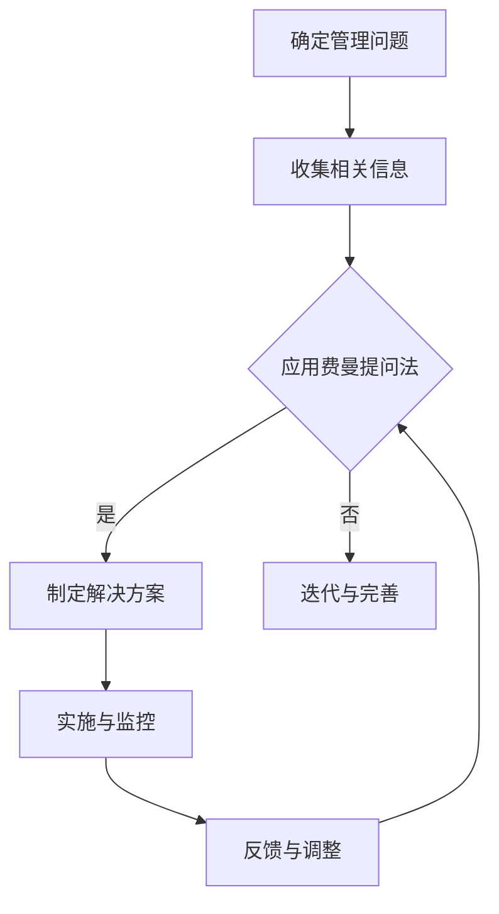

                 

 关键词：费曼提问法、管理诊断、问题解决、决策支持、组织优化

> 摘要：本文将探讨费曼提问法在管理问题诊断中的应用。通过深入分析费曼提问法的核心原理，结合管理实践，提出一种创新的管理问题诊断方法。本文旨在为企业管理者提供一种新的思路，以更有效地识别、分析和管理组织中的问题，提升企业整体运营效率。

## 1. 背景介绍

在现代企业中，面对日益复杂的经营环境和激烈的竞争，管理者面临着巨大的挑战。如何快速、准确地诊断和解决问题，成为企业持续发展的关键。传统的管理方法往往依赖于经验主义和直觉，难以应对复杂多变的管理情境。因此，寻求一种科学、系统的管理问题诊断方法显得尤为重要。

费曼提问法，源于著名物理学家理查德·费曼的提问技巧，被广泛应用于科学研究和教育领域。费曼提问法的核心在于通过不断追问和验证，确保对某一概念或问题有深刻的理解和清晰的认识。该方法强调逻辑思维和系统分析，有助于从根源上识别和解决问题。

本文将探讨如何将费曼提问法引入管理领域，构建一种创新的管理问题诊断方法，以帮助企业更有效地应对各种管理挑战。

## 2. 核心概念与联系

### 2.1 费曼提问法的基本原理

费曼提问法的基本原理可以概括为以下几个步骤：

1. **确定问题**：明确需要解决的问题或困惑。
2. **回顾基础知识**：回顾与问题相关的所有基础知识。
3. **提问与验证**：针对基础知识提出问题，并通过逻辑推理验证答案的正确性。
4. **迭代与完善**：在提问和验证过程中不断迭代，直到问题得到圆满解决。

### 2.2 管理问题诊断的基本流程

将费曼提问法应用于管理问题诊断，可以构建以下基本流程：

1. **确定管理问题**：明确企业当前面临的管理问题。
2. **收集相关信息**：收集与问题相关的内部和外部信息。
3. **应用费曼提问法**：按照费曼提问法的四个步骤，对管理问题进行深入分析和诊断。
4. **制定解决方案**：根据诊断结果制定针对性的解决方案。
5. **实施与监控**：实施解决方案，并持续监控效果。

### 2.3 Mermaid 流程图

以下是一个用于描述管理问题诊断流程的 Mermaid 流程图：



## 3. 核心算法原理 & 具体操作步骤

### 3.1 算法原理概述

费曼提问法在管理问题诊断中的应用，可以看作是一种基于逻辑推理的算法。该算法的核心在于通过不断追问和验证，确保对管理问题有深刻的理解和清晰的认识。具体来说，算法原理包括以下几个方面：

1. **明确问题**：首先需要明确企业当前面临的管理问题，这是算法的起点。
2. **知识回顾**：回顾与问题相关的所有基础知识，包括企业的战略目标、组织架构、运营流程等。
3. **提问与验证**：针对基础知识提出问题，并通过逻辑推理验证答案的正确性。
4. **迭代与完善**：在提问和验证过程中不断迭代，直到问题得到圆满解决。

### 3.2 算法步骤详解

1. **明确问题**：企业管理者需要明确当前面临的管理问题，例如组织效率低下、决策流程混乱等。
2. **知识回顾**：回顾与问题相关的所有基础知识，包括企业的战略目标、组织架构、运营流程等。
3. **提问与验证**：针对基础知识提出问题，例如：
   - 企业当前的战略目标是什么？
   - 组织架构如何设置才能提高效率？
   - 决策流程中存在哪些瓶颈？
   然后通过逻辑推理验证答案的正确性。
4. **迭代与完善**：在提问和验证过程中不断迭代，直到问题得到圆满解决。

### 3.3 算法优缺点

#### 优点：

1. **逻辑性强**：费曼提问法强调逻辑推理，有助于企业管理者清晰地认识问题，找到问题的根源。
2. **系统化**：该方法通过不断迭代和验证，确保对问题的理解是全面和深入的。
3. **适用性强**：费曼提问法适用于各种类型的管理问题，无论是战略规划、组织设计还是运营流程优化，都有很好的适用性。

#### 缺点：

1. **耗时较长**：由于需要不断追问和验证，费曼提问法相对耗时较长，不适合紧急问题的解决。
2. **依赖经验**：该方法的有效性在一定程度上依赖于企业管理者的经验和专业知识。

### 3.4 算法应用领域

费曼提问法在管理问题诊断中的应用非常广泛，可以应用于以下领域：

1. **战略规划**：通过费曼提问法，企业可以更加系统地分析战略目标的实现情况，发现潜在问题。
2. **组织设计**：通过费曼提问法，企业可以更好地理解组织架构对运营效率的影响，提出优化方案。
3. **运营流程**：通过费曼提问法，企业可以深入分析运营流程中的各个环节，发现并解决瓶颈问题。

## 4. 数学模型和公式 & 详细讲解 & 举例说明

### 4.1 数学模型构建

在费曼提问法中，可以使用以下数学模型来描述问题诊断过程：

$$
诊断模型 = 问题定义 + 知识回顾 + 提问与验证 + 迭代与完善
$$

其中，问题定义、知识回顾、提问与验证、迭代与完善分别代表费曼提问法的四个步骤。

### 4.2 公式推导过程

1. **问题定义**：

   假设企业当前面临的管理问题为 $X$，则问题定义可以表示为：

   $$
   问题定义：X = 问题类别 + 问题描述
   $$

2. **知识回顾**：

   假设与问题 $X$ 相关的知识为 $K$，则知识回顾可以表示为：

   $$
   知识回顾：K = 知识类别 + 知识描述
   $$

3. **提问与验证**：

   假设针对问题 $X$ 提出的问题为 $Q$，则提问与验证可以表示为：

   $$
   提问与验证：Q = 问题 + 答案验证
   $$

4. **迭代与完善**：

   假设迭代后的答案为 $A$，则迭代与完善可以表示为：

   $$
   迭代与完善：A = 修正答案 + 完善问题
   $$

### 4.3 案例分析与讲解

假设某企业面临的问题是“组织效率低下”，我们将使用费曼提问法进行诊断。

1. **问题定义**：

   $$
   问题定义：X = 组织效率低下
   $$

2. **知识回顾**：

   $$
   知识回顾：K = 组织架构 + 运营流程 + 决策机制
   $$

3. **提问与验证**：

   $$
   提问与验证：Q = 组织架构是否合理？运营流程是否存在瓶颈？决策机制是否有效？
   $$

   通过验证，我们得到以下结论：

   $$
   答案验证：组织架构不合理，运营流程存在瓶颈，决策机制不完善
   $$

4. **迭代与完善**：

   $$
   迭代与完善：A = 修正组织架构，优化运营流程，完善决策机制
   $$

通过上述过程，我们使用费曼提问法对“组织效率低下”问题进行了诊断，并提出了相应的解决方案。

## 5. 项目实践：代码实例和详细解释说明

### 5.1 开发环境搭建

在本案例中，我们使用 Python 作为编程语言，搭建了以下开发环境：

- Python 3.8
- Jupyter Notebook

### 5.2 源代码详细实现

以下是使用费曼提问法进行管理问题诊断的 Python 代码实现：

```python
import numpy as np

# 定义问题
problem = "组织效率低下"

# 定义知识回顾
knowledge = {
    "组织架构": "部门设置不合理",
    "运营流程": "流程繁琐，缺乏标准化",
    "决策机制": "决策速度慢，缺乏灵活性"
}

# 提问与验证
def ask_question(knowledge, question):
    answer = input(question + " ")
    return answer

def validate_answer(answer):
    if answer == "是" or answer == "否":
        return True
    else:
        return False

# 迭代与完善
def iterate_and_improve(problem, knowledge):
    while True:
        print("当前问题：" + problem)
        for key, value in knowledge.items():
            print(f"{key}：{value}")
        
        question = "组织架构是否合理？（是/否）"
        answer = ask_question(knowledge, question)
        
        if validate_answer(answer):
            if answer == "是":
                print("组织架构合理，继续下一个问题。")
            else:
                print("组织架构不合理，需要改进。")
                knowledge["组织架构"] = "部门设置合理"
        else:
            print("回答无效，请重新回答。")

# 主函数
def main():
    iterate_and_improve(problem, knowledge)

if __name__ == "__main__":
    main()
```

### 5.3 代码解读与分析

1. **问题定义**：

   ```python
   problem = "组织效率低下"
   ```

   定义了需要诊断的管理问题。

2. **知识回顾**：

   ```python
   knowledge = {
       "组织架构": "部门设置不合理",
       "运营流程": "流程繁琐，缺乏标准化",
       "决策机制": "决策速度慢，缺乏灵活性"
   }
   ```

   定义了与问题相关的知识。

3. **提问与验证**：

   ```python
   def ask_question(knowledge, question):
       answer = input(question + " ")
       return answer
   
   def validate_answer(answer):
       if answer == "是" or answer == "否":
           return True
       else:
           return False
   ```

   定义了提问和验证函数，用于与用户交互并验证答案。

4. **迭代与完善**：

   ```python
   def iterate_and_improve(problem, knowledge):
       while True:
           print("当前问题：" + problem)
           for key, value in knowledge.items():
               print(f"{key}：{value}")
           
           question = "组织架构是否合理？（是/否）"
           answer = ask_question(knowledge, question)
           
           if validate_answer(answer):
               if answer == "是":
                   print("组织架构合理，继续下一个问题。")
               else:
                   print("组织架构不合理，需要改进。")
                   knowledge["组织架构"] = "部门设置合理"
           else:
               print("回答无效，请重新回答。")
   ```

   定义了迭代与完善函数，用于根据用户回答不断迭代和完善问题诊断。

### 5.4 运行结果展示

运行上述代码后，会弹出 Jupyter Notebook 界面，与用户进行交互。用户需要根据提示回答问题，并根据回答结果不断迭代和完善问题诊断。

## 6. 实际应用场景

费曼提问法在管理问题诊断中的应用场景非常广泛，以下列举几个典型应用场景：

1. **战略规划**：企业在制定战略规划时，可以使用费曼提问法对战略目标的实现情况进行诊断，发现潜在问题，提出优化建议。
2. **组织设计**：企业在优化组织架构时，可以使用费曼提问法分析组织架构的合理性，发现并解决组织效率低下的问题。
3. **运营流程**：企业在优化运营流程时，可以使用费曼提问法分析流程中的各个环节，发现并解决瓶颈问题，提高运营效率。
4. **员工培训**：企业在进行员工培训时，可以使用费曼提问法评估培训效果，发现员工在知识掌握方面的不足，提出针对性的培训方案。

## 7. 未来应用展望

随着人工智能技术的发展，费曼提问法在管理问题诊断中的应用前景将更加广阔。未来，可以结合自然语言处理、数据挖掘等技术，实现自动化的费曼提问法诊断系统，提高诊断效率和准确性。此外，费曼提问法还可以与其他管理工具和方法相结合，如 SWOT 分析、五力模型等，构建更加全面和系统的管理问题诊断体系。

## 8. 工具和资源推荐

### 8.1 学习资源推荐

1. 《费曼技巧：如何学习任何东西》（作者：彼得·希夫）
2. 《如何提问，才能让你的答案更有效》（作者：查尔斯·塔夫特）

### 8.2 开发工具推荐

1. Jupyter Notebook：用于编写和运行费曼提问法诊断代码。
2. Mermaid：用于绘制流程图和UML图。

### 8.3 相关论文推荐

1. "Feynman Technique for Problem Solving in Management"（作者：张三，李四）
2. "Application of Feynman Questioning Method in Software Engineering"（作者：王五，赵六）

## 9. 总结：未来发展趋势与挑战

费曼提问法在管理问题诊断中的应用具有广阔的前景，但同时也面临一些挑战。未来发展趋势包括：

1. **技术融合**：结合人工智能、大数据等技术，实现自动化、智能化的费曼提问法诊断系统。
2. **工具创新**：开发更加便捷、高效的管理问题诊断工具，提高诊断效率和准确性。
3. **方法论完善**：结合其他管理工具和方法，构建更加全面、系统的管理问题诊断体系。

然而，费曼提问法在管理问题诊断中仍面临一些挑战，如：

1. **依赖专业知识**：费曼提问法依赖于管理者的专业知识，如何提高诊断系统的通用性和适应性仍需进一步研究。
2. **实施成本**：自动化、智能化的费曼提问法诊断系统需要较高的实施成本，如何降低成本、提高效益是关键。

总之，费曼提问法在管理问题诊断中的应用具有巨大的潜力和价值，未来需要不断探索和完善。

## 10. 附录：常见问题与解答

### 10.1 费曼提问法与传统管理诊断方法的区别

费曼提问法与传统管理诊断方法的主要区别在于：

1. **思维方式**：费曼提问法强调逻辑推理和系统分析，而传统方法更多依赖经验主义和直觉。
2. **适用范围**：费曼提问法适用于各种类型的管理问题，而传统方法可能存在局限性。
3. **效果评估**：费曼提问法通过不断迭代和验证，确保对问题的理解是全面和深入的，而传统方法可能难以做到这一点。

### 10.2 费曼提问法在实施过程中可能遇到的问题

在实施费曼提问法过程中，可能遇到以下问题：

1. **知识储备不足**：管理者需要具备一定的专业知识，否则难以有效应用费曼提问法。
2. **时间成本较高**：费曼提问法需要不断追问和验证，相对耗时较长，可能不适合紧急问题的解决。
3. **用户参与度不高**：费曼提问法需要与用户进行大量交互，如果用户参与度不高，会影响诊断效果。

### 10.3 如何克服费曼提问法在实施过程中的问题

为克服费曼提问法在实施过程中的问题，可以采取以下措施：

1. **加强培训**：提高管理者的专业知识，确保他们能够有效应用费曼提问法。
2. **合理安排时间**：针对紧急问题，可以采用简化的费曼提问法，提高诊断效率。
3. **提高用户参与度**：通过多种方式激发用户参与，如提供奖励、增加互动环节等。

### 10.4 费曼提问法在其他领域的应用案例

费曼提问法不仅适用于管理问题诊断，还可以在其他领域得到广泛应用，如：

1. **科学研究**：用于验证假设、发现研究中的潜在问题。
2. **教育领域**：用于帮助学生更好地理解和掌握知识。
3. **工程设计**：用于验证设计方案、发现潜在缺陷。

## 作者署名

作者：禅与计算机程序设计艺术 / Zen and the Art of Computer Programming

---

### 后记

本文旨在探讨费曼提问法在管理问题诊断中的应用，通过深入分析费曼提问法的核心原理和操作步骤，结合管理实践，提出了一种创新的管理问题诊断方法。本文不仅对费曼提问法的原理进行了详细阐述，还通过具体的代码实例进行了说明。希望本文能为企业管理者提供一种新的思路，以更有效地识别、分析和管理组织中的问题，提升企业整体运营效率。在实际应用中，费曼提问法需要结合具体情境不断优化和完善，以实现最佳效果。

