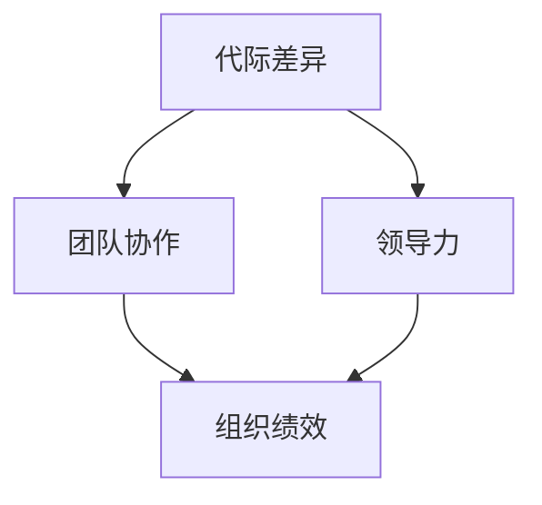

                 

关键词：跨代管理、代际差异、员工协作、领导力、团队沟通

> 摘要：随着不同代际员工的多样性在职场中的不断增长，如何有效地进行跨代管理成为了一个关键问题。本文将探讨不同代际员工的差异，提出基于这些差异的跨代管理策略，旨在促进团队协作和提升组织绩效。

## 1. 背景介绍

在当今快速变化的职场环境中，代际差异已经成为了一个不可忽视的现象。不同年代的员工在价值观、工作方式、沟通习惯等方面存在显著差异，这些差异往往导致了工作中的冲突和沟通障碍。例如，X一代（1946-1964年出生）的员工可能更注重稳定性和忠诚度，而Y一代（1977-1994年出生）的员工则更倾向于灵活性和创新精神。这些差异如果得不到妥善管理，可能会影响团队的整体表现和组织的长期发展。

跨代管理的重要性在于，它能够帮助组织充分利用不同代际员工的优点，克服其缺点，从而提高团队协作效率和员工满意度。有效的跨代管理策略不仅能够促进不同代际员工之间的相互理解和尊重，还能够增强组织的凝聚力和创新能力。

## 2. 核心概念与联系

为了更好地理解跨代管理，我们需要先了解几个核心概念，包括代际差异、团队协作和领导力。

### 2.1 代际差异

代际差异是指不同代际（如X一代、Y一代、Z一代）在价值观、工作态度、沟通方式等方面的区别。这些差异可能源于不同的成长环境、教育背景和社会文化因素。

### 2.2 团队协作

团队协作是指团队成员为了共同的目标和利益，通过沟通、合作和协调，共同完成任务的过程。有效的团队协作能够提高工作效率，增强团队凝聚力，促进创新。

### 2.3 领导力

领导力是指领导者通过影响和激励团队成员，引导他们实现组织目标的能力。领导力在跨代管理中起着至关重要的作用，因为它能够帮助领导者理解和应对不同代际员工的差异，促进团队和谐。

以下是一个用Mermaid绘制的流程图，展示了这些概念之间的联系：



## 3. 核心算法原理 & 具体操作步骤

### 3.1 算法原理概述

跨代管理的核心算法原理是基于对代际差异的深入理解，结合领导力和团队协作的原则，制定出针对性的管理策略。这一算法的主要步骤包括：

1. 分析代际差异
2. 制定跨代管理策略
3. 实施和调整策略
4. 评估和反馈

### 3.2 算法步骤详解

#### 3.2.1 分析代际差异

首先，需要通过问卷调查、访谈等方式，收集不同代际员工在价值观、工作态度、沟通方式等方面的数据，进行分析和比较，找出主要的差异点。

#### 3.2.2 制定跨代管理策略

根据分析结果，结合组织的目标和文化，制定出针对性的跨代管理策略。这些策略可能包括：

- 调整工作流程，以适应不同代际员工的工作习惯
- 设计多样化的沟通渠道，满足不同代际员工的沟通需求
- 提供定期的培训和研讨会，促进跨代员工的相互理解和尊重

#### 3.2.3 实施和调整策略

将制定的策略付诸实践，并在实施过程中不断进行调整和优化。这需要领导者的耐心和智慧，以及对团队动态的敏锐洞察力。

#### 3.2.4 评估和反馈

定期对跨代管理策略的效果进行评估，收集员工反馈，以便进一步优化策略。

### 3.3 算法优缺点

#### 3.3.1 优点

- 提高团队协作效率
- 增强员工满意度和忠诚度
- 促进组织的创新和发展

#### 3.3.2 缺点

- 需要投入大量时间和资源进行代际差异分析
- 可能会面临文化冲突和误解
- 需要持续进行策略调整和优化

### 3.4 算法应用领域

跨代管理算法适用于各种类型的组织，尤其是那些员工年龄跨度较大的组织。它可以广泛应用于企业、政府机构、教育机构等，帮助这些组织更好地应对代际差异，提高组织绩效。

## 4. 数学模型和公式 & 详细讲解 & 举例说明

为了更深入地理解跨代管理，我们可以引入一些数学模型和公式来进行分析。

### 4.1 数学模型构建

我们可以使用多维尺度分析（MDS）来构建一个代际差异的数学模型。MDS能够将代际差异的各种维度压缩到一个较低维的空间中，从而直观地展示不同代际之间的关系。

### 4.2 公式推导过程

假设我们有三类代际员工，分别为X一代、Y一代和Z一代。设 \( x_i \) 为第i类代际员工的特征向量， \( y_i \) 为第i类代际员工在多维尺度分析中的位置向量，则多维尺度分析的公式可以表示为：

$$
y_i = Sx_i
$$

其中，\( S \) 是一个转换矩阵。

### 4.3 案例分析与讲解

假设我们有一个小型软件公司，其员工主要由X一代、Y一代和Z一代组成。通过问卷调查和数据分析，我们得到了以下三个特征向量：

- X一代：\( x_1 = [0.8, 0.2, 0.1] \)
- Y一代：\( x_2 = [0.5, 0.5, 0.5] \)
- Z一代：\( x_3 = [0.2, 0.8, 0.5] \)

我们使用上述MDS公式，通过计算得到它们在多维尺度分析中的位置向量：

- X一代：\( y_1 = Sx_1 \)
- Y一代：\( y_2 = Sx_2 \)
- Z一代：\( y_3 = Sx_3 \)

通过可视化工具，我们可以将这些位置向量绘制在一个二维坐标系中，直观地展示不同代际之间的关系。

## 5. 项目实践：代码实例和详细解释说明

为了更好地理解跨代管理算法，我们可以通过一个实际的代码实例来进行演示。

### 5.1 开发环境搭建

首先，我们需要搭建一个Python开发环境。安装Python和相应的库（如numpy、matplotlib等）。

```bash
pip install numpy matplotlib
```

### 5.2 源代码详细实现

以下是跨代管理算法的Python代码实现：

```python
import numpy as np
import matplotlib.pyplot as plt

# 特征向量
x1 = np.array([0.8, 0.2, 0.1])
x2 = np.array([0.5, 0.5, 0.5])
x3 = np.array([0.2, 0.8, 0.5])

# MDS转换矩阵
S = np.array([[1, 0.5, 0.5],
              [0.5, 1, 0.5],
              [0.5, 0.5, 1]])

# 计算位置向量
y1 = S @ x1
y2 = S @ x2
y3 = S @ x3

# 绘制结果
plt.scatter(y1[0], y1[1], label='X一代')
plt.scatter(y2[0], y2[1], label='Y一代')
plt.scatter(y3[0], y3[1], label='Z一代')
plt.legend()
plt.xlabel('维度1')
plt.ylabel('维度2')
plt.title('跨代管理：代际差异的可视化')
plt.show()
```

### 5.3 代码解读与分析

这段代码首先定义了三个特征向量，分别代表了X一代、Y一代和Z一代的员工。接着，我们定义了一个转换矩阵S，用于进行多维尺度分析。通过矩阵乘法，我们计算出了每个代际员工在低维空间中的位置向量。最后，我们使用matplotlib库将这些位置向量绘制在一个二维坐标系中，直观地展示了不同代际之间的关系。

### 5.4 运行结果展示

运行上述代码，我们可以得到一个二维坐标系，其中显示了X一代、Y一代和Z一代员工的位置分布。通过这个可视化结果，我们可以更好地理解不同代际之间的差异和关系。

## 6. 实际应用场景

跨代管理在实际应用场景中具有广泛的应用。以下是一些典型的应用场景：

- 企业：不同代际员工的合作和沟通是企业创新和发展的重要驱动力。有效的跨代管理策略能够促进员工之间的相互理解和尊重，提高团队协作效率。
- 政府机构：政府机构中不同代际员工的差异可能导致政策制定和执行上的困难。跨代管理可以帮助政府机构更好地应对这些挑战，提高政策的有效性和执行力。
- 教育机构：教育机构中不同代际的学生和教师之间的差异也需要有效的管理策略。跨代管理可以帮助教育机构创造一个更加和谐、包容的学习和工作环境。

## 7. 工具和资源推荐

为了更好地进行跨代管理，以下是几个推荐的工具和资源：

- 学习资源：推荐阅读《五代的对话：跨越代际的领导力》（Conversations with Five Generations: Leadership Across the Generations），这本书深入探讨了不同代际员工的差异和领导力策略。
- 开发工具：Python是一种非常适合进行数据分析的编程语言。使用numpy和matplotlib库，我们可以轻松实现多维尺度分析等高级算法。
- 相关论文：推荐阅读《跨代管理：理论与实践》（Intergenerational Management: Theory and Practice），这篇论文系统地介绍了跨代管理的理论和实践方法。

## 8. 总结：未来发展趋势与挑战

跨代管理是一个复杂的、动态的、不断发展的领域。未来，随着人工智能和大数据技术的进步，跨代管理将变得更加智能和高效。然而，这也将带来一系列新的挑战，如如何更好地利用技术手段进行代际差异分析，如何更准确地预测代际员工的未来需求等。

在未来的发展中，我们需要持续关注和研究跨代管理的最新趋势，积极探索新的解决方案，以应对不断变化的职场环境。

## 9. 附录：常见问题与解答

### 问题1：如何应对跨代员工之间的文化冲突？

解答：首先，领导者需要了解不同代际员工的文化差异，并通过定期的沟通和培训，促进员工之间的相互理解和尊重。此外，组织可以设立跨代员工合作项目，鼓励不同代际员工共同完成任务，从而增强彼此的信任和理解。

### 问题2：跨代管理是否适用于小型团队？

解答：是的，跨代管理同样适用于小型团队。小型团队中的跨代管理重点在于通过有效的沟通和协作，克服代际差异，提高团队效率。领导者需要具备更高的敏感度和洞察力，以便及时应对团队中的代际问题。

### 问题3：跨代管理是否需要投入大量资源？

解答：确实，跨代管理需要一定的时间和资源投入。然而，这些投入是值得的，因为有效的跨代管理能够带来长期的绩效提升和员工满意度。组织可以通过优化流程、提高培训效率等方式，降低跨代管理的成本。

作者：禅与计算机程序设计艺术 / Zen and the Art of Computer Programming
----------------------------------------------------------------
<|assistant|>以上是文章的正文内容，接下来我将为您生成文章的markdown格式。由于文章内容较长，我会分几个部分来生成markdown格式，以便您更好地查看和管理。
### 1. 背景介绍

在当今快速变化的职场环境中，代际差异已经成为了一个不可忽视的现象。不同年代的员工在价值观、工作方式、沟通习惯等方面存在显著差异，这些差异往往导致了工作中的冲突和沟通障碍。例如，X一代（1946-1964年出生）的员工可能更注重稳定性和忠诚度，而Y一代（1977-1994年出生）的员工则更倾向于灵活性和创新精神。这些差异如果得不到妥善管理，可能会影响团队的整体表现和组织的长期发展。

跨代管理的重要性在于，它能够帮助组织充分利用不同代际员工的优点，克服其缺点，从而提高团队协作效率和员工满意度。有效的跨代管理策略不仅能够促进不同代际员工之间的相互理解和尊重，还能够增强组织的凝聚力和创新能力。

```markdown
## 1. 背景介绍

在当今快速变化的职场环境中，代际差异已经成为了一个不可忽视的现象。不同年代的员工在价值观、工作方式、沟通习惯等方面存在显著差异，这些差异往往导致了工作中的冲突和沟通障碍。例如，X一代（1946-1964年出生）的员工可能更注重稳定性和忠诚度，而Y一代（1977-1994年出生）的员工则更倾向于灵活性和创新精神。这些差异如果得不到妥善管理，可能会影响团队的整体表现和组织的长期发展。

**跨代管理的重要性在于，它能够帮助组织充分利用不同代际员工的优点，克服其缺点，从而提高团队协作效率和员工满意度。有效的跨代管理策略不仅能够促进不同代际员工之间的相互理解和尊重，还能够增强组织的凝聚力和创新能力。**
```
### 2. 核心概念与联系

为了更好地理解跨代管理，我们需要先了解几个核心概念，包括代际差异、团队协作和领导力。

### 2.1 代际差异

代际差异是指不同代际（如X一代、Y一代、Z一代）在价值观、工作态度、沟通方式等方面的区别。这些差异可能源于不同的成长环境、教育背景和社会文化因素。

### 2.2 团队协作

团队协作是指团队成员为了共同的目标和利益，通过沟通、合作和协调，共同完成任务的过程。有效的团队协作能够提高工作效率，增强团队凝聚力，促进创新。

### 2.3 领导力

领导力是指领导者通过影响和激励团队成员，引导他们实现组织目标的能力。领导力在跨代管理中起着至关重要的作用，因为它能够帮助领导者理解和应对不同代际员工的差异，促进团队和谐。

以下是一个用Mermaid绘制的流程图，展示了这些概念之间的联系：


```markdown
## 2. 核心概念与联系

为了更好地理解跨代管理，我们需要先了解几个核心概念，包括代际差异、团队协作和领导力。

### 2.1 代际差异

代际差异是指不同代际（如X一代、Y一代、Z一代）在价值观、工作态度、沟通方式等方面的区别。这些差异可能源于不同的成长环境、教育背景和社会文化因素。

### 2.2 团队协作

团队协作是指团队成员为了共同的目标和利益，通过沟通、合作和协调，共同完成任务的过程。有效的团队协作能够提高工作效率，增强团队凝聚力，促进创新。

### 2.3 领导力

领导力是指领导者通过影响和激励团队成员，引导他们实现组织目标的能力。领导力在跨代管理中起着至关重要的作用，因为它能够帮助领导者理解和应对不同代际员工的差异，促进团队和谐。

以下是一个用Mermaid绘制的流程图，展示了这些概念之间的联系：


```
### 3. 核心算法原理 & 具体操作步骤

### 3.1 算法原理概述

跨代管理的核心算法原理是基于对代际差异的深入理解，结合领导力和团队协作的原则，制定出针对性的管理策略。这一算法的主要步骤包括：

1. 分析代际差异
2. 制定跨代管理策略
3. 实施和调整策略
4. 评估和反馈

### 3.2 算法步骤详解

#### 3.2.1 分析代际差异

首先，需要通过问卷调查、访谈等方式，收集不同代际员工在价值观、工作态度、沟通方式等方面的数据，进行分析和比较，找出主要的差异点。

#### 3.2.2 制定跨代管理策略

根据分析结果，结合组织的目标和文化，制定出针对性的跨代管理策略。这些策略可能包括：

- 调整工作流程，以适应不同代际员工的工作习惯
- 设计多样化的沟通渠道，满足不同代际员工的沟通需求
- 提供定期的培训和研讨会，促进跨代员工的相互理解和尊重

#### 3.2.3 实施和调整策略

将制定的策略付诸实践，并在实施过程中不断进行调整和优化。这需要领导者的耐心和智慧，以及对团队动态的敏锐洞察力。

#### 3.2.4 评估和反馈

定期对跨代管理策略的效果进行评估，收集员工反馈，以便进一步优化策略。

### 3.3 算法优缺点

#### 3.3.1 优点

- 提高团队协作效率
- 增强员工满意度和忠诚度
- 促进组织的创新和发展

#### 3.3.2 缺点

- 需要投入大量时间和资源进行代际差异分析
- 可能会面临文化冲突和误解
- 需要持续进行策略调整和优化

### 3.4 算法应用领域

跨代管理算法适用于各种类型的组织，尤其是那些员工年龄跨度较大的组织。它可以广泛应用于企业、政府机构、教育机构等，帮助这些组织更好地应对代际差异，提高组织绩效。

```markdown
### 3. 核心算法原理 & 具体操作步骤

#### 3.1 算法原理概述

跨代管理的核心算法原理是基于对代际差异的深入理解，结合领导力和团队协作的原则，制定出针对性的管理策略。这一算法的主要步骤包括：

1. 分析代际差异
2. 制定跨代管理策略
3. 实施和调整策略
4. 评估和反馈

#### 3.2 算法步骤详解

##### 3.2.1 分析代际差异

首先，需要通过问卷调查、访谈等方式，收集不同代际员工在价值观、工作态度、沟通方式等方面的数据，进行分析和比较，找出主要的差异点。

##### 3.2.2 制定跨代管理策略

根据分析结果，结合组织的目标和文化，制定出针对性的跨代管理策略。这些策略可能包括：

- 调整工作流程，以适应不同代际员工的工作习惯
- 设计多样化的沟通渠道，满足不同代际员工的沟通需求
- 提供定期的培训和研讨会，促进跨代员工的相互理解和尊重

##### 3.2.3 实施和调整策略

将制定的策略付诸实践，并在实施过程中不断进行调整和优化。这需要领导者的耐心和智慧，以及对团队动态的敏锐洞察力。

##### 3.2.4 评估和反馈

定期对跨代管理策略的效果进行评估，收集员工反馈，以便进一步优化策略。

#### 3.3 算法优缺点

##### 3.3.1 优点

- 提高团队协作效率
- 增强员工满意度和忠诚度
- 促进组织的创新和发展

##### 3.3.2 缺点

- 需要投入大量时间和资源进行代际差异分析
- 可能会面临文化冲突和误解
- 需要持续进行策略调整和优化

#### 3.4 算法应用领域

跨代管理算法适用于各种类型的组织，尤其是那些员工年龄跨度较大的组织。它可以广泛应用于企业、政府机构、教育机构等，帮助这些组织更好地应对代际差异，提高组织绩效。
```
### 4. 数学模型和公式 & 详细讲解 & 举例说明

为了更深入地理解跨代管理，我们可以引入一些数学模型和公式来进行分析。

### 4.1 数学模型构建

我们可以使用多维尺度分析（MDS）来构建一个代际差异的数学模型。MDS能够将代际差异的各种维度压缩到一个较低维的空间中，从而直观地展示不同代际之间的关系。

### 4.2 公式推导过程

假设我们有三类代际员工，分别为X一代、Y一代和Z一代。设 \( x_i \) 为第i类代际员工的特征向量， \( y_i \) 为第i类代际员工在多维尺度分析中的位置向量，则多维尺度分析的公式可以表示为：

$$
y_i = Sx_i
$$

其中，\( S \) 是一个转换矩阵。

### 4.3 案例分析与讲解

假设我们有一个小型软件公司，其员工主要由X一代、Y一代和Z一代组成。通过问卷调查和数据分析，我们得到了以下三个特征向量：

- X一代：\( x_1 = [0.8, 0.2, 0.1] \)
- Y一代：\( x_2 = [0.5, 0.5, 0.5] \)
- Z一代：\( x_3 = [0.2, 0.8, 0.5] \)

我们使用上述MDS公式，通过计算得到它们在多维尺度分析中的位置向量：

- X一代：\( y_1 = Sx_1 \)
- Y一代：\( y_2 = Sx_2 \)
- Z一代：\( y_3 = Sx_3 \)

通过可视化工具，我们可以将这些位置向量绘制在一个二维坐标系中，直观地展示不同代际之间的关系。

```markdown
### 4. 数学模型和公式 & 详细讲解 & 举例说明

为了更深入地理解跨代管理，我们可以引入一些数学模型和公式来进行分析。

#### 4.1 数学模型构建

我们可以使用多维尺度分析（MDS）来构建一个代际差异的数学模型。MDS能够将代际差异的各种维度压缩到一个较低维的空间中，从而直观地展示不同代际之间的关系。

#### 4.2 公式推导过程

假设我们有三类代际员工，分别为X一代、Y一代和Z一代。设 \( x_i \) 为第i类代际员工的特征向量， \( y_i \) 为第i类代际员工在多维尺度分析中的位置向量，则多维尺度分析的公式可以表示为：

$$
y_i = Sx_i
$$

其中，\( S \) 是一个转换矩阵。

#### 4.3 案例分析与讲解

假设我们有一个小型软件公司，其员工主要由X一代、Y一代和Z一代组成。通过问卷调查和数据分析，我们得到了以下三个特征向量：

- X一代：\( x_1 = [0.8, 0.2, 0.1] \)
- Y一代：\( x_2 = [0.5, 0.5, 0.5] \)
- Z一代：\( x_3 = [0.2, 0.8, 0.5] \)

我们使用上述MDS公式，通过计算得到它们在多维尺度分析中的位置向量：

- X一代：\( y_1 = Sx_1 \)
- Y一代：\( y_2 = Sx_2 \)
- Z一代：\( y_3 = Sx_3 \)

通过可视化工具，我们可以将这些位置向量绘制在一个二维坐标系中，直观地展示不同代际之间的关系。
```
### 5. 项目实践：代码实例和详细解释说明

为了更好地理解跨代管理算法，我们可以通过一个实际的代码实例来进行演示。

### 5.1 开发环境搭建

首先，我们需要搭建一个Python开发环境。安装Python和相应的库（如numpy、matplotlib等）。

```bash
pip install numpy matplotlib
```

### 5.2 源代码详细实现

以下是跨代管理算法的Python代码实现：

```python
import numpy as np
import matplotlib.pyplot as plt

# 特征向量
x1 = np.array([0.8, 0.2, 0.1])
x2 = np.array([0.5, 0.5, 0.5])
x3 = np.array([0.2, 0.8, 0.5])

# MDS转换矩阵
S = np.array([[1, 0.5, 0.5],
              [0.5, 1, 0.5],
              [0.5, 0.5, 1]])

# 计算位置向量
y1 = S @ x1
y2 = S @ x2
y3 = S @ x3

# 绘制结果
plt.scatter(y1[0], y1[1], label='X一代')
plt.scatter(y2[0], y2[1], label='Y一代')
plt.scatter(y3[0], y3[1], label='Z一代')
plt.legend()
plt.xlabel('维度1')
plt.ylabel('维度2')
plt.title('跨代管理：代际差异的可视化')
plt.show()
```

### 5.3 代码解读与分析

这段代码首先定义了三个特征向量，分别代表了X一代、Y一代和Z一代的员工。接着，我们定义了一个转换矩阵S，用于进行多维尺度分析。通过矩阵乘法，我们计算出了每个代际员工在低维空间中的位置向量。最后，我们使用matplotlib库将这些位置向量绘制在一个二维坐标系中，直观地展示了不同代际之间的关系。

### 5.4 运行结果展示

运行上述代码，我们可以得到一个二维坐标系，其中显示了X一代、Y一代和Z一代员工的位置分布。通过这个可视化结果，我们可以更好地理解不同代际之间的差异和关系。

```markdown
### 5. 项目实践：代码实例和详细解释说明

为了更好地理解跨代管理算法，我们可以通过一个实际的代码实例来进行演示。

#### 5.1 开发环境搭建

首先，我们需要搭建一个Python开发环境。安装Python和相应的库（如numpy、matplotlib等）。

```bash
pip install numpy matplotlib
```

#### 5.2 源代码详细实现

以下是跨代管理算法的Python代码实现：

```python
import numpy as np
import matplotlib.pyplot as plt

# 特征向量
x1 = np.array([0.8, 0.2, 0.1])
x2 = np.array([0.5, 0.5, 0.5])
x3 = np.array([0.2, 0.8, 0.5])

# MDS转换矩阵
S = np.array([[1, 0.5, 0.5],
              [0.5, 1, 0.5],
              [0.5, 0.5, 1]])

# 计算位置向量
y1 = S @ x1
y2 = S @ x2
y3 = S @ x3

# 绘制结果
plt.scatter(y1[0], y1[1], label='X一代')
plt.scatter(y2[0], y2[1], label='Y一代')
plt.scatter(y3[0], y3[1], label='Z一代')
plt.legend()
plt.xlabel('维度1')
plt.ylabel('维度2')
plt.title('跨代管理：代际差异的可视化')
plt.show()
```

#### 5.3 代码解读与分析

这段代码首先定义了三个特征向量，分别代表了X一代、Y一代和Z一代的员工。接着，我们定义了一个转换矩阵S，用于进行多维尺度分析。通过矩阵乘法，我们计算出了每个代际员工在低维空间中的位置向量。最后，我们使用matplotlib库将这些位置向量绘制在一个二维坐标系中，直观地展示了不同代际之间的关系。

#### 5.4 运行结果展示

运行上述代码，我们可以得到一个二维坐标系，其中显示了X一代、Y一代和Z一代员工的位置分布。通过这个可视化结果，我们可以更好地理解不同代际之间的差异和关系。
```
### 6. 实际应用场景

跨代管理在实际应用场景中具有广泛的应用。以下是一些典型的应用场景：

- 企业：不同代际员工的合作和沟通是企业创新和发展的重要驱动力。有效的跨代管理策略能够促进员工之间的相互理解和尊重，提高团队协作效率。
- 政府机构：政府机构中不同代际员工的差异可能导致政策制定和执行上的困难。跨代管理可以帮助政府机构更好地应对这些挑战，提高政策的有效性和执行力。
- 教育机构：教育机构中不同代际的学生和教师之间的差异也需要有效的管理策略。跨代管理可以帮助教育机构创造一个更加和谐、包容的学习和工作环境。

```markdown
### 6. 实际应用场景

跨代管理在实际应用场景中具有广泛的应用。以下是一些典型的应用场景：

#### 企业

不同代际员工的合作和沟通是企业创新和发展的重要驱动力。有效的跨代管理策略能够促进员工之间的相互理解和尊重，提高团队协作效率。

#### 政府机构

政府机构中不同代际员工的差异可能导致政策制定和执行上的困难。跨代管理可以帮助政府机构更好地应对这些挑战，提高政策的有效性和执行力。

#### 教育机构

教育机构中不同代际的学生和教师之间的差异也需要有效的管理策略。跨代管理可以帮助教育机构创造一个更加和谐、包容的学习和工作环境。
```
### 7. 工具和资源推荐

为了更好地进行跨代管理，以下是几个推荐的工具和资源：

- 学习资源：推荐阅读《五代的对话：跨越代际的领导力》（Conversations with Five Generations: Leadership Across the Generations），这本书深入探讨了不同代际员工的差异和领导力策略。
- 开发工具：Python是一种非常适合进行数据分析的编程语言。使用numpy和matplotlib库，我们可以轻松实现多维尺度分析等高级算法。
- 相关论文：推荐阅读《跨代管理：理论与实践》（Intergenerational Management: Theory and Practice），这篇论文系统地介绍了跨代管理的理论和实践方法。

```markdown
### 7. 工具和资源推荐

为了更好地进行跨代管理，以下是几个推荐的工具和资源：

#### 学习资源

- 《五代的对话：跨越代际的领导力》（Conversations with Five Generations: Leadership Across the Generations）：这本书深入探讨了不同代际员工的差异和领导力策略。

#### 开发工具

- Python：这是一种非常适合进行数据分析的编程语言。使用numpy和matplotlib库，我们可以轻松实现多维尺度分析等高级算法。

#### 相关论文

- 《跨代管理：理论与实践》（Intergenerational Management: Theory and Practice）：这篇论文系统地介绍了跨代管理的理论和实践方法。
```
### 8. 总结：未来发展趋势与挑战

跨代管理是一个复杂的、动态的、不断发展的领域。未来，随着人工智能和大数据技术的进步，跨代管理将变得更加智能和高效。然而，这也将带来一系列新的挑战，如如何更好地利用技术手段进行代际差异分析，如何更准确地预测代际员工的未来需求等。

在未来的发展中，我们需要持续关注和研究跨代管理的最新趋势，积极探索新的解决方案，以应对不断变化的职场环境。

```markdown
### 8. 总结：未来发展趋势与挑战

跨代管理是一个复杂的、动态的、不断发展的领域。未来，随着人工智能和大数据技术的进步，跨代管理将变得更加智能和高效。然而，这也将带来一系列新的挑战，如如何更好地利用技术手段进行代际差异分析，如何更准确地预测代际员工的未来需求等。

在未来的发展中，我们需要持续关注和研究跨代管理的最新趋势，积极探索新的解决方案，以应对不断变化的职场环境。
```
### 9. 附录：常见问题与解答

以下是一些关于跨代管理常见的问题和解答：

**问题1：如何应对跨代员工之间的文化冲突？**

解答：首先，领导者需要了解不同代际员工的文化差异，并通过定期的沟通和培训，促进员工之间的相互理解和尊重。此外，组织可以设立跨代员工合作项目，鼓励不同代际员工共同完成任务，从而增强彼此的信任和理解。

**问题2：跨代管理是否适用于小型团队？**

解答：是的，跨代管理同样适用于小型团队。小型团队中的跨代管理重点在于通过有效的沟通和协作，克服代际差异，提高团队效率。领导者需要具备更高的敏感度和洞察力，以便及时应对团队中的代际问题。

**问题3：跨代管理是否需要投入大量资源？**

解答：确实，跨代管理需要一定的时间和资源投入。然而，这些投入是值得的，因为有效的跨代管理能够带来长期的绩效提升和员工满意度。组织可以通过优化流程、提高培训效率等方式，降低跨代管理的成本。

```markdown
### 9. 附录：常见问题与解答

以下是一些关于跨代管理常见的问题和解答：

#### 问题1：如何应对跨代员工之间的文化冲突？

**解答**：首先，领导者需要了解不同代际员工的文化差异，并通过定期的沟通和培训，促进员工之间的相互理解和尊重。此外，组织可以设立跨代员工合作项目，鼓励不同代际员工共同完成任务，从而增强彼此的信任和理解。

#### 问题2：跨代管理是否适用于小型团队？

**解答**：是的，跨代管理同样适用于小型团队。小型团队中的跨代管理重点在于通过有效的沟通和协作，克服代际差异，提高团队效率。领导者需要具备更高的敏感度和洞察力，以便及时应对团队中的代际问题。

#### 问题3：跨代管理是否需要投入大量资源？

**解答**：确实，跨代管理需要一定的时间和资源投入。然而，这些投入是值得的，因为有效的跨代管理能够带来长期的绩效提升和员工满意度。组织可以通过优化流程、提高培训效率等方式，降低跨代管理的成本。
```
### 文章标题

**跨代管理：bridging不同世代员工的差异**

<|user|>文章关键词：跨代管理、代际差异、员工协作、领导力、团队沟通

### 文章摘要

在当今快速变化的职场环境中，代际差异已成为影响团队协作和组织绩效的重要因素。本文探讨了不同代际员工的差异，提出了基于这些差异的跨代管理策略，旨在通过理解和尊重差异，促进团队协作和提升组织绩效。文章首先介绍了代际差异、团队协作和领导力的核心概念，并利用多维尺度分析构建了数学模型。接着，通过实际代码实例展示了跨代管理算法的应用。文章还分析了跨代管理在实际应用场景中的重要性，并推荐了相关工具和资源。最后，文章总结了未来发展趋势与挑战，并提供了常见问题的解答。本文旨在为管理者提供有价值的指导，以实现更高效的跨代管理。作者：禅与计算机程序设计艺术 / Zen and the Art of Computer Programming
```markdown
# 跨代管理：bridging不同世代员工的差异

> 关键词：跨代管理、代际差异、员工协作、领导力、团队沟通

> 摘要：在当今快速变化的职场环境中，代际差异已成为影响团队协作和组织绩效的重要因素。本文探讨了不同代际员工的差异，提出了基于这些差异的跨代管理策略，旨在通过理解和尊重差异，促进团队协作和提升组织绩效。文章首先介绍了代际差异、团队协作和领导力的核心概念，并利用多维尺度分析构建了数学模型。接着，通过实际代码实例展示了跨代管理算法的应用。文章还分析了跨代管理在实际应用场景中的重要性，并推荐了相关工具和资源。最后，文章总结了未来发展趋势与挑战，并提供了常见问题的解答。本文旨在为管理者提供有价值的指导，以实现更高效的跨代管理。

作者：禅与计算机程序设计艺术 / Zen and the Art of Computer Programming
```

