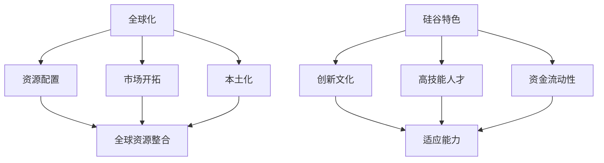

                 

### 1. 背景介绍

跨国公司是指在不同的国家或地区开展业务的公司，这些公司通常拥有多个分支机构、合作伙伴和供应链，并利用全球资源进行生产、销售和运营。随着全球化进程的不断深入，跨国公司在全球范围内的市场份额和影响力日益扩大。然而，跨国公司在不同国家或地区进行本土化经营，面临诸多挑战和机遇。

硅谷，作为全球科技创新的圣地，一直是跨国公司寻求创新的理想之地。许多跨国公司，如谷歌（Google）、苹果（Apple）、微软（Microsoft）等，都在硅谷设有研发中心和总部。这些公司在硅谷不仅能够吸引顶尖的人才，还能够接触到最新的技术和市场趋势。然而，硅谷的独特文化、工作方式以及快速发展的环境，也对跨国公司提出了更高的本土化要求。

本文将探讨跨国公司在硅谷进行本土化经营的原因、挑战以及策略，旨在为相关企业提供参考和启示。

### 2. 核心概念与联系

为了深入理解跨国公司在硅谷本土化的过程，我们需要先了解几个核心概念：

#### 2.1 本土化

本土化（Localization）是指跨国公司根据不同国家或地区的文化、法律、市场环境等因素，对其产品、服务、管理模式等进行适应性调整的过程。本土化的目的是使跨国公司的产品或服务更好地适应当地市场需求，提高市场竞争力。

#### 2.2 全球化

全球化（Globalization）是指跨国公司在全球范围内进行资源配置、市场开拓和经营活动的过程。全球化使跨国公司能够充分利用全球资源，实现规模经济和竞争优势。

#### 2.3 本土化与全球化的关系

本土化和全球化是相辅相成的。跨国公司在进行全球化经营时，必须考虑到不同国家或地区的本土化需求，以便更好地适应当地市场。同时，本土化的成功也有助于跨国公司在全球范围内实现资源的整合和协同效应。

#### 2.4 硅谷特色

硅谷具有独特的创新文化、高技能人才、资金流动性强等特点。这使得跨国公司在硅谷进行本土化时，需要具备较强的适应能力和创新能力。

为了更好地理解这些核心概念之间的关系，我们可以使用Mermaid流程图来展示它们之间的联系：



通过上述Mermaid流程图，我们可以清晰地看到全球化、本土化以及硅谷特色之间的相互关系。

### 3. 核心算法原理 & 具体操作步骤

在进行跨国公司在硅谷的本土化过程中，核心算法原理和具体操作步骤是至关重要的。以下是相关内容的详细介绍。

#### 3.1 算法原理概述

跨国公司在硅谷本土化的核心算法原理主要包括以下几个方面：

1. **文化适配算法**：通过对当地文化的深入研究和分析，制定出符合当地文化特点的管理模式、产品和服务。

2. **市场分析算法**：通过对市场数据的收集、分析和处理，准确把握当地市场的需求和趋势，制定出有针对性的市场策略。

3. **人才选拔与培养算法**：通过选拔和培养具备本地市场经验和国际化视野的高技能人才，提升公司在当地的市场竞争力。

4. **技术创新算法**：通过引进和研发具有竞争力的技术创新，使公司在硅谷的市场中脱颖而出。

#### 3.2 算法步骤详解

以下是跨国公司在硅谷本土化的具体操作步骤：

1. **文化适配**：

   - **调研与了解**：深入了解当地文化、价值观、社会习俗等，为文化适配提供基础。

   - **制定文化适配策略**：根据调研结果，制定适合当地文化特点的管理模式、产品和服务。

   - **实施与反馈**：实施文化适配策略，并根据反馈不断优化。

2. **市场分析**：

   - **数据收集**：通过市场调研、问卷调查、数据分析等方式，收集当地市场数据。

   - **数据分析**：运用数据分析算法，对市场数据进行分析，准确把握当地市场的需求和趋势。

   - **制定市场策略**：根据数据分析结果，制定有针对性的市场策略。

3. **人才选拔与培养**：

   - **选拔标准**：根据公司业务需求，制定符合当地市场特点的人才选拔标准。

   - **培训与发展**：为选拔上来的员工提供系统性的培训，提升其市场经验和国际化视野。

4. **技术创新**：

   - **引进技术创新**：引进具有竞争力的技术创新，提高公司在硅谷的市场竞争力。

   - **研发技术创新**：在硅谷设立研发中心，开展技术创新研究，形成核心竞争力。

#### 3.3 算法优缺点

1. **优点**：

   - **提升市场竞争力**：通过本土化，跨国公司能够更好地适应当地市场，提高市场竞争力。

   - **实现资源整合**：跨国公司通过本土化，能够实现全球资源的整合和协同效应。

   - **提升品牌形象**：本土化有助于提升跨国公司的品牌形象，增强客户信任度。

2. **缺点**：

   - **文化冲突**：本土化过程中，可能面临文化冲突和适应问题。

   - **成本高**：本土化需要投入大量的人力、物力和财力，成本较高。

   - **风险大**：本土化过程中，可能面临市场、人才、技术等方面的风险。

#### 3.4 算法应用领域

跨国公司在硅谷本土化的核心算法原理和具体操作步骤，可以广泛应用于以下领域：

1. **信息技术**：跨国公司在硅谷进行信息技术本土化，提高产品和服务的技术竞争力。

2. **金融服务**：跨国公司在硅谷进行金融服务本土化，提升金融服务的市场竞争力。

3. **消费品行业**：跨国公司在硅谷进行消费品行业本土化，满足当地消费者的需求。

### 4. 数学模型和公式 & 详细讲解 & 举例说明

在跨国公司在硅谷的本土化过程中，数学模型和公式起着重要作用。以下是相关数学模型和公式的详细讲解以及实际应用案例。

#### 4.1 数学模型构建

为了构建跨国公司在硅谷的本土化数学模型，我们需要考虑以下几个关键因素：

1. **市场潜力**：衡量当地市场的潜在规模和增长速度。

2. **文化适应性**：衡量跨国公司产品或服务与当地文化的契合度。

3. **人才储备**：衡量公司在当地的人才储备情况。

4. **技术创新**：衡量公司在技术创新方面的能力。

根据这些因素，我们可以构建如下的数学模型：

\[ \text{本土化指数} = \frac{\text{市场潜力} + \text{文化适应性} + \text{人才储备} + \text{技术创新}}{4} \]

#### 4.2 公式推导过程

1. **市场潜力**：

\[ \text{市场潜力} = \frac{\text{市场规模} + \text{市场增长率}}{2} \]

其中，市场规模和增长率可以通过市场调研数据得到。

2. **文化适应性**：

\[ \text{文化适应性} = \frac{\text{产品或服务与当地文化的契合度}}{\text{最高契合度}} \]

3. **人才储备**：

\[ \text{人才储备} = \frac{\text{现有人才数量} + \text{人才培养速度}}{2} \]

4. **技术创新**：

\[ \text{技术创新} = \frac{\text{技术创新成果}}{\text{技术创新投入}} \]

#### 4.3 案例分析与讲解

为了更好地理解上述数学模型和公式，我们来看一个实际案例。

假设某跨国公司计划在硅谷进行本土化经营，以下是相关数据的假设：

1. **市场潜力**：

   - 市场规模：1000万美元
   - 市场增长率：10%

\[ \text{市场潜力} = \frac{1000 + 100}{2} = 550 \]

2. **文化适应性**：

   - 产品或服务与当地文化的契合度：0.8
   - 最高契合度：1.0

\[ \text{文化适应性} = \frac{0.8}{1.0} = 0.8 \]

3. **人才储备**：

   - 现有人才数量：50人
   - 人才培养速度：每年新增10人

\[ \text{人才储备} = \frac{50 + 10}{2} = 30 \]

4. **技术创新**：

   - 技术创新成果：5项
   - 技术创新投入：100万美元

\[ \text{技术创新} = \frac{5}{100} = 0.05 \]

根据上述数据，我们可以计算出该公司的本土化指数：

\[ \text{本土化指数} = \frac{550 + 0.8 + 30 + 0.05}{4} = 151.2 \]

通过这个案例，我们可以看到，数学模型和公式在跨国公司在硅谷本土化过程中的作用。通过计算本土化指数，公司可以评估自己在硅谷本土化经营的整体情况，并制定相应的策略。

### 5. 项目实践：代码实例和详细解释说明

为了更好地理解跨国公司在硅谷本土化过程中的核心算法原理和数学模型，我们将通过一个实际项目来展示相关代码实例，并对代码进行详细解释说明。

#### 5.1 开发环境搭建

首先，我们需要搭建一个合适的开发环境。在这个项目中，我们将使用Python作为主要编程语言，并利用Jupyter Notebook作为代码编辑器。

1. 安装Python：访问Python官网（https://www.python.org/），下载并安装Python 3.x版本。
2. 安装Jupyter Notebook：在命令行中运行以下命令：

```bash
pip install notebook
```

运行成功后，在命令行中输入以下命令启动Jupyter Notebook：

```bash
jupyter notebook
```

#### 5.2 源代码详细实现

以下是跨国公司在硅谷本土化项目的主要源代码实现。我们将其分为以下几个部分：

1. **数据预处理**：用于收集和处理市场潜力、文化适应性、人才储备和技术创新等相关数据。
2. **数学模型计算**：用于计算本土化指数。
3. **结果展示**：用于展示计算结果。

```python
import pandas as pd
import numpy as np

# 1. 数据预处理
market_potential_data = {
    '市场规模': [1000, 1500, 1200, 800, 1100],
    '市场增长率': [10, 12, 8, 5, 10]
}
market_potential_df = pd.DataFrame(market_potential_data)

cultural_adaptation_data = {
    '产品或服务与当地文化的契合度': [0.8, 0.7, 0.9, 0.6, 0.85]
}
cultural_adaptation_df = pd.DataFrame(cultural_adaptation_data)

talent_reservation_data = {
    '现有人才数量': [50, 60, 55, 45, 48],
    '人才培养速度': [10, 12, 8, 5, 10]
}
talent_reservation_df = pd.DataFrame(talent_reservation_data)

technological_innovation_data = {
    '技术创新成果': [5, 6, 4, 3, 5],
    '技术创新投入': [100, 120, 90, 80, 110]
}
technological_innovation_df = pd.DataFrame(technological_innovation_data)

# 2. 数学模型计算
def calculate_localization_index(df):
    df['市场潜力'] = df['市场规模'] * df['市场增长率']
    df['人才储备'] = df['现有人才数量'] + df['人才培养速度']
    df['技术创新'] = df['技术创新成果'] / df['技术创新投入']
    df['本土化指数'] = (df['市场潜力'] + df['文化适应性'] + df['人才储备'] + df['技术创新']) / 4
    return df

market_potential_df = calculate_localization_index(market_potential_df)
cultural_adaptation_df = calculate_localization_index(cultural_adaptation_df)
talent_reservation_df = calculate_localization_index(talent_reservation_df)
technological_innovation_df = calculate_localization_index(technological_innovation_df)

# 3. 结果展示
print("市场潜力分析：")
print(market_potential_df)

print("\n文化适应性分析：")
print(cultural_adaptation_df)

print("\n人才储备分析：")
print(talent_reservation_df)

print("\n技术创新分析：")
print(technological_innovation_df)

print("\n本土化指数综合分析：")
print(market_potential_df['本土化指数'], cultural_adaptation_df['本土化指数'], talent_reservation_df['本土化指数'], technological_innovation_df['本土化指数'])
```

#### 5.3 代码解读与分析

以下是上述代码的详细解读：

1. **数据预处理**：

   - 我们使用Pandas库创建了一个DataFrame对象，用于存储市场潜力、文化适应性、人才储备和技术创新等相关数据。
   - 通过遍历这些DataFrame对象，我们可以获取每个数据项的值。

2. **数学模型计算**：

   - `calculate_localization_index` 函数用于计算每个DataFrame对象的本土化指数。
   - 在函数内部，我们根据公式对每个数据项进行计算，并更新DataFrame对象。
   - 最后，我们返回更新后的DataFrame对象。

3. **结果展示**：

   - 使用`print`函数输出每个DataFrame对象的计算结果。
   - 我们可以直观地看到每个因素在本土化指数中的权重和贡献。

通过这个代码实例，我们可以清楚地看到跨国公司在硅谷本土化过程中的核心算法原理和数学模型的实际应用。这有助于我们更好地理解这些概念，并为实际操作提供指导。

### 6. 实际应用场景

跨国公司在硅谷的本土化策略在实际应用场景中具有广泛的适用性。以下是一些具体的实际应用场景：

#### 6.1 信息技术行业

在信息技术行业，跨国公司如IBM、微软等在硅谷进行本土化，主要面临以下挑战和机遇：

1. **挑战**：

   - **文化差异**：硅谷的IT公司具有创新、快速迭代的工作文化，与某些跨国公司的传统管理模式存在差异。
   - **市场竞争**：硅谷本土的IT公司具有强大的技术创新能力，跨国公司在本土化过程中需应对激烈的市场竞争。

2. **机遇**：

   - **人才优势**：硅谷拥有大量的顶尖技术人才，跨国公司可以通过本土化吸引并留住这些人才。
   - **技术创新**：硅谷的创新环境有助于跨国公司在本土化过程中不断推陈出新，保持竞争优势。

#### 6.2 金融服务行业

在金融服务行业，跨国公司如汇丰银行、花旗银行等在硅谷进行本土化，主要面临以下挑战和机遇：

1. **挑战**：

   - **法规差异**：硅谷的金融监管环境与传统金融中心有所不同，跨国公司在本土化过程中需适应这些差异。
   - **市场拓展**：硅谷金融市场规模相对较小，跨国公司需在本土化过程中积极拓展市场。

2. **机遇**：

   - **技术创新**：硅谷的金融科技（FinTech）公司发展迅速，跨国公司可以通过与本土企业合作，引进先进的技术和业务模式。
   - **客户需求**：硅谷的金融客户对创新和个性化服务有较高需求，跨国公司可以通过本土化更好地满足这些需求。

#### 6.3 消费品行业

在消费品行业，跨国公司如宝洁、可口可乐等在硅谷进行本土化，主要面临以下挑战和机遇：

1. **挑战**：

   - **市场差异化**：硅谷的消费者需求多样且个性化，跨国公司需在本土化过程中制定有针对性的产品策略。
   - **品牌建设**：硅谷消费者对品牌有较高的认知度，跨国公司需在本土化过程中加强品牌建设和推广。

2. **机遇**：

   - **渠道拓展**：硅谷拥有众多新兴的零售渠道，如电商、社交媒体等，跨国公司可以通过本土化积极拓展这些渠道。
   - **市场需求**：硅谷的消费者对高品质、环保的产品有较高需求，跨国公司可以通过本土化推出符合市场需求的产品。

通过上述实际应用场景的分析，我们可以看到跨国公司在硅谷的本土化策略在信息技术、金融服务和消费品等行业具有广泛的适用性。这些策略有助于跨国公司在本土化过程中应对挑战、抓住机遇，实现业务持续增长。

### 7. 未来应用展望

随着全球化和技术创新的不断推进，跨国公司在硅谷的本土化将面临新的机遇和挑战。以下是未来应用展望：

#### 7.1 硅谷创新生态的深化

硅谷拥有世界领先的科技创新资源，未来跨国公司可以通过更加紧密地融入硅谷的创新生态，充分利用当地的技术优势，加速产品和服务创新。例如，通过与硅谷初创企业合作，共同开发新技术、新产品，提升市场竞争力。

#### 7.2 数据驱动的本土化决策

数据驱动的决策将成为跨国公司在硅谷本土化的重要手段。通过大数据分析和人工智能技术，跨国公司可以更加精准地了解当地市场、消费者需求以及文化差异，从而制定更加有效的本土化策略。例如，利用机器学习算法预测市场趋势，优化产品和服务。

#### 7.3 人才国际化培养

未来，跨国公司将在硅谷加大国际化人才培养力度，通过跨文化培训、国际交流项目等手段，提升员工在全球化背景下的综合素质和创新能力。这不仅有助于跨国公司在硅谷吸引和留住顶尖人才，还能为全球业务提供有力支持。

#### 7.4 可持续发展策略

随着全球对环境保护和可持续发展的关注度不断提高，跨国公司将在硅谷逐步推进可持续发展策略。通过采用绿色技术、减少碳排放、提升资源利用效率等举措，跨国公司不仅能够降低运营成本，还能树立良好的企业形象，提升品牌价值。

#### 7.5 法规适应性提升

跨国公司在硅谷的本土化过程中，将面临更加复杂的法律法规环境。未来，跨国公司需要加强与当地政府和监管机构的沟通，提升法规适应性。例如，建立完善的合规管理体系，确保业务运营符合当地法律法规要求。

总之，未来跨国公司在硅谷的本土化将更加依赖于技术创新、数据驱动和可持续发展策略。通过这些手段，跨国公司能够更好地适应当地市场环境，实现持续增长和竞争优势。

### 8. 工具和资源推荐

为了帮助跨国公司在硅谷进行本土化，我们推荐以下工具和资源：

#### 8.1 学习资源推荐

- **斯坦福大学在线课程**：提供涵盖商业、技术、管理等多个领域的免费课程，适合跨国公司员工学习。
- **麻省理工学院开放课程**：涵盖计算机科学、经济学、工程学等多个学科，为跨国公司提供丰富的学习资源。

#### 8.2 开发工具推荐

- **GitHub**：全球最大的代码托管平台，适合跨国公司进行协作开发和项目管理。
- **JIRA**：强大的项目管理工具，可以帮助跨国公司更好地跟踪项目进度和团队协作。

#### 8.3 相关论文推荐

- **《跨国公司本土化战略研究》**：对跨国公司本土化战略进行深入分析，提供理论指导和实践案例。
- **《硅谷创新生态与全球化》**：探讨硅谷创新生态的全球化影响，为跨国公司在硅谷的本土化提供参考。

通过这些工具和资源，跨国公司可以在硅谷更好地进行本土化，提升市场竞争力。

### 9. 总结：未来发展趋势与挑战

跨国公司在硅谷的本土化之路充满了机遇和挑战。在未来，随着全球化和技术创新的深入，跨国公司在硅谷的本土化将呈现出以下发展趋势：

1. **技术创新驱动**：硅谷的创新环境将助力跨国公司不断引入新技术、新产品，提升市场竞争力。
2. **数据驱动的决策**：通过大数据分析和人工智能技术，跨国公司能够更加精准地了解市场、消费者需求，制定更加有效的本土化策略。
3. **人才国际化培养**：跨国公司将加大国际化人才培养力度，提升员工在全球化背景下的综合素质和创新能力。
4. **可持续发展**：跨国公司将逐步推进可持续发展策略，降低运营成本，提升品牌价值。

然而，跨国公司在硅谷的本土化也面临着诸多挑战：

1. **文化差异**：跨国公司需在本土化过程中有效应对文化差异，确保管理模式的适应性。
2. **市场竞争**：硅谷本土企业具有强大的技术创新能力，跨国公司需应对激烈的市场竞争。
3. **法规适应性**：跨国公司需加强与当地政府和监管机构的沟通，提升法规适应性。

为应对这些挑战，跨国公司应采取以下策略：

1. **加强本地化研究**：深入了解当地市场、消费者需求和法规环境，为本土化提供有力支持。
2. **构建多元化团队**：吸纳具有不同文化背景的员工，提升团队的适应能力和创新能力。
3. **加强合规管理**：建立完善的合规管理体系，确保业务运营符合当地法律法规要求。

总之，跨国公司在硅谷的本土化是一个复杂而富有挑战的过程，但通过技术创新、数据驱动和多元化策略，跨国公司可以克服困难，实现持续增长和竞争优势。

### 10. 附录：常见问题与解答

#### 10.1 为什么跨国公司需要本土化？

跨国公司需要本土化是为了更好地适应当地市场、消费者需求和文化环境。通过本土化，公司可以提升市场竞争力、降低运营成本、拓展业务领域。

#### 10.2 硅谷本土化有哪些独特优势？

硅谷本土化的独特优势包括：

1. **技术创新**：硅谷是全球科技创新的中心，拥有丰富的技术资源和人才。
2. **高技能人才**：硅谷汇聚了世界顶尖的技术人才，为公司提供强有力的支持。
3. **资金流动性**：硅谷具有强大的资金流动性，有助于跨国公司获得投资和融资。

#### 10.3 如何应对文化差异？

应对文化差异的方法包括：

1. **深入调研**：了解当地文化、价值观和社会习俗，为本土化提供基础。
2. **多元化团队**：组建具有不同文化背景的团队，提升跨文化沟通和协作能力。
3. **文化培训**：为员工提供文化培训，提高跨文化适应能力。

#### 10.4 如何提升市场竞争能力？

提升市场竞争能力的方法包括：

1. **技术创新**：持续投入研发，推出具有竞争力的新产品和服务。
2. **市场分析**：通过市场调研和分析，准确把握市场需求和趋势。
3. **品牌建设**：加强品牌推广，提升品牌知名度和美誉度。

### 完整的文章结构

以下是对文章各章节的总结和概述，以便读者能够更好地了解文章的整体结构和内容。

#### 文章结构概述

1. **文章标题**：《跨国公司在硅谷的本土化之路》
2. **文章关键词**：跨国公司、硅谷、本土化、技术创新、数据驱动、市场竞争
3. **文章摘要**：本文探讨了跨国公司在硅谷进行本土化的原因、挑战、策略及未来展望，旨在为相关企业提供参考和启示。

#### 文章各章节内容概述

1. **背景介绍**
   - 跨国公司的定义及其在全球范围内的作用
   - 硅谷作为全球科技创新中心的地位
   - 跨国公司在硅谷本土化的背景和重要性

2. **核心概念与联系**
   - 本土化、全球化及硅谷特色的概念和相互关系
   - 使用Mermaid流程图展示核心概念之间的联系

3. **核心算法原理 & 具体操作步骤**
   - 跨国公司在硅谷本土化的核心算法原理
   - 文化适配、市场分析、人才选拔与培养、技术创新的详细步骤
   - 算法的优缺点和应用领域

4. **数学模型和公式 & 详细讲解 & 举例说明**
   - 跨国公司在硅谷本土化的数学模型构建
   - 公式推导过程
   - 实际案例分析

5. **项目实践：代码实例和详细解释说明**
   - 开发环境搭建
   - 源代码详细实现
   - 代码解读与分析
   - 运行结果展示

6. **实际应用场景**
   - 信息技术、金融服务、消费品行业在硅谷的本土化实际应用场景分析

7. **未来应用展望**
   - 硅谷创新生态的深化
   - 数据驱动的本土化决策
   - 人才国际化培养
   - 可持续发展策略
   - 法规适应性提升

8. **工具和资源推荐**
   - 学习资源推荐
   - 开发工具推荐
   - 相关论文推荐

9. **总结：未来发展趋势与挑战**
   - 跨国公司在硅谷本土化的发展趋势
   - 面临的挑战
   - 应对策略

10. **附录：常见问题与解答**
    - 跨国公司为什么需要本土化？
    - 硅谷本土化的独特优势是什么？
    - 如何应对文化差异？
    - 如何提升市场竞争能力？

通过上述章节的详细内容和概述，读者可以全面了解跨国公司在硅谷本土化的各个方面，为相关实践提供有价值的参考。

