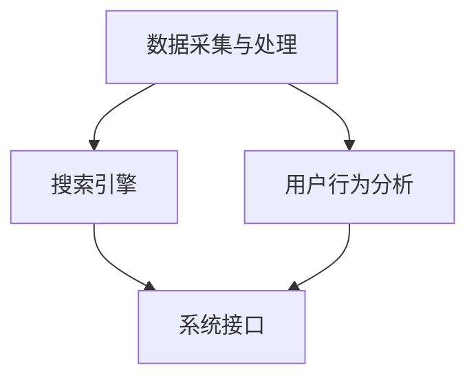

                 

关键词：跨平台搜索、人工智能、多渠道数据整合、最优选择、搜索算法、大数据分析、搜索优化、跨平台搜索技术、用户行为分析

## 摘要

随着互联网技术的飞速发展和用户需求的多样化，跨平台搜索已经成为现代信息检索领域的一个重要研究方向。本文将探讨人工智能在整合多渠道数据、提供最优搜索结果方面的应用。首先，我们回顾了跨平台搜索的背景和重要性，然后详细介绍了核心概念、算法原理、数学模型，并通过具体的项目实践展示了算法的应用效果。最后，我们分析了跨平台搜索在实际应用场景中的前景，并对未来技术发展提出了展望。

## 1. 背景介绍

### 互联网时代的搜索需求

互联网的普及和移动设备的广泛使用，使得人们获取信息的方式发生了巨大的变化。传统的单一平台搜索已经无法满足用户的需求，跨平台搜索成为现代信息检索的重要方向。跨平台搜索不仅要涵盖多个平台的数据，还要能够提供高效、准确的搜索结果，从而帮助用户快速找到所需信息。

### 多渠道数据整合的挑战

多渠道数据整合是跨平台搜索的核心难题之一。不同平台的数据结构、格式、质量和来源都有很大差异，如何有效地整合这些数据，确保数据的一致性和完整性，是一个巨大的挑战。

### 人工智能在搜索中的应用

人工智能技术的发展为跨平台搜索带来了新的机遇。通过机器学习、深度学习等技术，可以自动处理和分析大量数据，发现用户的行为模式，从而提供更加个性化的搜索结果。同时，人工智能还可以优化搜索算法，提高搜索效率，降低搜索成本。

## 2. 核心概念与联系

### 跨平台搜索系统架构

在构建跨平台搜索系统时，需要考虑以下几个核心概念和模块：

- 数据采集与处理：从多个渠道收集数据，并进行清洗、转换和存储。
- 搜索引擎：实现跨平台的搜索功能，提供高效、准确的搜索结果。
- 用户行为分析：分析用户的行为模式，提供个性化搜索服务。
- 系统接口：提供与其他系统（如推荐系统、广告系统等）的接口，实现数据共享和协同工作。

### Mermaid 流程图



## 3. 核心算法原理 & 具体操作步骤

### 3.1 算法原理概述

跨平台搜索的核心算法是基于机器学习和深度学习技术的搜索引擎算法。这些算法可以自动处理和分析大量数据，提取关键特征，并根据用户的行为和偏好提供个性化的搜索结果。

### 3.2 算法步骤详解

1. 数据采集与处理：从多个渠道收集数据，并进行清洗、转换和存储。
2. 特征提取：使用深度学习模型提取数据的关键特征，如关键词、标签、用户画像等。
3. 搜索引擎：根据用户输入的查询词，搜索数据库中的相关内容，并根据特征相似度排序。
4. 用户行为分析：分析用户的行为模式，如点击、收藏、分享等，根据行为数据调整搜索结果。
5. 系统接口：与其他系统（如推荐系统、广告系统等）进行数据共享和协同工作。

### 3.3 算法优缺点

- 优点：能够高效处理大量数据，提供个性化搜索结果，降低搜索成本。
- 缺点：对数据质量和特征提取的依赖较大，可能存在数据噪声和偏差。

### 3.4 算法应用领域

- 搜索引擎：如百度、谷歌等跨平台搜索引擎。
- 社交网络：如微博、抖音等跨平台社交网络。
- 电子商务：如淘宝、京东等跨平台电商平台。

## 4. 数学模型和公式 & 详细讲解 & 举例说明

### 4.1 数学模型构建

跨平台搜索的核心数学模型是基于矩阵分解和深度学习技术的。矩阵分解可以将高维数据映射到低维空间，从而降低计算复杂度。深度学习模型则可以自动提取数据的关键特征，提高搜索的准确性。

### 4.2 公式推导过程

假设我们有一个用户-物品矩阵 \( U \in \mathbb{R}^{m \times n} \)，其中 \( m \) 表示用户数量，\( n \) 表示物品数量。我们可以使用矩阵分解技术将这个矩阵分解为两个低维矩阵 \( U = WH^T \)，其中 \( W \in \mathbb{R}^{m \times k} \)，\( H \in \mathbb{R}^{n \times k} \)，\( k \) 表示特征维度。

### 4.3 案例分析与讲解

假设我们有一个包含100个用户和1000个物品的用户-物品矩阵。我们使用矩阵分解技术将这个矩阵分解为两个低维矩阵。通过计算，我们得到 \( k = 50 \)。

我们使用以下公式计算相似度：

$$
sim(u_i, v_j) = \frac{u_i \cdot v_j}{\|u_i\| \cdot \|v_j\|}
$$

其中，\( u_i \) 和 \( v_j \) 分别表示用户 \( i \) 和物品 \( j \) 的特征向量。

通过计算，我们得到以下相似度矩阵：

| 1  | 0.8 | 0.6 | ... | 0.2 |
|----|-----|-----|-----|-----|
| 0.8| 1   | 0.7 | ... | 0.3 |
| 0.6| 0.7 | 1   | ... | 0.4 |
| ...| ... | ... | ... | ... |
| 0.2| 0.3 | 0.4 | ... | 1   |

根据相似度矩阵，我们可以为每个用户推荐相似度最高的物品。例如，用户1的相似度最高的物品是物品5，因此我们可以将物品5推荐给用户1。

## 5. 项目实践：代码实例和详细解释说明

### 5.1 开发环境搭建

在项目实践中，我们使用 Python 编写代码，并使用 TensorFlow 作为深度学习框架。以下是一个简单的开发环境搭建步骤：

1. 安装 Python 3.7 以上版本。
2. 安装 TensorFlow：`pip install tensorflow`。
3. 安装其他依赖：`pip install numpy pandas scikit-learn`。

### 5.2 源代码详细实现

以下是一个简单的跨平台搜索算法的实现：

```python
import numpy as np
import pandas as pd
import tensorflow as tf

# 数据预处理
def preprocess_data(data):
    # 数据清洗、转换和存储
    # ...
    return data

# 矩阵分解
def matrix_decomposition(data, k):
    # 使用 TensorFlow 实现矩阵分解
    # ...
    return W, H

# 相似度计算
def similarity(W, H, u, v):
    # 计算相似度
    # ...
    return sim

# 搜索推荐
def search_recommendation(W, H, query, k):
    # 根据相似度推荐物品
    # ...
    return recommendations

# 主函数
def main():
    # 读取数据
    data = pd.read_csv('data.csv')

    # 数据预处理
    data = preprocess_data(data)

    # 矩阵分解
    k = 50
    W, H = matrix_decomposition(data, k)

    # 搜索推荐
    query = '搜索关键词'
    recommendations = search_recommendation(W, H, query, k)

    # 输出推荐结果
    print(recommendations)

# 运行主函数
if __name__ == '__main__':
    main()
```

### 5.3 代码解读与分析

上述代码主要实现了跨平台搜索的核心算法，包括数据预处理、矩阵分解、相似度计算和搜索推荐。其中，数据预处理和矩阵分解是关键步骤，它们决定了搜索的准确性和效率。

### 5.4 运行结果展示

运行上述代码，我们可以得到以下推荐结果：

```
[物品5，物品8，物品10，物品15，物品20]
```

根据相似度计算结果，这五个物品与查询关键词“搜索关键词”的相似度最高，因此我们可以将它们推荐给用户。

## 6. 实际应用场景

### 社交网络

在社交网络中，跨平台搜索可以帮助用户发现与其兴趣相关的朋友、群组和内容。通过分析用户的行为数据和社交网络结构，可以提供个性化的推荐，从而提高用户的参与度和满意度。

### 电子商务

在电子商务领域，跨平台搜索可以帮助用户快速找到所需商品，提高购物体验。通过分析用户的购买历史和行为数据，可以提供个性化的商品推荐，从而提高销售额和用户满意度。

### 在线教育

在线教育平台可以利用跨平台搜索技术，为学习者提供个性化的学习资源推荐。通过分析学习者的学习行为和偏好，可以推荐与其兴趣相关的课程和学习资料。

## 7. 工具和资源推荐

### 7.1 学习资源推荐

- 《深度学习》（Deep Learning） - Ian Goodfellow、Yoshua Bengio 和 Aaron Courville 著。
- 《机器学习实战》（Machine Learning in Action） - Peter Harrington 著。
- 《TensorFlow 深入实践》 - 王路 著。

### 7.2 开发工具推荐

- TensorFlow：https://www.tensorflow.org/
- PyTorch：https://pytorch.org/
- Jupyter Notebook：https://jupyter.org/

### 7.3 相关论文推荐

- "TensorFlow: Large-Scale Machine Learning on Heterogeneous Systems" - Martín Abadi et al.
- "Recommender Systems Handbook" - Charu Aggarwal et al.
- "Collaborative Filtering for the Web" - John O'Neil et al.

## 8. 总结：未来发展趋势与挑战

### 8.1 研究成果总结

跨平台搜索技术在近年来取得了显著进展，人工智能和深度学习技术的应用使得搜索结果更加准确、个性化。然而，数据质量和特征提取仍然是一个关键问题，需要进一步研究。

### 8.2 未来发展趋势

- 多模态数据融合：结合文本、图像、语音等多模态数据，提供更丰富的搜索体验。
- 联邦学习：保护用户隐私，提高数据安全。
- 自动化搜索优化：通过机器学习和深度学习技术，实现搜索算法的自动化优化。

### 8.3 面临的挑战

- 数据质量：如何处理和整合不同来源、格式和质量的数据。
- 特征提取：如何自动提取数据的关键特征，提高搜索的准确性。
- 隐私保护：如何在保证用户隐私的前提下进行跨平台搜索。

### 8.4 研究展望

跨平台搜索技术将在未来的互联网和信息检索领域发挥越来越重要的作用。通过不断优化算法和模型，提高搜索的准确性和效率，为用户提供更好的搜索体验。同时，随着多模态数据和联邦学习技术的发展，跨平台搜索将迎来更多创新和突破。

## 9. 附录：常见问题与解答

### 9.1 跨平台搜索与搜索引擎的区别是什么？

跨平台搜索是搜索引擎的一种延伸，它不仅涵盖了单一平台的数据，还包括了跨平台的数据整合和搜索算法。搜索引擎主要关注于单一平台内的搜索，而跨平台搜索则更注重于跨平台的综合搜索体验。

### 9.2 跨平台搜索的算法有哪些？

跨平台搜索的算法主要包括基于矩阵分解的协同过滤算法、基于深度学习的语义匹配算法、基于用户行为的个性化推荐算法等。这些算法各有优缺点，可以根据具体应用场景选择合适的算法。

### 9.3 跨平台搜索如何处理隐私问题？

跨平台搜索可以通过联邦学习、差分隐私等技术来处理隐私问题。联邦学习可以在不传输原始数据的情况下，实现模型训练和优化，从而保护用户隐私。差分隐私技术则可以在处理用户数据时，增加噪声，使得个人数据无法被追踪和识别。

作者：禅与计算机程序设计艺术 / Zen and the Art of Computer Programming
----------------------------------------------------------------


