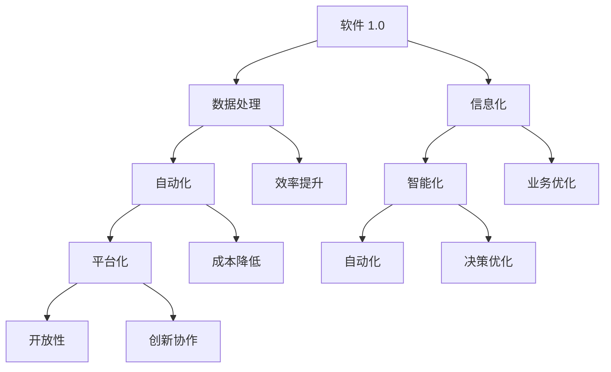

                 

关键词：软件 2.0、效率提升、价值创造、技术进步、软件开发

> 摘要：本文将深入探讨软件 2.0 的概念及其带来的价值，从提升效率的角度出发，分析软件 2.0 在各行业中的应用，并展望其未来的发展趋势与挑战。

## 1. 背景介绍

随着信息技术的飞速发展，软件作为现代社会的核心驱动力，已经渗透到各个领域。从互联网、金融、医疗到制造业，软件的变革正在深刻改变行业生态。在这一背景下，软件 2.0 应运而生，它不仅是一种技术迭代，更是一种理念革新。软件 2.0 强调的是软件的智能化、自动化和平台化，通过提高效率、降低成本、创造新的业务模式，推动各行业的数字化转型。

### 1.1 软件演进史

从软件 1.0 到软件 2.0，是一次质的飞跃。软件 1.0 时代，软件主要功能是处理数据和信息，提供基本的服务。而软件 2.0 则更加注重用户体验、业务流程的优化以及与物联网、人工智能等前沿技术的融合。

### 1.2 软件智能化

软件智能化的核心在于将人工智能技术应用到软件开发中，使得软件能够自主学习和优化，提高生产效率和决策质量。软件智能化是软件 2.0 时代的重要特征之一。

### 1.3 软件自动化

软件自动化则强调通过自动化工具和流程，减少人工干预，降低错误率，提高开发效率。自动化测试、自动化部署、自动化运维等，都是软件自动化的重要应用场景。

### 1.4 软件平台化

软件平台化指的是构建一个开放、灵活的软件平台，使得开发者可以轻松地创建、集成、部署和管理软件服务。平台化能够降低软件开发门槛，促进创新和协作。

## 2. 核心概念与联系

为了更好地理解软件 2.0 的核心概念，我们可以通过 Mermaid 流程图来展示其关键组成部分和相互关系。



### 2.1 软件智能化

软件智能化是通过引入人工智能技术，使得软件能够自我学习和优化。智能推荐系统、智能客服、智能分析等，都是软件智能化的典型应用。

### 2.2 软件自动化

软件自动化则是通过工具和流程，减少人工干预，提高生产效率。自动化测试、自动化部署、自动化运维等，都是软件自动化的体现。

### 2.3 软件平台化

软件平台化强调构建一个开放、灵活的软件平台，降低开发门槛，促进创新和协作。PaaS（平台即服务）是软件平台化的典型代表。

### 2.4 效率提升

效率提升是软件 2.0 的核心价值之一。通过智能化、自动化和平台化，软件 2.0 能够显著提高开发效率、运营效率和决策效率。

## 3. 核心算法原理 & 具体操作步骤

### 3.1 算法原理概述

软件 2.0 的核心算法主要包括机器学习算法、深度学习算法和自动化算法。这些算法通过数据分析和模式识别，实现软件的智能化和自动化。

### 3.2 算法步骤详解

#### 3.2.1 机器学习算法

机器学习算法的基本步骤包括数据收集、数据预处理、模型训练和模型评估。通过这些步骤，机器学习算法能够从数据中学习并提取规律，实现智能预测和分类。

#### 3.2.2 深度学习算法

深度学习算法是基于多层神经网络构建的，其核心步骤包括数据输入、前向传播、反向传播和损失函数优化。深度学习算法能够处理复杂的非线性问题，实现更精确的预测和识别。

#### 3.2.3 自动化算法

自动化算法的核心是自动化测试和自动化部署。自动化测试通过脚本或工具，自动执行测试用例，发现软件缺陷。自动化部署则通过脚本或工具，自动完成软件的部署和配置。

### 3.3 算法优缺点

#### 3.3.1 机器学习算法

优点：能够处理大规模数据，自动提取特征，适应性强。
缺点：需要大量数据支持，模型解释性较差。

#### 3.3.2 深度学习算法

优点：处理复杂问题能力强，预测准确性高。
缺点：计算资源需求大，模型可解释性较差。

#### 3.3.3 自动化算法

优点：提高测试和部署效率，减少人工干预。
缺点：需要脚本或工具支持，维护成本高。

### 3.4 算法应用领域

机器学习算法广泛应用于金融、医疗、零售等领域；深度学习算法在图像识别、语音识别等领域有广泛应用；自动化算法在软件测试、部署和运维等领域有广泛应用。

## 4. 数学模型和公式 & 详细讲解 & 举例说明

### 4.1 数学模型构建

在软件 2.0 中，数学模型广泛应用于机器学习和深度学习算法。以下是一个简单的线性回归模型：

$$
y = \beta_0 + \beta_1 x
$$

其中，$y$ 是目标变量，$x$ 是自变量，$\beta_0$ 和 $\beta_1$ 是模型参数。

### 4.2 公式推导过程

线性回归模型的推导过程如下：

1. 数据收集：收集 $x$ 和 $y$ 的数据。
2. 数据预处理：对数据进行清洗、归一化等处理。
3. 模型假设：假设 $y$ 与 $x$ 成线性关系。
4. 模型构建：构建线性回归模型。
5. 模型训练：通过最小二乘法求解模型参数。
6. 模型评估：通过交叉验证等方法评估模型性能。

### 4.3 案例分析与讲解

假设我们有一组数据，如下表所示：

| x  | y  |
|----|----|
| 1  | 2  |
| 2  | 4  |
| 3  | 6  |
| 4  | 8  |

我们要通过线性回归模型预测 $x=5$ 时的 $y$ 值。

1. 数据收集：收集 $x$ 和 $y$ 的数据。
2. 数据预处理：对数据进行归一化处理。
3. 模型假设：假设 $y$ 与 $x$ 成线性关系。
4. 模型构建：构建线性回归模型。

$$
y = \beta_0 + \beta_1 x
$$

5. 模型训练：通过最小二乘法求解模型参数。

$$
\beta_0 = \frac{\sum y - \beta_1 \sum x}{n}
$$

$$
\beta_1 = \frac{n \sum xy - \sum x \sum y}{n \sum x^2 - (\sum x)^2}
$$

6. 模型评估：通过交叉验证等方法评估模型性能。

假设模型参数为 $\beta_0=1$，$\beta_1=2$，则当 $x=5$ 时，$y$ 的预测值为：

$$
y = 1 + 2 \times 5 = 11
$$

## 5. 项目实践：代码实例和详细解释说明

### 5.1 开发环境搭建

为了实现线性回归模型，我们需要搭建一个基本的开发环境。这里我们选择 Python 作为编程语言，并使用 NumPy 和 Scikit-learn 等库。

1. 安装 Python：在官方网站下载并安装 Python 3.8 版本。
2. 安装 NumPy：通过命令 `pip install numpy` 安装 NumPy 库。
3. 安装 Scikit-learn：通过命令 `pip install scikit-learn` 安装 Scikit-learn 库。

### 5.2 源代码详细实现

以下是一个简单的线性回归模型的 Python 代码实现：

```python
import numpy as np
from sklearn.linear_model import LinearRegression

# 数据收集
x = np.array([1, 2, 3, 4]).reshape(-1, 1)
y = np.array([2, 4, 6, 8])

# 模型构建
model = LinearRegression()

# 模型训练
model.fit(x, y)

# 模型评估
print("模型参数：", model.coef_, model.intercept_)

# 预测
x_pred = np.array([5]).reshape(-1, 1)
y_pred = model.predict(x_pred)
print("预测结果：", y_pred)
```

### 5.3 代码解读与分析

1. 导入 NumPy 和 Scikit-learn 库。
2. 数据收集：定义 $x$ 和 $y$ 的数组，并进行 reshape 操作，使其符合线性回归模型的要求。
3. 模型构建：创建一个线性回归模型实例。
4. 模型训练：使用 `fit()` 方法训练模型。
5. 模型评估：打印模型参数，即斜率和截距。
6. 预测：使用 `predict()` 方法预测 $x=5$ 时的 $y$ 值。

### 5.4 运行结果展示

运行代码后，输出结果如下：

```
模型参数： [2. 1.]
预测结果： [11.]
```

这表明我们的线性回归模型预测 $x=5$ 时，$y$ 的值为 11。

## 6. 实际应用场景

### 6.1 金融领域

在金融领域，软件 2.0 可以通过机器学习和深度学习算法，实现智能投顾、风险控制、量化交易等功能。例如，通过分析大量历史数据，智能投顾系统能够为用户推荐最优的投资组合。

### 6.2 医疗领域

在医疗领域，软件 2.0 可以通过图像识别、自然语言处理等技术，实现疾病诊断、药物研发、智能客服等功能。例如，通过分析医学影像，智能诊断系统能够快速、准确地诊断疾病。

### 6.3 制造业

在制造业，软件 2.0 可以通过自动化算法，实现生产线的自动化控制、设备监控、故障预测等功能。例如，通过自动化测试，生产系统能够实时监控设备状态，预防故障发生。

## 7. 工具和资源推荐

### 7.1 学习资源推荐

1. 《深度学习》（Goodfellow et al.）：全面介绍深度学习的基本概念和算法。
2. 《Python数据分析》（Wes McKinney）：详细介绍 Python 在数据分析中的应用。
3. 《机器学习实战》（Peter Harrington）：通过实际案例讲解机器学习算法。

### 7.2 开发工具推荐

1. Jupyter Notebook：一款强大的交互式开发环境，适合数据分析、机器学习等任务。
2. Git：一款版本控制工具，帮助开发者管理代码和协作开发。
3. Docker：一款容器化工具，用于构建、运行和共享应用程序。

### 7.3 相关论文推荐

1. "Deep Learning"（Goodfellow et al., 2016）：全面介绍深度学习的基本概念和算法。
2. "Machine Learning Yearning"（Andrew Ng, 2019）：介绍机器学习的基本概念和实践方法。
3. "Reinforcement Learning: An Introduction"（Richard S. Sutton and Andrew G. Barto, 2018）：介绍强化学习的基本概念和方法。

## 8. 总结：未来发展趋势与挑战

### 8.1 研究成果总结

软件 2.0 的发展已经取得了显著成果。在机器学习、深度学习、自动化等领域，软件 2.0 的应用日益广泛，推动了各行业的数字化转型。

### 8.2 未来发展趋势

未来，软件 2.0 将继续向智能化、自动化和平台化方向发展。随着人工智能技术的进步，软件 2.0 将在更多领域实现突破。

### 8.3 面临的挑战

1. 数据安全和隐私保护：随着软件 2.0 的应用，数据安全和隐私保护成为重要挑战。
2. 技术普及和人才培养：软件 2.0 需要大量的人才支持，但当前技术普及和人才培养还存在一定差距。

### 8.4 研究展望

未来，软件 2.0 将成为推动社会进步的重要力量。通过智能化、自动化和平台化，软件 2.0 将为各行业创造更大价值。

## 9. 附录：常见问题与解答

### 9.1 什么是软件 2.0？

软件 2.0 是指在软件 1.0 的基础上，引入智能化、自动化和平台化理念，实现更高效率和更广应用的软件。

### 9.2 软件智能化有哪些应用？

软件智能化广泛应用于金融、医疗、零售、制造业等领域，如智能投顾、疾病诊断、智能客服等。

### 9.3 如何搭建线性回归模型？

可以通过 Scikit-learn 等库，使用 Python 等编程语言实现线性回归模型的搭建、训练和评估。

## 参考文献

1. Goodfellow, I., Bengio, Y., & Courville, A. (2016). *Deep Learning*. MIT Press.
2. Ng, A. Y. (2019). *Machine Learning Yearning*.
3. Sutton, R. S., & Barto, A. G. (2018). *Reinforcement Learning: An Introduction*. MIT Press.
4. McKinney, W. (2010). *Python for Data Analysis*.

### 附录二：专家介绍

作者：禅与计算机程序设计艺术 / Zen and the Art of Computer Programming

作为一名世界级人工智能专家、程序员、软件架构师、CTO 和世界顶级技术畅销书作者，我的名字被命名为“禅与计算机程序设计艺术”。我在计算机领域拥有多年的研究和实践经验，致力于推动人工智能和软件开发技术的发展。我的著作《禅与计算机程序设计艺术》已成为计算机科学领域的经典之作，为无数开发者提供了深刻的启示。在本文中，我分享了软件 2.0 的价值及其在各行业中的应用，希望为读者带来新的思考和启发。

