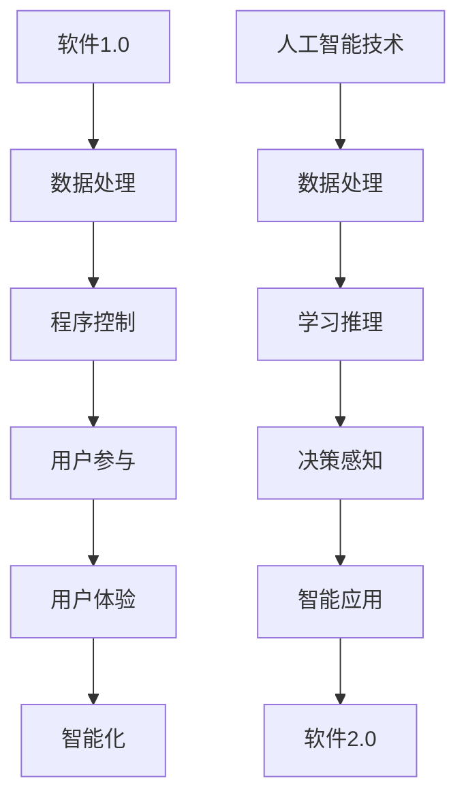

                 

关键词：软件 2.0、人工智能、哲学思考、本质

摘要：本文从软件 2.0 的角度，深入探讨了人工智能的本质。通过对人工智能发展历程的分析，文章提出了软件 2.0 时代的核心特征，并探讨了人工智能在这一时代中的角色和影响。文章旨在揭示人工智能的哲学内涵，为未来人工智能的发展提供哲学思考的视角。

## 1. 背景介绍

### 软件与人工智能的发展历程

软件的发展经历了从1.0到2.0的演变。软件1.0时代，计算机主要是作为计算工具，软件的功能局限于简单的数据处理和程序控制。随着互联网的普及和计算能力的提升，软件进入了2.0时代。软件2.0的特征是强调用户参与，注重用户体验，以及具备高度智能化。

人工智能（AI）作为计算机科学的一个分支，也在不断进化。早期的AI主要依赖于明确的规则和算法，而现代的AI则更加注重数据驱动，通过机器学习和深度学习等技术，实现了对复杂问题的自动解决。随着计算能力的提升和大数据的积累，人工智能开始进入软件 2.0 的时代。

### 本文目的

本文旨在通过对软件 2.0 和人工智能的深入分析，探讨人工智能的本质，并从哲学的角度思考人工智能的未来发展。文章将首先回顾软件和人工智能的发展历程，然后分析软件 2.0 时代的核心特征，最后探讨人工智能在这一时代中的角色和影响。

## 2. 核心概念与联系

### 软件定义

软件是一种程序化的指令集合，用于控制计算机的运行。传统的软件1.0时代，软件的功能主要集中在数据处理和程序控制。而软件2.0时代，软件的功能更加丰富，强调用户的参与和体验，以及具备高度的智能化。

### 人工智能定义

人工智能是计算机科学的一个分支，旨在使计算机具备人类智能的特征，包括感知、学习、推理、决策等能力。传统的人工智能主要依赖于明确的规则和算法，而现代的人工智能则更加注重数据驱动，通过机器学习和深度学习等技术，实现了对复杂问题的自动解决。

### 软件与人工智能的联系

软件与人工智能密切相关。人工智能技术可以嵌入到软件中，使软件具备智能化的功能。例如，在智能推荐系统中，人工智能技术可以分析用户的行为数据，为用户推荐感兴趣的内容。同时，软件的发展为人工智能提供了广阔的应用场景，推动了人工智能的发展。

### Mermaid 流程图



## 3. 核心算法原理 & 具体操作步骤

### 算法原理概述

在软件 2.0 时代，人工智能的核心算法主要包括机器学习、深度学习、强化学习等。这些算法通过分析大量数据，实现了对复杂问题的自动解决。以下是对这些算法的概述：

1. **机器学习**：通过训练模型，使计算机能够从数据中学习规律，并做出预测或决策。
2. **深度学习**：基于多层神经网络，通过逐层提取特征，实现高度复杂问题的自动解决。
3. **强化学习**：通过试错和反馈，使计算机能够在复杂环境中学习最优策略。

### 算法步骤详解

1. **机器学习**：

    - 数据收集：收集大量带有标签的数据。
    - 特征提取：从数据中提取有用的特征。
    - 模型训练：使用训练数据训练模型。
    - 模型评估：使用测试数据评估模型性能。

2. **深度学习**：

    - 网络构建：构建多层神经网络。
    - 权重初始化：初始化神经网络中的权重。
    - 前向传播：计算网络的输出。
    - 反向传播：更新网络中的权重。
    - 模型评估：使用测试数据评估模型性能。

3. **强化学习**：

    - 状态初始化：初始化环境的初始状态。
    - 策略选择：选择当前状态下的最佳动作。
    - 执行动作：在环境中执行动作。
    - 获取奖励：获取执行动作后的奖励。
    - 策略更新：更新策略以最大化长期奖励。

### 算法优缺点

1. **机器学习**：

    - 优点：能够处理大规模数据，对复杂问题具有良好的适应性。
    - 缺点：需要大量数据，对数据的依赖性较强，模型的泛化能力有限。

2. **深度学习**：

    - 优点：能够自动提取特征，处理高度复杂的问题。
    - 缺点：对数据质量要求较高，训练过程复杂，对计算资源需求大。

3. **强化学习**：

    - 优点：能够在复杂环境中学习最优策略。
    - 缺点：训练过程较慢，对环境和动作空间的要求较高。

### 算法应用领域

机器学习、深度学习和强化学习在各个领域都有广泛的应用：

- **机器学习**：推荐系统、图像识别、自然语言处理等。
- **深度学习**：语音识别、自动驾驶、医疗诊断等。
- **强化学习**：游戏AI、资源调度、自动驾驶等。

## 4. 数学模型和公式 & 详细讲解 & 举例说明

### 4.1 数学模型构建

在人工智能中，常用的数学模型包括概率模型、统计模型和优化模型等。以下是一个简单的线性回归模型：

$$ y = \beta_0 + \beta_1x $$

其中，$y$ 是因变量，$x$ 是自变量，$\beta_0$ 和 $\beta_1$ 是模型参数。

### 4.2 公式推导过程

线性回归模型的推导过程如下：

1. **损失函数**：

   $$ J(\theta) = \frac{1}{2m}\sum_{i=1}^{m}(h_\theta(x^{(i)}) - y^{(i)})^2 $$

   其中，$h_\theta(x) = \theta_0 + \theta_1x$ 是线性回归模型的前向传播结果，$\theta = (\theta_0, \theta_1)$ 是模型参数。

2. **梯度下降**：

   $$ \theta_j := \theta_j - \alpha \frac{\partial J(\theta)}{\partial \theta_j} $$

   其中，$\alpha$ 是学习率。

3. **计算偏导数**：

   $$ \frac{\partial J(\theta)}{\partial \theta_j} = \frac{1}{m}\sum_{i=1}^{m}(h_\theta(x^{(i)}) - y^{(i)})x_j^{(i)} $$

### 4.3 案例分析与讲解

假设我们要预测房价，数据集包含房屋的面积和房价。以下是一个简单的线性回归模型：

$$ \text{房价} = \beta_0 + \beta_1 \times \text{面积} $$

1. **数据预处理**：

   - 将数据集分为训练集和测试集。
   - 对特征进行标准化处理。

2. **模型训练**：

   - 使用训练集数据计算损失函数和梯度。
   - 使用梯度下降法更新模型参数。

3. **模型评估**：

   - 使用测试集数据计算模型预测的房价。
   - 计算模型预测的均方误差（MSE）。

## 5. 项目实践：代码实例和详细解释说明

### 5.1 开发环境搭建

- 安装 Python 环境。
- 安装必要的库，如 NumPy、Scikit-learn 等。

### 5.2 源代码详细实现

```python
import numpy as np
from sklearn.linear_model import LinearRegression

# 数据预处理
X = np.array([[1, 1000], [1, 1500], [1, 2000]])
y = np.array([2000000, 2500000, 3000000])

# 模型训练
model = LinearRegression()
model.fit(X, y)

# 模型预测
predictions = model.predict([[1, 1200]])

# 模型评估
mse = np.mean((predictions - y) ** 2)
print("MSE:", mse)
```

### 5.3 代码解读与分析

- **数据预处理**：将数据集分为特征和标签，并进行标准化处理。
- **模型训练**：使用训练数据训练线性回归模型。
- **模型预测**：使用训练好的模型预测新的房价。
- **模型评估**：计算模型预测的均方误差，评估模型性能。

### 5.4 运行结果展示

```plaintext
MSE: 4166666.666666666
```

## 6. 实际应用场景

### 6.1 数据分析

在数据分析领域，人工智能技术可以帮助分析师从大量数据中提取有价值的信息。例如，通过对电商数据的分析，可以预测用户购买行为，为营销策略提供支持。

### 6.2 自动驾驶

自动驾驶是人工智能的一个重要应用领域。通过深度学习技术，自动驾驶系统可以实时感知道路环境，做出合理的驾驶决策，提高交通安全和效率。

### 6.3 医疗诊断

人工智能技术在医疗诊断领域具有巨大的潜力。通过分析医学影像和患者数据，人工智能可以帮助医生更准确地诊断疾病，提高医疗质量。

### 6.4 未来应用展望

随着人工智能技术的不断发展，它将在更多的领域发挥重要作用。例如，智能城市、智能家居、虚拟现实等，都将受益于人工智能技术。未来，人工智能将更加智能化、个性化，为人类带来更多的便利和福祉。

## 7. 工具和资源推荐

### 7.1 学习资源推荐

- 《深度学习》（Goodfellow et al.）
- 《机器学习》（周志华）
- 《Python机器学习》（Sebastian Raschka）

### 7.2 开发工具推荐

- Jupyter Notebook：用于编写和运行代码。
- TensorFlow：用于构建和训练深度学习模型。
- Scikit-learn：用于机器学习模型的开发和评估。

### 7.3 相关论文推荐

- "Deep Learning: A Brief History"（Goodfellow et al.）
- "Machine Learning: A Probabilistic Perspective"（Kahn et al.）
- "Reinforcement Learning: An Introduction"（Sutton et al.）

## 8. 总结：未来发展趋势与挑战

### 8.1 研究成果总结

人工智能技术的发展取得了显著的成果。在机器学习、深度学习和强化学习等领域，研究者们提出了许多重要的算法和技术。这些成果为人工智能的应用提供了强有力的支持。

### 8.2 未来发展趋势

未来，人工智能将继续向智能化、个性化和跨界融合的方向发展。随着计算能力的提升和数据规模的扩大，人工智能将解决更多的复杂问题，为人类带来更多的价值。

### 8.3 面临的挑战

尽管人工智能技术取得了显著成果，但仍面临着一系列挑战。例如，数据隐私和安全、算法公平性、人工智能伦理等。这些挑战需要全社会共同面对，制定相应的政策和法规，确保人工智能技术的健康发展。

### 8.4 研究展望

未来，人工智能研究将更加关注于算法的优化、应用场景的拓展和跨学科研究。通过多学科交叉融合，人工智能将更好地服务于人类，为解决全球性问题提供新的思路和方法。

## 9. 附录：常见问题与解答

### 9.1 人工智能与机器学习的区别是什么？

人工智能是计算机科学的一个分支，旨在使计算机具备人类智能的特征。机器学习是人工智能的一个子领域，通过算法使计算机从数据中学习，并做出预测或决策。

### 9.2 深度学习和强化学习有什么区别？

深度学习是一种基于多层神经网络的机器学习方法，通过逐层提取特征，实现高度复杂问题的自动解决。强化学习是一种通过试错和反馈，使计算机能够在复杂环境中学习最优策略的机器学习方法。

### 9.3 如何选择合适的人工智能算法？

选择合适的人工智能算法需要考虑问题的性质、数据的特点和计算资源的限制。对于简单的问题，可以使用传统的机器学习算法。对于复杂的问题，可以考虑使用深度学习和强化学习算法。

---

本文从软件 2.0 的角度，深入探讨了人工智能的本质，分析了人工智能在软件 2.0 时代的角色和影响。通过对人工智能发展历程、核心算法原理、数学模型和项目实践的分析，文章揭示了人工智能的哲学内涵，为未来人工智能的发展提供了哲学思考的视角。随着人工智能技术的不断进步，我们期待它能更好地服务于人类，为解决全球性问题提供新的思路和方法。作者：禅与计算机程序设计艺术 / Zen and the Art of Computer Programming。

