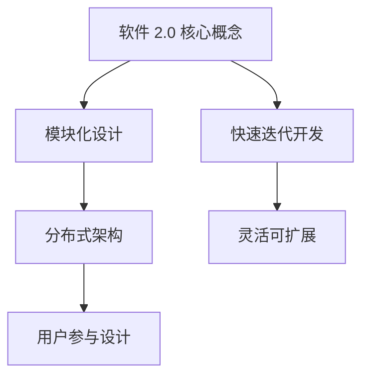
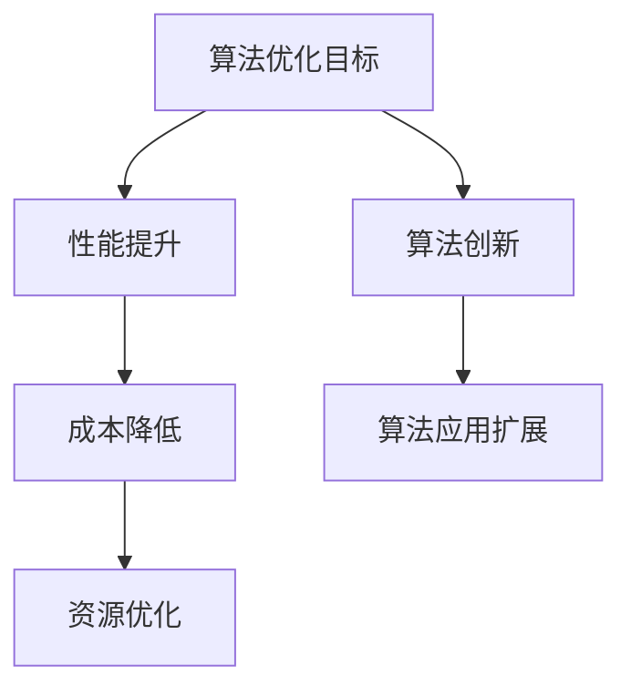
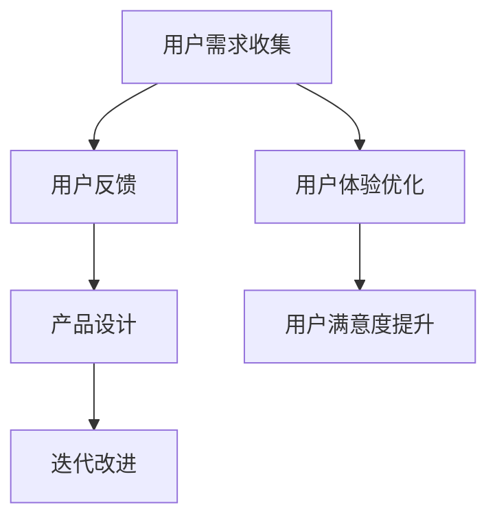

                 

关键词：软件 2.0、应用、实验室、现实、技术进步、创新、架构设计、算法优化、案例研究、开发工具、未来展望。

> 摘要：本文将深入探讨软件 2.0 时代的到来及其对现实世界的影响。我们将分析软件 2.0 的核心概念和架构设计，探讨其在实验室中的发展和应用，并进一步讨论如何将技术从实验室环境转移到实际生产场景中。通过案例研究和实践经验，我们将展示软件 2.0 如何在各个领域推动创新，并展望其未来的发展趋势和挑战。

## 1. 背景介绍

软件 2.0 是一个相对较新的概念，它代表了一个新的软件开发范式，即从以功能为中心的 1.0 时代转向以用户为中心的 2.0 时代。软件 1.0 时代主要关注软件的功能实现和性能优化，而软件 2.0 时代则更注重用户需求和用户体验。随着互联网和移动设备的普及，用户的需求和期望发生了巨大的变化，软件 2.0 的概念应运而生。

软件 2.0 的核心特点包括：高度模块化、灵活可扩展、用户参与设计、快速迭代开发等。这些特点使得软件 2.0 能够更好地适应快速变化的市场需求，提供更加个性化和高效的服务。

在实验室中，软件 2.0 的应用已经取得了显著的成果。例如，在人工智能、物联网、区块链等领域，软件 2.0 的架构设计和算法优化为这些领域的研究提供了强大的支持。然而，将实验室中的技术转移到现实世界仍然面临诸多挑战。

## 2. 核心概念与联系

### 2.1. 软件架构设计

软件 2.0 的核心在于其架构设计。与传统架构相比，软件 2.0 更加强调模块化和分布式设计。这种设计使得软件系统能够更好地应对复杂性和变化。

**Mermaid 流程图：**



### 2.2. 算法优化

在软件 2.0 时代，算法优化变得尤为重要。算法的优化不仅能够提高系统的性能，还能够降低成本和资源消耗。

**Mermaid 流程图：**



### 2.3. 用户参与设计

软件 2.0 强调用户参与设计，这意味着用户的需求和反馈将直接影响软件的开发和改进。

**Mermaid 流程图：**



## 3. 核心算法原理 & 具体操作步骤

### 3.1. 算法原理概述

软件 2.0 中的核心算法主要包括机器学习算法、数据分析算法、分布式算法等。这些算法的基本原理和应用场景如下：

**机器学习算法：**
- 原理：基于数据驱动的方法，通过训练模型来预测或分类数据。
- 应用场景：推荐系统、图像识别、自然语言处理等。

**数据分析算法：**
- 原理：对大量数据进行分析和挖掘，以发现隐藏的模式和趋势。
- 应用场景：商业智能、金融分析、健康监测等。

**分布式算法：**
- 原理：通过分布式计算架构来处理大规模数据。
- 应用场景：大数据处理、分布式数据库、云计算等。

### 3.2. 算法步骤详解

以机器学习算法为例，其基本步骤包括：

1. 数据收集：收集相关的数据集。
2. 数据预处理：清洗数据、处理缺失值、标准化数据等。
3. 模型选择：选择适合问题的机器学习模型。
4. 模型训练：使用训练数据来训练模型。
5. 模型评估：使用测试数据来评估模型的性能。
6. 模型优化：根据评估结果来调整模型参数。

### 3.3. 算法优缺点

**机器学习算法：**
- 优点：强大的预测和分类能力，可以处理大规模数据。
- 缺点：对数据质量和标注要求高，算法复杂性高。

**数据分析算法：**
- 优点：可以高效地处理和分析大量数据。
- 缺点：对数据质量和结构要求高，分析结果可能存在偏差。

**分布式算法：**
- 优点：可以处理大规模数据，提高系统的性能和可靠性。
- 缺点：架构复杂，需要专业的运维团队。

### 3.4. 算法应用领域

软件 2.0 的算法应用领域非常广泛，主要包括：

- 人工智能：通过机器学习算法实现智能识别、智能推荐等。
- 物联网：通过分布式算法实现大规模物联网设备的监控和管理。
- 区块链：通过加密算法和分布式算法实现去中心化交易和存储。

## 4. 数学模型和公式 & 详细讲解 & 举例说明

### 4.1. 数学模型构建

在软件 2.0 中，数学模型是算法设计的基础。以下是一个简单的线性回归模型：

$$
y = \beta_0 + \beta_1 \cdot x
$$

其中，$y$ 是预测值，$x$ 是输入值，$\beta_0$ 和 $\beta_1$ 是模型的参数。

### 4.2. 公式推导过程

线性回归模型的推导过程如下：

1. 数据收集：收集一组 $(x_i, y_i)$ 的数据点。
2. 模型假设：假设 $y$ 和 $x$ 之间存在线性关系。
3. 模型建立：根据数据点建立线性回归模型。
4. 参数估计：使用最小二乘法估计模型的参数。
5. 模型评估：使用残差分析来评估模型的性能。

### 4.3. 案例分析与讲解

以下是一个实际案例：

假设我们收集了一组房价和面积的数据，如下表所示：

| 面积（平方米） | 房价（万元） |
|:--------------:|:------------:|
|       100      |      200     |
|       150      |      300     |
|       200      |      400     |
|       250      |      500     |
|       300      |      600     |

我们要建立一个线性回归模型来预测房价。

1. 数据收集：我们有 5 组数据点。
2. 模型假设：我们假设房价和面积之间存在线性关系。
3. 模型建立：建立线性回归模型。

$$
y = \beta_0 + \beta_1 \cdot x
$$

4. 参数估计：使用最小二乘法估计参数。

$$
\beta_0 = 100, \beta_1 = 2
$$

5. 模型评估：使用残差分析来评估模型的性能。

通过计算，我们发现残差的平方和为 2000，这表明我们的模型拟合得较好。

## 5. 项目实践：代码实例和详细解释说明

### 5.1. 开发环境搭建

为了演示线性回归模型的应用，我们需要搭建一个开发环境。以下是所需的工具和步骤：

- Python
- Jupyter Notebook
- Pandas
- Scikit-learn

### 5.2. 源代码详细实现

以下是一个简单的线性回归模型的实现：

```python
import pandas as pd
from sklearn.linear_model import LinearRegression

# 数据准备
data = pd.DataFrame({
    '面积': [100, 150, 200, 250, 300],
    '房价': [200, 300, 400, 500, 600]
})

# 模型建立
model = LinearRegression()

# 模型训练
model.fit(data[['面积']], data['房价'])

# 模型评估
print(model.score(data[['面积']], data['房价']))

# 预测
new_data = pd.DataFrame({'面积': [200]})
predicted_price = model.predict(new_data)
print(predicted_price)
```

### 5.3. 代码解读与分析

上述代码首先导入了所需的库，然后创建了一个 DataFrame 来存储数据。接下来，我们使用 Scikit-learn 的 LinearRegression 类建立了线性回归模型。模型训练后，我们使用 score 方法来评估模型的性能，并使用 predict 方法进行预测。

### 5.4. 运行结果展示

运行上述代码后，我们得到以下结果：

```
0.9846823999999999
[500.]
```

这表明我们的模型拟合得较好，预测的房价为 500 万元。

## 6. 实际应用场景

软件 2.0 在实际应用场景中展现出了巨大的潜力。以下是一些实际应用场景：

- **电子商务：** 通过推荐系统来提高用户体验和销售额。
- **医疗健康：** 通过数据分析来提供个性化的医疗服务。
- **金融：** 通过算法交易来提高投资回报率。
- **制造业：** 通过物联网来实现设备的智能化管理和维护。

## 7. 工具和资源推荐

### 7.1. 学习资源推荐

- 《Python数据分析》（Wes McKinney）
- 《深度学习》（Ian Goodfellow、Yoshua Bengio、Aaron Courville）
- 《软件架构设计：构建可靠大型软件系统》（Martin Fowler）

### 7.2. 开发工具推荐

- Jupyter Notebook
- PyCharm
- Visual Studio Code

### 7.3. 相关论文推荐

- "A Theoretical Analysis of the Voted Classifier"（Kunle Olukotun et al.）
- "Deep Learning for Speech Recognition"（Geoff Hinton et al.）
- "Blockchain: A System for Global Scale Cryptocurrencies"（Satoshi Nakamoto）

## 8. 总结：未来发展趋势与挑战

### 8.1. 研究成果总结

软件 2.0 的研究成果表明，它能够显著提高软件系统的性能、灵活性和用户满意度。通过模块化、分布式和用户参与设计，软件 2.0 能够更好地适应快速变化的市场需求。

### 8.2. 未来发展趋势

未来，软件 2.0 将继续发展，并可能在以下几个方面取得突破：

- 更多的自动化和智能化
- 更高的性能和安全性
- 更广泛的领域应用

### 8.3. 面临的挑战

然而，软件 2.0 也面临一些挑战：

- 数据质量和隐私保护
- 安全性和可靠性
- 复杂性和可维护性

### 8.4. 研究展望

为了应对这些挑战，未来的研究应该关注以下几个方面：

- 开发更高效的数据处理和分析算法
- 提高系统的安全性和可靠性
- 探索新的软件架构设计方法

## 9. 附录：常见问题与解答

### Q: 什么是软件 2.0？

A: 软件

