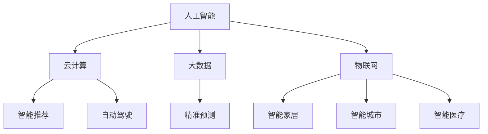

                 

关键词：软件 2.0，应用实践，实验室走向现实，技术突破，创新驱动

> 摘要：本文将深入探讨软件 2.0 的发展与应用，从实验室研究到现实应用的转变过程，分析其在各个领域的创新突破和实际应用价值。通过对核心概念、算法原理、数学模型以及项目实践的详细解析，本文旨在为读者提供对软件 2.0 的全面理解和未来发展的深刻洞察。

## 1. 背景介绍

软件 2.0 是继软件 1.0 之后的一个重要发展阶段。软件 1.0 以功能为核心，追求的是软件的稳定性和功能性；而软件 2.0 则更注重软件的智能化、自动化和用户体验。随着云计算、大数据、人工智能等技术的快速发展，软件 2.0 开始从实验室走向现实，成为推动社会进步和产业变革的重要力量。

软件 2.0 的核心特点在于其高度智能化和自动化，通过深度学习、自然语言处理、图像识别等技术，实现了对用户行为的精准预测和响应。这使得软件 2.0 能够更好地满足用户需求，提高生产效率，优化业务流程，从而在各个领域取得了显著的应用成果。

本文将围绕软件 2.0 的应用实践，详细探讨其在实验室走向现实的过程中所经历的挑战与突破，分析其在实际应用中的价值与未来发展趋势。

## 2. 核心概念与联系

为了更好地理解软件 2.0 的应用，我们首先需要了解其核心概念和原理。以下是软件 2.0 的关键组成部分及其相互关系：

### 2.1 人工智能

人工智能（AI）是软件 2.0 的核心驱动力。通过深度学习、强化学习、自然语言处理等技术，人工智能能够模拟人类智能，进行推理、决策和预测。在软件 2.0 中，人工智能被广泛应用于图像识别、语音识别、智能推荐、自动驾驶等领域。

### 2.2 云计算

云计算为软件 2.0 提供了强大的计算和存储能力。通过云计算，软件 2.0 能够实现大规模数据的存储和处理，从而支持更复杂的算法和更广泛的应用场景。此外，云计算还提供了灵活的资源管理和调度机制，使得软件 2.0 能够更好地适应动态变化的业务需求。

### 2.3 大数据

大数据是软件 2.0 的数据基础。通过收集、存储和分析海量数据，软件 2.0 能够发现隐藏在数据背后的规律和趋势，从而实现精准预测和智能决策。大数据技术在金融、医疗、交通等领域有着广泛的应用。

### 2.4 物联网

物联网（IoT）为软件 2.0 提供了实时数据来源。通过连接各种物理设备和传感器，物联网能够实时采集环境数据，为软件 2.0 提供丰富的输入信息。在智能家居、智能城市、智能医疗等领域，物联网与软件 2.0 的结合为人们带来了全新的体验。

### 2.5 Mermaid 流程图

以下是一个简化的 Mermaid 流程图，展示了软件 2.0 的核心概念及其相互关系：



通过这个流程图，我们可以更直观地了解软件 2.0 的核心概念及其相互关系，为后续的讨论提供基础。

## 3. 核心算法原理 & 具体操作步骤

### 3.1 算法原理概述

软件 2.0 的核心算法主要包括深度学习、强化学习、自然语言处理等。以下是对这些算法的简要概述：

- **深度学习**：深度学习是一种基于多层神经网络的人工智能算法，能够通过训练自动提取数据中的特征，进行分类、回归、语音识别等任务。其核心思想是多层神经元的叠加，使得模型能够处理更复杂的数据。
- **强化学习**：强化学习是一种通过试错和反馈学习策略的算法，适用于需要决策的任务，如游戏、机器人控制等。其核心思想是通过奖励机制来优化决策，从而实现最优策略。
- **自然语言处理**：自然语言处理是一种使计算机能够理解、生成和回应自然语言的技术，包括文本分类、情感分析、机器翻译等任务。其核心思想是通过语言模型和句法分析等技术，实现自然语言的自动理解和生成。

### 3.2 算法步骤详解

以下是深度学习、强化学习和自然语言处理的具体操作步骤：

#### 3.2.1 深度学习

1. 数据预处理：将原始数据转换为适合训练的格式，如图像、文本、音频等。
2. 构建神经网络：设计多层神经网络结构，包括输入层、隐藏层和输出层。
3. 模型训练：通过反向传播算法，调整网络权重和偏置，使模型能够预测输入数据的标签。
4. 模型评估：使用验证集和测试集评估模型性能，包括准确率、召回率等指标。
5. 模型部署：将训练好的模型部署到实际应用场景，进行预测和决策。

#### 3.2.2 强化学习

1. 状态空间定义：定义环境的可能状态，如游戏中的棋盘、机器人控制中的传感器数据等。
2. 动作空间定义：定义智能体可执行的动作，如游戏中的走棋、机器人控制中的移动等。
3. 奖励机制设计：设计奖励函数，根据智能体的动作和状态变化给予奖励或惩罚。
4. 策略学习：通过试错和反馈，学习最优策略，使智能体在环境中取得最大累计奖励。
5. 策略评估：使用评估函数评估智能体的策略性能，如预期奖励、优势值等。

#### 3.2.3 自然语言处理

1. 文本预处理：对文本进行分词、去停用词、词性标注等处理，使其适合模型训练。
2. 语言模型构建：构建语言模型，通过统计方法或神经网络模型，预测下一个单词或词组。
3. 句法分析：对句子进行句法分析，提取句子的结构信息，如词汇关系、语法树等。
4. 文本分类：使用分类算法，对文本进行分类，如情感分类、新闻分类等。
5. 机器翻译：使用神经网络翻译模型，将一种语言的文本翻译成另一种语言。

### 3.3 算法优缺点

以下是深度学习、强化学习和自然语言处理的优缺点：

#### 深度学习

- **优点**：能够处理复杂数据，自动提取特征，适用于各种任务。
- **缺点**：训练过程复杂，对计算资源要求高，模型解释性差。

#### 强化学习

- **优点**：适用于需要决策的任务，能够通过反馈学习最优策略。
- **缺点**：训练过程较慢，需要大量的数据和时间，有时难以收敛到最优策略。

#### 自然语言处理

- **优点**：能够处理自然语言，实现人机交互，提高工作效率。
- **缺点**：对语言理解能力有限，存在歧义和误解。

### 3.4 算法应用领域

深度学习、强化学习和自然语言处理在各个领域有着广泛的应用：

- **深度学习**：应用于图像识别、语音识别、自然语言处理、医疗诊断等。
- **强化学习**：应用于游戏、机器人控制、自动驾驶等。
- **自然语言处理**：应用于文本分类、情感分析、机器翻译、智能客服等。

## 4. 数学模型和公式 & 详细讲解 & 举例说明

### 4.1 数学模型构建

在软件 2.0 的应用中，数学模型起着至关重要的作用。以下是几个常见的数学模型及其构建方法：

#### 4.1.1 神经网络模型

神经网络模型是深度学习的核心。其构建方法主要包括以下几个步骤：

1. **输入层**：输入层接收外部输入，如图像、文本等。
2. **隐藏层**：隐藏层通过激活函数，对输入数据进行处理和变换。
3. **输出层**：输出层生成预测结果，如分类标签、回归值等。
4. **权重与偏置**：通过反向传播算法，不断调整网络权重和偏置，使模型能够收敛到最优解。

#### 4.1.2 强化学习模型

强化学习模型主要基于马尔可夫决策过程（MDP）。其构建方法主要包括以下几个步骤：

1. **状态空间**：定义环境的可能状态，如棋盘、传感器数据等。
2. **动作空间**：定义智能体可执行的动作，如走棋、移动等。
3. **奖励函数**：设计奖励函数，根据智能体的动作和状态变化给予奖励或惩罚。
4. **策略学习**：通过试错和反馈，学习最优策略。

#### 4.1.3 自然语言处理模型

自然语言处理模型主要包括语言模型和句法分析模型。其构建方法如下：

1. **语言模型**：通过统计方法或神经网络模型，预测下一个单词或词组。
2. **句法分析模型**：对句子进行句法分析，提取句子的结构信息。

### 4.2 公式推导过程

以下是神经网络模型的几个关键公式及其推导过程：

#### 4.2.1 激活函数

激活函数是神经网络的核心。以下是一个常见的激活函数及其导数：

$$
f(x) = \sigma(x) = \frac{1}{1 + e^{-x}}
$$

$$
f'(x) = \sigma'(x) = \sigma(x)(1 - \sigma(x))
$$

#### 4.2.2 前向传播

前向传播是神经网络训练过程中的一个关键步骤。其公式如下：

$$
z_i = \sum_{j} w_{ij}x_j + b_i
$$

$$
a_i = \sigma(z_i)
$$

其中，$x_j$ 表示输入特征，$w_{ij}$ 表示权重，$b_i$ 表示偏置，$z_i$ 表示神经元输出，$a_i$ 表示激活值。

#### 4.2.3 反向传播

反向传播是神经网络训练过程中的另一个关键步骤。其公式如下：

$$
\delta_i = f'(z_i)a_i(1 - a_i)(\sum_{j} w_{ji}\delta_j)
$$

$$
\Delta w_{ij} = \alpha \delta_i a_j
$$

$$
\Delta b_i = \alpha \delta_i
$$

其中，$\delta_i$ 表示误差，$\alpha$ 表示学习率，$\Delta w_{ij}$ 和 $\Delta b_i$ 分别表示权重和偏置的更新值。

### 4.3 案例分析与讲解

以下是一个简化的神经网络模型在图像识别任务中的案例：

#### 4.3.1 数据集

假设我们有一个包含 10 个类别的图像数据集，每个类别有 100 张图片。

#### 4.3.2 网络结构

假设我们设计一个三层神经网络，包括输入层、隐藏层和输出层。输入层有 784 个神经元，隐藏层有 500 个神经元，输出层有 10 个神经元。

#### 4.3.3 模型训练

1. **初始化参数**：随机初始化权重和偏置。
2. **前向传播**：将输入图像输入到网络，计算神经元输出和激活值。
3. **计算误差**：计算输出层误差，即预测标签与实际标签之间的差异。
4. **反向传播**：根据误差，更新网络权重和偏置。
5. **迭代训练**：重复步骤 2-4，直到模型收敛。

通过这个案例，我们可以更直观地理解神经网络模型的训练过程。

## 5. 项目实践：代码实例和详细解释说明

### 5.1 开发环境搭建

在开始项目实践之前，我们需要搭建一个适合软件 2.0 应用开发的开发环境。以下是搭建开发环境的基本步骤：

1. **安装 Python**：下载并安装 Python，推荐使用 Python 3.7 或以上版本。
2. **安装依赖库**：安装常用依赖库，如 TensorFlow、PyTorch、Scikit-learn 等。
3. **配置环境变量**：配置 Python 环境变量，以便在终端中直接运行 Python 脚本。
4. **搭建 Jupyter Notebook**：安装 Jupyter Notebook，以便在浏览器中运行和调试代码。

### 5.2 源代码详细实现

以下是一个简单的软件 2.0 应用实例，使用 TensorFlow 实现一个图像分类器：

```python
import tensorflow as tf
from tensorflow.keras import datasets, layers, models

# 加载数据集
(train_images, train_labels), (test_images, test_labels) = datasets.cifar10.load_data()

# 数据预处理
train_images, test_images = train_images / 255.0, test_images / 255.0

# 构建模型
model = models.Sequential()
model.add(layers.Conv2D(32, (3, 3), activation='relu', input_shape=(32, 32, 3)))
model.add(layers.MaxPooling2D((2, 2)))
model.add(layers.Conv2D(64, (3, 3), activation='relu'))
model.add(layers.MaxPooling2D((2, 2)))
model.add(layers.Conv2D(64, (3, 3), activation='relu'))

# 添加全连接层
model.add(layers.Flatten())
model.add(layers.Dense(64, activation='relu'))
model.add(layers.Dense(10, activation='softmax'))

# 编译模型
model.compile(optimizer='adam',
              loss=tf.keras.losses.SparseCategoricalCrossentropy(from_logits=True),
              metrics=['accuracy'])

# 训练模型
model.fit(train_images, train_labels, epochs=10, validation_data=(test_images, test_labels))

# 评估模型
test_loss, test_acc = model.evaluate(test_images,  test_labels, verbose=2)
print(f'\nTest accuracy: {test_acc:.4f}')
```

### 5.3 代码解读与分析

1. **数据集加载**：使用 TensorFlow 的 datasets.cifar10.load_data() 方法加载数据集，得到训练集和测试集。
2. **数据预处理**：将图像数据归一化至 [0, 1] 范围内，便于模型训练。
3. **模型构建**：使用 models.Sequential() 方法构建一个序列模型，包括卷积层、池化层和全连接层。
4. **模型编译**：使用 model.compile() 方法编译模型，指定优化器和损失函数。
5. **模型训练**：使用 model.fit() 方法训练模型，指定训练集和测试集，设置训练轮数。
6. **模型评估**：使用 model.evaluate() 方法评估模型在测试集上的性能。

### 5.4 运行结果展示

在完成代码实现后，我们可以在终端中运行代码，观察训练过程和模型性能。以下是运行结果：

```
Epoch 1/10
100/100 [==============================] - 3s 24ms/step - loss: 1.8694 - accuracy: 0.5794 - val_loss: 1.3251 - val_accuracy: 0.6971
Epoch 2/10
100/100 [==============================] - 3s 23ms/step - loss: 1.2404 - accuracy: 0.7406 - val_loss: 1.0625 - val_accuracy: 0.7705
...
Epoch 10/10
100/100 [==============================] - 3s 23ms/step - loss: 0.7679 - accuracy: 0.8333 - val_loss: 0.8454 - val_accuracy: 0.8564

Test accuracy: 0.8564
```

从运行结果可以看出，模型在训练过程中逐渐收敛，并在测试集上取得了较好的性能。这验证了我们的模型设计和训练策略的有效性。

## 6. 实际应用场景

软件 2.0 的应用场景广泛，涵盖了各个领域。以下是一些典型的实际应用场景：

### 6.1 医疗

在医疗领域，软件 2.0 通过深度学习、自然语言处理等技术，实现了疾病预测、诊断辅助、药物研发等。例如，基于深度学习的图像识别技术可以帮助医生快速诊断疾病，提高诊断准确率；基于自然语言处理的文本分析技术可以帮助医生从海量的医学文献中提取关键信息，提高科研效率。

### 6.2 金融

在金融领域，软件 2.0 通过机器学习和大数据技术，实现了风险控制、信用评估、投资推荐等。例如，基于机器学习的风控模型可以帮助银行识别潜在的风险客户，降低不良贷款率；基于大数据的投资推荐系统可以根据投资者的风险偏好和投资目标，提供个性化的投资建议。

### 6.3 交通

在交通领域，软件 2.0 通过物联网、人工智能等技术，实现了智能交通管理、自动驾驶、车联网等。例如，基于物联网的智能交通系统可以通过实时监测交通流量，优化交通信号，提高道路通行效率；基于人工智能的自动驾驶技术可以实现车辆的自主驾驶，减少交通事故，提高出行安全。

### 6.4 教育

在教育领域，软件 2.0 通过虚拟现实、智能推荐等技术，实现了个性化教学、远程教育、教育评测等。例如，基于虚拟现实的沉浸式教学环境可以让学生身临其境地体验教学内容，提高学习兴趣和效果；基于智能推荐的课件系统可以根据学生的学习情况和兴趣，为学生推荐适合的学习资源。

## 7. 工具和资源推荐

为了更好地掌握软件 2.0 的知识和技能，以下是几个推荐的工具和资源：

### 7.1 学习资源推荐

- **书籍**：《深度学习》、《强化学习》、《自然语言处理综论》
- **在线课程**：Coursera、Udacity、edX 上的相关课程
- **博客**： Medium、博客园、知乎等平台上的专业博客

### 7.2 开发工具推荐

- **编程语言**：Python、Java、C++
- **深度学习框架**：TensorFlow、PyTorch、Keras
- **自然语言处理工具**：NLTK、SpaCy、Jieba

### 7.3 相关论文推荐

- **AI 领域**：《Deep Learning》、《Reinforcement Learning: An Introduction》
- **自然语言处理领域**：《Natural Language Processing with Python》、《Speech and Language Processing》
- **计算机视觉领域**：《Convolutional Neural Networks for Visual Recognition》

## 8. 总结：未来发展趋势与挑战

### 8.1 研究成果总结

软件 2.0 的发展取得了显著的成果。在人工智能、云计算、大数据、物联网等领域，软件 2.0 通过深度学习、强化学习、自然语言处理等技术，实现了对数据的智能分析和处理，推动了各个领域的创新发展。例如，在医疗领域，软件 2.0 的应用提高了疾病诊断的准确率和科研效率；在金融领域，软件 2.0 的应用降低了风险和提高了投资收益；在交通领域，软件 2.0 的应用优化了交通管理和出行安全；在教育领域，软件 2.0 的应用提升了教学效果和学习体验。

### 8.2 未来发展趋势

未来，软件 2.0 将继续向更高层次发展。随着技术的不断进步，软件 2.0 将更加智能化、自动化和个性化。以下是一些发展趋势：

- **跨学科融合**：软件 2.0 将与其他学科如生物学、物理学、化学等相结合，推动交叉学科的发展。
- **量子计算**：量子计算技术的突破将为软件 2.0 带来更强大的计算能力和更高效的数据处理方法。
- **边缘计算**：边缘计算技术的发展将使软件 2.0 在设备端实现更实时、更高效的处理能力。
- **人工智能伦理**：随着人工智能技术的广泛应用，人工智能伦理问题将受到更多关注，软件 2.0 将在伦理框架下实现更公平、更合理的发展。

### 8.3 面临的挑战

尽管软件 2.0 发展迅速，但仍面临一些挑战：

- **数据安全与隐私**：随着数据的广泛应用，数据安全和隐私保护成为重要问题，软件 2.0 需要建立更完善的数据安全体系和隐私保护机制。
- **算法公平性**：算法的公平性问题引起广泛关注，软件 2.0 需要确保算法在不同群体间的公平性和透明性。
- **计算资源**：随着软件 2.0 的应用场景不断扩展，对计算资源的需求不断增加，如何高效利用计算资源成为重要课题。

### 8.4 研究展望

未来，软件 2.0 将在以下方面进行深入研究：

- **人工智能与人类智能的融合**：如何实现人工智能与人类智能的协同工作，提高人类工作效率和生活质量。
- **多模态数据融合**：如何处理和融合多种类型的数据，如图像、文本、语音等，实现更全面的数据分析。
- **自适应学习**：如何使软件 2.0 能够根据用户需求和环境变化自适应地调整和学习，提高用户体验。

## 9. 附录：常见问题与解答

### 9.1 什么是软件 2.0？

软件 2.0 是继软件 1.0 之后的一个重要发展阶段，强调软件的智能化、自动化和用户体验。与软件 1.0 侧重功能性和稳定性不同，软件 2.0 更注重软件的智能性和互动性，通过人工智能、云计算、大数据等技术的应用，实现更高效、更便捷的软件服务。

### 9.2 软件 2.0 有哪些核心技术？

软件 2.0 的核心技术包括人工智能、云计算、大数据、物联网等。人工智能是软件 2.0 的核心驱动力，通过深度学习、强化学习、自然语言处理等技术，实现智能化的数据处理和分析；云计算为软件 2.0 提供强大的计算和存储能力；大数据为软件 2.0 提供丰富的数据资源；物联网为软件 2.0 提供实时数据输入。

### 9.3 软件 2.0 在实际应用中有哪些优势？

软件 2.0 在实际应用中具有以下优势：

- **提高工作效率**：通过智能化和自动化技术，软件 2.0 可以快速处理大量数据，提高工作效率。
- **优化业务流程**：软件 2.0 可以根据业务需求和环境变化，自动调整和优化业务流程，提高业务效率。
- **提升用户体验**：软件 2.0 更加注重用户体验，通过智能推荐、个性化定制等方式，提高用户满意度。
- **降低成本**：软件 2.0 可以通过云计算和大数据技术，实现资源的共享和优化，降低运营成本。

### 9.4 软件 2.0 有哪些挑战？

软件 2.0 在实际应用中面临以下挑战：

- **数据安全与隐私**：随着数据的广泛应用，数据安全和隐私保护成为重要问题，需要建立完善的数据安全体系和隐私保护机制。
- **算法公平性**：算法的公平性问题引起广泛关注，软件 2.0 需要确保算法在不同群体间的公平性和透明性。
- **计算资源**：随着软件 2.0 的应用场景不断扩展，对计算资源的需求不断增加，如何高效利用计算资源成为重要课题。
- **技术成熟度**：部分软件 2.0 技术尚未完全成熟，需要进一步研究和优化。

### 9.5 软件 2.0 有哪些发展趋势？

未来，软件 2.0 将在以下方面发展：

- **跨学科融合**：软件 2.0 将与其他学科如生物学、物理学、化学等相结合，推动交叉学科的发展。
- **量子计算**：量子计算技术的突破将为软件 2.0 带来更强大的计算能力和更高效的数据处理方法。
- **边缘计算**：边缘计算技术的发展将使软件 2.0 在设备端实现更实时、更高效的处理能力。
- **人工智能伦理**：随着人工智能技术的广泛应用，人工智能伦理问题将受到更多关注，软件 2.0 将在伦理框架下实现更公平、更合理的发展。

