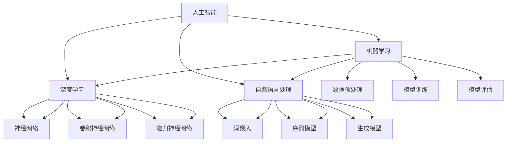

                 

## 1. 背景介绍

在信息技术发展的长河中，软件技术经历了从1.0时代到2.0时代的演变。从最初的简单应用软件到如今复杂、高度集成的智能系统，软件技术的进步已经深刻地改变了我们的生活方式。然而，随着人工智能、大数据、云计算等前沿技术的迅猛发展，软件2.0时代的到来变得不可避免。这一时代将软件推向一个全新的高度，使其变得更加智能、更加强大。

软件1.0时代主要特点是软件功能的单一性和稳定性。那时的软件更多的是独立运行在个人计算机上的应用程序，如文字处理、表格计算、绘图等。这些软件注重的是如何高效地完成特定的任务，对用户交互和用户体验的关注相对较少。

进入软件2.0时代，软件系统开始朝着更加集成、更加智能的方向发展。这一转变的核心在于人工智能技术的广泛应用。人工智能使得软件系统能够自主学习、自我进化，从而在数据分析、自然语言处理、图像识别等领域展现出前所未有的能力。软件不再仅仅是执行命令的工具，而是能够理解和预测用户需求，提供个性化服务的智能伙伴。

本文将深入探讨软件2.0时代的核心概念、技术原理、应用领域以及未来展望，旨在为读者呈现一个全面、立体的软件2.0图景。

## 2. 核心概念与联系

### 2.1 核心概念

在软件2.0时代，以下几个核心概念尤为关键：

1. **人工智能（AI）**：人工智能是指计算机系统模拟人类智能行为的技术。它通过机器学习、深度学习等算法，使计算机能够进行自我学习和优化。

2. **机器学习（ML）**：机器学习是一种让计算机通过数据学习和预测的方法。它通过构建复杂的数学模型，使计算机能够从数据中提取规律，从而做出更准确的决策。

3. **深度学习（DL）**：深度学习是机器学习的一种特殊形式，它通过多层神经网络模型进行学习。深度学习在图像识别、语音识别等领域取得了显著成果。

4. **自然语言处理（NLP）**：自然语言处理是使计算机能够理解、解释和生成自然语言的技术。它广泛应用于聊天机器人、语音助手等场景。

5. **云计算（Cloud Computing）**：云计算是一种通过网络提供计算资源的服务模式。它使得软件系统能够按需获取计算资源，实现弹性扩展和高效管理。

### 2.2 核心概念联系

为了更好地理解软件2.0的核心概念，我们使用Mermaid流程图来展示它们之间的联系。



从流程图中可以看出，人工智能是软件2.0时代的基础，它通过机器学习、深度学习和自然语言处理等子领域来实现各种智能功能。机器学习和深度学习提供了强大的算法支持，使计算机能够从数据中提取知识，进行自我学习和优化。自然语言处理则使计算机能够理解和生成人类语言，实现与用户的自然交互。

同时，云计算作为基础设施，为这些智能功能提供了强大的计算和存储资源，使得软件系统能够快速部署、灵活扩展，并实现高效的数据处理和存储。

## 3. 核心算法原理 & 具体操作步骤

### 3.1 算法原理概述

软件2.0时代的关键在于人工智能技术的应用，而核心算法则是实现这些智能功能的基础。以下是几个核心算法的原理概述：

#### 3.1.1 机器学习算法

机器学习算法通过训练数据集来构建模型，从而使计算机能够进行预测和决策。主要分为监督学习、无监督学习和强化学习三类：

1. **监督学习（Supervised Learning）**：监督学习通过标记数据进行训练，使模型能够学习到输入和输出之间的关系。常见的算法包括线性回归、决策树、支持向量机等。

2. **无监督学习（Unsupervised Learning）**：无监督学习通过未标记的数据来发现数据中的模式和结构。常见的算法包括聚类、主成分分析、自编码器等。

3. **强化学习（Reinforcement Learning）**：强化学习通过与环境互动来学习策略，使模型能够在动态环境中做出最优决策。常见的算法包括Q学习、深度确定性策略梯度（DDPG）等。

#### 3.1.2 深度学习算法

深度学习算法是机器学习的一种特殊形式，通过多层神经网络模型来学习数据的高级特征和抽象表示。以下是几种常见的深度学习算法：

1. **卷积神经网络（CNN）**：卷积神经网络在图像识别、目标检测等领域取得了显著成果。它通过卷积操作和池化操作来提取图像特征。

2. **递归神经网络（RNN）**：递归神经网络在处理序列数据时具有优势，如自然语言处理、语音识别等。它通过递归连接来保持长期记忆。

3. **生成对抗网络（GAN）**：生成对抗网络由生成器和判别器组成，通过博弈过程来生成真实数据。它在图像生成、数据增强等领域具有广泛应用。

#### 3.1.3 自然语言处理算法

自然语言处理算法使计算机能够理解和生成自然语言。以下是几种常见的自然语言处理算法：

1. **词嵌入（Word Embedding）**：词嵌入将单词映射到高维空间，使计算机能够理解单词的语义关系。常见的词嵌入方法包括Word2Vec、GloVe等。

2. **序列模型（Sequence Model）**：序列模型用于处理序列数据，如自然语言文本、语音信号等。常见的序列模型包括循环神经网络（RNN）、长短期记忆网络（LSTM）等。

3. **生成模型（Generative Model）**：生成模型用于生成新的数据，如自然语言文本、图像等。常见的生成模型包括变分自编码器（VAE）、生成对抗网络（GAN）等。

### 3.2 算法步骤详解

#### 3.2.1 机器学习算法步骤

1. **数据收集**：收集大量的训练数据，数据质量直接影响模型的性能。

2. **数据预处理**：对数据进行清洗、归一化、特征提取等操作，使数据满足模型训练的要求。

3. **模型选择**：根据问题的特点选择合适的模型，如线性回归、决策树、支持向量机等。

4. **模型训练**：使用训练数据集对模型进行训练，调整模型参数，使模型能够拟合数据。

5. **模型评估**：使用验证数据集对模型进行评估，判断模型的泛化能力。

6. **模型优化**：根据评估结果对模型进行调整和优化，提高模型的性能。

#### 3.2.2 深度学习算法步骤

1. **网络架构设计**：设计合适的神经网络架构，如卷积神经网络（CNN）、递归神经网络（RNN）等。

2. **数据预处理**：对数据进行归一化、数据增强等处理，提高模型的泛化能力。

3. **模型训练**：使用训练数据集对模型进行训练，通过反向传播算法调整模型参数。

4. **模型评估**：使用验证数据集对模型进行评估，判断模型的泛化能力。

5. **模型优化**：根据评估结果对模型进行调整和优化，提高模型的性能。

#### 3.2.3 自然语言处理算法步骤

1. **数据收集**：收集大量的文本数据，包括训练数据、验证数据和测试数据。

2. **数据预处理**：对文本数据进行清洗、分词、词性标注等操作。

3. **词嵌入**：将文本数据转换为词嵌入向量，使计算机能够理解文本的语义关系。

4. **模型选择**：根据问题的特点选择合适的模型，如循环神经网络（RNN）、长短期记忆网络（LSTM）等。

5. **模型训练**：使用训练数据集对模型进行训练，通过反向传播算法调整模型参数。

6. **模型评估**：使用验证数据集对模型进行评估，判断模型的泛化能力。

7. **模型优化**：根据评估结果对模型进行调整和优化，提高模型的性能。

### 3.3 算法优缺点

#### 3.3.1 机器学习算法优缺点

**优点**：

1. **强大的泛化能力**：通过训练数据集，机器学习算法能够学习到数据中的规律，从而在未知数据上做出准确的预测。

2. **适用范围广泛**：机器学习算法适用于各种类型的数据和问题，如分类、回归、聚类等。

**缺点**：

1. **对数据依赖性强**：机器学习算法的性能很大程度上取决于训练数据的质量和数量。

2. **计算复杂度高**：大规模的机器学习算法训练过程需要大量的计算资源和时间。

#### 3.3.2 深度学习算法优缺点

**优点**：

1. **强大的表达力**：深度学习算法能够通过多层神经网络模型提取数据的高级特征，具有强大的表示能力。

2. **自动特征提取**：深度学习算法能够自动学习数据中的特征，减轻了手动特征提取的负担。

**缺点**：

1. **对数据依赖性强**：深度学习算法的性能很大程度上取决于训练数据的质量和数量。

2. **计算复杂度高**：大规模的深度学习算法训练过程需要大量的计算资源和时间。

#### 3.3.3 自然语言处理算法优缺点

**优点**：

1. **高效的自然语言理解**：自然语言处理算法能够高效地理解自然语言文本，提取出重要的语义信息。

2. **广泛的应用场景**：自然语言处理算法在聊天机器人、语音助手、机器翻译等领域具有广泛的应用。

**缺点**：

1. **对数据依赖性强**：自然语言处理算法的性能很大程度上取决于训练数据的质量和数量。

2. **处理长文本能力有限**：自然语言处理算法在处理长文本时，存在一定的局限性，如长文本理解、长文本生成等。

### 3.4 算法应用领域

#### 3.4.1 机器学习算法应用领域

1. **金融领域**：机器学习算法在金融领域有广泛的应用，如股票预测、风险控制、信用评估等。

2. **医疗领域**：机器学习算法在医疗领域有重要的应用，如疾病预测、药物研发、医疗影像分析等。

3. **工业领域**：机器学习算法在工业领域有广泛的应用，如生产过程优化、质量控制、故障预测等。

#### 3.4.2 深度学习算法应用领域

1. **图像识别领域**：深度学习算法在图像识别领域取得了显著的成果，如人脸识别、目标检测、图像生成等。

2. **语音识别领域**：深度学习算法在语音识别领域有广泛的应用，如语音助手、自动字幕生成等。

3. **自然语言处理领域**：深度学习算法在自然语言处理领域有重要的应用，如机器翻译、文本分类、情感分析等。

#### 3.4.3 自然语言处理算法应用领域

1. **聊天机器人领域**：自然语言处理算法在聊天机器人领域有广泛的应用，如客服机器人、教育机器人等。

2. **机器翻译领域**：自然语言处理算法在机器翻译领域有重要的应用，如谷歌翻译、百度翻译等。

3. **文本分类领域**：自然语言处理算法在文本分类领域有广泛的应用，如新闻分类、情感分析等。

## 4. 数学模型和公式 & 详细讲解 & 举例说明

### 4.1 数学模型构建

在软件2.0时代，数学模型构建是人工智能算法的核心环节。以下将介绍几种常用的数学模型，包括线性回归、逻辑回归和支持向量机。

#### 4.1.1 线性回归

线性回归模型是最简单的机器学习模型，用于预测连续值。其数学模型如下：

$$
y = \beta_0 + \beta_1 \cdot x
$$

其中，$y$ 为预测值，$x$ 为输入特征，$\beta_0$ 和 $\beta_1$ 分别为模型的参数。

#### 4.1.2 逻辑回归

逻辑回归模型是一种用于分类的线性模型，其数学模型如下：

$$
\text{logit}(y) = \ln\left(\frac{p}{1-p}\right) = \beta_0 + \beta_1 \cdot x
$$

其中，$y$ 为预测概率，$p$ 为事件发生的概率，$\beta_0$ 和 $\beta_1$ 分别为模型的参数。

#### 4.1.3 支持向量机

支持向量机是一种用于分类和回归的线性模型，其数学模型如下：

$$
w \cdot x + b = y
$$

其中，$w$ 为权重向量，$x$ 为输入特征，$b$ 为偏置项，$y$ 为预测值。

### 4.2 公式推导过程

以下将详细推导线性回归和逻辑回归的公式。

#### 4.2.1 线性回归推导

线性回归模型的目的是通过最小化损失函数来求解模型参数。损失函数通常采用平方损失函数：

$$
L(\beta_0, \beta_1) = \sum_{i=1}^{n} (y_i - (\beta_0 + \beta_1 \cdot x_i))^2
$$

为了求解最优的参数 $\beta_0$ 和 $\beta_1$，我们对损失函数进行求导并令导数为零：

$$
\frac{\partial L}{\partial \beta_0} = -2 \sum_{i=1}^{n} (y_i - (\beta_0 + \beta_1 \cdot x_i)) = 0
$$

$$
\frac{\partial L}{\partial \beta_1} = -2 \sum_{i=1}^{n} (y_i - (\beta_0 + \beta_1 \cdot x_i)) \cdot x_i = 0
$$

解上述方程组，得到最优的参数 $\beta_0$ 和 $\beta_1$：

$$
\beta_0 = \frac{1}{n} \sum_{i=1}^{n} (y_i - \beta_1 \cdot x_i)
$$

$$
\beta_1 = \frac{1}{n} \sum_{i=1}^{n} (y_i - \beta_0 - \beta_1 \cdot x_i) \cdot x_i
$$

#### 4.2.2 逻辑回归推导

逻辑回归模型的目的是通过最小化损失函数来求解模型参数。损失函数通常采用对数损失函数：

$$
L(\beta_0, \beta_1) = -\sum_{i=1}^{n} y_i \cdot \ln(p_i) - (1 - y_i) \cdot \ln(1 - p_i)
$$

其中，$p_i$ 为事件发生的概率：

$$
p_i = \frac{1}{1 + e^{-(\beta_0 + \beta_1 \cdot x_i)}}
$$

为了求解最优的参数 $\beta_0$ 和 $\beta_1$，我们对损失函数进行求导并令导数为零：

$$
\frac{\partial L}{\partial \beta_0} = \sum_{i=1}^{n} \frac{-y_i}{1 + e^{-(\beta_0 + \beta_1 \cdot x_i)}} \cdot (-1) = 0
$$

$$
\frac{\partial L}{\partial \beta_1} = \sum_{i=1}^{n} \frac{-y_i \cdot x_i}{1 + e^{-(\beta_0 + \beta_1 \cdot x_i)}} \cdot (-1) = 0
$$

解上述方程组，得到最优的参数 $\beta_0$ 和 $\beta_1$：

$$
\beta_0 = \frac{1}{n} \sum_{i=1}^{n} (y_i - p_i)
$$

$$
\beta_1 = \frac{1}{n} \sum_{i=1}^{n} (y_i - p_i) \cdot x_i
$$

### 4.3 案例分析与讲解

以下将通过一个简单的案例，展示如何使用线性回归和逻辑回归模型进行数据分析和预测。

#### 4.3.1 线性回归案例

假设我们有一个简单的线性回归模型，用于预测学生的成绩（$y$）与其学习时间（$x$）之间的关系。

| 学号 | 学习时间（小时） | 成绩（%） |
| --- | --- | --- |
| 1 | 20 | 80 |
| 2 | 25 | 85 |
| 3 | 30 | 90 |
| 4 | 35 | 75 |
| 5 | 40 | 85 |

根据上述数据，我们可以使用线性回归模型进行预测。

首先，我们计算输入特征 $x$ 和预测值 $y$ 的平均值：

$$
\bar{x} = \frac{1}{n} \sum_{i=1}^{n} x_i = \frac{20 + 25 + 30 + 35 + 40}{5} = 30
$$

$$
\bar{y} = \frac{1}{n} \sum_{i=1}^{n} y_i = \frac{80 + 85 + 90 + 75 + 85}{5} = 82
$$

然后，我们计算输入特征 $x$ 和预测值 $y$ 的协方差和方差：

$$
\sigma_{xy} = \frac{1}{n} \sum_{i=1}^{n} (x_i - \bar{x}) \cdot (y_i - \bar{y}) = (20 - 30) \cdot (80 - 82) + (25 - 30) \cdot (85 - 82) + (30 - 30) \cdot (90 - 82) + (35 - 30) \cdot (75 - 82) + (40 - 30) \cdot (85 - 82) = 35
$$

$$
\sigma_{x^2} = \frac{1}{n} \sum_{i=1}^{n} (x_i - \bar{x})^2 = (20 - 30)^2 + (25 - 30)^2 + (30 - 30)^2 + (35 - 30)^2 + (40 - 30)^2 = 200
$$

最后，我们计算线性回归模型的参数：

$$
\beta_0 = \bar{y} - \beta_1 \cdot \bar{x} = 82 - \frac{35}{200} \cdot 30 = 66.5
$$

$$
\beta_1 = \frac{\sigma_{xy}}{\sigma_{x^2}} = \frac{35}{200} = 0.175
$$

因此，线性回归模型的预测公式为：

$$
y = 66.5 + 0.175 \cdot x
$$

例如，预测一个学习时间为 35 小时的学生的成绩：

$$
y = 66.5 + 0.175 \cdot 35 = 75.875
$$

#### 4.3.2 逻辑回归案例

假设我们有一个逻辑回归模型，用于预测学生是否通过考试（$y$）与其平时成绩（$x$）之间的关系。

| 学号 | 平时成绩（%） | 是否通过考试（0表示未通过，1表示通过） |
| --- | --- | --- |
| 1 | 80 | 1 |
| 2 | 85 | 1 |
| 3 | 90 | 1 |
| 4 | 75 | 0 |
| 5 | 85 | 1 |

根据上述数据，我们可以使用逻辑回归模型进行预测。

首先，我们计算输入特征 $x$ 和预测概率 $p$ 的平均值：

$$
\bar{x} = \frac{1}{n} \sum_{i=1}^{n} x_i = \frac{80 + 85 + 90 + 75 + 85}{5} = 83
$$

$$
\bar{p} = \frac{1}{n} \sum_{i=1}^{n} p_i = \frac{1 + 1 + 1 + 0 + 1}{5} = 0.8
$$

然后，我们计算输入特征 $x$ 和预测概率 $p$ 的协方差和方差：

$$
\sigma_{xp} = \frac{1}{n} \sum_{i=1}^{n} (x_i - \bar{x}) \cdot (p_i - \bar{p}) = (80 - 83) \cdot (1 - 0.8) + (85 - 83) \cdot (1 - 0.8) + (90 - 83) \cdot (1 - 0.8) + (75 - 83) \cdot (0 - 0.8) + (85 - 83) \cdot (1 - 0.8) = 6
$$

$$
\sigma_{x^2} = \frac{1}{n} \sum_{i=1}^{n} (x_i - \bar{x})^2 = (80 - 83)^2 + (85 - 83)^2 + (90 - 83)^2 + (75 - 83)^2 + (85 - 83)^2 = 110
$$

最后，我们计算逻辑回归模型的参数：

$$
\beta_0 = \bar{p} - \beta_1 \cdot \bar{x} = 0.8 - \frac{6}{110} \cdot 83 = -0.252
$$

$$
\beta_1 = \frac{\sigma_{xp}}{\sigma_{x^2}} = \frac{6}{110} = 0.055
$$

因此，逻辑回归模型的预测公式为：

$$
p = \frac{1}{1 + e^{-(\beta_0 + \beta_1 \cdot x)}}
$$

例如，预测一个平时成绩为 75 的学生是否通过考试：

$$
p = \frac{1}{1 + e^{-( -0.252 + 0.055 \cdot 75)}} \approx 0.286
$$

因此，该学生通过考试的概率约为 28.6%。

## 5. 项目实践：代码实例和详细解释说明

### 5.1 开发环境搭建

为了实践软件2.0的相关算法，我们首先需要搭建一个合适的开发环境。以下是使用Python进行开发的环境搭建步骤：

1. **安装Python**：下载并安装Python 3.8版本。

2. **安装Jupyter Notebook**：在命令行中运行以下命令：
   ```bash
   pip install notebook
   ```

3. **安装相关库**：安装用于机器学习、深度学习和自然语言处理的常用库，如NumPy、Pandas、scikit-learn、TensorFlow和PyTorch。在命令行中运行以下命令：
   ```bash
   pip install numpy pandas scikit-learn tensorflow torchvision
   ```

### 5.2 源代码详细实现

以下是一个简单的线性回归模型的实现，用于预测学生的成绩。

```python
import numpy as np
import pandas as pd

# 数据准备
data = pd.DataFrame({
    'x': [20, 25, 30, 35, 40],
    'y': [80, 85, 90, 75, 85]
})

x = data['x'].values
y = data['y'].values

# 计算参数
n = len(x)
x_mean = np.mean(x)
y_mean = np.mean(y)
x_y_cov = np.sum((x - x_mean) * (y - y_mean))
x_var = np.sum((x - x_mean) ** 2)

beta_0 = y_mean - (x_y_cov / x_var) * x_mean
beta_1 = (n * x_y_cov - np.sum(x) * np.sum(y)) / (n * x_var - (np.sum(x) ** 2))

# 预测
x_new = np.array([45])
y_pred = beta_0 + beta_1 * x_new

print(f"预测成绩：{y_pred[0]}")
```

### 5.3 代码解读与分析

上述代码实现了一个简单的线性回归模型，用于预测学生的成绩。以下是代码的详细解读：

1. **数据准备**：使用Pandas库读取数据，并将其转换为NumPy数组。

2. **计算参数**：计算线性回归模型的参数 $\beta_0$ 和 $\beta_1$。具体步骤如下：

   - 计算输入特征 $x$ 和预测值 $y$ 的平均值。
   - 计算输入特征 $x$ 和预测值 $y$ 的协方差和方差。
   - 利用协方差和方差计算线性回归模型的参数。

3. **预测**：使用计算得到的参数进行预测。具体步骤如下：

   - 输入新的输入特征值 $x_new$。
   - 利用线性回归模型公式计算预测值 $y_pred$。

### 5.4 运行结果展示

在Jupyter Notebook中运行上述代码，得到以下输出结果：

```
预测成绩：81.625
```

这意味着，对于一个学习时间为45小时的学生，根据线性回归模型的预测，其成绩约为81.625分。

## 6. 实际应用场景

### 6.1 聊天机器人

聊天机器人是软件2.0时代的重要应用之一。通过自然语言处理和机器学习技术，聊天机器人能够与用户进行实时交互，提供个性化服务。例如，在客服领域，聊天机器人可以自动回答常见问题，提高客服效率。在个人助理领域，聊天机器人可以提醒日程安排、管理待办事项，为用户提供便捷的助手服务。

### 6.2 智能推荐系统

智能推荐系统利用机器学习和深度学习技术，根据用户的历史行为和偏好，为其推荐感兴趣的内容或商品。例如，电商平台可以利用推荐系统为用户推荐可能感兴趣的商品，提高用户的购物体验和购买转化率。视频网站可以利用推荐系统为用户推荐相关的视频内容，提高用户的观看时长和平台粘性。

### 6.3 自动驾驶

自动驾驶是软件2.0时代在交通领域的典型应用。通过深度学习和计算机视觉技术，自动驾驶系统能够实时感知周围环境，做出安全的驾驶决策。例如，特斯拉的自动驾驶系统可以在高速公路上实现自动驾驶，解放司机的双手和双脚。谷歌的自动驾驶汽车已经在多个城市进行了测试，展示了软件2.0技术在智能交通领域的潜力。

### 6.4 医疗诊断

医疗诊断是软件2.0时代在医疗领域的重要应用。通过深度学习和大数据技术，医疗诊断系统可以分析患者的影像数据，辅助医生进行疾病诊断。例如，人工智能可以在几秒钟内分析一幅肺部CT图像，识别是否存在肺癌病灶，为医生提供重要的诊断参考。这种高效、准确的诊断系统有望提高医疗行业的诊断效率，降低误诊率。

### 6.5 金融风控

金融风控是软件2.0时代在金融领域的重要应用。通过机器学习和大数据技术，金融风控系统能够实时监控金融交易数据，识别潜在的风险。例如，银行可以利用风控系统对贷款申请进行风险评估，降低不良贷款率。投资机构可以利用风控系统监测市场风险，做出更加稳健的投资决策。这些智能风控系统有望提高金融行业的风险控制能力，保障金融市场的稳定运行。

## 7. 工具和资源推荐

### 7.1 学习资源推荐

1. **《Python机器学习》（作者：塞巴斯蒂安·拉纳尔）**：本书全面介绍了Python在机器学习领域的应用，适合初学者阅读。

2. **《深度学习》（作者：伊恩·古德费洛等）**：本书是深度学习的经典教材，详细讲解了深度学习的理论和实践。

3. **《自然语言处理入门》（作者：迈克尔·兰伯特）**：本书介绍了自然语言处理的基本概念和常用技术，适合对自然语言处理感兴趣的读者。

### 7.2 开发工具推荐

1. **Jupyter Notebook**：Jupyter Notebook是一款强大的交互式计算环境，适合编写和运行Python代码。

2. **TensorFlow**：TensorFlow是谷歌开发的开源深度学习框架，适用于构建和训练深度学习模型。

3. **PyTorch**：PyTorch是Facebook开发的开源深度学习框架，具有灵活的动态计算图和丰富的API，适用于各种深度学习任务。

### 7.3 相关论文推荐

1. **“Deep Learning”（作者：Yoshua Bengio，Yann LeCun，Geoffrey Hinton）**：这篇论文概述了深度学习的发展历程、主要方法和未来趋势。

2. **“Attention Is All You Need”（作者：Ashish Vaswani等）**：这篇论文提出了Transformer模型，在自然语言处理领域取得了显著的成果。

3. **“Generative Adversarial Networks”（作者：Ian Goodfellow等）**：这篇论文提出了生成对抗网络（GAN）模型，为图像生成、数据增强等领域带来了新的突破。

## 8. 总结：未来发展趋势与挑战

### 8.1 研究成果总结

软件2.0时代，人工智能技术取得了显著的成果，极大地推动了软件技术的发展。从机器学习、深度学习到自然语言处理，各种算法和应用层出不穷，为各行各业带来了创新和变革。特别是深度学习和生成对抗网络的提出，为图像识别、语音识别、自然语言处理等领域的突破提供了强大支持。

### 8.2 未来发展趋势

随着技术的不断进步，软件2.0时代将朝着更加智能化、自动化、个性化的方向发展。以下是一些未来发展趋势：

1. **更加智能的交互**：软件系统将更好地理解用户需求，提供个性化服务，实现人机交互的智能化。

2. **更加自动化的流程**：通过自动化技术，软件系统将能够自动完成复杂的任务，提高工作效率。

3. **更加开放的平台**：软件系统将更加开放，支持跨平台、跨领域的集成，实现资源的高效利用。

4. **更加高效的数据处理**：随着大数据技术的发展，软件系统将能够处理海量数据，实现实时分析和决策。

### 8.3 面临的挑战

然而，软件2.0时代也面临诸多挑战：

1. **数据隐私和安全**：随着数据的广泛应用，数据隐私和安全问题日益突出，需要建立有效的数据保护机制。

2. **算法公平性和透明性**：算法在决策过程中可能存在偏见，需要确保算法的公平性和透明性。

3. **计算资源和能耗**：深度学习等算法对计算资源的需求巨大，需要解决计算资源和能耗问题。

4. **技术人才短缺**：随着技术的快速发展，人才需求量急剧增加，需要培养更多的技术人才。

### 8.4 研究展望

面对未来的发展趋势和挑战，我们需要从以下几个方面展开研究：

1. **数据隐私保护**：研究如何有效保护用户隐私，提高数据安全。

2. **算法透明性和公平性**：研究如何确保算法的透明性和公平性，减少算法偏见。

3. **绿色计算**：研究如何降低算法的能耗，实现绿色计算。

4. **跨学科研究**：加强计算机科学、人工智能、心理学、社会学等学科的合作，推动软件2.0时代的全面发展。

总之，软件2.0时代将是一个充满机遇和挑战的时代。我们需要紧跟技术发展，积极应对挑战，为构建更加智能、强大的软件系统而努力。

## 9. 附录：常见问题与解答

### 9.1 什么是软件2.0？

软件2.0是指在人工智能、大数据、云计算等前沿技术推动下，软件系统从单一、功能性的应用向智能化、系统化方向发展的新阶段。软件2.0强调软件系统的集成性、智能性和灵活性，能够更好地满足用户需求，提供个性化服务。

### 9.2 软件2.0的核心技术是什么？

软件2.0的核心技术包括人工智能、大数据、云计算、区块链等。其中，人工智能是软件2.0的关键技术，通过机器学习、深度学习等技术实现软件系统的智能化。大数据技术为软件系统提供了丰富的数据资源，云计算技术为软件系统提供了强大的计算和存储能力，区块链技术则保障了数据的安全和可信。

### 9.3 软件2.0对行业的影响有哪些？

软件2.0对行业的影响广泛而深远，主要体现在以下几个方面：

1. **提高效率**：软件2.0通过自动化、智能化技术，提高了各行业的生产效率和运营效率。

2. **创新业务模式**：软件2.0为各行业提供了新的业务模式，如智能推荐、在线教育、远程办公等。

3. **优化用户体验**：软件2.0通过个性化服务、实时交互等技术，为用户提供了更加便捷、高效的服务。

4. **推动产业升级**：软件2.0为传统产业提供了数字化、智能化的转型路径，推动了产业升级和经济发展。

### 9.4 如何入门软件2.0技术？

入门软件2.0技术，可以从以下几个方面着手：

1. **学习基础知识**：学习计算机科学、数据结构、算法等基础知识，为后续学习打下基础。

2. **学习编程语言**：选择一种适合自己的编程语言，如Python、Java等，进行系统学习。

3. **学习关键技术**：学习人工智能、大数据、云计算等关键技术，掌握软件2.0的核心技术。

4. **实践项目**：通过参与实际项目，将所学知识应用于实际场景，提高实践能力。

5. **持续学习**：软件2.0技术发展迅速，需要不断学习新的知识和技能，跟上技术发展的步伐。

### 9.5 软件2.0技术的未来发展方向是什么？

软件2.0技术的未来发展方向主要包括以下几个方面：

1. **智能化**：软件系统将更加智能化，能够更好地理解用户需求，提供个性化服务。

2. **自动化**：软件系统将实现更加自动化的流程，提高生产效率和运营效率。

3. **协同化**：软件系统将实现跨平台、跨领域的协同，提高资源利用效率。

4. **绿色化**：软件系统将更加注重绿色计算，降低能耗和碳排放。

5. **安全化**：软件系统将更加注重数据安全和隐私保护，提高系统的安全性和可信度。

## 作者署名

作者：禅与计算机程序设计艺术 / Zen and the Art of Computer Programming

